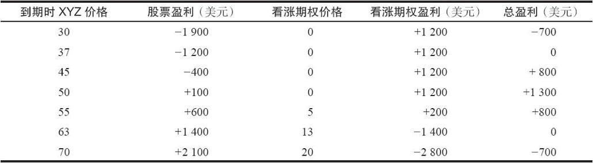
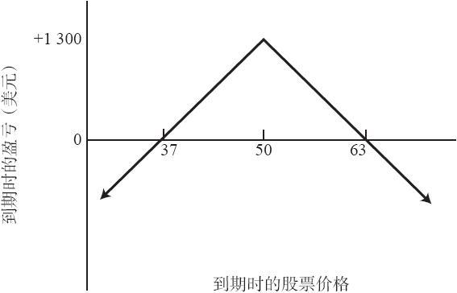
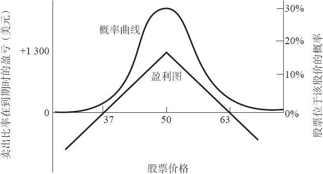

# 6.1　卖出看涨期权比率

简单地说，卖出看涨期权比率（ratio call writing）是这样一种策略，投资者持有一定数量的标的股票，同时他卖出了更多股数的看涨期权。因此，卖出的看涨期权所对应的股数与已持有的股数之间就有了一个比率。最常见的比率是2：1，在这种比率上，投资者持有100股标的股票，同时卖出2手看涨期权。请注意，这类头寸涉及卖出一定数量的裸期权以及一定数量的备兑期权。由此而产生的头寸，既有卖出备兑看涨期权时的下行风险，又有裸卖出时的无限上行风险。如果标的股票价格在期权存续期内保持相对无变化，卖出看涨期权比率的盈利会比只卖出备兑看涨期权和只卖出裸看涨期权都要大得多。不过与卖出备兑看涨期权和裸看涨期权不一样，卖出看涨期权比率在两个方向上都面临风险。

一般而言，某个投资者在建立卖出看涨期权比率头寸的时候，他应当对标的股票的前景保持中立。这就是说，他卖出的是行权价最接近当前股票价格的看涨期权。

【示例6-1】通过按49买入100股XYZ股票，同时按每手6点卖出2手XYZ 10月50看涨期权来建立一个卖出看涨期权比率头寸。如果XYZ下跌，价格在10月到期时为50以下，看涨期权就会无价值到期，卖出者从卖出期权中得到12点盈利。如果XYZ跌了12点，价格到了37，这个看涨期权比率卖出者就盈亏平衡。从股票中损失的12点从期权中得到的12点补回来了。同所有其他卖出看涨期权的策略一样，最大盈利出现在股票价格在期权到期时等于行权价的时候。在本例中，如果XYZ在到期时是50，看涨期权无价值到期，盈利12点，卖出者在股票上因为价格从49运动到50而有1点盈利，他的总盈利就会是13点。因此，这个头寸在下行方面有充足的保护，同时潜在盈利也相对更大。如果XYZ在到期时价格上涨到了50以上，盈利就会减小，股票涨得太高甚至还会出现亏损。要说明这一点，假设XYZ价格在10月到期时是63，看涨期权每手价值13点，因为最初是以每手6点卖出的，因而每手亏损7点。但是，由于股票从49涨到了63，于是就会有14点盈利。在股票价格是63的时候，总的交易结果是盈亏平衡，也就是期权中的14点（每手7点）亏损抵消了股票中的14点盈利。表6-1和图6-1总结了这个示例在10月到期日时的潜在盈亏。盈利图形与屋顶的形状有点相似，顶部位于卖出的看涨期权的行权价，也就是50。显然，高于63这个头寸就有很大的上行风险，而低于37这个头寸就有很大的下行风险。因此非常重要的一点是，一旦股票的运动超出了这两个价格，投资者应当事先有后续行动计划。我们在后面会讨论后续计划。如果股票的价格保持在37~63之间，不计手续费，他都会有一定数额的盈利。介于下行盈亏平衡点和上行盈亏平衡点之间的区域叫作盈利区域。

表6-1　10月到期时的盈亏

这个示例本质上是一个中性头寸。除非股票在10月看涨期权到期前跌幅超过12点或者涨幅超过14点，否则这个卖出比率者都有盈利。这个策略常常吸引人去使用它，因为一般在3~6个月的时间段内，股票运动的幅度不会这么大。所以，使用这个策略而得到一笔有限盈利的可能性相当高。当然，实际的盈利要减去手续费，如果股票是用保证金买的，还要减去保证金利息。

图6-1　卖出看涨期权比率（2：1）

在讨论卖出看涨期权比率的所需投资、选择标准和后续行动等细节之前，首先对关于这个策略的两种相当普遍的反对意见进行一些反驳也许是有好处的。第一种反对意见在今天已经不像在场内期权刚开始交易时那样普遍了，它说：“干吗费神买入100股股票，再卖出2手看涨期权？你将有1手裸看涨期权。那为什么不干脆直接卖1手裸期权呢？”卖出看涨期权比率的策略与卖出裸看涨期权的策略之间的相同点很少，它们唯一的共同之处是都有上行方向的风险。卖出裸看涨期权的盈利图形（见图5-1）同卖出看涨期权比率的屋顶形盈利图（见图6-1）之间没有相似之处。很明显，这两种策略在潜在盈利以及其他许多方面都相当不同。

第二种意见稍微有理一些，它反对保守的投资者使用卖出看涨期权比率策略。保守的投资者对持有一旦股票价格上升就会有风险的头寸也许会感到不舒服。这可能是决定是否采用卖出看涨期权比率策略的一个心理因素。当股票价格上升，所有持有股票的人都觉得开心而且有利可图，卖出比率者则面临亏损的风险。不过，纯粹从策略的角度来说，为了换得在标的股票价格上升幅度不大的情况下获得较大盈利的机会，投资者应当愿意承担一定的上行方向风险。备兑卖出者对上行风险的保护是无限的，也就是说，他根本没有上行方向风险。从数学上讲，这并不是一种较优的选择，因为股票价格不可能无限地上涨。相比起来，卖出比率者所使用的是这样一种策略，它的盈利区域与股票的实际行为更为相近。事实上，如果投资者试图要建立一个较优的策略，他应当将这个策略的最大盈利同这个股票运动的最可能结果保持一致。卖出比率就是这样一种策略。

图6-2　同卖出比率盈利图形重叠的股票运动概率曲线

图6-2显示了一个股票运动的简单概率曲线。最可能的结果是股价保持相对无变化，并且股价上下大幅变动的可能性非常之小。现在，将卖出比率策略的结果与股票可能的运动结果图形进行比较。请注意，卖出比率与股票运动概率曲线的“顶峰”在同一个区域，也就是说，卖出比率的盈利区域是在股价最有可能出现的范围之内。因为在一个固定的时段内，股票出现大幅度上涨或下跌的机会很小。大额的亏损出现在图形的边缘，在那里，概率曲线走得很低，概率接近于零。应当注意，这些图形所显示的是在到期日时的盈利和概率。在到期日之前，盈亏平衡点更接近于原始的购买价格，因为卖出的期权中仍然留有一定的时间价值。
