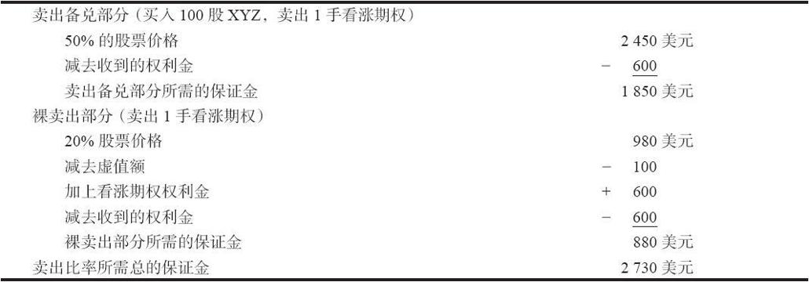
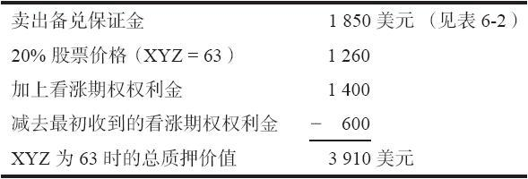

# 6.2　所需投资

卖出比率是卖出备兑和裸卖出的组合。我们在前面描述了这两个策略各自所需的保证金，1手卖出比率所需的保证金就是1手裸卖出和1手卖出备兑所需要的保证金之和。卖出比率一般是用保证金账户来建立的，虽然从技术上说，投资者也可以将股票放在一个现金账户里。

【示例6-2】不计手续费，可以用下面的方法来计算所需投资。按49买入100股XYZ，50%的保证金；同时按每手6点卖出2手XYZ 10月50看涨期权（见表6-2）。买入股票和卖出看涨期权的手续费会加在保证金之上。使用一个较短的公式（见表6-3）也许更好一些。它不过是把表6-2列举的各项所需投资加在了一起。

表6-2　所需投资

表6-3　卖出比率所需初始投资

在进行卖出看涨期权比率的交易时，除了基本的保证金要求之外，还会有最低资产要求和维持保证金要求，因为这里涉及裸看涨期权。不同经纪公司的要求会有所不同，因此，卖出比率者最好事先询问他的经纪人，了解最低资产要求和维持保证金是多少。同样，因为卖出比率涉及裸看涨期权，这个头寸会被逐日盯市。如果股票价格上涨，投资者就必须存入更多的质押物。

可以想见，只要股价不穿过63的上行盈亏平衡点，卖出比率者就会继续持有他最初的头寸。因此，他应当准备足够的质押物以应付股票涨到63的可能性。假定在这样的情况里，10月50看涨期权会是14，他将需要3910美元（见表6-4）。卖出比率者所应当关心的是这个保证金要求，而不是初始的质押要求，因此，他应当计划在这个头寸里投入3910美元，而不是2730美元（初始保证金）。虽然在建立头寸时他只需拿出2730美元，但从策略家的角度来看，他应当为这个头寸准备3910美元。如果这个卖出比率者对他所有的头寸都做到了这一点，那即使他投资组合中的所有股票都上涨到了它们的上行盈亏平衡点，他也不会收到保证金追加通知。

表6-4　上行盈亏平衡点为63时所需质押

