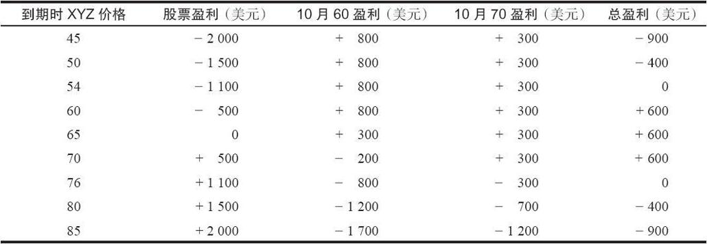
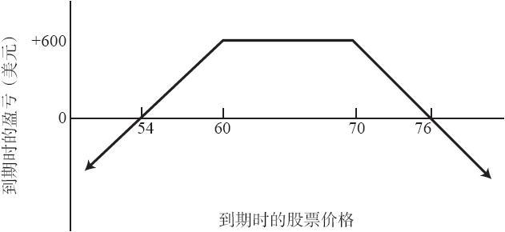

# 6.4　卖出变量比率

在卖出比率中，投资者一般喜欢在股票价格基本等于看涨期权行权价的时候建立头寸。不过，有的时候股票价格几乎刚好在两个行权价之间，无论是虚值还是实值的看涨期权都不能提供中性的盈利区域。如果是这样，并且投资者仍然想要以2：1的比率建立卖出看涨期权比率头寸，那这时他可以就买入的100股普通股股票分别卖出1手实值看涨期权和1手虚值看涨期权。这种策略常被称为合成跨式空头（synthetic short straddle），也被称为卖出变量比率（variable ratio write）或梯形对冲（trapezoidal hedge）。

【示例6-6】有这样一些价格：XYZ普通股股票，每股65；XYZ 10月60看涨期权，每手8；XYZ 10月70看涨期权，每手3。

如果投资者只使用XYZ 10月60看涨期权来建立一个2：1的卖出比率，他就会有一个略为看空的头寸。他的盈利区域在到期日时就会是49~71。因为股票的价格已经是65，这就意味着他在下行方向有16点的空间，而在上行方向只有6点的空间。这当然不是中性的。另一方面，如果他在卖出比率中只用XYZ 10月70看涨期权，那他就会有一个看多的头寸。这个10月70卖出比率到期时的盈利区域是59~81。在这种情况里，相对于股票价格与上行盈亏平衡点的距离，股票价格离下行盈亏平衡点的距离就太近了。

如果买入100股XYZ，同时卖出1手10月60看涨期权和1手10月70看涨期权，就可以建立一个较为中性的头寸。这个头寸的盈利区域以当前股票价格为中心。此外，同其他普通卖出比率一样，这个新头寸既有下行方向的风险，也有上行方向的风险。不过，在到期日时，只要股票价格在这两个行权价之间，交易者就能得到最大盈利。要说明这一点，请注意一下，如果XYZ的价格在到期时处于60~70之间的任何价位，卖出的10月60看涨期权会被指派，股票按60的价格卖出，而10月70看涨期权则将无价值到期。无论股票价格是61还是69都没有区别，结果都是一样的。表6-5和图6-3显示了这个合成跨式空头在到期时的结果。在表6-5中，期权假设是按持平价买回平仓的，不过即使看涨期权被指派行权，结果也是一样。

请注意，图6-3中的形状像是一个梯形。这就是“梯形对冲”这个名称的由来。不过这个策略更响亮的名字是合成宽跨式空头（synthetic short strangle）或变量卖出比率。读者应当注意到，只要股价在到期时介于两个行权价之间，这个策略就能实现最大盈利。这个头寸的最大潜在盈利是600美元，比只卖出10月60或10月70的最大潜在盈利要小。但是，变量卖出比率实现最大潜在盈利的概率比普通卖出比率要高得多。请注意，图6-3中的盈利图形刚好是图4-3中合成宽跨式多头的盈利图形的反面。

表6-5　变量对冲到期时的结果

图6-3　卖出变量比率（梯形对冲）

针对合成宽跨式空头，先计算出最大潜在盈利（等于期权卖出时收到的时间价值），然后就能快速地计算出盈亏平衡点。在计算出最大潜在盈利之后，从较低的行权价直接减去最大盈利点，就得出下行盈亏平衡点；在较高的行权价上加上最大盈利点，就得出上行盈亏平衡点。这与普通卖出比率所用的程序是相似的：

最大盈利点=总的期权权利金+较低行权价-股票价格

下行盈亏平衡点=较低行权价-最大盈利点

上行盈亏平衡点=较高行权价+最大盈利点

将上面示例中的数字代入这个公式，就可以核实它的正确性。期权权利金的总收入是11点（8点来自10月60，3点来自10月70），股票的价格是65，两个看涨期权的行权价分别是60和70。则：

最大盈利点=11+60-65=6

下行盈亏平衡点=60-6=54

上行盈亏平衡点=70+6=76

因此，从这个公式里计算出的盈亏平衡点同表6-5和图6-3是相符的。请注意，这个公式只有在股票最初是在两个行权价之间，并且比率是2：1时才适用。如果股票的价格比两个行权价都高，那么这个公式就是不正确的。不过，卖出者不应当用两个实值看涨期权来建立1手变量卖出比率。
