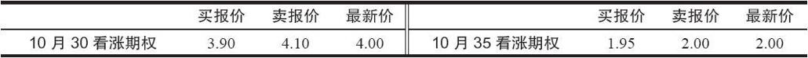
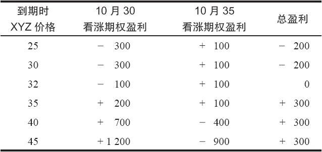
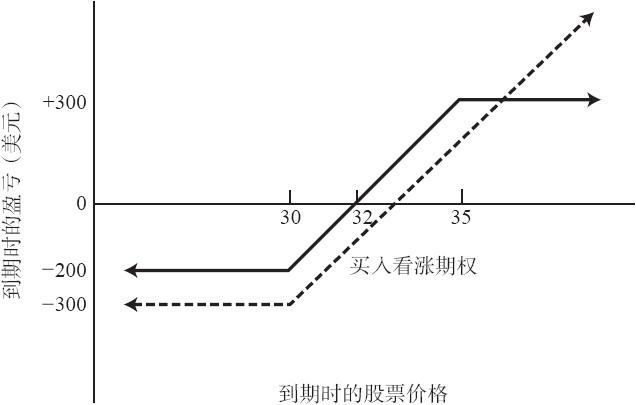

# 第7章　看涨期权牛市价差

### 7.1　看涨期权价差策略的介绍

在价差交易中，投资者在买入一个期权的同时卖出另一个期权，两个期权的标的物相同，其他条款有不同。在看涨期权价差中，两个期权都是看涨期权。进行价差交易的基本思想是，策略家通过卖出一个看涨期权来减少买入另一个看涨期权的风险。从保证金的角度来看，如果买入的看涨期权的到期日与卖出的看涨期权的到期日相同或是更远时，价差中卖出的看涨期权可以被视为是备兑的。在深入分析单个类型价差的特征之前，先讨论一下与大多数价差都有关的一些基本事实，应当是有好处的。

所有的价差都可以归为3个大的类别：垂直的、水平的、或者是对角的。垂直价差（vertical spread）所涉及的是到期日相同但行权价不同的期权。例如，买入XYZ 10月30看涨期权，同时卖出10月35看涨期权。水平价差（horizontal spread）的看涨期权的行权价相同，但到期日不同。例如，卖出XYZ 1月35看涨期权，同时买入XYZ 4月35看涨期权。对角价差（diagonal spread）是垂直价差与水平价差的结合，它是由行权价和到期日都不同的看涨期权组成的。用来为价差分类的这三个名字，可能同报纸上印刷期权价格的方式有关。垂直价差涉及报纸上价格表中同一列中的两个期权。同一列就是垂直的。水平价差涉及报纸上价格表中同一行中的两个期权。同一行就是水平的。这些名称与报纸印刷版式的这种关系并不重要，只是它可以帮助我们记住什么是垂直价差，什么是水平价差。垂直价差和水平价差的种类很多，它们中的一部分会在后面的章节里进行介绍。

### 价差指令

“价差”这个术语不光可以用来表示某种策略，还可以用来表示一种交易指令。所有的两条腿都是开仓（新建的）的交易的价差交易指令，必须在保证金账户里操作。这就意味着，一般来说，客户必须在他的账户里存有起码的资产，通常是2000美元。有的经纪公司也会有维持金的要求，这又叫作“准备金”（kicker）。

投资者也可能在现金账户里使用价差交易指令，不过在这种情况下，该指令中的一条腿必须是平仓交易。事实上，卖出备兑策略中的许多后续行动实际上都是价差交易。假定现在某个备兑卖出者就100股标的股票卖出1手XYZ 4月看涨期权。如果他想向前挪仓到7月35看涨期权，他就要在买回4月35看涨期权的同时卖出7月35看涨期权。从技术上说，这是一笔价差交易。因为买入一个期权的同时卖出了另一个期权。不过在这笔交易中，买入的那条腿是一个平仓交易，而卖出的那条腿是一个开仓交易。这类价差就可以在现金账户里用价值交易指令来操作。备兑卖出者每次挪仓的时候，不管是向上、向下还是向前，他都应当下达价差交易指令，以求得更好的执行价格。

后面章节所讨论的价差都是主流的价差策略，在其中，价差的两条腿都是开仓交易。它们有自己的潜在盈亏，而不仅是前面讨论的一些策略的后续行动。

当下达价差指令的时候，必须明确指定要买入和卖出的期权。另外还有两项必须指明的东西：价差执行价格，以及这个价格是收入还是支出。如果这个价差的总价格会给该价差策略家带来现金流入，那这个价差就是收入价差（credit spread）。这仅仅意味着价差中卖出的那条腿的价格要比买入的那条腿的价格高。反过来也一样：如果价差交易导致现金流出，这个价差就叫作支出价差（debit spread）。这就是说，买入的支出要大于卖出的收入。通常价差的买入的这条腿被称为多头腿（long side），而卖出的那条腿被称为空头腿（short side）。

价差指令的执行价格一般不是价差所涉及的两个期权的最新价的差。

【示例7-1】某个投资者想同时买入1手XYZ 10月30看涨期权和卖出1手XYZ 10月35看涨期权。如果10月30的最新价是4点，10月35的最新价是2点，这并不等于说这个价差的执行价格就一定会是2点的支出（最新价的差）。事实上，决定一个价差交易的市场价格的唯一方法是知道所涉及的期权的买报价（bid price）和卖报价（asked price）是什么。假定这两个期权有下面的价格：

由于这个价差涉及买入10月30看涨期权和卖出10月35看涨期权，那该交易者就必须在市场上为10月30看涨期权支出4.10（卖报价或者要价），而在10月35看涨期权上收入1.95（买报价）。这就会造成2.15点的支出。这明显比2点的最新价之差高出了一些。当然，投资者可以为任何交易设置任何一个价格。投资者可以以2.10点支出的价格下达价差交易指令，如果场内经纪人在买的方面可以为10月35得到比要价更好的价格，或是在卖的方面可以为10月30得到比给价更好的价格的话，他就有一定的可能完成这个指令。

这里要强调的是，投资者不能够假设最新价代表了价差交易的执行价格。这就对使用收盘价来对价差交易进行计算机分析带来了一定的难度。有的计算机资料商提供收盘价（通常费用更高）和收盘时的买报价和卖报价。如果一个策略家只有收盘价，那么在他分析的结果里就应当留有一定的余地，考虑进这样的事实：最新价不一定就代表价差的执行价。留有这种余地的一个简单方式是，只注意那些流动性比较好的期权，也就是说，那些在前一天有很大成交量的合约。如果某个期权上有大量的交易，那么当前报价就更可能是“紧的”（tight），也就是说，买报价和卖报价会非常接近最新价。

在场内期权发展的早期，通过“分腿”（leg）来进入一个价差的做法相当普遍。也就是说，策略家会分开下达一个买入指令和一个卖出指令，并用两笔交易来组成一个价差。随着场内市场的发展，市场深度和流动性都逐渐增加，用分腿的方法来建立价差就变为一种不高明的做法。如果处理这笔交易的场内经纪人知道整个情况，他就有相当多的机会来“分割报价”（splitting a quote），按照买报价买入，或者按照卖报价卖出。分割报价一般是指用一个介于当前买报价和卖报价之间的价格来执行。例如，如果买报价是3.90，卖报价是4.10，那按4完成的交易就可能是“分割报价”。

公众客户必须注意，价差交易的手续费有可能会高得多，因为它交易的期权手数是单边交易的2倍。有的经纪商对价差交易的收费要稍微低一些，但比起商品期货交易中的价差来，它们仍然很高。

牛市价差是最流行的价差形式之一。在这类的价差交易里，投资者买入1手行权价的看涨期权，同时卖出1手行权价更高的看涨期权。一般来说，两手期权的到期日相同。这是一个垂直价差。当标的股票上涨时，牛市价差就会盈利，因此这是一个看多的头寸。这个价差的潜在盈利和潜在风险都是有限的。虽然两者从百分比上来看都相当可观，但风险不会超过净投资。事实上，相对于直接买入1手相似的看涨期权，1手牛市价差所要求的投资金额要小一些，因此其最大潜在亏损金额也要小一些。

【示例7-2】有下列的价格存在：

XYZ普通股股票：32

XYZ 10月30看涨期权：3

XYZ 10月35看涨期权：1

投资者可以在买入1手10月30看涨期权的同时，卖出1手XYZ 10月35看涨期权，从而建立1手牛市价差。让我们假定这个价差可以按上面所说的，用2点的支出建立起来。牛市价差一定是支出交易，因为如果到期日相同，行权价较低的看涨期权的交易价一定比行权价较高的看涨期权的交易价高。表7-1和图7-1显示了这个交易在到期日时的结果。如果这些看涨期权在到期时按持平价平仓，那么所示的盈利或亏损就会兑现。请注意，这个价差有它的最大盈利限额，如果股票价格在到期时高于较高的行权价，那就能实现最大盈利。如果股票价格在看涨期权到期时低于较低的行权价，这个头寸就会产生它的最大亏损。最大亏损等于净投资，在这个示例里，也就是2点。

表7-1　到期日时牛市价差的结果

图7-1　牛市价差

此外，这个头寸在到期日的盈亏平衡点一定在两个行权价之间。在这个示例里，它是32。只要两个看涨期权的到期日相同，那么所有牛市价差的盈利图形都与图7-1所显示的图形相似。

建立这个头寸的投资者对标的股票是看多的，但是，一般而言，他是在寻找一种对冲的途径。如果他直截了当地看多，他会直接买入10月30看涨期权。而买入10月30看涨期权并卖出10月35看跌期权的交易，则让他在到期时股票价格低于36时的交易结果，会比直接买入10月30看涨期权要更好一些。图7-1中的虚线显示了这一事实。

所以，建立牛市价差的策略家是看多的，但不是过度看多。为了证明这个比较是正确的，请注意，如果投资者按3点的价格只买入10月30看涨期权，如果XYZ在到期时的价格是36，他就会有3点的盈利。如果股票价格在到期日时是36，两个策略的盈利都是3点。而如果在36之下，牛市价差的表现会更好，因为卖出10月35看涨期权的权利金带来了额外的收入。如果股票价格到期时在36之上，只买看涨期权的头寸的表现就会优于牛市价差，因为在只买看涨期权的情况里，其盈利没有限制。

牛市价差的净投资等于净支出加上手续费。价差必须在保证金账户里交易，而经纪公司一般会有最低资产的要求。此外，有的经纪人还会有维持金的要求。假定某个投资者按上面所说的价格建立了10手价差。在不考虑手续费时，他的投资是2000美元（每手价差200美元）。计算一手看涨期权牛市价差的盈亏平衡点和最大潜在盈利是一件相当容易的事：

盈亏平衡点=较低行权价+价差的净支出

最大潜在盈利=较高行权价–较低行权价-价差的净支出

在上面这个示例里，净支出是2点。因此盈亏平衡点就是（30+2），或者说32。最大潜在盈利是（35-30-2），或者说3。这些数字与表7-1和图7-1所显示的结果相同。手续费占盈利和净投资的比例可能相当大，因此，在建立头寸之前，应当把它计算进去。如果这些手续费包括在建立价差的净支出里，那么使用上面的公式就可以很方便地把它们计算在内。如果进行大量的看涨期权价差交易，手续费的占比就会降低。由于这个原因，一般建议投资者每次至少交易5手期权价差。
