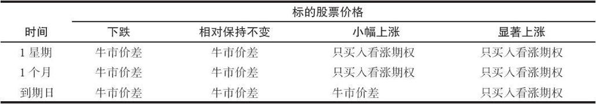

# 7.3　牛市价差的排序

为准确地比较特定交易日能够使用的各个牛市价差的潜在风险和盈利，投资者必须使用计算机来进行大规模的计算。我们可以按照严格的数学方法来对各个牛市价差进行排序，但得到的名单未必如使用正确的分析方法时那样精确。在现实中，有必要将标的股票的波动率，以及价差可能得到的预期收益结合到计算中。我们在第28章中将详细地介绍预期收益的概念，在那里，我们将用牛市价差作为一个示例。

我们在后面将提供一个在股价上涨之后使用波动率来预测期权价格的精确方法。许多数据商都提供这样的信息。不过，如果读者想尝试一种简单的分析方法，下面的这个方法就足够了。在任何对牛市价差的排序中，重要的是，不要根据它们在到期时的最大潜在盈利来区别它们的好坏。如果根据到期时的最大潜在盈利来排序，那一定会给深度虚值价差最大的权重，而它们的最大潜在盈利实际上很难实现。更好的方法是在分析中排除掉那些最大盈利价格与当前股票价格距离太远的价差。一个考虑了股票运动的简单方法是，假定股票在到期时上涨的幅度等于平值看涨期权中的时间价值的2倍。因为波动率越大的股票，它的期权的时间价值就越大，这样的方法是一种将波动率结合到分析中的简单尝试。同时，因为远期期权的时间价值比近期期权大，它也可以将较长时段内的较大运动容纳在内。按百分比计算的收益应当包括手续费。这个简单的分析并不是完全正确的，但它对那些希望找到能快速计算的简单数学分析方法的交易者来说是有用的。

### 进一步的考虑

在前面的示例里，卖出和买入的看涨期权的到期日均相同。有的时候，买入的看涨期权的到期日比卖出的看涨期权的到期日更远会有好处。这样的头寸通常被称作对角价差，我们在后面会讨论它。

有经验的交易者在期权价格很高时，往往转向牛市价差。通过卖出较高行权价的期权而得到收入，能够部分减轻买入较低行权价期权的昂贵开支。不过，投资者不应当只是因为期权有很多时间价值就总使用牛市价差，因为这样的对冲头寸会让其放弃许多上行方向的潜在盈利。

对大部分价差来说，即使标的股票的价格朝着对价差交易者有利的方向运动，也有必要等上一段时间，以便让盈利变得数量可观。由于这个原因，牛市价差对（快速）交易者并不适合，除非期权的剩余存续期很短。如果某个投机者对标的股票短期看多，那么他直接买入看涨期权比建立牛市价差要更好一些。价差的变化主要是时间的函数，标的股票价格的小幅运动在短期内不会对价差价格短期变化带来多大影响。不过，如果标的股票在到期前小幅上涨，那牛市价差就会比只买入看涨期权有明显的优势。

在前面的示例里，牛市价差是通过按3点买入XYZ 10月30看涨期权和按1点同时卖出XYZ 10月35看涨期权来建立的。这个投资可以用来与只买入XYZ 10月30看涨期权进行比较。下面是只买入看涨期权的短期优势。

【示例7-4】标的股票在1天的时间内从32跳到了35。如果是这样，10月30看涨期权的价格就大约会是5.50点，只买入看涨期权的头寸就会上涨2.50点，再去掉1手期权的手续费。而在牛市价差中，买入的那条腿自然会表现不错，因为它用的是同一个期权，不过卖出的那条腿，也就是10月35看涨期权，可能售价就会是2.50点。因此，这个价差的总价值是3点（买入腿的5.50点，减去卖出腿的2.50点）。由于最初建立这个价差花费了2点，那价差交易者此时的盈利为1点，再减去2手期权的手续费。这样看来，在最短的时段（1天）里，只买入看涨期权的头寸在价格快速上涨时的表现比牛市价差要好。

在一个稍微长一些的时段里，例如30天，如果标的股票快速上涨，只买入看涨期权的头寸仍然具有优势。即使股票在30天里上涨到35，牛市价差仍然有时间价值，还达不到5点的最大潜在盈利。记得吗，牛市价差的最大潜在盈利等于两个行权价的差。显然，如果标的股票价格在这样短的时间里上涨了这么多，只买入看涨期权的头寸的盈利就会非常好。不过，如果考虑到风险的话就必须指出，牛市价差的风险金额比较小，而如果标的股票是下跌而不是上涨的话，相对于只买入看涨期权的头寸，牛市价差的亏损通常更小。

标的股票价格上涨所需的时间越长，事情就对价差越有利。假设XYZ要到到期日才上涨到35。在这种情况里，10月30看涨期权就价值5点，而10月35看涨期权则无价值。只买入10月30看涨期权的头寸会有2点盈利，再减去1手期权的手续费。而价差头寸现在就有3点盈利，再减去2手期权的手续费。虽然手续费有所增加，但价差交易者的盈利金额和收益率都会更高。

在建立了牛市价差头寸之后，如果股票价格马上上涨，该头寸只能产生很少盈利，许多交易者对这一点都感到失望。导致这一问题的部分原因是因为价差伸展得不够宽，那可以把两个行权价的距离设置得更大一些。如果两个行权价之间的距离较大，即使它不能立刻达到其最大潜在盈利，价差也有更多的空间来伸展。此外，由于这两个行权价“分得很开”，即使标的股票立刻上涨，价差也有更多的空间来伸展。

从这些示例里可以得出的结论是，一般来说，如果投资者预期标的股票会迅速上涨，那更好的策略是只买入看涨期权。总的来说，相对于只买入看涨期权，牛市价差是一个不那么激进的策略。股票的短期运动以及大幅度的持续上涨运动，对牛市价差不会有什么影响。不过，如果股票价格在到期前有缓慢的、数量不大的上涨，那价差的表现就会比只买入看涨期权要好。此外，价差的实际风险金额要更小一些。因为其最初建立时所需的支出要更小。表7-2总结了在不同的时段、不同的股票价格情况下，哪种策略更占上风。

表7-2　牛市价差与只买入看涨期权的比较

