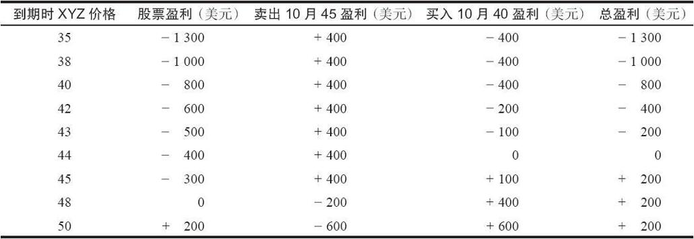
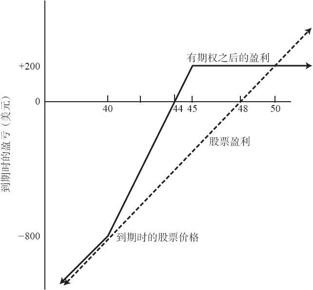
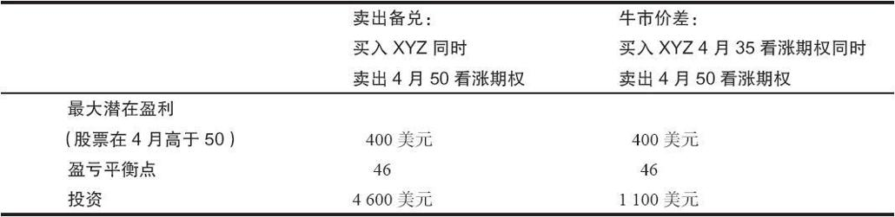

# 7.5　牛市价差的其他用途

表面上看，牛市价差是最简单的价差之一。不过，它可以在各种不同的情况里成为一种非常有用的工具。第3章里描述了两种这样的情况。如果一个投资者只是买入看涨期权并且发现他面临未兑现的亏损，他可以通过“向下挪仓”为一个牛市价差，从而显著地提高他恢复到盈亏平衡的机会。如果他有未兑现的盈利，他可以在次高的行权价上卖出看涨期权，从而构造出一个牛市价差，以锁住他的部分盈利。

类似地，一个面对未兑现亏损的普通股股票的持有者也可以利用牛市价差来降低他实现盈亏平衡的价格。使用期权，他实现盈亏平衡或者盈利的机会就大得多。下面的示例说明了这个股票持有者的策略。

【示例7-5】某个投资者按48买入100股XYZ，股票后来跌到42，于是他面临着未兑现的亏损。为了达到盈亏平衡，股票必须上涨6点。不过，如果XYZ有场内期权交易的话，他可以显著地降低他的盈亏平衡价格。现有的价格是：

XYZ普通股股票：42

XYZ 10月40看涨期权：4

XYZ 10月45看涨期权：2

股票持有者可以买入1手10月40看涨期权，同时卖出2手10月45看涨期权，从而改进他的总头寸。请注意，这个交易除了手续费之外不需要任何资金，因为从卖出2手10月45看涨期权中得到400美元收入，它等于买入1手10月40看涨期权所需的支出。不过，因为这里建立了一个价差头寸，所以还是会有维持金和最低资产的要求。

这样构造的头寸里不包含未备兑或者说裸期权。卖出的1手XYZ 10月45看涨期权为标的股票自身所备兑。另一手则是与10月40看涨期权组成牛市价差。由此产生的头寸是一手牛市价差和一手卖出备兑的组合。不过，这一点并不特别重要，重要的是这个新的总头寸的盈利特征。

如果XYZ的价格继续下跌，在10月到期日时跌到低于40，所有的期权都会无价值到期，对股票持有者来说，最终亏损与只持有股票而不进行任何期权交易的亏损相同（除了所花费的期权手续费）。

由于卖出备兑和牛市价差都是有限盈利的策略，因此这个新头寸的盈利一定也是有限的。如果XYZ在10月到期时高于45，就会实现最大盈利。为了确定最大盈利的数量，假定XYZ在期权到期时刚好是45。在这种情况下，两手卖出的10月45看涨期权会无价值到期，而买入的10月40看涨期权会价值5点。期权交易者的空头腿会有400美元盈利（2手10月45看涨期权，每手200美元），再加上多头腿的100美元盈利，从而在期权交易中得到500美元总盈利。在这个示例里，因为股票最初是以每股48美元买入的，当股票在到期时是45时，这个头寸中股票部分的亏损是300美元。整个头寸的盈利因此就是500美元减去300美元，也就是200美元。

表7-3和图7-2显示的是当股票价格在期权到期时位于40~45之间时的结果。图7-2描写了表7-3中的“股票盈利”和“总盈利”这两栏，因此，读者可以形象地将新的总头寸同股票持有者最初的头寸进行比较。首先，盈亏平衡点从48降到了44。新的总头寸的盈亏平衡点是44，因此，只要股票在到期前上涨2点，就可以实现盈亏平衡。在到期时股票如果是50，这两个策略就是相等的。也就是说，只有股票在到期时上涨了8点，也就是从42涨到50，股票持有者的最初头寸的表现才会比新头寸的表现好。在40之下，两个策略产生的结果是一样的。最后，在40~50之间，新头寸的表现优于股票持有者最初头寸的表现。

表7-3　降低普通股股票的盈亏平衡点

总之，在股票头寸上加进上面所说的期权，股票持有者会得到很多而放弃很少。如果股票价格最终稳定下来（在上面的示例里是在40~50之间），那么这个新头寸就改善了原有头寸。另外，当股票有少量上涨时，投资者就可以实现盈亏平衡或者获得盈利。如果股票继续下跌，除了期权手续费之外，投资者不会遭受额外的亏损。只有当股票急剧上涨时，股票头寸才会比这个总头寸的表现要好。

这个由卖出备兑和牛市价差组合起来的策略有时也可以用来单独交易（开仓）。也就是说，一个考虑要按42买入XYZ的投资者可以在一开始就买入1手10月40的看涨期权，并卖出2手10月45看涨期权。就潜在盈利而言，这个头寸的结果不会比直接买入XYZ股票差，除非股票在期权10月到期时上涨到46之上。

牛市价差也可以用来“代替”卖出备兑。我们在第2章里提到过，卖出备兑权证有它的优势，因为它所要求的投资要小一些，特别是当权证是实值的，而且时间价值不是太高的时候。同样的思考方式也可以用在看涨期权上。如果一个期权是实值的，而且不包含或者包含很少的时间价值，那么就可以用买它来代替买入股票。当然，看涨期权会过期，而股票不会。但持有深度实值看涨期权的潜在盈利同持有股票是非常相似的。而买入这样的看涨期权的成本比买入股票要小，投资者就可以用较小的投资而得到基本相同的潜在盈利和潜在亏损。这样，人们自然会想到，投资者可以就买入的深度实值看涨期权而卖出另一手期权，一手较为接近平值的看涨期权。这样一个头寸的盈利特征同一手卖出备兑的盈利特征非常相像，因为买入的那手看涨期权“模仿了”买入股票。当然，这个头寸事实上是一手牛市价差，其中，买入的看涨期权是一手相当实值的期权，而卖出的看涨期权则更接近于平值。显然，投资者不会将他所有的钱都放进这样一个头寸里，而放弃卖出备兑。因为在使用牛市价差时，他就有可能在一个较小的下跌过程中亏损掉其全部投资。而如果使用卖出备兑策略，即使经历严重的市场下跌，投资者仍然持有股票。不过，如果在牛市价差中投入一笔比他在卖出备兑中需要投资的数目小得多的钱，那么投资者有可能得到某种折衷。他仍然可以保持相同的潜在盈利。投资者剩下的资金可以投资于固定收益证券。

图7-2　降低普通股股票的盈亏平衡点

【示例7-6】市场上有下列价格

XYZ普通股股票：49

XYZ 4月50看涨期权：3

XYZ 4月35看涨期权：14

因为深度实值的看涨期权没有时间价值，在4月到期之前，买入深度实值看涨期权的表现同买入股票没有什么不同。表7-4总结了这个卖出备兑和牛市价差的潜在盈利。如果XYZ的价格在4月到期时高于50，在扣除手续费之前，两者都有400美元的盈利。不过因为牛市价差所需的投资要小得多，在进行价差交易时，可以将剩余的3500美元投资于固定收益证券。由此产生的利息可以看作股票股息的等价物。无论发生什么情况，即使股票大幅度下跌，这个价差的最大亏损也不会高于1100美元。对备兑卖出者来说，如果XYZ在到期时低于35，那么未兑现的亏损就会大于这个数目。而且，正如在卖出备兑时他会做的那样，在交易牛市价差时，如果股票价格下跌，卖出者会将4月50看涨期权“向下挪仓”。

表7-4　卖出备兑和牛市价差的结果比较

因此，这个牛市价差提供了同样金额的盈利、同样的盈亏平衡点，较少的手续费、较小的潜在风险，以及从投资的固定收益证券中得到的利息收入。虽然你不是总能找到深度实值看涨期权来“代替”买入股票，但只要有这样的期权存在，策略家就应当考虑使用牛市价差而不是卖出备兑。
