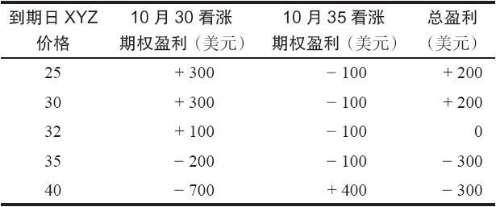
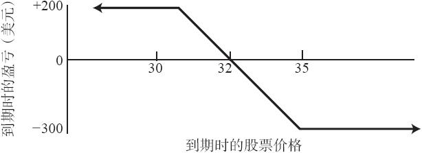

# 8.1　熊市价差

在一手看涨期权熊市价差（call bear spread）里，交易者按特定行权价买入一手看涨期权，同时按较低的行权价卖出另一手看涨期权。与牛市价差一样，这也是一个垂直价差。如果标的股票价格下跌，熊市价差一般会盈利。与牛市价差一样，它的潜在盈亏也都有限。不过与牛市价差不一样的是，如果这个价差是用看涨期权来建立的，那熊市价差就是一个收入（credit）价差。因为交易者卖出的是一手较低行权价的看涨期权，而行权价较低的看涨期权，如果到期日相同，它的交易价格总是比行权价较高的看涨期权要高，所以这样的熊市价差一定是一个收入头寸。应当指出，大部分用看涨期权来建立的熊市策略，如果用看跌期权来建立会更有利。因此，这里讨论的大部分策略内容会在第三部分里再次讨论。

【示例8-1】有个投资者，他对XYZ是看空的。使用在第7章里使用过的示例，我们可以构建一个熊市价差的示例：

XYZ普通股股票：32

XYZ 10月30看涨期权：3

XYZ 10月35看涨期权：1

买入10月35看涨期权，同时卖出10月30看涨期权，就可以建立一个熊市价差。不计手续费的话，建立这个熊市价差可以得到2点收入。在熊市价差的情况里，策略家所希望的是股票价格下跌，两手期权都无价值到期。如果发生这样的情况，他不必付出任何东西就可以将这个价差平仓。最初得到的收入就成了他的盈利。在这个示例里，最初的收入是2点，这也是最大的潜在盈利。只要XYZ在到期时低于30，这个盈利就能实现。因为在这样的情况下，两手期权都会无价值到期。

如果两个期权之间的价格差变大，而不是缩小，那么这个熊市价差交易者就会亏损。如果市场上涨，价格差就会变大。价格差的最大值会是5点，也就是两个行权价的差。因此，这个熊市价差交易者买回这个价差最多要付5点，其结果就是3点的最大潜在亏损。如果XYZ在10月到期时超过了35，这个亏损就会实现。表8-1和图8-1显示了这个示例在到期时的实际潜在盈亏（手续费没有包括在内）。机敏的读者会注意到，这张表里的数字与第7章牛市价差的示例中所显示的数字刚好相反。同时，熊市价差的盈利图形看上去就像把牛市价差的图形倒转了过来。所有熊市价差在到期时的盈利图形，其形状都与图8-1所显示的图形相似。

表8-1　熊市价差

图8-1　熊市价差

对熊市价差来说，计算盈亏平衡点、最大潜在盈利和所需投资都相当简单。

最大潜在盈利=所得净收入

盈亏平衡点=较低行权价+所得净收入

最大风险=所需质押投资=行权价的差–所得净收入+手续费

在上面的示例里，卖出10月30看涨期权有3点收入，买入10月35看涨期权支出1点，净收入是2点。这就是最大潜在盈利。计算盈亏平衡点也很容易，较低的行权价是30，净收入是2点，因此盈亏平衡点就是32。风险同投资相等。它是行权价的差（5点）减去所得净收入（2点），也就是3点的总投资，再加上手续费。在这个价差中，买入的看涨期权的行权价等于或者低于卖出的看涨期权的行权价，它就涉及一个没有“备兑”的看涨期权。因此，与牛市价差相比，有的经纪公司可能会对熊市价差要求一笔更高的维持保证金。另外，因为这个价差一定是用保证金账户来操作的，大部分经纪公司都要求这个账户必须存有一定数目的资金。

这是一个收入价差，投资者在建立这个价差时并没有真的花钱。这笔投资实际上是减少了该客户保证金账户的购买力。但在建立头寸时，并不需要实际拿出现金。
