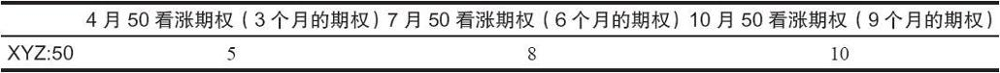
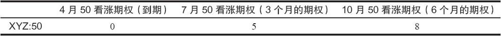

# 第9章　跨期价差

跨期价差也叫作时间价差（time spread），它涉及卖出一个期权，同时买入一个更远期的期权，两个期权的行权价相同。从广义上说，跨期价差是一个水平价差。使用跨期价差的中性哲学是，时间对近期期权价值的侵蚀速度要比对远期期权快。如果是这样的话，在短期期权到期时，价差就会变宽，交易者能得到盈利。交易者还可以用看涨期权来构建一个更为激进的牛市跨期价差。下面对这两类价差都进行了讨论。

【示例9-1】1月下旬有下面的价格：

如果交易者卖出4月50看涨期权，同时买入7月50看涨期权，他就要支出3点，也就是看涨期权价格的差，再加上手续费。这就是说，他的投资是价差的净支出加上手续费。此外，假定在3个月后4月合约到期时，XYZ的价格仍然是50，没有变化。这样的话，3个月的看涨期权应当价值5点，6个月的看涨期权应当价值8点，正如以前一样，假设所有其他的因素都不变。

4月50与7月50之间的价格差现在扩大到5点。因为这个价差最初的支出是3点，价格差的扩大就产生了2点盈利。在这时可以把头寸平仓以兑现盈利，也可以决定继续留着他买入的7月50看涨期权。如果继续持有7月50看涨期权，他是在拿积累至今的盈利冒险，不过，如果在随后的3个月里，在7月到期日之前标的股票价格上涨，他就会得到丰厚的盈利。

要产生盈利，标的股票在近期合约到期日时并不一定需要刚好等于近期期权行权价。事实上，在高于和低于该行权价的范围内，都可以产生一些盈利。这类头寸的风险是股票会大幅下跌或上涨。在这样的情况下，两个期权之间的价格差就会缩小，交易者就会亏钱。由于同一行权价的两个期权的价格差不可能缩小到低于零。因此，这个价差的风险就限制在最初建立这个价差时的支出金额内，再加上手续费。
