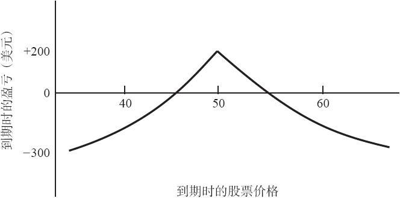
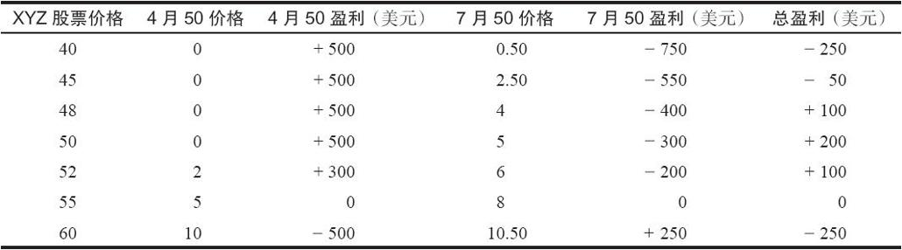

# 9.1　中性跨期价差

正如前面提到过的，进行跨期价差交易的交易者，要么对股票价格中性，要么对股票强烈看多。我们首先介绍一下中性的情况。一个跨期价差，如果在建立时标的股票价格刚好等于或者接近所用期权的行权价，那么它就是一个中性的价差。这个策略家感兴趣的是卖出时间，而不是预测标的股票的方向。如果在近期期权到期时股票相对没有变化，这个中性价差就可以盈利。在一个中性价差里，交易者一开始就应当计划在近期期权到期时将这个价差平仓。

图9-1　在近期到期日时的跨期价差

为了更准确地说明前面示例里的那个跨期价差在近期的4月看涨期权到期时的潜在风险和回报，让我们再回到前面示例上。要这样做，有必要评估一下7月50看涨期权当时的价格。请注意，如果XYZ在到期时是50，结果就同前面展示的细节不那么详细的那个示例相同。图9-1是由表9-1而来的“总盈利”。这个图形是一条曲线而不是直线，因为7月50看涨期权还有时间价值。这个图形略微偏多：盈利范围在高于行权价的区域比在低于行权价的区域伸展得要更远一些。这是因为这个价差是看涨期权的价差。如果是看跌期权的价差的话，那就会略微看空。盈利区域的宽度是标的股票的波动率的函数，波动率会影响剩余的长期看涨期权在到期时的价格。此外，盈利区域的宽度也是短期期权剩余存续期的函数。

表9-1　4月到期时的预计盈亏

表9-1和图9-1清楚地显示了跨期价差的若干重要方面。这个价差有一个在近期到期时会盈利的区域。在这个示例里，这个区域在大约46~55之间。超出这个区域就会有亏损。不过，亏损局限在最初的支出金额之内。请注意，在这个示例里，只有当股票远低于40或远高于60的时候，才会出现最大亏损。即使股票价格是40或者60，较长期的期权也还会有时间价值，因而亏损不至于达到300美元的最大亏损。

这一类跨期价差的盈利有限，手续费占比相对较大。一般而言，建立这样一个价差的最好时间是在近期期权到期之前的8~12个星期。如果这样做，交易者就能赚到近期期权相对较长期期权最大比率的因时减值。也就是说，当一个看涨期权只有不到8个星期的存续期时，相对同一个股票上较长期的期权来说，它的时间价值的减值速度会大幅度地增加。

### 波动率的影响

期权的隐含波动率（也就是标的股票的实际波动率）对这个跨期价差会有影响。随着波动率的增长，这个价差的跨度会增大；随着波动率的萎缩，这个价差的跨度会减小。知道这一点很重要。事实上，买入跨期价差是一种反波动率策略：交易者希望标的物的价格保持不变。有时当标的股票的波动率很大时，跨期价差看上去特别有吸引力。不过，这种看法可能是存在误区的。有两个原因：首先，因为这个股票是高波动率的，它有很大可能会运动到盈利区域之外；其次，如果股票确实稳定下来，在一个接近行权价的范围内交易，那么这个价差就会失去它的价值，因为它失去了波动性。这笔损失会大于从因时减值中得到的收益。
