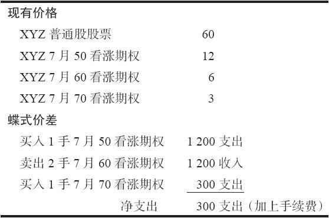
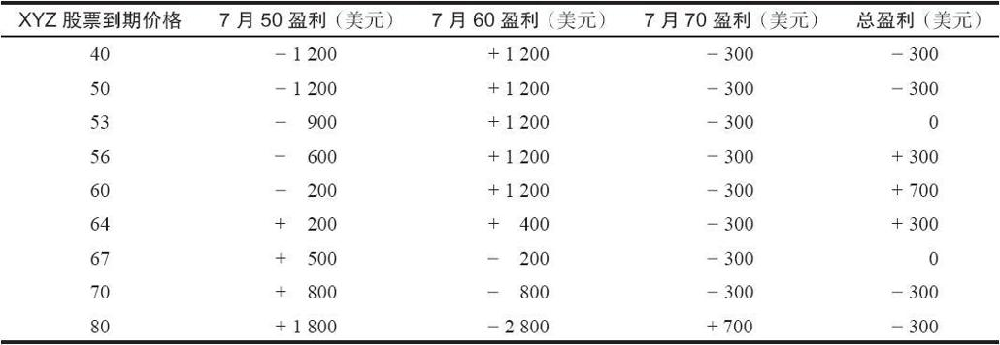
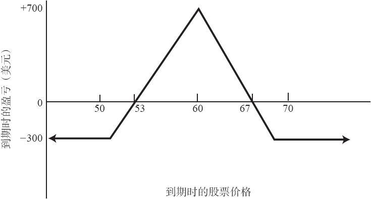

# 第10章　蝶式价差

蝶式价差（butterfly spread）的名字相当奇异，它实际上是一个中性价差，是一手牛市价差同一手熊市价差的组合。这个价差适用于对市场持中立观点的策略家，这个策略家认为标的股票在期权到期之前净上涨或净下跌都不会太大。这个策略一般只需要小额的投资，风险也有限。虽然它们的盈利也有限，但它们的潜在盈利要大于潜在风险。由于这个原因，蝶式价差是一个有活力的策略。不过，就手续费而言，它相当昂贵。在这一章里，我们只介绍使用看涨期权的蝶式价差。正如我们在后面将说明的，这个价差既可以使用看涨期权同看跌期权的结合，也可以只用看跌期权来构建。

一个蝶式价差中有3个行权价。如果只使用看涨期权，蝶式价差包括买入1手行权价最低的看涨期权，卖出2手中间行权价的看涨期权，和买入1手行权价最高的看涨期权。下面的示例解释了这个蝶式价差是如何运作的。

【示例10-1】有这么一手蝶式价差，它是由按12买入1手7月50看涨期权，按每手6卖出2手7月60看涨期权，同时按3买入1手7月70看涨期权构成的。蝶式价差涉及4手期权的手续费，并且手续费占净投资的比例可能比较高。这个价差所需要的支出则相对较低：300美元（见表10-1）。同一般情况一样，最大数量的盈利是在卖出的看涨期权的行权价上实现的。对大多数类型的价差，记住这个事实很有用，因为它可以帮助你迅速计算出这个价差的潜在盈利。在这个示例里，如果股票在到期时价格等于卖出的看涨期权的行权价（60），2手卖出的7月60看涨期权就会无价值到期，得到1200美元的收益。买入的7月70看涨期权也会无价值到期，亏损300美元。买入的7月50看涨期权则价值10点，在这个看涨期权上产生200美元的亏损。收益和亏损的总和因此会是700美元的盈利，再减去手续费。这是这个价差的最大潜在盈利。

表10-1　蝶式价差示例

无论是在上行方向还是在下行方向，蝶式价差的风险都是有限的，它的风险等于在建立这个价差时所需要的支出的总量。在上面的示例里，风险就限制在300美元加上手续费。

表10-2和图10-1描绘了这个蝶式价差在到期日时在各种价位上的结果。这里的盈利图与一个卖出比率（ratio write）相似，不同的是蝶式价差在上行方向和下行方向上的风险都是有限的。蝶式价差有一个能够赚钱的盈利范围，在这个示例里，在不计手续费的情况下，这个范围是53~67。超出这个盈利范围，在到期时就会出现亏损，不过这些亏损是有限的，不会大于最初的支出加上手续费。

根据2000年通过的更为宽松的保证金要求，1手蝶式价差所需要的投资等于它所花费的支出，这就是这手价差的风险。如果期权是同一月份到期，而且行权价之间差距相等（在这个示例里的差距是10点），那么，就可以使用下面的公式迅速地计算出这手蝶式价差的重要细节：

净投资=价差的净支出

最大盈利=行权价之间的差距-净支出

下行盈亏平衡点=最低行权价+净支出

上行盈亏平衡点=最高行权价-净支出

在这个示例里，行权价之间的差距是10点，净支出（不计手续费）是3点，这里使用的最低行权价是50，最高行权价是70。这些公式用到这个示例上，于是产生了下面的结果。

净投资=3点=300（美元）

最大盈利=10-3=700（美元）

下行盈亏平衡点=50+3=53（美元）

上行盈亏平衡点=70-3=67（美元）

表10-2　到期时蝶式价差的结果

图10-1　蝶式价差

请注意，所有这些答案同前面对作为示例的价差所作的分析在细节上都是一致的。

在这个示例里，最大潜在盈利是700美元，最大风险是300美元，所需要的投资也是300美元，不计手续费。按百分比计算的话，这就意味着这手蝶式价差的亏损限制在投资资本的100%之内，在这个情况里，有可能获得将近133%的盈利。这些数字代表了一个有吸引力的风险/收益关系。不过，这只是一个示例，在实际市场中有两个因素可能对这些数字有很大的影响。第一，手续费很高：建立这个价差和将它平仓有可能要支付8笔手续费；第二，取决于市场上在任何时间点可以找到的权利金水平，有可能在行权价的差距为10点的时候无法建立一手支出低到3点的价差。
