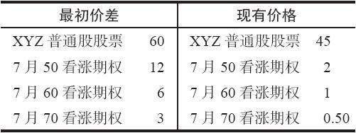
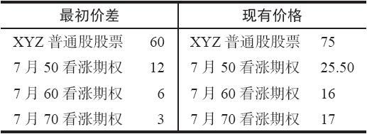

# 10.2　后续行动

由于蝶式价差的风险有限，价差交易者一般而言除了避免早期执行以及为了提取盈利或限制进一步亏损而平仓之外，在后续行动方面通常不需要做什么事情。这个价差中唯一有可能被指派的部分是行权价居中的那手看涨期权。如果这手看涨期权是按持平价或者接近持平价的价格交易，那么这手价差就应当平仓。如果标的股票要除息，在到期之前就有可能发生这种情况。应当注意，接受指派不会增加这个价差的风险（因为所有被指派的看涨期权空头仍然会被剩下的看涨期权多头所保护）。不过，保证金要求会有显著的变化，因为投资者现在有了一手合成看跌期权（synthetic put，买入看涨期权同时卖空股票）的头寸。此外，在交易股票的手续费可能更高。所以，一般而言，聪明的做法是在蝶式价差中避免被指派，或者说，就这一点而言，在所有的价差中都避免被指派。

如果股票在经过一段合理长的时间之后接近中间行权价，价差交易者就会积累有未兑现的盈利。如果投资者感到标的股票的价格运动将要离开中间的行权价，因而危及这些盈利，那么，将这个价差平仓以提取已有的盈利是可取的。在决定是否有未兑现盈利存在时，不要忘记将手续费计算在内。

一般而言，交易者不应当为了限制亏损而将这个价差提前平仓，因为无论出现什么情况，这些亏损都不会超出最初的净支出。不过，如果建立头寸时的支出很大，而且股票开始涨过较高的行权价或者是跌过较低的行权价，那么，价差交易者就有可能需要将这个价差平仓，以防止出现更大的亏损。

我们反复地提到，由于判断错误会导致的风险，交易者不应当试图将一手价差“拆腿”。不过，蝶式价差中有一种可以接受的、甚至可以说是审慎的拆腿方法。因为这个价差既包括一个牛市价差，也包括一个熊市价差。常常会出现的情况是，在蝶式价差的存续期里，股票会在这个方向或那个方向上出现相当大幅度的运动，而牛市价差或熊市价差有可能在接近它们最大潜在盈利时被平仓。如果出现这样的情况，价差交易者应当利用这样的机会，一旦标的股票反转回到盈利范围的话，就有可能获得更大的盈利。

【示例10-4】这个策略可以通过使用本章开头时最初的示例来说明，让我们假设股票从60跌到了45。你应当还记得，这个价差是用3点的支出建立起来的，它的最大潜在盈利是7点。在7月到期时，它的盈利范围是53~67。但是出现了一个令人不愉快的情况：股票迅速下跌，到了盈利范围之下。如果这个价差交易者什么都不做，让价差保持原样，那如果股票在7月到期之前停留在50之下，他就会亏损3点。可是，如果稍许增加风险，他有可能改进他的处境。注意一下表10-3，其中这个总价差的熊市价差部分（卖出7月60，买入7月70）非常接近它的最大潜在盈利。这个熊市价差可以用总的0.50点买回来（支付1个点买回7月60，从卖出7月70中收入0.50点）。因此，这个价差交易者只要付出0.50点就可以将原来的蝶式价差转化为一个牛市价差。这样的行动对他的总头寸会造成什么影响呢？首先，他的风险增加了，增加的数量是用来将熊市价差平仓的那0.50点。也就是说，如果XYZ在7月到期之前继续停留在50之下，那么，他将亏损3.50点而不是3点，在两种情况下都还要加上手续费。不过，他有更多的机会来实现某种接近于最初的蝶式价差所提供的最大盈利。

表10-3　最初价差同现有价格

在买回熊市价差之后，他手里有下面的牛市价差：

买入7月50看涨期权，卖出7月60看涨期权——净支出3.50点

他有一手牛市价差，到目前所支付的总成本是3.50点。读者从前面对牛市价差的讨论里应当知道，这个头寸在到期时的盈亏平衡点（break-even point）是53.50，如果XYZ在7月到期时价格高于60，它就有6.50点的盈利。因此，这个头寸的盈亏平衡点由于花了0.50点买回了熊市价差而从53到了53.50。不过，如果股票反弹到60之上，这个策略家就可以得到同他最初想要得到的最大盈利几乎相等的盈利（7点）。此外，这样的盈利现在只要股票价格超过60就可以实现，不再像在最初的头寸里，股票价格必须刚好等于60才行。虽然出现这样反弹的机会并不大，但价差交易者并不需要支出多少资金就可以重新建立一个最大盈利区域要大得多的头寸。

如果标的股票价格上涨，也会出现相似的情况。在这样的情况里，有可能在接近它的最大潜在盈利的价位将牛市价差平仓，从而只留下一手熊市价差。同样，假定我们使用的是同一个初始价差，但是XYZ上涨到75。当标的股票有显著上涨时，蝶式价差中的牛市价差那部分就有可能扩展到接近它的最大盈利。因为在这个牛市价差中行权价之间的距离是10点，它能达到的最宽的跨度也就是10点。在表10-4所显示的价格上，这个牛市价差（买入7月50和卖出7月60）的跨度增长到9.50点。因此，这个牛市价差的头寸就可以在距离它最大潜在盈利的0.50点的范围平仓，而最初的蝶式价差就变成了一手熊市价差。请注意，将牛市价差部分平仓产生了9.50点的收入：7月50看涨期权卖了25.50，7月60看涨期权用16的价格买回来。这个最初的蝶式价差是用3点的支出建立起来的，因此，净头寸就变成了下列的头寸：

表10-4　最初价差同新的现有价格

买入7月70看涨期权，卖出7月60看涨期权——净收入6.50点

在7月到期时如果股票价格低于60，这个熊市价差的最大潜在盈利就是6.50点。如果在到期时股票价格高于70，潜在风险就是3.50点。因此，最初的蝶式价差被转化为一个这样的头寸：只要股票价格反转到低于60的任何价位，就会产生接近最大盈利的盈利。此外，风险只额外增加了0.50点。
