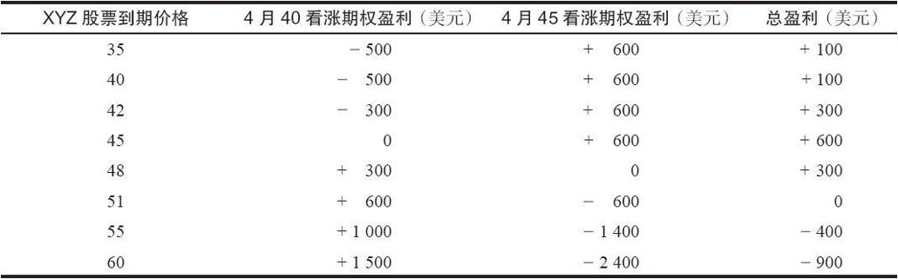
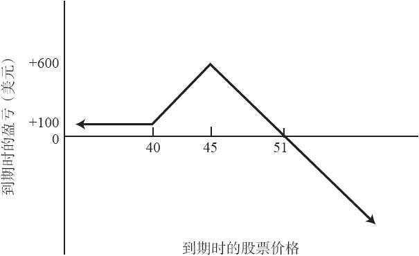

# 第11章　看涨期权比率价差

看涨期权比率价差（ratio call spread）是一个中性的策略，在这个策略中，交易者买入若干行权价较低的看涨期权，同时卖出更多数量的行权价较高的看涨期权。它在概念上同卖出比率（ratio write）有些相似，不过比率价差在下行方向的风险较小，而且所需要的投资一般比卖出比率要小。比率价差同卖出比率都涉及无备兑的看涨期权，在这一点上它们相仿，而且，两者都有一个在到期时可以盈利的范围。在这一章的论述过程中我们还会将它们在其他方面进行比较。

【示例11-1】有下列的价格存在：

XYZ普通股股票：44

XYZ 4月40看涨期权：5

XYZ 4月45看涨期权：3

要建立一手看涨期权比率价差，可以买入1手4月40看涨期权，同时卖出2手4月45看涨期权。这个价差可以通过1点的收入建立起来：卖出2手4月45看涨期权可以得到6点，买入1手4月40看涨期权需要5点。这个价差可以作为一个价差交易指令下单，表明这个头寸想要的净收入或净支出。在目前的示例里，这个价差是用1点的收入而下达指令的。

同卖出比率不同，比率价差在下行方向只有相对较小的有限风险。事实上，如果这个价差最初是用收入建立的，它就根本没有下行方向的风险。在1手比率价差中，到期时的盈亏通常是在较低的行权价之下，因为两种期权在这个区域里都会无价值到期。在上面的示例里，如果XYZ在4月到期的时候低于40，所有的期权都会无价值到期，最初的1点的收入就是价差交易者的盈利，减去手续费。只要股票价格在到期时低于40，这个1点的收益就存在，它是恒定的。

对比率价差来说，如果在到期时股票价格刚好等于卖出期权的行权价，它就实现了最大盈利。所有涉及卖出期权的策略类型几乎都是这样。在这个示例里，如果XYZ在4月到期时刚好在45，4月45看涨期权就会无价值到期，两手期权的收益总共是600美元，而4月40看涨期权则价值5点，在这手看涨期权上既没有收益也没有亏损。因此，总的盈利就是600美元减去手续费。

看涨期权比率价差的最大风险是在上行方向，从理论上说，它在上行方向的风险是无限的。在这个示例里，上行方向的盈亏平衡点是51，就像表11-1所显示的。表11-1和图11-1说明了上面的论述。

表11-1　看涨期权比率价差

在2：1的比率价差中，每买入1手看涨期权，就卖出2手看涨期权。使用下面的公式可以容易地计算出最大盈利的数量和上行方向的盈亏平衡点：

最大盈利的点数=最初收入+行权价之间差价

或者=行权价之间差价-最初支出

上行方向盈亏平衡点=较高的行权价+最大盈利的点数

在上面的示例里，最初的收入是1点，因此最大盈利就是1+5=6，或者说600美元。上行方向的盈亏平衡点就是45+6，或者说51。这同前面所证明的结果是一致的。请注意，如果价差是用支出而不是收入建立的，要决定最大盈利的点数，就应当从行权价之间的差价减去这个支出。

图11-1　看涨期权比率价差（2∶1）

许多对市场持中立态度的投资者更喜欢比率价差而不是卖出比率，有以下两个原因：

（1）在到期时，比率价差中下行方向的风险和盈利是事先确定的，因此，这个头寸在下行方面不需要过多监控；

（2）比率价差所需要的投资通常比卖出比率要少，因为交易者的多头腿是买入1手看涨期权而不是普通股票。

从保证金的角度来看，比率价差实际上是1手牛市价差同1手裸看涨期权卖出的组合。对牛市价差没有保证金的要求，需要的只是在建立这个牛市价差时所承担的净支出。比率价差的净投资因此就等于在价差中的那些裸看涨期权所需要的质押，再加上或减去这个价差的净支出或盈利。在上面的示例里有1手裸看涨期权。这个裸看涨期权的保证金要求是股票价格的20%，加上这手看涨期权的权利金，再减去期权的虚值部分。因此，这个示例里的保证金就是44的20%，或者说880美元，加上这手看涨期权的权利金300美元，再减去股票价格低于行权价的1点，这个裸看涨期权因此就有1080美元的保证金要求。因为这手价差是用1点的收入建立起来的，这笔收入可以用来抵减初始的保证金要求，从而将它减少到980美元。因为在这手价差中有1手裸看涨期权，所以，如果股票价格上升，它的保证金要求根据逐日盯市就会有所变化。正如我们在卖出比率中所建议的，价差交易者在质押金上应当至少留有足以应付股票价格到达上行盈亏平衡点的余地。因为在这个示例里的上行盈亏平衡点是51，价差交易者就应当准备51的20%，或者说1020美元，加上这手看涨期权的价值6点，再减去1点的初始净收入，因而价差总的保证金为1520美元（1020+600-100）。
