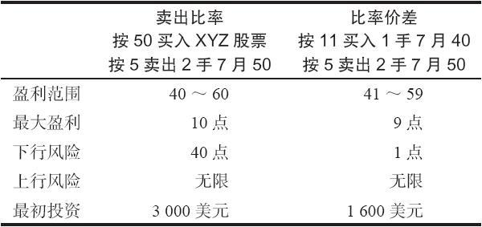
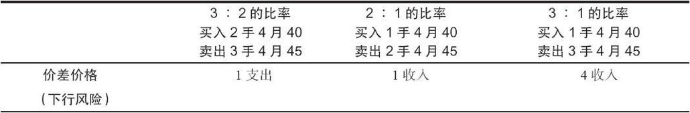
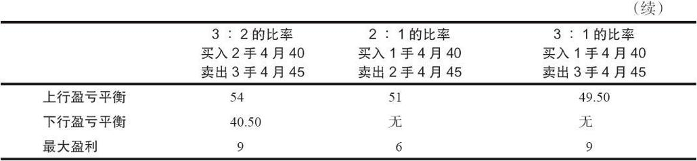

# 11.1　投资哲学的不同

许多策略都涉及多种构造方式，对应不同的投资哲学。比率价差也不例外，它涉及3种主要的投资哲学。第一种哲学认为，比率价差同卖出比率基本相似，也就是说，交易者应当寻找购买只有很少或者没有时间价值的实值看涨期权的机会，这样，一手比率价差就可以模拟出同一手卖出比率尽可能相同的盈利机会，而所需投资则更小。根据这样的哲学所建立的比率价差，如果买入的看涨期权的实值程度比较大，那么就会有相当大的支出。第二种比率价差的哲学认为，这样的价差应当用收入来建立，因此在下行方面就不可能出现亏损。两种投资哲学各有各的好处，我们将分别对其进行介绍。第三种哲学叫做“delta价差”，这种哲学里不关心最初建立价差时用的是收入还是支出，它更关心头寸的中立性。

### 11.1.1　同卖出比率相似的比率价差

有若干种价差策略与涉及普通股股票的策略相似。在这一方面，比率价差同卖出比率相似。只要存在这样的相似性，策略家就有可能买入很少或者没有时间价值的实值看涨期权来代替买入股票。我们在前面的备兑看涨期权卖出的策略中看到过这一点，在那里我们看到买入实值的看涨期权或权证可以实际代替买入股票。如果交易者有可能通过买入一手实值看涨期权来代替股票的话，他的潜在盈利状况不会有显著的变化。在对比率价差和卖出比率进行比较时，最大潜在盈利和盈利范围要减去为买入的看涨期权所支付的时间价值。如果这手看涨期权处于持平状态（因此它的时间价值是零），那么，比率价差和卖出比率的潜在盈利是完全一样的。此外，净投资减少了，如果股票价格跌到买入看涨期权的行权价之下，下行方向的风险也更小。比率价差的手续费成本也比卖出比率要低，卖出比率需要买入股票。不过，卖出比率可能有股票股息收入，而比率价差则没有。

【示例11-2】XYZ的价格是50，XYZ 7月40看涨期权的售价是11，XYZ 7月50看涨期权的售价是5。表11-2对卖出比率同比率价差之间的要点作了比较。

表11-2　卖出比率同比率价差的比较

在第6章我们曾经指出，就盈利的可能性来看，比率价差是一种较好的策略。这就是说，潜在盈利同标的股票的预期运动相互一致。如果将比率价差用作卖出比率，情况也是如此。事实上，当看涨期权在买入时只有很少或者没有时间价值的时候，比率价差比卖出比率更具有优势。

### 11.1.2　为收入而建立的比率价差

比率价差的第二种哲学是为了获得收入而建立它们。奉行这种哲学的策略家一般想要满足另一个标准：在建立这个价差时，标的股票的价格低于卖出看涨期权的行权价。事实上，股票价格比这个行权价低得越多，这个价差就越具有吸引力。这种类型的比率价差没有下行方向的风险，因为即使股票暴跌，价差交易者仍然可以得到同最初收入相等的盈利。这样使用的比率价差策略实际上是上面所讨论的用法的一种附属形式。也就是说，有这样的可能：买入一手没有或者很小时间价值的看涨期权，这样，既模拟了一手卖出比率，也有可能通过建立一个头寸而得到收入。

因为在建立一手收入比率价差时，标的股票价格一般低于最大盈利点，这实际上是一个略为看多的头寸。投资者为了实现最大潜在盈利，希望股票略为上涨。当然，这个头寸在上行方面有无限风险，因此，它不是一个过度看多的头寸。

这两种哲学并不相互排斥。一个使用比率价差而不在乎这是一个支出或收入价差的策略家通常有更多的策略可以选择，同时也能够持有对股票更为中性的态度。一个坚持只以收入为目的的价差交易者就不得不建立这样的价差：如果标的股票保持相对无变化，价差给他带来的收益会小一些。不过，因为他在下行方面没有风险，所以不必担心需要在下行方向采取防御行动。下一节将讨论第三种哲学，也就是“delta价差”，在这里我们将描写与2：1的比率不同的比率。

### 11.1.3　改变比率

在上面所讨论的两种哲学中，策略家都有可能发现，就他的目的而言，3：1或3：2的比率会比2：1的比率更合适。卖出4：1以上比率的情形并不多见，因为在这样的高比率上，上行方向的风险会大量增加。使用的比率越高，价差的收入就越大。这就意味着如果股票大幅度下跌，下行方向的盈利就会更大。使用的比率越低，上行方向的盈亏平衡点就越高，因此就降低了上行方向的风险。

【示例11-3】如果使用本章开头的示例的价格，我们可以通过使用3种不同的比率（见表11-3）来说明这些事实：

XYZ普通股股票：44

XYZ 4月40看涨期权：5

XYZ 4月45看涨期权：3

表11-3　3种比率的比较

在第6章对卖出比率的讨论中，我们看到，通过改变比率，有可能根据交易者对标的股票前景的看法，对头寸进行调整。在比率价差中调整比率可以达到同样的目的。事实上，正如我们在这一章的后面将指出的，对比率价差可以不断地进行调整，以实现所谓的“中性价差”。我们在介绍卖出比率时也讨论过类似的使用期权delta的方法。

下面的公式使得交易者有可能在任何一种比率上确定最大潜在盈利和上行盈亏平衡点：

最大盈利点=净收入+买入看涨期权数×行权价差价

或者=买入看涨期权数×行权价差价-净支出

上行盈亏平衡点=最大盈利/裸看涨期权数+较高的行权价

使用表11-3可以很容易地证明这些公式。

### 11.1.4　delta价差

比率价差的第三种哲学是最精密的方法，因为在建立和监控这个价差时使用的是期权的delta，它常常被称作delta价差。读者应当记得，一手看涨期权的delta指的是，在标的股票上涨1点的时候这手期权的价格预期会增长的数量。Delta价差是中性的价差，在这个价差中，交易者使用两个看涨期权的delta来设定一个初期是中性的头寸。

【示例11-4】在前面的示例里，4月40和4月45这两个看涨期权的delta分别为0.80和0.50。如果交易者要买入5手4月40看涨期权，同时卖出8手4月45看涨期权，他就有了一手delta中性的价差。也就是说，如果XYZ的价格上涨1个点，5手4月40看涨期权每手就会升值0.80，净收益4个点。与此相似，他卖出的那8手4月45看涨期权每手就会增值0.50，导致空头腿4点的净亏损。因此，这个价差在刚建立时是中性的，也就是说，多头腿和空头腿会相互对冲。设立这样的中性价差的目的是，在避免价差面临异常的市场风险的条件下，捕捉卖出看涨期权中居于优势的时间价值的因时减值。价差中实际的收入和支出不是决定性因素。

决定在delta价差中使用正确的比率是一件相当简单的事。只需用买入的看涨期权的delta除以卖出的看涨期权的delta就可以了。在这个示例里，这就意味着中性比率是0.80除以0.50，或者说1.6：1。显然，你不可能卖出1.6手看涨期权，因此，一般的做法是将这个比率表达为16：10。因此，中性的策略就是由买入10手4月40看涨期权和卖出16手4月45看涨期权组成的。这个比率同8：5是一样的。请注意，这样的计算完全没有考虑这个价差涉及的支出或收入。在这个示例里，一个8：5的比率会涉及1点的一小笔支出（5手4月40看涨期权的成本是25点，8手4月45看涨期权的收入是24点）。一般而言，合理选择的delta价差会有一小笔支出。

每天delta价差都会遇到数不清的可能性，对价差交易者来说，知道一些一般的标准可以帮助他消除迷惑。首先，交易者不应当把价差的比率设得过大。可以用4：1作为绝对限额。同时，如果交易者避免在价差的空头腿中使用价格低于0.50的期权，那么就可以避免出现较高的比率。如果delta中性的比率小于1.2：1（6：5），那也许就不应当使用比率价差。最后，如果交易者担心下行方向的风险，那么他也许应当限制总的初始支出。使用一个简单的系数也许就可以解决这个问题，例如，每手看涨期权多头的支出不超过1点。因此，在一个有10手看涨期权多头的价差里，总的支出必须在10点之下。这样的筛选很容易做到，特别是有了计算机分析的帮助。交易者只是使用delta来决定这个中性的比率。如果这个比率太大或者太小，或者它的支出成本太高，那么就应当被排除。如果不是，它就是投资的潜在候选者。
