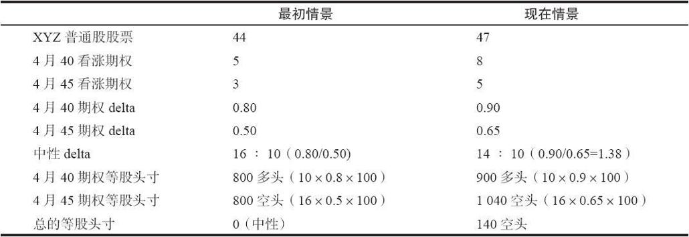

# 11.2　后续行动

根据价差的初始收入或支出，有可能根本不需要采取任何下行方向的防御行动。如果初始支出很大，期权的卖出者就应当将卖出的期权向下挪仓，就像在卖出比率中那样。

【示例11-5】当股票价格在60附近时，投资者通过买入1手XYZ 7月40看涨期权和卖出2手7月60看涨期权来建立了一手比率价差。他之所以这样做，也许是因为当时7月40的售价处于持平。如果标的股票价格下跌，这个价差交易者可以挪仓到50，进而到45，就像他在卖出比率中那样。另一方面，如果这个价差一开始是用相邻行权价的期权来建立的，较低的行权价就在较高的行权价之下，那么，就没有必要采取挪仓的行动。

### 11.2.1　降低比率

同卖出比率不一样，比率价差在上行方面的后续行动通常不包括向上挪仓。交易者一般买入更多的看涨期权以降低这个价差的比率。他最终应当将这个价差的比率降低到1：1，也就是将它转化为普通的牛市价差。用一个示例可以帮助说明这个概念。

【示例11-6】在最初的示例里，价差交易者买入1手4月40看涨期权，卖出2手4月45看涨期权，得到了1点的净收入。假设这个价差交易者不得不再买入1手4月40看涨期权作为对上行方向风险的一种防御。他如果买入第2手看涨期权，他的总头寸就变成了一个正常的牛市价差（买入2手4月40看涨期权，卖出2手4月45看涨期权）。如果XYZ在4月到期日时价格超过45，这个牛市价差的平仓价值就是10点，因为只要股票价格在4月超过45，这2手牛市价差的跨度就扩展到了它们的最大限度（5点）。这个比率价差交易者最初是用1点的收入建立的这个2：1的价差。如果他后来买入的4月40看涨期权花了11点，那他的总的成本就是10点。如果XYZ在4月到期日时价格高于45，这就代表了一个盈亏平衡的情况，因为正如我们刚刚指出的，这个价差在这个情况里平仓可以得到10点。因此，这个比率价差交易者可以等到4月看涨期权的售价是11点时再采取防御行动。这是一种动态的后续行动，行动取决于期权的价格，而不是股票本身的价格。

只要在买入这手4月40看涨期权之后股票没有反转方向而跌到45以下，那么，为这手期权所付的11点成本就可以让这个头寸保持盈亏平衡的状态。如果股票上涨得很猛，这个价差交易者也许会决定给上行方向预留一些盈利空间，而不是仅仅想要保持盈亏平衡。他也许会决定用9或10点买入这手额外的期权，而不是等它的价格到11点。当然，这就增加了在反方向出现风险的可能，但是，如果股票继续上涨，这个价差就有了一些盈利的空间。

如果最初价差的比率不是2：1，也可以使用同样的思路。事实上，买入额外的看涨期权可以是一个两步的过程。

【示例11-7】如果这手价差一开始是买入5手看涨期权和卖出10手看涨期权，这个价差交易者并不一定要等到4月40的售价变为11再买入所有的使得这个价差变为普通牛市价差的5手看涨期权。他可以决定在较低价格上买入2或3手，从而在某种程度上降低他的比率。然后，如果股票上涨得更高，他可以买入需要的看涨期权。通过在较便宜的价格上买入一些，价差交易者就给了自己一个机会，在上行方向可以等更长的时间。从根本上说，这个价差中所有5手额外买入的看涨期权必须按平均11或者更低的价格买入，这样才能使得这个价差盈亏平衡。不过，如果它们之中的前2手是用8点买入的，那在这个看涨期权的售价涨到13之前都不必再买入其余的几手。因此，他可以在把价差比率降低至1：1（牛市价差）之前，在上行方向等得更长。有一个公式可以用来计算额外买入的看涨期权的价格，从而把比率价差转化为牛市价差。如果买入了这些看涨期权，在到期时股票高于较高的行权价，这样一个牛市价差就会盈亏平衡：

买入看涨期权盈亏平衡成本=（卖出看涨期权数目×行权价差价-至今的总支出）/裸看涨期权数目

在上面简单的2：1的示例里，卖出的看涨期权的数目是2，行权价的差价是5，总的支出是-1（因为它实际上是1点的收入），裸看涨期权的数目是1。因此，额外的买入看涨期权的盈亏平衡成本＝[2×5-（-1）]/1，即11。作为这个公式的另一个证明，考虑一下同样价格上的10：5的价差。这个价差的初始收入是5点，5手额外的看涨期权多头每手的盈亏平衡成本是11点。假定价差交易者用每手8点买入了额外的2手4月40看涨期权（16点支出）。这就使得这手价差在这时的总支出为11点，并且将裸看涨期权的数目减少到3。如果股票继续上涨，那就需要为剩下的3手裸看涨期权买入看涨期权，它们的盈亏平衡的成本＝（10×5-11）/3，即13。这同前面的考察是一致的。这个公式可以用在实际实施后续行动之前。例如，在这个10：5的价差里，如果4月40看涨期权的售价是8，价差交易者也许会问：“如果我现在用每手8的价格买入2手4月40看涨期权，那么剩余买入的看涨期权的买价会因此而提高到多少呢？”通过这个公式，他可以相当容易就看出，结论是13。

### 11.2.2　调整delta

理论导向的价差交易者可以使用delta中性的比率来建立和监控他的价差。如果标的股票价格上涨过高或者是下跌过深，价差的delta中性比率就会发生变化。于是价差交易者就可以通过就股票上行的运动买入一些额外的看涨期权，或者是就股票的下行运动卖出一些额外的看涨期权，以调整他的价差至中性状态。无论是哪种情况，都能让他的价差恢复至delta中性。公众客户在后续行动中使用delta中性调整方法时应当小心，不要调整过度，因为手续费的开销会高到使他无法运作。在第28章28.5节中论述数学应用时，对将delta用做后续行动的一种手段有更详细的描述。不过，总的概念同前面在论述卖出比率时所说的是相同的。

【示例11-8】我们在本章前面讨论选择标准的时候，使用过一个当XYZ的价格为44时中性比率为16：10的示例。假定在这个价差建立起来之后，股票价格涨到47。交易者可以使用最新的delta进行调整。表11-4总结了这样的信息。最新的中性比率大约为14：10。因此，可以买回2手卖出的4月45看涨期权。在实际运作中，交易者一般通过在多头腿处加仓来减小比率。因此，交易者可以买入2手4月40看涨期权，将总的比率降低到16：12，也就是1.33，它同实际的中性比率1.38相近。因此，这个头寸再一次变为delta中性了。

解决这个问题的另一种方法是使用等股头寸，简称ESP，对任何期权来说，它的数量都等于期权手数乘以delta，再乘以每手期权对应的股份数。表11-4的最后3行显示了每手看涨期权以及头寸的总等股头寸。开始的时候，这个头寸的等股头寸是0，标志着它是满足delta中性的。不过，在现在的情况里，这个头寸的等股头寸是140股空头。因此，交易者可以通过买入140股XYZ来将这个头寸调整到delta中性。如果他想要使用期权而不是股票，他可以买入2手4月45看涨期权，它们可以给头寸加进为130股（2×0.65×100）等股头寸的delta多头，从而让这个头寸的等股头寸为10股空头，这就相当接近中性了。正如我们在上一段论述中所指出的，价差交易者也许应当买入内在价值最高的看涨期权，也就是4月40看涨期权。这些期权每一手的等股头寸都是90股（1×0.9×100）。因此，如果买入1手这样的期权，这个头寸的等股头寸就会是50股空头；如果买入2手，总头寸的等股头寸就会是40股多头。头寸中“多余的”delta究竟应当是卖空50股还是买入40股，这取决于个人的喜好。

表11-4　最初与现有的价格同delta

等股头寸方法只是对另一种方法的一种确认。两种方法的效果都很好。价差交易者应当熟悉等股头寸方法，因为在一个有许多个不同期权组成的头寸里，它将整个头寸约减为一个单一的数字。

### 11.2.3　提取盈利

除了防御行动之外，价差交易者还会发现，他可以提前将这个价差平仓以提取盈利或限制亏损。如果经过足够长的时间，而且标的股票的价格接近最大盈利点，也就是较高的行权价，那么，价差交易者也许应当考虑将这个价差平仓，提取他的盈利。与此类似，如果标的股票在到期日快到的时候价格在两个行权价之间的话，买入的看涨期权还有一些内在价值，而卖出的看涨期权几乎一文不值，这样，价差交易者通常会有一些盈利可提取。如果在这样的时候，交易者觉得没有什么可等的（价格下跌的话就会夺走看涨期权多头的价值），他就应当将这个价差平仓，提取他的盈利。
