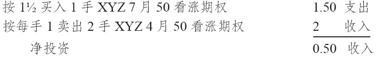
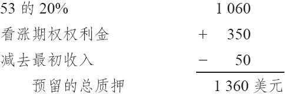

# 12.1　比率跨期价差

比率跨期价差（ratio calendar spread）是跨期价差和比率价差的组合。读者应当记得，跨期价差的一种哲学是要卖出近期看涨期权，买入较远期看涨期权，两个期权都是虚值的。这是一个看多的跨期价差。如果标的股票根本没有上涨，价差者就会亏掉相对较小的全部初始支出。不过，如果股票价格在近期看涨期权无价值到期之后上涨，那就有可能会有较大的盈利。一般而言，这种看多的跨期价差哲学有着较小概率获取大笔盈利的机会。而一旦这种较小的可能性变为现实，相对小规模的亏损而言，少数的大笔盈利具有更大的优势。

使用比率跨期价差，是要在保持大笔盈利可能性的同时，增加得到这样盈利的概率。在比率跨期价差中，价差者卖出一定数量的近期看涨期权，同时买入数量较少的中期或远期看涨期权。因为卖出的期权数量要多于买入的期权，其中就有裸期权。在建立一手比率跨期价差时常常会有收入。也就是说，如果标的股票始终没有上涨到行权价之上，策略家仍然会有盈利。不过，因为涉及裸看涨期权，实施这种策略的质押要求会很高。

【示例12-1】第9章所描写的牛市跨期价差使用的是下列的价格：

XYZ普通股股票：45

XYZ4月50看涨期权：1

XYZ7月50看涨期权：1.50

在这个牛市跨期价差策略里，每卖出1手4月50看涨期权，就买入1手7月50看涨期权。这意味着这个价差是用0.50的支出建立起来的，每手价差的投资是50美元。使用比率跨期价差的策略家，他所持的哲学与牛市跨期价差交易者本质上是相同的。他们希望股票在4月到期日之前会停留在50之下，然后会上涨。比率跨期价差可以按下面的方式设立起来：

在建立这个比率价差时有净收入，所以不涉及现金，但对那手4月50裸看涨期权会有质押要求。

如果股票在4月到期之前停留在50之下，那手7月50看涨期权多头就会是免费拥有的。在这之后，无论标的股票发生什么情况，这手价差都不会亏损。事实上，如果标的股票在近期到期日之后急剧上涨，随着7月50看涨期权的增值，会积累大笔盈利。当然，这全都取决于这手4月50看涨期权是否会无价值到期。如果标的股票在4月看涨期权到期之前涨过了50，因为有裸看涨期权，这个比率跨期价差就有大笔亏损的危险，必须采取防御行动。我们后面会讨论后续行动。

比率跨期价差所需要的质押等于裸看涨期权所需要的质押减去价差所得到的收入。因为裸看涨期权会随着股票价格上涨而逐日盯市，因此，最好是预留足以防御的质押金。在上面的示例里，假定交易者觉得如果股票在4月到期日之前涨到53时，他一定会采取防御行动，那么他就应当按照股票是53的情况来满足质押要求，而不管当前的实际质押要求是多少。只要涉及裸期权，这都是一种妥善的技巧，这样，在股票价格达到他认定的行动价位之前，策略家就不至于被迫平仓出场。下面显示了这个示例所需要的质押，假定这个看涨期权的交易价格是：

这个策略家并没有在这个策略中真正“投资”什么东西，因为他是用质押来满足保证金要求的，而不是现金。也就是说，他现有的投资组合资产不需要因为这个价差的建立而发生变化，当然，如果有亏损，还是会在他的账户中产生支出。许多裸期权策略在这方面都相似，策略家可以从他投资组合的质押价值中得到额外收益，而不必改变这个投资组合本身。不过，他应当小心，并用保守的方法来使用这样的策略。因为虽然获得的收入是“免费”的，但是如果出现亏损，他就不得不调整自己的投资组合。由于这个事实，为只用质押就可以运作的策略计算其收益率一直是很困难的。你当然可以根据一个头寸在存续期内有可能需要的最大限度的质押来计算收益率。在这样一个策略里，只要收益率为正，那些资本雄厚的大投资者都会感到满意。

回到上面的示例，如果标的股票在7月到期之前停留在50之下，策略家可以得到50美元的收入，减去手续费。但策略在上行方向的结果则无法得到如此明确的结论。如果股票价格在4月50看涨期权无价值到期之后上涨，那么潜在盈利的唯一限制就是时间。最让人担心的是股票在4月到期日之前上涨。如果股票立刻上涨，那么这个价差无疑会有亏损。如果股票慢慢地涨，但还是在4月到期之前达到了50，那么，这个价差就不会有多大的变化。使用同一个示例。假定XYZ在4月50看涨期权的存续期只剩几个星期的时候涨到了50。这时4月50看涨期权的售价有可能是1.50，7月50看涨期权的售价有可能是3。这个比率价差在这时平仓有可能保持收支相抵，买回2手4月50看涨期权的支出同卖出1手7月50看涨期权的收入相等。于是在整个交易中，他就有了0.50的盈利，再减去手续费。最后，交易者可以估计在4月50看涨期权的到期日，他要实现盈亏平衡时的股票价格。假定他认为XYZ在4月到期时的价格是53，那7月50看涨期权的售价就可能是5.50。因为4月50看涨期权在这时的售价是3（它们会处于持平），要把这个比率价差平仓，就会有1/2点的支出。买回这2手4月50看涨期权会有6点支出，而卖出7月50看涨期权有5.50点收入，净支出就是0.50点。当股票在4月到期时为53，整个价差交易就会实现盈亏平衡，因为建立头寸时有0.50点收入，而平仓时有0.50点支出。不过要减去手续费。因此，这个价差的风险明显地取决于在4月到期之前股票上涨到50之上的速度有多快。
