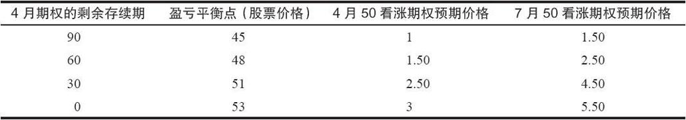
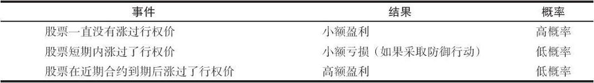

# 12.3　后续行动

这个策略中防御行动的主要目的，是限制当股票在4月到期之前出现上涨时的亏损。策略家应当在出现严重亏损前迅速将这个价差平仓。在某一点位之前，看涨期权多头的盈利都能够弥补看涨期权空头的亏损，在表12-1中可以看出这个事实。不过，股票不能持续上涨。一条通常有用的规则是，如果股票突破了技术阻力位，或者高于到期时的最终盈亏平衡点，那么就将这手价差平仓。在上面的示例里，如果XYZ在任何时候（自然是在4月到期之前）超过了53，策略家都应当将这手价差平仓。

如果已经过了相当长的时间，那么，策略家的平仓行动应该变得更快一些。正如前面所说的，如果在股票到达50时，离到期日只有少数几个星期，那么价差此时也许会有少许的盈利。如果股票涨过了行权价，最好的办法常常是提取这小笔盈利。

表12-1　盈亏平衡点随着时间而变化

### 好的概率

只要坚持进行上面介绍的防御行动，这个策略盈利的概率就相当高。如果股票价格一直没有超过行权价，这个价差可以盈利，因为这个价差是用收入建立起来的。这种情况本身就有很大的可能性，因为股票最初是低于行权价的。此外，如果股票在近期看涨期权到期之后上涨，这个价差就有很大的潜在盈利。虽然出现这种情况的可能性要小得多，由此产生的盈利可以增进这个价差的预期收益率。这个价差唯一会出现亏损的情形是股票价格迅速上涨，如果出现这种情况，策略家就不得不将这个价差平仓以限制亏损。

表12-2虽然在数学上不是那么精确，但它仍然显示出这个策略有正的预期收益。小笔盈利出现的频率比小笔亏损要高，有的时候还会出现大笔盈利。这些预期的结果，再加上策略家可以使用股票、债券或政府证券作为质押来建立这个价差的事实，都表明这个价差对高级投资者来说是一种可取的策略。

表12-2　比率跨期价差的概率

