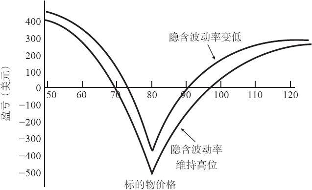

# 13.1　反向跨期价差

反向跨期价差（reverse calendar spread）是一个不常见的策略，至少交易股票或指数期权的公众客户因为保证金要求而不常使用这个策略。不过，即便是这样，你还是可以在期权策略家的武器库里找到它。同时，职业的和期货期权的交易者也常使用这个策略，因为对他们的保证金要求会宽松一些。

正如它的名字所指出的，反向跨期价差是一个与“正常”跨期价差相反的头寸。在反向跨期价差中，交易者卖出1手长期看涨期权，并买入1手短期看涨期权。这个价差也可以用看跌期权来建立，我们在后面的章节里将讨论这种方法。两手看涨期权的行权价是相同的。

这个策略会在下面的两种情况中赚钱：（1）股票价格运动到离行权价相当远的地方；（2）价差使用的期权的隐含波动率减小了。对熟悉“正常”跨期价差策略的读者来说，在第一种情况中出现盈利应当是显而易见的，因为如果股票在期权到期时刚好在行权价上，一手“正常”跨期价差就会有最大的盈利，如果股票价格上涨或下跌得太多，它就会出现亏损。

同任何涉及在不同月份到期的期权的价差一样，对这个策略的通常做法也是看一看头寸在股票价格在短期期权到期时或者在此以前的盈利情况。下面的示例可以说明这个策略是如何盈利的。

【示例13-1】假定现在是4月，XYZ的交易价是80。此外，假定XYZ的期权价格相当贵，交易者认为标的股票会大幅波动。根据这些假设，反向跨期价差成为一种盈利的途径。假定有下面的价格：

XYZ 12月80看涨期权：12

XYZ 7月80看涨期权：7

可以通过就12点卖出12月80看涨期权和就7点买入7月80看涨期权来建立一手反向跨期价差。这手价差在建立时有5点的收入。

如果XYZ之后急剧下跌，两手看涨期权都会几乎没有价值，这手价差就可以用比5点更低的价格买回来。例如，如果XYZ在1个月左右跌到50，7月80看涨期权就几乎没有价值，12月80看涨期权可以用1点左右的价格买回来。因此，这个价差就从它最初的价格5点缩减到1点，由此产生4点的盈利。

另一种盈利的途径是隐含波动率的下降。假定经过1个月之后隐含波动率下降了。这时这个价差就会价值将近4点，从而产生1点的未兑现盈利，因为它最初是以5点的价格卖出的。

图13-1的盈利图显示了这手反向跨期价差的盈利情况。图形上有两条线，两者描述的都是价差在短期期权（上面示例里的7月80看涨期权）到期时的结果。下端的线显示了如果隐含波动率保持不变的的话会出现的盈利或亏损。你可以看到，如果XYZ上涨到98之上或者下跌到70之下，这个头寸就会有盈利。另外，图形中较高的线显示了如果隐含波动率在短期期权到期之前下降的话，盈利会出现在哪里。在这个示例里，正如图形上所画的，会有额外的盈利。

图13-1　反向跨期价差在短期期权到期日时的盈亏

因此，这个策略可以通过两种途径盈利。建立这个价差的最佳时机是当隐含波动率很高，而且标的股票有大幅波动的趋势的时候。

对股票和指数期权的交易者来说，这个价差的问题是，它卖出的看涨期权被认为是裸期权。当然，这是荒谬的，因为短期看涨期权在它到期之前都是被完全对冲的。但保证金要求仍然必须遵守。虽然最近对整个保证金制度进行了修订，但这种惊人的无效率性还是被保留下来，因为没有一个会员公司想要去改变它。不过，如果某个交易者有多余的质押金（也许来自于一个很大的股票投资组合），而且有兴趣用对冲的方式来获得额外的收入，那这个策略对他就是适用的。期货期权的交易者能得到比较宽松的保证金要求，那对他们来说，这就是一个更为经济的策略。
