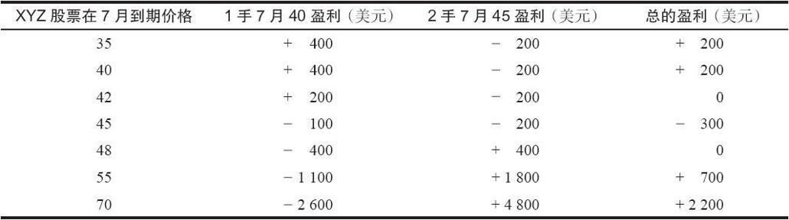
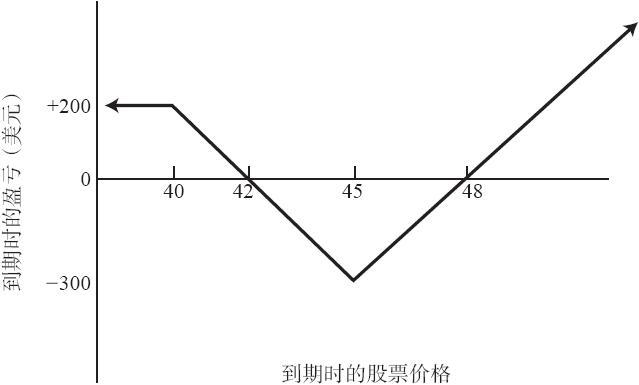
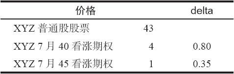

# 13.2　反向比率价差（后式价差）

一个更受欢迎的反向策略是反向看涨期权比率价差（reverse ratio call spread），它一般被称为后式价差（backspread）。在这种类型的价差里，交易者按照一个行权价卖出1手看涨期权，然后按照更高的行权价买入若干手看涨期权。它刚好同第11章所描写的比率价差相反。有些交易者把任何至少在某一侧上有无限潜在盈利的价差都称作后式价差。因此，在大部分后式价差的策略中，价差者都希望股票有急剧的运动。他一般并不在乎股票价格是上涨还是下跌。读者应当记得，在第4章描写的反向对冲策略（同买入跨式价差相似）中，如果股票大幅上涨或下跌，该策略家就会有大量的盈利。在这里所讨论的反向价差里，如果股票急剧上涨，就有大量潜在盈利存在，不过这个价差在下行方向的潜在盈利有限。

【示例13-2】XYZ的售价是43，7月40看涨期权的售价是4，7月45看涨期权的售价是1。可以用下面的方法建立起反向比率价差来：

这些价差通常是用收入来建立的。事实上，如果价差在建立时不能带来收入，它通常就没有吸引力。如果标的股票的价格在7月到期时跌到40之下，所有看涨期权都无价值到期，策略家的盈利就等于初始收入。反向比率价差在下行方向的最大潜在盈利等于最初的收入。另一方面，如果股票有显著上涨，上行方向的潜在盈利是无限的，因为价差交易者持有的看涨期权多头数量要多于看涨期权空头。简单地说，投资者是看多的，他买入了虚值看涨期权，并通过卖出另一手看涨期权进行对冲。如果股票价格如其所想地出现上涨，他就会有盈利。但如果股票暴跌，他也会有盈利，所有的看涨期权都将无价值到期。

这个策略风险有限。对大部分价差来说，如果股票价格在到期日时等于买入的那手看涨期权的行权价，那么就会实现最大亏损。对后式价差来说也是如此。

【示例13-3】如果XYZ在7月到期日时的价格刚好是45，7月45看涨期权就会无价值到期，亏损200美元。而7月40看涨期权就必须用5点的价格再买回来，这又亏损了100美元。因此总亏损将是300美元，这是这个示例的最大亏损。如果标的股票急剧上涨，这个策略就有无限的潜在盈利，因为每2手看涨期权多头对应1手看涨期权空头。事实上，交易者总是可以计算得出到期时的上行盈亏平衡点。这个示例中的上行盈亏平衡点是48。股票价格在7月到期日时是48，每手7月45看涨期权就价值3点，2手期权的净收益就是400美元。此时7月40看涨期权会价值8点，说明这手看涨期权有400美元的亏损。因此，股票价格在到期时为48的话，不计手续费，收益和亏损会相互抵消。如果股票在7月到期时高于48，那就会有盈利。

表13-1和图13-2显示了这个反向比率价差示例的潜在盈亏。请注意，这幅盈利图形就像是一幅比率价差的盈利图形以股票价格为轴而翻转过来。看一看图11-1的比率价差的图形。这里实际上有一个价格范围，超出这个范围（在这个示例里是低于42或高于48）就会有盈利。如果股票价格在到期时刚好等于买入的看涨期权的行权价，也就是45，就会出现最大亏损。

表13-1　反向比率价差的盈亏

图13-2　反向比率价差（后式价差）

这个策略中没有裸看涨期权，因此投资相对较小。这个策略实际上是在一个熊市价差上加上一手看涨期权多头。在这个示例里，熊市价差的部分是买入7月45看涨期权和卖出7月40看涨期权。这就要求有500美元的质押，因为在行权价之间有5点的差价。整个价差收入的200美元可以用来满足最初的保证金要求，于是总的投资需求就是300美元保证金再加上手续费。因为这里没有裸看涨期权，所以这个要求是不会增加或减少的。

请注意，在这个价差中可以运用delta中性的概念，方法同用在看涨期权比率价差上基本一样。通过使用价差中期权的delta，可以用数学方法计算出需买入和卖出的看涨期权的数量。

【示例13-4】中性的比率是用7月40看涨期权的delta除以7月45看涨期权的delta而得到的。

在这个示例里，这个比率是2.29：1（0.80/0.35）。也就是说，如果交易者卖出5手7月40看涨期权，他就要买入11手7月45看涨期权（或者，如果他卖出10手，那他就要买入23手）。如果一开始用的就是中性的比率，那无论股票在哪个方向上有迅速的运动，交易者都应当能够赚钱。

中性比率可以让交易者避免在开始时过于看空或者看多。例如，价差交易者如果只是为了方便而使用2：1而不是2.3：1的比率，那么他就看得不够多。如果需要做点什么的话，价差交易者在建立这个价差时通常应当更侧重于看多，因为最大盈利是在上行方向。在这个策略里，价差交易者没有理由在看多方面怯阵。因此，如果delta没有错，中性比率就可以帮助价差者得到更为精确的初始比率。

在这类价差中，价差者必须对提前行权的可能性保持警觉，因为他卖出的是实值看涨期权。除了监控这种可能性之外，没有什么可以实施的后续防御行动，因为这个头寸的性质限制了它的风险。如果股票在期权到期之前大幅上涨，他可以将价差平仓，提走盈利。

这个策略代表了一种以少量的质押成本而能从股票的大幅运动中获利的合理方法。在贯彻这个策略的时候，一般而言，策略家应当寻找那些波动率较大的股票，因为他希望在看涨期权到期之前股价有尽可能大的运动。在第14章里，我们将显示如果买入的看涨期权的存续期比卖出的看涨期权长时，这个策略有可能会变得更有吸引力。
