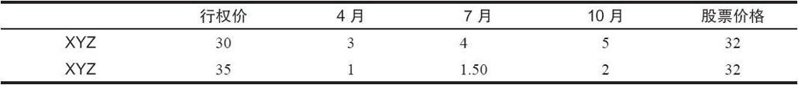
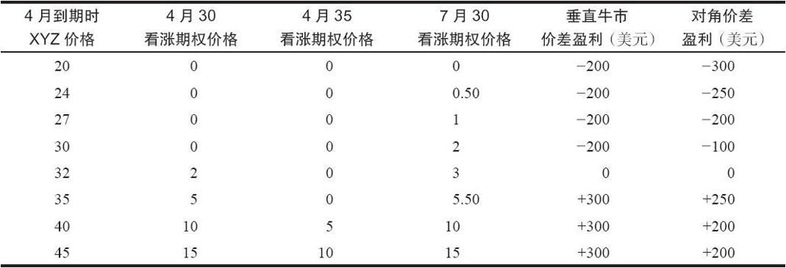

# 14.1　对角牛市价差

垂直牛市价差是由买入1手行权价较低的看涨期权和卖出1手行权价较高的看涨期权组成的，两者的到期日相等。对角牛市价差（diagonal bull spread）同它基本相似，只是交易者买入的是1手较长期的行权价较低的看涨期权，卖出的是1手较短期的行权价较高的看涨期权。买入和卖出的看涨期权的数量仍然相同。通过将这个价差对角化，如果股票到短期期权到期日时并没有上涨，那么这个头寸在下行方向就有了某种对冲。此外，一旦短期期权到期，这个价差常常可以通过卖出下一个到期日的看涨期权而重新建立起来。

【示例14-1】有下面的价格存在：

买入行权价为30的看涨期权同时卖出行权价为35的看涨期权，就可以建立起任何到期日系列上的一手垂直牛市价差。一手对角牛市价差是由买入7月30或10月30看涨期权，同时卖出4月35看涨期权而组成的。我们将使用下面的两手价差来对垂直牛市价差和对角价差进行比较。

垂直牛市价差：买入4月30看涨期权，卖出4月35看涨期权——2支出

对角牛市价差：买入7月30看涨期权，卖出4月35看涨期权——3支出

如果XYZ在4月到期时上涨到了35之上，这个垂直牛市价差就有3点的潜在盈利。这个普通牛市价差的最大风险是2点（初始支出），它出现在XYZ在4月到期时下跌到了30之下的情况。通过将这个价差对角化，策略家略为降低了他在4月到期日的潜在盈利，不过同时也减少了在这个头寸中亏损2点的概率。表14-1将这两类价差在4月到期时的情况进行了比较。7月30看涨期权的价格是估计的，以便于计算此时对角牛市价差的预计盈亏。如果标的股票跌得太深，例如跌到20，两手期权在4月到期时就会几乎全部亏损。不过，根据表14-1，如果XYZ在到期日时远高于24，这手对角价差就不会丧失它的全部价值。如果股票价格在到期时在27~32之间，对角价差的亏损金额实际上要比普通价差小，尽管建立对角价差的花费更高。就百分比而言，在这个范围里对角价差的优势甚至更大。如果股票在到期时上涨到35之上，普通价差的盈利就更大。表14-1显示出这个对角价差的一个有趣特征。如果股票显著上涨，所有的看涨期权都达到了持平，那么对角价差的盈利就被限制在2点。不过，如果股票在4月到期时接近35，看涨期权多头就还有些时间价值，而价差的跨度实际上超过了5点。因此，对对角价差来说，在4月到期时只有股票价格接近卖出的期权的行权价，才能达到它的最大盈利区域。这些数字表明，对角价差为了对下行方向的风险进行对冲而放弃了上行方向的部分潜在盈利。

表14-1　价差在到期日时的比较

一旦4月35看涨期权到期，对角价差就可以平仓。不过，如果股票在这个时候低于35，那么更合适的方法是就所持的7月30看涨期权多头再出售1手7月35看涨期权。这样就会在7月到期之前的3个月里建立1手普通牛市价差。请注意，如果XYZ在4月到期时仍然在32，且股票的波动率保持不变，7月35看涨期权也许可以卖到1点。这应当没有错，因为在到期前3个月股票在32时，4月35看涨期权价值1点。因此，按照这个思路行动的策略家就会有一个净支出为2点的普通牛市价差。他一开始为7月30看涨期权付了4点，然后卖掉4月35看涨期权得到了1点，接着因为出售7月35得到1个点。看一看示例14-1的价格表，读者可以看到，如果一开始要建立一手正常7月牛市价差的话，那就需要2.50点。因此，通过对角化并且让短期看涨期权无价值到期，策略家同样可以得到1手普通7月牛市价差，只是成本比一开始就这样做要低。这是一个特殊的示例，它证明了如果卖出者能够就同一个买入的看涨期权出售两次（或者3次，如果最初买入的是最长期限的看涨期权的话），对角化就能产生有益的效果。在这个示例里，如果XYZ在4月到期时在30~35之间，这个价差就可以被转化为1手普通7月牛市价差。如果股票在35之上，就应当将这个价差平仓，提取盈利。在30之下，也许就应当将7月30看涨期权平仓，或者只留下多头头寸。

总的来说，对角牛市价差常常可以对普通牛市价差形成改善。如果股票在卖出的短期看涨期权到期之前相对没有变化或者下跌的话，这个对角价差就是一种改善。在这个时候，如果股票价格有利，这个价差可以转化为1手普通牛市价差。当然，只要标的股票价格在到期日时高于较高的行权价，这个对角价差就能盈利。
