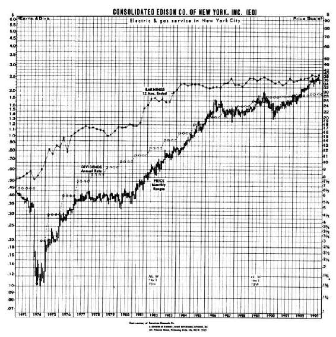
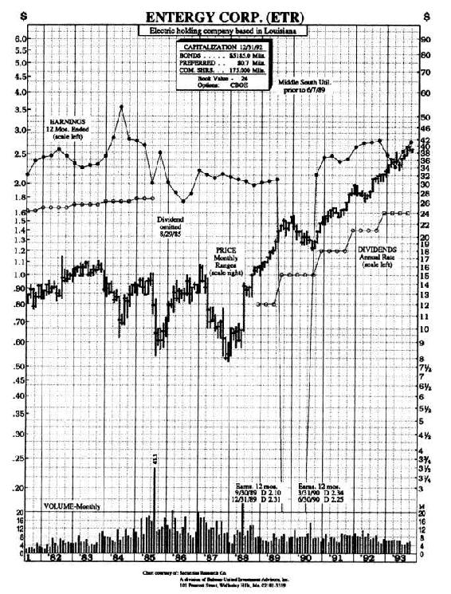
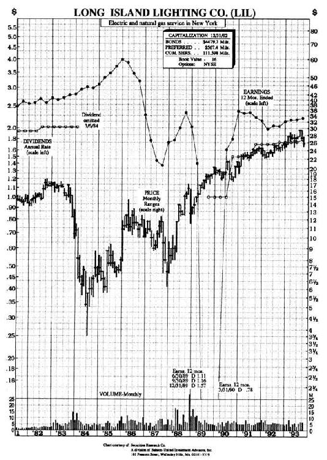
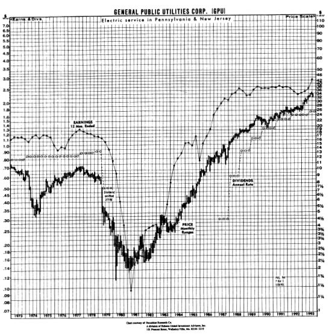

# 第16章　困境中的核电站：CMS能源公司

第16章　困境中的核电站：CMS能源公司

20世纪50年代，公用事业股是优秀的增长股，但从那以后，公用事业股的主要吸引力在于它们的收益。对于需要收入的投资者来说，长远来看，购买公用事业股比从银行买入大额可转让定期存单（CD[1]）更有利可图。CD带给投资者的是利息与本金，而公用事业股带给投资者的是红利——红利可能会逐年增加，并且还有资本增值的可能。

尽管近几年美国大部分地区对电力的需求已经降低，公用事业股也不再被视为优秀的增长股，但公用事业板块中仍然有一些巨大的赢家。这些赢家包括南方公司（Southern Company，过去5年中，股票价格从每股11美元上涨到每股33美元），俄克拉何马天然气电力公司（股票价格从每股13美元上涨到每股40美元）以及费城电力公司（股票价格从每股9美元上涨到每股26美元）。

在麦哲伦基金任职时，我曾多次短暂地将10%的资金投资于公用事业股。我通常是在利率下降而且经济不景气的时候这么做。换句话说，我将公用事业股股价当做利率周期信号，并试图相应地确定进入与退出公用事业板块的时机。

在公用事业板块中，我做得最成功的是投资于那些处于困境中的公用事业公司。在富达公司任职时，在“三英里岛”（Three Mile Island）灾难后，我们通过投资于通用公用事业公司为基金持有人挣了大钱，并通过投资于以下公司而为股东挣了更多的钱：新汉普夏公共服务公司的债券，长岛电力公司，墨西哥湾诸州公用事业公司（Gulf States Utilities）以及现在已经更名为恩特奇公司（Entergy Corporation）的原中南公用事业公司。这让我们有了第20条林奇投资法则：

像人一样，公司因为两个原因而更改名称：要么是结婚了，要么是卷入了某个它们希望公众将会忘却的惨败中。

上述所有这些陷入困境的公用事业公司都在核电站问题上栽了跟头，或者在永远无法完工的核电站融资问题上马失前蹄，而公众对核电站的恐惧则导致了这些公司股票下跌。

总体而言，我在陷入困境的公用事业公司上的投资业绩好于我在陷入困境的其他公司上的投资业绩，其原因在于公用事业公司受到政府的监管。公用事业公司可能宣告破产，并且/或者取消分红，但只要人们需要电力，就必须找到让电力公司继续运行的办法。

公用事业公司的监管制度决定了公用事业公司向消费者收取的电力或者天然气费率、它们被允许获得多少利润以及经营失误成本是否可以转嫁到消费者身上。由于各州政府与公用事业公司的生存利害相关，因此，政府给陷入困境的公用事业公司提供资金以让它们渡过难关的可能性非常之高。

最近NatWest投资银行集团的3位分析师─凯瑟琳·拉利（Kathleen Lally）、约翰·凯伦依（John Kellenyi）以及菲利普·史密斯（Philip Smyth）所做的研究引起了我的注意。我已认识约翰·凯伦依多年，他是一位很出色的分析师。

这些公用事业股分析师发现了他们称之为“陷入困境的公用事业公司周期”的现象，并提供了如下4个经历过这种周期的公用事业公司作为例证：统一爱迪生公司（Consolidated Edison），该公司在1973年的禁运中由于石油价格的暴涨而经历了现金危机；恩特奇公司，该公司身上曾压着一个它负担不起的昂贵核电站；长岛电力公司，该公司建造了一个核电站，却没有能够取得许可证；通用公用事业公司，该公司是“三英里岛”核电站二组的所有者，而该核电站发生过众所周知的可怕事故。

所有这4个陷入困境的公用事业公司的股票下跌到如此之低、下跌得如此之快，导致这些公司的股东也都深陷沮丧之中；而那些在恐慌之中抛售了股票的股东在看到股票价格后来反弹并上涨了4倍、5倍时，则更感沮丧，同时，那些买入了这些惨遭蹂躏过的股票的投资者则在庆贺自己的好运。这再次证明：一个人的困境可能就是另一个人的机会。你有一段很长的时间来从这4个公司的反弹中获利，而根据这三位分析师的看法，这些反弹经历了4个清晰可分的阶段。

第一个阶段：灾难突降。公用事业公司经历突如其来的收益损失，要么因为它们无法将巨额成本（统一爱迪生公司因为燃料价格暴涨而导致成本增加）转嫁到消费者身上，要么因为巨额资产（通常是核电站）被搁置，并且从费率基准中勾销。股票价格因而会相应地受到影响，并且在1~2年的时间中，下跌40%~80%：统一爱迪生公司的股票价格从每股6美元下跌到1974年的每股1.5美元，恩特奇公司的股票价格从每股16.75美元下跌到1983~1984年的每股9.25美元，通用公用事业公司的股票价格从每股9美元下跌到1979~1981年的每股3.88美元，长岛电力公司的股票价格从每股17.5美元下跌到1983~1984年的每股3.75美元。对于那些将公用事业公司股票视为安全而稳定的投资的投资者来说，股票的这种下跌让人惊恐。

很快，陷入困境的公用事业公司的股票以其账面价值20%~30%的价位在市场上交易。公用事业公司的股票遭受这些打击是因为华尔街担心这些公司遭受的损失可能是致命性的，特别是在投资数十亿美元的核电站被关闭之后。华尔街的这种印象需要多长时间才能得以改变在历次灾难中各不一样。在长岛电力公司这一案例中，破产的威胁导致该公司的股票价格在长达4年之久的时间中都以账面价值30%的价位进行交易。

第二阶段，约翰等分析师称为“危机管理”。在这一阶段，公用事业公司试图通过削减资本开支以及采用紧缩的预算来应对灾难。作为紧缩预算的一部分，分红被削减或者被取消。局势开始表明，公司将渡过难关，但是股票价格尚没有反映出这种前景的改善。

第三阶段，即“财务稳定”。公司管理层成功地将成本削减到公司可以依靠从付费用户那里收取的现金而运行的程度。资本市场也许尚不愿意为任何新项目提供融资，公用事业公司也仍然不能为它的股东创造任何利润，但它们的生存已经不成问题。股票价格出现某种程度的反弹，并以账面价值60%~70%的价位进行交易。在第一阶段或第二阶段买入股票的投资者的财富增加了一倍。

第四阶段，“反弹终于到来了！”在这一阶段，公用事业公司能够重新为其股东创造一些利润，华尔街也有理由预期公用事业公司的盈利将增加，并将恢复分红。公用事业公司的股票现在以账面价值的价位交易。此后的情形将如何发展取决于两个因素：①资本市场的接纳状况，因为没有资本，公用事业公司就无法扩展其费率基准；②政府监管机构的支持与否，即监管者允许公用事业公司将多少成本以提高费率的方式转嫁到消费者身上。

图16-1至图16-4显示了上述4个公司股票价格的历史走势。可以看出，无须为了大赚一笔而匆忙买入这些困境公司的股票。对每一个公司，你都可以等到危机已经缓和、世界末日论者已被证明错误之后才买入，这样仍然能在较短的时间内让你的投资增长2倍、3倍，甚至4倍。

图16-1　统一爱迪生公司

你可以在公司取消分红的时候买入股票并耐心等待好消息的到来，或者在第二阶段第一个好消息已经到来之后买入。对于有些人来说，这一策略的问题是：如果股票价格下跌到4美元，然后又上涨到8美元，他们会认为自己已经错失了这一反弹。要知道，困境中的核电厂要恢复过来需要一段非常漫长的时间，你应该淡化自己已经错失在市场触底时买入的良机这一事实——此时我们需要在心理上稍作粉饰。

图16-2　恩特奇公司

图16-3　长岛电力公司

图16-4　通用公用事业公司

困境中的核电厂与歌剧的区别在于，困境中的核电厂更可能有一个令人愉快的结局。这为我们暗示了一条利用困境中的公用事业公司来谋取一笔不菲的利润的简单途径：在这些公司取消分红的时候买入它们的股票，持续持有这些股票直到公司重新分红。这是一个成功率极高的投资策略。

1991年夏天，NatWest投资银行集团的专家们确认了另外5个处于不同反弹阶段的陷入困境的公用事业公司：墨西哥湾诸州公用事业公司，伊利诺伊电力公司，尼亚加拉——莫霍克公用事业公司，平纳克尔西部公用事业公司，新墨西哥州公共服务公司。所有这5个公司的股票价格都低于其账面价值，但在给《巴伦》周刊推荐股票的时候，我提及了另外一个公司，即CMS能源公司（CMS Energy）。

CMS能源公司就是以前的密歇根州消费者电力公司。在建造了中土（Midland）核电站（该公司希望股东们能忘记此事）之后，该公司改名换姓了。该公司的股票一直以每股20余美元的价格受到追捧，但随后在不到一年的时间中下跌到每股4.5美元，并在1984年10月分红被取消之后触底。

CMS能源公司是最近一个股票价格暴跌的公司，也是最近一个因为大意推测在核电站项目的整个开发阶段都批准了核电站项目的监管当局最终也会顺理成章允许核电站投入运行，而设计并建造了一个昂贵的核电站的公司。美国各州的公用事业委员会似乎养成了一个习惯：一开始支持兴建核电站，直到所有者已投入全部资金——再想停止核电站项目为时已晚，然后在最后时刻，这些公用事业监管当局又撤销了这些核电站项目，并坐视公用事业公司惨遭失败。

当这种情形发生在CMS身上时，该公司被迫勾销了40亿美元的巨额资产以抵消没有获得运行许可的核电站的建造成本。正如华尔街预测的那样，对于CMS来说，破产已为期不远了。

然而CMS并没有破产，到20世纪80年代末，通过将无法使用的核电站改造为天然气电厂，CMS将不利处境往最好的方向转化。这一转化（在CMS最大的顾客——陶氏化学公司的帮助下实现）代价高昂，但相比于眼睁睁地看着40亿美元的投资付之东流要便宜多了。改造后的电厂在1990年3月开始运行，发电成本是每千瓦1600美元，这一成本稍低于预算，而且电厂似乎运行良好。CMS股票价格随后开始一路反弹，并回升到每股36美元——在5年之中上涨了9倍，但随后密歇根州公共服务监管委员会就公用事业公司的费率所做出的两个不利决定导致CMS股票价格下跌到每股17美元，而我就是在这一价位偶然发现这只股票的。

我是从丹尼·富兰克那里听说CMS的事情的。丹尼·弗兰克是富达特殊情况基金的经理，他让数家处于困境中的核电厂得到了富达的关注。弗兰克透彻地分析了CMS的情形，认为CMS最近的问题主要是由于公用事业监管委员会的不友善行为导致的，这不足以成为CMS股票价格下跌50%的实质性理由。

1992年1月6日，我和CMS的新总裁维克托·弗赖林（Victor Fryling）进行了交谈。数年前，当弗赖林还在能源/管道公司海岸公司任职时，我就认识了他。弗赖林提到了公司两个积极方面的进展。第一个方面是改造成天然气电厂后的中土电厂发电成本为每千瓦6美分，而通常情况下，新建煤电厂的发电成本是每千瓦9.2美分，而核电厂的成本为每千瓦13.3美分。中土电厂是低成本运行，这正是我所喜欢的类型。

第二个方面是密歇根州对电力的需求在上涨。该州对电力的需求已经连续上涨了12年，即使在1991年的经济衰退中，电力消耗量也比上年增加了1%；而在电力消耗高峰日，CMS只有19.6%的发电能力储备——在电力行业中，这一比例非常低。在中西部，为满足日益增长的电力需求而准备兴建电厂的寥寥无几，而建造一个全新的电厂需要6~12年的时间，此外，一些已运行多年的电厂也已经停止运营了。从经济学基础理论我们知道，当需求的增长速度超过供给的增长速度时，价格必定上升，而更高的价格必然会带来更多的利润。

不过CMS的资产负债表上仍然有核电站项目失败遗留下来的大量债务，为了将中土核电厂改造成天然气电厂，CMS还发行了10亿美元的债券。（我想这些债券持有人一定对CMS很有信心，因为从第一次发行后，该公司的债券价格已经上涨。）此外，CMS还发行了5亿美元的优先债券，而让我感到高兴的是，10年之内CMS不能赎回这一优先债券，这意味着CMS短期内不需要偿还这一大笔钱。当某个公司债务沉重时，你往往不希望这一债务很快就得到全部偿还。

CMS有足够的现金流来支付债权人利息，通过研究CMS的资产负债表，我更确信这一点。我将该公司的收益与折旧相加，然后除以股票数量，得到每股现金流为6美元。由于CMS大部分设备都是新的，因此它无须花费大量的资金去维修设备，这样，折旧产生的资金可以用于其他用途，如：①回购公司股票；②进行收购；③增加分红。所有这些做法最终都会让股东获益，而如果是我，我会用这笔资金来做①和③。

我向弗赖林询问了CMS的现金使用计划。他说，CMS准备将现金用于扩大天然气电厂的生产能力和改善传送线路的效率，这两项工作都将增加公司的发电能力。依据监管当局确定电费费率的公式，当电力公司增加10%的发电能力时，公司的收益会自动增长10%。对股东来说，电力公司建造一个新电厂（一个至少取得了运行许可的新电厂）或者采取其他办法增加发电能力是一件再好不过的事情，因为发电能力增加，费率基准也会增加，而公司收益也随之增长。

弗赖林和我还讨论了最近在厄瓜多尔发现石油一事，发现石油的地域是CMS与科诺克（Conoco）石油公司联合拥有的，他们计划在1993年生产石油。如果计划能顺利进行，到1995年，CMS公司每年将获得2500万美元的利润，这笔利润将使每股收益增加20美分。弗赖林还告诉我，最近一直亏损的电力集团（Power Group，CMS的一个子公司，该子公司拥有数家并网发电的小电厂）可能在1993年开始盈利。

CMS曾希望去长岛，帮助长岛电力公司将由于政治因素而一直闲置的肖勒姆核电厂改造为天然气电厂，这一合作计划在1991年失败了，但自始至终最让人失望的还是监管当局。

处于复苏的最后一个阶段的公用事业公司的发展，要求监管当局对它采取温和态度，并允许它将经营失误的成本转嫁出去，但密歇根州公用事业监管委员会采取的是不合作态度，该委员会连续做出了三个不利于公用事业公司的费率决定，并拒绝CMS按中土电厂所耗天然气的全部价款向消费者收取电费。

显然，CMS有理由相信，密歇根州公用事业监管委员会的一位新近任命的成员可能更易于打交道——他只是比较温和的不友善，而非极端的不友善；鉴于该委员会的传统态度，温和的不友善就已经是一大改善了。该委员会自己的工作人员进行了一项研究，研究结果支持向CMS做出一些让步，而该委员会全体成员不久还将就这些让步进行投票表决。

如果CMS能够从该委员会那里得到一个从企业角度做出的合理决定，那么明年CMS将能获得每股2美元的收益（而华尔街的预期是每股1.3美元），此后，CMS的收益还将稳定增长。当我在《巴伦》周刊上推荐CMS时，这一可能性正是我推荐它的理由。

同时我认为，看好CMS不仅仅是对密歇根州公用事业监管政策的赌博，长远来看，我认为无论该州公用事业监管委员会的态度如何，CMS都将兴旺起来。CMS强劲的现金流将会让它重返业绩坚挺的公用事业公司行列，而在CMS重返这一行列之后，它就可以重新以较低的利息借到资金。如果所有这些都以有利于CMS的方式解决，CMS将能获得每股2.2美元的收益；如果不行，CMS的每股收益将在1.5美元左右；但无论哪种情况，长远而言，CMS都将兴旺起来。如果监管委员会限制它的收益，那么CMS可以将现金抽回用于增加发电能力，促进企业自身成长。在CMS股价为每股18美元，远低于账面价值的情况下，我认为买入CMS的股票将可能获得丰厚回报，而且不会有什么风险。

如果你不喜欢CMS能源公司，你也可以继续去研究不幸的新墨西哥州公共服务公司或者更不幸的图森电力公司（Tucson Electric）。可以肯定的是，这两个公司负责处理投资者关系的工作人员有的是时间与你高谈阔论（小结如表16-1所示）。

表16-1　小结

[1] 大额可转让定期存单，简称CD，是英文Certificate of Deposit的缩写。——译者注
