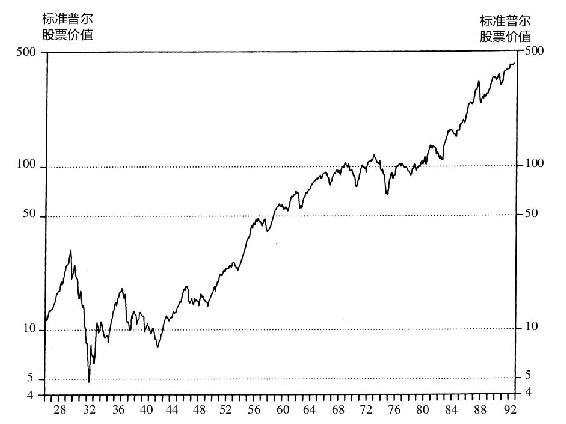

# 引言　想多赚钱就买股票吧

按理说，退休的基金经理只有资格提提投资建议，而不是著书立说，然而看到大部分人继续钟情于投资债券的现实，我不得不再次著书立说。显而易见，我在上一本书《彼得·林奇的成功投资》[1]中，曾试图一劳永逸地证明，把钱投资于股票的收益率要远远高于投资债券、大额定期存单或货币市场基金。有些读者肯定是一边看书一边打了瞌睡，不然的话，为什么到现在全美国90%的投资资金还是投在这些收益率远远低于股票的债券、大额定期存单或货币市场基金上呢？

回首20世纪80年代，这是现代股票历史上投资回报率最好的第二个黄金10年，仅次于50年代那10年，但是在这10年间美国家庭财产投资于股票的比例却下降了！事实上，这一比例一直在持续下降，60年代为40%，80年代下降到了25%，再到90年代下降到只有17%。不可思议的是，尽管在此期间道琼斯指数和其他股票指数上涨了4倍，一大批投资者却把资金从股市上抽走了。即使是投资于股票投资基金的资金比例，也从80年代的70%下降到了90年代的43%。

那么多家庭本可以将大部分资产投资于收益率高得多的股票却不投，个人乃至于整个国家财富未来本可以大幅增长却不能，这简直是一种灾难，看到这种情况，我怎么能坐视不理，怎么能听之任之。因此，在本书的开始，我还要接着我在上一本书中所强调的观点继续说：如果你想要自己的资产未来比现在增值得更多，那么你就应该把大部分资产投资到股票上。即使是未来两三年，甚至5年是大熊市，股市跌得让你后悔根本不应该买股票，你仍然应该把大部分资产投资到股票上。只要你看看20世纪股市的回报水平，你就会明白为什么应该如此。整个20世纪期间，几乎都是熊市，更不用说还有经济衰退，但结果仍然无可争议地表明：最终股票都是大赢家，投资于股票或股票投资基金的收益率，远远超过债券、定期存单或货币市场基金。

在我提出以上观点后，我所找到的最有说服力的证据是：《伊博森SBBI年鉴：1993》（Ibbotson SBBI Yearbook，1993）第1章第16页，在标题“1926~1989年的每年平均投资收益率”以下内容中的统计数据。这份数据概括总结了每年将资金投资于标准普尔500股票指数、小盘股、长期政府债券、长期公司债券、短期国库券的收益率水平，具体数据见表0-1。

表0-1　20世纪各年代平均年投资收益率（%）

①20年代按照1926~1929年计算。

资料来源：Ibbotson SBBI Yearbook，1993

假如我们之中真有一位超级投资天才，他就会在20世纪不同的年代选择收益率最高的品种进行投资：20年代把所有的资金全部投资标准普尔500股票，30年代全部投资长期公司债券，40年代全部投资小盘股，50年代又全部投资标准普尔500股票，60年代和70年代又全部投资于小盘股，80年代再次投资标准普尔500股票。如果有人跟随这种投资天才指引的投资策略操作的话，早就成了亿万富翁，在法国美丽的海滨享受着奢华的生活。如果我也有这种神通，能够提前知道不同投资品种的业绩表现，我自己肯定也会这样操作了，也早就成为亿万富翁了，可惜事后看，应该怎么做最好，一清二楚，人人都能做事后诸葛亮，而当事前看时，股市谁也说不准，所以至今没有一个人是股市中的事前诸葛亮。

我本人从未遇到过任何一个这种步步踩在准点上发了大财的人，因此我们中的绝大多数投资人都是智力平平的平常人，投资天才只能是凤毛麟角，寥若晨星。的确，我们这些普通人根本没有办法提前预测出，究竟未来哪些年代会十分罕见地出现债券投资收益率高于股票，但是20世纪20年代的统计数据表明，债券投资收益率很少超过股票，在1926~1989年60多年中，只有30年代债券投资收益率过股票（70年代二者基本持平），因此，那些专注于股票的投资者就拥有很大的优势：一直持有股票的投资者，就有6∶1的机会能够比那些一直持有债券的投资者取得更高的收益率。

而且，即使在那些罕见的债券收益率高于股票的年代，债券投资者所获得的超额收益率，也完全无法比得上在股票收益率高于债券的其他年代股票投资者获得的超额收益率，比如20世纪40年代和60年代。在1926~1969年的整整43年间，投资1000美元到长期政府债券，最终能够增值到160万美元；而同样是1000美元投资到标准普尔500股票，最终会增值到2550万美元。因此我总结出了第2条林奇投资法则：

那些偏爱债券的投资人啊，你们可知道不投资股票错过的财富有多大。

图0-1　1926~1989年标准普尔500指数的增长

但是大多数人仍然偏爱持有债券而不是股票。数以百万的投资人本可以投资股票，取得高于通货膨胀率5%～6%的高收益率，可他们却偏偏热衷于投资债券获得利息，但债券投资率只不过略高于甚至低于通货膨胀率。买股票吧！哪怕这是你阅读我这本书所得到的唯一收获，我辛辛苦苦写这本书也算值得了。

至于应该投资大盘股还是小盘股，或者说如何选择最好的股票基金（这些话题我们在后续章节会讨论），全部都是次要的，关键在于，一定要买股票！不管是大盘股、小盘股，还是中盘股，只要是买股票，都行。当然，前提是你能够用理性明智的态度来选择股票或股票基金，而且在股市调整时不会惊慌失措地全部抛空。

促使我写这本书的第二个原因是，我想进一步鼓励业余投资者的信心，继续坚持独立选股这种回报丰厚的业余活动。

在上一本书中，我曾说过，业余投资者只要花少量的时间，研究自己比较熟悉的行业中的几家上市公司，股票投资业绩就能超过95%的管理基金的专业投资者，而且会从中得到许多乐趣。

许多基金管理人都觉得我的这种观点简直是胡说八道，一些人甚至称之为“林奇的超级大牛皮”。然而，我辞去麦哲伦基金经理后，这两年半的时间更加坚定了我的信念：业余投资者比专业投资者更有优势。为了说服那些不相信这一观点的人，我搜集了更多的证据。

这些证据在本书第1章“业余选股者比专业投资者业绩更好的证据”里可以找到。其中一个案例是，在波士顿地区一所圣阿格尼斯（St.Agnes）教会学校里，一群七年级的学生们，创造了两年的优异投资业绩纪录，即使是华尔街专业投资人士也自叹不如，羡慕不已。

另外，许许多多成年的业余投资者宣称，多年来他们的投资业绩连续超过了管理基金的专业投资者。这些成功的选股者，分布在由全美投资者协会支持的数百个投资俱乐部中，他们的年投资收益率和圣阿格尼斯教会学校的学生们的纪录一样令人赞叹。

两组业余投资者有一个共同特点：与许多被高薪聘用的基金经理们所使用的复杂选股方法相比，他们的选股方法简单得多却有效得多。

不论你用什么方法选择股票或者股票基金，最终是成功或是失败，取决于你有没有坚韧不拔的勇气，抛开一切顾虑，坚定长期地持有股票，直到最后成功。决定股票投资者命运的，不是分析判断的智力，而是坚韧不拔的勇气。那些神经脆弱、过于敏感的投资人，不管头脑有多么聪明，股市一跌就会怀疑世界末日来临，吓得匆忙抛出，这种人总是再好的股票也拿不住，再牛的股票也赚不到钱。

每年年初，《巴伦》周刊都会发起一次专门会议，邀请最著名的投资专家对未来一年的股市进行预测，并在杂志上全文刊登会议记录。我很荣幸地也被邀请参加。如果你购买了我们推荐的股票，你肯定已经赚钱了，但是如果你只关注我们对于未来股市走势和经济发展趋势的意见的话，你会被吓得未来好几年都不敢持有股票了。本书第2章会讨论这种“周末焦虑症”的投资陷阱以及如何避免这一陷阱。

在第3章“如何选择基金”，我想告诉大家如何选择基金。尽管从内心而言，我一直都把自己看做是一个选股者，但是辞去麦哲伦基金经理职位以后，我才有机会来讨论如何选择基金，而我作为基金经理时对这一问题不得不回避。如果我还在基金管理行业干的话，关于如何选择基金，不管我说什么，都让人觉得是王婆卖瓜、自卖自夸，或者是变相宣传自己所在的基金来吸引客户。现在我已经退出江湖，我谈论如何选择基金，相信不会有人再这样指责我了。

最近，我在帮助一家新英格兰地区的非营利性组织（由于与本书主题无关故隐其名），设计一个新的投资组合策略。首先，我们确定了将多少比例的资金投资于股票，多少比例的资金投资于债券；其次，在股票和债券这两类中如何具体选择投资对象。每对夫妇在讨论家庭投资组合时也要进行同样的决策，因此我会详细描述我们是如何进行投资组合管理决策的，以供大家参考。

第4～6章是我的投资回忆录，在过去13年的时间里，我经历了9次股市大跌，这三章回顾了我是如何管理麦哲伦基金的。这种回顾，使我得以重新反思过去的投资经历，帮我弄清楚到底是什么原因导致我取得了投资成功。尽管我亲身经历，但有些结论连我本人也非常吃惊。

在投资回忆录这部分，我尽量集中讲述我选股的方法体系，而少谈我的投资业绩有多么好。也许从我偶尔少数的几次成功和无数次的失败中，你可以得到一些选股的经验和教训。

第7~20章占本书最多的篇幅，我会逐一详细讨论21个选股案例，这些是我于1992年1月在《巴伦》周刊上向大家推荐的股票。在本书前面我讨论的主要是投资理论，在后面讨论这21只股票时我向大家展示的是我在选股过程中所做的详细笔记。通过这些笔记，我想尽可能非常详细地分析自己的选股模式，其中包括如何识别出盈利希望很大的投资机会以及如何研究分析股票。

我用来说明林奇选股成功之道的这21只股票，基本上覆盖了投资者经常投资的主要行业和股票类型，包括银行业、储蓄贷款协会行业、周期性行业、零售业、公用事业等。我特意把章节安排成每一章专门讲述一种行业的股票案例。

最后在第21章“每6个月重新检查一次”中，讲述定期重新检查、分析投资组合中每一家公司基本面的过程。

其实，关于选股，我并没有什么绝招可以教给大家。世界上根本没有那种一选对股票就会响的铃。无论你多么了解一家公司，也不能保证投资这家公司的股票肯定能赚钱，但是如果你清楚地了解决定一家公司盈利还是亏损的关键因素，那么你投资成功的概率就会大大增加。在本书中我列出了许多决定公司经营成败的关键因素。

在这本书中，我提出了许多林奇投资法则，特别醒目地用黑体字标示，当然，前面你已经看到过两条了。这些投资法则中许多都是我从多年的投资生涯中总结出来的经验和教训，我为之付出的代价可是相当昂贵，而各位读者在这里可以一分钱不花就能得到它们。

（需要说明的是，我在本书后半部分中所讨论的21只股票，在我研究分析的过程中，股价是一直在变化的。例如，Pier 1公司，我刚开始研究这只股票时股价是每股7.50美元，而到后来我在《巴伦》周刊推荐这只股票时股价已经变成每股8美元。由于讨论的时间不同，我可能在书中某一地方说Pier 1公司股价为每股7.50美元，而在另外的地方说股价是每股8美元。书中还有其他股票的也有类似股价前后不太一致的地方，请大家理解。）

[1] One Up On Wall Street，中文版已由机械工业出版社出版。
