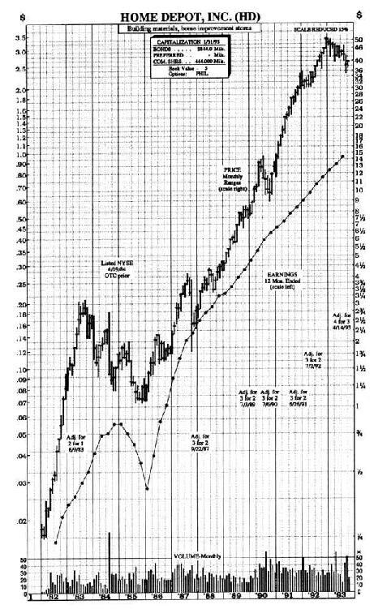
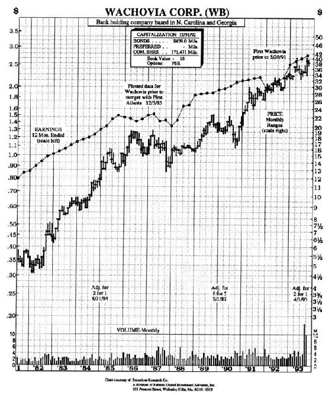
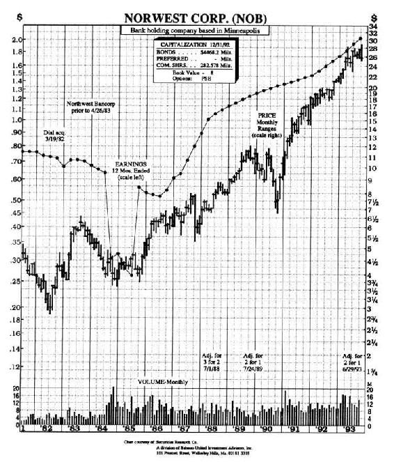
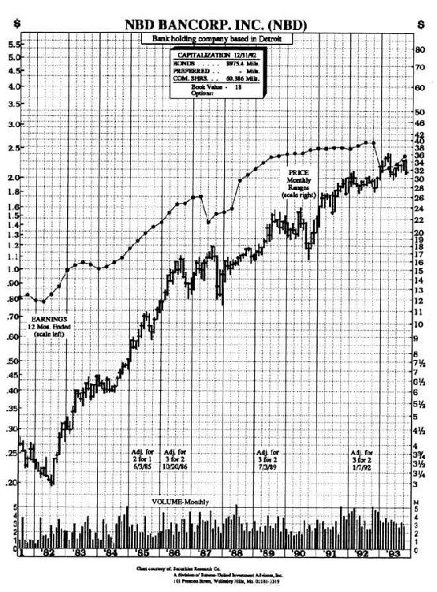

# 第4章　麦哲伦基金选股回忆录：初期

最近，我收拾了一下我的办公桌，清理掉最近刚收到的一大堆“红鲱鱼”[1]，从布满灰尘的书架上取下厚厚一大摞麦哲伦基金年报，希望弄清楚过去13年来我到底是如何管理这家基金的。在此过程中，我得到了富达基金公司电脑专家盖伊·塞兰德罗（Guy Cerundolo）、菲尔·塞耶（Phil Thayer）和杰奎斯·佩罗德（Jacques Perold）的帮助，特别是杰奎斯·佩罗德，他把我赚大钱的股票和赔大钱的股票列成了一张表打印出来。这张表的分析结果比我想象的还要有启发意义，甚至连我自己也对一些结果感到吃惊。大家原先普遍认为麦哲伦基金成功主要是来自于投资小盘成长股，但事实表明并非如此。

我之所以在此回顾总结过去13年管理麦哲伦基金的投资经验教训，是因为我希望我的回顾总结能给其他基金经理们和业余投资者们提供一些投资实务操作的参考，使他们能够从我的投资失误中吸取一些教训，或者告诉那些很有兴趣想了解我的人们，到底我的选股方法中什么有效，什么无效。我把这些回顾总结材料分为3章，分别讲述我管理麦哲伦基金的早期、中期和晚期。我的写作风格就像外交家写的回忆录，之所以如此，是因为这样便于组织材料，而不是因为我这个选股者一生中有什么值得骄傲自大的丰功伟绩，要写回忆录自夸。我只不过是一个普通的选股者而已，现在从基金经理职位上退下来仍然是。

富达基金公司并不是一家上市公司。如果富达基金公司是上市公司的话，我想我肯定会很早就建议大家买入富达基金公司的股票，因为过去一直亲眼看到每天都有新的资金潮水般涌入，亲眼看到富达旗下一只又一只新的基金成立，而且我还亲身体验到公司管理者有多么聪明能干，第一代管理者是约翰逊先生，然后第二代是他的儿子内德·约翰逊（Ned Johnson）。

一开始麦哲伦基金并不是我创立的，而是由内德·约翰逊先生在1963年创立的，当时叫富达国际投资基金（Fidelity International Fund）。但是后来肯尼迪总统对海外投资征税，迫使所有国际投资基金的经理们纷纷卖掉持有的海外上市公司股票，转而购买美国国内上市公司股票。在接下来的两年中，这一基金虽然名字是国际基金，事实上却是一只国内基金，直到1965年3月31日最后更名为麦哲伦基金。当时麦哲伦基金投资最大的重仓股是克莱斯勒，20年后这家公司从破产边缘走向复苏，又成了我管理麦哲伦基金时投资最多的重仓股。这个投资案例证明，对于有些公司你永远也不要失去信心而放弃。

在麦哲伦基金成立时，我还只是波士顿大学的一名学生，周末去打工做高尔夫球童。这一时期是基金业的黄金时代，几乎每一个人都想购买基金。就连我的母亲，一个只有少量积蓄的寡妇，也被这一阵基金狂热所影响。一个晚上做兼职基金推销员的学校教师极力劝说她购买富达资本基金（Fidelity Capital）。让她感兴趣的是，这只基金是一个中国人管理的，因为她相信东方人头脑非常聪明。这里所说的这位中国人就是蔡至勇（Gerry Tsai），他和管理富达趋势基金（Fidelity Trend）的内德·约翰逊并称为那个时代基金经理中的绝代双骄。

如果不是这个基金推销员告诉我母亲的话，她可能永远也不知道管理富达资本基金的基金经理是一个中国人。当时基金推销员队伍规模庞大，遍布全国，他们中大部分人是兼职，他们不停地给各家各户打电话推销基金，就像那些推销真空吸尘器、保险、墓地以及百科全书的推销员一样。我母亲接受了一个每月永续投资200美元的终生投资计划，她想以此来保障我们家未来经济上衣食无忧。但是她事实上并没有每月投资200美元的财力。不过富达资本基金业绩表现优异，在50年代增长了2倍，在60年代的前6年里又增长了1倍，超过了同期标准普尔500指数。

股市变幻无常，风险莫测。尽管如今的人们很难相信这一点，因为最近这些年股市持续上涨，但是，股市会突然大幅向下调整，而且调整会持续很长时间，哪怕实际上什么事情也没有发生。股市惨跌让那些报纸杂志根本不愿提到股市，在鸡尾酒会上再没有人吹嘘自己的股票表现如何如何好，投资者持股的耐心受到了严峻考验。那些仍旧坚决持股的投资者开始感到非常孤独，就像一个度假者在旅游淡季的风景区只能发现自己形单影只一样。

1969年，当我受雇成为富达公司的股票分析师的时候，股票市场正好即将要进入萧条。当时，股价已经到达了顶峰，接着就掉头向下，1972~1974年发生了股市大崩盘，这次股市崩盘是继1929~1932年股市大崩盘之后最严重的一次股市暴跌。突然之间，没有人再愿意买基金，原来狂热购买基金的投资者变得毫无兴趣。基金业极度萧条，以至于原来规模庞大、人数众多的基金推销员队伍不得不解散。这些推销员又重新回到他们推销基金之前的老本行，去推销真空吸尘器或者汽车石蜡。

人们纷纷撤出股票投资基金，而把钱转投到货币市场基金和债券投资基金。富达公司发行了一些货币市场基金和债券投资基金，从这些基金中赚了很多钱，足以维持另外少数几只当时不受欢迎的股票投资基金的生存。这些生存下来的股票基金不得不和其他股票基金在吸引客户上激烈竞争，因为当时对股票还感兴趣的投资者就像濒临灭绝的动物一样，正以越来越快的速度不断减少。

当时股票投资基金之间的投资风格区别很小。许多股票基金都叫做“资本增值基金”（capital appreciation fund），这是一种很模糊的说法，能够给基金经理们很大的回旋余地，他们可以购买各种股票而不受限制，包括周期型股票、公用事业股票、成长型公司股票、特殊情况股等。尽管每一只资本增值基金的股票投资组合并不一样，但是对于基金推销员来说，这些基金产品看起来都差不多。

1966年，富达麦哲伦基金资产规模为2000万美元，但是到了1976年，由于投资者赎回，资金不断流出，基金规模减少到只有600万美元。这样一个只有600万美元规模和基金管理费为0.6%的基金，每年基金管理费收入一共只有3.6万美元，连付电费都不够，更不用说支付员工的工资了。

为了产生规模经济效应以节约成本，在1976年，富达公司把规模为600万美元的麦哲伦基金和另外一只规模为1200万美元的艾塞克斯基金（Essex）合二为一，艾塞克斯基金是投资者对基金不感兴趣的一个牺牲品。该基金曾经一度资产规模高达1亿美元，但是由于其熊市中业绩表现十分糟糕，以至于亏损很大，税前可抵减亏损总额高达5000万美元，不过这也正是该基金吸引麦哲伦基金进行合并的主要原因。由于麦哲伦基金在1969~1972年在迪克·海伯曼（Dick Haberman）和内德·约翰逊共同管理期间以及在1972年后海伯曼管理期间业绩都相当出色，所以富达公司的管理层和托管人认为麦哲伦基金能够通过合并艾塞克斯基金来减免税收。合并后的新基金赚到的第一个5000万美元利润将不用缴税。

这就是1977年我被任命为麦哲伦基金经理时所面临的形势：两只基金合二为一，资产规模1800万美元，5000万美元的可抵税亏损，极度糟糕的股票市场，数量很少且迅速减少的基金客户，而且由于麦哲伦基金已经封闭，停止对投资者开放，所以无法吸收新的客户。

一直到4年以后，也就是1981年，麦哲伦基金才重新开放，人们才可以购买麦哲伦基金。如此之长时间的基金封闭使传媒产生了普遍误解。大家猜测是麦哲伦基金设计了一个非常聪明的策略，先封闭直到基金积累了一个良好的业绩记录之后再行推出，这样就可以刺激基金销售。麦哲伦基金经常被认为是基金业内所谓的开创新概念的试验田之一，富达公司给了格外延长的试验时间。

然而事实并非如此，富达公司一直很想吸引更多的客户来买基金。但是我们不得封闭麦哲伦基金的真正原因是，缺乏对销售基金感兴趣的机构。当时基金业极度萧条，以至于证券公司都撤销了基金销售部门，这样即使有极少数人有兴趣买基金，也找不到销售基金的销售人员。

不过我相信，我管理麦哲伦基金的前4年期间不再开放，不是坏事，反而是好事。这段对外封闭的日子，使我可以安静地学习投资，不断进步，即使犯了一些错误，也不会因广受关注而难堪。基金经理人和运动员有一个共同之处：让他们慢慢成长，他们未来的长期表现会更好。

我做股票分析师期间，所熟悉的股票范围包括大部分纺织业、钢铁行业和化工行业的股票，所有这些公司只不过相当于股市中上市公司总数的25%，因此对我来说，管理一家可以购买任何股票的资本增值基金，会感到过去的研究积累明显不足。好在我在1974~1977年间担任过富达基金公司研究部的经理，也是投资委员会成员之一，这些工作使我对其他行业也有所了解。1975年，我就开始帮助波士顿一家慈善机构管理投资组合，这是我第一次获得基金投资管理的直接经验。

我把我的上市公司调研日志当做最宝贵的宝贝珍藏，就像意大利风流文学家卡萨诺瓦（Casanova）珍藏他与情人约会的日记一样。翻开我的上市公司调研日志，让我回想起1977年10月12日，我拜访了通用影业公司（General Cinema），当时这家公司肯定没有给我留下什么深刻印象，因为这只股票后来并没有出现在我的买入清单上。当时，这只股票的价格不到1美元，然而今天却已经上涨到了30多美元，你可以想象一下，错过一只上涨30倍的大牛股会让我多么心痛。（这个30美元的股价已经根据公司送股情况进行复权处理，在本书其他地方你看到的股价也进行了同样的复权调整。因此，你在这里看到的股票价格也许跟股票行情走势图上的股价不一致，但本书中的盈利和亏损数据绝对准确无误。）

我的上市公司调研日志中记载了很多这样错过的投资机会，但是股票市场是非常仁慈的，它总是给笨人第二次机会。

在上任的第一个月，我整日忙于换股，卖出我的前任青睐的股票，换上我自己青睐的股票，并且还要不停地抛出股票变现，以应对投资者不断赎回基金的现金支出需要。

到1997年12月底，我的重仓股包括：康格里默（Congoleum）公司我一共持有51000股，市值高达833000美元。当时这对于麦哲伦基金来说，是一笔很大的投资，当然在10年后麦哲伦基金规模突破百亿后这样的投资额简直微不足道）、全美（Transamerica）人寿保险公司、联合石油公司和安泰（Aetna）人寿保险公司。此外，我发掘并买入的股票还有：汉尼斯（Hanes）公司（我妻子对这家服装公司生产的L’eggs连裤袜简直迷疯了）、塔可钟连锁快餐公司（Taco Bell，在我向我的第一个交易员查理·曼斯费尔德（Charlie Maxfield）下单买入时，他不禁吃惊地问：这是什么公司，是墨西哥电话公司吗？），房利美（一共购买了30000股）。

我之所以青睐康格里默公司，是因为这家公司发明了一种新的聚乙烯基薄膜地板材料，没有接口缝隙，可以像地毯一样整块铺到厨房里。除了生产地板材料以外，这家公司还利用生产预制房屋的组合式生产技术，为国防部制造小型驱逐舰，据说这种小型驱逐舰的发展前景很好。而我之所以选择塔可钟公司的股票，一是因为它的墨西哥煎玉米卷味道太棒了，二是因为美国90%的人们还没有吃过这种美食，三是因为这家公司有着良好的业绩记录和稳健的资产负债表，四是由于这家公司的总部办公室像普通车库一样简陋。这让我总结出了第7条林奇投资法则：

公司办公室的奢华程度与公司管理层回报股东的意愿成反比。

我最初所选股票包括：康格里默公司、恺撒钢铁公司、Mission保险公司、拉昆塔汽车旅馆、20世纪福克斯电影公司、塔可钟连锁快餐公司、汉尼斯公司等。这些公司除了都是上市公司之外，没有其他任何共同点。从一开始，我就为自己选股如此多种多样而感到不可思议，最值得注意的是我并没有选择化工行业公司，而我做分析师时研究得最深入的就是化工行业上市公司。

1978年3月31日，我接管麦哲伦基金10个月之后，麦哲伦基金1977年的年度报告出炉了。年报的封面是一张详细的古代南美洲海岸地图，上面标出了各个海湾和河流的名字，边上有三艘西班牙帆船，大概就是麦哲伦率领的舰队，向着好望角行驶。在随后几年里，随着基金规模越来越大，投资也越来越复杂，封面设计反而变得越来越简单。不久海湾和河流上的西班牙名字去掉了，而且舰队也从三艘帆船减为两艘。

我重新翻看了这份1978年3月出炉的麦哲伦基金年报，年报表明，基金在1977年净值增长了20%，而同期的道琼斯平均指数却下跌了17.6%，标准普尔指数下跌了9.4%。麦哲伦基金之所以如此成功，当然有一部分原因是我这个菜鸟基金经理人的功劳。在致基金持有人的信中，我总是尽可能简单地向投资者解释我的投资策略，我这样阐述：“减持汽车、航空、铁路、公用事业、化工、电子和能源行业股票，而增持金融、电视、娱乐、保险、银行、消费品、旅馆和租赁行业的股票。”就这样简单几句，就概括了我如何让这只资产规模仅有2000万美元的基金10个月内投资近50种股票的投资策略。

事实上我从来没有过一个全面的选股策略。我选股完全是凭经验，像训练有素的猎犬依靠嗅觉搜索目标一样，从一家公司到另一家公司不断搜索。我更多关注的是一个特定公司“故事”的具体细节，比如为什么一家拥有电视台的公司在今年将比去年利润更高？我却并不太关心我的基金在电视广播行业上的资产配置比例是过高是过低。为了更多了解详细情况，我就会去拜访一家电视台的管理人员，他会告诉我电视台业务正在明显好转，他还会告诉我最主要竞争对手的公司名字。然后我会核实所有细节问题，而结果往往是我没买这家电视台公司的股票，而改买了第二家电视台公司的股票。我在所有行业中寻找合适的股票投资目标，这表明，即使选股人对众多行业都只是略知一二，其实也没什么关系，照样可以成功选股。

由于麦哲伦基金是一只资本增值基金，于是我就有权购买任何投资品种，包括各种各样的国内股票、国外股票，甚至是债券。如此广泛的投资选择余地，对于我这种像猎犬一样到处搜索好股票的投资风格简直是如鱼得水。我并不把自己限制于成长型基金经理那样的投资风格。当所有成长型股票被过分高估时（这样的事情每隔几年就会发生一次），成长型基金经理就不得不继续购买股价已经明显过高的成长股，否则他的基金就不能保持成长投资这种风格了。他只能瘸子里面挑将军，在一大堆股价过高十分危险的成长股里挑选相对最好的了。而我却根本没有这样的烦恼，我可以随意挑选我想投资的任何股票，比如说，我发现成长股过高，我就可以不理成长股，而去寻找被低估的周期股；我会发现铝价正在上涨会推动美国铝业（Alcoa）公司的业绩反弹，其股价也将会大幅反弹。

1978年1月，我在基金年报中这样向持有人描述投资策略：“麦哲伦基金的投资组合主要包括3类公司：特殊情况公司、被低估的周期型公司以及小盘和中盘成长型公司。”

如果说这种解释不能清楚完整地描述我们范围很广的选股策略的话，一年后我们的解释更加详细：

麦哲伦基金的目标是通过投资五类相对具有吸引力的股票实现资本增值。这5类股票包括：小盘和中盘成长型公司、发展前景正在改善的公司、股价过低的周期型公司、股息收益率较高且不断提高分红的公司以及其他所有真实资产价值被市场忽视或者低估的公司……而在未来某个时间，国外股票也有可能在基金投资组合中占到相当大的比例。

其实所有这些解释可以简单归纳为一句话：只要是证券市场上交易的股票，麦哲伦基金都可以买。

在选股上，灵活性是关键。因为股市上总是能找到一些价值被低估的公司股票。在我管理麦哲伦基金的早期，赚钱最多的两只股票都是大型石油公司：美国优尼科（Unocal）石油公司和皇家荷兰石油公司。你可能会以为一只规模仅有2000万美元的小基金会集中投资于小盘成长股，而不太会投资于那些盘子很大的大型石油公司。但是我发现皇家荷兰石油公司业绩正在大幅好转，而华尔街显然并没有意识到这一点，于是我就趁低买入了这只反转型股票。在麦哲伦还是一只小不点儿的基金的时候，我曾把15%的资金都投在了公用事业股上。我持有波音公司和托德造船公司（Todd Shipyards）这两只大盘股的同时，还持有国际服务公司（Service Corporation International）这家像麦当劳一样全国连锁的丧葬服务公司的股票。大家都普遍认为麦哲伦基金的成功归因于大部分投资于成长股，但我其实从未将一半以上的资金投资于成长股。

许多基金经理人在投资态度上总是防守，防守，再防守——先是买入股票，然后一旦这些股票表现不好时，不愿割肉，于是继续持有，并想方设法找出各种新的借口给自己持有这些烂股票辩护（华尔街的许多基金经理把很大一部分精力仍然用在想方设法给自己业绩不好找借口上）。而我在投资上总是进攻，进攻，再进攻——不断地寻找价值低估更厉害、赚钱机会更大的股票，来替换掉我手中现有的赚钱机会相对较小的股票。1979年股市行情一片大好，标准普尔指数上涨了18.44%，而麦哲伦基金表现仍然远远超越大盘，增值了51%。在基金年度报告中，我像去年第一次写年报一样，又得绞尽脑汁向持有人们解释我如何取得这么好的投资业绩，这次我这样说：“增持旅馆行业、餐饮行业和零售行业股票。”

连锁快餐业之所以吸引我，是因为这一行业非常容易了解。如果一家连锁餐饮店在一个地方搞得很成功，它很容易在另外一个地方顺利地复制在上一个地方很成功的经营模式。我发现塔可钟墨西哥风味连锁快餐公司在加州开设了许多家分店，在取得了成功以后，就向东部继续拓展，在公司不断扩张的过程中，公司盈利以每年20%~30%的速度增长。我购买了Cracker Barrel的股票，不久之后我拜访了位于佐治亚州迈肯镇的Cracker Barrel乡村餐厅。我当时正好飞到亚特兰大去参加罗宾逊——汉弗瑞公司主办的一次投资研讨会，决定顺便拜访一下这家餐厅。在出租车上我看了看地图，这家餐厅所在的迈肯镇离我所住宿的亚特兰大市中心酒店只有几英里的路程。

然而，这几英里的路程却好像比100英里还要漫长，在交通高峰期，我本来打算只花很短时间顺路去看看，却花了3个小时才走完几英里的路程，不过最后我的努力还是没有白费，我吃到了美味的鲶鱼晚宴，并对Cracker Barrel的整个业务经营留下了深刻印象。这家公司的股价后来上涨了50倍，为麦哲伦基金赚了很多钱，曾被我列入50只最重要股票的名单。

我对另一家同样位于亚特兰大地区的自助建材超市也做了实地调查，这家超市的名称叫家得宝（Home Depot）。在家得宝建材超市，店员们服务热情礼貌，非常专业，给我留下了深刻的印象，还有他们的螺丝、螺栓、砖和灰泥等各种建材商品琳琅满目品种极其丰富，而且价格十分便宜。在这里，普通家庭那些自己装修的业余油漆工具和水电工具都可以称心如意地买到，而再也不用到价格又贵、品种又少的社区小油漆店和小五金店去受气了。

这时的家得宝还只是处于发展初期，其股价也只有25美分（根据后来拆股进行了调整），亲眼目睹了这家建材超市十分红火的业务之后，我就买入了这家公司的股票，可惜1年后我对它又失去了兴趣，就把股票卖掉了。回头看看家得宝15年来的涨幅，真让我感到终生遗憾。看看图4-1，家得宝建材超市的股票在15年内从25美分上涨到了65美元，上涨了260倍，我是一开始就抓住了这只大牛股，但却没有看出它会有如此之大的发展潜力，结果没有一直握住股票，以至于与这只上涨260倍的大牛股失之交臂。

图4-1　家得宝建材超市公司

要是家得宝超市就开在我家附件的新英格兰地区，要是我对建材比较了解，知道飞利浦螺丝刀和葡萄酒开瓶器的区别，也许我就会准确判断出这家公司的巨大增长潜力，而不会过早卖出这只大牛股了。另一只大牛股玩具反斗城（Toys“R”Us），我也是买入后不久就抛出了。这两只过早卖出的大牛股是我投资生涯中最糟糕的两次卖出决策。

虽然没有从家得宝建材超市这只大牛股上赚到很多钱，但是麦哲伦基金的投资业绩在1980年仍像1979年一样成功，而且还更高一些，投资收益率高达69.9%，而同期标准普尔指数却只上涨了32%。而我最近投资仓位最大的是赌场行业（准确地说是Golden Nugget公司和国际度假中心公司（Retorts International））、保险业和零售业。我十分看好便利店的发展，又一下子同时买了Hop-In Foods、Pic’N’Save、Shop&Go、Stop&Shop、Sunshine Jr.等很多商业连锁行业的股票。

回顾我担任麦哲伦基金经理前几年的投资时，我很吃惊地发现，当时基金的换手率非常高：第1年换手率343%，当时基金投资组合中有41种股票，随后3年的换手率是300%。从1977年8月2日我出售了30%的持股开始，我就一直在以惊人的频率不停地买进卖出，每个月在我的投资组合中都会有石油公司、保险公司和消费品公司的股票不断进进出出。

1977年9月我买入了一些周期型公司股票，到11月份我又把它们抛掉了。也是在那年秋季，我买入了房利美公司和汉尼斯公司的股票，第二年春季又把这两只股票卖掉了。我的第一大重仓股从康格里默公司换成了西格诺（Signal）公司，然后又换成了Mission保险公司，后来又换成了托德造船公司，再后来又换成了庞德罗萨（Ponrosa）牛排店。Pier 1公司也曾出现在我的投资组合中，后来又消失了；另一只名字很有趣的股票“第四阶段”（佛费斯，Four-Phase），也是这样出现后又消失了。

看上去我似乎每个月都要买进卖出佛费斯公司的股票，直到最近这家公司被摩托罗拉公司兼并（后来摩托罗拉为此后悔不已），所以我才不得不停止了频繁买卖这只股票。我只是模糊记得这家公司的业务跟计算机终端有关系，但我过去和现在始终都说不清楚它到底是做什么的。幸运的是我从未在我不了解的公司上投入太多资金，尽管很多科技公司就位于我们公司附近的波士顿地区128大道上。

大部分情况下我突然改变投资方向，并不是由于投资策略发现重大转变，而是我在拜访上市公司过程中，发现一些新的好公司股票，比我手里持有的股票更加让我喜欢。我可能两家公司都喜欢，都想持有，但对一只不断被赎回的小规模基金来说，我可没有那么多资金来满足这样的奢望。我就得先卖掉旧股票，才能有钱去买进新股票，而我总是不断想要买进一些新的好股票，于是我就不得不不断卖出那些老股票。似乎每一天我都会发现一些新的好股票，比如Circle K、House of Fabrics等，这些新的好股票看起来比昨天我持有的那些老股票发展前景更加激动人心。

频繁买进卖出股票，使我写基金年报时不得不费尽心思，因为我得让阅读我的年报的投资者们认识到，我频繁买进卖出所做的这一切都是合情合理的，而不是乱搞一通。我在某个年度会这样阐述我的投资策略：“麦哲伦基金的投资重心，已经从股价已经被高估的周期型公司股票，转向那些销售和盈利有望实现较大增长的非周期型公司。”而到了下一年的年报，我会换一种说法：“麦哲伦减持了那些业绩会受到经济放缓影响的公司股票，因此，基金仍将继续大幅增持价值被低估的周期型公司。”

现在回过头来看看这些年度报告，反思我过去的投资，我发现，许多股票过去我只持有了几个月的时间，其实应该持有更长一些的时间。这并不意味着对所有股票都要无条件忠诚长期持有，而是说对于那些投资吸引力变得越来越大的公司，要一直坚决长期持有，而不应该短期持有后就过早卖出。那些我过早卖出而后悔万分的公司包括：阿尔伯逊公司（Albertson），一只超级成长股，后来上涨了300多倍；玩具反斗城公司，也是一只超级成长股；Pic’N’Save，已在前面提过；华纳通信公司，我悔不该听一个技术分析人士的胡说八道而过早抛掉这只大牛股；还有联邦快递公司，我在5美元时买进，而过了不久它涨到10美元时就赶紧抛出了，但是两年后眼睁睁地看它上涨到70美元。

这种抛掉好公司股票买进差公司股票的事，对我来说，简直是家常便饭、司空见惯，因此我常常自嘲这样做是“拔掉鲜花浇灌杂草”。这句话已经成了我的一句名言。有天晚上，投资才能和写作才能都举世闻名的沃伦·巴菲特打电话跟我说，他想在他的年报上引用我的这句话，希望我能同意。巴菲特竟然会在他写的年报中引用我的话，这真让我感到万分荣幸。据说，很多人以11000美元的高价买一股巴菲特的伯克希尔-哈撒韦公司的股票，目的仅仅是为了能够得到一份巴菲特写的年报，这使得伯克希尔-哈撒韦公司的年报成了有史以来最昂贵的“杂志”。

与上市公司共进午餐

整整4年，麦哲伦基金对新客户封闭，同时基金又被严重赎回（大约1/3），我不得不抛老股票，才能有资金去购买新股票。这4年买进卖出大量股票，使我熟悉了各种各样的公司和行业，也因此逐渐懂得了是哪些因素导致这些公司或行业涨涨跌跌。那时候，我并没有意识到，我正在接受一种训练，正是早期的这种管理一只2000万美元小基金的训练教会了我日后如何管理一只几十亿美元规模的大基金。

从早期管理小基金的过程中，我所得到的最关键的一个投资经验是知道了自己独立研究有多么重要。我亲自拜访了几十家上市公司的总部，通过参加地区性投资研讨会又了解了几十家上市公司，而且每年都有越来越多的上市公司来到我们富达基金公司和我们进行交流（80年代早期每年大约就有200家）。

富达公司开始采取了一种新的午餐安排：与上市公司共进午餐。这取代了我们原先的午餐习惯——与办公室里的朋友共进午餐；或者与我们的股票经纪人共进午餐，边吃边谈打高尔夫球或是看波士顿红袜队的比赛。当然和股票经纪人及公司内的好友一起吃饭，气氛肯定会相当融洽，但对于投资而言，肯定不如和上市公司高管或者负责证券事务和投资者关系的人员一起吃饭更有价值，因为和上市公司边吃边谈能让你了解许多行业和公司的最新情况。

和上市公司共进午餐，很快就扩展到共进早餐和晚餐，发展到后来，在富达基金公司的餐厅里，几乎可以和标准普尔500指数中任何一家上市公司一起边吃边谈。每周，尼德利·查克斯（Natalie Trakas）都会打印出一份“菜单”，就像学校让孩子们带回家的那种菜单（周一吃意大利通心粉，周二吃汉堡），不同的是我们的“菜单”上列出的并不是菜名，而是来访的上市公司名单（周一是美国电话电报公司或是家得宝建材超市，周二是安泰保险公司、富国银行（Wells Fargo）或者Schlumberger等），你往往同时有好几家公司可以选择共同进餐。

既然我根本不可能参加所有的这种边吃边谈的通气会，那就只能有所选择。于是我选择自己没有投资过的上市公司一起吃饭，目的是了解一下由于不投资这些公司股票而没有关注到的那些重要信息，比如说，如果我对石油行业了解不足，那我肯定会参加与某家石油上市公司的午餐，这样边吃边谈能够让我很快了解到这个周期型行业的最新发展动态。

那些直接或者间接参与某一行业的人士总会知道或获得某些行业的相关信息，不论是供应方，还是销售方。以石油行业为例，比如油轮销售人员是供应方，加油站的老板或者相关设备供应商都会亲眼看到这个行业正在发生什么变化，从而能够充分利用这种优势，提前抓住投资机会。

波士顿可以说是一个基金之都，这个城市聚集了许多基金公司，因此经常会有很多上市公司到波士顿来，这使我们每年不用出差离开这座城市，也照样可以与数以百计的上市公司见面。每当首次公开发行股票、增发或者业绩推介时，这些上市公司高管和财务人员就会到波士顿进行一场又一场路演，与许多机构投资者进行交流，其中肯定会包括帕特南基金公司、惠灵顿（Wellington）基金公司、麻省理财公司、波士顿道富投资公司和富达基金公司。

富达基金除了邀请上市公司共进早餐、午餐、晚餐之外，还鼓励分析师和基金经理们下午到会议室里和上市公司有关人士一起喝喝下午茶，闲聊一下，这也是了解上市公司信息的一种补充渠道。经常是那些前来富达基金拜访的上市公司人士在喝下午茶时，主动和我们的分析师和基金经理闲聊起来，但是也有许多场合是我们主动邀请他们一起喝下午茶边喝边聊。

当一家上市公司主动想要向我们讲述它们的故事的时候，通常情况下这家公司同时也正在向华尔街上所有其他投资者讲述同一个故事。因此如果我们主动先邀请一家公司来进行交流，那么这种交谈就可能会让我们比别人早一步知道某些重要信息，所以这种交流更有意义。

我会花一个小时的时间与一个来自西尔斯百货的人交谈，以了解有关地毯的最新销售情况。也许和壳牌石油公司的一位副总裁交流，他会向我简述一下石油、天然气以及石油化工市场的最新情况（和壳牌石油公司人士交谈时得到的一个及时信息，让我及时卖掉了一家乙烯公司的股票，不久之后这只股票暴跌）。一位来自凯普尔（Kemper）保险公司的人士会告诉我保险费率最近是涨是跌。10次这样的闲谈，其中可能有两次会让我发现一些重要的信息。

我个人养成了一个定期交流的习惯，每隔一个月与每一个主要行业的代表人士至少交谈一次，以免漏掉这一行业最新的发展动态信息——比如行业开始反转或者有其他的华尔街投资公司忽略掉的这些行业的最新动态。这种与上市公司交流的习惯，是我的一个非常有效的投资预警系统。

在和上市公司的交谈中，我最后总是会问这样一个问题：“你最敬佩的竞争对手是谁？”当某一家上市公司的总裁承认它的一个竞争对手做得一样好或更好时，这就是对竞争对手实力的最高认可。结果往往是我并没有买我交流的这家公司的股票，反而去买了他们十分敬佩的竞争对手公司的股票。

我们所寻找的信息既不是仅有少数人才知道的秘密，也不是不可泄漏的机密，与我们交流的上市公司很乐于与我们分享他们所知道的信息。我发现大部分的上市公司代表们都十分客观和坦率地谈论他们的公司在经营中的优势、劣势。当公司业务不景气时，他们承认现实，而且告诉我们他们认为什么时候业务会好转。对别人的动机，特别是在和金钱有关系时，我们人类总是怀疑又怀疑，还要再冷嘲热讽一番。但在我几千次与想让我们基金购买它们股票的上市公司人士的会面交谈中，对我撒谎让我上当受骗的情况很少很少。

事实上华尔街的骗子可能要比大街上的骗子少得多。要记住，你是从我这里第一次听到这种说法的！这并不是因为华尔街上的金融业人士比大街上的商贩们更接近于善良诚实的天使，恰恰相反，正是由于投资者普遍不信任上市公司，所以证券监督管理委员会（SEC）对上市公司信息披露监管极其严厉，上市公司的所有公开披露信息都会受到证监会的严格审查，根本不允许任何上市公司说谎。就算是侥幸上一次说谎蒙混过关了，等到下一次公司披露季度报告时也会真相大白。

我总是留心注意用笔记下所有我在午餐和会议上遇见的上市公司人士的名字。其中很多人，之后几年我都会经常打电话和他们交谈，结果他们都成为我很有价值的信息来源。一年后我又再次拜访了他们。尤其是对于那些我不太熟悉的行业，这些上市公司的行业内部人士可以教会我在分析这些行业的上市公司财务报表时应该关注哪些要点，应该关注哪些核心问题。

在与安泰保险公司、旅行者（Travelers）保险公司和康健（Connecticut General）人寿保险公司的高管人员会面之前，我对保险业一无所知。短短两天时间的交谈，这些保险公司的高管给我上了一堂关于保险行业的速成课。我的保险知识水平肯定永远无法达到那些保险专业人士一样的程度，但是我学会了如何识别那些导致保险公司盈利上升或下降的因素，这样我就能发现一些关键的问题。

（我曾经说过，保险专业人士应该利用他们的这种专业优势，放着自己熟悉的保险业公司股票不投，而去投资那些自己根本一窍不通的铁路或垃圾处理行业股票，这岂不是白白浪费自己的优势吗？如果说无知是福，代价未免太高了。）

谈到保险业，在1980年3月，我把基金25.4%的资金都投在了保险业股票上，不是财产保险公司，就是意外伤害保险公司。由于我购买了非常多的保险行业股票，而当时保险业股票在股市非常受冷落，所以保险业协会邀请我参加，并请我作为保险业最好的朋友在保险年会上发表一次演讲。不过要是他们知道我在仅仅一年之后会抛出所有保险业股票转向银行业股票，也许就不会邀请我了。

当时是1980年，正值卡特总统执政的末期，美国联邦储备委员会为了抑制经济过热，猛踩刹车，把利息率提高到了历史最高水平。在这种形势下，尽管银行业增长前景非常好，但是银行股居然以低于账面价值的市场价格在销售。我并不是坐在办公室里，拍着脑袋一想，利率提高银行股会如何如何，于是发现银行股被严重低估的；而是在一次亚特兰大举行的由罗宾逊-汉弗瑞投资公司主办的一次地区投资会议上发现的。

事实上，当时我开始考虑银行股，并不是在这次会议之上，而是在会议之外。参加这次投资会议时，一个又一个根本没有经营历史记录又没有盈利的上市公司的介绍，让我听得烦死了，于是趁着会议中间暂停休息的时候，我就溜了出来，顺便去附近的第一亚特兰大银行拜访一下。这家银行连续12年都取得了很高的收益率，盈利能力远远高于那些正在会议上猛吹自己的许多上市公司。显然，投资者们都忽略了这家业绩优异的银行，而在5年后，当这家银行与北卡罗来纳州的瓦乔维亚银行（Wachovia）合并时，股价上涨了30倍。

华尔街总是非常关注那些在生死边缘垂死挣扎，要么生存、要么死亡的上市公司股票，却往往对实力雄厚、业绩稳定的银行股不感兴趣，像第一亚特兰大银行，股票市盈率只有市场平均市盈率水平的一半。

自从听说第一亚特兰大银行的情况的第一天起，我对这些业绩良好的地区性银行兴趣大增，但同时我也非常迷惑不解，为什么市场对这么好的银行股根本没什么兴趣？随便问问任何一个基金经理，图4-2、图4-3和图4-4中涨势如虹的股票是哪家公司的股票，他很可能会说是沃尔玛公司、菲利普莫里斯公司，或者是默克制药公司。这些股票走势图看起来都像快速成长型公司持续上涨的走势，谁又能想到竟然会是传统的银行股呢？图4-2中，股价在10年内上涨了10倍的，是瓦乔维亚银行的股票走势，图4-3是明尼波利斯西北银行的股票走势，图4-4是底特律NBD银行公司的股票走势。

我仍然感到吃惊的是，像NBD这样的银行，连续多年一直保持着15%的盈利增长速度，与像Pep Boys或者Dunkin’Donuts这样快速增长型公司的业绩增长速度一样高，但是市场给这些业绩同样快速增长的银行股的市盈率却非常低。可能市场普遍认为银行属于成熟的公用事业，想当然地认为银行只会像老牛拉破车一样，增长率很低，根本不可能会有很高的增长率，这实在是错得太离谱了。

这些地方性银行股票在市场上的错误定价给麦哲伦基金创造了许多极好的低价买入机会，这也正是为什么麦哲伦基金在银行业的仓位上要比其他投资者高出4~5倍。其中我所喜欢的一只银行股从2美元上涨到了80美元，你想知道是哪家银行吗？五三银行公司，听听这名字，有多么让人讨厌，可我一看就会忍不住想买进，因为我发现名字越让人讨厌，股票越有可能被低估。另一只我喜欢的银行股是Meridian银行，已经好多年没有投资者拜访过这家银行总部了。

图4-2

图4-3

图4-4

还有一只银行股是凯科银行（Key Corp），这家银行有一套“霜冻地带”（frost belt）经营理论，即通过收购小型银行，专注于在高山寒冷地区开展业务，因为这些地区的人们普遍很节俭，也很保守，很少会贷款违约，这家银行因此业务相当红火。

不过我在银行股上赚钱最多的还是地区性银行，如图4-2、图4-3和图4-4所示的那3家。我总是寻找那些有着雄厚的储蓄客户基础，且在贷款上效率很高又很谨慎的商业银行。在后面第6章表6-2中列出了麦哲伦基金最重要的50只重仓银行股票。

买了一家银行的股票，又会让我了解到另一家银行，于是我就这样一家接一家地买入银行股，到1980年底我已经把基金9%的资金投资在了12家不同的银行股上。

在1981年3月份推出的年度报告中，我非常高兴地指出，麦哲伦基金增值近100%，与1980年3月相比，麦哲伦基金净值已经增长了94.7%，而同期标准普尔500指数却只上涨了33.2%。

尽管麦哲伦基金的业绩表现连续4年都战胜了市场，但是基金持有人数却仍然在持续下降，在这4年期间基金份额被赎回了1/3。我无法确定发生这种情况的原因到底是什么，但据我猜测，可能是因为合并艾塞克斯基金而成为麦哲伦基金持有人的人们，本来并不愿意加入麦哲伦基金，于是他们等到大部分的损失得到弥补之后就马上赎回套现了。即使是投资一只非常成功的基金，投资人也可能会亏钱，尤其是当这些基金投资人只凭情绪决定买入还是卖出基金的时候。

由于大量赎回抵消了投资利润积累，所以麦哲伦基金的资产管理规模增长严重受阻。刚开始是2000万美元的资产规模，本来经过4年投资组合市值增长4倍，基金资产规模应该增长到8000万美元，但是实际上只有5000万美元。在我刚刚担任基金经理的1978年和1979年这前两年，基金持股数目是50~60家；在1980年中期，麦哲伦基金持股总数增长了130家；但是到1981年由于基金份额赎回大量增加，我不得不又把持股数目减少到90家。

1981年麦哲伦基金合并了塞拉姆（Salem）基金，我们的麦哲伦舰队又增加了一艘帆船。这只基金以前曾经叫做道氏理论基金，是富达基金公司旗下另一只经营不善的小型基金。塞拉姆基金的投资亏损也形成了亏损税收抵减的优惠。在1979年首次宣布合并之后的两年里，沃伦·卡西（Warren Casey）负责管理这家基金，尽管他的投资做得非常出色，但是这家基金仍然由于规模太小而根本无法收支平衡，没有任何经济效益。

直到合并塞拉姆基金之后，麦哲伦基金才重新开始向公众开放，进行申购。麦哲伦基金经历了这么长的封闭时间才重新开放，可想而知，当时面临的销售形势并不理想。富达公司的首席执行官内德·约翰逊决定，不再采取10多年之前从公司外部聘请推销员挨家挨户推销基金的做法，而是由富达公司内部销售人员来销售基金。

在我们第一次发行基金时，申购费率为2%。由于市场反应非常好，后来我们不得不把申购费率提高到3%，以减缓市场的抢购。不过后来我们又决定刺激销售，于是在3%申购费率的基础上，给予在60天以内申购的投资者以1%的优惠。

不过这次促销大行动差点由于一个工作失误而功亏一篑。这个失误是我们在公告上印错了联系电话号码。当对申购基金感兴趣的投资者们拨通这个错误的电话号码时，他们自然都认为是在给富达基金公司销售部门打电话，结果却发现是一个眼科耳科医院的电话。一连好几个星期，这家医院不得不一再向打错电话的人解释自己并不是一只共同基金。这真是糟糕透了。

在原有的资产规模基础上，加上与塞拉姆基金合并，再加上新发行的基金份额，麦哲伦基金资产规模在1981年首次突破了1亿美元大关。在这个时候我们刚刚引起了公众的一些兴趣，但结果如何呢？股市这时却发生了崩盘。事情往往就是这样的，当人们刚开始感到投资于股票比较安全的时候，股市就会来一次大调整。但是尽管股市大跌，1981年麦哲伦基金还是取得了16.5%的投资收益率。

毫不奇怪，股市大跌让麦哲伦基金有了一个好的开始。在1978年，我所持有的前10大重仓股的市盈率在4~6倍，而在1979年，1978年我所持有的前10大重仓股的市盈率只有3~5倍。当一个好公司的股票的市盈率只有3~6倍时，投资者几乎不可能会亏损。

在管理麦哲伦基金的前几年里，我喜欢的都是所谓的二线股，是中小型公司的股票，包括零售业和银行业股票等，我在前面已经谈过了。在70年代末期，基金经理们和其他投资专家们一直对我说，中小型公司股票的黄金时代已经一去不复返了，大盘蓝筹股的时代就要到来了。幸亏我没有听取他们的建议。大盘蓝筹股既没有什么令人激动的发展前景，股价水平也比二线股要贵上1倍多。小，并不仅仅是一种美丽，更重要的是能带来盈利。

[1] red herrings，华尔街对招股说明书的称呼。——译者注
