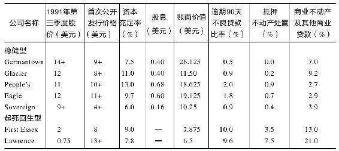

# 第12章　储蓄贷款协会选股之道

最近谁也不敢碰的股票，就是储蓄贷款协会。一听到这个字眼，大家都赶紧捂住自己的钱包。一提起储蓄贷款协会，大家就想到：储蓄贷款协会解困援助需要所有纳税人共同负担5000亿美元；1989年以来破产倒闭的储蓄贷款协会有675家之多；各家储蓄贷款协会的公司高管奢侈浪费得惊人；美国联邦调查局正在调查10000多件金融诈骗案。过去一提“储蓄贷款协会”，我们就会想到电影《风云人物》（It’s a Wonderful Life）[^1]中的吉米·斯图尔特（Jimmy Stewart）饰演的那位节俭的银行家，现在则会联想起身陷牢狱中的前任林肯储蓄贷款协会主席查尔斯·基廷（Charles Keating）。[^2]

自1988年以来，跟储贷机构有关的新闻报道到处都是，翻开任何一份报纸，都会有关于储蓄贷款协会破产、被起诉的消息，或者国会正努力审议通过对储蓄贷款协会进行援助的法案等等。关于这些负面消息，现在至少有5本专门进行讨论的著作，但关于如何经营储蓄贷款协会赚钱的书，却一本也没有。

尽管许多储贷机构麻烦不断，但那些没有问题的和摆脱困境生存下来的储贷机构却经营得非常不错，值得关注和投资。用最基本的财务实力分析指标——资本充足率来衡量，实力最强大的银行JP摩根银行也只不过是5.17%，而高于这一水平的储贷机构全美就有100多家；随便提几家，比如康涅狄格州的新不列颠大众储蓄银行，它的资本充足率就高达12.5%。

当然，J.P.摩根之所以能够成为最强大的银行，还有许多其他重要因素，只拿一个指标来跟这个大众储蓄银行进行比较，是有点离谱。不过我想表达的关键一点是，我们都听说储蓄贷款协会经营得非常糟糕，财务实力非常差劲，而事实正好相反。

的确有不少储蓄与贷款协会的财务状况很糟糕，所以区分优劣非常重要。我把储蓄与贷款协会分为三种基本类型：诈骗钱财的大坏蛋、把好事弄砸的贪婪鬼和吉米·斯图尔特那种节俭型的老实人。以下分别介绍。

### 诈骗犯

像老千一样用小钱骗大钱的一套骗术，的确一试就灵。后来许多涉及诈骗的储蓄与贷款协会，都是用这套骗术。这些骗子是这样做的，比方说有一群人，为简单起见，假设是10个，每人出资10万美元设立一家“信神”储蓄贷款协会。他们这样就可以用凑起来的这100万美元的股东权益，再吸收1900万美元的存款，然后在此基础上发放约2000万美元的贷款。

为了吸收1900万美元的存款，他们用特别高的利率来引诱存款人，并聘请美林证券和谢尔森这样的著名证券公司帮助吸引资金。几年前你或许在报纸上看到过类似的广告：“信神储蓄贷款协会的超级大额定期存单，利率高达13%，联邦储蓄贷款保险公司（FSLIC）提供担保。”有政府做担保，信神储蓄贷款协会的大额定期存单好卖得很，证券公司也乐得大力推销好多拿佣金。

吸收了1900万美元存款，再加上100万美元的股东权益，于是信神储蓄贷款协会的股东和董事们开始大肆放款给亲戚朋友们，大搞一些价值很值得怀疑的房地产项目开发计划，结果在很多根本没有房地产市场需求的地方创造出一时的房地产市场繁荣。由于贷款前先扣佣金，所以从账面上来看，信神储蓄贷款协会的盈利惊人得高。

这些“盈利”使公司股东权益相应增长，而股东权益每增加1美元，公司就可以再像前面一样，吸收19美元的存款，然后发放20美元的贷款。如此循环再循环，越滚越大，这就是为什么一些偏僻小镇的储蓄贷款协会，比如像得克萨斯弗农镇的储蓄贷款协会也可以发展到几十亿美元资产规模的原因。就是这样，贷款越多，盈利越多，股东权益也越多，公司规模也越滚越大，最后大到有足够的财力去贿赂会计师、审计师，收买银行委员会中有权有势的参议员和众议员，还有足够的钱购买Lear喷气式飞机，在船上搞派对，甚至进口大象……

除查尔斯·基廷等少数几家公司之外，大多数诈骗型的储蓄与贷款协会都不是股票公开上市的公司，而是私人所有。股票公开上市的公司有一套严格的审查制度，是这些诈骗公司的股东和高管根本无法忍受的。

### 贪婪鬼

不一定非得是一帮骗子，贪婪鬼也会破坏一家储蓄与贷款协会。说个故事好了，某个叫“死水一潭”储蓄公司的储蓄贷款协会，看到周围信神和其他竞争对手大赚特赚，实在是有些不服气。这些家伙通过向亲戚朋友发放大量商业贷款，收取高额手续费，一夜之间成为百万富翁，天天声色犬马，纸醉金迷。而死水一潭储蓄公司还是辛辛苦苦地做着传统的房屋抵押贷款，根本赚不了几个钱，凭什么他们能赚大钱我们却不能赚呢？

于是死水一潭储蓄公司也聘请了一位华尔街专家——吊带裤先生，来教他们如何赚大钱。吊带裤先生能教给他们的只有一套永远不变的招数：最大限度地借款，直接从联邦住房贷款银行借款，然后像其他储蓄与贷款协会一样，做一些能赚大钱的商业项目贷款。

死水一潭储蓄公司言听计从，于是向联邦购屋贷款银行借款，也出售大额定期存单吸收存款，也和信神储蓄贷款协会一样在报上刊登广告。现金一到手，死水一潭储蓄公司就把钱借给开发商去建造办公大楼、住宅公寓和购物中心。为了赚到更多的钱，死水一潭公司甚至投资入股这些房地产开发项目。非常不幸的是，经济萧条来临了，那些本来要租赁办公大楼、公寓或购物中心的租客一夜之间消失得无影无踪，开发商也拖欠贷款不还。结果死水一潭储蓄公司花了50年才积累起来的财富，却在不到5年的时间里就蒸发得干干净净了！

其实死水一潭储蓄公司的故事不过是信神储蓄贷款协会的翻版，只不过死水一潭储蓄公司的董事并没有向亲友发放贷款，也没有暗中拿回扣装到自己的腰包里。

### 老实人

我个人当然最喜欢一直默默努力赚钱，从不装腔作势，始终低成本经营的老实本分的储蓄贷款协会。这些储蓄贷款协会从邻近地区吸收存款，只进行传统的购屋抵押贷款赚些小钱就心满意足了。在全美各地许多小镇和某些大城市郊区等这些被商业银行忽视的地区都可以发现这一类储蓄贷款协会。很多储蓄贷款协会只有几家存款额很高的大型分支机构，这要比那些分支机构很多但规模很小的储蓄贷款协会的盈利能力强多了。

老实本分的储蓄贷款协会只维持简单的营运方式，因此根本不用高价聘请专家进行贷款分析，也不必像大银行那样高薪聘请大人物来担任高管。同样，公司也不会大把花钱把办公大楼修得像希腊神殿一样富丽堂皇，大厅不必放古典家具来摆阔，也不必用飞艇、大型广告牌、名人来大肆宣传，墙上也不必挂高价名画；最多用海报宣传一下就足够了。

大型金融机构，如花旗银行，其一般管理费用及其他相关费用，大约是贷款总额的2.5%~3%。因此要保持盈亏平稳，存款和贷款利差就得超过2.5%才行。

但老实本分的储蓄贷款协会经营成本低，即使是更低的存贷利差照样能够维持经营。存贷利差缩小到1.5个百分点左右照样能够维持盈亏平衡。从理论上讲，即使储蓄贷款协会根本不做任何抵押贷款，也照样能够赚钱。例如，向储户支付的存款利率为4%，而存款投资6%的国债，这样就有2%的利差；如果发放8%或9%的抵押贷款，储蓄贷款协会的利润率就更高了。

多年来，老实本分型的储蓄贷款协会的最佳榜样是加利福尼亚州奥克兰的金色西部储蓄贷款协会。金色西部储蓄贷款协会拥有3家分支机构，由一对快乐的夫妻搭档赫伯·桑德勒（Herb Sandler）和玛丽昂·桑德勒（Marion Sandler）经营。他们像电影《奥兹和哈里特的冒险》（The Adventures of Ozzie and Harriet）中的奥兹和哈里特一般沉着冷静，同时又像沃伦·巴菲特一样精明过人，这是经营成功企业的一对完美组合。对于不值得的投资风险，桑德勒夫妇根本不碰，诸如高风险垃圾债券或房地产商业投机项目，两人根本不予考虑，以确保金色西部储蓄贷款协会避免经营不善而破产倒闭或被政府收购接管。

桑德勒夫妇从来不喜欢在愚蠢的项目上浪费钱财。他们对新鲜玩意常抱着怀疑态度，因此到现在也没安装自动柜员机。他们也从来不用烤箱、冰桶等奖品来引诱客户存款。在房地产开发贷款的狂热中他们却不为所动，坚持固守于传统的住房抵押贷款，这项传统业务占其贷款总额的96%。

如果谈到公司管理怎么节约费用，桑德勒夫妇无人能比。他们不像其他追求气派豪华的银行和储蓄贷款协会一样把总部设在旧金山繁华高贵地段，而偏偏选在租金低廉的奥克兰地区。金色西部储蓄贷款协会公司总部前台只有一部黑色电话，客人来访得自行通报！

不过在各分支机构营业网点的装修上，桑德勒夫妇一点也不吝啬，装修得尽可能让客户感到愉快和合适。他们也经常派人假扮客户，暗中调查各分支机构的服务质量情况。

20世纪80年代中期，在西弗吉尼亚州举行的储蓄贷款协会年会上，玛丽昂·桑德勒发表演讲，题目是《经营效率与成本控制》。演说十分精彩也非常吸引人，但与会的储蓄贷款协会高管中却有1/3中途离席。他们不愿听关于如何压低成本的演讲，却蜂拥到另一个房间去听一场关于最先进的电脑系统和计算器的演讲了。如果当时那些人肯用心听玛丽昂·桑德勒关于降低成本的演讲，并认真做笔记，或许他们中的大多数人现在还能留在这一行里。

在20世纪80年代之前，金色西部储蓄贷款协会是少数几家股票公开上市的储蓄贷款协会之一。20世纪80年代中期股票发行热潮中，有几百家原来是私人持股的储蓄贷款协会，转型为“共同储蓄银行”（mutual savings banks）申请股票公开上市。当时我为麦哲伦基金买入了很多这种股票，几乎名称中有“第一”或“信托”的，都在我购买之列。有一次我在巴伦投资圆桌会议上说：我收到145家储蓄贷款协会的招股说明书，结果买了其中135家公司的股票。会议主持人埃布尔森反唇相讥说：“那几家你不买的是怎么回事？”

为何我如此狂热地不管好坏大量购买储蓄贷款协会的股票，在此我要解释一下。第一，麦哲伦基金规模非常庞大，但储蓄贷款协会股本很小，因此必须买入相当多的股票，才能对基金业绩有一定的影响，这跟鲸鱼必须大口蚕食浮游生物才能生存一样。第二，储蓄贷款协会股票上市方式十分特殊，这使它们的股价从一开始就明显低估（要想知道如何花一分钱就能得到好东西，请参见第13章）。

总部设在弗吉尼亚州夏洛茨维尔的SNL证券公司一直持续追踪储蓄贷款协会股票上市后的发展情况。在其一份最新的研究报告中指出，自1982年以来陆续上市的464家储蓄贷款协会中，有99家被大型银行或大型储蓄贷款协会收购，股东往往都因此大赚一笔（最明显的例子是新泽西州莫利斯县的储蓄银行，1983年以10.75美元上市，3年后以每股65美元被收购）；有65家股票公开上市的储蓄贷款协会破产倒闭，股东自然是亏得血本无归（我有深切体会，因为这类破产的股票我也买过）；目前继续经营的还有300家储蓄贷款协会类上市公司。

### 如何评估储蓄贷款协会

每当我想要投资一家储蓄贷款协会的股票时，就会想到金色西部储蓄贷款协会。但是在1991年金色西部储蓄贷款协会股价翻了一倍后，我只得在这个行业中寻找其他未来的大黑马。在准备1992年巴伦圆桌会议推荐股票名单时，我从储蓄贷款协会股票中找到了几只好股票。当时美国的经济和金融情况非常不乐观，很容易就能找到被严重低估的储蓄贷款协会股票。

前面讲过储蓄贷款协会如何诈骗钱财的故事，现在最大的问题则是房地产市场崩盘。当时大概有两年时间，整个美国都在担心害怕一件事：房地产市场即将崩盘，将会搞垮整个美国银行体系。20世纪80年代早期，得克萨斯州楼市崩盘，几家银行和储蓄贷款协会随之倒闭，至今令投资人心存余悸。如今美国东北部及加利福尼亚州高档住宅区房价大跌，让人不禁联想到会有同样的悲剧发生，这回是否也会导致有关银行和储蓄贷款协会倒闭？

当时美国住宅建筑商协会公布的最新统计数字表明，二手房价格在1990~1991年连续上涨。因此我认为，人们担心美国房地产市场会崩溃，其实只是高档住宅价格下跌引发的恐惧。那些老实本分的储蓄贷款协会对高档住宅和商业不动产或房地产开发的贷款十分有限，其贷款大部分集中于10万美元左右的住房抵押贷款。这些公司收益持续增长，拥有十分稳定的忠实存款客户群，而且资本充足率比摩根银行还要高。

但是在一片恐慌之中，这些老实本分的储蓄贷款协会的优点根本没人注意。华尔街的机构不断打压股价，一般投资人也纷纷低价抛售。富达基金公司的储蓄贷款协会精选基金（Select S&L Fund）资产规模也大幅缩水，1987年2月为6600万美元，到1990年10月竟只有300万美元。证券公司对储蓄贷款协会行业的股票研究覆盖范围也大为缩小，有些证券公司甚至不再研究这个行业。

富达基金公司以往有两位专职研究储蓄银行的行业分析师：戴夫·埃利森（Dave Ellison）负责大型的互助储蓄银行；亚历克·默里（Alec Murray）负责小型储蓄银行的研究。后来默里去了达特茅斯研究生院，他的空缺也没有人补上。埃利森则被分派去研究另外一些大型金融公司，包括房利美、通用电气以及西屋电器。这样对他来说，研究储蓄贷款协会股票成了业余工作。

全美国只研究沃尔玛百货一家公司的分析师大概就有50位之多，追踪菲利普-莫里斯一家公司的分析师有46位之多，但研究公开上市的储蓄贷款协会股票的分析师一共只有几个人。由此我总结出了第18条林奇投资法则：

分析师都感厌烦之日，正是最佳买入之时。

看到许多储蓄贷款协会股价很低，我开始深入研究这个行业的股票，认真研读《储蓄贷款协会行业投资指南》（The Thrift Digest），这是我喜欢的枕边休闲书之一。这部书由前面提到的SNL证券公司出版，由里德·内格尔（Reid Nagle）主编，他这本书做得非常出色。《储蓄贷款协会行业投资指南》差不多跟波士顿这个大都市的电话簿一样厚，每年要支付高达700美元的订费，才能得到每月更新资料。我特意告诉你价格是多少，是以免你一冲动就去订阅，却发现这份资料竟然这么贵，都可以买两张去夏威夷度假的来回机票了。

如果你真的准备在被严重低估的储蓄贷款协会股票中寻宝，这可比到夏威夷度假有意思多了。我建议你到图书馆，或到证券公司营业部借阅一本最新一期的《储蓄贷款协会行业投资指南》。我这一本就是向富达公司借的。

由于我晚饭之前、晚饭之中、晚饭之后都一直在看这本书，以致我妻子说这本书是我的旧约圣经。有这本《储蓄贷款协会行业投资指南》在手，我用一套自创的储蓄贷款协会行业分析指标逐一进行分析，找出了145家实力最强的储蓄贷款协会。以下就是分析一家储蓄贷款协会股票需要搞清楚的全部指标：

1.股票市价

这是肯定要看的。

2.首次公开发行价格

股价已跌破发行价，这是股票可能被低估的一个信号。当然还要考虑其他因素。

3.资本充足率

这是最重要的分析指标，代表公司的财务实力和生存能力。资本充足率越高越好。不同金融机构的资本充足率可能差别很大，最低的只有1%或2%（这样的股票跟废纸差不多了），最高的可能有20%（相当于摩根银行的4倍）。一般平均水平在5.5%~6%之间，低于5%的话表明你投资的是一家有相当大风险的金融机构。

不过我自己定的选股标准是资本充足率不低于7.5%。这样高的资本充足率，不仅表明破产倒闭风险很低，而且表明这种公司有可能成为其他金融机构的收购对象。因为这种公司资本越充足，贷款放大能力就越强，这正是大型银行或大型储蓄贷款协会可能会想收购这样资本非常充裕的公司来扩大贷款规模的主要原因。

4.股息

很多储蓄贷款协会的股息高于平均水平。如果这只股票符合所有标准，而且股息收益率很高，那就是锦上添花了。

5.账面价值

银行或储蓄贷款协会的资产，大部分都是贷款，所以如果储蓄贷款协会没有高风险贷款（稍后详细讨论），那么资产负债表上的账面价值就真实反映了这家公司的实际价值。目前许多老实本分的储蓄贷款协会盈利能力很高，但股价却大大低于账面价值。

6.市盈率

不管是什么股票，市盈率越低越好。目前有些储蓄贷款协会每年收益增长15%，但根据过去12个月的收益计算，市盈率只有7~8倍，这种股票当然很有升值潜力。尤其是当时我正在研究储蓄贷款协会时，标准普尔500指数平均市盈率高达23倍，这些储蓄贷款协会股票与之相比简直太便宜了。

7.高风险不动产资产

这是储蓄贷款协会普遍的问题，尤其是商业贷款和建造工程贷款，成了许多储蓄贷款协会的葬身之地。如果一家储蓄贷款协会的高风险资产占总贷款的5%~10%，我就会十分害怕、担心。如果其他条件都一样，我宁愿选高风险资产比例较低的。而储蓄贷款协会的商业贷款风险到底有多大，普通投资人从外部根本不可能准确分析判断，所以最安全的办法就是不要投资那些高风险贷款比例较高的储蓄贷款协会。

即使没有《储蓄贷款协会行业投资指南》，你也可以自己算出高风险资产比例是多少。先在年报的“资产”项目下找到建筑及商业不动产贷款额，再找到对外发放的贷款总额，用前者除以后者，所得的数值就是高风险资产比率。

8.逾期90天贷款

就是那些逾期未归还的不良贷款啦！这个数字当然越低越好，最好不要超过总资产的2%，而且最好是持续下降而不是上升。有时不良贷款比率即使只是增加了一两个百分点，也可能使一家储蓄贷款协会的所有股东权益化为乌有。

9.抵押不动产处置

这是指债权人因无法履行债务，储蓄贷款协会取消抵押品赎回权，收归已有的抵押不动产。这个项目的金额有多大，就表明过去贷款的问题有多大，因为原来发放的抵押贷款已经全部作为坏账损失冲销。

因为已经列为损失，所以抵押不动产处置金额即使很高，也不会像高风险资产比例那么令人担心了。不过若处置额持续上升，就十分令人担心了。储蓄贷款协会并不是房地产商，如果从债务人那里收回到一堆抵押的公寓住宅或办公大楼，单是维修费用就非常高昂，想卖出去也很不容易。事实上，如果一家储蓄贷款协会要处置很多不动产抵押品，你完全可以断定要处置掉这些不动产会障碍重重。

……

最后我选定了7家储蓄贷款协会股票，在巴伦投资圆桌会议上推荐买入，由此可见我多么青睐这个行业。其中5家属于财务实力稳健且经营老实本分的储蓄贷款协会，另外两家则属于一旦成功将获巨大回报但只有微小成功机会的冒险类型，我称之为起死回生类型，因为它们都是从破产边缘被拉了回来。那5家财务实力稳健且经营老实本分的储蓄贷款协会中，德国小镇储蓄公司（Germantown Savings）和冰河银行（Glacier Bancorp）这两家我在1991年就已经推荐，现在我再次推荐。

这5家财务实力稳健且经营老实本分的储蓄贷款协会，从各类分析指标来看，都相当优异：其中4家股价低于账面价值；资本充足率都达到或超过6.0%；高风险贷款比率低于10%；逾期90天不良贷款比率都低于2%；收回抵押不动产比率低于1%；市盈率低于11倍。其中两家最近回购股份，更是有利的投资信号。冰河银行和德国小镇储蓄公司商业贷款比率略高，不过听了公司方面的解释后，我认为问题不大。

至于那两家起死回生型的储蓄贷款协会，很多分析指标都相当糟糕，那些保守的投资者看到这种指标肯定会避之唯恐不及。我之所以认为这两家公司股票值得冒险投资，是因为尽管存在很多问题，但它们的资本充足率仍然保持相当高的水平。有了充足的资本作为缓冲资金，就给了这两家公司相当大的回旋余地来解决面临的问题。两家储蓄贷款协会的主要业务地区靠近马萨诸塞与新汉普夏的边界，这个地区经济已经显示出稳定的迹象。

它们能不能生存下来，我可不敢保证。不过它们的股价跌得实在非常之低（如劳伦斯储蓄公司（Lawrence Savings）由13美元跌到只有75美分），我认为抄底买入肯定能大赚一笔。

和我推荐的这5家财务实力稳健且经营老实本分的储蓄贷款协会相比，同样好、甚至更好的储蓄贷款协会，在全美各地肯定还有好几十家，也许你所住的城镇上就有一两家。那些集中投资于这类财务实力稳健且经营老实本分的储蓄贷款协会的投资人未来将会赚得笑掉大牙。因为这5家储蓄贷款协会不是未来继续发展壮大，就是被大型金融机构以远远高于目前股价水平的价格并购，其股价上涨潜力巨大。

若储蓄贷款协会的股东权益相对于资产的比例非常高，贷款能力相对于存款有很大的扩大余地，又有一个非常忠实的存款客户群，那肯定会让那些商业银行垂涎三尺。按照规定，商业银行只能在所在的州里吸收存款（该规定目前稍有修正），但它们却可以向全国任何一个地方发放贷款。因此商业银行对收购储蓄贷款协会非常感兴趣。

比方说，如果我是波士顿银行，我一定会对马萨诸塞州沿海的楠塔基特岛家庭港湾储蓄银行（Home Port Bancorp of Nantucket）发出收购要约。家庭港湾储蓄银行资本充足率高达20%，这大概是当今世界上最稳健的金融机构；它们拥有最理想的客户群——这个岛上的新英格兰人十分固执，从来不会改变他们的存款习惯，根本不会把钱转到那些刚刚问世不久的货币基金账户上。

或许波士顿银行并不想在楠塔基特岛上贷款，但是如果收购了这个家庭港湾储蓄银行，就得到了这家公司充裕的股东权益和忠实的存款客户群，从而利用其放大贷款能力，向波士顿或其他任何地区发放贷款，提高盈利。

从1987~1990年，储蓄贷款协会度过了一段艰难的日子，在那期间有100多家储蓄贷款协会被大型金融机构收购，收购的原因就像波士顿银行看中家庭港湾储蓄银行一样。而且我们有很好的理由认为，银行和储蓄贷款协会合并的速度会越来越快。目前整个美国的银行、储蓄贷款协会及其他各种存款机构，总数超过7000家，依我看来其中6500家都是多余的。

仅仅是在我住的马布尔黑德小镇，就有6家不同的存款机构，而整个英国只有12家存款机构而已（具体小结如表12-1所示）。

表12-1　小结

资料来源：SNL Quarterly Thrift Digest.

[^1]: 《风云人物》，又译《美好的生活》，美国影片，1946年出品，美国著名演员詹姆斯·斯图尔特饰片中男主角乔治·贝利，一位勤恳节俭的银行家。——译者注

[^2]: 查尔斯·基廷（Charles Keating），号称“美国储蓄贷款协会丑闻之教父”，前林肯储蓄贷款协会主席，涉嫌诈骗、洗钱等多项刑事指控，林肯储蓄贷款协会倒闭造成20亿美元损失，1989年被判入狱12年半，1993年宣告无罪释放。——译者注
