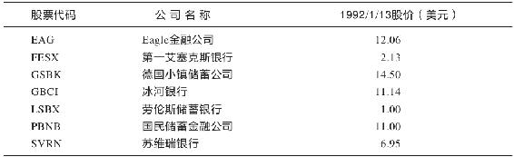
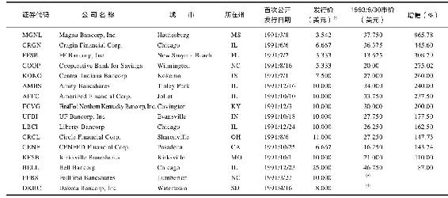
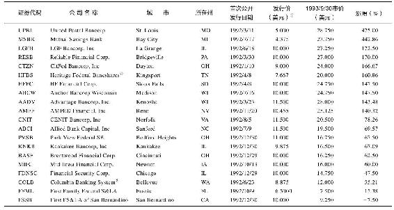
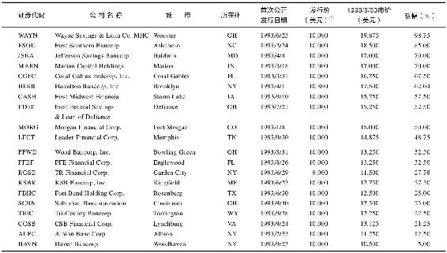

# 第13章　近观储蓄贷款协会

这种公司你可以多加留意。首先按照自己的选股标准选择5家储蓄贷款协会，然后以等量资金购买其股票，最后就是等待丰厚的回报。假定其中有1家盈利超预期，3家盈利基本符合预期，另外1家盈利稍差，但从总体结果看，收益很可能会比投资股价已被高估的可口可乐公司或默克公司要高得多。

我属于好打听消息的一类人，而且决不完全依赖和满足于二手信息。为了提高我的信息优势，我经常会直接给上市公司拨电话，我愿意为此花钱。可能电话账单的费用会高些，不过从长远看，一切都是值得的。

一般我会和公司总裁、首席执行官（CEO），或者其他高级官员通话。有时我试图从中找到某些特定问题的答案，有时我也会闪烁其词，慢慢套出一些不为华尔街的其他证券分析师们所知的奇闻轶事，例如，冰河银行从一家储蓄机构借了过多商业贷款。这样的消息是我不愿意看到的，所以如果不对这类消息进行查证，我绝不可能购买它的股票，也不会盲目推荐它。

要和储蓄贷款协会直接谈话并不需要你是某方面的专家，但关于公司如何经营的基本常识还是需要知道的。储蓄贷款协会一般都需要有一批忠实的储户，他们把钱存入存款账户和支票账户[^1]；然后，储贷协会公司将这些钱贷出去，以钱生钱——但必须防止向潜在的违约借款人提供贷款；为了最大化利润，公司还必须尽量降低经营费用。此外，银行家们都崇尚三六原则：以3%的利率吸收存款，以6%的利率放贷，稳赚3%的利差，然后尽情享受打高尔夫的休闲时光。

言归正传，为了收集相关细节，我给6家储蓄贷款协会打了6个电话，其中4个是稳健增长的，另外2个则是起死回生型的。但我没有打扰Eagle金融公司，原因是Eagle正处于繁忙的九月到九月的会计年度，到时年报详细数据会以打印方式及时到达我手中，我会像一个银行查账员般对数据细品细酌。然而其他几家公司的年报要到2月或3月才能揭晓。下面是我通过和他们的谈话所发掘到的信息。

### 冰河银行

我在圣诞节后的第二天给冰河银行打了电话，记得那天我穿了一条波士顿格子长裤和一件T恤衫。我来到办公室时，整栋楼除了我和那个保卫员还空空如也。

假期是完成此类工作的理想时间。在12月26日这一天，要是看到有公司人员坐在办公桌前，那我每次都会感触良深。

在我一片狼藉的桌面之上，我翻开了冰河银行的数据文件。公司现在的股价是12美元，相比去年有60%的增幅；公司收益率保持在12%~15%，现在的市盈率是10倍。这些数据看起来并不吸引人，不过也没太大的风险。

冰河银行过去一直被叫做卡利斯佩尔第一联邦储贷协会（First Federal Savings and Loan of Kalispell）。我倒希望他们能保持这个旧名，因为它听起来古色古香，这对我未尝不是一种品质的保证。我喜欢古朴的、带有教区色彩的命名法，太新潮和老到的名称我欣赏不来——它经常暗含着一种公司为了提升形象而肆意抓狂的意味。

我欣赏的公司是那些精于业务，并以此使形象得到自然升华的公司。现在的许多金融单位都有一种不良趋势，它们都想把公司名中的“bank”剔除，而用“Bancorp”取而代之[^2]。地球人都知道bank是什么东东，但“Bancorp”却让我神经紧张。

不过，卡利斯佩尔冰河银行的接话人告诉我说，他们正在为一位公司高级职员举行退休聚会，但他还是马上帮我通知了公司总裁查尔斯·莫科德（Charles Mercord）。莫科德肯定是被他从聚会上拉出来的，因为几分钟之后莫科德就给我回了电话。

向总裁或CEO询问公司收入还是很有忌讳的，如果你不假思索地脱口而出：“明年你们公司能赚多少钱？”那么肯定什么答案都得不到。首先，你要建立一种友善的关系——我们先聊了一下旅游话题。我告诉他我们全家老少去了一趟西部，游览了国家公园，并说我很喜欢蒙大拿[^3]。我们聊及木料工业、带花斑的猫头鹰、比格山（Big Mountain）的滑雪场，还有阿纳康达矿业公司（Anaconda）拥有的巨大炼铜炉。作为一个分析师，阿纳康达是我经常造访的一家公司。

接着我开始切入正式一点的投资话题，我问他：“那地方人口有多少？”“那个城镇海拔怎么样？”然后进一步提出更加实质性的问题，如：“你们是否打算收购新公司还是继续坚持原来的规模？”我试图感知冰河公司的发展态度。

“第3季度会有什么不同寻常吗？”我继续问，“我发现，公司这个季度的每股收益是38美分。”问这些问题时最好能像做菜撒胡椒粉一样提供一点少量的信息，这样被询问者会觉得你为此花了不少心思，做足了功课。

冰河公司的经营理念是积极向上的，它几乎不存在不良贷款。整个1991年中，冰河银行无法避免的不良贷款仅为16000美元；15年来公司分红持续增加。公司曾经收购了另外两家储蓄银行，那两家银行的名字相当之好，它们分别叫做鲑鱼湾第一国家银行（First National Banks of Whitefish）和尤里卡第一国家银行（First National Banks of Eureka）。

不断地并购是较强的储蓄贷款协会在接下来的几年中快速壮大的主要手段。它们通过收购经营出现问题和接近瘫痪的其他储蓄贷款协会而获得大量存款。冰河银行可以把鲑鱼湾第一国家银行整合到自身经营系统中，把获得的额外存款作为信贷借出，从而获得更多收益。此外并购还可以降低管理费用，因为两家储蓄信贷协会的结合常会使双方得利，经营费用更低。

“你们又获得了一处优良资产，”我引出有关鲑鱼湾第一国家银行的话题时说，“我确信这对公司很有好处，从会计学的角度看也非常明智。”事实上我唯一的担心是冰河银行是否为收购付出了过高价格。我旁敲侧击，“我猜测你们不得不为此支付高于股票净值的价格吧？”我如是探测，试图让冰河银行的大总裁承认这种糟糕状况。不过没有，冰河公司并没有支付高价。

我们又谈及冰河高达9.2%的商业贷款，这是我从《储蓄贷款协会行业投资指南》上收集到的统计数据中唯一不能让人满意的一项。如果这是一家新英格兰的储蓄银行，那我早就被吓跑了，但是蒙大拿可不是马萨诸塞。冰河银行的总裁甚至向我保证，他说，冰河银行从不会向无人使用的办公大厦或者卖不出去的度假休闲公寓提供借贷。冰河的商业贷款大部分都投资于大户型住宅，而这种住宅在市面上很紧俏，而且蒙大拿的人口还在不断增长，每年都有数以千计的居民从烟尘弥漫和课税繁重的加利福尼亚抽身而出，来到这天空广阔、政府机构小巧的地方安家落户。

我每次和上市公司沟通，有一个问题是必问不可的：你最羡慕的其他公司有哪几家？伯利恒钢铁公司的CEO告诉我他羡慕微软公司，这就算了，但如果是一家储蓄贷款协会的总裁告诉我他羡慕的是另外一家储蓄贷款协会，那就非常有意义。那家被羡慕的储蓄贷款协会一定在某方面表现出众。就是通过这种方式，我找到了很多不错的股票。所以，当莫科德提到联合储蓄银行（United Savings）和联邦安全银行（Security Federal）时，我马上用脖子支住电话，迫不及待地打开手边的标准普尔股票指南找到了股票简称UBMT和SFBM，一边听他的描述，一边按下回车让它们在科特龙上显示。它们都是蒙大拿的储蓄银行，都有着较高的资本充足率（联邦安全银行的为20%）。我立刻把它们放入了我的“等待研究”名单中。

### 德国小镇储蓄公司

我在1月份给德国小镇储蓄公司打了电话，就在我飞往纽约参加巴伦圆桌会议的前一天。这是我上一年推荐过的另一家公司，那个时候股价只有10美元，现在涨到了14美元。德国小镇储蓄公司的每股收益是2美元，这使得市盈率还不到7倍。每股净资产是26美元，权益资产比是7.5，并且不良贷款百分比不到1%。

德国小镇储蓄公司的总部位于费城市郊，总资产14亿美元，公司业绩优良，但是仅仅一个普通的经纪公司也不难发现其中的问题。我阅读最后一期年报时，就准备拿起电话了。存款量是上升的，也就是说客户们都乐于把钱放在他们那儿，但是贷出资金量下降了，资产负债表中的资产也有下降趋势，这意味着公司高层最近采取了保守策略，在贷款问题上相当谨慎。

我还找到了公司在“投资安全”方面小心谨慎的更多证据。公司的证券投资资金较去年有5000万的增长幅度，所投资的证券类型包括短期国库券、债券、股票以及外汇。如果某家储蓄贷款协会对整体经济不看好，或者对借款人的信用不放心，那么它一般会把资金投资于债券，这与个人投资者的做法是一致的。当经济开始好转，借款人的信用也能得到保障时，德国小镇银行则会售出这些证券，并提供更多的贷款，这样会使收入大幅增加。

关于这个问题，我特别查看了公司的利润表，看看是否有某些其他因素可能会误导投资者。你肯定不想被公司的报表愚弄；有时候公司报表突然有了起色，我们一时冲动便购买了它的股票，结果却发现公司的这种超额利润不过只是一次意外，可能源于某种一次性的事故，比如转让有价证券。不过我在这里发现的情况恰恰相反——德国小镇储蓄公司出售其证券时甚至还承担了少量损失，这对正常收益有不良影响，但还不足以造成明显影响。

“我们的故事没什么新奇的，”我打电话过去时公司的CEO马丁·克莱普（Martin Kleppe）这样说。但他一定知道他接下来所讲的故事正是我求之不得的：“我们还制定了一份防御性平衡表。如果我们陷入困境，那我们的对手恐怕已经岌岌可危了。”

贷款损失和贷款违约本来就不很常见，那个月发生率更是越发稀少，尽管这样，德国小镇储蓄公司还是采取了保护措施，他们增加了贷款损失准备金。这么做短期内会妨碍收入的增长，但是长期反而会刺激收入增加，因为这笔积累起来的小额资金如果没有用掉，最后还会返还到公司的资产收益中。

德国小镇储蓄公司所处环境的方方面面都谈不上是欣欣向荣，但是那里的人们大多有良好的存款习惯，对好的银行也忠贞不渝，德国小镇储蓄公司从来也都是谨慎对待这些存款。由此可知，这是一家精于实务的储蓄贷款协会，有能力超越众多强劲的竞争对手，最终必能以它自己的方式创造巨额利润。

### 苏维瑞银行

在1991年11月25日的《巴伦》周刊上我读到一篇文章，标题是“富有者身边的借款处”。文章描述说，苏维瑞银行（Sovereign Bancorp）在雷丁的总部是宾夕法尼亚东南部的一处财富象征。对苏维瑞，我最喜欢当一项抵押贷款获批时，相应分行的大钟就会响起的那一刻。

这是我职业生涯中第一次通过一份周刊获知一只好股票。我查看了它的年报和各季度的报表，各项重要指标都显示苏维瑞表现卓越：坏账只占资产的1%；商业和建筑贷款比重是4%；苏维瑞的准备金也很充裕，足以应付可能冒出来的所有坏账。

苏维瑞从美国清贷信托公司（Resolution Trust Corporation）收购了两家新泽西的储蓄银行，这大大增加了公司的存款资金量，并最终使得收入突飞猛进。为了核实细节情况，我给苏维瑞的印度籍总裁杰伊·斯德胡（Jay Sidhu）打了电话。我们先闲聊了不少关于孟买和马德拉斯的事情，我在上一年的慈善之旅中曾去过这些地方。

当我们开始涉及正题时，斯德胡告诉我，公司业务的年增长率至少能达到12%，而我知道，基于分析师们对1992年的最新估计，该公司股票当时的市盈率大约是8倍。

唯一的负面因素是1991年苏维瑞增发了2500万股新股。我们前面已经讨论过，只要公司还承担得起，回购股票往往是一件好事，相反，公司若增加其股本，事情往往就不容乐观。这可以和政府印刷纸币进行类比来帮助理解：印得多了，钱自然就不值钱了。

不过，苏维瑞至少不会肆意挥霍这些出售股票所得的收入，这些收入的用途是向清贷信托公司收购更多无以维系的储蓄银行。

我非常惊喜地发现，斯德胡先生所采用的成功模式来自金色西部金融公司（Golden West）。本质上讲，他想要模仿桑德勒夫妇的精打细算，也就是尽可能增加贷款款源并缩减开支。算上从最近收购公司继承到的薪金总额，公司的一般管理费用占总支出的2.25%，这比金色西部金融公司的1%高了许多，但是，斯德胡先生似乎决意要把它降下来。他拥有公司4%的股权，这极大地激励着他尽快出台具体措施。

和大多数储蓄银行热衷于抵押贷款不同，苏维瑞的专长是提供贷款服务，然后把它们出售给贷款包装商，比如房利美和政府国民抵押贷款协会（Freddie Mac）。这种策略让苏维瑞得以快速回收资本，并可将资本立即用于再次提供新的贷款服务，通过收取贴息和其他费用获得可观利润。通过这种方式，抵押贷款的风险巧妙地转嫁给了第三方。

即使是这样，苏维瑞对贷款类型还是有苛刻的偏好。它最乐于提供住房抵押贷款，但是自1989年以来，它从未提供过一笔商业贷款，而且，所提供的住房贷款的平均金额没有超过所抵押资产净值的69%。公司不良贷款极少发生，一旦发生就会严查细究，以便找出问题的原因，杜绝相同的错误再次发生。

此外，我从斯德胡先生那里还知道了一些新消息——在我和公司的谈话中时常能有这类意外收获，他给我透露了卑鄙的银行或者储蓄贷款协会伪装不良贷款的一个方法。假定，有一个开发商要为一项商业工程借款100万美元，那么银行会提高贷出金额而给他提供120万美元，这额外的20万美元将反过来由银行保管。如果开发商违约，银行则用这笔额外资金作为开发商的支付款，通过此种方法，不良贷款仍可以像优良贷款一样登记在册——至少短期内可以不露马脚。

我无法得知这种事情流行范围有多广，但如果斯德胡是对的，那么它就是避免投资那些提供大量商业房产贷款的银行的另外一个理由。

### 国民储蓄金融公司

公司总部在康涅狄格州的新不列颠，接近哈特福德。我给那里的首席财务官（CFO）约翰G.梅德韦克（John G.Medvec）打去电话。梅德韦克说，那个地区有很多实力较弱的银行都已纷纷失败出局，这更巩固了国民储蓄金融公司（People’s Saving Financial）作为存放金钱的安全地方的地位。国民储蓄金融公司擅长为自己做广告宣传：一个权益资产比为13的公司是安全的，这至关重要。广告产生的效果是，国民储蓄金融公司的存款量从1990年的2.2亿美元一直上升到1991年的2.42亿美元。

如果国民储蓄金融公司不回购股票，它的权益资产比甚至还会更高。公司分两个阶段共撤销了16%的股本，期间共支出440万美元。如果它继续以这种模式回购股份，某一天它的股票将变得非常稀缺，因而也非常值钱。股票少了，即使业绩平庸，每股收益也会有所增加。如果经营优秀，股价还可能火箭般一飞冲天。

有些公司经理爱讲空话，说要“提高股东权益”，随后却把钱胡乱花在并购上。他们忽略了回报股东的最简单和最直接的方法——回购股票。DQ公司和CC&S公司本是比较一般的上市公司，但由于开展了轰轰烈烈的股票回购运动，它们成为股市中的明星。那也是Teledyne公司股价涨了100倍的原因。

国民储蓄金融公司在1986年首次公开上市时，它的股票售价是每股10.25美元。现在，5年之后，它的经营规模更大，利润更高，股本也变少了，但价格却只上涨到11美元。是什么原因使股价停滞不前呢？我猜测是公司当前所处的形势比较压抑。这种压抑不是主观意识形态上的，而是这个行业在整个康涅狄格州都比较萧条。

综合了所有该考虑的因素之后，我认为，与其投资一个繁荣经济时期蓬勃向上却从未经受考验的储蓄贷款协会，不如选择一家被证明能在困境中生存下来的储蓄信贷协会。

我从《储蓄贷款协会行业投资指南》获悉，国民储蓄金融公司的不良贷款率为2%，相对适度，但是我还想对此做一番深究。梅德韦克说，这2%之中大部分都是由单独一笔建筑贷款构成的，而且他们此后也再没有提供过这种类型的贷款。

当这笔不良贷款被注销，利润遭受打击时，国民储蓄金融公司从中很好地吸取了教训。下一个步骤是取消违约方对抵押资产的赎回权。梅德韦克证实了我所听到的关于取得抵押资产手续非常烦琐、费用很昂贵的说法。要彻底驱逐违约借款方可能也需要很长，如2年的时间。这和小气财神史卢基（Scrooge）开除可怜的鲍勃（Bob Cratchit），并把他还有他的儿子驱逐到大街上可是两码事，因为国民储蓄金融公司碰到的违约行为都属商业性质，或者要没收的是一些肥猫[^4]的财产，那些赖账不还的混蛋经常要无偿占据这些资产长达几个月，直到违约行为的法律补救期失效过期为止。

最终，一项没收所得的资产将会归入到公司的称为“拥有房产”的统计项下，受到侵害的贷款方可以尝试着把它卖出以收回部分资金，也好为那次永久失去的贷款做些弥补。某些情况下，贷款方有可能收回比预期更多的资金，所以这其中可能还会有意外的惊喜。

梅德韦克和我还讨论了该地区的经济环境。在1992年谈论康涅狄格难免为这些事情担忧，他告诉我，在新不列颠，硬件制造商提供了最多的工作岗位，但唯一不同的是Stanley Works公司。中央康涅狄格州立大学和新不列颠综合医院也吸收了一些闲散民工，但失业率仍居高不下。

挂电话之前，我问了个一贯的告别问题：请列举给你留下深刻印象的竞争对手。梅德韦克提到了美国新不列颠储蓄银行（American Savings Bank of New Britain）。这个公司的权益资产比是12，不过还没有上市。受此鼓舞，我决定驱车前往，预先开个账户，等到公司最终上市时好夺个头席。本章最后一个小节会告诉你我这样做的原因。

### 第一艾塞克斯银行

这是两个起死回生型公司中的第一个。在这个例子中，公司对股票的回购没有起到提升股价的作用。第一艾塞克斯银行（First Essex）于1987年上市，总股本800万，发行价每股8美元。两年内股本和股价没有什么变化，而公司管理层却已经以每股8美元的价格回购了200万股。如果管理层等到1991年才回购，那么就将蒙受75%的亏损，因为那个时候股价跌到了每股2美元。

我在第一艾塞克斯银行的报表文件中发现，有一些数据着实让人震惊——不良资产占有率达10%，拥有房产占3.5%，还有13%的商业贷款和建筑贷款。这家位于马萨诸塞州劳伦斯市的小型储蓄贷款协会在1989年亏损1100万美元，在1990年又亏损2800万美元。公司遭受如此不幸，归根到底是因为过分疯狂地贷款给公寓住房开发商和其他房产商，最后这些房产商在经济萧条中纷纷破产。劳伦斯市位于横跨新罕布什尔疆界的地方，而那个地方正是整个新英格兰最为萧条的地区之一。

“我们是拿着600英尺长的线在钓河底的鱼，”我拨通第一艾塞克斯银行的首席执行官伦纳德·威尔逊（Leonard Wilson）的电话后他这样描述他们的处境。在整整三个恐怖年度中，这家储蓄贷款协会面临着一连串的房产没收事件，每个事件都是对利润的一次打击，每个事件都迫使第一艾塞克斯银行多拥有一处房产——直到这家储蓄贷款协会现金匮乏，在闲置房产上却异常“富有”，只不过没人想买。它成了这个地区的顶级外居地主[^5]——可惜外居的都是房客。

尽管如此，第一艾塞克斯的每股净资产仍然达到7.125美元，权益仍然较高，这使得权益资产比高达9。而这是一个仅售2美元的股票！

这将是一次赌博，对象就是一家在苦难时期遭遇灭顶之灾的储蓄贷款银行，如第一艾塞克斯银行。如果商业房产市场开始企稳，对房产商资产的没收也可以停止，那么这家银行还能得以幸存，并最终补偿遭受的损失；而另一方面，这只股票也很容易变成一只10元股。问题的关键在于我们无法知道什么时候或者商业市场是否会企稳以及这次大萧条将会有多么深远的影响。

通过其年报我得知，第一艾塞克斯银行在1991年年终之前总共借出了4600万美元的商业贷款，而公司的资产净值也是4600万美元。这种资产净值和商业贷款之间1∶1的关系可以说是一种安全的保证。如果未处理的商业贷款中有一半是不良贷款，那么第一艾塞克斯会损失掉50%的净资产，但是仍然可以幸免破产。

### 劳伦斯储蓄银行

劳伦斯储蓄银行同样坐落在梅里马克峡谷地区，也是一家可尝试风险投资的公司。它和第一艾塞克斯面临着相同的问题——区域经济萧条。它们的经历也大同小异：本来是盈利较佳的储蓄贷款协会，无奈落难于失控的商业贷款，不断流失数以百万计的资金，股票价格随之一落千丈。

根据1990年的年度报表，劳伦斯仍然拥有7.8倍的权益资产比。但我通过分析发现，它的危险性比起第一艾塞克斯有过之而无不及。劳伦斯的商业房产贷款占了贷款总额的21%，而第一艾塞克斯只占13%。劳伦斯的商业贷款金额更加巨大（5500万美元），而原始净资产（2700万美元）却比第一艾塞克斯少。这样的冒险如履薄冰。如果劳伦斯残存的商业贷款中有一半无法收回，投资者可就万劫不复了。

分析可进行风险投资的储蓄贷款协会的方法如下：找出公司的净资产是多少，并把它和借出的商业贷款作对比。要做最坏的假设（小结如表13-1所示）。

表13-1　小结

### 查尔斯·吉文斯[^6]的最爱，零风险交易

想象你购买了一处住房，结果却发现房子前主人已经帮你预付了订金，并把余款塞入一个信封留在了厨房抽屉里，并附有一张小纸条，上书：“拿着它，由于你是第一个到来的，它已经属于你。”你就这样得到了这所房子无须付出任何东西。

其实，这种美事一直等候着那些购买首次公开发行的储蓄贷款协会股票的投资者们，而且由于这是美国现有的1178家储蓄贷款协会的必由之路，所以说，让投资者们获得意外惊喜的机会多得是。

我在管理麦哲伦基金的早期就知道了“抽屉现金”的回扣。这也解释了为什么每次有储蓄贷款协会或者互助储蓄银行（类似机构的另一种称谓）出现在我的科特龙上时，我几乎都要建立一定的仓位。

从传统上讲，地方储蓄贷款协会或者互助储蓄银行都没有股东，它由全体存款人共有，这和乡村电力公司采取合作社的组织形式并且由所有用户共同拥有相似。一家有上百年历史的互助储蓄银行，其净值属于每一个在它的各个分行开办了存款账户或支票账户的公民。

只要这种互助式的所有权形势继续不变，那么千千万万的储户尽管为企业投入了自己的资金，但仍将一无所得；或许只多得1.5美元的一瓶矿泉水的利息钱。

一旦互助储蓄银行来到华尔街，开始公开发行股票，一种魔幻的力量就开始运作。首先，储蓄贷款协会的董事们集中交易公司股份，购买者和董事处于对等地位。董事们自己也购买股票。你可以从发行公告书中了解有关细节。

董事们自己要购买股票，那他们会怎样制定发行价呢？当然是非常低廉。

存款者和董事们都拥有以初始发行价购买股票的机会。有意思的是，公司通过出售股票获得的每一美元，除去承销保荐费用，都将回到公司的资产储备中。

其他类型的公司上市时情况则并不相同，会有相当可观的一部分资金将被发起人和原始股东吞走，那些人会变成百万富翁，然后去购买意大利的豪华别墅和西班牙的富丽华宅。但是在互助储蓄银行中，银行由存款人所有，如果要把出售股票获得的收益分摊给千万个卖方，那将是非常不方便的事，而且卖方可能自己也要购买股票。所以，这些资金会完全回拢到公司，变成储蓄贷款协会净资产的一部分。

假设你的地方储蓄所上市前净资产是1000万美元，然后它发行价值为1000万美元的股票——100万股每股10美元。随着这1000万美元从股票交易中回到公司资产中，公司的净资产得到了加倍，也就是净值为20美元的股票正在以每股10美元的价格出售。

但是这不能完全保证你免费得来的东西最终能让你发财。你选中的可能是一家吉米·斯图尔特储蓄贷款协会，或者也可能是一家垃圾公司，管理无能，年年亏损，最终损失掉所有净资产并关门倒闭。虽说这是一种不败的交易，但还是应该记住，没有调查就没有投资可能。

下一次你碰巧路过一家仍然处于合作共有状态的互助储蓄银行或者储蓄贷款协会时，一定要考虑停下脚步，并进去开办一个账户。通过这种方式，你可以得到以初始发行价购买股票的一种权利。当然，你可以一直等待，直到公开上市之后再做抉择，你兴许可以买到更加物美价廉的便宜货。

不过不要等待过久，华尔街对“抽屉中的现金”的诡计可是充分理解的。互助储蓄银行自1991年变成公众所有之后，其股价、存款和贷款的上涨简直是不同寻常。全国上下，不管是在哪里，它都称得上是一座现金富矿。

1991年有16家互助储蓄银行上市，其中的两家以超过上市价4倍的价格被并购，剩下的14家中最差的也有87%的涨幅，其余的都翻倍或者还好一些，具体来说是有四家翻3倍，一家翻7倍，一家翻10倍。想象一下，通过投资密西西比哈蒂斯堡的马格纳银行（Magna Bancorp），短短32个月就能让你的钱翻10倍（见表13-2）。

在1992年，另外的42家储蓄机构也陆续上市，其中唯一一个失败的案例是圣伯纳迪诺（San Bernardino）的第一联邦储蓄和贷款协会，它的股价微跌7.5%，其余的都高歌猛进——38家上涨50%以上，23家上涨100%以上。而这一切就发生在20个月之后！（参见表13-3。）

这其中有两家翻了4倍——密歇根海湾市互助储蓄银行和圣路易斯联合邮政银行。经营最好的5家合计给出了285%的回报；即使是最最倒霉的人选中了其中最差的5家，到1993年9月也会有31%的收益。最差的5家都战胜了标准普尔500指数和大部分共同基金。

在1993年的前9个月中，又有34家互助储蓄机构上市，在很短的时间之后，最差的上涨5%，有26家上涨30%以上，20家上涨40%以上，9家上涨50%以上（见表13-4）。（上述所有数据均摘自SNL证券公司的统计研究。）

从北卡罗来纳州的阿什伯勒到东海岸马萨诸塞的伊普斯威奇；从加利福尼亚的帕萨迪纳到西部华盛顿的埃弗里特；从俄克拉何马的斯蒂尔沃特到伊利诺伊的坎卡基，到中部得克萨斯的罗森伯格，各地的储蓄贷款协会都提供了最好的投资机会，不计其数的人们涉身其中。这些终极例子说明，个人投资者要获得成功，可以忽略掉那些由机构广泛持股的公司，而把目光投向身边的公司。还有什么能比时常去存钱的地方储蓄所更加唾手可得呢？

在这些储蓄所中办理的任何一个账户都会赋予你参加首次公开发行（IPO）的权利，但这当然不是你的义务。你可以参加向潜在股东解释股票发行交易的会议，查看内部人员是否在购买股票，浏览招股说明书以确定股票的净值、市盈率、每股收益、不良资产比率、贷款质量等，熟知所有这些消息才能知己知彼，才能做出明智的决定。得以近距离查看一个本地公司是一个不错的机会——而且也是免费的。如果你不喜欢这样的交易、这个企业或者他们的管理，你完全不必投资。

现在仍有1372家互助储蓄协会准备要上市，你可以查看一下其中是否有位于你家附近的公司。只需到那里开个账户，你就有了参加首次公开发行的权利。然后，你就可以一路持股待涨了。

表13-2　互助储金和储蓄银行在1991年完成的首次公开募股情况

16家互助储金和储蓄银行在1991年上市，其中两家被收购，剩余14家全部上涨；其中13家涨幅超过100%。

注：柯克斯维尔银行（Kirksville Bancshares，Inc.）不再由SNL证券公司跟踪监视。公司报告称该股票的交易极不活跃。

①原始列表中的两家最近已被并购。

②由于股本分拆，进行了相应折算。

③该银行于1993年1月29日被南方国家银行（Southern National）以每股48.00美元的价格收购。

④该银行于1993年6月30日被南达科他金融公司（South Dakota Financial）以每股约36.00美元的价格收购。

资料来源：SNL Securities, L. P..

表13-3　1992年上市的互助储金和储蓄银行的十佳十差排名

①由于股本分拆，进行了相应折算。

②原始清单上不存在。

资料来源：SNL Securities, L. P..

表13-4　1993年前9个月上市的互助储金和储蓄银行的十佳十差排名

①由于股本分拆，故进行了相应折算。

资料来源：SNL Securities, L. P..

[^1]: 存款账户利息高，支票账户利息低，两类账户用途不同。——译者注

[^2]: 两个词都是“银行”的意思，但bancorp不属于现代英语。——译者注

[^3]: 蒙大拿州，卡利斯佩尔冰河银行所在地。——译者注

[^4]: 即大款。——译者注

[^5]: 外居地主是一个经济学名词，指的是拥有并租出资产以获得租金收入，但本人不居住在这些资产所在的本地经济圈内。——译者注

[^6]: Charles J. Givens有限公司总裁, 《零风险致富》的作者。——译者注
