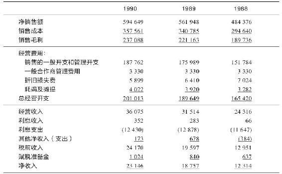
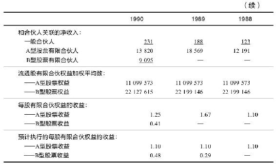
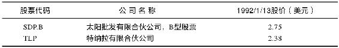

# 第14章　业主有限合伙公司[^1]：做有收益的交易

这是另外一类公司，但它们的优势长期以来正一直被华尔街所忽视。它们名字中的“有限合伙”会勾起人们不愉快的回忆：曾经有一段时间它们大受欢迎，它缴税低微，于是人们纷纷慷慨解囊，但最后却发现自己争相购买的竟是毫无价值的垃圾——油气合伙公司、房地产合伙公司、电影合伙公司、农畜合伙公司，还有墓地合伙公司，购买这些公司的股票而承受的损失远远超出了原先希望以此避免的税收。

因为这些无价值的合伙公司公众声誉不佳，而且人们对历史的联想无所不及，所以即使是其中较为优秀的上市公司（即所谓的业主有限合伙公司），也要继续背负这项罪名。实际上，它们是不断进步的企业，它们的目标是盈利，而不是宁可亏钱也要让美国国税局难堪。现有100家以上的业主有限合伙公司在各大证券交易所交易，每年我都能从中找到一两个物有所值的公司。

当业主有限合伙公司的股东要做一些额外的书面工作，如专门的纳税申报表格必须认真准备。但这项工作已经不像过去那样令人恼火了，因为这些合伙公司的投资者关系部会填写所有内容。这样，每年你都将收到一封确认函，核对持有的股票以及是否有增持。

不过这还是足以令许多投资者对这些股票望而却步，尤其是基金经理，但对我而言，如果可以让它们比现在还要不受欢迎，即使是要我回答梵文写成的问题我也心甘情愿。因为一个股票受欢迎程度下降有助于压低价格，所以在这类股票中总可以找到廉价的宝贝。

业主有限合伙公司的另外一项吸引人的特征是它的业务大多很朴实，比如组织篮球比赛（波士顿凯尔特人（Boston Celtics）实际上就是一家业主有限合伙公司），或者提供油气管道输送服务。塞韦斯马斯特（ServiceMaster）提供家政和保洁服务，太阳批发公司（Sun Distributors）出售汽车零部件，雪松娱乐公司（Cedar Fair）经营游乐场，而EQK绿地公司（EQK Green Acres）是在长岛拥有一处大型购物中心。

此外，这些业主有限合伙公司的名字看起来都有点过时，和当代的高科技文化割裂错位。Cedar Fair很像是威廉·梅克皮斯·撒克里（William Makepeace Thackeray）的作品名字，而Green Acres的作者应是简·奥斯汀，如果我看到Tenera和托马斯·哈代书中的其他人物一同在达特姆尔（Dartmoor）出现，我一点也不会感到惊讶。

一大堆的公司都有着这种奇异古怪而又显罗曼蒂克的名字，各自经营着有点俗套的业务，但组织方式又极为复杂，甚至不得不进行额外的书面工作等。谁要是被这种公司所吸引，那么他一定是个想象力丰富之人。这样的人们可以不厌其烦地处理书面工作，而对此大多数人都是无法忍受的。在有想象力的人中，也只有极少数坚定不移者能最终获得奖赏。

业主有限合伙公司和一般的公司最大的不同就是，前者把所有的收入都分配给股东，方式是分红或者资金返还。分红总是高得罕见是这类公司的惯例，资金返还的特征则允许特定比率的年销售收入从联邦税收中扣除。

第一家合伙公司上市是在1981年。该类公司上市高峰期是1986年，也就是在修改税法使得这类公司比过去更有优势之后。但到1997~1998年那个时候，房地产和自然资源类合伙公司可以继续无限制生存，而其他公司可能就只能关门大吉，因为那时它们就失去了税收优势。如果一家业主有限合伙公司今天的每股收益是1.8美元，到1998年可能就只有1.2美元。不过这是三四年后要考虑的风险，但不是今天。

大多数我喜欢的业主有限合伙公司都在纽约证券交易所上市。在1991年的《巴伦》周刊上我推荐过EQK绿地公司和雪松娱乐公司，一年之后我又看中了太阳批发公司和特纳拉（Tenera）。接下来我将按时间顺序细细描述它们如何吸引了我。

### EQK绿地公司

EQK绿地公司在萨达姆股市大挫（Saddam Sell-off）[^2]之后才开始引起我的注意。（其中，EQ取自其合伙单位衡平人寿保险社——Equitable Life Assurance Society，而K代表的是Kravco——物业公司。）这个公司4年前上市，发行价10美元，曾经攀高到13.75美元。但是在1990年夏，由于购物商场和零售行业生意清淡，在投资者的无奈中股价跌至9.75美元，以该价格计算，EQK绿地公司的收益率是13.5%，和垃圾股不相上下。不过我想，比起真正的垃圾股它还是比较安全的。该公司的主要资产是它位于长岛的大型封闭式购物中心。

这个股票不只是内在价值值得欣赏，而且公司管理人员持有相当份额的股票，自从公司上市后，每个季度的分红都有增加。

我记住了其中许多细节，因为毫无疑问，为了麦哲伦基金，我也得买些EQK绿地公司的股票。最初，我是从富达基金的经理斯图尔特·威廉斯（Stuart Williams）那里听说了它，但是长岛750000知情者肯定也知道这些信息——这是绿地购物中心周围5公里内居住的总人口。这个购物中心正好位于人口最为密集的拿骚县中部。

这个情况使我感到很有希望，而且我可以去商场亲身体验，于是我就去了，还在那儿买了双鞋。这真是个受欢迎的地方，像这样的封闭型购物中心在全美也只有450家，而且虽然如此受欢迎，却没有新的此类商场建立。如果你想要建起一座规模相当的类似购物中心与它匹敌，你会遇到地理分区的问题，毕竟要找到92英亩的空闲地皮，再铺上地砖造成一个停车场不是件容易的事。

虽然比邻地区的沿街小商店在不断涌现，但是封闭式的大型购物中心有其独特的生境。如果你相信这种生境，如果你想要投资一家购物中心，那么绿地公司是我知道的唯一一家想在这方面做大做好的、值得你投资的上市公司。

所有购物中心都有一件最令人头痛的事，那就是场地的空置率，这也是我查看其年报时最先关注的数据。在那时，购物中心的平均空置率约为4%，绿地公司的要低一些。真正的知情者——居住在拿骚县、在绿地商场购物的公民在这方面具有优势，因为他可以每星期去检查一下这种空置率。但是我觉得绿地公司的空置率不成问题，所以感到相当满意。

此外，有一家沃尔德鲍姆（Waldbaum）的超市和一家佩尔加蒙家庭中心（Pergament Home Center）正打算入驻此商城，这显然会提高绿地公司的租金收入。购物中心内1/3的商店使其1992~1993年的租金收入大幅增长，这是未来收入增长的吉兆。

其中值得担忧的方面是收入支出高度平衡（公司必须在1997年之前偿还所有债务）、高市盈率以及任何商场都在开始衰退的共同趋势。但是至少短期内，这些不利因素可以被极高的分红和已经大大压低的股价所补偿，而且高市盈率也是业主有限合伙公司的共性。

1992年我筛选股票时，绿地公司的股票售价是11美元，如果加上分红收益，该股1991年的总回报率超过20%。这是不错的收获，但是再次检查后我却发现了更多需要考虑的问题。假日季节零售商们生意清冷，导致商场租金收入下降，因为这种租金是根据销售额的百分率计算的，如果在购物中心租摊位的商店生意不好，那么购物中心的收入要随之下降。

但是可以设想，所有的购物中心和所有的零售商都面临着同样的困境，所以不能认为绿地商场不如其他商场。找到一个行业整体繁荣很是容易，而要找到一个当其全体对手欣欣向荣唯独自身苦苦挣扎的公司却非常不易。虽然这般好话，但这之后在它的三季报中，有一段说明性的段落引起了我的注意，绿地公司承认可能需要每年缩减1分钱的分红。

这种行为表面上无伤大雅，但不得不让人警惕万分，这我在第2章已经提及。像绿地公司这样的股票，如果接连13个季度增加分红，那么理应有强大的内在动能继续下去，而现在仅仅因为一分钱的缘故，或者说为了区区100万美元的利润就打破规矩，使我不得不怀疑有更深层次的系统性风险存在。

我决定不再第二次推荐绿地公司还有另外一个原因，那就是地平线上若隐若现的重大利好传闻：公司已经宣称正和两家潜在大客户——西尔斯及J.C.彭尼进行协商，讨论租借购物中心二楼扩展区的部分空间的有关事宜。这和在合同上白纸黑字签字不同，如果公司已经宣布与西尔斯及J.C.彭尼签订了协议，我会马上购进股票，能买多少就买多少，可是这只是一份潜在的协议，实在模棱两可，让人捉摸不透。

股票市场流行一句箴言：“天要打雷你就买，喜讯频传反当卖。”这可能会误导群众——靠坏消息买股可能是昂贵的策略，尤其是因为坏消息还有不断恶化的倾向。不知有多少人听了坏消息却还是买进新英格兰银行（Bank of New England，股票简称BNE）的股票啊？结果全都损失惨重，其股票价格已经从40美元跌到20美元，然后又从20美元跌到10美元，再从10美元跌到5美元，再从5美元跌到1美元，直到最终归零，把投资资金100%地一笔勾销。

但从长远来看，听好消息买股票是有益的，只有等待确切的证据，投资的成功率才可以大幅提高。比起听信谣言，虽然等待正式签订合同的消息可能会使你每股少赚1美元，但只要消息是真的，股价就能在将来大幅上涨。反之，如果消息纯属虚构，那么经过等待也有好处，因为风险得到了有效控制。我于是耐心观望绿地公司，并给该股注上标记，随时监视发布的消息。

### 雪松娱乐公司

这是我曾经早在1991年推荐过的第二个业主有限合伙公司。雪松娱乐公司是美国中部的一个永久县集市。它自营两个游乐园，其中之一是俄亥俄州伊利湖边的雪松半岛（Cedar Point）游乐园，另外一个是明尼苏达州的峡谷游乐园（Valley Fair）。这两个游乐园的开放时间是从5月到一直到劳工日，秋季的每个周末也开放。

雪松半岛游乐园拥有10座不同的过山车，其中有一座叫做玛格南（Magnum）的，是世界上落差最大的过山车。另外还有世界上最高的木制过山车，它有个搞笑而形象的名字——劣质牛排（Mean Steak）。正对我办公桌的远端墙上挂有一幅加框的“劣质牛排”的招贴画。还有房利美位于华盛顿的总部的摄影照片，是仅有的两张能和我孩子的美术画以及家庭照分享壁面空间的公司纪念画。

雪松半岛游乐园已有120年历史，从有过山车开始算也有100年了。7位美国总统都曾游览此园，努特·罗克尼（Knute Rockne）[^3]曾利用夏季休假时间在这里打工，其中有一个夏天，罗克尼显然是在这里发明了“向前传球”，从而变革了橄榄球运动。这里有一块铭板用以纪念这个事实。

可能下个星期，有人就会突然研制成功一种新的抗艾滋病药物，于是与之有竞争关系的公司一夜之间价值损失过半，相反，绝不会有人鬼鬼祟祟地在伊利湖边大动干戈，造起一座价值5000万美元的乘坐式游乐装置。

持有游乐园的股票与持有其他股票，如石油公司的股票相比，有一个额外的好处，那就是你可以通过每年一次的游览——比如测试下弗累斯大转轮[^4]是否运转顺畅，分析下过山车装置是否过渡震颤，从而为投资策略提供参考依据。

这也为成长中的一代频繁光顾它们提供了一个有说服力的借口。

同时我还发现，在经济不景气时期，周围3小时驾程之内的居民可能会放弃法兰西假日游，而更倾向于呆在雪松半岛游乐园的旅馆，在世界最高的过山车上来几次尖叫的俯冲。这是一家能在经济低迷时期受益的公司。

1991年，雪松娱乐公司的股价从11.50美元攀升到18美元，如果把分红计算在内，股东一年内享受到的回报高达60%。在1992年年初，我问自己，今年这个股票还能买吗？当时它的收益率是8.5%，似乎仍然比较理想，但不管分红多高，一个公司如果收入不能长期保持稳定增长，股价就难以再次上攻。

这种年终回顾的方法对于股票投资者非常管用：一个一个地检阅你的公司，找出明年会更好的理由。如果找不到这样的理由，下一个问题就是：我为什么还要持有这个股票？

在此思想的指导下，我直接打电话到公司，并和总裁迪克·金扎尔（Dick Kinzel）进行了谈话。如果普通百姓没法经常跟总裁们谈话，也可以通过公司的投资者关系部获取信息。不过仅仅记下公司管理人员讲过的话还不能让你的投资必定成功，任凭赛马的主人怎么吹嘘，不加上自己的思考，就不可能对赛马孰优孰劣做出准确预测。那些赛马的主人总有理由说只有他们的马才会赢，不过最后90%以上的概率他们都会输。

谈话一开始我保持了那种软调技巧，我没有开门见山地问金扎尔公司收入会如何改善，取而代之，我先问了问俄亥俄州的天气，又问了问俄亥俄高尔夫球场的情况，底特律、克利夫兰[^5]的经济以及今年夏季的游乐园临时助手好不好找。在我终于预热了这位总裁之后，我才小心地拿出了正式问题。

前些年我给雪松娱乐公司打电话时，公司总有些抓眼球的新设备引入，比如一架新过山车啦，一架大转轮啦，等等，这些都能增加公司收入。1991年开放的最高木制过山车是当年收入增长当之无愧的功臣。不过在1992年，游乐园并没有添置令人激动的大型设备，仅仅是新开了家旅馆。要知道，新设备引入一年之后，一般游玩人数又会回落。

我们的谈话结束后，我没找到1992年雪松娱乐公司的收入会继续大幅增长的理由。我更看好太阳批发公司。

### 太阳批发公司

太阳批发公司（Sun Distributors）和太阳能没有任何关系。这家公司在1986年从太阳石油公司（Sun Oil）剥离出来，业务主要是向汽车制造商或汽车修配厂出售汽车玻璃、平板玻璃、隔热玻璃、线缆、反光镜、挡风玻璃、螺栓螺帽、滚珠轴承以及液压系统。这些活动在商业院校的毕业生看来无聊透顶，财政分析师们宁可数天花板上瓷砖的数目，也不会有兴趣追踪一个专卖汽车部件的公司的业务状况。

事实上有那么一个分析师曾经详细研究过这个公司，她就是惠特第一证券公司（Wheat First Securities）的卡伦·佩恩（Karen Payne）。不过她1990年4月发表的研究报告显然是最后一次报告，再无后文。甚至太阳公司的总裁唐·马歇尔（Don Marshall）在1991年12月23日我给他打电话时似乎也不大清楚她后来怎样了。

这是我喜欢太阳公司的第一点原因：华尔街正对它视而不见。

我的麦哲伦基金当然持有该股，但其1991年末的不良表现又一次引起了我的关注。实际上这个公司有两种类型的股票，A型股票[^6]分红很多，而B型股票不分红。两种股票都通过纽约证券交易所交易。这把本来就复杂的业主有限合伙公司弄得更加理不清了：竟然有两种类型的股票！这还得花费额外的书面工作。佩恩女士在她关于该公司的“终极版”报告中做了如下总结：“太阳批发公司是一家复杂财务结构下的单纯而经营良好的公司。”

A型股票分红高，但股价不容易上涨——因为最后公司会以每股10美元的价格买回这些股票，而它们的股价现在已经高达10元了。股价的波动都体现在B型股票中，这些股票在1991年内跌幅达一半，价格从4美元变成了2美元。

从佩恩女士的报告中我发现希尔森——雷曼公司（Shearson Lehman）持有其52%的B型股票，而太阳批发公司有权以固定价格从希尔森——雷曼公司购回一半其持有的股票。这对经营者产生一种强大的激励作用，那就是设法使公司成功，让股价节节攀升。从公司总裁在12月23日——圣诞节的前两天还在公司忙着打电话也可看出，公司管理人员显然非常在意自身担负的任务。

马歇尔属于不喜欢招摇的类型，他从不会在《名利场》（Vanity Fair）[^7]杂志上刊登花边故事，不过倒是可以在一本叫《服务界前沿》（The Service Edge）的正统刊物中找到有关他的介绍。在他的朴素制度下，公司执行官们从未得到过额外奖赏，除非公司能在特定的年月大大出彩。奖励的基础是获得成功而非裹足不前。

我对任何一个股票的调查方法都是一致的。对于这样的一个遭遇市场打击的公司，我会问：太阳批发公司能否继续生存？它是否做错了什么而导致了市场对它的惩罚，或者仅仅是成了节税型抛售[^8]的受害者？这种抛售正年复一年地创造着低价股。

显然它还是赚钱的，因为收入还是正数。太阳批发公司自1991年公司独立以后每年都是盈利的。甚至在1991年玻璃销售与电子部件的销售整体进入荒季时公司都仍有收入，而且这种收入也非来自液压系统业务的大幅增长。在这样的糟糕年月之下，低成本的经营者生存了下来，厄境最终使其受益，而它的竞争对手却混得踉踉跄跄，甚至从此不见踪影。

那么我如何知道它是一个低成本的经营者呢？我可以通过收集到的收入信息推算出来（见表14-1）。用销售成本除以净销售额，我得到了太阳公司的总利润率，或者称之为销售收益率，这个数值两年来一直保持稳定，大致为60%。与此同时，太阳的销售量也有所增加，所以总利润也在增长。这是一个总利润率达60%的公司，每出售价值100美元的商品就有40美元的利润。这种业绩在玻璃和五金螺栓等部件的批发商中都可称得上鹤立鸡群。

表14-1　太阳批发有限合伙公司及子公司的收入状况整编（除合伙收益外单位均是1000美元）

这个行业需要的资本开支不多，这是一个优势。过大的资本开支是许多制造商的软肋，以一个钢铁公司为例，如果它一年收入达到10亿，那么它可能先得支出9.5亿才行。而一个销售挡风玻璃和零部件的地方杂货铺没有此类问题，从年报的第二页可以看到，太阳批发公司全年的资本开支只有300万~400万美元。这和公司收入相比何足挂齿。

由于属于成熟型行业，所以公司精打细算，以争取越来越大的市场份额，而它的那些挥金如土的竞争对手纷纷落马，因此，太阳批发公司完全有资格归入我的“荒原奇葩”板块。要不是因为它是一家业主有限合伙公司，我可能早就把它放那儿了。

比收入还要重要的一项财务指标是现金流。对于任何进行了大量并购的公司我都会花大量精力在研究现金流状况上。从1986年开始，太阳公司已经买下超过36家相关公司并进行了资产的经营整合，降低了它们的一般管理费用，并提高它们的盈利水平。这就是太阳的成长策略。马歇尔解释说，公司的目标是成为一家销售电线电缆、螺栓螺帽、玻璃以及其他部件的超级杂货商。

当你购买一个公司的股票时，支付高于净资产的价格常常是不可避免的。这些额外费用体现的是一种美好预期，而这种预期的合理性必须得到资产平衡表的支持。

早在1970年前，公司无须为美好的愿望牺牲收入。在旧会计系统下，如果公司X购买了公司Y，公司X可以把购得公司Y所花费的完整资金归入到其资产项。这样产生的一种后果是，如果公司X为获得公司Y支付的价格过高，那么这种购买行为的愚蠢性对于股东来说是不透明的，股东们没有办法知道购买Y公司的资金损耗是否能够得到良好补偿。

为了解决这个问题，会计准则制定部门修订了这个系统。现在，如果公司X购买公司Y，支付价格高于实际资产的部分，即因美好愿望产生的溢价，必须在几年内逐步从公司X的收入中扣除。

这种对收入的“处罚”是一种票据交易，导致的结果是公司报告的收入低于实际收入。从而，收购了其他公司的公司会表现为盈利能力降低，而事实上可能并非如此，与之对应的是股价被低估。

在这个实例中，太阳批发公司有5700万美元的美好预期的溢价需要逐步扣除，这种会计方法减少了报告收入，使得两种类型的股票每股收益降低到1.25美元——而实际上的收入差不多是它的2倍。这种公司不能列为“收入”的幻影一般的“收入”叫做自由现金流。

健康的自由现金流能够赋予公司伸缩性，在行业环境趋好或趋坏时进退自如，这对太阳批发公司来说尤为重要，因为公司的负债很高——占总资产的60%。但我发现公司的现金流很充沛，达到负债利息的4倍都不止，这使我很放松。

在经济转好的时候，太阳批发公司用现金流扩大规模，它收购了价值4100万美元的公司业务。而在1991年，马歇尔说，为了适应低迷的经济，公司缩减收购开支，把现金流用于清偿负债。如果所有剩余现金流都用于清偿负债，那么公司以9.5%的利益借入的1.1亿美元两年就能还清。显然，这正是公司决定要做的。

如果宏观环境进一步恶化，太阳公司还可以出售部分子公司，比如它的汽车零部件公司，以更快地还清借款。

现时期的并购公司延期偿付很可能会使收入不如过去增长那样迅速，但从另一方面看，资产负债表会更加稳健。减轻负债的动作也让我相信，公司管理层能够很好地面对现实，公司将获得生存机会，而将来还会进行更多的收购活动。

太阳批发公司既然能在很不好的经济条件下生存下来，那么如果境况变好，它就可以变得异常繁荣。最后，当这个业主有限合伙公司的经营期满后，整个企业都将被出售。按照承诺，公司将以10美元每股的价格赎回1100万股A型股票，而2200万股B型股票的股东将分享剩余的资金，估计价格区间可能为5~8美元每股。如果符合预期，B型股股东的投资收益何止翻倍？

### 特纳拉有限合伙公司

这是一家有严重缺陷的公司，它最大的优点是股价在1991年夏天已经从每股9美元跌到了每股1.25美元。公司业务涉及软件和咨询服务，其中前者属高科技业务，我发现很难理解所以也不值得信赖，后者含糊不清，也让人不舒服。它最大的客户是核电厂行业和为联邦政府服务的承包商。

通过两个电话，我就弄清了股价崩塌的缘由。公司和其主要收入来源之一——联邦调查局闹起了纠纷，联邦调查局正在起诉它某些服务收费过高，并且已经取消了某些合同。更糟糕的是，有一个花费上百万美元成本开发的软件程序本来希望销售给全球的电力公司，现在却无法获得报偿。

公司被迫强力减少职工人数。某些关键执行人员，甚至包括总裁唐·戴维斯（Don Davis）都已辞去职务。对于那些还留下的，气氛也是极度不和谐。咨询服务行业的那些竞争对手都是些坏嘴，不停地向客户诋毁着特纳拉的声誉。

在1991年6月，公司取消了分红。公司宣布需要“很长一段时间”才能恢复先前每季度20美分的分红水平。

我不是要吹捧特纳拉，如果这个公司欠有即使是一毛钱的债务，我也绝对不会瞧上它一眼。因为它没有负债，也没有需要支付的大型开销，我猜测它还不至于在一两天内倒闭。这些就是优势：零负债，没有谈得上的资本开支（除了一张桌子，一个累加费用的计算器和一部电话，顾问公司还能需要什么呢？）以及一个可以看好的核电厂服务子公司——这在清算时可以卖个好价钱。

特纳拉在1991年之前的4年中每年都有77～81美分的每股收益；它仍然有盈利能力。可能它永远也不能再次达到80美分了，但是如果可以赚40美分，它的股价就可以值4美元。

对于像这种让人绝望的情况，我其实不是在计算什么收益，我是在计算备件等资产的潜在价值。我认为像特纳拉这样的公司如果拍卖，它也能值1.50美元每股（我做此分析时它的市价），公司总资产除去法律费用后将分配给全体股东。

如果公司能够解决某些问题，那么股价还将有强劲反弹，而如果没能解决任何问题，股价也会有一定强度的反弹。这至少是我的期望。

特纳拉任用了鲍勃·达希尔（Bob Dahl）并让他策划企业的复兴，达希尔在电信行业公司时我与他曾有过一面之缘。在巴伦圆桌会议的前一天晚上，达希尔来到纽约和我见了面。他认为公司在接下来的6~12个月之内经营突然好转是有可能的。他还透露内部知情人员正锁定自身持有的筹码。这使我相信公司仍是有投资价值的（小结如表14-2所示）。

表14-2　小结

[^1]: 业主有限合伙企业不需交纳企业税，并且几乎把所有的利润都分配给股东。——译者注

[^2]: 海湾战争曾引发股市大幅下挫，而黄金，石油价格屡创新高。——译者注

[^3]: 挪威裔美籍橄榄球教练，曾任教于圣母大学（1918~1931年）。他运用向前传球及其他要求速度和敏捷的进攻战术变革了橄榄球运动。——译者注

[^4]: 一种在垂直转动的巨轮上挂有悬着的在轮子旋转时保持水平的座位的娱乐设施。——译者注

[^5]: 美国俄亥俄州东北部的一座城市，位于伊利湖畔，是一个货物进入港和工业中心。——译者注

[^6]: 不要和我国的A股和B股混淆概念。——译者注

[^7]: 美国著名的生活杂志，于1913创刊，它是纽豪斯媒体集团中最赚钱的杂志之一，是造星工厂，是好莱坞的《圣经》，是华府政客的读本，更是追名逐利的芸芸众生看世界的一个窗口。——译者注

[^8]: Tax-loss selling，美国征收资本利得税，于是持股人为了避税，在年初征税前大量抛售，造成股价下跌，在征税后又把股票补买回来。——译者注
