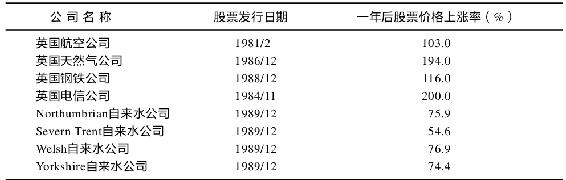
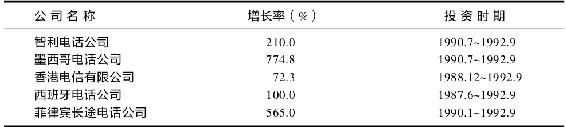
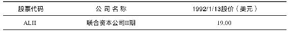

# 第17章　山姆大叔的旧货出售：联合资本II公司

山姆大叔或英格兰女王出售旧货时，我总会尽力参与。在出售旧货方面，“并不那么大”的大不列颠[^1]远远走在我们前面——它已经出售了从自来水厂到航空公司的各种物品。但如果我们自己的赤字开支以现在的水平继续下去的话，未来的某天，仅仅为了支付国债利息，我们可能就不得不将国家公园、肯尼迪航天中心，甚至白宫玫瑰园私有化了。

私有化是个奇怪的概念。你将属于公众的物品拿来，然后再卖给公众，该物品此后就是私人所有了。从实用的角度看，了解私有化的用处在于每当美国或者英国通过出售股票的方式将东西私有化的时候，对于买主来说，这通常是不错的交易。

这其中的原因不难想象。在民主国家，私有化企业的买主就是选民，而政府为了要重新当选已经麻烦一大堆，更别说那些要应付大批投资于电话公司或天然气公司而遭受损失并因此而牢骚满腹的投资者了。

1983年，在最初进行的两次私有化——英国石油公司（Britoil）与阿姆斯罕姆公司（Amersham）的私有化中，因为股票定价过高而随后股票价格下跌导致投资者普遍不满后，英国政府吸取了这一教训。此后，英国政府对私有化企业股票的定价都会使投资者几乎不可能亏损，至少在私有化初期不会亏损。英国电信公司（British Telecom）股票的价格一天之内上涨了一倍，300万英国人将该公司的股票抢购一空——难怪托利党至今还在英国当政。这让我们得出第21条林奇投资法则：

不管英国女王在卖什么，买！

数年前，一队英国人来到我在富达公司的办公室，向我提出了一个很有诱惑力的交易建议。他们自我介绍说是××议员、××爵士。他们还带来了一大本厚厚的东西，原来是一批即将被私有化的英国自来水公司的招股说明书。该招股说明书如同限量发行的珍本书籍一样编好了页码，封面上打印着这些即将被私有化的公司的新名称与公司名牌：Northumbrian自来水公司、Severn Trent自来水公司、Yorkshire自来水公司、Welsh Water PLC等。

尽管麦哲伦基金已经从英国电信公司（British Telecom，该公司公开上市的规模在当时是世界历史上最大的）与英国航空公司（British Airways）的公开上市中获取了巨额收益，但对这些自来水公司私有化中所蕴涵的利益我毫无准备。如同全世界各地的自来水公司一样，这些公司都是垄断公司。持有垄断公司的股份永远是件让人惬意的事情，在将它们私有化之前，英国政府已经承担了这些自来水公司先前的大部分债务。

这些公司将在毫无债务的情况下被私有化，而且英国政府将给它们提供额外的资金，这些额外的资金如同一笔“嫁妆”，帮助这些公司顺利起步。这些公司准备进行一项为期10年的自来水系统更新项目，这一项目所需资金的一部分将来自政府的“嫁妆”，其余所需资金将来自提高自来水费而获得的收入。

在我办公室举行的会谈中，这些自来水水霸们告诉我，英格兰的自来水费太低（每年100英镑），即使将费率加倍，消费者也不会有反对——他们反对也奈何不了什么，除非他们停止用水，而这是不可能的事情。英格兰对自来水的需求量每年以1%的速度增长。

如同汽车、组合音响或地毯一样，这些新发行的自来水公司股票可以用分期付款的方式认购。你可以先支付40%的首付，其余的可以轻松地分两次付清，一笔是在12个月内支付，另一笔是在20个月内付清。英国政府曾以这种方式发行英国电信公司的股票，并将以这一方式发行的股票称为“部分支付股”（partially paid shares）。英国电信公司的股票以每股30美元的价格公开发行时，投资者所要支付的就是6美元的首付，然后，在股票价格上涨到36美元的时候，投资者就可以卖掉股票，从而让他的资金增长一倍。

在英国电信公司公开发行股票的时候，我没能理解“部分支付股”这一概念的含义，我认为是股票价格上涨得太快了。在我终于弄清了“部分支付”这一特征的好处之后，我发现投资者的认购狂热有充足的理由。如下所述，自来水公司的股票也以同样的方式公开发行。

除了允许你以分期付款的方式认购外，这些自来水公司当年就支付股票价格8%的红利。至少在一年中，你可以从以40%的首付买入的股票上获得其全部股票价格的8%的红利，这样，在第一年中，即使股票价格没有任何变动，你仍然可以从自己的投资上获得20%的回报。

很容易理解英国自来水公司股票如此受欢迎的原因。在进行首次公开发行之前，美国的基金经理与其他机构投资者就获得了配额。我认购了分配给麦哲伦基金的所有配额，并且在这些股票在伦敦股票交易所上市交易后，在IPO后市场中买入了更多。此后3年内，由这5个自来水公司股票组成的资产组合的价值翻了一番。

在公开发行后的6个月至1年中，其他向公众出售的英国公司的股票业绩与自来水公司股票业绩一样出色，甚至更好。这样我们就有了另一个“怎么办”基金（what-if fund），即英国女皇旧货出售基金（Queen’s Garage Sale Fund）。任何美国投资者都可以用表17-1中的股票组建一个资产组合，并获得表中所显示的投资回报。

表17-1　英国女皇旧货出售基金

注：依据在美国市场上交易的股票价格。

资料来源：DataStream.

每次电话公司私有化时，不管是哪个国家——菲律宾、墨西哥或者西班牙的电话公司私有化，股东都获得了一生一遇的回报。全球的政界人士都致力于改善电话服务，而在发展中国家，对电话的饥渴性需求使电话公司以每年20%~30%的增长率在增长。购买电话公司的股票让投资获得的是小规模增长公司的增长率、蓝筹公司的规模与稳定性以及垄断公司确定无疑的成功。如果你错过了在1910年认购美国电报电话公司股票的机会，你可以在20世纪80年代后期认购西班牙与墨西哥的电话公司股票来加以弥补。

麦哲伦基金的持有者们在对墨西哥电话公司的投资中挣了大钱。你无须亲身前往墨西哥电话公司，就可以知道财源就在眼前。墨西哥政府知道，其他经济部门要发展，就必须先改善电话服务，电话如同道路一样重要。墨西哥政府也知道，没有资本充足、管理良好的电话公司，电话系统就不可能让人满意，而且，如果不让股东获得可观的利润，就不可能吸引到资本。

下面是另一个很不错的“怎么办”基金（见表17-2），即发展中国家电话公司基金（Telephones of the Emerging Nations）。

表17-2　发展中国家电话公司基金

注：依据在美国市场上交易的股票价格。

到1990年，全球私有化公司上市的金额达到了2000亿美元，而更多的公司将通过私有化上市。法国已经将电力公司与铁路系统私有化，苏格兰卖掉了水电厂，西班牙与阿根廷已经将它们的石油公司出售，墨西哥则将航空公司私有化了。未来的某天，英国的铁路与港口、日本的子弹头火车、韩国的国营银行、泰国的航空公司、希腊的水泥厂，葡萄牙的电话公司可能都会私有化。

美国没有像其他国家那样进行那么多的私有化，因为美国本来就没有什么可以进行私有化的。美国的石油公司、电话公司与电力公司本来就是私有的。美国最近进行的最大规模私有化就是将Conrail铁路公司，即联合铁路公司（Consolidated Rail Corporation）私有化。Conrail铁路公司是通过将Penn Central公司与美国东北部另外5个已经破产的铁路公司的残余部分合并而组建起来的。美国政府曾经营Conrail铁路公司数年，连年亏损。直到里根政府认为，将Conrail铁路公司私有化是终止该公司继续向政府寻求“施舍”的唯一办法，而当时，美国政府已经向Conrail铁路公司投入了超过70亿美元的资金。

在美国政界，有些派别主张将Conrail铁路公司卖给现有的另一家铁路公司，其中诺福尔克南方公司（Norfolk Southern）是可能性最大的买家。但国会中的各派经过艰难的角力之后，一项将Conrail铁路公司向公众出售的方案占了上风。1987年3月，Conrail铁路公司进行了美国历史上规模最大的公开发行，其公开上市金额为16亿美元。美国政府花了一笔不菲的资金对该铁路公司进行包装，更新了铁轨与设备，并注入了资金。Conrail铁路公司股票的发行价格为每股10美元，而在我写作本书的时候，该股票已价值46美元每股。

在庆祝Conrail铁路公司成功私有化的聚会上，里根总统打趣地说：“这下好了，那我们什么时候出售田纳西河谷水利公司（Tennessee Valley Authority，TVA）呢？”当然，美国政府从来没有认真考虑过将田纳西河谷水利公司私有化，但如果美国政府真的考虑将它私有化，我会排队等候索取招股说明书。曾经有过将美国全国铁路客运公司（Amtrak）以及加利福尼亚与怀俄明州的海军石油储备私有化的议论。如果真的这样，我也将排队等候索取招股说明书。也许未来某天，美国政府会将国家美术馆或者海军陆战队乐队，又或者尼亚加拉瀑布也私有化。

结果是，在我为《巴伦》周刊推荐股票的时候，市场上并没有出现令人兴奋的新私有化交易。我所关注的已私有化了的公司，例如墨西哥电话公司（原塔科贝尔公司）和西班牙电话公司（原Flamenco Bell公司），在上一年中股票价格大幅上涨，而且似乎上涨得太快。这是否意味着投资者在1992年不可能从政府的免费派送中获利呢？答案是，只要清贷信托公司（Resolution Trust Corporation，RTC）还在，投资者就有办法获利。

我们已经讨论过如何利用储蓄贷款协会的烂摊子获利。办法之一就是购买那些经营良好的、并正在收购已经破产的其他储蓄贷款协会的分支机构及其存款的储贷协会股票。另一个办法就是购买一只名叫联合资本公司II期（Allied Capital II）的股票。

联合资本公司是为数不多的公开上市交易的风险投资公司之一。它提供贷款，主要是给小公司提供贷款。作为回报，它得到的是相对比较高的利息以及某项权利（股票期权、认股权证等），这项权利让联合资本公司在它所投资的企业取得成功的情况下，可直接拥有一定的股份。这一投资策略非常成功：在联合资本公司I期于1960年公开发行时，如果以1万美元购买，那么这一投资现在的价值已高达150万美元。

联合资本公司创业贷款的一个实实在在的结果就是我在马布尔黑德的卧室中的空气净化器。这一令人惊奇的设备将我卧室中的微尘清除得如此干净，以至于我卧室中的空气质量可以与基因工程实验室中的空气质量相媲美。我给我的岳母和秘书各送了一套空气净化器，这样她们也可以清除自己房间中的灰尘。这种空气净化器是由一个名叫环境关怀（Enviorcare）的高科技公司生产的。除了贷款之外，联合资本目前已经持有环境关怀公司很大比例的股份。

最近，联合资本的管理者决定再次募集资金进行投资。通过发行联合资本II期股票，他们创建了第二个资金池（金额为9200万美元）。目前，联合资本II期股票在柜台市场上交易。联合资本II期的经营理念与联合资本I期一样，联合资本以自有资金做抵押进行融资，即联合资本II期就是以自有的9200万美元做抵押，再融资9200万美元；联合资本II期的资金池现有资金1.84亿美元，然后该公司再利用这1.84亿美元收购贷款。例如，收购利息为10%的贷款，如果联合资本II期自己的借款成本为8%，而它收购的贷款支付10%的利息，那么它就可以为公司股东创造一笔可观的利息差，此外还有上述偶尔得到的权利。联合资本只有有限的几个雇员，其经营成本很低。

联合资本公司取得成功的关键是公司管理层具有出色的回收投资的能力。与银行家不同，联合资本管理层在选择将资金借给谁的问题上非常挑剔，而且在借款人需要交付多少抵押物问题上要求也非常苛刻。据说联合资本将利用它的资金池中的部分资金收购清贷信托公司（RTC）的贷款。

我们通常认为RTC是一个销售如下产品的公司：公寓、高尔夫球场、镀金餐具、价格昂贵的艺术品以及已破产的储蓄贷款协会主人曾拥有的公务飞机等。但RTC也出售这些荒唐而愚蠢的储蓄贷款协会前主人所做的贷款。在众多质量低劣的储贷协会贷款资产中，事实上一些向那些声誉良好并提供了可靠抵押物的借款人发出的贷款，质量并不差。

华尔街的投资公司与大银行已经收购了那些金额在百万美元以上的储贷协会贷款，但RTC却不那么容易卖掉金额为100万或以下的储贷协会贷款。联合资本就是为了收购这类贷款而决定参与拍卖的。

我给联合资本公司打了电话，以确认当初管理联合资本的团队是否就是现在的管理层。我得到的答案是肯定的。联合资本II期的股票以每股19美元的价格在市场上交易，还有6%的分红，投资于联合资本II期似乎是一条将储贷协会的惨败向有利方面转化的简单途径。为给需要紧急援助的储贷协会提供资金，我们大家都缴纳过税费，而投资于联合资本公司就是一个赚回这些钱的好机会（小结如表17-3所示）。

表17-3　小结

[^1]: 指英国。——译者注
