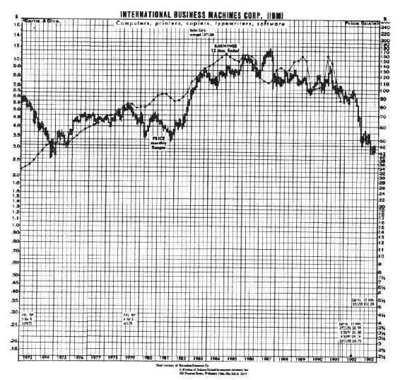
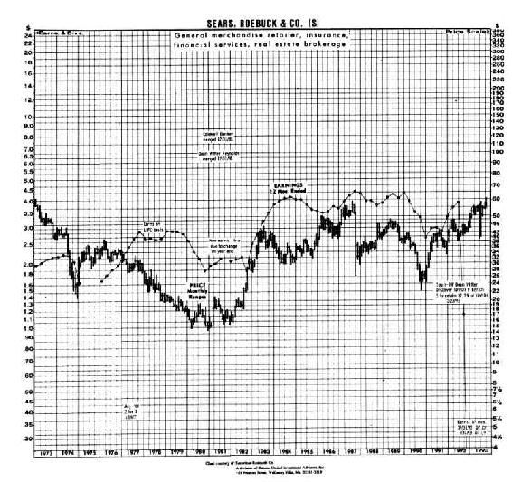
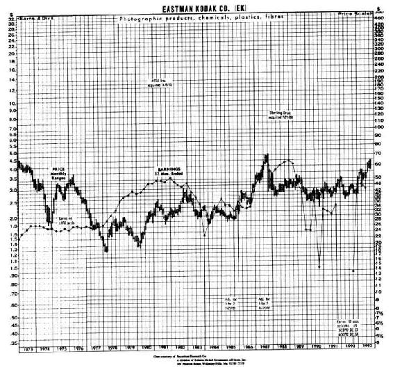

# 第21章　6个月的定期检查

稳健的投资组合需要我们定期进行检查和思考——大约每6个月就要进行一次。即使我们持有的是蓝筹股，或者是《财富》500强当中最出色的几个企业的股票，买了就忘的战略（buy-and-forget）也会是没有收益并且显然是危险的。图21-1、图21-2和图21-3就很好地解释了这一点。那些购买了IBM、西尔斯和伊士曼·柯达的股票，又遗忘了或者是不关注这些股票的投资者们，肯定会为自己的做法感到愧疚。

6个月定期检查并不是简单地从报纸上看看股票的价格，相反，这种每6个月一次的定期检查被华尔街的研究人员认为是一种训练。作为股票的挑选者，你不能对任何事情进行假设，你必须遵循市场行情。目前，你正在尝试回答以下两个基本的问题：①和收益相比，股票目前的价格是否还具有吸引力？②是什么导致公司的收益持续增长？

这里，你可能会得到以下三个结论当中的一个：①市场状况日益好转，因此你可能打算增加投资；②市场行情日益恶劣，从而你可能会打算减少投资；③市场行情没有发生变化，因此你既可以维持原来的投资计划，也可以投资到另一只股票当中，以获得更好的投资回报。

带着这种思考，在1992年7月份的时候，我对自己1月份在《巴伦》周刊所推荐的21只股票进行了6个月的定期检查。从整体上看，这21只股票在平静的市场中的表现确实不俗。我的投资组合的价值提高了19.2%，而标准普尔500的指数仅仅上涨了1.64%（见表21-1和表21-2）。（这些数据已在这半年度公布的大量股票分割、特殊股利发放等消息的基础上做了调整。）

图21-1　IBM

图21-2　西尔斯-罗巴克公司（S）

图21-3　伊士曼·柯达（EK）

表21-1　1992年巴伦圆桌所挑选的股票：6个月的定期检查

①由于这些价格都在1993年9月30日的股票分割之后进行过调整，因此一些股票的价格可能会和本书前面所出现过的价格不一致。

我阅读过这21家公司最近一个季度的所有季报，并且我还给其中大部分公司打过电话。一些公司的市场业绩一直很平稳，而另一些公司和以往相比却表现出了更大的波动。还有，在不少情况下，一些研究会让我对其他公司的股票更加感兴趣，甚至比我自己曾经推荐过的股票感兴趣。这就是股票市场所经常见的情况。股票市场的行情变化非常迅速，没有什么事情是绝对肯定的。现在我就把我的处理方法告诉大家（见表21-2）。

表21-2

美体小铺

早在1月份的时候，我就认为美体小铺是一家非常有前景的公司，但是它的股票价格和公司当时的收益相比已经被高估了，我就打算等股票价格下跌的时候买入更多股票。很快我就等到了这样的机会——在7月份的时候，股票价格下跌了12.3%，即从每股3.25美元下跌到每股2.63美元。美体小铺的销售价格是1993年预期收益的20倍。如果公司的年增长率为25%，那么我不介意支付市盈率20倍的价格来购买股票。在我写这本书的时候，整个纽约股票交易所的市盈率都是20倍，公司的平均增长率为8%~10%。

美体小铺是一只在英国上市的股票。英国的股市在最近这几个月遭受了严重的打击，而美体小铺也传出了一些负面的消息。美体小铺雇用来生产巴西核果护发素的印度卡亚波部落的一个首领在伦敦被逮捕，其被控诉的罪名是殴打其众多孩子的葡萄牙籍奶妈。无论你怎么努力去猜测公司接下来将会面临什么样的麻烦，总会有一些事情是你所想象不到的。

回顾这只股票的历史价格，我注意到其出现过两次大幅度的下跌，一次是在1987年，另一次是在1990年。尽管公司一直都在茁壮发展，也没有迹象表明公司停止了发展的步伐，但是公司的股票价格还是在下跌。我认为这些大面积的抛售行为是因为英国的股东并不如我们这样熟悉小型的成长型公司，因此他们就会更加不假思索地放弃这些股票来避免市场危机。与此同时，由于美体小铺是一家全球性的公司，英国投资者可能会将其和众所周知的在海外扩张失败的企业，比如说马莎（Marks&Spencer），相联系在一起。

如果你是在1990年股市下跌的时候购买美体小铺的股票，并且考虑继续购买，那么你就要做好股票价格将会进一步下跌的准备，不过这只股票的基本面情况还是非常好的。这就是我们要进行定期检查的原因所在。我给公司的首席财务官杰里米·科特（Jeremy Kett）打了个电话，他告诉我，鉴于美体小铺的4个主要市场——英国、澳大利亚、加拿大和美国，在这期间都经历了经济衰退的阵痛，因此可以说公司1991年的单店销售额和收入都有相当大的突破。

另一家非常有前景的公司也突破了经济衰退的影响，它运用了部分资金对各种护肤化妆品进行了全面收购，彻底地降低了产品的成本，提高了利润。这就是肖氏工业公司，正是运用这种技巧，肖氏成为地毯市场中成本最低的公司。

我和我的老朋友凯茜·斯蒂芬森——伯灵顿商场和哈佛广场美体小铺的经营者，进行了讨论。她说去年她的美体小铺的销售利润率是6%，并且她说，现在估算哈佛广场的美体小铺的业绩有些为时过早。她的客户最近一直在追捧几种新产品，包括睫毛膏、腮红和唇彩，还有带有防晒功能的面部滋润霜，脚部磨砂以及她好像在柜台上没有看见的芒果身体黄油——“谁知道她们用这些东西用来做什么？”她说。

护肤品、化妆品以及洗浴用品的市场非常广阔，并且还有很大的发展空间。美体小铺就一直在坚持自己的扩张计划——1993年在美国新建了40家连锁店，1994年又新建了50多家连锁店，其中50%的新建连锁店在欧洲，另外50%在远东地区。我认为公司正处于引人关注的扩张阶段——30年增长期间中的第二个10年。

Pier 1进口公司

Pier 1进口公司的股票走势也很不错，从每股8美元上涨到每股9.50美元，但是很快股票价格就反转下跌了。这是华尔街对好消息充耳不闻的一个例子。分析报告指出，Pier 1的每股收益在第一季度应该能达到18~20美分，但是Pier 1的每股收益实际仅为17美分，于是股票价格就开始下跌了。公司预计当年的每股收益可以达到70美分，这就是一种被套牢的情况。

Pier 1通过出售价值为7500万美元的可转换债券，并使用退休债券（retire debt）的计划来美化自己的财务报表，长期负债又得到了进一步的降低。

Pier 1一直在削减负债、降低库存，同时还在持续扩张。它的主要竞争对手——百货超市，都在慢慢地淡出家用家具的领域。经济衰退持续的时间越长，就会有越多的竞争对手摔下马。当经济得到复苏的时候，Pier 1可能就会成为真正意义上的垄断企业。

根据Pier 1连锁店的业绩，加上来自一家刚刚从困境中恢复过来的控股企业——阳光地带园艺公司所创造的每股10~15美分的盈利，我们很容易就可以预见Pier 1的盈利可以达到每股80美分。阳光地带园艺公司是一只潜力股，市盈率达到了14倍，这也就使得Pier 1的股票价格达到了每股14美元。

GH公司和阳光地带园艺公司

GH公司（General Host）是另外一只价格迅速上涨，然后又回落到我估计的水平之上的股票。那些行动敏捷的出售股票者获得了30%的收益，而长期投资者却看着他们的账面价值从每股2美元缩水到每股50美分。

不久之后，公司做出了一个令人失望的决策。在4月份，公司发行了价值6500万美元的可转换优先股债券，利率为8%。这正是仿照Pier 1的做法，不过GH公司需要支付更高的利率，因为公司的财务状况不稳定。

可转换股票或者债券的持有者在将来能够按照既定的价格将他们所持有的可转换股票或者债券转换成普通股。这会使公司的普通股数量增加，从而稀释了当前普通股股东的收益。在早些时候，GH公司回购了部分普通股，从而使得公司的股票价格上涨，但是现在，公司发行可转换股票或者债券的做法使形势发生了逆转，即股票价格开始下跌。

Pier 1是通过出售可转换债券的方式来获得收入以偿还债务，从而降低公司的利息费用，而GH公司却在出售可转换债券的过程中进一步恢复其弗兰克园艺连锁店的运营。这是一种危险的做法，因为公司不能即时获得收益。

与此同时，弗兰克园艺连锁店还持续出现危机，其复苏的室内花圃市场开始出现下滑。早在1月份，公司的股票价格在每股7.75美元的时候，公司预计当年的收益为每股60美分，但是现在公司的股票价格为每股8美元的时候，公司却预计收益仅仅为每股45美分。

尽管如此，GH公司仍然具有非常稳健的现金流，它的股息在连续14年当中一直保持上升的趋势，股票价格低于账面价值，公司也还在继续进行计划中的扩张行动。从GH公司进入我的挑选清单时起，我就知道马里奥·加贝利已经动用了他自己的价值导向型基金（value-oriented fund）来购买了100万股GH公司的股票，因此我将GH公司股票列入继续持有的名单中。

阳光地带园艺公司，在苗圃和栽培花木这个领域中被我所选中的公司，从1月份开始就出现亏损。阳光地带园艺公司所在的西南部地区在那段时间的降雨量比往年有所增加，从而降低了人们在户外工作的热情。这样一家有实力的并且拥有每股1.50美元的现金在手的公司，它的股票在1991年上市的时候价格为每股8.50美元，而现在竟然只值4.50美元。如果你现在就购买阳光地带园艺公司的股票，那么你就能以每股3美元的价格获得所有的花园。在以后的日子，当雨水减少，人们开始重新种植鲜花的时候，人们就会给阳光地带园艺公司股票重新估价。

是什么让我没有进一步购买阳光地带园艺公司的股票，是卡拉威（Calloway’s）。你可能会想起卡拉威曾经被认为是这个行业的领先者，但是由于阳光地带园艺公司的股票价格更加低廉，所以起初我并没有推荐卡拉威这只股票。然而，在定期对阳光地带园艺公司进行检查和分析的过程中，我发现在这个雨季里卡拉威的股票价格也下降了一半。

为了获得更多的消息，我给卡拉威公司负责投资关系的丹·雷诺兹（Dan Reynolds）打了个电话。他告诉我，公司行政办公室中大约有20名员工，所有的这些员工都在同一个面积为3000平方英尺的办公大厅里办公。我可以想象到他们办公的场景。很明显，公司不存在沟通的隔阂——如果要和管理层沟通或者引起管理层的注意，你只需要站起来说话即可。

卡拉威拥有13家苗圃和栽培花木的园林，拥有相当于每股50美分的现金，并且公司预计在1993年的时候能够获得每股50美分的收益，这就使得公司的市盈率达到了10倍。在华尔街，卡拉威并没有追捧者，因此公司正在回购股票。

和投资于竞争力较弱并且可能以低价出售股票的公司相比，在行业中最优秀的企业开始以低价出售公司的股票的时候买入这些股票是很有益的。我更加愿意持有玩具反斗城而非中国世贸（China World），我更加愿意持有家得宝而非Builder’s Square，或者我更加愿意持有纽可钢铁而非伯利恒钢铁。我还是很看好阳光地带园艺公司的，但是在这一刻我还是稍微倾向于选择卡拉威。

超级剪理发店

经过一段时间的强劲走势和一次3：2的股票拆分之后，超级剪理发店的股票价格同样也回落到1月份的水平。超级剪也经历了两件令人难受的事情。第一件是从计算机世界过来的一位叫埃德·费伯的精通如何加盟连锁经营的专家离开了公司。用费伯的话来说，他希望致力于自己的超级剪理发沙龙。这种解释并不能完全令人信服。

另一件令人难受的事情是我在股东签署的委托书中看见的。我应该早一点就觉察出来的。一家叫Carlton Investments的集团持有超级剪220万股股票。由于Carlton Investments是华尔街中濒临破产的Drexel Burnham Lambert的一部分，因此Drexel的董事们当然会要求Carlton进行清算，这也就意味着和其他财产一样，这220万股超级理发的股票也将要被出售。这就导致了超级剪股票价格的下跌。事实上，由于对这种华尔街所谓的即将抛售到市场中的大量股票所带来的“悬疑”的恐惧，超级剪的股票价格可能早就已经开始下跌了。

超级剪公司自身的经营业绩还是很不错的。超级剪被授予了“奥林匹克官方发型沙龙服务供应商”的称号，因此那个曾经为我剪鬓角的女服务生可能就会为游泳运动员们打理头发。这个异常重要的单店销售额在1992年的第一季度就上涨了6.9%。另外超级剪在纽约北部还新开了几家连锁店，纽约市长罗彻斯特（Rochester）在开张仪式上还免费进行了一次理发。

只要单店销售额一直在提高，并且公司在新开发的市场中也能成功获得一定的份额，那么我就会增加自己手中的股票数量，尽管我开始忧虑超级剪公司可能扩张过快。超级剪公司在1993年计划增开80～100家新的连锁店。

从Color Tile到Fuddrucker’s，再到Bildner’s，我已经看见了很多家很有前景的连锁店被欲望过于热切的征服者所毁灭。“如果你要在15年还是5年时间里实现自己的目标之间做出选择，那么15年是一个更加稳妥的答案。”在6月份的时候我曾经对超级剪的首席执行官这样建议过。

7只储蓄贷款协会股票

到目前为止，在我向《巴伦》周刊推荐的21只股票中，业绩表现最好的就是储蓄贷款协会的股票。这类股票表现没有出现什么异常的现象。那些充满着忧虑和黑暗的行业，如果基本面还是值得肯定的，那么你就可以找到一些黑马。随着利率的下降，储蓄贷款协会从总体上看在这一年的表现还是不错的。通过抵押贷款所收取的利息与支付给存款账户和存款凭证的利息之差，储蓄信贷协会获得了巨大的收益。

自从我推荐储蓄贷款协会股票以来，德国小镇储蓄公司的股票价格已经上涨了59%；苏维瑞银行已经支付了两次10%的股利，同时股票价格还上涨了64.5%；Eagle金融公司股价已经从每股11美元上涨到每股16美元；冰河银行也已经上涨了40%；国民储蓄金融公司也上涨了26%。

就我自己的两只比重最高的金融股来说，劳伦斯银行股票上涨了37%，第一艾塞克斯上涨了70%，这也说明了风险是和收益成正比的。我给第一艾塞克斯的首席执行官伦纳德·威尔逊打了个电话，向他请教今后的市场行情。正是他曾经将自己的困境描述为“用600英尺长的线来钓海底的鱼”，但是，到了春季的尾声的时候，他已经将绳子的长度减短到60英尺。

威尔逊对外报告了几种形势的改进：丧失赎回权的抵押财产正在被出售，不良贷款正在降低，还有抵押贷款市场正在恢复。第一艾塞克斯不仅在第一季度的时候努力实现了盈亏平衡，而且它实际上还开始了新的工程贷款。尽管我一直以来并不喜欢工程贷款，但是，第一艾塞克斯觉得在经济萧条之后现在已经是时候开展工程贷款这一业务了，而且事实表明有部分人开始认为这个领域大有市场。

威尔逊对他们的最强大的竞争对手Shawmut Bank同样也从财务危机中恢复过来这个消息表现得非常愉快。第一艾塞克斯股票的账面价值依旧是8美元每股，但是股票实际的卖出价格仅为35/8美元。如果房地产市场持续发展，第一艾塞克斯最终就可以获得每股1美元的收益，然后股票价格就可以达到每股7~10美元。

劳伦斯储蓄银行，另一家存在问题的储蓄贷款协会，我也在4月份和6月份的时候接触过他们。4月份的时候，该公司的首席执行官保罗·米勒（Paul Miller）对外报告说他们长达7页的不良贷款名单现在已经减少到只剩下1页，并且，新兴的抵押贷款业务也非常强劲。听起来他对将来的市场充满了信心，很乐观。

6月份的时候，他却表现有些失望。此时，劳伦斯仍然有5500万美元的商业房地产贷款在外，而目前这部分贷款仅仅价值2100万美元。如果这些贷款有一半出了问题，那么劳伦斯将会垮台。

这就是劳伦斯和第一艾塞克斯之间最大的差别。第一艾塞克斯拥有4600万美元的净资产和5600万美元的商业贷款，因此如果这些贷款有一半出现违约，那么第一艾塞克斯可能还可以渡过这个难关继续存续下去。劳伦斯则处于一个更加不稳定的局面。如果经济衰退进一步恶化，并且出现新一轮的违约浪潮，那么劳伦斯将不复存在。

密歇根第一联邦储贷协会（FFOM）

6个月之后，我将向《巴伦》周刊推荐的那7只储蓄贷款协会股的6只列为继续持有，主要是因为它们的价格已经开始上涨。同时，一个更好的购买机会又出现了，就是密歇根第一联邦储贷协会（以下简称FFOM）。

在1月份飞往纽约的航班上，富达公司的金融分析员戴夫·埃里森（Dave Ellison）让我对FFOM产生了兴趣。此时进行分析已经为时已晚，因此我将这只股票暂时放到一边。我很庆幸自己没有购买这只股票，因为在所有的储蓄贷款协会股的价格都在上涨的时候，FFOM的价格却没有变化。

如果所有的股票都以同样的速率上涨，那么除了购买之外就没有什么可做的了，同时，各地的股票分析家也将会失去饭碗。幸运的是，事情并不是这样发展的。当你在股票价格下跌之前出售股票后，股票价格通常都会有一段迟缓的回落。在1992年的7月，FFOM就出现了这种现象。

这是吉米·斯图尔特为了避免商业贷款的不足以及使经营成本最小化所借下的90亿美元。由于以下两个负面的原因，这笔资金被隐瞒起来了：这笔资金是从联邦家庭贷款银行（Federal Home Loan Bank，FHLB）借来的，并且采用的是对自己不利的利率期货合约。

大部分的储蓄贷款协会都从近年来的利率下降中获得了收益，但是FFOM除外。这是因为FFOM为了满足经营需要从FHLB处进行贷款，而这部分贷款是按照固定利率来计算的。在这笔昂贵的合约到期的时候，FFOM必须在1994年按照8%~10%的利率向FHLB归还贷款。与此同时，FFOM的借款人却可以按照一个更低的利率从FFOM这里获得抵押贷款；这就给FFOM造成了压力。

当你按照8%~10%的利率来发放贷款，同时你也可以按照同样的利率来获得资金，那么你就不会从中获得收益。这就是FFOM不得不学习的一个痛苦的教训。总体上来说，FFOM的业务都是盈利的，只有FHLB“这块硬石头”降低了公司的总体收益。

只要FHLB的债务得到偿还，那份固定利率的期货合约得到解除，那么这种不利的情况就会得以改变，然后，FFOM的收益就将会激增。这两个问题的解决可能能够给FFOM在1994~1996年带来超过每股2美元的收益。目前FFOM的每股收益为2美元，股票价格为每股12美元，所以我们可以想象一下，当公司可以获得每股4美元的收益的时候会发生什么样的变化。

此外，FFOM股票的账面价值已经超过了26美元每股。早在1989年的时候，FFOM就已经发展得非常迅速，当时它的权益资产比率仅为3.81。从那之后，FFOM的权益资产比率就跨越了5这个大关。在1992年初，FFOM就恢复分配股利，并且一直保持上涨的趋势。FFOM的不良贷款占资产的比例已经低于1%。

如果短期的利率持续下跌，那么FFOM的股票价格可能会下跌到低于10美元的水平，但是了解这段历史的投资者在股票下跌的过程中将会大量购买股票。这笔交易在经纪行中是不可能实现的。

康联集团

6月30日刊登在《华尔街日报》的一篇文章提醒了我，当前有大量的资金涌入到债券基金当中。康联集团特别擅长进行债券基金的业务，特别是在避税和近期特别盛行的美国限制性到期国债基金的运作方面。康联集团仅仅只有9%的资金是投资在股票基金当中。如果我们遇到大部分人所预期的熊市，那么投资者们将会恐惧地从股票市场中退出，然后将资金投入到债券基金当中，那么此时Colonial Group将可以比现在获得更多的收益。

戴维·斯库（Davey Scoon），康联集团的投资关系负责人，他告诉我康联集团的资金在最近一个季度就增加了58%。现在公司管理着价值95亿美元的资产，而在上一年，公司管理的资产只有81亿美元。康联集团目前的每股现金大约为4美元，股票价格大约为20美元。将这4美元从股票价格中刨去，那么公司的股票价格就是16美元，并且公司预期在1992年至少能够获得每股1.82美元的盈利。为了巩固这个利好消息，公司宣布回购1000万美元的股票。

CMS能源公司

由于公共服务委员会将会接受一个有利于公司的妥协价格这种说法的影响，密歇根州公用事业公司的股票突然上涨到每股20美元。在委员会否认了这个妥协价格之后，股票价格又回落到每股16美元，随后又反弹到每股17.75美元。由于目前没有达成任何协议，穆迪将CMS的股票评级降低到投机的水平。

这就是陷入困境的公用事业股票在反弹时所经常预见的问题——监管部门将会允许多大幅度的变化？由于没有国家相关委员会发布的公平合理的规定，CMS将可能会不得不用部分收益来抵消不能转移给消费者的成本。如果是这样的话，那么CMS的股票价格将会下跌到每股10美元左右。除非你已经提前对股票价格的下跌做好了进一步购买的准备，那么在这一段不明朗的时期中最好还是不要持有CMS的股票。

从长期来看，我相信CMS能够运作良好。CMS公司获得了足够的盈利，并且它过剩的现金流最终能够使公司获得更高的收益。中西部地区的能源需求一直在上升，如果没有新的厂商来满足能源需求，那么供给就会不足。能源供给减少，需求增加，那么你应该会知道电力的价格将会发生什么样的变化了。

阳光电器公司

和我们的名单当中的另外几只股票一样，阳光电器公司的股票价格在起初的时候上涨得非常高，然后又回落到我推荐的水平之上。我在6月5日的时候给阳光电器公司的首席执行官鲍勃·奥斯特（Bob Oyster）打了个电话，他提醒我阳光电器公司仅有400万美元的债务，这是一个非常稳健且有潜力的公司，并且竞争力比它稍次一些的对手都逐渐消失了。自从1月份之后，一家竞争对手关闭了它在俄亥俄州地区的所有连锁店，另一家对手则完全退出了这个行业。

尽管经济是在衰退，但是阳光电器公司还是继续获得盈利。除了春天和初夏时冷空气对空调销售的影响的例外，阳光电器公司的销售盈利甚至比正常时期的空调销售还要高。人们在冷的时候并不一定购买空调，但是人们还是会购买冰箱和电视的，因此阳光电器公司在1993年的时候坚持按计划又新开了4家连锁店。

奥斯特先生还表示，即使不出售股票或者举借外债，阳光电器公司也有足够的资金来支付最近几年公司扩张所需要的资金。

业主有限合伙企业：太阳批发公司和特纳拉公司

卢·希晨（Lou Cissone），太阳公司的财务副总监，他将各分支机构的名单分发下去。他报告的声音听起来非常悲观，以至于我开始怀疑公司在第一季度的总体盈利情况。公司最大的问题仍然是债务，即在1993年2月份到期的2200万美元的负债。太阳公司准备通过众所周知的削减成本和压抑购买需求这两种方式来偿还债务。太阳公司还继续避免进行兼并的行动。按照希晨的说法，这不是一个好消息，因为太阳公司的整个产业链——玻璃、水利和自动部分都能够以一个低廉的价格被收购。

这个故事，正如你可能会想起的1997年公司A型股股东可以按照每股10美元的价格出售股票来获得现金，而B型股股东则可以获得剩余的资产。如果经济环境得到改善，我估计B型股的每股价值将会达到5~8美元；而在当前的市场当中，这些股票的出售价格仅为3美元。

与此同时，我提醒我自己，如果经济进一步恶化，太阳公司可以轻易地出售其以前兼并的企业来套现资金，偿还债务。这些很有价值的被兼并的公司给太阳公司提供了一些保护。

特纳拉公司，陷入困境之中的核能咨询公司，也是另一个在利好消息中的牺牲品。公司宣布签订了两份新合约，一份是和Martin Marietta签订的，另一份是和Commonwealth Edison签订的，而Commonwealth Edison是美国最大的核能厂运营商。这就证明了特纳拉公司的咨询企业还是有发展潜力的，否则，为什么Martin Marietta和Commonwealth Edison要花时间来和他们进行生意来往？特纳拉公司宣布公司即将解决所面临的一场诉讼，这场诉讼所需要的成本比一些投资者所想象的要少，紧接着公司在第一季度就实现了盈亏平衡。随之而来的是公司的股票价格的稳定。

我记得最先吸引我购买特纳拉公司股票的原因是公司没有负债，并且经营着一家有潜力，有实力的咨询公司——虽然那时公司的软件部门经营混乱，股票价格仅为每股2美元。如果特纳拉公司能够每年获得4000万美元的收益——在现在看来这4000万美元的收益比公司1月份的收益要多很多，那么，公司就能够实现每股40美分的收益。对于公司目前的环境和股票价格不变的情况来说，这是一笔风险很大的赌注，也就是这样，我将特纳拉公司列入了购买的名单之中。

雪松娱乐公司

如果没有检查我过去已经持有和推荐的股票，我不会考虑业主有限合伙企业。高收益率和税收优惠使得业主有限合伙企业成为一个非常吸引投资者的集团。在这一次，我找到了两个候选公司并打算购买：雪松娱乐和优尼玛（Unimar）。

雪松娱乐经营着伊利湖旁边的Cedar Point游乐园。在8月初的时候我和我的家人曾经到那里去玩过过山车，那是我最欣赏的一次暑期调研了。

雪松娱乐刚刚宣布了一项重要的决定：公司正在收购Dorney Park，一个位于阿伦敦之外的游乐场，并且公司将在另一个地方进行暑期调研。公司并没有徒然使自己的股票成为娱乐股。

在1992年初我没有买雪松娱乐股票的原因在于，我没有看到公司的盈利所在。Dorney Park的收购正好回答了我这个问题。雪松娱乐将会接管Dorney Park，增加新的娱乐设施，并使用久经考验的雪松娱乐的技术来吸引更多的消费者，同时削减成本。

尽管有400万~500万人住在离伊利湖的Cedar Point游乐园不太远的地方，人们开车很快就能到达Cedar Point，但是，有2000万人能够在3个小时之内就到达Dorney Park。

雪松娱乐公司的人实际上对收购Dorney Park并没有觉得很兴奋——这是公司在20年当中的第二次收购。从数学计算的角度看，这笔收购是非常划算的。Dorney Park的购买成本为4800万美元，因为Dorney Park在上一个年度的收益大约为400万美元，市盈率为12倍。

雪松娱乐并没有全部使用现金来支付对价，其通过负债融资的方式用现金支付了2700万美元，剩余的对价通过给Dorney Park的所有者支付100万股雪松娱乐的股票来实现。

以下就是我对这笔交易的分析：在进行收购之前，雪松娱乐的每股收益为1.80美元，加上新发行的100万股股票，公司需要拿出额外的180万美元才能维持当前的收益状况。同时，公司还需要对融资借款的2700万美元支付170万美元的利息费用。

雪松娱乐上哪里去弄到这350万美元来支付这额外的收益和利息费用呢？答案是从Dorney Park的每年预计400万美元的收益中获得。从这个角度上看，这笔收购的交易增加了雪松娱乐的收益。

因此，当Dorney Park被出售的消息公布之后，市场上会有什么反应？雪松娱乐的股票价格在几个星期之内都没有偏离每股19美元这个水平。你不用像内部人士一样参与这笔交易，你可以通过报纸来获得这一消息，然后投入一定的时间来分析公司的状况，然后以收购之前的价格来购买雪松娱乐的股票。

优尼玛公司

优尼玛公司并没有雇员，也没有员工的薪酬支出。这是一家控股公司，它只有一项简单的工作：即接收来自印度尼西亚的液体天然气的销售收入。这些销售收入都会以高额股息的形式在每个季度分配给公司的股东。近年来，这种股息以每年20%的速度增长。

在1999年第三季度的时候，优尼玛公司和印度尼西亚的石油天然气生产商的合同将会到期，随后优尼玛公司的股票将会变得一文不值。这是一个和时间赛跑的游戏，即在合同到期之前的6年半时间里，有多少天然气能被分离出来并被销售，有多少红利能够被分配。

当我写到这里的时候，优尼玛公司的股票价格已经达到了每股6美元。如果到1999年的时候股东能获得每股价值6美元的红利，那么优尼玛公司也就没有太多的投资价值了；如果股东能够获得每股10美元的红利，那么优尼玛公司就是一个不错的投资对象；如果股东能获得每股12美元的红利，那么优尼玛公司就是一个令人兴奋的投资对象。

红利的多少取决于以下两个因素：①优尼玛公司能从印度尼西亚的油田（近年来，公司的产出不断增加，这就增加了股票的吸引力）中分离出多少天然气；②这些天然气能够按照什么价格销售出去。如果石油和天然气的价格上涨，那么优尼玛公司所能支付的红利就会上涨；如果石油和天然气的价格下跌，那么优尼玛公司所能支付的红利也会下跌。

优尼玛公司给投资者提供了一个从未来石油价格上涨的环境中获得收益的机会，并且投资者可以从中获得可观的红利。这笔投资和昂贵且风险高的石油天然气期货合约相比，难道不是更胜一筹吗？

房利美

还有一次股票价格的波动给投资者提供了大量的以折价购买优质企业股票的机会。由于有利于房利美的立法在国会讨论中被延迟通过，因此房利美的股票价格下跌到每股55美元左右。

与此同时，公司在第一季度和第二季度的财务状况良好，并且其有抵押品支持的证券投资组合也增长到了4130亿美元。在房地产行业衰退的中期，房利美的呆坏账也是非常微小的，只有不到0.6%，是过去5年的1/2。公司在1992年将可以获得每股6美元的收益，在1993年将可以获得每股6.75美元的收益；同时，公司还维持着两位数的增长速率，市盈率仅仅只有10倍。

在1992年6月23日的时候，我给公司的新闻发言人珍妮特·波因特（Janet Point）打了个电话，目的是了解这次被延迟的立法是否通过。她向我保证立法肯定是会通过的。这份说明了房利美、房地美等职能的草案通过国会立法的可能性是非常大的，但是，无论这份草案能否通过，都不会影响房利美，因为即使没有这份草案，房利美同样也能运营完美。

联合资本公司II期

这是通过进行风险资本融资来回报借款给他们的公司的一群人。联合资本公司II期吸引我之处是这样一个计划：获取那些陷入破产的中小型金融机构所拥有的一些质量较好的贷款，然后这些贷款被清贷信托公司所拍卖，并且通常都是以一个较低的价格拍卖。

自从我考虑联合资本公司II期这只股票之后，一个全新的Allied系列基金，Allied Capital Commercial已经被发起，它的目的是收购各种不同的贷款。现在Allied家族已经有5只基金了，它们的这种繁殖扩张让我对Allied Capital Advisors——一家从其他Allied风险基金中收取管理费用的独立公司，开始产生了兴趣。Allied Capital Advisors也是一家上市公司，这也是Allied的执行者们创建那5只基金来获取收益的地方。

周期性股票：费尔普斯——道奇和通用汽车

你不能像持有那些处于扩张阶段的零售商的股票那样持有周期性股票。费尔普斯——道奇在过去6个月内上涨了50%。在我所挑选的21只股票当中，费尔普斯——道奇是其中收益最高的一只，但是我很害怕所有的这些轻易就获得的盈利只是虚构的。在1992年初的时候，和后来1992年整年的收益相比，费尔普斯——道奇的股票价格真的非常低，但是它未来的收益要取决于1993年的铜价。

我和公司的首席执行官道格·耶利（Doug Yearly）进行了探讨，他告诉我随着股票价格的上涨，那些华尔街的分析员们将会提高公司未来收益的预期。这就是一个审时度势的例子。因为没有人能够预知铜价是上涨还是下跌，可能只有占卦者才会对此做出预测。我不能够按照这个价格来购买费尔普斯——道奇的股票，我情愿购买Pier 1、Sun TV或者密歇根第一联邦储贷协会的股票。

通用汽车的股票价格和1月份相比已经上涨了37%，然后就开始出现下跌。由于汽车销售依旧保持几百万美元的趋势，所以我认为汽车行业在未来几年的时间里还是大有前景的。市场对汽车的需求应该依旧强劲，同时美元的贬值以及日本的问题应该能帮助美国赢回更大的市场份额。

我喜欢通用和福特，但是我最近的调查说服我自己将克莱斯勒重新列入选择名单当中的首选——尽管克莱斯勒的股票价格在1992年的时候已经翻了一番，业绩胜过了其他的汽车制造商。我对这个结果也感到很惊讶。

由于股票价格在最近翻了一番、两番、三番甚至四番就拒绝这只股票，这是一种严重的错误。数以百万的投资者上个月是否在克莱斯勒上获得盈利或者亏损也不能代表克莱斯勒这只股票在下个月也同样会盈利或者亏损。我尝试将股票看成没有过去和历史，然后公平地分析和挖掘每一种投资的可能性，即“现在开始”的方法。之前发生的事情和现在并没有关系，重要的是股票价格是会高于还是低于当前按照预计的每股收益为5~7美元的基础计算出的每股21~22美元的水平。

从账面上看，克莱斯勒最近传来的消息令人非常兴奋。尽管公司曾经在破产的边缘上徘徊过，但是公司最终成功地融资了36亿美元的现金来清偿其37亿美元的长期债务。克莱斯勒的财务危机现在已经解决了。随着公司逐渐发展壮大，公司的财务机构——克莱斯勒财务公司（Chrysler Financial），将可以按照相当优惠的利率来获得借款，这将能很好地提高克莱斯勒的收益。

改装后的吉普切诺基非常受欢迎，以至于克莱斯勒不用打折扣就能够顺利将它销售出去。公司在每辆吉普车和小型货车的销售上都获得了几千美元的利润。在汽车市场不景气的环境当中，这两种产品每年都能够单独为公司带来将近40亿美元的收入。

T300系列加长型皮卡汽车，即汽车行业所号称的“工程机械宝马”，给克莱斯勒在卡车市场上带来了首次强烈的挑战机遇，因为卡车一直是福特和通用的最大利润所在，克莱斯勒从来没有生产过加长型的卡车。克莱斯勒的普通小型车系列，Sundance和Shadow，已经开始逐步被淘汰，它开始在10年内引进第一种真正的全新汽车设计系统，LH系统。

LH汽车——Eagle Vision，Chrysler Concorde和Plymouth Intrepid都是高价位的，能够给公司带来足够的利润。如果这些高档汽车能够像Saturn或者Taurus那样畅销，那么克莱斯勒将能够获得巨大的收益。

如果说有什么事情阻碍了克莱斯勒的发展，那就是公司在近年来不得不增发数以百万的股票来融资。在1986年的时候，公司有2.17亿股流通股，现在公司有3.4亿股流通股。但是如果克莱斯勒能做到自己的承诺，那么1993~1995年所能获得的利润就足以抵消额外发行新股所产生的负担。

在9月份的时候，我重新回到路易斯·鲁凯泽的《华尔街一周》节目。从我第一次参加这个节目到现在，已经10年了，同时这也是推荐新一批股票的机会。我花了几个星期来做功课，正如我当初为《巴伦》周刊推荐股票一样，并且准备和路易斯的成千上万的观众来分享成果。

在这个节目上，你不会知道观众都会问你什么问题，而且你只有很短暂的时间来思考并回答这些问题。如果他们能给我一段很长的时间来回答那些问题，那么我一定会利用这些时间来给大家讲述我最近的股票选择，正如祖父母会将时间花在谈论孙子孙女一样。实际上，我花费了过多的时间来讨论Au Bon Pain，以至于我都没有谈论到房利美、密歇根州第一联邦储贷协会，或者是其他一些我非常喜欢的金融股。

我尝试着给福特和克莱斯勒一个不错的评价，这是我在这个节目上第一次推荐的股票，但我的几个同事却提出了反对的意见。我猜想我们又回到了原地。
