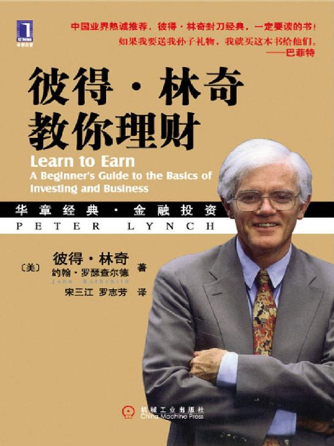

# 华章经典·金融投资

华章经典·金融投资

彼得·林奇教你理财

Learn to Earn: A Beginner's Guide to the Basics of Investing and Business

[美]林奇（Lynch,P.）

[美]罗瑟查尔德（Rothchild,J.）　著

宋三江　罗志芳　译

ISBN：978-7-111-28405-5

本书纸版由机械工业出版社于2010年出版，电子版由华章分社（北京华章图文信息有限公司）全球范围内制作与发行。

版权归作者所有·看完请自行删除·由【微信jrgh3w】制作，仅限朋友圈免费分享学习！

目录

赞誉　一定要读的书

推荐序　美国股市启示录

序言　补上投资这一课

引言　开始留意身边的上市公司

第1章　美国股市的前世今生

第2章　股市投资的基本原理

第3章　上市公司的生命周期

第4章　上市公司的成功秘诀

附录A　常用的选股工具

附录B　学会看财务报表

致谢

译者后记　我有一个梦想

译者简介
