# 第2章　股市投资的基本原理

## 投资致富刻不容缓

许多人直到他们三十几岁、四十几岁甚至五十几岁时才开始攒钱投资，时至今日，他们总算意识到自己已经不再年轻，而且很快就需要额外的金钱来应付退休的需要（比如说拥有一座湖边的度假屋或者周游世界）。然而，令人遗憾的是，等到人们意识到他们应该投资的时候，他们已经错失了数以年计的投资股市的宝贵时机，他们的财富本可以因此而更快地保值增值。

相形之下，这些人花钱如流水，今朝有酒今朝醉。尽管他们的很多开销是必不可少的：譬如他们需要抚养孩子，支付医疗和教育的费用，缴纳各种保险费、物业费等各种费用。如果在支付了这些费用后确实无所结余，人们的确也是很难进行投资的。但是，通常的情况是，即使有所结余人们也不会进行投资，而是热衷于倾其所有去高档酒店奢侈消费或者为购买豪华轿车支付首付款。

不知不觉中，他们日薄西山般步入了退休的行列，口袋里除了一张社保支票外一无所有。可想而知，其结果是他们在退休后本该从容地享受生活的时候，却不得不节衣缩食，因为仅靠社保基金养老毕竟勉为其难。

如何规避上述悲惨的命运呢？最好的办法就是尽早开始攒钱投资。而且最好是在你还和父母住在一起的时候就开始行动，设想一下，还有什么时候你的消费会比这个时候更低呢？这个时候你没有孩子要抚养，而你的父母还在抚养你。如果你的父母不要你去支付房租，那就更好了。因为你可以找份工作，然后把收入都节省下来，为将来做些投资。总而言之，如果你还和父母住在一起时攒钱投资越多，你独立生活时就会越从容。

不管是一个月10美元，还是一个月100美元，或者一个月500美元，你都需要尽力而为有规律地攒钱投资。

据报道，许多二三十岁的年轻人开始搬回来和父母一起住，以便享受免费的住宿、电视、录像机、健身等服务。这一趋势预示着美国已经产生了寄居的新一代，其特点是没有勇气融入社会、独立生活。这种情况的正面报道我们鲜有耳闻，只有《华尔街日报》近期刊登过一篇正面文章：“X一代开始为退休储蓄”。

这则报道的大意是说，那些寄居在家、被称为“迷惘的一代”或“X一代”的二十几岁的年轻人已经开始悄悄为了未来储蓄，他们这批人中储蓄的比例高于那些在“婴儿潮”期间出生的父辈（那代人喜欢现期消费而不是为将来省钱）。X一代意识到他们无法指望退休金安度晚年，他们看到自己的父母为了还信用卡利息而挣扎，他们不想重蹈覆辙，他们要追求财务独立，所以住在父母家中时就开始为之努力。

这是一个非常积极的变化趋势，我们只能期待更年轻的一代人会追随“X一代”的做法，而不要重蹈覆辙地成为车奴。可惜的是，许多孩子都迫不及待地要买豪华轿车，以至于在职场上立足未稳就沦为车奴。

兜风的时候，开着一辆崭新的雪佛兰轿车而不是一辆二手车，那当然很酷。但从长期而言，这种酷的代价很高。什么是酷的代价？让我们考查以下两个例子：乔和萨莉。

乔是沃尔玛的一名职员。他住在父母家里，为了购买一辆价值20000美元的带有敞篷的雪佛兰轿车，他节衣缩食攒钱支付了2000美元的首付款，又借了18000美元的汽车贷款，当然他的父母不得不为这笔贷款担保，由他来偿还贷款。这是一笔五年期利率为11.67%的贷款，也就是说，乔每个月要还给金融公司400美元。当他第一次封上信封吻别400美元时，他的确很难受。但是，当他开着雪佛兰四处兜风时，他的朋友都赞叹奇酷无比，这时他已经完全将当时的难受感觉抛之脑后了。

几个月后，乔的雪佛兰车门上有了刮痕，地毯上有了污渍，车驶入停车场时再也听不到赞叹声。现在，这只是一辆普通的车了，但是，乔先生却负债累累，身陷分期付款的压力之下。为了负担这辆好车及其兜风约会的花销，乔不得不加班加点，以至于无暇顾及兜风约会。

五年后，乔先生早已厌倦了他的雪佛兰车，这辆车也早已威风不再了。他终于付清了汽车贷款，还多付了6000美元的利息。也就是说，乔为他的车花了26000美元，这还不包括各种税费、保险费、油费和维修费。

这时，雪佛兰轿车已经污渍斑斑，引擎也嗡嗡作响。如果转卖这台车，估计乔也只能卖5000美元。因此，乔26000美元的投资回报只是一辆价值5000美元的旧车。

萨莉同样也住在父母家里，她在沃尔玛做收银员，工作岗位与乔近在咫尺。但她不崇尚酷车，只是拿自己积攒的2000美元买了一辆二手的福特车。因此，她就能每月投资400美元到一只股票型基金，而不必支付汽车贷款。

五年后，当乔还在支付他最后一期汽车分期贷款时，萨莉投资的股票基金市值已经翻番了，萨莉这时已经拥有了30000美元的资产。她仍然在开福特二手车上下班，但她从来不用担心车身上的刮痕和污渍，因为这只是她的交通工具，而不是一项投资。

当我们结束这个理财故事时，萨莉已经有了足够的钱来付自己房子的首付，并搬出父母的房子，但乔还在“啃老”。他曾经想和萨莉约会，但萨莉却喜欢上了带自己看房子的房产经纪商。

## 学会让钱为你工作

一旦你让钱为你工作，它将成为你很好的朋友，不费吹灰之力，你的兜里就会因钱生钱。譬如，你在自己的储蓄账户存上500美元，存款利率是5%，一年后，你不用靠修剪草坪或清洗五辆汽车就可多赚25美元。这样看来，你的钱会自动生钱。

这25美元起初看来并不起眼，但看看连续10年每年储蓄500美元会发生什么呢？在你投入第10笔储蓄的那年年末，你已经连本带利拥有6603.39美元了，其中5000美元是你的本金，再加上1603.39美元的利息。

如果你将这500美元投入股市而不是存入银行，那么，在你享受生活的同时，就可能赚更多的钱。平均而言，如果把钱投入股市，那么你的本金每7~8年就可能翻一番。许多聪明的投资者学会了利用这一点，他们意识到对未来而言投资致富和劳动致富同样重要。

沃伦·巴菲特现在是美国排名第二的富翁，他就是运用储蓄进行股票投资发家的。开始的时候，他就像许多其他孩子一样靠送报纸挣钱。他攒下每一美元，并在很小的时候就懂得钱的未来价值。对他来说，在商店里看到的一台400美元的电视机，不仅仅是一件价值400美元的消费品，他还在思考如果把这笔钱用于投资而不是消费，这400美元20年后到底价值几何。正因为如此，他从不花钱买不需要的东西。

如果你及早储蓄和投资，终有一天单靠钱生钱就够你生活所需，就像你有一个有钱的姑妈或舅舅寄给了你下半辈子所需要的所有现金，而你甚至不需要写感谢信，也不必在他生日的时候前去探望。这就是所有人都向往的财务自由的机会，自由地去自己想去的地方，做自己想做的事情，而钱则自动生钱。如果不在年轻的时候就养成每月定期储蓄并进行投资的习惯，这一切都有如天方夜谭。

有鉴如此，最好的情况是你从工资中直接省下一部分用于投资。次好的情况是，你是个月光族。最糟的情况就是用信用卡赊账消费，负债累累，在这种情况下，你是在付利息给别人，常常是付给信用卡公司，信用卡公司在赚你的钱，而不是你用钱生钱。

从希尔斯到壳牌再到那些发行信用卡的银行，都希望你用信用卡分几次支付账单。他们在用自己的钱为你买单，实际上这是你在不知不觉中向他们贷款。他们为你未付的款项向你收取很高的贷款利息，可能高达18%。看来，他们从你身上的资产回报率甚至高于从股市所得，换句话说，对信用卡公司而言，投资在你身上比投资股市的回报更大。

如果你用还款利息为18%的信用卡买了一台400美元的电视机，那么，你每年要为这笔贷款多支付72美元。如果你每月只用最低额度还款，并让欠款一直累积，到最后这台400美元的电视机将花去你800美元。数百万的信用卡持卡人都不太明白这个道理，否则，全体美国国民信用卡消费产生的银行贷款不会高达3400亿美元！据估计，1995年使用信用卡向银行支付的利息将达450亿美元，也就是说，每年人们为了超前消费，需要额外支付450亿美元。

消费者为了获得所谓的“即时的满足”付出了高昂的代价。他们查阅广告、货比三家也就省下了几块钱，然而用信用卡贷款支付，最后却多损失了几百美元。对此，他们甘之如饴，甚至从来都没想到过自己潜在的损失。

45年前，在大莱卡还没有发行第一张可以在多家商社使用的信用卡之前，人们只有在手头有了足够的现金时才去商场买东西。他们为电视机、电器、家具、旅行等开销而储蓄，这可能要花上他们6个月、9个月甚至几年的时间才能存够钱，但他们从来不用付利息。

也许你不相信，用这种原始的方式来购物虽然得不到即时的满足，但也常常很有乐趣。因为当你为买电视机而攒钱时，你就可以坐在客厅里谈论拥有电视机的乐趣，可见想象电视机、洗碗机或一套新的服饰本身就是一种乐趣。

那时，人们感到自豪的是，为了一次性支付购买某件物品，他们可以努力工作，做出一定牺牲。而向银行借款会使他们惶惶不安，所以，一旦偿还房贷，他们就会邀请所有邻居来家庆祝。直到20世纪60年代美国人才开始使用信用卡，直到80年代大多数家庭才开始习惯使用住房按揭贷款、汽车贷款、信用卡透支消费。

时至今日，许多家庭正处在最糟的情况下：银行在赚他们的钱，而他们在股市投资或银行理财中一无所获。他们每年支付的银行利息少则几百美元，多则几千美元。如果是在为房子或公寓付息尚可理解，因为它们的价值会增长，但为汽车、家电、衣服或电视机付息则不然，使用时间越长它们越不值钱。

负债的结果和储蓄投资的结果刚好相反，欠债越多，你就会越痛苦。在美国的家庭中，入不敷出的家庭比比皆是，政府自己也债台高筑，负债高达5万亿美元。现在，美国纳税人缴纳的每一美元中有15美分是用来偿还国债利息的，而且这一数字还在上升。政府之所以会债台高筑，就是因为它的支出超过收入，缺口部分就向个人、养老金、银行、国外政府等一切债权人来借。我们经常听到关于平衡预算、削减赤字的讨论，但每年都会在原来的基础上增加1000亿美元、2000亿美元、3000亿美元的新赤字。

我们可以想象一下，去年你用信用卡消费了1000美元，今年你用同一张卡买了900美元的东西。除了华盛顿之外，所有地方的人都会说你又增加了900元债务，因为你的信用卡贷款总额达到了1900美元。只有华盛顿人看法不同，他们说你减少了100美元的债务，因为你去年欠了1000美元，今年只欠了900美元。

这就是为什么政府一边在庆祝削减赤字，一边赤字还在不断增长的原因。譬如，今年新增债务2000亿美元，他们却说这是减少了债务，因为去年他们借了2500亿美元。这根本不是削减，而是新的2000亿美元负债加利息，需要我们的孩子乃至孙子去偿还。长此以往，债务还将累加，除非政府能停止使用“信用卡”，量入为出地使用税收收入。而现在的政府正处于最糟糕的状态，是我们不应该学习的坏榜样。

美国人也曾是一个喜欢储蓄的民族。各种收入水平的人都尽量多地攒下闲钱，一般存在当地银行的储蓄账户里。他们从利息中获益，最终可以将这笔钱用于房屋首付，或买东西，或留作不时之需。与此同时，银行有了这些储蓄可以贷款给购房者、房产商及各类企业。

一个高储蓄率的国家可以集中财力投资于公路、电话网络、工厂、设备和一切可以使公司生产出价廉物美、行销海外的商品的创新科技。日本就是一个实例，日本在第二次世界大战中几乎被摧毁，但它居然恢复了过来，并成为世界经济强国。日本一开始卖塑料玩具和小玩意，“日本制造”曾一度成为笑柄，但很快美国的大马路上三辆汽车中就有一辆日本车，日本电视更是普遍进入美国家庭，“日本制造”成为高科技和高品质的象征。

日本之所以可以重建它的产业和城市，就是因为它的高储蓄率。现在日本仍是一个储蓄大国，美国在这一方面要奋力追赶，因为我们早已抛弃了曾经的储蓄习惯。当我们每年从年收入中省下4%时，日本人、德国人、中国人、印度人和许多其他国家的人省下了10%、20%甚至更多。我们在使用信用卡方面领先于世界其他国家，其实质是我们在借钱购买当下想要却无力支付的东西。

为了自己也为了这个国家，请竭尽所能攒钱投资吧！

## 股票投资更胜一筹

可供选择的投资有五种基本的类别：把钱存在银行储蓄账户和类似的账户；购买收藏品；买房；买债券或买股票。下面让我们逐一解析它们的利弊。

## 储蓄账户、货币市场基金、国库券、定期存单

以上这些投资方式又称为短期投资。短期投资有它的优点，可以支付利息，而且可以在相对较短的时间内收回本金。把钱存放在储蓄账户，或购买国库券和定期存单一般不会亏钱。（货币市场基金虽然没有这种承诺，但是在货币市场上赔钱的可能性也微乎其微。）

但是，短期投资有一个最大的缺点，就是利息率低。有时，你在货币市场账户或储蓄账户中获得的利息还跑不过通货膨胀率。从这个意义上来说，银行储蓄可以说是一种失败的投资。

通货膨胀是价格上涨的一种比较学术化的说法。油价从1.10美元上升到1.40美元，或电影票从4美元上涨到5美元，这就叫通货膨胀。从另一个角度来看，通货膨胀也就意味着货币购买力下降。

现在美国的通货膨胀率略低于3%，这就意味着你拥有的每一美元，每年都在损失约3美分，按照这样的贬值速度，十年后你就损失了30美分。

储蓄和投资的首要目标就是要抵御通货膨胀。你的钱就犹如逆水行舟不进则退。在此情形下，投资回报率只有超过3%才算保本。

下面的表格可以清楚地说明，货币市场和储蓄所得的利息常常不能抵消通货膨胀造成的损失。如果再扣除利息所得税的话，那么，货币市场投资和储蓄在表中所显示的20年时间里有10年是亏本的投资。

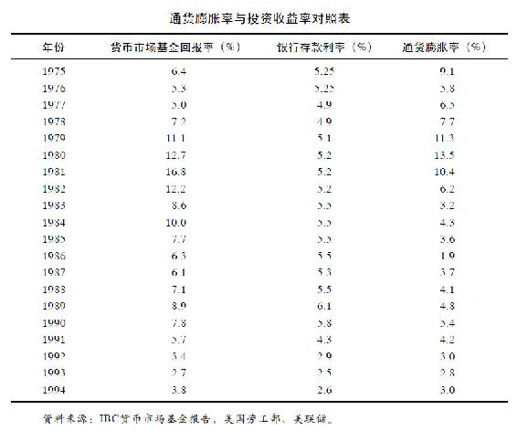

这类投资的问题就在于：在短期内本金是安全的，因为这种投资一般不会出现损失，但是，长期来看，如果考虑所得税和通货膨胀的影响，本金就缩水了。所以这里值得注意的是：当通货膨胀率高于你从定期存单、国库券、货币市场基金、储蓄账户所获得的利息率时，那么，你的投资就是失败的。

拥有储蓄账户，你就拥有在任何时候提取现金、支付账单的便利。你也可以把钱暂时存放在银行，直到资本累积到一定程度再投资别处。在这两种情形下储蓄是很好的选择。但是长期来看，储蓄意义不大。

## 私人收藏品投资

收藏品可以从古董车到邮票、钱币、棒球卡或芭比娃娃。当你投资于这些物品时，你是希望将来能以更高的价钱来出售它们。其中有两个原因：这些物品越老就越有价值，人们愿意花更高的价钱来购买；另外通货膨胀会侵蚀现金的购买力，从而抬高物品的价格。

投资收藏品的问题在于这些物品可能被遗失、盗窃、污损，受到火、风、水等的破坏。虽然可以投保，但保险金额会非常高。通常来说，这些物品虽然越持久越保值，但也会越破旧越贬值。因此，收藏者当然盼望收藏品可以随着时间而保值而不是跌值。

收藏是个非常特别的事业，成功的收藏家不仅对收藏品研究很精通，对于收藏品的市场价值也非常在行。这里面有很多东西要学，有一些你可以从书中学到，另外一些你必须从实践中学习。

对潜在的收藏家来说，尤其是对年轻一辈来说，买新车并不是一个好的投资。“投资”一词最近出现在汽车电视广告中，但如果你看了这则广告，请不要被蒙蔽。在车库中妥善保存而且不常被开的古董车可能是一个投资，但每年都开的新车就贬值得很快，甚至超过现金。没有什么东西可以比汽车更快吞噬你的银行存款，游艇除外。有鉴于此，别犯这样的错。

## 房产投资

买房是很多人最赚钱的买卖。与其他投资相比，买房有两大优点：你可以一边住，一边等待其升值，你还可以借钱来买房。下面让我们来算一算账。

通常房子的价值也跟随通货膨胀一起上涨。但是你不用一次性还清所有的房款，一般来说，首付20%，银行会发放80%的按揭贷款给你。你需要就房贷而支付额外的利息，通常需要持续供款并付息15年或30年，这取决于你选择的付款年限。

同时，你居住在这套房子里，当楼市下跌时你不必仓惶出逃，而当股市变差时你需要尽快离场。只要你住着，房子就会升值，但你却不用为升值缴任何税。在你出售房子的时候，政府也会给你一定的税收优惠。

如果你购买了价值10万美元的房子，房子每年升值3%，一年过后，房子将比你购买时增值3000元。乍一看，你会说那是3%的回报，与你从银行存款中获得的回报一样。其实还隐藏着一个秘密：在这10万美元中，你只支付了2万美元，所以，其实在第一年年底，你用2万美元获得了3000美元的回报，这就是15%的回报率，而不是3%。

当然，你必须偿还利息，但却可以从政府这里得到税收优惠（利息费用在年终报税时可作减税之用）。一旦你付清贷款，你就增加了对房屋的投资。这就是人们通常想不到的一种储蓄方式。

如果你用15年来偿还贷款，并一直居住。当你还清贷款的时候，假设每年3%的房价涨幅，你用10万美元买来的房子就会值15.5797万美元。

让我们继续分析乔和萨莉的案例。他们都升到了经理助理的职位，领取同样的薪水。萨莉住在自己的房子里，而乔也与父母分居，他希望可以拥有自己的房子，但却付不起首付，所以他只能租公寓住。

乔每个月的房租比萨莉的房贷还款要少一些，加上萨莉还需要支付住房保险、草地养护和房屋维修等费用，所以，一开始乔口袋里的现金应该比萨莉多。从理论上讲，他可以把积蓄投入股市，从而积累他自己的金融资产，但是他没有。他把钱花在了添置音箱设备和高尔夫练习课程上。

一个不会省钱买房子的人，通常也不太可能存钱投资股市。一个家庭为了最终可以买房子而做出很多牺牲，这听起来很平常，但是你听说过一个家庭为了买第一只共同基金而做出很多牺牲吗？

通过拥有自己的房子，萨莉已经养成了储蓄和投资的好习惯。只要她还在偿还房贷，她就是在投资房产。既然她已经为了还房贷而投资房产，那么将来当她有盈余积蓄的时候，她还是会投资基金。

15年后，当她还清了所有的房贷，她完全拥有了自己的房产，但每个月最大的开销却不再需要支付。乔先生却仍然家无恒产，他甚至还要支付比当初更高的租金，它可能远比萨莉最后的一期房贷还款要高得多。

## 债券投资

你也许从媒体中听说过“债券市场”、“债市上涨”、“债券价格普遍下跌”等词汇，也许你认识买过债券的朋友，也许你还在疑惑“到底什么才是债券？”

美其名曰的“债券”，其实就是一张借条（IOU）。它是一张在上面印有美元价值和艺术画面的精美纸张，但其本质与用餐巾纸写下的借条相差无几。它们都是一种你借钱给别人的记录，大都要显示借款的金额和还款日期，也都要标明借款人为该款项所需支付的利息。

即使有时候叫“购买债券”，但当你购买的时候，你却没有买到任何东西，你只是借出了一笔款项。债券的卖家，也叫发行人，向你借了钱，债券本身就是这个交易的一个记录而已。

美国是世界上最大的债券发行人。当美国政府也就是山姆大叔需要额外资金的时候，它就会印上一批债券。目前存续的5万亿美元国债，就是美国政府向各界的借款，这些债权人包括国内外的机构和民众，甚至是外国政府。它们借钱给美国，凭证便是那些锁在保险柜中的“借条”。

最终，有借必有还，有借不还就会造成财政赤字危机。同时，政府还要为借款支付利息，这就让它觉得力不从心，常常使得政府捉襟见肘。美国政府对太多的人欠了太多的债，致使超过15%的联邦税收都只能被迫用来偿还利息。

年轻人最熟悉的一类债券恐怕就是美国储蓄债券。祖辈们往往把这类债券当做传家宝送给后辈们，这是一种间接遗产。与直接赠与相比，老一辈通过购买国债把钱借给政府。多年之后，政府偿还本金并支付利息给子孙。

美国政府并不是债券的唯一发行人，州政府和地方政府同样会通过发行债券集资。医院、飞机场、学校、体育馆、公司等也会发行自己的债券。所以，民间的债券供应量非常充足，你可以在任意一个证券经纪商那里买到债券，就如同开立账户买卖股票那样简单。

基本上，债券与我们前面讨论过的存款证和国库券非常相似。购买债券可以获取利息，你可以预先知道获得利息的时间和金额，以及什么时候可以取回本金。债券与这两者主要的区别在于存款证和国库券的持有时间较短（几个月到几年），而债券的持有时间较长（一般为5年、10年、甚至30年）。

持有时间越长，通货膨胀的风险就越大。这也就是为什么长期债券的票息率往往比短期债券的息票率高的原因，因为投资者会为承受更高的风险而索求更高的回报。

当其他条件都一样时，30年的债券要比10年的债券支付更高的利息，相同道理，10年的债券比5年的债券也要支付更高的利息，依此类推。购买者需要决定他们准备持有多长时间，额外的利息收入是否值得他们把钱拿来投资那么长的时间。这些都是需要深思熟虑才能做出的决定。

迄今为止，美国的债券投资者持有超过8万亿美元的各类债券，使得债券的受欢迎程度超过股票。与此同时，投资者也持有超过7万亿美元的股票。两者孰优孰劣的比较一直困惑人心，其实两者各有利弊。股票比债券风险高，当然潜在收益也更高。为了更好地理解这其中的玄机，让我们来举例比较分析：一是购买麦当劳的股票；二是购买麦当劳的债券。

当你购买股票的时候，你就是公司的股东，拥有一定的股东权力。对麦当劳还有那么一点小小的影响力。他们会给你发送报告，邀请你去参加股东大会。他们还会支付给你一定的奖金，当然，是以红利的方式。如果他们在16000家汉堡包店铺的生意很好的话，他们还会提高红利的数额。就算没有红利，如果他们把超级至尊汉堡卖得超级好，股票价格就会上升。你也可以卖掉股票以赚取高额利润。

但是，没有人能保证麦当劳能长盛不衰，也没有人能保证你的红利和股价上涨。如果股价跌破你的购入价，麦当劳不会赔偿你的损失，他们不会承诺获利。作为股票的拥有者，你没有任何保障，必须自己来承担风险。

如果你购买的是麦当劳的债券，或者是其他任何债券，接下去的故事就完全两样了。在此情况下，你就不是公司的股东了，而是贷款人，把钱借给麦当劳一段时间而已。

麦当劳可以靠卖汉堡包赚很多钱，但是，他们不会想到给你分红。公司只会对股东分发红利，你肯定没听过他们主动提高票息率来犒劳债权人吧。

对债券持有人而言，最糟糕的情形就是眼瞅着股价飙升，而自己却一无所获。麦当劳就是个很好的例子。从20世纪60年代开始，它的股价从22.5美元一路飙升至13570美元，投资者赚了603倍，投入100美元就可以得到60300美元，或者1000美元得到603000美元。购买它们债券的人很难成为幸运者，因为他们只能一路获取利息收入，除此之外，他们收益甚微。

如果你购买10000美元10年期债券，并持有到期，你得到的仅仅是本金和10年的利息。实际上，由于通货膨胀的存在，你得到的甚至更少。比如该债券票息率为8%，10年的通货膨胀为4%，那么，即使你每年可以得到8000美元的利息，可你还是因为通货膨胀损失了1300美元。你10000美元的初始投资在10年的通胀之后仅值6648美元。所以，该债券的实际报酬率小于3%，如果算上税项的话，那你的实际收益可能接近于0。

不过，对债券持有人而言，好处在于：即使你错过了股价上升的盈利机会，但你也避免了股价下跌带来的亏损。如果麦当劳的股价相反，从13570美元跌到22.5美元，股东会暴跳如雷，而债权人则一路可以笑到最后。无论股市发生什么，当债券到期日来临的时候，公司一定要对债权人偿还本金和利息。

这就是为什么债券比股票风险低的原因了，因为它具有担保性。在你购买的时候，你就知道你会得到多少利息，而不用天天担心股价的走势。你的投资是相对安全的，至少比股票安全。

然而，持有债券一样会有风险。第一，若你在到期日之前卖出债券，那样未必能够全额收回本金，因为像股市一样，债市每天也会涨跌无序。如果高买低卖，自然就会遭受损失。

第二，当债券发行人倒闭，不能偿还本金。这种可能性取决于债券发行人。举例来说，美国政府不会倒闭，有需要时它可以选择加印钞票。因此，美元政府债券的持有者一般不会面临得不到本金的风险。

其他债券发行人，如医院、机场、企业等，就无法做到100%的担保了。如果它们倒闭的话，持有人将会遭受损失。不过，通常他们也不会倒霉到什么都捞不回来，总能拿回一些本金。但是，在极端情况下，投资人也会连本带利损失殆尽。

当债券发行人不能如期偿还利息和本金时，这种情况就叫做“违约”。为了避免违约，聪明的投资者通常会在购买之前了解发行人的财务状况。有些债券是由第三方担保的，那这也算是一种保证。市场上还有一些机构会对债券做出评级，这样投资者就能事先获知哪些债券的风险高，哪些风险低。大公司一般可以获得较高的信用评级，譬如麦当劳发行的债券发生违约的可能性几乎接近于零。偿付有困难的小公司，一般信用评级也较低。你一定听说过垃圾债券吧？那些就是评级最低的公司发行的债券。

如果你购买了垃圾债券，你就冒了收不回本金的风险。这也正是为什么垃圾债券的票息率比普通债券高的原因了，因为投资者需要高回报来应对高风险。除了垃圾债券中的“垃圾王”，一般垃圾债券违约的可能性仍然是较低的。

其实，持有债券最大的风险还是通货膨胀。我们已经看过通货膨胀是如何侵蚀掉一项投资的。如果投资股票的话，长期来看，还是可以抵抗通货膨胀，并实现一定的盈利的。如果投资债券，就很难达到这一点。

## 股票投资

股票是你除了房子以外最好的投资。你不用像养马或者养宠物那样去饲养一只股票，它也不会像汽车那样会发生故障，更不会像房子那样需要整修。你会因为火灾、盗窃或洪水遗失你珍藏的棒球卡。股票购买的凭证也会被偷窃或焚毁，果真如此也不必惊慌，公司还会再补给你一张。

如果你买债券的话，只是借出去一笔款。当你投资股票的时候，你是在购买一部分公司股权。如果公司繁荣昌盛，你可以分到一杯羹。如果它分红，你可以得到回报，如果它提高红利金额，你就赚得更多。几百个成功的公司都有每年增加红利水平的惯例。这是持有股票的保值增值的好处。但是，它们从来不会提高债券的利息收入。

我们可以通过以下的图表分析比较股票相比其他投资品种的优越性。由此可见，或许在市场调整的年份或单纯的一年里难分伯仲，但长期来看，股票投资更胜一筹是不争的事实。

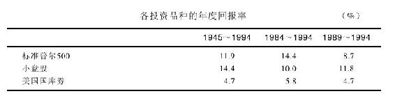

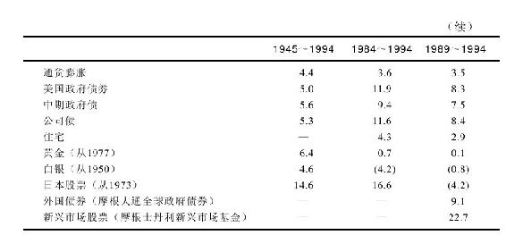

超过5000万的美国人（约占美国人口的20%）已经发现了这个秘诀，并开始通过购买股票来盈利。这些并不都是驾驶劳斯莱斯（Rolls-Royces）的富人，正如你在《富人的生活》上看到的那样。大部分的股票持有人都是普通的打工一族：教师、公车司机、医生、木匠、学生、你的朋友和亲戚、隔壁邻居等。

投资股票宜早不宜迟，不必等你变成百万富翁或千万富翁的时候再来投资股票。即使你因为失业，或还没上班，或没有盈余来投资股票，你也可以尝试进行个股的选择游戏，这样是最好的无风险训练。

飞行员要在飞行模拟器里训练，这样他们可以在不造成真实事故的前提下得到充分的学习和锻炼。你也可以自行构建自己的投资模拟器，在不遭受损失的前提下学习投资。即使尝试失败，也未尝不是一件好事，毕竟失败是成功之母。

朋友或亲戚可能会规劝你远离股市，他们甚至会告诫你投资股票就像赌钱一样，因为股市不比赌场稳妥多少。他们可能用实际例子来证明这一看法，我们也可以用上面的这个表格反驳这些人的论据。如果股票市场是一个赌场的话，那么，为什么这么多年以来它还是那么受欢迎，回报还是那么高呢？

当人们在股市中持续亏钱时，这并不是股票的错。股票的价值总体来说是随时间上升的。99%的亏钱个案是由于投资者不会制定投资计划，他们在高价时买入，在股票调整的时候他们往往耐心不够或是太过惶恐而匆匆地在低价卖出。他们的实质是“高买低卖”，你不应重蹈覆辙，你需要的是制定自己的投资计划。

本书旨在帮助人们理解股票的实质，认识发行股票的上市公司。尽管这只是一个基础性的介绍，但我们希望它可以成为你整个投资生涯的指南。

## 长期投资分享股市盛宴

要成为一个成功的投资者，你不必是一个数学天才。你也不必是一个会计，虽然有时候掌握财务常识可能很有帮助。只要你可以做五年级的数学，你就有了基本的技能。接下来你需要的就是一个投资计划了。

投资股票年轻人比老年人更有优势。你的父母或祖父母可能对股票要比你更熟悉一些，这可能是太多次失败的结果。当然，他们也比你有更多的钱投资，但你有最有价值的一样东西，那就是时间！

通过下面这个例子，你可以发现时间在投资复利中的价值，越早开始投资，结果越明显。其实投资得早，即使是一笔小钱，都比一笔大钱投资得晚要来得更有价值。

你听过一句老话，叫“时间就是金钱”吗？现在这句话应该被改成“时间创造金钱”。这是一个双赢的结果。让时间和金钱发挥双重作用，投资回报自然不菲。

如果你已经决定投资股票，而不是债券的话，你就做出了一个很明智的决定。当我们这样说的时候，我们是假定你是一个长期投资者。如果你的钱只能投资1年、2年或是5年，那么，股票并不是第一选择。因为从这一年到下一年股市会怎么样没有人会知道。在股市调整的那几年，你如果把钱取出来的话，就会遭受损失。

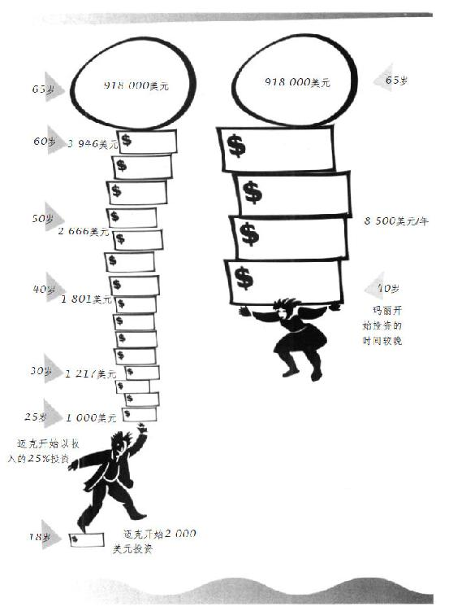

对于投资股票来说，可能需要坚持20年或20年以上。因为股票的调整需要足够长的时间来恢复，投资的盈利需要日积月累。每年11%的回报是股市过去以来的记录。尽管没有人能够准确地预知未来，但以过去的经验来看，如果持有股票20年可以获得年投资回报率11%的话，投资者10000美元的初始投资将变成80623美元。

要想得到每年11%的投资回报，你必须忠诚地对待你购买的股票，就像忠实于婚姻一样，因为你已经建立了你的钱和你的投资之间的“婚姻”。只有耐心持有，才能成就你的股票天分。有时候决定投资者的好坏高低的并不是投资智慧，而是投资的纪律性。

不要轻信那些让你卖出股票的“建设性的提议”，做一个坚定的投资人，忠于你的股票。这个是50年前一个股票经纪人弗雷德·施韦特（Fred Schwed）在他的经典著作《客户的游艇在哪里？》[^1]（Where Are The Customers' Yachts?）里面给的建议，到今天仍然适用。

人们常在寻找各种战胜华尔街的秘籍，其实一直以来最好的秘籍便是选择一家盈利能力强的公司的股票长期持有，股价下跌并不是一个好的卖出理由。

自诩是一个长期投资者很容易，其实，现在已经很难找到一个人不说自己是长期投资者了，但当股市调整之日，真正的考验才刚开始。

本书后面会讲到很多关于市场下跌、调整、熊市等，没有人可以准确地预期到熊市何时到来，但当它真的来临时，90%的股票会集体下跌，这时投资者就慌了。

他们从新闻电视里听到“灾难”来形容这样的市场，他们开始担心自己的投资会跌到零，因此匆忙离场，即使割肉也在所不惜。他们安慰自己说，拿回一些本金总比什么都没有的强。

就在这个时候，这些本来号称是长期投资者的人，突然变成了短线投机者。他们让感性占了上风，忘记了最初的想要分享好公司利润成长的投资理念。他们因为股价下跌而惶恐，匆匆卖掉股票而不是耐心等待它反弹。没有人强迫他们这样做，是他们自愿的。

可他们自己并没有意识到这一点，而是陷入了一直尝试去选时的漩涡。如果你说他们是选时者，他们肯定会否认。但是，根据市场波动来卖股票的行为实质就是选时者。

选时者试图预测短期市场波动和股价变动，并据此获得盈利而退场。但是，没有多少人可以用这种傻瓜都懂的方法真正赚到钱。如果真是这样，那这个人早就成了亿万富翁，而不是比尔·盖茨和沃伦·巴菲特了。

你试图选时，但结果往往是追涨杀跌。人们觉得自己运气不够好，但其实这是因为他们追求的是不现实的结果，没有人可以长期战胜市场。人们还认为在市场调整的时候投资股票是非常危险的，但他们忘了，踏空同样也是有风险的。

关键的几天往往可以成就或是摧毁你整个投资计划。这里有一个很典型的实例：在20世纪80年代股市上涨的5年中，股价每年的涨幅为大约为26.3%，坚持长期持有的投资者资产会翻番，但其实这5年的大部分利润是在1276个交易日中的40个交易日中赚取的，如果在那40个交易日中你选择空仓的话，你的年均收益可能就会从26.3%降到4.3%（其实定期存款也可以获得4.3%的收益率，但风险更小）。

因此，如果想得到最多的投资回报，最好的方法就是买入并长期持有。你可能会经历调整，但只要你不卖出的话，你不会有真正的亏损。相反，你能全面、完整地享受到股市的盛宴。

## 共同基金的特点

综上所述，我们可以得出两个结论：第一，你应该选择投资股票；第二，一旦买了，就要尽可能地长期持有。接下来的问题就是，是由你自己来挑选个股，还是委托别人来帮助你投资股票。

如果你厌倦了整天面对财务数据，或者压根儿不关注柯达的盈利情况，也不关注到底耐克鞋和锐步鞋孰优孰劣，那么，选择投资基金就是简单的方法。

帮助那些既想投资股票又不知道怎么去分析股票的人，这正是共同基金产生的原因。你需要的只是拿现金去购买基金的份额，你的钱与很多其他人的钱一起交由投资专家去投资股票。你希望基金是由专家来管理的，因为你指望他们帮你正确地选择股票，并进行适时的买卖。

共同基金除了有专业的基金经理来管理投资之外，还有一个优点：它会投资很多股票，也就是说，当你购买了一只基金后，你一下子就变成了几十个，甚至是几百个上市公司的股东，无论你投资的是50美元还是5000万美元，而这比买一只股票的风险要低得多。

一般的基金投资门槛很低，起点购买金额只需50美元或100美元。购买多少金额，多久买一次都取决于你自己。你也可以选择每个月、每3个月、每6个月投资固定金额的基金。间隔的时间长短并不重要，贵在坚持。

你能看出这种定期定额投资方式的智慧之处吗？那就是没有了选时的忧虑。在市场下跌的时候，你每次购买越买越便宜，所获基金份额越多，市场上涨的时候，你越买越贵，所获基金份额越少。时间一长，你的总体成本被拉低了，利润变得更可观了。

另外一个吸引投资者的地方就在于基金的定期现金红利，有可能一年四次、一年两次甚至每个月一次。你可以用这现金去购买任何东西（比如电影票、CD、太阳眼镜）来犒劳你自己。你也可以把这红利用来购买更多的份额，这叫做“红利再投资”（reinvestment option），一旦你这样选择了，它就会为你自动转成基金份额。你投资得越多，转成的份额就越多，以后就可从基金的盈利中获取得越多。

你可以在报纸上查到所购买基金的业绩表现情况，就像你要找迪士尼的股票表现那样。基金净值每天都随投资组合中的个股变化而变化，那就是为什么你要选一个好的基金经理的原因，他们选的股票表现越好，你的基金就会赚得越多。

如果你不想继续持有基金了，那也很简单，你可以将基金份额全部赎回或是部分赎回，兑现你的投资本金和盈亏。但是，除非你有紧急情况，赎回基金是最后的选择。因为你的目标是扩大盈利，持有基金的时间越长，潜在的盈利机会和盈利空间就越大。

当然，在持有基金期间，投资者需要支付管理费和其他开支。这些费用从基金资产中列支，一般基金的费用往往在0.5%~2%。也就是说，你买了一只基金后，每年要付0.5%~2%的费用，当然，基金买卖股票还必须付一定的佣金。

一般来说，专业的投资管理人员比业余的股民更有优势，对业余股民来说，投资只是一种兴趣、一个爱好，可对专业人员而言，这是一份工作。他们接受过关于分析上市公司及财务报表的专业培训，他们拥有图书馆、高性能的电脑和一群研究员来支持。一旦公司有任何消息，他们第一时间就能获悉。

另一方面，专业投资管理人员也有他们的局限性。玩桌球，我们比不过专业桌球运动员；动脑部手术，我们比不过专业的脑科医生，但是，我们却有机会击败华尔街的专业人士。

有一部分基金经理喜欢购买相同的股票，他们觉得与别的基金经理购买相同的股票很安全，他们不愿涉入不熟悉的领域。因此，他们会失去发现黑马股的乐趣并错失盈利的机会。他们往往会忽视新的、业务不大的小公司，而这些小公司会变成盈利能力很强的公司，市场的大赢家。

## 基金的发展历史

历史上最早的基金成立于1822年，由荷兰的威廉一世（King William I）发明，之后流传到苏格兰，并在那里得到发扬光大。因为苏格兰人非常节省，不愿意把钱花在零散购买股票而带来的高昂佣金上，他们认为节省的钱可以买到更多的基金。

共同基金后来又传到了美国，但是，直到19世纪才真正兴旺起来。那时，共同基金被称为“股票信托”（stock trusts）——最早的记录是1889年发行的纽约股票信托。股票信托在20世纪20年代流行起来，并改名为“投资公司”。

美国本土第一只真正的共同基金是萧路姆斯赛利斯基金（Shaw-Loomis-Sayles fund）。它成立于1929年11月，也就是在股市大崩盘后的几周。由于基金生不逢时，以至于基金净值一路下跌，直到1932年才触底。到了1936年，当经济萧条尘埃落定时，全国近半的投资公司已经濒临倒闭。

投资者从中得到了一个很重要的教训：股市下跌，基金也难逃一劫。这一点直到今天都仍然适用。即使是华尔街最优秀的基金经理都无法在大熊市中保护你，无论是在1929年、1972~1973年、1987年、1990年或者将来可能出现的2000年、2010年、2020年的萧条时期。无论是你自己投资股票，还是交由专业人士来打理，面对熊市都在劫难逃。

1940年，也就是1929年大萧条后的第11年，美国国会通过了《1940年投资公司法》（Investment Company Act of 1940）。这个至今仍然沿用的法案规范了共同基金的运作，它要求每一只共同基金都必须将投资和运作的细节告知投资者，这样投资者可以很明确地知晓该基金的性质，以及他们所需要付出的费用等。

每个在美国登记的共同基金（目前超过6000只）都需要将它的投资策略、风险水平等公诸于众。它要解释如何来进行投资，要揭示它的投资组合、前几大投资标的及其持有份额。它还需要公布基金公司收取的管理费和其他销售费用。它需要就前几年的盈亏情况做出说明，让投资者明白它的历史表现到底是好是坏。

除此之外，共同基金还需遵守严格的投资规定，比如，单股的持有比例不得高于5%，以达到分散投资、降低风险的目的。

同时，美国证监会保持日常监管，使基金管理人自律，不违反条例。总的来说，美国共同基金业的自律性较高，与监管机构也保持着比较良好的沟通。

最近，在证监会的支持下，很多基金开始减少宣传单张中的官样文章和法律术语，很少有投资者会去看这些，本来只是政府的规定，这些内容既浪费时间又浪费金钱，而且这些印刷品的成本都是从基金财产中扣除的。该行动的目的是让投资者尽可能地理解整个产品，而不是提前去商学院学习。如果该活动成功的话，基金公司和投资者都将从中受益。

20世纪60年代晚期，沉寂了很多年的共同基金又开始进入公众的视野。在此期间，基金销售人员变成了老师、店主、文员等，他们利用周末或晚上的时间做兼职的基金销售。但这导致了一个很糟糕的结果，很多普通人购买了基金，但却是在错误的时机，当时正值1963~1973年，股市经历了自1929年大萧条后最严重的一次熊市。在这次熊市中，一些共同基金下跌了75%，又一次证明了持有基金一样会有风险。投资者惶恐地赎回基金，亏损离场，把现金都存入银行，发誓再也不轻信基金销售人员的鬼话了。

此后，十年之内几乎很难再让投资者购买基金产品。即使是业绩表现好的基金，也无人问津，优秀的基金经理发现很多便宜的好股票可以买，但是没有投资者的资金，他无从购买。

当股市于20世纪80年代开始繁荣的时候，基金业也跟着繁荣起来。这期间共成立了5655只基金，在过去的两年中就成立了1300只基金，几乎天天都有新的债券基金、货币市场基金、股票基金成立，加盟到已有的2100只股票基金中。照此发展速度，很快这个市场上股票基金的数量将会超过股票本身的数量。

## 投资基金的九条建议

如果要详细描述不同类型的基金，可能用一本书的篇幅都不够：单一行业基金、多行业基金、小市值公司基金、大市值公司基金、混合基金、国内基金、国外基金、成长型基金、价值型基金、收入型基金、成长收入型基金等比比皆是。基金类型的区分太过复杂，还有很多基金中的基金。

基金的宣传单浩如烟海，选择合适的基金既费时间，又耗精力，简直可以把人逼疯。不过，只要方法得当，人们照样可以放松地和家人快乐相处，不必枉费心机选择基金从而白白花费治疗精神病的费用。

有关基金选择的方法，我在此提出了以下的九条建议。

第一，你可以直接在基金公司（如富达基金公司等）处购买基金，也可以通过股票经纪商购买，不过，有时候股票经纪商未必代理你想要的基金产品。

第二，股票经纪商也要盈利，所以，有时候他们会重点向你推荐他们自己的产品。说服你购买他们自己的基金产品也许是他们的目的，但不是你的兴趣所在。每次当他们给你推荐产品的时候，你需要仔细思量，你可以要求他们提供全部产品的清单，你有可能找到与他们推荐的性质相仿但业绩表现却好很多的基金产品。

第三，如果你是长期投资者，就不需要考虑是选择债券型基金还是混合型基金了，你的终极目标就是股票型基金。在20世纪的大部分时间里，股票的表现都要比债券好。如果你不是百分之百地投资股票基金的话，那就是自欺欺人了。

第四，选择合适的基金难于选购好车，但基金有历史业绩可以做参考。除非你访问过很多顾客，否则你不可能知道哪辆车好，但你可以通过基金评级来判断基金的好坏。归根到底是看基金的年投资回报率。一个过往10年平均年回报率为18%的基金一般要比同期年均回报率只有14%的基金更好。不过，当你根据历史业绩表现来选择一只基金的时候，请首先确认该基金经理是否仍然在任。

第五，长期来看，小盘股往往比大盘股表现出色。今天成功的小公司就很有可能变成明天的沃尔玛和微软，这就是为什么小盘股基金的长期业绩往往会优于大盘股基金的原因。你需要的就是基金投资几个类似于沃尔玛这样的股票，可以在20年内翻上250倍。既然小盘股的波动性更大，那么，小盘股基金的涨跌幅度就要比其他类型的基金要大。但只要承受能力足够强大，你就能收获颇丰。

第六，为什么要冒风险去投资新基金，而不去选择那些历史业绩表现优秀的老基金呢？你完全可以在《巴伦》（Barron's）周刊或《福布斯》（Forbes）等金融杂志上找到这些多年来表现突出的基金。《巴伦》每半年会刊登一次所有基金的表现及专业评级机构——理柏（Lipper）公司所做的基金评级，《华尔街日报》（The Wall Street Journal）则每季度就会刊登一次。

如果你想更详细地了解某一只基金的情况，你可以从晨星公司（Morningstar）那里获得，晨星公司追踪几千只基金，并且每个月会发布相关报告，并对这些基金进行收益及风险方面的评级，告诉你谁是基金经理人，投资组合中有些什么股票等。它可以提供迄今为止最详尽、最便捷、一站式的基金信息服务。

第七，有些投资者习惯经常转换于不同的基金，希望可以挑到表现最好的那只基金。其实，这么做往往事倍功半，徒劳无益。很多研究表明，一年表现好的基金在下一年未必一样出色，所以，尝试寻找表现最好的基金是得不偿失的事情，你最好还是挑选一只历史业绩表现优异的基金，买入并长期持有。

第八，基金的费用中除了从基金资产中列支的年度管理费之外，还有购入费用，叫申购费。目前，一般申购费平均在3%~4%。也就是说，在你购买基金的时候，你就已经损失3%~4%了。当然，也有不收取申购费用的基金，而且它们的表现跟收取申购费用的基金没有特别的差异。当你持有基金的时间越长，这些申购费就越显得无足轻重。如果一只基金表现优秀，10或15年之后，3%~4%的申购费用也就微不足道。其实，每年的年费更值得注意，因为它每年都要从基金资产中扣除。费率低的基金（少于1%）比费率高的基金（超过2%）自然更有优势。管理人管理一只收费高的基金是有劣势的，因为每年他们必须取得超过费率低的基金0.5%~1.5%的成绩，才能取得同样的投资回报率。

第九，大部分的基金经理都想追求超越市场平均水平的投资回报，这也就是你为什么支付他们酬劳的原因，因为他们为你挑选了可以战胜市场平均水平的股票。其实，基金经理常常无法战胜市场，其中一个原因便是费率的扣除。一些投资者已经放弃了寻找可以战胜市场的基金，相反，他们选择无论如何可以跟上市场平均水平的基金，这种基金就是指数基金，它并不需要基金经理来主动管理，完全可以由计算机程序自动完成投资。它的实质就是按照比例购买标的指数的成分股，并一直持有。这其中没有特殊的管理费、频繁买卖不同股票的佣金，也无须投资决策。举例来说，标准普尔500指数基金只会购买标准普尔500指数所有的500只成分股，标准普尔500指数是很有代表性的市场综合指数，所以，你可以通过购买追踪它的指数基金来获得市场平均的收益水平，而这可能比你投资主动管理的基金效果更好。又比如，如果你希望通过投资小盘股基金来分享小市值公司的高速成长，你就可以购买基于罗素2000指数的指数基金。那样，你就可以间接投资罗素2000指数中的2000只成分股了。另一种方法就是做资产配置，一部分钱可以投资标准普尔500指数基金，另一部分用来投资小盘股指数。这样一来，你就大可不必枉费心机挑选所谓最好的基金，即使千挑万选，结果说不定只是买了一只最终表现落后于市场的基金。

## 如何自己挑选股票

如果你有时间，也有天赋，你就可以自己来挑选股票。这比投资共同基金要费事得多，但却可以带来很大的满足感。时间长了，你可能比共同基金做得还要好。

但不是所有你选的股票都能赚到钱，换言之，百发百中绝无可能。沃伦·巴菲特可能犯错，彼得·林奇也会有很多失败的投资。但只要有几个表现出色就可以了，假如在你拥有的10只股票中，有3只是大黑马，就好过1~2只垃圾股、6~7只平庸股的投资组合。

如果你一生可以发现几只可以涨3的n次方倍数的股票，那么基本上你就可以衣食无忧了，尽管同时还有几只表现很差的股票。一旦你知道如何分析上市公司的时候，你就可以加大比例投资较好的公司，而减少投资较差公司的比例。

发现可以翻三番的股票的确不太容易，但你一生确实只需要几只那样的股票就可以确保一个有希望的将来。我们不妨匡算一下：当你投资10000美元的股票涨了3的5次方的倍数（即243倍），你得到的回报至少是240万美元，如果涨了3的10次方的倍数（即59049倍），你就会得到5.9亿美元，如果涨了3的13次方的倍数（即1594323倍），那么恭喜你，你就是全美最有钱的人了！

其实，共同基金和股票并不对立，很多投资者两者都买。很多在投资共同基金方面的建议（如尽早投资、需有计划、长期持有等）也都适用于投资股票。不过，投资股票还是有个性问题：选什么股票？用于投资的钱从何而来？因为在熟悉股票之前就贸然投资是一件很危险的事情，那你就应该在实战之前有很多的练习机会和经验。

很多人对自己所投资的股票一无所知，这确实令人惊讶，但这种事情天天都在发生。譬如，一个毫无投资经验的人，在退休后将所有的养老金都盲目地投进了股市，而他甚至连基金分红和打高尔夫球杆带出的“草皮”（divot）之间的区别都不知道。所以，这里面应该有一些正规的培训，就像驾校一样。显然，我们不会冒风险允许没有驾驶经验的人在高速公路上开车。

如果没有其他人来训练你，你至少可以自己训练自己，在纸上分析各种投资策略，感觉各只股票的不同特性。同样，这时年轻人就有优势。你有的是时间来模拟尝试各种投资策略。当你有钱去投资的时候，你已经为实战的投资做好了充分的准备。

你一定听说过梦幻棒球，你选择一个虚拟的棒球队，看他们的比赛成绩，与现实队伍进行对比。同样，你可以训练做一个模拟的完美股票组合。假设拿100000美元来购买迪士尼、耐克、微软、本杰瑞、百事的股票，每只股票各投资20000美元。如果把1995年4月21日作为起始日的话，你的投资组合就会如下表所示。

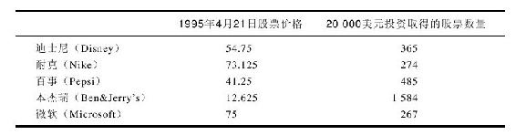

一旦你选好了股票，记下了价格，你就可以计算你的盈亏，就像真的交易一样。你也可以把你的模拟收益与你父母的真实投资（如果有的话）产生的收益进行对比，或者与其他的共同基金对比，或者与你朋友的投资组合表现对比。

由于美国经济教育证券业基金会的赞助，全美的学校都将完美选股课程带进了课堂。在1994~1995学年度，有60多万名学生参加了该项活动。他们被分成不同的小组，每组来决定用虚拟的资金购买什么股票。整个比赛持续了大约10周的时间，组合收益最高的小组便是最后的冠军。每个学校的冠军再参加校际、省际和全美性的比赛。

参加此类挑战股市的虚拟资金实战模拟，寓教于乐，只要参与者有投资的基础知识，并不对结果太过在意。这种训练唯一的问题就是投资时间的局限性，13周、26周，即使1年，股价的变动很可能是机缘巧合。太短的练习时间往往不能给你一个良好的实践机会，一只股票可以在13周内表现不好，可也有可能在3年或5年的时间里是一只大牛股，或者情形正好相反，在13周的表现很好，可之后就一路下跌。

长期表现优异的股票取决于长期表现优异的上市公司，所以，成功投资的秘诀在于发现成功的上市公司。要想取得成功，你必须研究更多的上市公司信息。以下我想概要介绍选择股票的五种基本方法，其中既有荒谬可笑的方法，也有行之有效的方法。

## 投掷飞镖

这是最低级别的选股方法。通过投掷飞镖的方法，投中哪只股票就买哪只股票。或者你也可以闭上眼睛，任意用手指来挑选。你可能很幸运地通过这种方法买到了一只大牛股，当然也可能手气不佳，挑到了一只垃圾股。这种方法最大的优势就是省时省力，不过，如果你是习惯于随机选股的话，最好还是购买共同基金。

## 打听小道消息

次低级的选股方法就是听消息选股票，别人告诉你买什么股票就去买什么股票。那人可能是你的好朋友、你的英语老师、你的亨利叔叔、水管工人、机械师或花匠。或者消息是你从公车上听来的，很多时候无意间听来的消息比自己获知的消息要更让人兴奋。

亨利叔叔很有可能与该上市公司有关联，那这样的小道消息就很有价值，值得好好研究。但空穴来风的小道消息就很危险了。一个典型的例子便是：家庭购物网站这只股票有异动，资金正在进入，现在不买就来不及了。

买东西不会货比三家的投资者往往会对“消息股”一掷千金。他们之所以这样做是不想踏空股票因消息上涨而获得的盈利，但事实是，如果他们不买这只股票，即使股票上涨，他们也毫无损失。

不购买股票，自然也不会有损失。损失只有发生在购买了股票而股票下跌，人们又忍疼割爱将其卖掉时。

## 听从专业建议

这种方法是指参考专家在财经频道和报纸上提供的消息选股。基金经理、投资顾问和其他华尔街精英们经常都会定期在媒体上作些评论，可是你并不是唯一接受这些信息的人，成千上万的人都知道了这样的信息。不过，如果你原本是根据消息来买股票的话，那么，不妨相信这些专家的专业意见，毕竟专家在撰写评论之前都颇有研究，而亨利叔叔除了知道“股价可能会上涨”之外，其他一无所知。

不过，听从专家意见也有不足之处：万一专家改变了看法，你却无从获知。除非他重新回到电视台把新想法通知观众，而你又恰巧看到，否则，你就会因为专家推荐过那只股票而一味地持有。

## 参考经纪商的推荐清单

股票经纪商对推荐股票从来都是不遗余力的。不过，这些股票都不是简单地出自经纪人的头脑，而是总部研究团队的结晶，研究人员不断分析公司的信息，并据此提出买卖的建议。

股票经纪公司根据收集到的分析师推荐买入的股票集合形成买入清单，发给所有股票经纪人。这个推荐清单通常会分为几种类型：适合保守投资者的股票、适合激进投资者的股票、高分红的股票等。

你可以通过经纪公司推荐的股票组建自己的投资组合，这样一来，你就可以借助经纪公司的研究优势来选择自己喜欢的股票。这种方法比单纯听从专业建议有一个更大的好处在于：如果经纪公司改变了对股票的看法，把一只股票的评级从“推荐买入”到“推荐卖出”，经纪人会及时发出通知，如果你的经纪人没有做到这一点，你就可以更换股票经纪人。

## 自己研究上市公司

自己研究上市公司，据此选择自己熟知并且喜爱的股票进行投资，这是选股的最高境界。就像在前面的投资组合例子中讲到的那样，可能迪士尼、耐克、本杰瑞、百事和微软就是你既了如指掌又十分喜欢的五家上市公司。

对于上市公司，你了解得越多，就越少依赖别人，越能客观地评价别人给出的建议，你甚至可以自行决定“买什么，何时买”。

研究上市公司通常需要两种类型的信息：从实地调研中得到的信息和从数据分析中得到的信息。对于第一种，你可以在走进麦当劳或其他各种上市公司的门店时搜集信息。如果你自己就在这些门店工作，那就更好了。

你也可以亲自了解到公司的运作是否高效、人员配置是否充足、公司架构是否合理等。你可以感受到员工的忠诚度，你可以感觉到管理层是挥霍无度还是谨慎投资。

如果你是面对客户的，你可以了解到客户的信息。比如：顾客是否排队结账？顾客是否满意货品？这些细节可以反映很多上市公司的质量。你是否见过盖普公司很杂乱，或者麦当劳客人稀少？这些店铺的员工很早就意识到他们的连锁模式非常成功，所以运用节余的资金购买了自己公司的股票。

同业竞争并不必然会导致客户分流，但是，如果隔壁开了一家性质相同的店铺，而且服务更好，价钱更低，那么，流失客户在所难免。一线员工往往最先感知到客户分流的情形，而且没有人可以阻止客户流向竞争者。

即使你不在上市公司工作，你同样可以以顾客的角度来观察一家公司。当你每次在店里购物、品尝汉堡包或购买新眼镜时，你都可以得到该公司第一手的信息。顺便在店里逛逛，你还可以知道有什么畅销，有什么不畅销。拜访你的朋友时，你可以知道他们使用什么牌子的电脑，喝什么牌子的饮料，看什么电影，了解锐步跑鞋是否还在流行，这些都是引导你寻找并购买好股票的最佳线索。

但是，大部分的人都没有循着这条线索探索下去。很多人每天工作在一些产业的第一线，却没有想到利用这个优势从中发现投资机会。医生们明明知道哪个制药厂好，但却不常投资医药股；银行家们完全知道哪家银行最强，但却不买银行股；店铺老板和商场工作人员可以接触到第一手的销售数据，清楚地知道哪家零售商的货品卖得最好，但又有多少商场经理会去投资零售行业的股票呢？

一旦投资者开始以选股的眼光观察世界，潜在的投资机会无处不在，但是，你应该首先关注那些与你熟悉的公司有业务往来的上市公司。如果你在医院工作，那你就有机会充分了解提供医疗用品（例如缝合线、医生袍、注射器、医疗床、X光机器等）的上市公司、协助医院低成本运作的上市公司、提供健康保险的上市公司、负责寄送医疗账单的上市公司。小杂货铺是另一个典型的案例，透过货架上的各种商品就能了解各类上市公司。

你也会开始注意同业竞争的情况，尤其是你所在的公司被同行超越的时候。如果人们排队抢购克莱斯勒小型货车，不仅克莱斯勒的销售人员注意到公司业绩的大幅提升，隔壁街区销售清淡的别克车的销售人员也意识到许多顾客正在“移情别恋”。

我们需要由此入手研究上市公司的相关数据。一家公司的产品在市场上大受欢迎，并不表示你就要购买它的股票。在投资之前，其实你还需要弄清以下问题：上市公司是否胡乱投资还是谨慎地对待投资人的资金；它的银行贷款有多少；公司整体业务是否在增长，增长率是多少；公司去年赚了多少钱，今年预计还能赚多少；公司目前的股价是否在合理的区间。

你还要知道公司是否支付股息，如果有的话，有多少？多久派发一次？以下是股票投资人必须关注的关键数据：经营利润、销售收入、负债、股息、股价。

人们可以去商学院学习如何来解读这些数据，因此，对这些高深的技术细节本书暂不做讨论。我们所能做的就是给大家一个公司财务报表的初步概念，读者可以在本书的附录B中看到详细的解释。

没有投资者可以做到全面跟踪美国各大交易所上市交易的13000多只股票，所以，无论是散户股民还是专业人士，大家都挑选几种特定特征的股票来研究。比如，有些投资者偏好投资高分红的股票，有些投资者则喜欢投资年增长20%以上的高成长股票。

选定特定特征股票的方法非常多：你可以选定特定的行业，比如电力或银行；你也可以选定大盘股或小盘股；你还可以选定新公司或老公司；你甚至可以专门关注那些之前陷入危机目前正在走出困境的公司。

投资并不是精细的科学，无论你多努力地研究数据，你都不可能准确预言公司未来的表现，未来永远深不可测。投资者唯一能做的就是做出尽可能理性而非盲目的预测，精心挑选股票，尽量低价买入，并随时关注与股票相关的各种信息，从而运用你的知识把投资风险降低到较小的程度。

## 股市投资实战演习

你可以从早到晚地玩股市仿真游戏，但纸上谈兵毕竟不如实践出真知。人们像记得初吻那样，清楚地记得自己买过的第一只股票。无论你将来会买多少只股票，你永远忘不了第一只股票。

这时，让你忘而却步的就是缺钱。年轻人有时间投资，却没有现金，而且并不是什么钱都可以拿来投进股市的，那必须是你未来几年都暂时不会用到的闲钱。如果你有兼职工作，那就可以把兼职收入投入股市。如果没有，你也可以暗示你的家人你需要钱来投资。

在此，父母、爷爷奶奶、阿姨、叔叔们就可以发挥作用了。对年轻人来说，最好的资金来源就是亲戚们。当他们问你最想要的生日、圣诞节礼物时，你可以说是股票。购买一双耐克鞋的钱可以用来购买耐克的股票，而且你最好还是选择拥有股票。

宁要耐克股票，不要耐克鞋，这个回答肯定会使很多大人感到震惊。他们会赞叹你的先见和成熟，你在整个家族中的声望也会直线上升。如果他们自己也有股票，就可以通过转让过户来协助你开始投资之旅。这样的转让很方便，不需要支付佣金。事实上，很多年轻人都是通过这种方式开始学习投资的，很多股票也都是这样代代相传的。

许多祖辈习惯留传储蓄债券给子孙而不是股票，如果你的祖辈也是这样的话，那你最好给他解读本书后面的图表，如果他们理解了图表，就会卖掉债券，买入更加超值的好股票，并留传给你。

虽然有些股票都是由祖辈传给子孙的，但对于年轻人而言，用自己的钱去投资还是一件挺困难的事。其实，过去年轻人一直是不被鼓励通过买股票来开始投资的。这里主要有两个障碍：第一，大部分的股票交易需要通过证券经纪来完成，而未满21岁的年轻人是不允许开立股票账户的；第二，大部分的证券经纪收取固定金额交易佣金，从25美元到40美元不等。如果你花47美元买了一股百事可乐的股票，你需要向经纪高额支付40美元的佣金，交易成本昂贵。投资者显然不愿意花87美元去买一只价值47美元的股票。

当然，这种糟糕的局面正在改善，很多上市公司已经开始绕开经纪商，直接向公众出售其一小部分的股票。麦当劳既然可以卖给你汉堡包，为什么不可以卖给你它自己的股票呢？

已经有80家上市公司开始提供这种所谓的“直销计划”，收取的费用比经纪商要低得多，有的甚至不收佣金。这是自从纽约股票交易所在20世纪60年代邀请披头士乐队去表演以来华尔街为年轻人做的最好的事情了。目前至少有850多家公司愿意参与到以上的“直销计划”中，公司数量仍在增加。

当然，你不太可能通过公司直销只购买一股股票，因为大部分上市公司都要求最低购买金额在250~1000美元，具体金额由上市公司自行规定。不过，与支付高昂的佣金相比，这还算是比较小的缺憾。

直销的好处显而易见：一旦你买过这个上市公司的股票，你就可以持续地从公司那里直接购买，佣金费用全免。并且公司一旦分红，你的现金红利将自动转换成股份。大部分情况下，你与公司的销售代表直接联系，而不用通过证券经纪商。

多多留心这样好的投资计划，它使原本被市场隔绝的投资者也可以参与到股市中来。

如果你还是执著于每次只买一股股票，那也有个投资计划适合你。但是，首先你必须参加全国投资者俱乐部协会（National Association of Investors Corporation,NAIC），它是一个支持全国投资者俱乐部的一个组织。

1996年1月会员费是一年35美元。个人会员或家庭只须支付14美元的年费就可以订阅月度期刊《更好的投资》（Better Investing），这本杂志为股票投资者提供了很多有用的信息。大部分的内容面向有经验的投资者，当然也有一小部分的内容是针对投资菜鸟的，你可以从中学到很多东西。除了期刊，你还可以有机会以7美元的交易费用购买1~10股151只不同的股票。

这种“只买一股”的投资计划专为儿童而设，尽管仍然会面临投资年龄的问题。大部分的州政府会要求你达到18岁或21岁以上才能购买股票。否则，父母或监护人可以代表你，不管怎么样，你都需要找到一个人来代你签署。

这个计划是这样运作的：协会提供你所有151只可供投资的股票名称，你选择要买的股票和当前的股价，然后把股票清单、标有购买金额的支票、每家公司7美元的交易费用和额外10美元的差额费用邮寄给协会。举例来说，麦当劳的股价是40美元，你就邮寄57美元。

为什么要这额外的10美元差额费用呢？原因是这样的：如果股票价格在你邮寄的当天和协会处理订单的那天之间出现上涨，这10美元就用来弥补这差额。无论是什么情况下，这10美元都不会被浪费。无论你买了一股后还剩下多少钱，余额还可以用来买零股。这样一来，你可能实际买到了1.0625股、1.125股或1.25股。

这时，你就需直接与上市公司的销售代表联系。因为所有在协会名单上的股票都有红利再投资的条款，一旦上市公司分红，你就得到了额外的股份。你也可以以名义价格再买入该股票。

如果你打算卖出股票，你可以通过经纪商或联系上市公司的销售代表。卖出交易将在第二天以市价执行，也就是说，你事先无法得知卖出价格。

如果你不便加入协会，那么，你还可以加入投资者俱乐部。这种俱乐部遍布城乡、学校，甚至是一些监狱。

加入投资者俱乐部与加入学校的股市模拟比赛很像。两者的区别在于：如果你加入俱乐部，你投资的是真金白银。大部分的俱乐部成员每个月在成员的家里聚会一次，大家会热烈地讨论最近的投资心得和成功策略，大家通常会根据投票结果来决定买入或卖出股票。

每个成员约定每个月投资固定的金额。这个额度可能是50美元或者100美元，只要大部分人同意就行。结果显示，大部分人在参加了俱乐部之后的投资成绩明显优于他们自己单枪匹马地运作。那是因为俱乐部有很多严明的投资纪律：每个成员不能恐慌地抛售股票，因为俱乐部中冷静的那些人会否决他们的提议；在不能说服各成员购买该股票之前，每个成员不能购买某只股票，这就迫使他们事先要做足功课。如果某人说“我推荐迪士尼的股票，因为我排队买咖啡的时候听到了很多关于它的小道消息”，他会被大家所讥笑。

要成为投资者俱乐部中有投票权的成员，你必须年满18岁，就像我们前面所说的那样。即使你不满18岁，你也可以参加会议，发表自己的建议，参与讨论。如果有投票权的成员愿意做你的代理人，你就可以通过他来进行股票投资。

## 在交易所买股票

如果有人让你列举五个全美不可或缺的机构，你会首先想到哪几个呢？军队？警察？国会？法院？电力公司？水务部门？还是医院呢？闭上眼睛沉思一分钟，现在就挑选五个出来。

你的清单中包含股票市场和债券市场吗？大部分人可能都没有这个选项。当我们考虑必要的服务给予我们食物、煤气、住房、电话时，华尔街并不会立即映入我们的脑海。但实际情况是，金融市场不仅对股票和债券的持有者意义重大，而且对整个社会的安定也有着很重要的作用。白宫可以休息一个月，而全世界并无影响，但如果没有股票市场或债券市场，我们的整个经济系统也许会失灵。

如果没有股票市场，需要通过发行股票筹集资金的公司将时运不济，因为没有市场就没有买家。如果没有债券，已经有了5万亿美元财政赤字的美国政府就无法靠发债券来集资用于财政支出。这将导致两个严重的后果。政府可能会开动印钞机，这样就会使美元贬值，削减购买力，或者它会暂停支付账单，使数百万的美国人失去主要的收入来源。公司就会破产，银行也会破产。人们会在最短的时间里去银行挤兑，结果发现银行的钱都没有了。商店会关闭，工厂会关闭，数百万人会失业。你会看到他们在街头游荡，在垃圾筒里寻找吃剩一半的比萨。社会文明将走向终结，只因为市场关闭了。由此可见，证券市场的重要性远比我们认为的重要得多，如果没有它们，我们无法长久地生存。

## 证券经纪商的角色

让我们假设你有足够的资金来做投资，接下来就需要到证券经纪商那里完成这些交易。如果你当真打算投资，最终就会达到这一步，因为证券经纪商是你通往股市的重要中介。

由于你自己无法在股市直接买卖股票，你也就需要选择一家经纪商。美林、美邦、添惠（Dean Witter）、嘉信理财等是家喻户晓的证券经纪商。其中嘉信是个真人的姓名，威特是已经过世的威特先生的姓名，其他几家都是几个名字的合成。

这些证券经纪商们试图给人们自己公司历史悠久、经营稳定的印象，可是其实他们已经多次整合和更名。一直以来，证券经纪商靠天吃饭，难以稳定。

主要的证券经纪商都接受股票、债券、共同基金的交易，这些都必须遵守政府的相关规定。但除此之外，他们也有所不同。所谓的“全能证券经纪商”，比如美林通常收取比“廉价证券经纪商”（例如嘉信理财）更高的佣金，“超级廉价经纪商”则只收取更低廉的费用，当然服务种类也就少很多了。

你付给全能经纪商更高的佣金，不仅使你享受其多方面的交易服务，也让你分享其高质量的研究报告和投资建议，而廉价经纪商一般只为客户代理交易，而不提供专业意见。

在此，你又需要做出一个新的决定，那就是选择一家证券经纪商。最好的方法就是去拜访你所在区域里的各家机构，尤其是你亲戚或朋友推荐的那些机构。你完全可以货比三家，从容选择。有一些经纪商在股票投资方面非常有经验，而有一些经纪商可能是刚刚结束短期培训，缺乏实际经验。总而言之，找一个优秀的证券经纪可以为你的投资增色不少。

一旦你选定了自己的股票经纪商，下一步就是开立账户。不过，开户一般最低年龄要求21岁，否则无法开立股票账户。在很多州，最低投资年龄的规定就和饮酒年龄的规定是一致的。年满16岁可以开车，年满16岁可以参军，但还是没到法定的可以投资的年龄。

为了避开这个法定投资年龄的问题，你可以让你的父母或监护人开立账户，然后代理你进行投资。这就像你取得了限制性驾照之后，你开车的时候，副驾驶座位上要求有一个拥有驾照的成年人来指导你。

再让我们假设你已经拥有了这样一个托管性质的账户，并把钱交给经纪商，告诉他你想买迪士尼的股票。一个优秀的全能经纪商会在电脑上敲入迪士尼的代码，并将所有屏幕上显示的关于迪士尼的最新信息都告诉你。

他会将公司内部分析师制作的关于迪士尼的研究报告发给你看，如果分析师所提供的内容有价值，那对你的投资将会起到很重要的作用。

也许当下分析师不看好迪士尼，认为它暂时被高估，或主题公园较低的入园率会影响公司的盈利，也有可能分析师会建议你回避迪士尼，而推荐给你其他他们更看好的股票。

如果你已经做了充足的功课，且认定了迪士尼就是你的购买对象时，你完全可以按照你的想法来操作，毕竟，钱是你自己的。

接下来就需要考虑价格了。同样，你要做出选择。你可以以“市价”来买（经纪商执行交易时该股的市场价格），也可以以“限价”来买（设定一个购买的价格上限），不过限价指令也有缺点，那就是股价可能根本到不了你设置的那个价格，那样你也就买不到任何股票。

让我们再来假设你的证券经纪商通过交易系统告诉你迪士尼现在的股价是50美元，你决定以市价买入，经纪商就把你的交易指令通过交易系统传输到纽约证券交易所。

纽约证券交易所是世界上久负盛名的交易所，坐落于华尔街大街旁的布罗德大街82号，它是一座华丽的建筑，建筑前面的古希腊柱子容易让人联想到这是一家政府法院或是邮局。市场上也存在其他证券交易所，但是纽约证券交易所是迪士尼上市交易的地方，也就是说迪士尼的股票可以在这个场所里进行买卖。

如果你有空来到纽约，又没有筹划更好的游览项目，纽约证券交易所倒是值得到此一游。你可以首先来到一个挂满了照片和显示屏的展览厅，在那里摁下按钮，重温1790年股票市场是如何在一颗大树底下开始的故事。回想当年，就在这棵空旷的大树底下，先锋投机者和马匹交易商通过嘈杂的、无止境的拍卖进行马匹、大麦、白糖之类物品的买卖。在美国独立战争期间，当北方获胜之后，这些交易商得到了拍卖政府发行的为了支付战争借条的机会，借条这种临时凭证，是第一个在美国市场里出售的金融商品。

在此之前，为了防御侵略者的入侵，一堵墙（Wall）沿着华尔街砌筑了起来，这就是华尔街（Wall Street）得名的由来。起初，这群交易商坚韧地站在大树下交易，但是没过多久，他们还是经受不住日晒雨淋，于是就把交易场所搬进了当地的咖啡吧内，在那里至少还有为他们遮风避雨的屋檐。当买卖逐步做大之后，他们索性把附近的地下室和阁楼临时租下来作为交易场所，直到最后，找到一个可以长期租借的房子。1864年，就在离当年他们站着交易的那颗大树不远处，他们建造了一个交易场地，这就是早期的纽约证券交易所。

穿过布满照片和显示屏的交易展览厅，你能听见导游一个简短但最为激动人心的介绍，顺着人头攒动的参观者从长廊那头传出的声音，你透过一个巨幅展示橱窗向下俯视，就能看到一百英尺以下的交易大厅，所有的交易就在这个大厅里进行着。这个交易大厅看上去就像是一个足球场，大厅里狂热的嘈杂的气氛就像球场比赛激战正酣。

你可以看到成千上万的交易员，穿着运动鞋和色彩斑斓的制服外套在交易所的交易大厅里四处奔跑着，挥动着他们的手臂，朝着其他交易员叫喊着引起他们的注意。还有一些没有匆忙奔走的人，他们在交易大厅里分散地聚集在不同的地点，这些固定站点就是交易所的“交易台”（post）。每一个交易台上方都有一台电视显示屏，悬挂在纵横交错的钢梁和管道之间。透过钢管下面的这些显示屏时，你可以看见多只不同上市公司的股票正在买卖。

在参观者的长廊里，你可以通过你所站的有利高位看到迪士尼的交易台，如果你乘着电梯下楼，然后蹑手蹑脚地绕过保安，你可能会立刻到达交易所的交易厅里，然后兴致高昂地挤进人群亲自去买上一股迪士尼，但是这是无法运作的。你的买入指令必须先进入经纪行的系统，然后通过经纪行传达到那些穿制服的交易员手中。这些交易员才是实际上真正操作买卖的人，有时他们是为了自己操作，但更多的是效劳于像你这样的把买卖指令发给他们的来自世界各地的投资者。

交易台的基本交易程序数十年都没有改变过。我们最好把它想象成一个永不谢幕的拍卖会，而拍卖物是同一件被买来卖去的物品。实际上，这件物品就是迪士尼的股票。

如果一个交易员在迪士尼的交易台上叫喊着“49.875美元（即49又7/8，美股交易报价的最小变动值为1/8）1000股”，这意味着他的某位顾客想以每股49.875美元的价格抛售1000股迪士尼股票。假如在另一个交易员的交易台上有位顾客想以49.875美元的价格买下1000股，那么这两个交易员就可以撮合成交。但是，实际情况并不会总是这样发生。也许在那个特定的时刻，没有人想去以这个价格买下股票。于是乎，卖方交易员不得不把价格降低到49.75美元或是49.5美元，直到他的报价能够吸引到某个买方。

另一种可能发生的情况是，有一位买方想以49.875美元的价格购买股票，但是那个时刻没有人愿意以这个价格出售股票。于是乎，买方不得不把他的出价提高到50美元或是50.125美元，直到提供的买价足够高得可以吸引某个卖方。

股市从上午9:30开盘，直到下午4:00收盘，随着买卖的进行，股票的价格就像刚才所描述的那样，拍卖价格时涨时跌。在这样嘈杂喧闹的环境中，一位被称为“交易专员”（specialist）的人站在交易台上，听着卖方和卖方的报价，看着买卖信号，撮合买卖双方的报价，使每笔交易有条不紊地进行着。

目前，每天都有超过100万股的迪士尼股票和其他2600个上市公司的3.38多亿股的股票在纽约交易所交易。你可能疑惑，单单一个站在交易台中央上的迪士尼交易专员怎么能够处理这么大的交易量。显而易见的答案是：他无能为力。

尽管大多数投资者不会察觉，然而85%的买卖要约是通过计算机完成的。无论是场内还是场外交易市场，计算机都在处理着更多的交易。华尔街投资银行的交易部门通过计算机与其他交易商直接交易。当你从参观走廊俯视交易大厅时，你看到的是一个五彩缤纷却已经迅速过时的景象。

拥有一个不错的计算机网络，也就不再需要几百个人跑来跑去，并且扯着嘶哑的嗓子叫喊，电脑系统会自动显示买卖报价信息，而且大都是成交信息。

纽约证券交易还有一个针对于小额交易特殊的配对系统。你的迪士尼股票购买要约可以直接传输给纽约证券交易所的计算机系统，它会直接和来自其他人的卖方要约匹配起来。

股票交易完全是匿名的。它不同于你在跳蚤市场或是仓库拍卖时所做的交易，在一个股票交易中，你自始至终不必面对交易对手。你也不需要像从邻居那儿买一辆二手车那样当面谈判，竖着耳朵听迪士尼股票的卖方告诉你他为什么要卖出股票。

人们卖出股票的动机有多种多样。也许他需要钱来交大学学费，或是要重新粉刷房子；或是要度假；也许他不喜欢迪士尼最新的电影，而且他不像你对公司的前景那样乐观；或是他发现了另一只更好的股票。然而，不论他卖出股票的动机如何，都和你无关。只要你已经做足了功课，你就会知道你为什么要买。

计算机把你和一个卖方匹配起来以后，交易的信息将会通过电子报价系统在电视荧屏的下方显示出来。你是否曾注意到那些不断滚动的字符串？每一个代表着一个实际交易的记录。例如，“迪士尼50，50美元”显示的是50股迪士尼股票刚以每股50美元的价格成交。换言之，如果你刚刚以每股50美元买了50股迪士尼的股票，全世界都会知道，因为那个小小的“迪士尼50，50美元”字幕不仅将会出现在交易所的电视屏幕上，而且会出现在从波士顿到北京的各大券商和投资公司的电子显示屏上。

安迪·沃霍尔（Andy Warhol）是金宝汤公司这个知名的公众上市公司的著名画家，他曾经说过：“由于媒体无所不在，人人都有可能曝光出名15分钟。”沃霍尔仅仅是在说笑，但每笔不小于50股的股票交易确实让你获得了5秒钟的国际知名度。

## 股票交易的其他场所

一百年前，除了纽约和美国两大证券交易所外，全美还有许多证券交易所。密尔沃基有一家，在圣弗朗西斯科、费城、得梅因和达拉斯也都有交易所。一个股票迷可以抽空在全美范围内赶场，就像一个垒球球迷在不同场地看球一样。然而，比较小型的交易所逐渐失势，其中的大多数已经销声匿迹。

如今的两大交易所是纽约证券交易所和纳斯达克证券交易所。其实，纳斯达克代表什么？这样的问题也许会难住很多人，许多在华尔街工作的专业人士可能都不知道，因为它是个很长的约定俗成的短语，所以很少有人用它的全名。

纳斯达克是那些由于规模太小而无法在一般场内交易所上市的公司愿意选择的交易场所。在同一天，一个在底特律的买家，也许要比在圣安东尼奥的买家为同一只股票多支付10%~20%的交易费用，原因在于那里没有可以赞助投资者追踪最新股价的行情显示系统。场外交易市场往往受赌徒和投机者所青睐，而一般投资者则避而远之。

场外交易市场的经理人员最先发现计算机能对股票交易产生革命性的影响，他们意识到并不需要一个像纽约交易所那样的巨大的交易平台，他们也不需要华丽的大楼，更不需要几百个交易员在交易市里挥舞着手臂跑来跑去。他们需要的只是几台电脑终端，以及足够数量的交易者坐在电脑前对着屏幕进行交易。PRESTO就是纳斯达克自己的电子交易平台，从技术上说，它不是一个严格意义上的交易场所，而只是一个计算机网络而已。

如果你要购买一只在纳斯达克上市的公司股票，例如微软，你的经纪人将你的指令输入纳斯达克计算机系统，计算机系统屏幕上立刻显示出所有其他想要买卖微软股票的指令。随后，全美各地的纳斯达克“做市商”就会利用其电脑终端，自动地将交易撮合起来。

为了撮合股票交易，一个纽约证券交易所的专业人士不得不整天筋疲力尽地站在他的位置上，而纳斯达克的做市商却能坐在舒服的椅子上办公。当纽约证券交易所的专业人士充当指令撮合者的角色时，纳斯达克市场的做市商却将自己置身于每笔股票交易之中。他们从卖家处买入股票，并转手直接将那些股票以高一些的价格卖出，差价就是他们的利润。

创办25年来，纳斯达克市场发展非常迅速，如今已经是纽约证券交易所的主要竞争对手，也是美国第二大繁忙的股票交易市场。在20世纪七八十年代，许多名不经传的小型公司都能在纳斯达克上市，例如当时的微软、苹果电脑、世通、英特尔等。这些公司如今已经发展成为能够雇用成千上万名员工，创造几十亿美元销售额的世界闻名的巨头，而它们仍在纳斯达克上市交易。

## 如何阅读股票资讯

一旦购买了迪士尼股票，你就会冲出去买报纸，打开商业版面查看它的股价。这是股票持有者每天早上都会做的事情，换言之，这是在他们洗完澡、刷完牙、穿好衣服、泡上咖啡后的最重要的事情。

鉴别什么人是投资者的一个方法就是看他们如何读报。投资者读报一般不会像其他读者一样从化妆品、体育或是安·兰德斯（Ann Landers）的专栏读起，他们会直接翻到商业版面，手指顺着股票列表向下搜寻他们持有的公司股票昨日的收盘价格。

随着眼之所见，他们的表情可以瞬间即变。也许你在自己家里已经注意到了这一点，你坐在早餐桌旁，你父亲正盯着股票表格（家里通常都会是一个父亲那么做，尽管越来越多的女性正对此产生兴趣）。如果他的脸一下子拉得很长，并且责怪你从不随手关灯、浪费电费，那么，你可以确信他刚刚发现他的股票下跌了。反之，如果他开始哼着《向总统致敬》之歌，并提出给你增加零用钱，或是说他将支付你去参加正式舞会的豪车费用的话，那么你可以确定他的股票涨了。

在交易时段，证券交易所会正常开门营业，股票会迅速换手，股价变化瞬息万变。但在下午4点闭市铃声响起之时，交易停止，每只股票完成全天最后一笔交易。这最后一笔交易的价格叫做收盘价，也就是次日早上报纸上刊登的股票报价，那也是投资者翻到商业版面所要搜寻的数字。报纸上股票报价的样式如下所示。

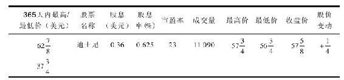

这块狭小的版面包含了许多信息：股票的名称，迪士尼，在左起第二栏；在第一栏可以看到两个数字，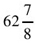和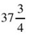，这代表了美元和美元，你会发现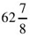美元是过去12个月人们购买迪士尼这只股票支付的最高价，而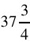美元则是最低价。由此可见，人们购买同一只股票愿意支付的价格区间很大。

事实上，纽约证券交易所平均的股价每年离其基准价的上下浮动大约是57%。更不可思议的是，在纽约证券交易所交易的股票中，平均有1/3的股票每年距离其基准价的上下浮动在50%~100%之间。与此同时，甚至有大约8%的股票股价上下浮动幅度超过了100%。举例来说，一只股票在年初售价12美元，在乐观情绪的引导下上涨到16美元，随后又在悲观情绪的打压下跌到8美元，从8美元到16美元在上下100%的价格区间内变化无常。显而易见，在同一年度，对于同一家公司，投资购买股票的成本千差万别。

你也将注意到股价是以分数而非小数的形式来报价的，因此37.75美元往往表述为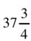美元。这种旧习俗的数字系统要追溯到那些把钱分成8份的古代西班牙人，这也难怪在大盗电影中鹦鹉常常嚷着叫“8份瑞尔”（指西班牙古银币）。

华尔街沿用了这种在计算中使用八分之几的习俗，因此人们习惯于说某某股票上涨了“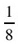点”、“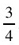点”，而不会说它今天上涨了“一角”、“二角五分”之类的话。在华尔街，“点”（point）指的是“美元”（dollar）。

从右边最后四栏中的“最高价”，“最低价”，“收盘价”和“股价变动”你能了解昨日交易的概况。在昨天这个特定的交易时段，人们为迪士尼支付的最高价格是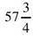美元，最低为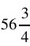美元，当天最后一笔交易的价格为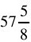美元。（这个价格就是人们在报纸上搜寻的收盘价。）迪士尼股票比前一天收盘价上涨了0.25美元，所以在“股价变动”栏中显示的是+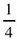。

“股票名称”右侧一栏是“股息”。股息是上市公司对于购买其股票的人们的一种回报方式，有些公司支付巨额股息，有些支付得较少，而有些则不予支付。稍后将有更多关于股息的内容。

数字0.36在此是指“三角六分”，这是迪士尼目前的年息水平，即你持有的每一股股票可以得到三角六分。

在“股息率”一栏中，你能得到更多关于股息的信息，因此你可将其与储蓄账户或是债券的回报率进行对比。这里的股息率是将迪士尼当年支付的三角六分股息除以其收盘价得到的，其结果是0.625%，也就是说，如果你以现价投资迪士尼，你能得到的资金回报率是0.625%。

与如今储蓄账户支付的3%的收益率相比，0.625%的回报率是相当低的。但是，投资迪士尼的股票不仅仅是为了获得股息。

在“股息率”一栏的右边是“市盈率”，“市盈率”是“股价-收益比率”的缩写。市盈率是用股票价格除以公司股份年收益而得到的比率。投资者不需要自己计算，因为它能在每天的报纸上查到。

当人们考虑是否要购买一家特定公司的股票时，市盈率可以帮他们判断其买入价格便宜与否。市盈率因行业而变，而在一定程度上也因公司而不同。所以，最简单的方法就是用一个公司现在的市盈率与其以前的市盈率进行比较。

在如今的市场中，股票平均的市盈率是16，可见迪士尼23倍的市盈率显得比平均股价水平贵了一些。但是，考虑到迪士尼的市盈率在过去15年里在12~40之间变动，因此，其23倍的市盈率并没有超出历史的估值区间，它之所以比平均股价要贵，还是因为公司业绩较为突出。

最后一栏是“成交量”：这是指在昨天的交易时段里，股票在交易所买卖的数量（即交易成交的手数）。由于1手是指100股，所以你要将这个数字乘以100，因此，成交量为11090，表明110万股迪士尼股票在昨天换手。尽管成交数量对于普通投资者并不重要，但它让你意识到股市是一个非常忙碌的场所。

如果把三大交易所（纽约证券交易所、美国证券交易所和纳斯达克市场）的成交量相加，其日均交易量可以高达5亿股。

由于有了家用电脑和电子行情报价系统，人们不再需要看到第二天的报纸才能查询他们的股票。在一天中，为了获知股价，他们可以观看电视频道，也可以登录电脑系统，或是拨打800电话查询，甚至可以利用连通通信卫星的手提式网络接收装置。投资者可以随身携带一些电子设备，随时随地（如在漂流、航海或是登山的时候）查询股票行情。

这些技术都有一个弊端，那就是导致人们过于专注股价每日的变动。如此一来，股价涨跌无序，心情也就起伏不定，真是有百害而无一利。如果你是个长线的投资者，那么，无论迪士尼的股票今天、明天或是下个月是涨是跌，甚至是单边下跌，都不值得你太在意。

## 股东的权利

股票是非常民主的，它们不带任何偏见，也不在乎它们为谁所拥有。黑人或白人，男人或女人，外国人或本国人，道德高尚的人或罪人，都能成为朋友。它不像一个华丽的乡村俱乐部，在加入之前必须通过会员资格审查。如果你想购买一家上市公司的股票并成为它的股东，上市公司无权阻止。而且，一旦你成为股东，它们也永远无法主动让你出局。

即使你只拥有迪士尼公司的一股股票，你也会和拥有其百万股股票的股东一样，享有和他们大致相同的基本权利和特别待遇：你将会被邀请参加在加利福尼亚州的阿纳海姆举办的迪士尼年会。你可以在那里坐在华尔街巨头的旁边，听取迪士尼的最高管理者向你汇报他们的战略发展规划。你也将获得免费的咖啡和油炸面包圈，以及获得对公司里的重要事件做出投票表决的机会（例如谁将成为迪士尼董事会的成员）。

以下是一些例子，免费赠品、商品，等等，某些公司的股东因拥有股票而收到红利。

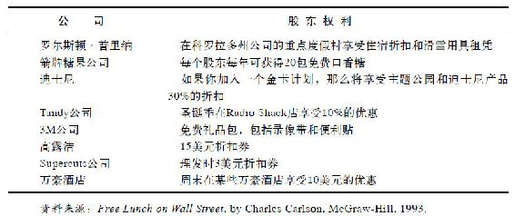

这些董事既不是迪士尼的雇员，也不用直接向公司的老板汇报。他们制定战略决策，并且监督着公司高层的所作所为。从根本上来说，公司的存在是为了股东们，而董事则代表了股东们的利益。

在选举中，上市公司使用的是一股股票一张选票的系统。因此，如果你只拥有迪士尼的一股股票，你的这一张选票与那些可以投上百万张选票的股东相比是无足轻重的，毕竟他们拥有上百万股股票。然而，公司对待每一张选票都是十分严肃的，由于它们意识到大多数的股东不能为了参加年会而打断自己的生活旅行前来参与那些重要事情的决策，因此他们会发放缺席选举人选票。如果你忘了填写，他们会及时给予提醒。

无论何时何地，如果你不再喜欢公司的管理、政策或是发展方向，你总是能够自如地行使你最终的否决选票，并卖出你所持有的股票。

一年中，你将会收到四次上市公司的业绩单，告诉你公司目前的运营情况、销售状况以及最后一季度的盈利和亏损情况。一年一次，公司还会给你寄来非常详细的综合年报，大多数的年报都会使用特别的纸张影印，还附带好几页的照片，稍不留意，你很容易把它们与那些质优价高的杂志混淆起来。

在年报的前几页，公司领导会对公司年内重大项目予以说明，但真实的情况往往隐含在财务数字中。除非你受过专门的训练来理解这些数字，否则你一定会因疑惑和枯燥而倍感沮丧。你可以通过接受一些良好的会计课程培训来获得必要的训练。一旦你这样做了，那些枯燥的数字确实会变得非常激动人心，这种训练比学习译解密码更加令人激动，而且可以使你成为一个出色的投资者。

法规要求上市公司必须向所有股东派发年报，公司不得以任何理由漏写漏派年报。它们也不能取消股东年会，或是编造些借口不通知某个股东参加年会。它们更不能隐藏事实真相，不管这些事实有多么令人不快。不论好坏，它们必须报告所有的事项，确保每个股票的所有者都能确切地知道发生了什么事。

举例来说，假使装配线产生了混乱、产品卖不出去、公司面临亏损、执行总裁携款潜逃或是某些客户对公司提出了令人厌恶的诉讼，上市公司都必须如实地告诉所有的股东。

在政治领域，选举官员和候选人夸大事实来支持他们的观点是司空见惯的做法。即使政客歪曲了事实，我们说这就是政治。但是，当一个上市公司歪曲了事实，那就是华尔街的丑闻。

那些故意误导股东的上市公司（这是很少发生的情况）将面临严厉的惩罚，而且那些犯罪者会被处以罚款甚至监禁。即使是那些因为无心之失（这是比较经常发生的情况）而误导了股东的公司，也会在股市中得到惩罚。一旦股东们意识到公司没有告诉他们所有的事实，那些一流的投资者就会立即卖出他们的股票。丑闻散播开来后，公司股价一日之内腰斩一半也不足为奇。

如果公司股票的价值日损一半，那么，公司大大小小的股东以及从执行总裁到普通员工的公司内部人员都会受到影响。因此，即使只是为了自身的利益，他们也会确保公司如实地披露事实而不夸大事实。他们知道，公司在几百个甚至是上千个股东的注视下，事实迟早会被公开的。如果一个棒球运动员的“粉丝们”每天都在关注着他的个人成绩表，并且知道他的成绩是击打.220，那么，他就不能吹牛说他平均可以击打.320。华尔街的游戏规则与此同理，如果公司的收入平平的话，一个上市公司不能吹牛说它的收入打破了记录，毕竟有太多的投资者正在密切地注意着。

## 投资的目的在于获利

公司经营只为了一个简单的理由——获利。无论它们是公有制或是私有制，被单一股东控股或是为一百万个股东所有，它们想要获取利润这个目标都是相同的。

支付完所有账单后所留下的那些钱，就是所谓的利润。它能在任何生意往来的所有者中进行分配，不管它是通用电气、百事可乐、美国漫画出版社（Marvel Comics）或是清洗你那辆周末曾在路上飞驰过的汽车的洗车场。如果你不打算获利，你就不会愿意拿着水桶和一块沾满肥皂的海绵站在烈日下帮人洗车，可能你很享受洗车的感觉，因为每一次你都能用水管迅速地淋湿自己，在夏天让自己保持凉爽，但那并不意味着你就会免费劳动。

对于公司的股东来说也同样如此。他们购买公司的股票，不是仅仅为了被邀请去参加年会的那点乐趣，或是为收到一份寄给他们的公司年报副本。他们之所以会购买该公司的股票就是希望公司能盈利，并且迟早会把一些利润分配给他们。

为富不仁的错误观念仍然广为流传：那些为了获利而做事的人通常被认为是贪婪和卑鄙的，他们总是尽可能地从世上赚取快钱，而当一个人赚取大笔财富时，他必定是以造成大多数其他人的损失为代价。

虽然拥护这种观点的人正在日渐减少，但现在这种想法仍然隐存于许多人的心中。有人有所得就有人有所失，这是共产主义基本的观点，这种观点也曾经在校园或中盛行，他们从不错过任何一个机会去谴责那些先己后人、把自己的财富建立在工薪阶层痛苦之上的资本家们。

在此之前，我们提到过亚当·斯密的《国富论》，这本著作在200年后仍广为流行。你可能想对此进行抨击，但只要我们是资本主义并具有逐利性，亚当·斯密的“看不见的手”理论就会引导资金流向最能盈利的地方。

个人电脑的发明应用，就是近期能够验证“看不见的手”理论的一个真实例子。电脑发明之后，人们逐渐被它吸引，相关的新公司相继成立，随后大批投资者排队竞相购买电脑公司的股票，从而投入数十亿美元进入电脑行业。其结果是促使物美价廉的电脑更快地面世，激烈的竞争促使各种成本下降。与此同时，残酷的竞争使许多电脑厂家惨遭淘汰，也使生存下来的企业能够生产更加物美价廉的产品。

物竞天择、适者生存的道理不只存在于动物世界，也同样存在于资本市场。经营管理好、盈利能力强的企业能在股市中得到回报，因为企业如果经营业绩优良，股价自然就会随之上升，这样一来，企业的管理者和员工以及其他持股投资者就会坚定持股信心。

如果企业管理较差，结果自然不容乐观，它的股价自然就会不断下跌，所以糟糕的管理就会得到市场的惩罚。股价的下跌会使投资者愤怒，甚至迫使公司董事会解雇那些糟糕的管理人员，或是采取一些其他手段来保持公司的盈利能力。

总之，盈利能力强的公司较之盈利能力弱的公司更能够吸引更多的资本投资。仅靠更多的资金投入，盈利能力强的公司能够获得更多的资源去扩张和成长。而盈利能力较弱的公司将会遭遇融资困难，在缺乏资本供给的情况下慢慢消亡。

公司经营必定出现优胜劣汰，这说明没有多余的资金会被浪费投资于盈利差的公司，随着业内盈利能力最差者的退出，资金会流向那些能够更好地利用资金的公司。

所有的员工都应该树立以盈利为导向的观念，因为一旦他们工作的公司不能盈利，员工将很快失业。利润是业绩的标志，它意味着公司的产品物有所值，能够创造利润的公司总是被激励不断地去重复它们的成功，并扩展到更大的领域，进而意味着公司创造了更多的就业和更多的利润。

如果资本家和投资人都是自私自利和贪婪的，只是想着如何充实自己的腰包，那么富甲天下的美国又为什么最乐于做慈善事业呢？美国是世界上捐款最多的国家，而且其中个人捐款占据了大部分。以1994年为例，美国居民自掏腰包捐款1050亿美元去帮助那些无家可归的弱者、失业的年长者、医院、教堂、博物馆、学校以及退伍老兵，并捐款给联合劝募协会（United Way）和杰瑞儿童收容院（Jerry's Kids）等公益事业。

资本主义并非一个零和博弈，除了一些无赖骗子，大多数有钱人不愿把财富建立在他人的贫穷之上。如果富人越来越富有，果真会使穷人越来越穷困，那么我们作为世界上最富有的国家，将理所当然地产生出世上最穷困潦倒的人，然而，事实却恰恰相反。

美国的确也有相当数量的穷人，但其贫穷程度却不像你在印度、拉丁美洲、非洲、亚洲或东欧等资本主义早期发展阶段国家所看到的那样严重。当公司获得成功并变得更具盈利性，这就意味着这个国家将有更多的工作机会和越来越少的贫穷，这种情形与政客所言刚好相反。

## 股价高低取决于盈利增长

每个股东都希望上市公司有所增长，这种增长不是指公司因为变得太大而不得不搬到一个更大的办公楼，尽管搬到更大的办公楼也是一种增长的表现。这里的增长意味着利润的增长，也就是说，公司今年要比去年赚得更多。当投资者谈论“增长”时，他们不是在谈论规模，而是在谈论利润，也就是收入。

如果你洗了3辆车，每辆收费6美元，而你所花的成本是2美元的洗涤剂和1美元的海绵，那么，你赚了15美元（18美元洗车收入减去3美元的原料）。如果用同样的洗涤剂和海绵再洗5辆车，你将在不增加原料成本的情况下再赚30美元。你的总收入也就变成了最初的3倍，那就意味着你的钱袋更加充实，因此你可以买CD、电影票、新衣服或是更多的股票。

如果一家公司在12个月里收入翻倍，华尔街就会为此狂欢，毕竟这么快速的增长实属罕见。通常大的上市公司乐于见到自己的收入一年增长10%~15%，而年轻有为的上市公司也许能够增长25%~30%。但无论如何，股东寻求的焦点就是收入的增长。这是股东所寻求的目的，也是促使股价上升的因素。

照此逻辑，假定你有个朋友准备组建一个摇滚乐队，他需要资金购买一些乐器。他给你以下的提议：如果你提供1000美元购买高倍扩音器，他将给你10%乐队的股份。你们俩为此签订了协议。

在乐队为其赢得喝彩声之前，看起来你做了一次愚蠢的投资。你花了1000美元取得一个乐队10%的股份，而其仅有的固定资产便是你购买的扩音器，也就是说，你得到的其实只是你购买的扩音器的10%的所有权。但是，如果这个摇滚组合以一周200美元被当地一家俱乐部雇用，在周五晚上的舞会上表演，那么，现在这个乐队的价值就超过了那个扩音器。因为它由此产生了收益，而你那10%的股份将会得到一周20美元的收入。

随后，如果这个乐队变得小有名气，其报酬上升到每周400美元，收入翻番。那么，一下子你的收入就变成了一周40美元。

如此看来，你所持有的一纸合约已经不再是一文不值。如果你愿意，或许你可以加价转让。但如果你对这家摇滚组合有信心，你会持有你的股份。因为或许有一天，乐队可以打破记录并登陆MTV，成为下一个像Pearl Jam乐队一样赫赫有名的乐队。若果真如此，你将一周从中赚几千美元，而你那10%的股份的价值将远远超越你当初的梦想。

那些购买迪士尼、锐步或是任何其他上市公司股票的人们，他们的投资动机和你投资一个摇滚乐队是一样的。他们指望着迪士尼、锐步等公司收入增加，同时他们期望这些增加的收入中的一部分能以更高股价的形式返还给他们。

股价和公司收益能力一般都会直接挂钩，而这点却常常被人忽视，甚至包括一些精明的投资者。行情观测者认为股票本身也具有生命力，他们追踪股价的涨跌，就像鸟类观测者追踪一只扑腾着的鸭子一样。他们研究各种交易类型，绘制股价运动的图表，对于他们持有的股票，尤其关注跟踪公司收益变化将会带来怎样的市场反应。

如果公司的收益持续增长，通常股价理应上涨，即使没有立竿见影，但最终必将上涨。如果公司收益下降，股价下降也将毫无悬念。因为收益下降使得一个公司的价值降低，这就如同一个失去观众而停止销售唱片的摇滚乐队一样。

对于一个成功的选股策略而言，首先要做的就是找到那些在将来许多年收入能持续增长的上市公司。长期来看，美股股价每年平均递增8%是司空见惯的事，原因在于许多上市公司的收入一般都能以年均8%的速度增长，而且它们还在支付3%的股息。

基于这些假设，在根据你的自身喜好投资一些具有代表性的公司时，也有可能找到一些收益增长更快的公司。但总的来说，大多数公司的收入将以年均8%的速度增长，并且还会支付你3%作为股息，这样的话你的年回报将到达11%。

股价高低与定价是否合理并无直接关系。你也许会听到人们说：“我不会买IBM的股票因为它要100美元一股，太贵了。”其实，或许只是他们没钱以每股100美元的价格买IBM。实际上，一股100美元的价格和IBM股票是否过贵没有关系。一辆150000美元的兰博基尼（Lamborghini）超出了大多数人的承受能力，但对于兰博基尼本身来说，这个价位也许并不昂贵。同样，每股100美元的IBM股票也许很便宜，也许很昂贵，这取决于IBM的收益水平。

如果IBM今年每股收益为10美元，那么，当你以每股100美元购买时，你付出了10倍于每股收益的成本，换言之，市盈率为10，意味着其现在的市场价很便宜。假定另一种情形，如果IBM的每股收益仅为1美元，那么，当你以每股100美元购买股票的时候，你已经支付了相当于其每股收益100倍的成本，也就是说，市盈率为100，如此来看你买得太贵了。

如果你对选择股票持谨慎态度，那么，市盈率是一个复杂的课题，值得进一步研究。既然我们现在涉及这个课题，在此不妨介绍一些关于市盈率的要点。

如果选取足够数量的上市公司，将它们的股价相加，然后除以它们的每股年度收益之和，就会得到一个平均的市盈率。在华尔街，人们对于道琼斯工业股票、标准普尔500股票以及其他相似的指数，也是这样计算平均市盈率水平的，最终得到所谓的“市场倍数”或是“市场交易的平均市盈率”。

由此可见，市场倍数是一个很有价值的参照标准，因为它告诉你投资者此时此刻愿为公司的收入所支付的平均水平。市场倍数时升时降，但通常稳定在10~20倍的区间内，股市在1995年中期的平均市盈率为16倍，看起来既不昂贵也不便宜。

一般来说，一家公司收入增长得越快，投资者为其收益甘愿付出的就越多。这也就是一些新兴成长企业市盈率达到20倍甚至更高的原因，人们期望能从这些公司得到更多，也就愿意支付更高的价格拥有它们的股票。老牌公司的市盈率仅15倍左右，相对于其每股收益，它们的股票价格比较便宜，因为这些公司毕竟发展缓慢，不再令人充满期待。

有些公司的每股收益会稳定地增长，它们是成长型的上市公司。另一些公司的每股收益则是起伏不定，盈亏变化莫测，汽车、钢铁、重工业企业就是这类公司，它们都是周期性的上市公司。由于周期性的公司经营业绩时好时坏，不太稳定，所以，它们的市盈率往往要比成长型公司的市盈率更低，它们仅能在特定的经济环境下才有良好的市场表现。周期性公司的收入水平取决于整体经济状况的好坏，因此很难预测。

一个上市公司赚了很多钱，这并不意味着股东必将因此获益。随后，需要重点关注的问题是：上市公司会如何利用这些钱？上市公司通常会做出以下四种选择。

第一种选择是把这些钱用于有效的再投资。公司可以利用这些资金开设新店或是新建工厂，这样能使公司收益比增长更快。长期来说，这样有助于提高股东收益。比如，一家快速增长的公司能够善用所有资金，进而产生20%的回报，显然远远超过你我把钱存入银行所能赚到的利息。

第二种选择是妄加浪费，比如，用于购置公司飞机、柚木雕刻的办公家具、大理石行政卫浴，用于翻番提高高管的薪酬，或是高价收购其他公司（有些完全没必要的收购对股东是不利的，而且错失了本来很好的投资机会）。

第三种选择是到股票市场回购它的股票，并且注销这些股票。为什么上市公司要这么做呢？因为随着市场上股票数量的减少，剩余股票就变得更有价值了。股票回购对于股东来说非常好，特别是如果一家公司正以低价回购它的股票。

最后一种选择是，上市公司可以用这些钱支付股息。大多数上市公司都选择这么做。支付股息不全是好的信号，毕竟公司支付了股息后，也就放弃了将其用于投资增值的机会。当然，如果没有更好的投资机会，支付股息对于股东来说也是很有益处的。

支付股息是上市公司对你持有其股票给予有偿报酬的一种方式。这些钱会定期直接支付给你，这是上述四种方式中，公司的利润直接让你落袋为安的唯一方式。如果你持有股票的目的在于获取收益，那么收到股息就能如愿以偿。否则，你也可以用股息购买更多的股票。

股息同时也有一种心理优势。在熊市或是调整市道中，无论股价如何变动，你仍然在获得股息，这种额外的收获必将增强你的持股信心。

数以百万计的投资者偏好购买支付股息的股票，而不是选择其他类型的股票。如果你对这种投资方式感兴趣，你可以联系穆迪的投资者服务部门，穆迪是一家华尔街的研究公司，长期以来，穆迪将那些支付股息的公司整理成册。从中我们发现，有一家公司已经一直支付股息长达50年之久，同时还有超过300多家公司10年内一直在支付股息。

在穆迪编辑的《上市公司股利手册》（Handbook of Dividend Achievers）上，我们可以方便地查到这些公司的名册，其中还有一份对于有支付股息习惯的公司的完整统计纲要。

## 寻找能够暴涨12倍的股票

决定投资一只股票，必须了解它的经营背景。投资者往往对此知之甚少，所以，常常陷入困惑。他们买入一只股票，但却不了解它，只是跟踪它的股价，原因在于这是他们唯一掌握的细节。当股价上涨的时候，他们就认为公司情况良好。一旦股价停滞不前或是下降，他们就变得懊恼或失去信心，因此就卖出所持有的股票。

将股价和股票的实质混为一谈，这是一个投资者所犯的最大错误。它使得人们在股价调整和大跌的时候将股票抛售，当股价在最低位时，他们认为其所投资的公司一定经营得糟糕透顶，实际情况可能是公司仍然运营良好，这也使得他们错失了在低位买入更多股票的机会。

了解公司的经营背景，可以把握公司内部发生的情况，预估在将来如何盈利或是损失。当然，要做到这一点并非易事，有些经营情况的确复杂难辨，譬如，那些分支机构繁杂的公司要比那些生产单一产品的公司更难分析追踪。即使有些公司经营背景很简单，我们也不能轻率定论。

有时，公司的经营背景变得日渐清晰，一般投资者也能洞察得到，从而相信上市公司能够真正给予投资回报。在此，让我们考察两个不同时期的例子：1987年时的耐克公司和1994年时的强生公司。

耐克公司是一家简单的企业，它主要生产运动鞋，兼营快餐以及专业零售，这样的企业任何人都能跟踪分析。在此，我们只需跟踪分析三个核心的要素：第一，耐克公司今年和去年相比是否销售了更多的运动鞋？第二，销售运动鞋是否盈利丰厚？第三，预估明年以及之后的年份销售量能否与日俱增？通过分析1987年的股东季报和年报，我们可以找到一些确切的答案。

自从1980年上市以来，耐克的股票一直处于上下波动中。它从1984年的5美元涨到1986年的10美元，随后降到5美元，又在1987年涨到10美元。分析耐克公司的经营背景，可以发现运动鞋的发展前景无可限量：无论是蹒跚学步的娃娃，还是青少年，甚至是那些小时候没穿过运动鞋的大人，人人都爱穿运动鞋，而且运动鞋还有各种各样的，网球鞋、跑步鞋、篮球鞋等。显而易见，运动鞋的需求一直在增长，而耐克公司又是一个大的供应商。

然而，从短期来看，由于公司现有销售、收入以及将来销售均开始下滑，公司经营显而易见遭遇了困难。当股东收到1987年第一季度报告时，那是个非常令人沮丧的时刻。（就像很多公司的传统一样，耐克公司的会计年度开始于每年的6月份，因此，1987财年第一季度实际截止到1986年8月。）如果你持有耐克股票，你会在1986年10月初的公司信件中得知，公司销售下降了22%，收入下降了38%，并且将来的订单即将下滑39%。这显然不是购买更多耐克公司股票的好时机。

第二季度报告发布于1987年1月6日，结果和第一季度一样糟糕，而第三季度的情况也差强人意。接着跟踪分析，我们欣喜地发现，在和年报一同发布的、1987年7月末的第四季度报告中，有了一些积极的信号：销售仍然下滑，但仅下滑了3%；收入仍然下降，但将来订单增加了。这就意味着世界各地的经销商正在采购更多的耐克运动鞋，通常来说，只有经销商销售信心增加，它们才会增加采购。

通过阅读当年的公司年报，你还会发现，尽管公司连续几个季度收入下降，但耐克公司仍旧盈利不菲。那是因为生产运动鞋的成本相当低，它不同于需要建造和维护昂贵工厂的钢铁产业。在运动鞋行业中，需要的只是一个大的厂房、一些缝纫机器和相对便宜的原料。耐克公司还拥有充足的现金，财务状况良好。

当你翻开发布于1987年9月末的1988财年第一季度报告时，你也许不敢相信自己的眼睛：销售上升10%，收入增长68%，并且将来订单增加61%。由此可见，耐克公司转入了良性循环，事实上，这样好的周期持续了5年，因为耐克其后连续20个季度销售和收入都在增加。

在1987年9月的时候，你不会知道随后连续20个季度的情况。你只是欣喜于公司已经扭亏为盈，但你不会立刻购买更多的股票，因为你会对已经从7美元迅速上涨到12.50美元的股价有些顾虑。

因此，你会等待公司将来的发展，而这一次你是幸运的。股价在1987年10月的股市崩盘中大跌，那些罔顾公司经营实质背景的投资者正在抛售手中的所有股票，当然也包括耐克的股票。因为他们相信晚间新闻的评论员的预测：一个世界范围的金融市场崩溃即将来临。

在这种混乱局面中，你保持了清醒的头脑，因为你意识到耐克的情况正在好转。这样的崩盘给了你一份大礼：一个在低位买入耐克股票的机会。

耐克的股价在股市崩盘后下跌至7美元，并在那个价位上盘整了8天，因此，你有充足的时间打电话给你的经纪人，从而买入耐克股票。持股到1992年末，耐克的股价是你在1987年买入时的12倍多，这就是你找到的能够暴涨12倍的股票。

即使你错过在大跌后以7美元买入耐克公司股票的机会，你仍可以在随后的3个月、6个月或是1年后的每次收到季报时购买耐克的股票。虽然不能使你的资金变成原先的12倍，但你仍然能够实现10倍、8倍或是6倍的投资回报。

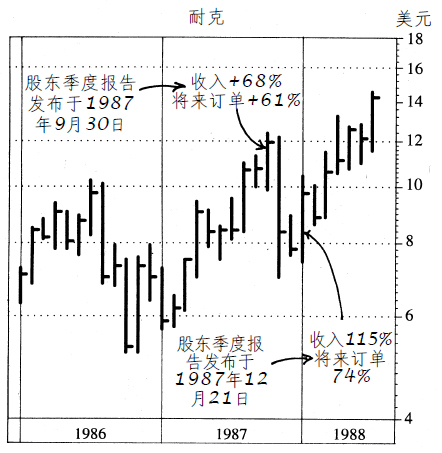

耐克公司股价K线图（1986~1988年）

注：1990年耐克股价达到40美元；1992年耐克股价达到90美元。

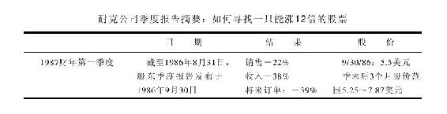

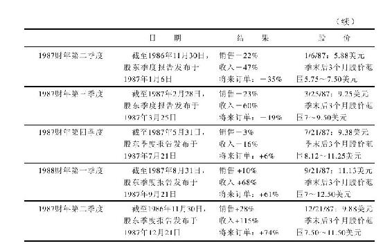

## 解读美国强生公司

任何投资者都可以参照的另一个明了的例子是美国强生公司。林奇也同样注意到这家公司，而这不用依靠什么特别的才能便能做到。只须翻阅强生公司1993年的年报，你可能也会得出同样的结论：投资这家公司。

关于1993年的年报，强生公司是在1994年3月10日公布的。第一眼你就能在年报的页面上发现过去两年中强生股票的悲惨命运。股价从1991年底的57美元缓跌到年报发布时的39.63美元。

你一定怀疑是哪里出了问题，因为对于处在市场上升周期的这样一家大公司却创造了这样一个糟糕的股价。通过浏览年报，你希望找出那些导致股价下跌的利空消息，但每处你所看到的都是利好，大多数这些消息都被记录在年报第42页。公司的收益在过去10年间呈直线稳步上涨了4倍，销售状况也同样呈现稳定增长。

强生同时提到，公司连续10年提升了分红。但更令人不可思议的一点是：公司其实已经连续32年提高了分红，这可能是因为美国强生公司希望尽量保持低调罢了。

同样在年报第42页，你能发现近几年强生公司变得更具生产能力。在1983年，强生公司仅靠77400个员工创造了60亿美元的产值，而在1993年，依靠81600个员工，公司生产并销售了140亿美元的商品。可以看到，公司仅仅靠增加4200名员工就创造了多出一倍的产值。1989~1993年，销售额从97亿美元增加至140亿美元，而员工的数量却在下降。

这告诉我们，强生公司开始变得高效并善于缩减成本。公司的员工能更有效地利用他们的时间，并能为公司、股东（尽管你不能在股价中直接看到）和他们自己创造更大的价值。许多员工持有公司股份，即使是那些没有持股的员工，也会因为销售额上升和利润的增加而得到更多收入。

在年报的第25页和第42页中，你能发现强生公司在1993年回购了300万股公司股份，在10年间共回购了1.1亿股。强生用数以亿计的美元铸就了这样的成功。当一家公司把它的股份从股市中撤出，投资者们很可能从中获利，因为更小的股本意味着更多的每股收益，而这会使得股价变得更高。看着强生的股价，你不会想到这是由于公司进行股份回购而促成的。

强生公司年报在第29页的公司资产负债表中显示，公司有超过9亿美元的现金和有价证券，并且公司的权益总额价值55亿美元。强生有15亿美元的长期负债，这对有55亿美元权益资本的公司来说是较为适宜的。因为有了这样的金融资本，强生公司将不会面临破产的风险。

此刻，你可能正诧异这个故事的问题出在哪里？强生是否可能还没有为自己的将来做好准备。年报封面的标题揭示了一些不同方面，上面用大字写着“依靠新产品促进成长”。细节方面在文中提到，在1993年，公司34%的销售额受益于过去5年中对市场的产品推销。

在第42页上，你能发现在1993年，强生公司花费超过10亿美元用于研发，这占据了销售额的8%。并且研发的预算在10年中超过了原先的2倍。显然，公司遵从标题上所写的那样，开发新产品，做到没有任何偏差。

在更大的范畴内进一步思考这个故事，我们来比较一下强生的股价和公司收益。1993年公司被预测的每股收益为3.1美元，1995年为3.6美元，并分别给予12倍和11倍的市盈率。未来的收益总是很难预测，但强生公司的每股收益在过去总是很容易被预测到。所以，如果这些预估被证明是正确的，那么公司的股票显然很便宜。

在1995年，市场股价的平均市盈率为16倍，而强生股价估值却仅为11倍市盈率。可见，强生公司的估值明显优于市场平均水平。这是个了不起的公司，各项指标都很出色，不断上升的收益和销售额，还有光明的前景。但尽管如此，股价还是跌到39美元左右，并且在年报公布的几周里股价更是跌到了36美元。

确实难以置信，但你很自然得到一个结论：股价的下跌与强生公司本身毫无关系。公司没有任何问题，究其原因是投资者对“健康护理的恐慌”问题的担忧。在1993年，美国国会讨论了各种健康护理的改革方案，其中包括克林顿政府的提案。投资者们担心，一旦克林顿政府的提案通过并立法，健康护理行业的公司会因此遭殃。因此，投资者大量抛售强生公司及其他健康护理行业的股票。整个行业在此期间遭受重创。

如果克林顿政府的方案通过，整个健康护理行业将会遭受打击。但强生公司遭受的影响却小于那些典型的健康护理公司。在年报的第41页，你能发现强生公司超过50%的利润来源于国际业务，而克林顿政府的提案对这些业务几乎毫无影响。并且在第26页上你还能发现公司20%的利润源于香波、急救绑带和其他与药品无关的消费产品，而药品类产品才是克林顿提案改革的重心。不管怎样，民众所担心的那些利空事件对强生公司影响有限。

阅读强生的年报不超过20分钟，就能决定在39.63美元左右买入强生公司股票是10年间最好的交易之一。强生公司的故事并不深奥，即使你不是全职专业投资者，也不是一个哈佛商学院毕业的高材生，你也一样能够发现其中的机会。

公司的股价在下跌，而公司的基本面在改进，这是一个显而易见的购买信号。如同耐克的案例，你也不必急匆匆地去购买股票。1993年年底，彼得·林奇在《今日美国》杂志中撰文推荐强生公司，此时股价是44.88美元。在1994年春，路易斯·鲁吉斯（Louis Rukeyser）在《华尔街周刊》上再次推荐强生，而那时股价比1993年下跌了7美元，为每股37美元。

事实上，7美元的下跌丝毫没有影响彼得·林奇。最新季报告诉他，公司的销售和收益正在上升，因此，故事会向更好的方向继续发展。在更低的价位买入更多的强生公司股份是一个完美的机遇。

在1994年仲夏，彼得·林奇又再次公开推荐强生公司的股票。公司股价已经迅速升至44美元，但与其收益相比仍然低估。而到1995年10月，股价在18个月内翻倍并超过了80美元。

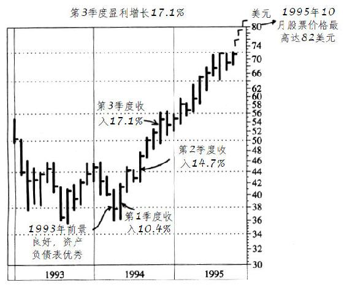

强生公司股价K线图（1993~1995年）

[^1]: 本书机械工业出版社已出版。
