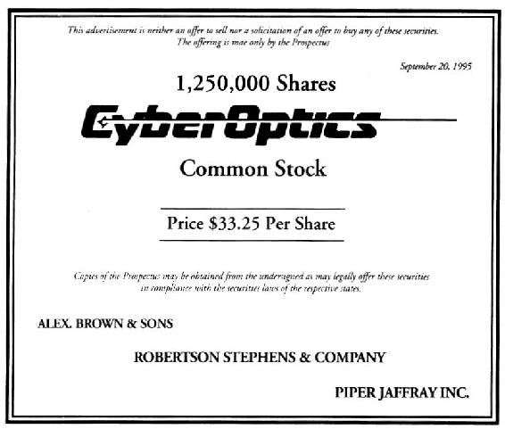
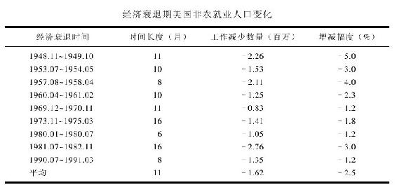
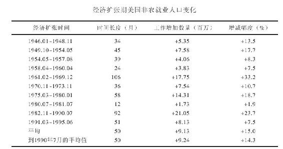

# 第3章　上市公司的生命周期

## 上市公司的诞生

上市公司诞生的故事往往是这样演绎的：有人突发奇想发明了一种产品，这个人不一定是一个重要人物，也不必是一个博士，甚至不一定是一个大学毕业生，他可能只是一个在中学或大学中途辍学的学生。苹果电脑就是由两个大学中途辍学的家伙创立的。

令人不可思议的是，有许多数十亿美元经营规模的大型企业都是从厨房或车库里起步的。“美体小铺”就是从安妮塔·罗迪克家的车库开始的。她是一个英国家庭主妇，在先生出差期间她想找些事情来做，就自己制作了些乳液售卖，结果却开创了一个在世界各地有900多家分店的护肤品王国。

第一台惠普电脑是在戴维·帕卡德的车库里制造出来的；而第一台苹果电脑则是史蒂夫·乔布斯在他父母的车库里造出来的。由此看来，为了激励更多的创新发明，似乎多盖几座车库必不可少。

我们不妨更进一步来了解苹果电脑的发展历史。苹果电脑创立于美国独立建国200周年之后的1976年，现有11300名员工，每年在世界各地销售价值50亿美元的电脑。然而，如果1976年没有美国加州两个年轻小伙子敏锐的眼光，世界上将没有“苹果电脑”这个品牌。

苹果电脑的创始人一个是乔布斯，另一个是他的好友史蒂夫·沃兹尼亚克（Steve Wozniak）。乔布斯在当年只有21岁，沃兹尼亚克26岁，他们就像创立“本杰瑞”冰淇淋的本·科恩（Ben Cohen）一样，都是在大学中途辍学的学生，他们三个都很早就离校创业，却在35岁之前就成为百万富翁。

列举这个例子并不是提倡你要中途辍学，期待什么奇迹发生。他们三个人都已学会读书、写字及算术，而其中的两个史蒂夫早就很懂电脑了，他们之所以辍学，并不是为了能够晚点起床或到外面鬼混，而是夜以继日专注于研究连接器、线路及电路板。

沃兹尼亚克是最早的“黑客”之一，他是一位能在家里用组装设备突破安全保护、侵入政府或公司资料库中，从而制造一场大混乱的电脑高手。他更具建设性的构想是希望能够设计一种简单的家用电脑，可以让所有对电脑一无所知的人，能够轻易地学会使用。要知道，在当年可是有99.9%的人对电脑一无所知。

沃兹尼亚克和乔布斯在乔布斯家的车库中成立了一个工作室，他们将一些普通的电脑零件组装在一个塑胶盒子里，称之为Apple I。他们两个对这种产品很感兴趣，决定卖掉他们仅有的破旧的厢型车和两台计算机来筹款创业。

他们总共筹款1300美元，1976年时这笔钱可以让他们制造50多台苹果电脑。他们再把这些电脑卖掉，所赚的钱用来改良旧机型，然后再卖出几百台电脑。

创业之初，他们自筹资金支持自己的发明创造。资金用完后，他们就典当珠宝、卖掉二手车，甚至将房子抵押给银行申请贷款，无论如何他们要将自己的事业进行到底。

冒着失去房子、所有有偿物品和毕生积蓄的风险，为的就是要从自家的后院起步创立一个成功的企业，这就像早期的拓荒者，凭着自己的胆识到人迹罕至的地方去闯荡，他们要的不是安稳的薪水，而是那种开创事业的成就感。为此，他们不仅要投入所有的积蓄，而且要投入大量的时间和精力。

值得庆幸的是，他们没有遭遇特别的挫折或过早用完自有资金，公司的产品和规模就粗见雏形，并请管理顾问帮忙撰写详细的商业发展计划。这个时候，公司发展令人激动，但需要加大投入，此时需要有“天使投资人”解囊相助才行。

这些天使投资人可能是一个富有的叔叔、伯伯、远房表兄，或是一个有钱且愿意长期投资的朋友。他们这么做并不是大发善心，主要是冲着这个商业计划的成功前景前来投资的，而且通常要求占有相当比例的股份。

由此可见，提出原始创意的人如果想要成功，不太可能自私地拥有百分之百的股权，而不需要别人帮助。随着商业计划进一步推进到生产阶段后，必须号召更多的投资人投入更多的钱，这些投资人就是所谓的风险资本家（venture capitalist）。

一般来说，风险资本家要等到新产品已经投产或试销已经就绪时，才开始投资，换言之，他们会等到这家新公司已经达到某种程度的成功时才投入资金，以降低投资风险。在参与投资的过程中，他们会敏锐地观察每一个细节，看看商业计划有无缺陷，他们也会考察这家公司的管理人员是否内行，以及当公司规模由小变大时是否具有持续经营的能力。

更为重要的是，风险资本家还会要求拥有股权。到目前为止，我们可以发现一个成立不久的公司已有三类所有人：第一类人是原先投入资金的创始人，第二类是所谓的“贵人”或“天使投资人”，第三类就是那些风险资本家。这时，原先的创始人可能只拥有不到一半的股权，因为公司越大，共享股权的股东人数就越多。

我们回头再看苹果电脑公司的后续发展情况。当时，两个史蒂夫觉得手上的产品已经受到欢迎，就将产品展示给一个擅长行销的退休工程师迈克·马库拉（Mike Markkula）。马库拉曾在两家电脑业巨人（英特尔和仙童公司）那里工作多年，他的年纪与史蒂夫的父亲相差无几。

马库拉本来可以把这两个电脑业余爱好者打发掉，但他慧眼识珠，深信他们的产品前景广阔。因此，他不仅同意替他们撰写企划方案，而且出资25万美元购买了该公司1/3的股权，这使他成为苹果电脑公司的第一个天使投资人。

有的人擅长发明创造，但未必擅长行销、广告、财务或人事管理，但其中的任何一项都深深影响着一个正在起步的公司。马库拉意识到两个史蒂夫需要的不只是他的帮助，所以，他又找了一个有经验的职业经理人迈克·斯科特（Mike Scott）来当苹果电脑公司的总裁。

随后，苹果电脑又从当地最好的广告公司中聘请了一个老练的广告文宣设计者里吉斯·麦肯纳（Regis McKenna），苹果电脑公司的商标就是他设计的。有了这些人来处理有关行销与广告事务，两个史蒂夫开始集中精力专注于改良新产品。

苹果电脑公司首家推出彩色绘图个人电脑，首创用电视屏幕充当电脑屏幕，而且创造性地运用磁盘驱动器代替盒式磁带储存信息。到1977年6月，他们已经卖出价值100万美元的苹果电脑；1978年年底，他们又顺势而为地推出Apple II，使苹果电脑公司成为当时美国增长速度最快的公司之一。

由于销售业绩不断攀升，两个史蒂夫可以在苹果电脑公司的实验室（不再龟缩在车库里面）忙而不乱地研究开发新的苹果电脑。1979年，他们又募集了更多的资金：沃兹尼亚克卖掉一部分股权给资本家法耶兹·索菲尔（Fayez Sarofim），另一个由L.F.罗斯柴尔德（L.F.Rothschild）所领衔的风险资本家们也投资了720万美元。

1980年1月，苹果股票成功上市，第四代苹果电脑也应运而生。苹果电脑公司初创成功、崭露锋芒后再择机上市，这是许多公司成功上市的典型道路。

## 公司上市扬帆起航

上市后，股票市场就可以充分发挥作用。公司已经而且准备全面扩展业务，或者原先只是计划开设一家商店，当这家店成功之后，该公司就计划第二家、第三家店接连开下去。这种野心勃勃的行动，需要更多的资金支持，那些天使投资者与风险资本家已经不能完全满足这种资金需求，这时最好取得资金的方法就是面向公众发行股票。

公司决定公开上市就好比一个人决定参加竞选公职一般，这是一个很重要的决定。一旦做出决定，就得开放自己允许新闻媒体刊登内部信息，并且一举一动接受政府机关的监督。当公司决定从私人企业转变为上市公司时，就好像成为一个政治人物一样，你的私人生活已经不再只属于自己，而是公诸于众。

私人企业何苦要寻求上市，而忍受任由人们百般挑剔的痛苦呢？这是因为，成为上市公司是其募集足够资金以发挥最大潜力的最佳选择。

上市公司有两个重要的生日：一个是创立日，一个是上市日，这个隆重的大事被称为新股上市（initial public offering,IPO）。每年都有数百只股票在承销商的辅助下以公开发行的方式上市交易。

承销商的部分工作是将股票卖给有兴趣的投资人，这个过程称为承销（underwriting）。他们通常会展开一连串的“路演”（road show），去说服潜在的投资人购买股票，这些潜在的投资人会收到一份“公开招股说明书”（prospectus），公开招股说明书会说明该公司的所有状况，其中也包括一些提请投资人注意的不利事项，而且这些风险提示还会用大号红色的字体印刷，所以投资人不能视而不见，将来不应追究公司的风险责任。华尔街俗称这些警告标识为“红鲱鱼”（red herrings）。

在公开招股说明书中，这些承销商一般会预估其发行价格，他们通常选一个价格区间（例如12~16美元），完成路演之后，再根据客户反应确定最后的发行价格。

最后，为了广而告之，承销商会将承销公告刊登在报纸上，因为公告看起来就像碑文，所以有人就戏称其为“墓碑”（tombstone），而在上面显著位置上会标示所谓的“主办承销商”（lead bank）的名字。你可能会很惊讶这些承销商为了争当主办承销商而激烈竞争。

图　3-1　承销公告（墓碑）

在华尔街，“墓碑”这个词具有双重含义：一个人的生命终止于承办殡葬者（undertaker）和墓碑（tombstone），但一个上市公司却是诞生于承销商（underwriter）和承销公告（tombstone）。

不过，普通投资人很难买到新上市的股票，这些新上市的股票通常预留给那些大的投资者，像是那些动辄可以运用百万乃至亿万美元的基金经理人。

苹果电脑公司上市的460万新股，在基金经理人争先恐后的认购下，一个小时以内就销售一空。业余投资者一如既往被排除在外，这个情形在马萨诸塞州更为明显。美国许多州都订有所谓的蓝天法案（blue-sky law）来保护公众免于在不诚实的促销活动中受到伤害，而马萨诸塞州的执法将当时苹果电脑公司的新股上市列为可能是这类的促销活动，实在有点错得离谱。

新股承销活动结束后，上市融资所得各归其主：一部分钱归属于那些举办“路演”活动、促成股票发行的承销商；一部分钱归属于那些卖出部分原始股份的老股东（其中包括公司创始人、“天使投资人”和风险投资家）；剩下的钱则交由公司用来拓展业务。

此时，这个公司开始有了新的股东，也就是那些购买新上市股票的投资者，他们的钱用来支付承销费用、使原股东富裕及帮助公司成长。此后，股票在万众瞩目下开始在交易所公开交易。

1980年12月，苹果电脑公司的股票正式在纳斯达克上市交易。此时，任何人都可以购买这只股票，包括那些原本在承销阶段没能买入股票的投资人。这些新上市股票的股价经常会上涨几天、几周甚至几个月，当新股热潮消退时，股价终究会下跌。苹果电脑公司的股票，在开始上市交易12个月后，股价就从原本上市每股22美元跌到14美元。这为普通投资者提供了低位投资的好机会。这种情形并不常出现，通常发生在当原先购买者抛出大量股票而散户最终接棒之时。

上市公司的创始人并不需要卖掉他们的所有持股，一般来说，他们只会卖掉一小部分持股，而这也就是乔布斯、沃兹尼亚克和马库拉变现的方法。事实上，他们仍保有大部分的股票。在上市第一天后，这些股票就使得他们每个人的净资产价值超过1亿美元，对乔布斯和沃兹尼亚克来说，从4年前的1300美元到现在的1亿美元，实在是收获颇丰（就从马库拉当初的25万美元来看，投资回报率也是令人惊叹）。

看来，只有在资本制度下，自家后院的发明家和中途辍学的学生才有可能创立一个拥有上千员工的公司、缴纳税赋，并使得这个世界更加美好。

新股上市是企业仅有的能够从自己公司股票受益的机会。当你购买一辆克莱斯勒的二手小货车时，并没有为克莱斯勒带来任何好处；如果你在股票市场买一股克莱斯勒的股票，也没有为克莱斯勒带来什么好处。这些股票在私人手中转来转去，就好像二手货车在不同的车主间转来转去一样，所交易的钱只是从一个人转手到另一个人。

只有当你购买一辆新的克莱斯勒货车，克莱斯勒公司才会切实受益。与此同理，只有公司发行新股上市，公司才会从中实际受益。在上市公司的生命历程中，可能只经历一次新股上市，即所谓的新股上市，也有可能经历多次增发新股，即所谓的新股增发（secondaies）。

## 初出茅庐的上市公司

上市初期，上市公司总是充满热情、智慧和希望的。他们拥有远大的理想，但是缺乏丰富的经验。由于通过公开募股已经筹集到必要的资金，因此目前他们并不需要担心资金问题。他们希望在初始募集资金用完之前企业能够有所发展，虽然要实现这一点充满了不确定性。

在上市公司的初创阶段，是否能够最终生存下来总是充满着很多变数。很多不幸的事情都可能发生。譬如虽然你有一个伟大的新产品发明理念，但是在产品最终投产并投入使用之前，你也许已经用完了所有的资金。或者你慢慢发现你的伟大创意并不像你开始想的那么可行。或者，你的公司被人起诉，你盗用了别人的发明，如果法庭裁决你败诉的话，那么，你的公司可能被迫支付高额的赔偿金，而这笔钱可能是你绝对承受不起的。或者，虽然你的伟大发明最终投入生产，但是很不幸却没有通过政府的检测并被禁止在国内销售。或者，其他国家的人发明出了比你这个产品更好的东西，质量性能更佳，价格更加便宜或者二者兼而有之。

在充满激烈竞争的各行各业中，企业之间的竞争是永不停息的。电子行业是一个很好的例子。新加坡的几个天才发明家在实验室里发明出一种性能更佳的继电器开关，并于6个月后在市场上正式推出。对于其他开关制造商而言，这真是极大的噩耗，因为他们的库存产品即将变成无人问津的垃圾。

由此可见，我们很容易理解为什么大约50%的新兴企业都会在五年内消失，为什么绝大部分的倒闭案例都发生在竞争激烈的行业。

由于在企业的发展初期，不确定因素太多，因此为了保护他们的投资，企业的创始股东必须密切关注企业的发展，普通股东也不要买了股票后就掉以轻心。尤其是对于初出茅庐的上市公司，我们必须密切跟踪公司的发展足迹。年轻的上市公司，由于还处在发展的不稳定阶段，因此，只要走错一步，它就有可能倒闭破产。衡量这些企业的财务能力是尤其重要的，通常它们可能遇到的最大问题就是现金枯竭。

人们外出旅行时，通常会带双倍的衣物，却只带上不足实际需要一半的现金。年轻的上市公司也经常犯同样的错误，即起步时的运作资金准备不足。

现在让我们再来看看它们的优点。由于是白手起家，年轻的上市公司通常都会成长得很快。虽然规模较小，但是能够发展的空间却很大。这就是为什么年轻的上市公司能够快速超越中年阶段的上市公司的关键原因，因为后者的快速发展时期通常已经一去不复返了。

## 步入中年的上市公司

公司步入中年阶段时，往往比年轻的公司稳定得多，它不仅有一定的知名度，而且能从错误中积累经验，实现持续成长。此时，公司多半已经进入稳定发展阶段，它们在银行里也有些积蓄，商誉良好，借贷记录优良，因而与银行建立了良好的关系，这对未来借款创造了便利。

如此良好的商业往来关系为未来卓越的经营奠定了基础。然而，一个步入中年的公司，虽然目前继续增长，但增长速度已经明显减缓，这个阶段的公司就像你我一样，在步入中年以后增长速度不及年轻时快，为此，上市公司必须努力突破现状。如果这些公司在稳定后就不思进取，那么，一些学习能力强及目标远大的同业竞争者就会乘虚而入，很快威胁到公司的进一步发展。

就像人类一样，上市公司也有中年危机。那就是过去的做法现在不再有效了。它们放弃旧有模式，试着透过不断检讨改进来找到自己新的定位。这种中年危机比比皆是，苹果电脑就是其中一个典型案例。

1980年年底，也就是苹果电脑刚刚上市不久，推出了事后在市场上遭遇败绩的Apple III电脑产品，公司虽然立刻停产并解决了有关问题，但一切为时已晚，消费者对Apple III失去了信心，甚至对公司都失去了信心。

对任何一个上市公司来说，没有任何东西比商业信誉来得更为重要。一个百年历史的餐厅，可能口碑良好而且享誉百年，但是，这样一世的英名，可能也会因为一次食物中毒，或新厨师把菜单弄错而毁于一旦。所以，要想挽回Apple III失败所造成的影响，公司必须采取断然措施，随后公司果然裁撤了多位执行阶层的高级主管。

苹果电脑公司在其后发展了许多新的软件程序，在现有的苹果电脑里装上了硬盘，并在欧洲设立了多家分公司。从好的方面来看，由于这项新产品的开发，使苹果电脑在1982年达到10亿美元的年销售业绩；但从坏的一面来看，苹果电脑却把商机拱手让给其主要竞争对手IBM公司，IBM就在这时候切入了个人电脑这个苹果电脑既往的势力范围。

原本苹果电脑公司研发了一款一流的商业电脑名叫丽萨（Lisa），并且开创性地使用了鼠标。但尽管配有鼠标，丽萨却卖不出去。由于苹果电脑“不务正业”，不把精力专注在其最为在行的个人电脑领域，却试图抢入IBM商用电脑市场。结果丽萨的销售其糟无比，公司的获利暴跌，股价也就应声而落，一年内股价跌了一半。

苹果电脑公司上市不足十年，却已面临“中年危机”。投资人开始恐慌，公司管理阶层倍感压力，员工也开始紧张不安地另谋工作机会。于是，公司当时的总裁迈克·马库拉被迫辞职，而百事可乐前任总裁约翰·斯卡利（John Sculley）在这时临危受命，被聘请入主苹果电脑，企图力挽狂澜。斯卡利不是电脑专家，但是行销高手，然而，行销专家就是苹果电脑现在最需要的高管。

斯卡利将苹果电脑分成两大部门，一个是丽萨电脑，另一个是麦金托什（Macintosh），两者都有鼠标，其他装置也非常相似，因而彼此激烈竞争。尽管两种产品同质性很高，但麦金托什却比丽萨容易操作而且售价便宜，后来，苹果公司决定放弃丽萨，集中火力在麦金托什的发展上。在大力推广麦金托什的营销策略上，苹果创出了一个不可思议的新点子，它在电视上大打广告：“带一台麦金托什电脑回家，可以免费试用24小时。”

得益于这个新点子，电脑订单如雪片般飞来，苹果公司在3个月内卖出7万台麦金托什电脑，这时公司开始渐渐回复正常，但人事纠纷又让斯卡利头痛不已。

由此可见公司民主化时的另一种有趣的现象，当公司的股票透过市场公开发行后，股票被公众所持有，公司的创办人不见得能随心所欲。

斯卡利进行了一些改革，解决了公司面临的一些问题。麦金托什抓住了商用电脑繁荣的商机，完成了丽萨原来的历史使命。由于新的软件程序让麦金托什很容易与任何电脑网络兼容，所以，麦金托什电脑非常畅销，1988年的销售量就已经突破100万台。

一个上市公司面临的中年危机，常会让投资人束手无策，股价已经跌了一半，是该一走了之呢？还是继续持有，期待公司能有转机。当然，事后我们知道那时确实是苹果电脑的转机，但当危机发生时，究竟有无转机实在难以料定。

## 日渐衰老的上市公司

对于年届20年、30年或50年的老上市公司来说，黄金岁月已经一去不复返，我们不能责怪其不思进取，运作效率渐显老态。因为它们已经饱经风霜，而且竭尽所能。

举例来说，沃尔沃斯是一个具有一百多年历史的上市公司，已有好几代美国人在其成长阶段中曾到沃尔沃斯买过东西，那时，沃尔沃斯的分店遍布全美，随处可见。也正是在这个时候，它不再有更多的成长空间了。

最近沃尔沃斯连续两年亏损，当然其获利有可能还会好转，但不太可能再像成长阶段那样令人惊喜。一般来说，大部分过去极其赚钱的老公司都很难重新创造过往高速成长的辉煌。当然，也会有一些例外，比如箭牌糖果公司、可口可乐、艾默生电气以及麦当劳。

美国钢铁、通用汽车以及IBM电脑就是那些风光不再的成熟期大企业最好的三个案例。其中IBM和通用汽车还能扭转乾坤，再创辉煌，但美国钢铁却是命运坎坷。美国钢铁公司曾是全世界最大，也是全球第一个资产上亿美元的上市公司，当时修筑铁路、制造汽车以及建造摩天大楼，没有一项重大工程不需要钢铁，而美国钢铁供应了60%的钢铁需求。在20世纪初时，美国钢铁在钢铁业里呼风唤雨，是操纵市场的主导力量，让其他行业的龙头公司都相形见绌。当然，也没有一只股票能像美国钢铁那么广受欢迎，它也是当时华尔街成交量最大、交易最活跃的股票。

曾几何时，每当杂志要描述美国的国力和辉煌成就时，总是会配上有熊熊火焰燃烧熔炉的钢铁厂的照片，以及将炽热金属熔浆倒入模型槽中的图片。那时，美国是一个工业生产导向的国家，到处工厂林立，过半的财富及国力来自美国东部和中西部的钢铁厂。

钢铁业在当时如日中天，美国钢铁公司造就了持久的繁盛，历经了两次世界大战及六位不同的美国总统。美国钢铁的股价在1959年甚至达到了创纪录的每股108.875美元的历史高点。

然而，这时电子时代如旭日东升，工业和钢铁时代却如日薄西山，其实这也是投资人卖出钢铁股票，买入IBM股票的最佳时机。不过，你必须是一个富有远见且不会感情用事的投资人，这样才能把握趋势。因为美国钢铁的评级一直都是“蓝筹绩优股”（a blue chip，也就是华尔街对一些声誉卓著公司的习惯说法），这些公司似乎永远值得期待，无人能够超越。当时，几乎没有人能预测到后来美国钢铁的股价可能会转而下跌。

以美国钢铁公司的股价下跌为例，道琼斯工业指数在1959年时是500点，1995年是4000多点，也就是说股价指数已经涨了8倍，但美国钢铁的股价在此期间却跌了一半，可怜那些忠实的股东已经心灰意冷，要想指望美国钢铁重振辉煌无异于白日做梦。

未免日后重蹈覆辙，我们需要从中吸取教训：不管今天这个上市公司规模有多大，或市场地位有多高，它都不能永葆巅峰状态。一个上市公司被称为“蓝筹绩优股”或“世界一流企业”，并不能挽救日渐衰退的命运，与此同理，大英帝国并不因为有一个“大”字在名字前面，就能保证它永远是世界最强盛的国家。

美国钢铁公司的股东只能重温以往的辉煌，这就像英国人民的感受一样，在英国已失去其世界领导及强权地位很久之后，英国人民仍沉浸在身为世界强国的幻象之中。

国际收割机公司（International Harvester）曾经主宰美国农耕机器设备长达半个世纪之久，1966年达到顶峰，此后每况愈下，虽然公司后来力图振作，甚至将名字改为航星国际（Navistar），但仍然无法重振往日的辉煌。约翰斯-曼维尔（Johns-Manville）曾是绝缘材料业的巨头，1971年达到巅峰之后便一蹶不振。美国铝业公司（The Aluminum Company of America），曾以美铝（Alcoa）之名闻名遐迩，当铝箔刚被发明时，铝被广泛使用，而其股票也非常吃香，在20世纪50年代美铝公司的股票在华尔街炙手可热，但到了1957年其股价攀升到每股23美元的高价后，股价一路下跌，直到1980年股价才再次回到23美元的价位。

通用汽车公司曾是全世界最具主导地位的汽车公司，也是汽车行业中最大的蓝筹绩优股票，在1965年10月登峰造极以后，30年来从来没有再创新高。尽管直到今天通用仍然是美国最大的汽车公司，也是最早具有完整产品线的汽车厂，然而，与世界上最赚钱的汽车公司相比，它已经江河日下，早在20世纪60年代时就有老态龙钟之象。

当时，德国人带着他们的大众汽车和宝马汽车登陆美国大陆，同时日本的丰田汽车及三洋汽车也乘机而入，他们进攻的目标都是瞄准底特律，但通用汽车却反应迟钝，如果当时通用汽车是一个血气方刚的汽车公司，可能早就快速迎接这个挑战，可惜以老大自居的通用汽车还是在以不变应万变。

当国外生产小型车的汽车公司在美国已如火如荼地抢占市场时，通用汽车仍然继续生产大型车。尽管后来通用意识到了这股潮流，并且耗资数亿美元更新设备，翻修过时的厂房，可是，当通用开始生产小型车时，汽车市场又峰回路转，重新追捧舒适、豪华的大型车了。

在长达30年的时间内，美国的制造业公司都不是最赚钱的公司，不过，即使你在1965年正当通用处在巅峰状态时就预测到这个结果，也不会有人相信你。相比之下，人们宁可相信猫王舞台假唱的说法。

我们再来考察IBM公司，在20世纪60年代晚期，IBM公司就是一个已经步入中年的上市公司，此时大约是通用汽车公司开始步入衰退的时期。而早在20世纪50年代初期，IBM就创造出惊人的盈利表现，公司股票也非常值得持有。IBM是一个超级的品牌和品质的象征，IBM的公司商标就像可口可乐瓶罐一样闻名遐迩。公司凭借其完善的管理，赢得了无数的荣耀与赞誉，许多公司争相效仿IBM的管理方法。20世纪80年代末期，第一本有关IBM经营哲学的书面世，书名为《追求卓越》（In Search of Excellence），很快就成为炙手可热的畅销书。

当时，几乎所有的证券经纪商都鼎力推荐IBM这只超级蓝筹股票。对共同基金经理人来说，IBM是必不可少的选股标的，如果没有投资IBM的股票，简直就是特立独行、大逆不道。

尽管如此，发生在通用汽车身上的故事，同样也在IBM身上重演。投资人过于沉湎IBM过去优越的表现，对眼前的新变化视而不见。其实就在那个时候，人们已经不再购买大型主机个人电脑，可见这个市场已经没有什么成长空间，然而这却是IBM的核心业务。与此同时，IBM的个人电脑产品在竞争者低价产品的围攻中四面楚歌。正如你所能猜到的，IBM的盈利和股价如疯狂过山车般地往下滑落已在所难免。

现在，人们可能会感到疑惑不解，持有像美国钢铁、通用汽车和IBM这些规模庞大而毫无新意的老企业意义何在呢？这样做的理由还是很多的：第一，一般大型企业已经稳固，倒闭风险较小；第二，发放股利的几率很高；第三，大型企业一般都有些颇具价值的资产可获利变现。

事实上，这些奇怪的老公司随处可见，它们什么都做过，不断投资各种有价值的资产。实际上，研究一个老公司，需要深入研究其财务情况，就好像在有钱老姑妈的阁楼上翻箱倒柜一样，不知道什么时候会在哪个阴暗的角落里发现一些价值连城的宝藏。这些宝藏可能是土地、大楼、设备、存放在银行的股票和债券，或是并购的小型企业。可见，这些老公司都有巨大的“分拆”价值和潜在的利益，这些公司的股东也就像有钱老姑妈的亲戚一样，坐等分到该得的一份遗产。

当然，返老还童也不无可能，比如施乐和美国运通过去几年来一直努力创新，期望有朝一日找到转机。

换一个角度来说，当一个老公司日渐衰老时，可能需要花上二三十年的时间才能重新回归正常运作。可见，耐心固然是美德，但如果你持有盛年不再的股票，你的忍耐未必终有所获。

## 上市公司的收购兼并

上市公司时时出现关停并转、你争我夺的情况，如果仔细观看这些事件，就像正在上演的精彩的“泡沫剧”。如果公司间不是“结婚”[即合并（merger）]，就是“离婚”（通常指出售子公司，或裁撤某一部门）。此外，还有“并购”（takeover）。所谓并购，也就是一个公司吞并另一个公司。如果这个被并购的公司并没有任何反抗，则称为“善意收购”；但当这个公司拒绝被并购，并反抗试图摆脱这一结局时，则通常被称为“恶意收购”。

真实状况并不像听起来这么恶劣，因为这种公司间的并购在金融界早已被普遍接受。当一个公司公开发行股票后，它无法再控制谁做公司股东。它可能竭尽所能地保护自己以免被别家公司吞并，然而很少有公司能保证自己永远不被收购。此外，由于每家公司都有权力去收购别的公司，因而当自己成为被收购的对象时，其管理阶层也不能太愤愤不平。

不管是善意收购或恶意收购，被收购的公司都已不再独立存在，而成为收购方的一个部分。卡夫食品公司就是个很好的例子，卡夫曾是一个独立的奶酪生产商，什么人都可以买它的股票。卡夫股票为许多个人投资者、共同基金和退休基金所持有。接下来，菲利普-莫里斯公司出现了。

当时，菲利普-莫里斯的董事们认定对其公司而言只卖香烟是不明智的，他们决定收购制造其他产品的公司，比如奶酪和啤酒生产商。很久之前，该公司就买下了米勒酿酒公司（Miller Brewing Company），还收购了威斯康星面纸（Wisconsin Tissue）、七喜汽水和通用食品。1982年，该公司买下恩特曼公司（Entenmann's），正式进入炸面包圈的行当，并在1988年收购了卡夫食品。

一场收购的过程是，收购方以一个固定的价格从数以千计的被收购公司股东手中买下其所拥有的股票。在卡夫食品的案例里，卡夫食品是被收购方，菲利普-莫里斯是收购方。一旦菲利普-莫里斯收购了卡夫食品51%的股权，收购就算板上钉钉了。菲利普-莫里斯已经掌握了卡夫食品的控股权。此后，菲利普-莫里斯很容易就能说服卡夫食品股东把手中剩下的49%持股也卖给自己。

善意收购的过程既短暂又温馨。因为如果有一个公司本身经营不好，其股东会很欢迎管理层的变化。在绝大多数这样的案例中，股东都会乐意卖出持股，因为收购方一般会出比市价高得多的价格。而随着收购消息的公开，被并购公司的股价常会在一夜之间涨两三倍。

一场敌意收购最后可能会导致对簿公堂并发展成为一场费时、你死我活的诉讼大战。如果有两三家公司想收购同一家公司，就有可能发生一场竞购大战。通常类似的情况可能持续数月之久。偶尔会有小公司收购大公司的所谓“蛇吞象”的案例，但通常情况是大公司收购小公司。

一般而言，当一个大公司四周寻找收购机会时，其本身总是有不知如何加以运用的多余资金。公司可以把这些多余资金当做特殊股利发放给股东，但管理层会告诉你把这些钱分给股东远远不如动用这些资金来发起一场收购来得刺激。不论它们想并购的公司身处什么行业，它们都相信自己能比其现有的管理层把公司管得更好更赚钱。因此，收购本身并不仅仅是为了钱，事实上这些交易还事关管理层的尊严和雄心。

最成功的收购和兼并，是那些涉及的公司是在相同的行业或至少有某些共通之处的案例。在爱情世界里，我们称这种情况为“找到一个情投意合的伴”；在商业上，我们则称之为“协同作用”（synergy）。

乔治亚太平洋（Georgia Pacific）公司是伐木业巨头，它通过收购普吉圣纸浆木业公司（Puget Sound Pulp＆Timber Co.）和哈德森纸浆纸业公司（Hudson Pulp＆Paper）来扩张生意。这是一个典型的“协同作用”的案例，因为这三家公司都同样经营木业。它们将受益于同住一个屋檐下，原因正如夫妻们搬到同一个屋檐下居住一样，毕竟两个人一起住（在乔治亚太平洋的案例中是三个人）的生活成本比一个人自己住要低。

另外一个具有代表性的“协同作用”的收购案例是好时巧克力公司在20世纪60年代收购H.B.瑞斯糖果公司（H.B.Reese Candies）。这相当于是一个著名花生酱瓶子和一块著名巧克力之间的战略联盟，而且此后双方“永远幸福地生活在了一起”。

百事可乐的多元化收购非常成功。该公司收购的企业包括肯德基、塔可钟和必胜客。快餐公司和软饮料公司之间的协同效应显而易见，百事可乐公司收购的快餐店在销售各类快餐时卖出了相当多的百事可乐。

就菲利普-莫里斯而言，人们可能有点难以理解香烟、奶酪、面包圈和面纸之间的“协同作用”。但如果你意识到其所收购的企业全部是消费者非常熟悉的消费品品牌，情况就不同了。

这里有一个很讽刺的企业整合例子。亨氏公司并购了星琪（Star Kist）鲔鱼、欧伊达（Ore-Ida）薯制品和慧俪轻体（Weight Watchers），于是，亨氏公司一边卖食品杂货，一边又卖减肥食品。一般人对慧俪轻体不屑一顾，但亨氏公司却了解如何通过品牌效应推动其产品行销，最后慧俪轻体成为一棵摇钱树。

曾经以莎莉厨房而闻名的莎莉（Sara Lee）公司，在其收购伊莱克斯（Electrolux）进入吸尘器行业以前，也曾疯狂收购过布斯渔业（Booth Fisheries）、牛津化学（Oxford Chemical），以及富乐牙刷（Fuller Brush）在内的很多公司。那时，该公司一面卖蛋糕，一面售卖打扫蛋糕屑的吸尘器，可谓是将“协同作用”发挥到了“极致”。但莎莉真正眼光独到的做法是并购了恒适（Hanes）企业，它的“蕾丝丝袜”（L'eggs）在美国一半的女性中风靡。是莎莉公司将“蕾丝丝袜”的崛起发展成为横扫全美的巨大成功。

如果一个公司收购了很多几乎与其完全没有共同之处的公司，就一般称之为联合企业（conglomerate）。联合企业在三四十年前很流行。但联合企业的管理人员后来发现管理别人的生意并不容易，所以这种联合企业的经营大多很难达到原来的预期，因此现在联合企业的概念已经过时了。

联合企业的世界纪录可能属于美国制造业。美国一度几乎每天都有不同的收购事件在各行各业发生。海湾-西方（Gulf＆Western）公司的查尔斯·布霍恩（Charles Bluhdorn）是联合企业的巅峰，他几乎没有不想收购的公司。他收购如此多的公司以至于海湾-西方公司被戏称为“饥不择食公司”。由于收购太多公司，因此，该公司股价在查尔斯死后上涨，因为股东相信新管理层将可以卖出部分查尔斯的收购企业而大获其利，后来事实证明的确如此。之后，海湾-西方公司成为派拉蒙通信事业（Paramount Communications），一直到派拉蒙公司后来由维亚康姆公司并购为止。

此外是美国罐头公司，它收购的公司包括矿业公司到山姆-古迪（Sam Goody）音乐城，之后又与史密斯-巴尼和商业信贷公司合并。合并后，公司改名为普美利加（Primerica）。后来普美利加买下美国运通旗下的席尔森公司，并将该公司并入史密斯-巴尼公司。随后，普美利加又买下旅游者保险公司，并把普美利加更名为旅游者企业集团。

最后要谈的是ITT电讯公司，该公司的“结婚”次数比伊丽莎白·泰勒还多。从1961年开始，该公司兼并或收购过的企业不少于31家，之后又卖掉其中6家。其收购的公司包括艾维斯租车、大陆饼业公司、利维家具、喜来登酒店、坎廷公司、伊顿石油、明尼苏达国家人寿公司（Minnesota National Life）、瑞安公司（Rayonier）、索普财务公司（Thorp Finance）、哈福特保险公司，以及宾夕法尼亚玻璃砂公司（Pennsylvania Glass Sand）。ITT还收购了恺撒世界集团（Caesar's World）及麦迪逊广场花园（Madison Square Garden）。

然而，在长达25年时间里的收购并没能给ITT带来什么好处，其股价始终停滞不前。倒是在20世纪90年代，ITT实行削减成本及降低负债的措施使公司重获生机，其股价在1994~1995年间上涨3倍多。现在ITT已宣布计划将公司分为三部分，恺撒世界集团和麦迪逊广场花园都被分在同一个部分。

## 公司的终结

每天都有公司死去。其中有一些是成立不久的年轻公司，由于发展得太快太急，它们往往会超出其偿还能力借贷，这让它们很容易死于非命。有一些公司在中年撒手人寰，原因可能是其产品有缺陷或者过时导致再也无人问津；也可能是它们选择的行业不对，或者选对了行业但没选对时机；或者是最糟糕的情况，既选错了行业又选错了时机。大公司像小公司和年轻公司一样也会死亡，诸如美国棉油、拉克列德煤气公司、美国活力、鲍德温、胜利者留声机以及莱特航空等，因其规模的庞大和地位的重要曾均被列入道琼斯工业平均指数成分股，但它们现在都已无影无踪。谁还记得它们呢？同样的情况也存在于斯图贝克、纳什企业、哈德森汽车、雷明顿打字机以及中央皮件等大公司身上。

有一个方法可以让公司消失而又免于死亡的命运，那就是被别的公司收购。还有一种经常性的情况是，一家公司通过向破产法庭寻求破产保护来避免立即死亡。

当一家公司无法偿付债务，而且又需要时间来解决问题的时候，它可以考虑上破产法庭。公司可以提出适用破产第十一条的申请，这条法案允许其继续营运且逐步清偿债务。法院会指派一位托管人监管公司解决问题的努力，以确保所涉及的各方都得到公平对待。

如果公司已经无药可救，根本无望再恢复盈利能力，那它可以申请适用破产第七条，这意味着一个公司要关门大吉了，这时它必须遣散员工、变卖桌、椅、灯及文字处理机等公司资产。

在公司宣布破产的案子中，不同相关利益方（包括员工、销售商、供应商、投资人）通常会为公司资产如何分配而大打出手。这些利益冲突的各方代表常会花费巨资聘请律师打官司。这些律师往往薪水丰厚，但债权人却很少能拿回其全部债款。一个宣告破产的公司虽然不会有什么葬礼，但却有无尽的遗憾和哀痛，尤其是对失去工作的员工及投资受到损失的公司债券和股票投资人。

## 变化无常的经济气候

公司生存在一种“经济气候”里。公司的生存依赖于外部环境，正如植物及人类必须依赖大自然才能生存一样。它们需要钱做血脉，以供给营运所需的流动资金；公司需要顾客来购买其产品，也需要供应商来供给其生产所需的原料；它们还需要一个有为的政府为其创造良好的经营环境，而不是用繁杂的赋税和监管把它们压得喘不过气来。

当投资人谈到“经济气候”时，他们并不是指所谓的晴天阴天或者春夏秋冬。所谓的经济气候，是指影响企业的外在力量，或者说那些影响其赚钱还是赔钱，乃至影响其兴盛成败的因素。

在农业时代，当80%的人口还在农田里工作时，我们说的经济气候就和自然天气息息相关。如果遇上干旱或是水灾，谷物不是枯死就是被洪水淹没，农民自然很难赚到钱。农民没有钱，商店自然门可罗雀，甚至连这些商店的供应商也没有生意可做；当天气有利，农民获得了创纪录的大丰收，其口袋里的钱比较丰厚时，商店生意才会兴隆，并且就会有钱继续上货，供应商的口袋才会变得比较饱满。良性循环就会不断地继续下去。

难怪以前街谈巷议最流行的话题就是天气，而不是股票市场行情。因为天气之于人们生计的影响是如此之大，以至于《农夫年鉴》这本天气预测书籍成为当时一年四季的畅销书。今天，你看不到任何有关天气的书籍排在畅销书单上，但有关华尔街的书籍则是经常上榜。

今天，和农业相关的人口不到全美人口的1%，天气的影响力已经大幅降低。在商业社会，大家对天气预报的关心远远比不上对来自华盛顿或是纽约的利率预测报告和消费者支出预测报告关心。这些都是影响经济气候的人为因素。

有三种主要的经济气候：一是过热，二是过冷，三是偏暖。过热的气候使投资人紧张，而过冷的气候则使投资人觉得压抑。他们最期待的是偏暖的气候，这种气候是最好的，因为一切都达到了最佳状态。不过，这种气候很难持续。大多数时间气候的变化总是从一个极端到另一个极端：不是从冰点变成沸点，就是从沸点转为冰点。

我们先看看过热。当景气升温，人们蜂拥至商店里购买新车、新沙发、新录像机以及所有新商品。陈列在架上的展示商品很快就销售一空，商店必须雇用更多的职员来处理飙升的生意，工厂也是日夜赶工生产更多的产品。当经济达到炙热阶段，工厂生产出了如此多的产品，以至于在商店、仓库和工厂等各个环节库存都堆积如山，而商店为了不致落入货品短缺的窘境，还在不断囤积货品。

当景气过热时，勉强合格的人找工作也不是一件困难的事，报纸上的招聘广告连篇累牍。对于中学或是大学毕业的年轻人而言，经济过热是找工作的最佳时刻。

这种状态听起来就像是已经臻于完美。各行各业在这个阶段几乎都能赚到大钱，失业率走低，人们的收入丰厚，充满信心及安全感。于是，人们在消费上敢于大花特花。但在金融市场，过热的经济是一件坏事，这会让华尔街的职业投资人深感不安。如果你注意经济新闻，就会看到这样的标题：“经济强劲增长、国家欣欣向荣、股市却大跌百点。”

人们最主要的担忧是，一个过热的经济和过度的繁荣会导致通货膨胀，通货膨胀是物价上涨的学术名词。当人们对商品及劳务的需求高涨时，通常会导致原材料和劳工的短缺。任何时候一种东西出现短缺，其价格都倾向于上涨。汽车生产商必须付出更多的钱来购买钢铁及铝等原料，因此它们便会调高汽车售价。当员工感觉到物价上涨时，他们就会要求加薪。

如果商家和雇员轮流加价以赶上彼此的加价步伐，一个价格上涨就会导致另一个价格上涨。公司为电、原料和员工支付越来越多的钱。工人虽然拿到更多的钱，但是他们并没有享受到什么好处，因为他们必须付出更多的钱才能买到商品。房东也调高租金来覆盖其上涨的成本。很快地，通货膨胀就失去了控制，每年以5%、10%甚至20%的速度（在某些极端的情况下）飙升。1979~1981年，美国的通货膨胀率一度高达两位数。

当新的工厂及商店在全美各地扩张开来时，许多公司要靠贷款来支付公司的新建项目。同时，许多消费者用信用卡赊账购物，最后的结果就是银行贷款的需求激增。

当人们在银行门口排队贷款时，银行及信贷公司就会追随汽车生产商等其他人的步伐加价，那就是提高贷款的利率。

很快，你会发现利率提高的速度和物价上涨的速度亦步亦趋，此时价格唯一往下走的就是股票价格及债券价格。投资人撤出股市的理由主要是担忧公司的盈利增长无法赶上通货膨胀。在20世纪70年代末期和80年代初期，股市和债市都是双双下滑的。

过热的经济不会永远保持热度。受到利率上涨的影响，经济会冷却下来。由于房贷、汽车贷款以及信用卡利率高涨，越来越少有人能买得起新车新房。他们宁愿住在老房子里，开旧车，而推迟购买新房和新车。

如此一来，汽车销售一落千丈，底特律的大车商们连最新款的车型都没有办法推销出去，因此车商争相提高销售回扣，汽车售价也会下调。随后数以千计的汽车工人被解雇，失业队伍越来越长。那些失业的人由于收入减少，消费支出变得更为节制。

原本计划去迪士尼乐园度年假的人改在家里看迪士尼录像带，这对奥兰多的汽车旅馆来说是一个打击。想穿新秋装的人也将就着穿往年的旧衣服。商店的客户开始流失，卖不出去的商品在货架上越堆越多。

为了得到现金流，商家无不想尽办法展开价格战。然而，失业人口仍在增加，门可罗雀的商家更多了，更多的家庭也缩减了支出预算。经济可以在短短几个月中由过热转为过冷。事实上，如果经济继续冷却下去，整个国家就面临一场经济“深寒”（也就是衰退）的危险。

本书后面的内容回顾了第二次世界大战以后的所有萧条。你可以发现，经济衰退在美国通常会维持长达11个月，并造成162万人失业。

当经济衰退来临时，企业的生意状况更加糟糕。那些生产生活必需品和日常消费品的厂家，例如饮料、汉堡、医药生产商，能安然渡过难关；而生产汽车、冰箱、房子等耐用消费品的公司会遇到严重的问题。它们的亏损可能数以百万计甚至十亿计，如果它们在银行里没有足够的现金就会有倒闭的风险。

很多投资者从历史经验中学会了如何让其投资组合“防衰退”，那就是只投资麦当劳、可口可乐、强生以及其他所谓的“消费成长类”公司，因为这些公司在过冷的经济中往往表现良好。他们懂得避开像通用汽车、雷诺兹金属公司（Reynolds Metals）及美国房屋公司（U.S.Home Corp）等这些所谓的“周期类”公司，这些公司在过冷的经济中会倍受打击。“周期类”公司要么销售的是非常昂贵的商品，要么是制造昂贵商品的零部件，要么为昂贵产品生产原材料。当经济衰退时，人们会完全停止购买这些昂贵的商品。

对公司及其投资者而言，最佳的情况是既不过冷也不过热的偏暖气候，但是这样的情况通常不会维持太久。大部分时间经济不是在升温就是在降温，而经济指标往往又自相矛盾，人们经常很难确定经济到底走向何方。

政府无法控制很多事情，特别是天气这种事情，但其对经济气候却有很大的影响力。联邦政府管的事情相当多，从打仗到扶贫，政府都要管。但其最重要的工作可能还是莫过于防止经济过热或过冷。如果不是政府干预，也许另一次类似大萧条的灾难早已重新降临在我们身上了。

资料来源：美国劳工部，美国劳工统计局，美国国家经济研究中心。

资料来源：美国劳工部，美国劳工统计局，美国国家经济研究中心。

美国联邦政府现在比起60年前大萧条时要大得多。当时的政府对经济没什么影响力，因为当时既没有公共福利及社会保障制度，也没有房地产部，今天我们数以百计的政府部门当时完全都不存在。1935年，整个联邦政府预算只有64亿美元，仅占目前美国经济总量的1/10而已。今天，美国政府预算每年高达1.5万亿美元，几乎占到整个经济总量的1/4。

我们最近跨越了一个重要的界线。那就是在1992年，为地方政府、州政府以及联邦政府工作的人数首次超过了制造业的就业人数。这个所谓的“公共服务领域”提供了如此多的就业机会并为经济注入了如此多的资金，以至于足以促使经济免于陷入“深寒”。不管经济好坏，数以百万计的政府雇员、社保受益人和公共福利受益人都仍然有钱可花。如果遭到解雇，人们也可以在找到另一个工作前领到长达数月的失业补偿金。

当政府支出膨胀时，其负面影响也显而易见。巨大的财政赤字侵蚀了其他投资支出，导致经济增长无法维持以往的快速增长。这就是所谓的过犹不及、物极必反了。

在很多年前的一次调查中，一些人认为美国联邦储备委员会是一个国家公园，而其他人认为它是一个牌子的威士忌。其实，它是管理着货币供给的中央银行。只要经济过冷，美联储就会做两件事：一是降低商业银行向中央银行贷款时的利率，这使银行随之也降低对其客户的贷款利率，人们便可以有能力承担更多贷款购买房屋和汽车，经济就能开始升温。

二是把钱直接输入银行体系，银行因此就有更多的钱可以用于放贷，这样就会使利率降低。在一些特定情况下，政府还可以增加支出来刺激经济，其原理就像你直接在商店里花钱消费一样。

如果经济过热，美联储则可以采取相反的措施：提高利率以及把资金从银行体系内吸走。这会使货币供给紧缩、利率上扬。这时银行贷款的成本对很多消费者而言就会变得非常高昂，他们就会停止买房买车，企业生意下滑，失业人数增加，商家便会想尽办法降价来吸引人气。

当经济冷却到一定程度后，美联储再度介入刺激经济回暖。这样的过程循环往复，华尔街也因此永无宁日。

在过去55年里，美国历经了9次经济衰退。也就是说，你这一辈子里有机会经历12次或更多次经济衰退。每当经济衰退时，记者和电视评论员总是说整个国家正在陷入深渊，投资股市是非常高风险的事。但你要记住，自从大萧条以来我们每一次都能摆脱衰退实现复苏。本书的附表显示，经济衰退在美国通常会维持长达11个月，并造成162万人失业。而经济复苏平均长达50个月，创造的就业机会达到924万个。

任何股市老手都知道，股价会在预期发生经济衰退时下跌，或者因为华尔街担忧通胀走高而下跌，但是无论是对经济衰退还是通胀进行预测都是没有意义的，因为经济气候是无法预测的。你只须相信通胀最终会走低，而衰退总会结束。

## 交替出现的牛市熊市

在平常的交易日里，很多股票价格上涨而其他股票价格下跌。但是偶尔会出现齐涨齐跌的特殊现象，也就是说上千只股票价格往同一个方向狂飙，就像上千头牛一齐往一个方向狂奔一样。如果股价的这场集体狂奔是向上的，我们就说这是一个“牛市”。

在牛市里，十只股票里有时有九只股价会每周创出新高。人们蜂拥进入股市倾其所有购买股票。他们和股票经纪人说话的时间经常比他们与最好的朋友聊天的时间还多，因为没有人愿意错过这样的天赐良机。

只要这场天赐良机还没结束，这个国家数以百万计的股票持有人在每天晚上上床的时候都觉得自己幸福无比。他们洗澡的时候哼着小曲，上班的时候吹着口哨，看到老太太过马路的时候也乐意搀扶一把，当然睡前也绝不会忘记计算自己的投资组合今天又赚了多少钱。

然而牛市不可能永远维持下去，迟早股市的集体狂奔方向总会转为向下。这时股价会下跌，十只股票里有九只会每周创下新低。那些在牛市里急着追涨的人这时会更急着杀跌，其理由是今天卖股票能得到的价格一定比明天高。

当股价从最近的高点下跌10%时，这就被称为“调整”。20世纪里美国股市已有53次调整，也可以说是平均每两年就会出现一次调整。当股价下跌25%或更多时，我们称为“熊市”。在20世纪的53次调整中有15次最后变成了熊市。平均来看，每6年就有一次出现熊市。

没有人知道当初是谁创造了“熊市”这个词。但把熊和赔钱联系在一起，对熊而言是很不公平的。如果不把纽约动物园里的熊计算在内，在华尔街方圆50英里以内你绝对找不到一只熊。而且，熊也不会像熊市里的股价狂跌一样从山顶纵身一跃而下。

所谓的“超级熊市”于1929年开始，这个问题我们已经讨论过了。在1973~1974年间的“次超级熊市”中，股价平均下跌了50%。还有一次1982年的熊市，再后来就是1987年的大崩盘。当时道琼斯指数在短短4个月内下跌了近1000点，其中有一天跌了508点。然后1990年因为萨达姆·侯赛因又有一次熊市，原因是投资者对海湾战争的担忧。但是近期的这些“小熊”比起1929年以及1973和1974年的大熊来说容易对付得多。

一次长期的熊市，是对每个人耐心的巨大考验，并且足以让最有经验的投资者焦虑不安。因为不管你的选股实际能力多么高超，你持有的股票价格都会下跌。而当你觉得股市已经见底时，股价却还可能继续下跌。如果你投资的是股票型基金，其情况也好不到哪里去，因为股票型基金和它们持有的股票命运是一致的，在熊市里同样会下跌。

如果人们在1929年的高点买入股票（幸运的是，那样做的只是一小部分人），则他们必须等25年的时间才能解套。想象一下你的资金被套牢达到1/4世纪是什么滋味！如果你是在1973~1974年大崩盘前的1969年的股市高点买入股票，你要等12年才能解套。也许1929年那样因为大萧条冲击而迟迟未能好转的严重股灾不会再重演，但是我们无法忽视类似1973~1974年的大崩盘再度发生的可能性，要记住那次熊市长到足以让小孩子从小学读到高中。

投资者无法避免调整和熊市，就像美国北方人无法避免暴风雪一样。在50年的时间里，你会遇到25次调整，其中有八九次会变成熊市。

如果能够提前得到预警信号，使你能够在熊市到来前卖掉手上的股票和基金，然后在更便宜的时候重新买入，那当然是再好不过。问题在于，没有人有办法正确地预测熊市。人们在这方面预测的成功记录和其预测经济衰退的成功记录相比好不到哪里去。的确有人偶尔能正确地预测到一次熊市的来临而且一夜成名。一个名叫伊莱恩·葛拉瑞利（Elaine Garzarelli）的股票分析师就是因为成功预测了1987年股市的崩盘而成名。不过，你从来不会听说有人能连续两次正确预测到熊市的降临。你更常听到的是一群所谓的“专家”齐声高呼他们已经看到“熊”来了，但后来却是啥也没发生。

当暴风雪或飓风来袭时，人们都会采取行动来保护自己免于受到伤害。自然而然，我们也会想办法采取行动避免受到熊市的伤害。但是，在股市里像一个童子军那样保持戒备实际上是弊大于利。人们在避开调整的尝试中损失的金钱，往往远远超过所有的调整给他们真正造成的损失。

投资者最大的错误之一，就是在股票和基金里杀进杀出，指望避开调整。还有一种错误就是手上拿着一大笔钱迟迟不入场，而是期待下一个调整来临时来捡便宜货。在试图通过选时来躲开熊市的同时，人们往往也错过了与牛市共舞的机会。

回顾1954年以来的标准普尔500指数的表现可以发现：如果在股市出现最大涨幅的几个短暂时刻在场外观望，投资者将付出极大的代价。如果你这40年来能够将全部的钱投入股市，你的年平均回报率为11.5%。但是如果你错过了这40年里40个涨幅最大的月份，你的年平均回报率就只剩下2.7%。

我们前面已经解释了这一点，但这一点绝对值得一提再提。这里还有一个统计数据可供参考，假设你的运气很差，自1970年以来你都在每年的最高点买入2000美元的股票，则你的年平均回报率仍有8.5%；如果你完美地实现了选时，每年都在股市的最低点买进，则你的年平均回报率为10.1%。也就是说，选时最准和最差劲的投资人年均回报率的差距也不过1.6%。

当然，你很希望自己更走运一些以抓住那多出的1.6%的回报率。但事实是，只要你坚持投资股市，即使你选时很差劲也没太大关系。你要做的就是买入好公司的股票并且长期持有。

还有一个对付熊市的简单办法：那就是定期用少量的资金买入股票和股票基金，其周期可以是每个月、每4个月或每6个月。这样，你就不用再受到所谓牛市熊市争论的困扰。
