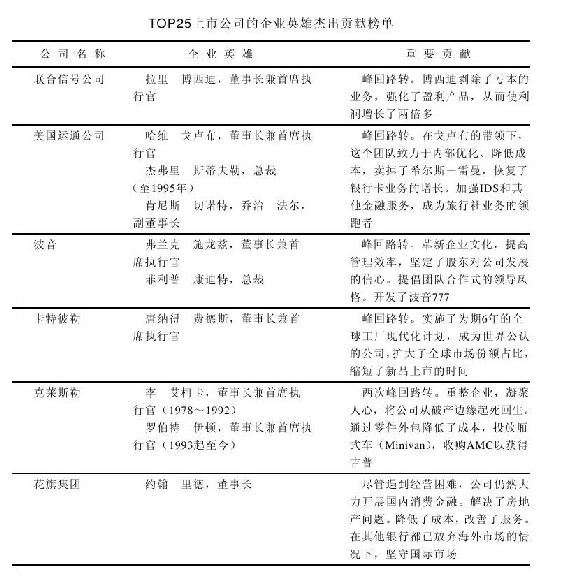
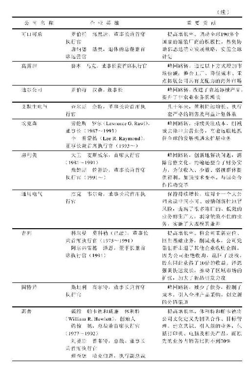
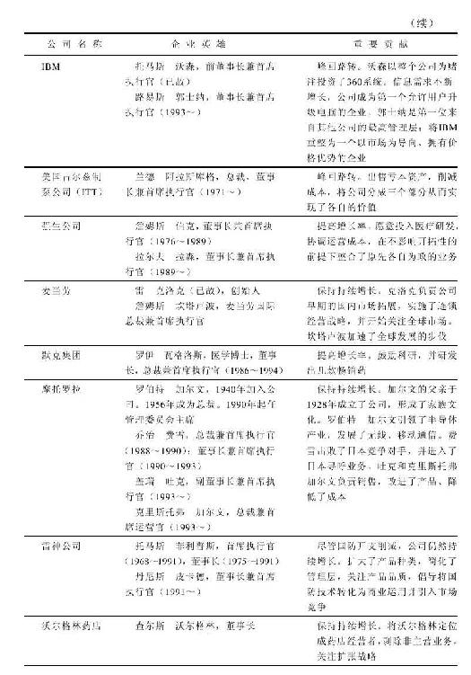
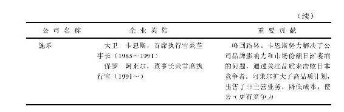
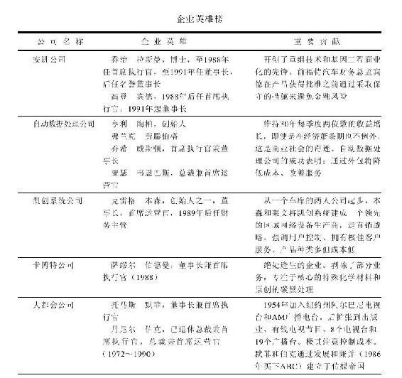
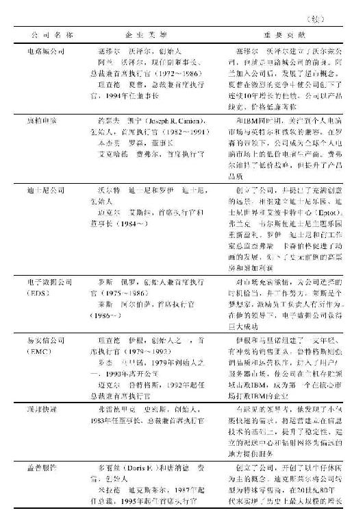
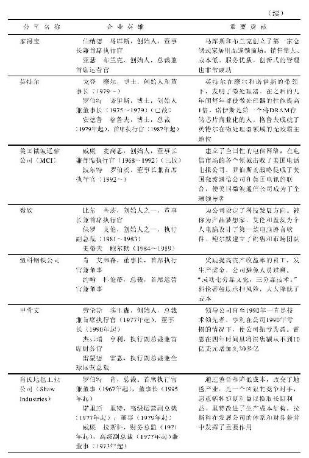
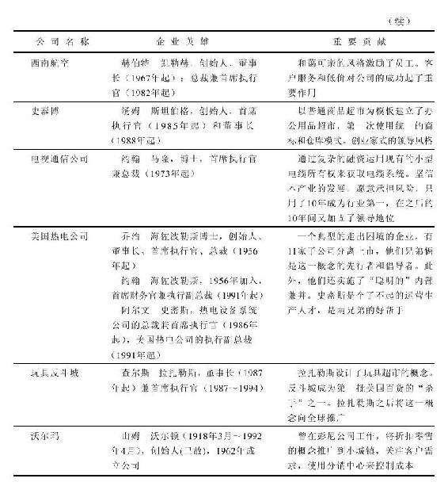
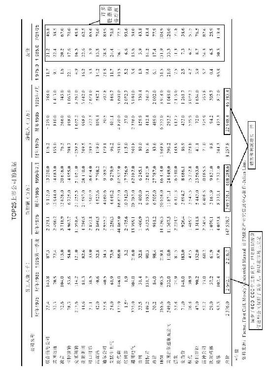
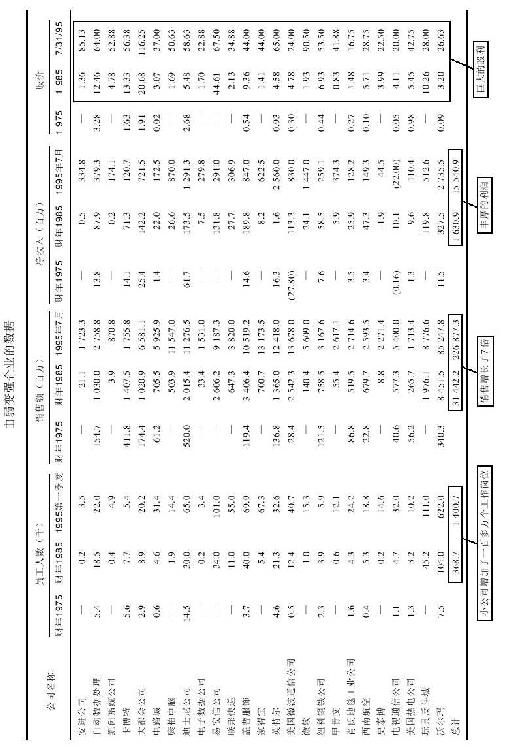

# 第4章　上市公司的成功秘诀

## 富人如何脱颖而出

每年《福布斯》都会发布一张全美排名前400位的富豪榜单，对于这张富豪榜单，商界认为意义重大，这就好比《体育画报》杂志的泳装评选对于体育界意义非凡。这张富豪榜还颇具可读性，因为它不仅告诉人们这些富人是谁，他们靠什么致富，还能揭示整个国家近期的发展变革趋势。

1982年，当《福布斯》发布第一张富豪榜的时候，排名第一的是船运大亨丹尼尔·路德维希（Daniel K.Ludwig），排名第二的是保罗·盖蒂（J.Paul Getty），他获得财富的方式是继承了大笔遗产，这种致富方式非常传统。前十名富豪中有五位都来自亨特（Hunt）家族，他们在得克萨斯凿地挖井，发现了好几口油田，这不由得使我们想起亿万富翁盖蒂说的一句话：“要想过得比别人好，就要早起挖石油。”

在这张20世纪80年代初的富豪榜单中，洛克菲勒家族、杜邦家族、弗里克、惠特尼、一两个梅隆（Mellon）就囊括了19世纪发家的所有有钱家族。“遗产”致富成就了65位富豪，除了这65个继承人外，还有至少12个继承人的子女在家族企业中担任要职：玛氏糖果集团的玛氏后裔、迪士尼后裔，以及来自布施啤酒的布施和强生集团的强生。

1993年的富豪榜单上的家族遗产继承人就不如20世纪80年代这么多了，由此我们可以总结出美国财富的以下几个规律：首先，要永葆财富殊为不易，哪怕是亿万富翁。财富从上一代传到下一代，通常就会损失一大笔遗产税，除非财产继承人能够谨慎精明地投资，否则，他们的百万资产流失的速度会和当年祖先赚取这笔财富的速度一样快。

其次，美国是创业的乐土，像微软创始者比尔·盖茨那样有头脑的年轻人可以后来居上跻身《福布斯》榜单，并领先洛克菲勒、梅隆、盖蒂和卡内基。

在1993年的富豪榜单上，排在盖茨前面的是巴菲特，他获得100亿元美金的方式就是人们津津乐道的选股（否则你不会一直把这本书读到现在）。巴菲特是历史上第一个通过选股投资从而成为首富的人。

巴菲特的选股策略很简单：没有窍门、不使花招、不炒作市场，只是购买业绩好的公司的股票，并不厌其烦地长期持有。其实，持有这些股票的结果一点也不烦：如果你让巴菲特40年前投资1万美元，现在已经值8000万美元。这些投资收益大部分来自你耳熟能详且本可以给自己买点儿的企业的股票，如可口可乐、吉列和《华盛顿邮报》。如果你曾经对长期持股是不是一种明智的选择而感到疑惑，那么就看看巴菲特的成功记录吧。

如果把杜邦家族看成一个人，那么，1993年《福布斯》榜上的400个富豪中只有43个人通过继承遗产登上富豪榜。我们看到榜单上的昔日大亨的子女逐渐减少，而像贺拉旭·阿尔杰（Horotio Algers）那样的后起之秀则越来越多，他们出身草根，靠着初生牛犊的冲劲、运气和智慧达到财富的巅峰。雷奥娜的丈夫亨利·赫尔姆斯利拥有多家宾馆，他的职业生涯始于在地产公司邮件收发室的小职员；大卫·格芬（David Geffen）这位音乐界的大亨曾经在威廉-莫里斯公司的邮件收发室工作；麦当劳的创始人雷·克洛克曾经游走各地，销售牛奶机；沃尔玛的创立人山姆·沃尔顿开始只是彭尼公司的实习生；罗斯·佩罗是IBM的销售员；优待券之王柯蒂斯·卡尔森（Curtis Leroy Carlson）是一个瑞典裔的杂货店老板的儿子，他靠把送报生意转包给他的兄弟获得的微薄利润、为宝洁售卖肥皂赚来的110美元以及50美元的贷款创立了金券优惠券公司（Gold Bond Trading Stamp）。

从比尔·盖茨开始，中途辍学创业致富跻身富豪行列的也屡见不鲜。创立微软的神童盖茨离开哈佛大学后研究软件，全球大多数个人电脑都安装着他发明的操作系统。

中途辍学的还有柯克·科克莱恩，他是一个移民到美国的果农的儿子，初中还没有毕业就辍学；拉斯·韦克斯纳是利米特商店（Limited stores）的创立人，他是一个从法学院退学的学生；之前提及的大卫·格芬，只是大学肄业；盖茨的合伙人保罗·艾伦也未念完华盛顿州立大学的学位；特纳广播公司的特德·特纳，从布朗大学退学，之后才返回学校念完了学位；建立甲骨文公司的劳伦斯·埃里森从伊利诺伊大学退学；大卫·霍华德·莫达克（David Howard Murdock）通过房地产和企业收购发迹，是旅游产品推销员的儿子，高中还没毕业；约翰·理查德·辛普劳（John Richard Simplot）是麦当劳薯条所用马铃薯的供应商，8年级时退学离家，找了份分土豆养猪的工作；哈利·韦恩·休伊曾加（Harry Wayne Huizenga）大专肄业，凭着一辆旧卡车开始了他的垃圾处理业务，31岁时，建立了全球最大的垃圾处理公司即美国废物管理公司，之后他又将目光投向了达拉斯音像商店，并在它的基础上建立了百事达音像公司。

人们不必仿效这些人放弃学业。他们创业的时候，没有大学学历仍能找到一份体面的工作，但是在今天的社会没有一纸文凭想找工作谈何容易。此外，他们中的每个人在离开学校时都已掌握了创业所需的基本技能，他们退学不是因为好逸恶劳，而是为了创办公司或追求个人的兴趣爱好。

20世纪90年代能够赚到10亿美金的方法不胜枚举：经营汽车零部件、水龙头、黄页、咖啡伴侣、塑料杯子、翻新轮胎、从工业废弃物中提炼塑料、卖减肥药、高额汽车保险、免税店、嘉年华邮轮、比萨连锁店（像达美乐比萨和小凯萨比萨）、汽车租赁行。甚至可以做律师，就靠劳其筋骨办理案子也能发家致富。

这些价值上亿的好生意有些是从地下室、车库、小镇店面酝酿产生，而且能在有限的预算内得以实施。电脑业巨头惠普靠戴维·帕卡德（David Packard）车行的538美元起家；沃尔玛是从阿肯色州新港的廉价商品专卖店成长起来的，这家商店后来因租约到期，在本顿维（Bentonville）重新开张；安利公司的创始人理查德·马文·德沃斯（Richard Marvin De Vos）和杰·温安德（Jay Van Andel）在地下室照着从底特律药剂师那里买来的配方研究了一种可被生物分解的肥皂。

只有31个富豪从事房地产业，18个来自石油行业，看来盖蒂的名言已经不像过去那么灵验了。有几个富翁开证券经纪公司和基金公司，还有30个左右靠电视、传媒起家，起码有20个人从事电子和计算机。

和1982年的榜单相比，1993年的榜单最大的不同在于富豪400强的规模。1982年的时候，1亿美元就能登上富豪榜，现在3亿美元才能够入榜。在富豪榜单上，有25个人的资产超过20亿美元，而1982年只有5个人。

也许正如弗·斯科特·菲茨杰拉德曾经说的，富人“有别于你和我”，但是，单从《福布斯》榜上是看不出这种区别的。榜单上有各种各样的富人：高矮胖瘦，好看的或长相欠佳的、智商高的或智商平平的、奢侈的或节省的、吝啬的或大方的。令人惊讶的是，有些人发财以后仍然守着节俭的习惯。拥有沃尔玛的亿万富翁，在20世纪90年代初去世的时候，他掏出点儿零钱就可以买上一个车队的豪华轿车，但他却宁愿开着一辆破旧的雪佛兰车，方向盘上还是斑斑点点。他本可以搬到巴黎、伦敦、罗马和其他一些描述名流生活方式的影片中常常出现的地方，但他却和妻子住在家乡阿肯色州本顿维的两居室的房子里。

沃伦·巴菲特是另一个没有让经济上的成功阻断其与家乡（内布拉斯加州的奥马哈）联系的人。拥有了亿万家财之后，他仍然安居家乡，享受读一本好书、玩一局桥牌的乐趣。戈登·摩尔建立了美国仙童半导体公司，同时也是英特尔公司的创始人之一，他每天开着破旧的皮卡上班。有许许多多这样的故事，关于靠自我奋斗成功的富翁如何低调地生活、避开大众、长时间地工作，即使根本不用抬下手指就可以付清所有的账单。“平静地生活”、“回避媒体”是常常用来形容《福布斯》400强的词汇。

这些人富有了以后，仍在继续做着创业时做的事情。这对我们很有启发：去做感兴趣的事情，并且倾其所有地为之付出，钱自然而然就会有了。你终有一天可以每天在游泳池边拿着一杯饮料来享受余生，当然你未必真的会这么做，而是在办公室里忙得不亦乐乎。

## 可口可乐的成功之道

上帝不会某一天俯视凡间说“让可口可乐诞生吧”。造物主绝不会做这些，除非你认为上帝在创造约翰·彭伯顿（John Pemberton）博士的时候脑子里就想着可乐。1869年，彭伯顿从佐治亚州的哥伦布到亚特兰大，做专利药，从而赢得了声望。

那时，我们还不相信广告，食品与药品管理局也没有开始监管人们吃的喝的产品，所以，彭伯顿可以毫无顾忌地把他配置的饮料从家里的澡盆里一勺一勺地灌进瓶子，然后把它当做神奇水来兜售，这也就是所谓的专利药。

彭伯顿的产品线包括印度女皇染发剂（India Queen Hair Dye）、三叶肝片（Triplex Liver Pills）以及由糖、水、古可叶、可乐果、咖啡因等混合而成的糖浆。糖浆的标签上写着：它可以“补脑、治疗各类神经痛”，彭伯顿将它的销售卖点定位在治愈头痛、歇斯底里、忧郁症等，并能让消费者心情愉快。这就是最早的可口可乐。

彭伯顿第一年花了73.96美元做广告，但只卖了50美元的糖浆，可见消费者并不相信他的话。5年后，人们还是不相信，彭伯顿也懒得去说服消费者了。所以，他干脆作价2300美元把配方、设备、古可叶、可乐果卖给了一个亚特兰大的药剂师阿萨·坎德勒（Asa Candler）。

坎德勒是一个宗教徒，习惯于说真话，他承诺继续彭伯顿的事业，去除了原配方中的古可叶成分，到了1905年，可口可乐已经完全不含可卡因了。事后证明这件事他做对了，否则，人们会因饮用可乐而蹲大牢，因为1914年后食用可卡因是非法的。修改后的可乐配方至今仍然存放在佐治亚信托公司的保险箱里，这是20世纪保守得最好的秘密。

他还修改了标签，去掉了“补脑”、“治疗各类神经痛”等模棱两可的语言。1916年他发明了一种曲线瓶，从此之后，世人都能一眼认出可口可乐。

在坎德勒的工厂，可乐果、糖、水、咖啡因和他自创的一些神秘成分被放在一个大壶里煮沸，然后用大木棒搅拌成厚厚的糖浆，然后将糖浆卖到药店，药剂师加入苏打水让它起泡，提供给柜台前的人饮用。一时之间，喝可乐变得十分流行，药店必须雇用帮手来倒糖浆起泡。于是乎，放学后帮助药店搅拌可乐成了全美无数青少年赚取零花钱的途径。

1916年，美国国会立法加收了一项企业税，这使得坎德勒大为恼火，因为他必须为销售可乐带来的利润支付更高的营业税，于是，他以2500万美元将公司卖给了一个亚特兰大的银行家厄内斯特·伍德罗夫，他的儿子罗伯特也就成为可口可乐的总裁。

伍德罗夫家族不仅收购了可口可乐公司，而且让其公开上市了。1919年，他们发行了100万股股票，每股40美元。那时，由于糖浆的成本一路飙升，人们大都并不看好可乐的股票。愤怒的罐装厂商抗议价格的攀升，威胁要取消与可口可乐公司的合同，导致官司接踵而来，可口可乐的销量也随之下降，企业濒临破产。

多亏了罗伯特·伍德罗夫大力削减开支，可口可乐才逃过一劫，捱过了大萧条时期。在大萧条时期，大多数企业都举步维艰，但对可口可乐来说却是个好光景。因为尽管人们手头拮据，不再买新鞋，购新衣，但他们仍然要买可口可乐。

这对投资者来说提供了一条有益的启示：要像警犬一样敏锐，果敢地抓住机会，除非危险的事实确凿地摆在眼前。尽管1930年美国的经济已经跌到谷底，但是，因为可口可乐保持了较高的盈利水平，所以它的股价从1932年时的20美元逆势上涨到1937年时的160美元。你投资可口可乐股票的资本上涨了8倍，而周围的人则惶惶然仿佛世界末日，真是令人不可思议。

罗伯特·伍德罗夫经营可口可乐长达30年，他为人低调，力图不让自己的名字在媒体上曝光。他只有几栋房产和一个大牧场，由此可见，他在富翁当中算是节省之辈。显然，他从不阅读书籍，很少听音乐，对油画也知之甚少。此外，他只在不得已的时候才举办派对。

可口可乐不仅从经济大萧条的艰难时期获益，还从另一艰难时期第二次世界大战中获益。全世界的人看到美国大兵喝可乐，决定仿效他们的英雄，可见，美国大兵是商业广告史上最有效的免费代言人。

可口可乐直到第二次世界大战后才真正成为跨国企业。它那耀眼的红色广告牌在六大洲的墙上、大楼上随处可见，有的广告牌甚至用来填补一些大楼与大楼之间的空隙。可口可乐成为美国生活方式的象征。美国与苏联各自将导弹瞄准对方，但是苏联却很担心一个小小的饮料会影响其国家安全。即使在法国，也有某些人试图禁止可口可乐。

要从可口可乐这只股票中赚足好处，你要有耐心等上20年的时间，一直等到1958年股价再一次跳升。1958年时它价值5000美元，1972年价值近100000美元。在14年间将5000美元资产扩大到100000美元，这种机会少之又少，除非你中彩票或干非法勾当。

在1972年的经济危机中，可口可乐和其他股票一样受到重挫，市值迅速下跌了63%，之后的3年都没能恢复过来，直到1985年才重拾升势。耐心再一次得到了回报，1984~1994年间，5000美元的可口可乐股票涨到了50000美元。

1930年百事可乐濒临破产时，可口可乐曾一度可以不费吹灰之力地将它收购。但是，当时可口可乐没有这么做，导致百事可乐在50年后卷土重来与可口可乐一争高下。1984年，百事可乐在美国市场的销量超过了可口可乐，迫使可口可乐总部不得不做出反击。迫于竞争，可口可乐公司发明了健怡可乐，从而改变了软饮料行业，也使人们减少了上百万磅的腰间赘肉。没有百事可乐的竞争压力，可口可乐可能从来不会想到要发明健怡可乐。

伍德罗夫时代结束于20世纪50年代中期，他退休后靠捐钱打发时间。他捐款几亿美元给医疗事业、艺术事业和埃默里大学，并捐地建造了亚特兰大的疾病控制防治中心。他向亚特兰大艺术中心联盟捐款，尽管他自己从来不爱去博物馆，听交响乐。他的很多捐款都是不记名的，但是人们还是猜得出来，因为在亚特兰大除了伍德罗夫谁有这样的实力和善心做这些呢？人们开始称他为“匿名先生”。

罗伯托·郭思达（Roberto Goizueta）于1981年执掌可口可乐，直到本书写作时仍担任董事长。他和可口可乐的前总裁唐·基奥（Don Keough）是一对绝佳拍档，他们将可口可乐推广到全球195个国家，人们像喝水一样喝可乐。在全球水质欠佳的情况下，喝水还不如喝可乐好。

郭思达本身就是一个传奇。他出生于古巴一个富裕的农民家庭，家庭财产在卡斯特罗时期的古巴革命中被没收。他在古巴为可口可乐打工，卡斯特罗上台后，他被调到巴哈马的可口可乐办公室。他从古巴的可口可乐办公室起步，然后调到了亚特兰大总部，一路晋升。

可口可乐在全球流行的程度不可估量，但华尔街过了很久才注意到可口可乐，而且还有一些所谓的“专家”至今仍然视而不见。

## 比肩可口可乐的优秀公司

## 箭牌口香糖

1891年，威廉·瑞格理（William Wrigley Jr.）从美国费城来到芝加哥，在他父亲的肥皂公司做推销员。公司除了生产肥皂，还生产发酵粉，卖发酵粉时另外派送烹饪书作为赠品。很快地，发酵粉比香皂更加畅销，他们就当机立断地只做发酵粉买卖。

又过了一段时间，他们不送烹饪书改送口香糖了。这个赠品计划获得了极大成功，他们干脆停止销售发酵粉，做起了口香糖买卖。

1893年，箭牌生产出了第一种薄荷口香糖。箭牌的境遇与可口可乐相似，上市之初并不畅销。但到1910年，箭牌成为美国最受欢迎的品牌。1915年，箭牌糖果公司为了进一步拉动销售，在美国按着电话簿里的地址给每个人寄了一份免费的口香糖。

## 金宝汤公司

约翰·多伦斯博士（Dr.John T.Dorrance）热爱化学，他拒绝了四家大学的教授职位，去他叔叔亚瑟·多伦斯（Arthur Dorrance）及其合伙人约瑟夫·坎贝尔（Joseph Campbell）的金宝汤公司打工。在那里，他研究出了浓缩汤的制作流程，并买下了他叔叔的所有股份，成为公司的唯一所有人。这是他叔叔的失策，他没有预见到这个公司的收益会不断增长，1995年市值达到114亿美元。

多伦斯博士业余时间热衷于选股，他听取了经纪人的建议，在1929年股市崩盘之前卖掉了所有的股票，这是有史以来股票经纪人给出的最好的建议。

## 李维斯

李维·施特劳斯（Levi Strauss）从德国的巴伐利亚移民到美国。他用帆布做成裤子卖给1849年淘金热时期来到加利福尼亚挖金矿的人，大多数淘金者都两手空空而归，而李维·施特劳斯却靠卖牛仔裤发了财。1873年，他还为斜纹版牛仔裤申请了专利。

李维斯的公司到1971年才公开上市，1985年他又赎回了所有的股份，李维斯再度成为私人公司。

李维斯牛仔、金宝汤、箭牌口香糖、可口可乐产生于100年前，当时人们的生活远远没有现在这么复杂，也没有这么多的律师中途介入。但这并不意味着，你不能在现代社会里白手起家，开创一番事业。本和杰瑞、比尔·盖茨和伯纳德·马库斯就分别成功开办了冰淇淋、软件和硬件商店。

## 本杰瑞

本·科恩和杰瑞·格林菲尔德在长岛七年级的一节体操课上相识，几年后两人都变成了嬉皮士。本大学退学后，开过出租车，煎过汉堡，拖过地板，看过马场，做过陶瓷。他曾住在阿迪伦达克山区（Adirondacks）的一个小木屋里，那里只有一个火炉，连水管都没有。他蓄了个大胡子，腹部隆起。

杰瑞在俄亥俄州进入欧柏林大学念书，除了修完课程之外，还学会了派对上的小把戏和狂欢节的游戏。他申请医学院被拒，就找了一份把牛心塞到试管里的工作。他比本瘦，看上去很颓废，当时颓废派还没有流行起来。

他们两人在纽约州相遇，经过讨论做出决定：既然无所事事，干脆合伙开个冰淇淋店。杰瑞花了5美元参加了一门函授课程，学习如何做冰淇淋。1978年，他们的积蓄有6000美元，又向本的爸爸借了2000美元，将佛蒙特州博林顿的一间废弃加油站整修了一下，墙上刷了油漆，命名为勺子商店（Scoop Shop）。

人们对勺子商店卖的冰淇淋欲罢不能，因为本杰瑞的冰淇淋丰富多脂，含有大块水果、巧克力和其他配料。它是一种高脂高胆固醇的食物，但是，那个时候人们不太关心胆固醇的高低，所以，他们可以吃很多本杰瑞冰淇淋，却一点也不感到内疚。

没过多久，本杰瑞的冰淇淋越卖越好，加油站已经无法适应生意的发展，于是，他们决定建立一个冰淇淋工厂。他们当时本来可以得到风险投资家的帮助，但是他们还是选择了直接上市。1984年，他们以每股10.5美元的价格募集了73500股，共计75万美元。这对于大公司来说只是一笔小钱，但已经足够他俩兴建冰淇淋工厂了。

为了保持公司的本土化，他们制定了一条招股规则：只有佛蒙特州人才能购买原始股。因为佛蒙特州并不富裕，有不少投资者至多只能买得起一股。10年后，股票的价格是原来的10倍。

本杰瑞是有史以来最有趣的上市公司之一。老板们整天穿着体恤上班，从不穿西装（其实他们也根本没有西装）。他们以感恩而死乐队（Grateful Dead）的领唱杰瑞·加西亚（Jerry Garcia）的名字命名了一种樱桃冰淇淋即樱桃加西亚（Cherry Garcia）。在公司年会上，本曾躺在地上，肚子上放一块砖，让杰瑞抡起大锤把砖劈开。

你甚至无法看出公司高管和打扫卫生的阿姨之间的区别。公司停车场里都是大众车。按一般的标准衡量，他们的高管薪水很低（他们的理念认为：每个人都可以挣钱，但不应该挣得太多）。由于薪酬差别较小，管理层和工人们相处得更为融洽，周末晚会上的派对气氛也很热烈。

本和杰瑞在工厂里播放摇滚乐以激发员工的工作热情，夏天他们甚至在博林顿的户外播放电影。他们从当地的奶农那里收购鲜奶，从而振兴了整个佛蒙特州的乳品业。他们甚至为了帮助奶农，有意高价收购他们的牛奶。他们还把每年利润的7.5%直接捐给慈善机构。

这样的故事只可能发生在美国：两个嬉皮士从5美元的函授课程开始，一跃成为全美第三大冰淇淋供应商。20世纪90年代初，公司遇到了“中年危机”：人们开始发现胆固醇的存在，并停止食用本杰瑞闻名于世的高脂冰淇淋。

不过，公司也在与时俱进，20世纪90年代中期引进了酸奶和低脂的生产线，用以替代原先颇受顾客青睐的高脂冰淇淋。

1994年，本辞去了首席执行官一职，虽然他看上去从来也不像一个首席执行官，而更像一个冰淇淋品尝专家。公司为了寻找接班人举办了一场竞赛，要想赢得这一职位，竞聘者必须在简历后附上一些别出心裁的东西，比如，最终获得这个职位的人就特别附上了一首诗。

## 微软

比尔·盖茨生于1955年，祖父是威廉·亨利·盖茨。他在华盛顿的贝尔维尤郊外长大，在附近的湖滨中学念书。湖滨中学有个电脑实验室，这在20世纪60年代是很稀罕的，盖茨则充分利用了这个教室。

盖茨迷上了电脑，不分昼夜地和长他几岁的小伙伴保罗·艾伦泡在电脑室里。他沉溺于电脑中不能自拔，他的父母不得不立下一条禁令：让他暂时离开电脑。盖茨迫不得已地答应了，但这种阻隔反而加深了他对电脑的迷恋。

没过多久，盖茨和艾伦旧病复发，用最早的硬件和现有的软件做测试。但是，由于没有什么操作手册或“傻瓜学DOS”之类的书，盖茨和艾伦自创发明了DOS操作系统。与此同时，软件业的先锋人物两个史蒂夫、乔布斯和沃兹尼亚克也正在数百公里之遥的南部研发苹果机。

科学家和工程师在装备精良的实验室里做出的成就还不及这两个年纪轻轻、身穿牛仔和体恤的“黑客”。盖茨和艾伦念完中学之前，已经堪称电脑编程这一新兴领域的专家了。

随后，盖茨考入哈佛大学深造，他想成为一名律师，而艾伦则在新墨西哥州的一家叫“MITS”的小型电脑公司找了一份工作。盖茨整日来往于教室、扑克台、电脑室之间，很快就厌倦了大学生活。终于有一天他无法忍受这样的生活，退学去找他在新墨西哥州的老朋友。那时他俩已经研究出了一种计算机语言，名叫BASIC。

MITS雇艾伦为英特尔公司的一款电脑芯片设计一种BASIC版本。但是BASIC反响热烈，几家电脑厂商都想用它来做电脑的操作系统。这就引发了官司：BASIC归谁所有，是归盖茨、艾伦还是归MITS公司所有？法院站在了开发者一边，因为盖茨和艾伦早在加入MITS之前就开发出了BASIC。法院的宣判使他们可以自由销售自己开发的电脑语言，而利润则收归己有。

早在离开MITS之前，盖茨就开办了自己的公司“微软”。官司结束后，他将全部精力都投入到微软上。那时，微软公司很不正规，非常松散，员工们没日没夜地工作。办公室里，电脑摆得七零八落的，但书籍则被小心翼翼地摆放着。来访者不禁看着老板的办公室问：“那个坐在盖茨先生位子上的孩子是谁？”其实，那个孩子就是盖茨本人，他当时25岁，人看上去比实际年龄更小。

往后，微软的好消息接二连三。1980年，这个小公司与电脑巨头IBM并驾齐驱地坐在谈判桌前。IBM开发了一条新的个人电脑生产线，需要一个与之相匹配的软件系统。盖茨参加了那次谈判，他的表现给IBM的管理层留下了深刻的印象，得到了一个永久的合同。按照与IBM的合同，盖茨和他的团队没日没夜地秘密工作，设计出了MS-DOS系统。

人们没能开发出一种世界通用的语言，但是微软却向这个理想迈进了一步，20世纪90年代中期，全世界75%的个人电脑使用的都是MS-DOS系统。

如果IBM当年更聪明一些，它就应该索要MS-DOS的部分版权，这样它的股票价格会高出很多。然而事实是，IBM让微软仍然拥有所有的版权，从而成就了微软日后成为资产超过亿元并且拥有全部版权的公司。这个故事的教训就是：如果你要让一个人发财，就要想方设法分得一杯羹。

## 家得宝

家得宝的发端源于三个被便利车建材中心（Handy Dan Home Center）解雇的年轻人。他们坚信自己可以比解雇他们的人干得更好，于是决定开办自己的建材商场。后来，便利车退出了历史舞台，而家得宝的分店则遍地开花。

做出创业决定，这只是家得宝创始人迈出的第一步。接着，他们说服了一个风险投资集团投资，在亚特兰大建造了第一个超级家具建材商店。可惜，建材商店的盛大开张却以失败告终。开业当天的广告上写着：每光顾一次都能拿到1美元。但一天结束时顾客还是寥寥无几，一叠厚厚的美元依然无人问津。看来，即使你出钱，人们也不想到家得宝建材商店。

可是，没过多久，家得宝就开始顾客盈门了，吸引他们的是种类繁多的商品、低廉的价格和训练有素的员工（从地板到照明的一切问题店员都能解答）。这家店获得了空前的成功，即使在经济大萧条、多数的零售商都受到了冲击的时候，销售依然旺盛。当美国彭尼公司因经济不景气退出了四家亚特兰大附近的购物中心的时候，家得宝租下了它留下的场地，又开了四家店。

他们一旦看到成功，就计划着大规模地扩张。为此，他们去股市筹措资金，于1981年公开发行了自己的股票，发行价格为每股12美元。1995年时，这些股票（复权后）每股价值飙升至3308美元。

到1984年，家得宝已有19家门店。但1985年，公司遭受了挫折，利润开始下滑。当年，家得宝犯了扩张过快的错误，这也是大多数公司都容易犯的错误。1986年，公司不得不卖出更多留存的股票，得来的收益用于归还负债。最后，家得宝从困境中挺了过来，三年后，家得宝成为全美最大的家居零售连锁商店，1995年，家得宝拥有365家分店，销售量达140亿美元。

## 美国神话还在延续

尽管人们常说美国已经衰退，失去了昔日的国际地位，但是，事实上我们在创新方面仍然引领潮流。我们在音乐、电视、电影领域堪称世界一流，我们在森林产品、纸制品、铝制品和化学产品领域成本甚低，华尔街在资本市场的地位仍然不可动摇，银行体系也重振了往日的雄风，而日本银行则深陷困境。

无论人们相信与否，美国的铁路系统在运输货物方面还是无人能比、令人羡慕，其他国家都在研究我们的成功之道。不过，我们的客运系统还有待改进。

美国在移动电话、电子测试、医药、电信和农业设备上都领先全球，我们在遗传工程、半导体、医药研发领域也表现出色。我们的出口市场在经历了几年的衰退后开始复苏，这就说明消费者正越来越多地购买我们生产的东西。

美国将钢铁出口到首尔，晶体管出口到东京，汽车出口到科隆，氨纶材料出口到锡耶纳，自行车配件出口到孟买。全球六大洲的男士都用吉利刮胡刀，天空飞翔的是波音的飞机。日本应该是电子产品（存储芯片、电视机、传真机等）的故乡，但日本的创新远远不及英特尔、美光科技（Micron Technology）、微软和康柏这样的美国企业。

美国的个人电脑世界第一，在软件、空间站、激光打印机、电脑网络和微处理器领域也是行业领导者。

美国许多的创新来自小企业，而且美国的小企业也是世界一流的。我们已经看到微软和苹果的年轻人如何改变了电脑业，20年后，软件业又涌现出一批创造奇迹的年轻人。

在此期间，美国的报纸杂志经常指责美国人肥胖、懒惰、薪水过高。那是因为我们实行新闻自由，而媒体又常常只反映阴暗面，鲜有正面报道，原因在于负面报道总是比较吸引眼球。

所以，美国人常常听说：日本人比我们勤劳，德国人比我们工作认真，而美国人只知道坐在沙发上切换电视频道，或在学校里吊儿郎当地投掷飞盘（这也是美国的一项伟大发明），似乎其他国家已经超越了美国。

世界末日论者认为，美国不可避免地将成为一个游手好闲的懒汉的乐土，将来会堕落到只会做做鸡尾酒会上的小纸伞。

最显而易见的是汽车行业遭遇的困境。20世纪60年代之前，我们在汽车制造领域就像在战场和维和领域一样，都处于世界最高的水平，那时，底特律就是汽车爱好者的圣地麦加。但在60年代以后，美国的汽车业就开始江河日下。工人们通过工会的力量，争取到越来越高的工资。而与此同时，日本和德国却以外观漂亮、制造精良、价格低廉的汽车向底特律的霸主地位提出挑战。成千上万的美国消费者更喜欢这些进口的车型，而不是设计乏味、制造粗糙、价格高昂的美国车。

记者和学者在他们的文章和书中写道：“美国汽车业的衰退是美国生活方式落寞的一个征兆。”这些书中最有影响力的要数大卫·哈伯斯塔姆（David Halberstam）的《罪孽的代价》（The Reckoning）。

如果你看了哈伯斯塔姆的书，可能会为福特、通用、克莱斯勒公司的未来、为美国的未来忧心忡忡。但是，就在这本书出版的那一年，也就是1986年，却正是克莱斯勒从破产边缘起死回生，福特在业界开始强力反弹的时候，而尼桑和其他日产汽车制造商却业绩下滑。可见，昔日的失败者又开始重振雄风。

那些认真研究、专注到这种转变的投资者，在福特、克莱斯勒、通用汽车的股票上大赚了一笔。如果他们适时买入，那么他们购买的克莱斯勒公司的股票已经涨了15倍，福特涨了10倍，通用涨了5倍。

这种转变绝非在1年内或5年内完成，而是一个漫长的过程。就像底特律用了许多年的时间才失去了霸主地位，它的振兴同样需要许多年。这种振兴令许多人大为吃惊，因为他们听到的不是真实的情况。我们听到的关于汽车业被日本主导的新闻是过时的。发明小货车的不是日本人，而是克莱斯勒。生产新一代时尚、低价车型的不是日本制造商，而是福特、克莱斯勒和通用。重新设计吉普车的不是尼桑，而是克莱斯勒。在欧洲最畅销的车型不是丰田，而是福特嘉年华（Ford Fiesta）。

20世纪90年代中期，日本车渐渐失去了在美国的市场，而美国汽车企业赢回了市场份额。

美国企业重整其工厂，使之更为高效。美国工人的工资下降，生产成本也随之下降，企业可以以更低的价格销售产品，与国外竞争者一争高下。

20世纪七八十年代，美国人自我感觉很差，但到了90年代，美国劳动力已经成为世界上最高效的。美国的每个产业工人每年生产价值49600美元的产品，比德国人平均多5000美元，超过日本人10000美元。德国工人一年休带薪假5个星期，美国工人比一般的德国工人工作的时间更长，休假的时间更短。

这也不等于说美国人没有问题。比如，经济增长速度在放缓，最低工资不能说没涨，只是增长幅度很小。此外，美国的内陆城市犯罪率、失业率居高不下，还有近一半的孩子没有念完高中，没有学历，他们不可能争取到IT和高科技公司里的职位。

和这些问题同样糟糕的是，美国人普遍弥漫着和20世纪40年代相同的悲观主义。那时，战争刚结束，一两千万人失去了他们在军事、国防领域的工作，当时美国人也曾感到悲观。超过1/3的人需要另谋职业，这种危机的规模远远超过我们今天面临的任何一次裁员。然而，时下的报纸头版却让人们觉得美国现在的处境比第二次世界大战后那段时间还糟糕。

其实，20世纪50年代经济本来不错，尤其对股市来说，其繁荣程度仅次于20世纪80年代。所以，人们对未来的悲观和低预期都是多余的，就像他们在90年代初的错误预计一样。

## TOP25企业英雄

念书的时候，我们争论哈姆雷特到底是英雄还是懦夫，李尔王是愚蠢的还是其贪婪女儿的受害者，拿破仑是伟大的将军还是掠夺土地的暴君。但我们从来不用争论山姆·沃尔顿是恶棍还是英雄，他靠经营沃尔玛发家：这是好事还是坏事？迪士尼的迈克尔·艾斯纳呢？他是暴发户还是企业的救星。

橄榄球明星乔伊·蒙塔纳是一个名人，他对社会的贡献几乎被人们神化了。毫无疑问，他对社会确有贡献，但是，如果和山姆·沃尔顿或李·艾柯卡相比呢？谁创造了更多的就业机会？

艾柯卡不会像乔伊·蒙塔纳般地在球赛第四节落后的情况下反败为胜，但却让克莱斯勒在1981~1982年那几个艰难的季度里起死回生。这是惊心动魄的一幕，如果艾柯卡失败了，后果将不堪设想。

不仅克莱斯勒的115948个员工要失业，而且那些与汽车制造相关的产业如轮胎、铝、钢、汽车玻璃、座椅皮革业等的供应商也将随着克莱斯勒的倒闭裁减员工。艾柯卡拯救的不仅是克莱斯勒11万多个工作岗位，而是超过30万个工作岗位。而乔·蒙塔纳拯救了几个工作岗位呢？

蒙塔纳让球迷蜂拥进入球场观看比赛，间接地繁荣了票贩子和卖热狗的小贩的生意，这当然没什么不好。但是，艾柯卡拯救的不仅是热狗的品种，而是每小时20美元的技术岗位。30多万个员工都应该感谢艾柯卡，是他让这些员工可以度假、买第二套房、送孩子上大学。

通用电气的总裁杰克·韦尔奇是不是比艾尔顿·约翰更重要呢？罗伊·瓦格洛斯（Roy Vagelos）在执掌默克公司时，开发了多种抗病的创新药，他是不是比朱迪·福斯特、戴安娜王妃、奥尼尔（篮球明星）更重要呢？如果由一般人来投票，大家可能会选择韦尔奇和瓦格洛斯；但实际上唐恩都乐（Dunkin Donut）甜甜圈广告中的面包师，可能比上面提到的大部分人还要出名。

在商业上，我们通常将两种人称为企业英雄，一种是创立公司的人，一种是经营公司的人。这些20世纪90年代“看不见的手”会使亚当·斯密都刮目相看，这些分布在各个国家的企业家正在全球范围内履行着资本家的使命。

只可惜上市公司的企业英雄名单中女性和少数族裔人士很少，只有盖普服饰的创始人之一的多丽丝·费雪是女性，希望未来更多的女性及少数族裔人士有机会经营上市公司。

或许在读完此书后（这是一项家庭作业），林奇的三个女儿玛丽、安妮、贝丝以及罗斯柴尔德的两个女儿白纳斯和沙斯采会受到鼓舞，立志成为女企业家。

美国的企业家不是一群只想着乘坐里尔喷气式飞机（Learjets）到全球各地高尔夫球场去打球的守财奴。弗雷德·史密斯不是因为想赚钱才创立联邦快递（Federal Express或称FedEx），当时的史密斯已经相当富有了，他只是想挑战自我，建立一个比邮局更好的邮递系统。他的成功使得邮局也不得不迎头赶上，现在不论下雨、下雪、还是下冰雹，美国境内的邮件都能隔夜送达。

人们看到这些企业家迅速致富，就将他们与抢银行的恶棍、骗子混为一谈，认为这些企业家自己给自己支付1000万美元的薪水，然后扬长而去。其实，这些钱并不是来自他们的现金薪水，这一点常常被批评者所忽略。

其实，他们的财富大多数来自于所拥有的公司股票。通常你在公司的职位越高，越有可能拿到公司股票而不是现金，公司会分配给高管“股票期权”，也就是未来某时间能以特定的股价买进股票的权利。

但是，只有在公司盈利、股票上涨时，公司高管才能从中获益。如果公司不赚钱且股价下跌，那么，这些人只能眼睁睁地看着自己的财富流失，还不如领点现金薪水划算。

利用股票期权激励管理者，使得公司的管理层与股东利益攸关，当股票上涨管理者受益时，其他投资者也同样从自己购买的股票中获益，这就形成了双赢的局面。

所以，不要眼红迈克尔·艾斯纳从自己的迪士尼股票中赚进5000万美元，反而应该要为之欢呼，因为迪士尼在他的领导下兴盛起来，进而带动了股价上涨（10年内增长了11倍），大大小小的投资者都从中获益。

我们敢打赌艾斯纳先生这么做并不完全为了钱，试想一下，他们这样的高层管理者，原本就已经很富有了，为什么还要每天勤奋地工作呢？他是在享受超越竞争对手的满足感，做生意需要精明、力量和机智。董事会和高级管理者的工作绝不像生产线那么乏味。

弗雷德·史密斯创造了就业，而且给了传统邮局一记教训。在这个章节中谈到的商业英雄全都创造了就业机会，但我们却不常听到这样的宣传，我们听到的更多是失业的消息。

单看近几年的新闻报道，你大概会认为工作岗位已经所剩无几，因为每次翻开报纸都会看到大公司裁员的报道。新闻记者不用去深入挖掘这类题材，因为裁员的新闻比比皆是。全美500强的企业在20世纪80年代裁员300万，90年代的裁员幅度也与此不相上下。

对被裁员的个人而言，失业是痛苦的，但这并不会蔓延成全美性的危机，以宏观的角度来看，这种裁员反倒是积极的。其实，企业并不是欢天喜地将员工扫地出门的吝啬鬼，相反，企业一般多采用渐进的方式裁员，即将退休的员工一般不会被辞退。裁员的目的在于：使公司更具竞争力，赢得未来的竞争。

我们可以想象，如果这500家大企业在20世纪80年代没有裁员300万，会是什么样的情形：逐渐膨胀的工资支出将毁了这些公司，它们将无法和更有效率的对手竞争，因为对手可以用较低的成本把它们逐出市场。由此可见，为保留这300万人就业，可能要有1000万或1500万人失去工作岗位，国家也可能因此进入另一次经济大萧条。

本章附表即将列出的25个企业可以分成三大类型：公司维持数十年的增长（如麦当劳、箭牌、雷神等）；公司曾经面临衰退，后经某位英雄妙手回春，重整旗鼓；公司历史悠久，业绩平平，当人们认为其风光不在的时候，它却又柳暗花明地迎来第二次繁荣。

克莱斯勒是属于重整旗鼓的企业，高露洁、联盟信号（Allied Signal）、卡特彼勒（Caterpillar）、房利美公司及花旗银行等，也都是这方面的代表性企业。在这些峰回路转的企业案例中，可口可乐、吉列、摩托罗拉、默克表现更为突出，它们经营业绩骄人，一直保持高增长率。

在房利美的成功故事中，有两个英雄人物——大卫·麦斯威尔和吉姆·约翰逊。房利美全名为联邦国民抵押贷款协会（Federal National Mortgage Association），是美国国内承揽房屋贷款最大的公司，在大卫·麦斯威尔加入之前，公司的经营极不稳定，常常前一年赚钱，隔年又亏钱，徘徊在破产边缘。麦斯威尔将公司重新整顿后，公司每年稳定地盈利。

约翰逊于1991年接管房利美公司，在其经营下，公司的收益增长一倍，增长更具可持续性。公司的业务直接或间接地影响着数百万户美国家庭，但是它只有3000名员工，以公司的规模而言，人力可说是相当精简。

许多人的工作都取决于房利美是否有能力提供贷款，如果该公司经营不善或出现问题，将导致新房市场及二手房市场的崩盘，相关的建设公司、地毯业、不动产中介、保险经纪人、银行、日用品商店、五金行、家具店等行业，都将因此受到影响。

惠普从前是一家制造电子工业测试设备的老公司。在随后的附表中你可以看到，在1975年时，惠普的营业额为9.81亿美元，20年后，营业额已接近300亿美元。目前测试设备部门的营业额仅占公司营业额的11%，其他78%的营业额是来自打印机及电脑。15年前，惠普从未生产打印机，但现在已蜕变为业界巨人，每年卖出价值90亿~100亿美元的打印机及相关产品。高品质的打印机树立了惠普的品牌，也带动了其电脑的销售。1995年惠普已名列全世界第六大个人电脑厂商。

惠普公司的经营规模1975年不及IBM的1/15，1995年其规模成长为IBM的一半，这种成长和兴盛都源于鼓励员工发明新产品与发展新构想，而推行鼓励这种创新的人则是公司总裁约翰·扬。

这些促使公司更具竞争力的举措，可以追溯到1982年。当时美国遭遇第二次世界大战后最不景气的阶段，汽车工业前景一片黯淡，失业率居高不下，所有的美国人都可以感受到国势欲振乏力。

在这种危机下，企业界领袖们做了一个重要决定，他们决定改变传统的经营方式。在1982年以前，他们受制于每次经济周期的影响，在经济繁荣期就增加人力，当景气衰退时就开始裁员。现在，当生意不好时，公司首先考虑减少加班时数，并让老员工先行退休。

自从1982年以来，所有企业都追求提高效率，在华尔街这些行动被称为“企业重整”（restructuring）、“组织重构”（rightsizing）、“缩减规模”（downsizing）或“组织瘦身”（getting leaner and meaner），无论人们如何称呼这些措施，它们的主要目的都在于降低成本、提高生产力，不只是为了躲过萧条期，更要创造更多收益以及提升竞争性。

以强生公司为例，它拥有30年持续不断增加盈利的纪录，在旧的体系下，公司根本不会考虑组织重构的需要；但在新系统下，像强生这样健全的公司，也意识到必须不断发展新产品，以保持竞争优势。

现在我们知道为什么公司在过去15年间利润有了大幅提高，从而造成了股价不断创历史新高。目前美国已比1982年时更加富有与繁荣，其中部分归功于企业改变了经营方式，包括裁员已使公司更具竞争性的做法，但是没有人注意到这些变化，他们仍然一味认为许多企业领导人还只顾着打高尔夫球。

企业不再能长久地依恋眼前盛况，也许今年很赚钱，但它们已经开始担忧10年后公司的轮廓，它们不会重蹈泛美、东方、博瑞奈福等航空公司的覆辙，这些公司因缺乏竞争力而结束营业，导致数十万人直接或间接地失业。

使公司更具竞争力不是只解聘几位员工或关掉几盏灯以节省开支那么简单。举例来说，假如某公司投资一亿美元增设新厂，那原班人马可以增加15%的产能。

这额外15%的产能可以使许多人受惠，公司可以提高员工薪资5%，使他们工作起来更愉快；可以降低5%售价使顾客更满意；也可以增加利润，使股东更欢喜。当然这15%可以用不同的形式来分配，但重点是竞争力更强的公司将在多方面受惠。

还有另一个增加生产力的方法：减少出错，制造更好的产品。减少出错意指减少客户抱怨、减少打电话向客户道歉的次数、减少退货、减少需要修理的瑕疵品等。若公司能将失误率由5%降至0.5%，那么将省下大量用于解决问题和安抚客户的时间与金钱。

在随后的附表中，你可以看到一张将小企业做大做强的商业伟人的列表，这是上述就业问题的另一面。如前所述，20世纪80年代有300万人被大公司解雇，90年代的情况也差不多，但也许你不知道，80年代的中小企业实际上创造了2100万个工作岗位，那是因为这方面的报道实属罕见。

没有人统计过这些新兴的小企业究竟创造了多少岗位，但我们知道20世纪80年代成立了210万家公司。有些规模较大，有些成功了，有些失败了。如果我们假设平均每个小企业雇10个人，那就是2100万个新的岗位，这一数字比媒体上宣传的大规模裁员多了7倍。

在这210万家新兴企业中，有一些成功的公司逐渐成为上市公司，其中25家最成功的公司名列企业英雄榜，它们能在短期内达到这种成就，实在令人叹为观止。在1985年时，这25家公司营业额总共是3080万美元，还不到埃克森石油公司的一半，IBM公司当时所赚的钱是25家公司总获利的4倍。

当时，这25家公司新增了358000个工作机会，这些大企业总共提供的工作机会已超过260万个。不过，看看10年后发生了什么事：当表中的大公司在此期间裁掉约42万位员工时，一些小公司却日益羽翼丰满壮大起来，在1995年这些小公司总营业额达到2250亿美元，而且雇用了约140万个员工，足足新增了100万个就业机会。

1975年时迪士尼只是一个小公司，今天却成为这么大的一家公司。沃尔特·迪士尼是迪士尼成功故事中的超级英雄，迈克尔·艾斯纳（Michael Eisner）则是另一功臣，是艾斯纳点醒了曾在瞌睡中的迪士尼巨龙。以往迪士尼曾将一些经典动画片重新推出，但艾斯纳加入后，公司不再沿袭老路。在他的领导下，推出了《狮子王》、《阿拉丁》和《美女与野兽》等作品，使迪士尼再度成为卡通电影的主要生产者，同时又为主题公园注入了新活力，并开办了新的主题公园。另外其出版的音乐原声带也和电影一样流行，并且在全世界的商店推广迪士尼纪念品。

1985年，玩具反斗城还是一家中型企业，但今天其营业额已超过吉利及高露洁，员工人数比固特异轮胎公司还多出2万名；而1985年时，沃尔玛超市只是小型企业中最大的，但到了1995年除了埃克森石油外，它比我们所列的所有大企业还要大。安进公司在1975年时根本还未成立，1985年时员工人数还不到200，今天它却每年生产20亿美元的药品，这些重要的药品不仅帮助了全世界的病人，同时也使安进在1995年的收益超过3亿美元，其企业英雄为乔治·罗斯曼斯（George B.Rothmans）及高登·宾德尔（Gordon Binder）。

接下来要谈的是罗斯·佩洛特所创立的电子数据系统公司（Electronic Data System,EDS），此公司后来在1984年被通用买走。佩洛特原为IBM工作，他曾试着建议IBM替其他公司解决资讯处理问题，但IBM并不感兴趣，所以他离开IBM而自创EDS公司。1975年EDS拥有1亿美元的营业额，1985年跃升为34亿美元，1995年达到了100亿美元。佩洛特于1986年离开EDS，但公司仍然快速增长，看来通用的收购真是物超所值。

由此可见，企业英雄对企业的发展至关重要。至少已有20年IBM未曾出现这种英雄般的领导者，这家独一无二的大公司已经沦落为跛脚鸭：在信息服务领域输给了佩洛特的EDS，软件业务上输给微软，微处理器输给英特尔，让出个人电脑销售第一的位子给康柏，很大部分的大型电脑集成块的市场输给EMC。以上所提到与IBM竞争成功的五家公司都列在我们由弱变强企业的榜单上。

比尔·麦高文（Bill McGowan）和波尔特·罗伯（Bert Robber）是MCI电话公司的英雄，不少人嘲笑他们居然敢于挑战美国电话电报公司。但他们勇于行动，过去十年来虽然亏钱，但它不仅存活了下来，而且还取得了一定的成功。正是因为有了他们的竞争，美国人今天才得以享受较低的长途通话费用。

肯·艾弗逊（Ken Iverson）是纽科钢铁公司（Nucor）的英雄，钢铁业一直被美国人认为是前景黯淡的产业；但艾弗逊不喜欢在琐事上浪费金钱，所以他将纽科的总部设立在南卡罗来纳州达灵顿的一个板材房里。纽科刚开始是采购钢铁者，很快它学会了如何从废铁中炼制高品质的钢铁技术，这个生产流程至今仍为其他美国钢铁公司所不及，预计到2000年，纽科将会达到和美国钢铁旗鼓相当的产能，迎头赶上这家美国有史以来首家资本达到10亿美元的公司。

汤姆·斯坦伯格则是史泰博文具公司的企业英雄。他曾经写过一个有关办公室用品超级市场的企划案，但并未受人重视，于是他就在布赖顿成立了第一家文具超级市场。今天，办公用品的市场几近100亿美元，照这种成长率来看，在2000年以前，它将会成为200亿美元的产业。

在企业英雄榜上，还有一对兄弟档，他们走的是不同的路线。吉姆·伯克（Jim Burke）走的是大企业路线，最后成为强生公司总裁；而丹·伯克（Dan Burke）则投入小型企业，加入一家小型通信设备公司，最后使之成为成功的ABC公司（Capital Cities/ABC），最近该公司将与迪士尼公司实现合并。

不妨想象一下，如果这500强企业排行榜的公司没有采取组织瘦身措施，而是最终倒闭了，则美国将有1500万人丢掉工作，即使中小企业创造了2100万个工作岗位，失业率也将高达20%。

不要认为这是不可能的事情。如果公司决定保留每个员工而置生产力于不顾，让外国的竞争者逐步蚕食，或者一些企业英雄没有出现，这种情形就有可能发生。

在美国，既有很多力争上游的中小企业，也有努力不懈的大企业，两者共同奋斗，这与缺少小型企业的欧洲大不相同。我们很容易挑出过去20年来表现卓著的250家小型企业，以及100家重整转型的大企业，但要从中只挑选25家公司实在不容易。

我们也可以从软件、电脑及电子等明星产业挑选一些公司出来，像思科、太阳微电子系统及美光科技等，其绩效可能看起来更为耀眼。但附表所列公司只是试图从不同的产业取样，代表这些不同产业都可以在美国快速成长，包括玩具公司、资料处理公司、航空公司，甚至做碳素（carbon black，用来强化轮胎）的卡博特公司，卡博特公司曾经经历过困难时期而后才起死回生，这是25家公司中唯一一家由危转安的公司。

这份企业英雄榜也再一次证明，投资大公司和小公司都可以赚钱，但如果你专注于投资小型企业，你的投资收益将会更好。在这些大企业中，有3家公司的股票上涨了10倍，它们是房利美公司、高露洁以及可口可乐公司。1985~1995年，在这些小型企业中，有6家公司股票上涨10倍，3家上涨25倍，还有3家上涨了40~50倍。你可能看到安进公司股价从1.36美元上涨到84美元，甲骨文公司从0.83美元上涨到42美元，而康柏电脑从1.69美元上涨到50美元，这些都是令人惊羡的表现。

因此，可以说投资股票并不需要每只都赚钱。假设你有10只小型股，其中3只股票的公司营业额从4000万美元变成零，股价因而从每股20美元跌为零了，但这些损失可以轻易地被一只飙升的股票所抵消，只要有只股票的公司营业额可能从4000万美元上涨到8亿美元，股价就可以从每股20美元飙涨到400美元。

新公司正如火如荼地上市交易，1993~1995年，有超过1700只新股上市。投资人在这些羽翼未丰的新公司上已经投下了1000亿美元，在这1700家公司中，固然有些会失败，但你也可能发掘出下一个像安进、史泰博文具以及家得宝一样成功的公司。

