# 第二章 自然的告诫

## 瑞士伯努利家族

巴塞尔市位于瑞士北角的莱茵河畔，莱茵河在那儿形成了与法国和德国的交汇点，穿过陡峭的峡谷奔向北海。17世纪，这一地理位置使巴塞尔成为中欧的商业中心。它是一个自由贸易城邦，于1648年从神圣罗马帝国中独立出来。同样，它也是金融和文化之都，是自由思想者的家园，甚至被认为是欧洲政治动荡的避风港。

瑞士的伯努利家族是巴塞尔最显赫的家族之一。该家族虽然主要从事香料贸易，却培养出一对数学家兄弟——雅各布和约翰，他们的出现开创了这个家族的新时代。随着时间的推移，兄弟之间形成了一种著名的数学竞争关系，这种关系无论对他们的智识影响如何，都肯定对二人的职业生涯有利。

在他们共同解决的问题中，有一个叫“最速降线问题”，即让弹珠从坡道上滚下，目标是找到坡道的最佳形状，以实现弹珠的最快滑落。约翰设计了一种非常特别的曲线坡道，从而赢得了比赛——这种设计是反直觉的，因为相较于直线坡道，这条迂回路线需要弹珠途经更长的距离。伯努利兄弟由此研究出无穷小的“变分法”——它总是让缺乏经验的期权交易者陷入困境。

但真正改变一切的却是雅各布（当时是巴塞尔大学的数学教授）。雅各布写了一本书，名为《猜度术》，在其去世后的1713年出版，这对好胜心超强的约翰来说是件幸事。书中阐述的“大数定律”（或他所说的黄金定理）至今仍具有重大意义。简单地说，当一个随机样本的数据越来越多时，你应该期望样本的平均数收敛到产生器（或总体）的真实平均数。例如，投掷均匀（即概率公平）的六面体骰子的次数越多，你在所有投掷中看到6个数字中的任何一个出现的比例就越接近1/6，或16.66%。但伯努利进行了反向推理：从多次试验结果的特性出发，用归纳推理反推出随机数产生器。这一爆炸性发现，开创了形式的统计推断理论，促进了精算科学的繁荣。雅各布将概率从堕落赌徒的实践论证引入需要数学严谨性的领域。

即便如此，雅各布·伯努利也为赌徒的逻辑提供了更多的数学依据，该领域名义上的开创者是亚里士多德、伽利略、帕斯卡和费马。由此，概率和期望的意义可以归结于多次可重复试验的发生频率，而不是单一事件。

雅各布去世后，约翰需要一个新的数学竞争对象，他转向了自己的儿子丹尼尔。丹尼尔也是伯努利家族才华横溢的数学家。他的数学启蒙源于意大利，后因对法罗牌（当时流行的意大利赌场游戏）的分析而备受瞩目。1725年至1733年，丹尼尔在俄罗斯圣彼得堡科学院担任数学教授。回到巴塞尔后，他在巴塞尔大学担任解剖学和植物学教授。

1735年，父子俩因在行星轨道方面的研究共同荣获巴黎学院大奖。然而，脾气暴躁的老父亲无法接受这种分享。约翰觉得这个奖应该属于他一个人，于是将丹尼尔赶出家门（尽管对35岁的丹尼尔来说，也是时候该搬出去了）。父子俩从此分道扬镳，再无交流。丹尼尔后来多次荣获巴黎学院大奖，主要是因为对航海技术的改进，比如提升船体在海上风暴中的稳定性。

1738年，丹尼尔出版了他于1733年就完成的著作《流体动力学》。他在书中提出了伯努利原理，阐述了关于流体流动特性的重大发现。借助该原理，我们可以理解现代飞机机翼的升力。这让约翰非常恼火，他将自己后来的一部内容类似于《流体动力学》的作品追溯到1732年完成。（经过公正的评判，丹尼尔的版本被认为是真正更早的，最终他被任命为巴塞尔大学物理系主任。）

## 圣彼得堡悖论

同年，即1738年，丹尼尔在圣彼得堡《皇家科学院学报》上发表了一篇论文，题为《关于风险度量的新理论》，论文提出了新的“伯努利原理”。尽管其重要性不逊于第一个原理，却鲜为人知。针对堂兄尼古拉·伯努利提出的棘手问题，丹尼尔给出了一个解决方案。尼古拉是雅各布和约翰的另一位兄弟的儿子（伯努利家族真是人才辈出），也就职于巴塞尔大学。他们以丹尼尔工作的城市命名，提出了“圣彼得堡悖论”。这是简单的骰子游戏改变了我们的思考方式的另一个例子。丹尼尔的解决方案在风险理解、风险感知及风险影响方面意义重大。但无论是当时还是之后，没有多少人理解并欣赏这一理论。然而，未来的几个世纪，它却在不经意间扰乱了经济学家的思绪。

就我们的目标而言，丹尼尔·伯努利对圣彼得堡悖论的解决方案是避险投资的核心。

最初的圣彼得堡悖论涉及一个简单的游戏，只有一个骰子。（后来，包括丹尼尔在内的一些人将尼古拉的骰子游戏描述为掷硬币游戏，但我会保留尼古拉最初的骰子。）尼古拉设想了一场赌博，反复掷骰子，直到骰子上出现某个特定点数，比如1点，这时游戏就结束了。如果第一次掷出的结果不是1点，赌徒将获得1美元（最初是1达克特），如果第二次掷出的结果不是1点，获得2美元，第三次4美元，第四次8美元……每次掷出骰子，赢得的钱都会翻倍，直到1点首次出现。

显然，这个游戏会持续很长时间。你可以想象这样一个场景：你一直在掷骰子，1点从未出现，每次的收益都会翻倍。对于这一连串非常罕见的投掷，持续翻倍足以创造无穷大的平均期望收益或期末财富（更准确地说，其数额是不确定的）。所以，尼古拉提出了一个大问题：你会押注多少钱来玩这个游戏？毫无疑问，大多数人绝不会押上接近无限期望收益的赌注，甚至根本不会押注太多。这就是悖论所在。

很明显，这是因为你根本不可能从中获得无限收益——事实上，即使反复下注，你也永远无法获得无限收益。从亚里士多德到伽利略，再到伯努利，所有“赌徒”都认为自己知道如何确定赌注的价码，但在多次掷骰子后，赌注的期望值变得不可靠时，他们不得不接受现实。频率学派遇到了对手。至少看起来是这样。

然而，这种疯狂的无限期望并非重点，它甚至掩盖了真正的重点。大多数关于圣彼得堡悖论的讨论结果是：只要远离无限期望值的赌注，一切就会安然无恙。但别太早下结论。我们不需要无穷大来得到悖论。任何充分正偏态的收益分布（少数非常高的收益结果）都可以导致悖论。因此，我极大地简化了这个游戏，将尼古拉的骰子游戏换成卡通版。在卡通化的过程中，我们不会丢失任何意义（这就是我所说的好买卖）。

改版后的游戏只需要掷一次骰子。根据尼古拉最初设置的奖金大小和频率，我们以类似的值来设置骰子各个面对应的奖金。图2-1是骰子游戏的卡通收益概况图，每种掷骰子的结果都对应着相应的奖金：

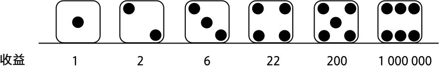

图2-1　骰子游戏的卡通收益概况图（单位：美元）

现在，我们有了一个简化版的游戏，来了解丹尼尔·伯努利处理悖论的方法。（自此，我们将这一简化版称为圣彼得堡赌博——如果想将从这里学到的一切应用到以后的案例中，你尽可以自己去尝试，你会有更大的收获。）

赌注的算术平均数或期望值是每个可能结果的算术平均数：

·（1+2+6+22+200+1000 000）美元/6=166 705美元

166 705美元离无穷大还差得很远，但是相对于大多数人愿意接受的押注金额来说仍然很高。（我本可以将掷出6点的收益设得远高于100万美元，但没这个必要。）如你所见，六次投掷中有五次会让你后悔在这场游戏上押注了近166 705美元。

伯努利首先展示了他的第一个原则——赌注的公允价值“取决于估算者的特定情况”，因此需要以玩家总财富的百分比来表示。这意味着你的可承受财富损失（损失带来的伤害程度）比例，决定了你在赌博时所冒的风险。某一损失“对穷人来说比对富人更惨重”，这话言之有理。使前者破产的金额对后者来说可能只是一个四舍五入后可以忽略不计的零头。显然，他们将获得两种截然不同的建议。

假设你的初始总财富为10万美元，你决定在一次投掷中下注一半，即5万美元。（顺便说一句，你有沉迷赌博的问题。）每种掷骰子的结果对应的情况如图2-2所示：

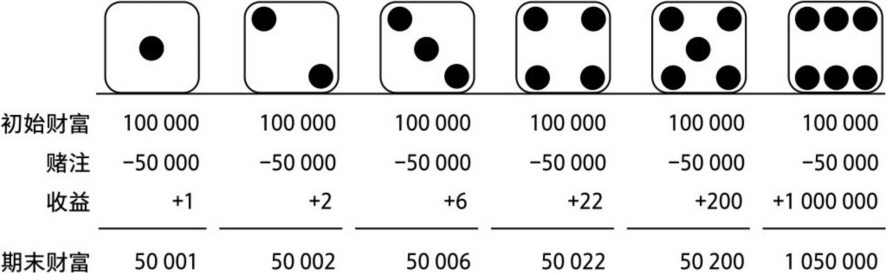

图2-2　圣彼得堡赌博的期末财富（单位：美元）

这里没什么新发现。你的期末财富平均数或期望值是216 705美元（平均收益与之前相同，为166 705美元，加上你10万美元的初始财富，再减去你5万美元的赌注）。216 705美元比10万美元的初始财富要高，但你仍然不太可能押注5万美元玩这个游戏，因为你可能会在六次投掷中的五次损失近50%的财富。但究竟下注多少并无惯例。如果你的下注金额不是5万美元，那该是多少呢？

## 平均效用

伯努利在1738年的论文中提出的核心概念是一种奇特的数学评估，他称其为平均效用（emolumentum medium）。当他的论文最终由拉丁语译成英语时（令人难以置信的是，直到1954年才出现英译版），emolumentum被译为“效用”（utility）或“道德”（moral），因此emolumentum medium被译为“平均效用”（mean utility），甚至“道德期望”（moral expectation，借用瑞士数学家加百列·克莱姆的叫法）。

然而，emolumentum更准确的翻译是“优势”（advantage）、“效益”（benefit），甚至“利润”（profit），medium的意思是“中间的”“平均的”，或者更确切地说是“在中间”。（如果伯努利的emolumentum medium指的是类似于圣彼得堡赌博中潜在利润范围的中间值，那么，其发现就非常有价值。我们稍后会了解这一点。）

尽管伯努利的方法被经济学家以“边际效用递减”的形式忽视了一个多世纪，但最终开始渗透到经济学领域。边际效用递减意味着你拥有的某物越多，下一个新增单位对你的意义就越小。反之亦然，你拥有的某物越少，下一单位的损失对你的意义就越大。这适用于食物、房子、鞋、手机、法拉利、山羊等等（好吧，也许不适用于山羊）。我们可以用“财富”来替换“某物”，将其一般化。我认为，“边际效用递减”的最佳描述来自我的间接投资合伙人伊恩·弗莱明。在其著作《太空城》中，他写道：

睡前，他陷入了深思，思考着一直萦绕于心的问题：牌桌上的胜利。赢家的收益总是比输家的损失少，这一点颇为奇怪。

从某种意义上说，伯努利已经预见到风险厌恶。尽管人们没有意识到，伯努利的发现确实让风险厌恶成为一种赘述。“一鸟在手胜过二鸟在林。”但当你的鸟以复利计算（或繁殖）时，倘若你在尝试获得两只鸟的同时失去了一只，那么你损失的就不止两只了。

边际效用递减概念是边际革命的一个基本原则，尽管发起人并没有提到伯努利。边际革命指的是19世纪70年代早期，从古典经济学到现代主观价值理论的重大转变。人们通常认为，边际革命是由奥地利的卡尔·门格尔、瑞士的里昂·瓦尔拉斯和英国的威廉姆·斯坦利·杰文斯独立发起的。在边际革命的创新中，这三位经济学家解决了所谓的水与钻石悖论：为什么水对生命至关重要，而钻石的市场价格却比水高？某物的价值与我们的拥有量有关。一般来说，人们可获得的水量超过了满足各种用途的需求，因此，水的市场价值“在边际上”极低。但如果在沙漠中快要渴死了，你肯定会用钻石换一杯水。随着库存的增加，特定商品的边际效用递减。这个想法听起来很简单，但如果没有它，经济学家就很难解释市场价格。

边际革命的早期先驱者并没有真正接纳伯努利的框架，因为他们在确定性而非偶然性的背景下发展了效用和价值的新方法。直到1944年，冯·诺伊曼和摩根斯坦发表了关于博弈论的著作，不确定情况下的行为建模才开始成为前沿和核心。与伯努利一样，冯·诺伊曼和摩根斯坦假设理性主体通过最大化某个目标函数的期望值来处理不确定性。时至今日，经济学家仍将这种目标函数称为伯努利函数，或冯·诺伊曼-摩根斯坦效用函数，以此向该方法的提出者致敬。

有些人认为，伯努利主张所有人都在特定的效用函数下活动。这一观点让伯努利在去世后的多年里遭受了许多不公平的抨击。伯努利的目标函数甚至常年被用作累进所得税的理论依据——无论是否公平，他都被贴上了这样的标签。他甚至受到奥地利著名经济学家路德维希·冯·米塞斯和穆瑞·罗斯巴德等人的嘲讽，他们将愤怒集中到伯努利以函数形式表现的特定应用上。然而，在我看来，这些人忽略了他更广义的观点——该观点与奥地利学派完全一致。

伯努利的创新在于对其常识性见解的简单扩展，即盈亏必须以某人的总财富来衡量，因此“增加的财富无论多么微不足道，都将导致效用的增加，而它与已有的财富总量成反比”。（想一下：如果史高治·麦克达克赢了100万美元，他可能不会注意到。但是，如果街角的流浪汉赢了100万美元，甚至10万美元，那就有可能改变他的生活。他们获得的财富价值是相对于已有财富而言的。）

伯努利将这一概念转化为一个简单的函数形式。当这种关系在无穷小的增量上积分，或者转化为连续情形时，我们就得到了（自然）对数：

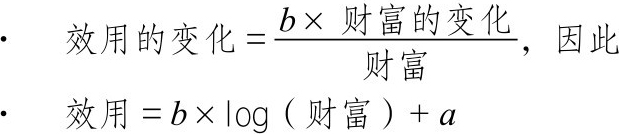

简单地说，效用是财富的对数。（用专业术语说，它与财富的对数成正比，而a和b的值对我们来说并不重要。）

伯努利用以下“基本规则”定义其平均效用：

如果将每个可能的期望利润的效用乘以它可能发生的次数，用乘积之和除以可能情况的总数，就会得到一个平均效用，与之对应的利润就是相关风险值。

用数学术语来说，伯努利的平均效用（EM）是所有可能的期末财富对数的平均数。在圣彼得堡赌博的例子中（我们拿出总财富10万美元的一半来下注）：

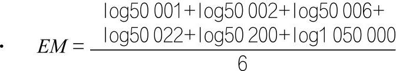

“与此效用对应的利润”就是所考虑的伯努利“值”，即伯努利期望值（BEV）。（对受过数学训练的人来说，为了从对数映射回利润单位，他们需要指数，或者对数的反函数）：

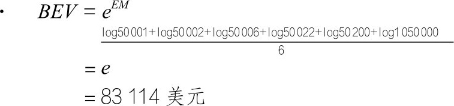

现在，你明白了，取所有可能的期末财富结果的对数的均值的指数，你就得到了在这场赌博中你的财富的伯努利期望值。说起来很拗口，但真的很简单。

让我们进一步简化：当你的总财富为10万美元时，不要在圣彼得堡赌博中下注5万美元，因为基于赌博后可能的期末财富结果的对数的均值，下注5万美元的伯努利期望值低于你的现有财富（目前10万美元的财富比83 114美元的BEV还要多）。换句话说，在10万美元的确定财富和83 114美元的圣彼得堡赌博期望值之间做出选择，你显然会选择10万美元。因此，对初始财富为10万美元的人来说，在骰子游戏中下注5万美元会让他们变得更穷。

## 几何平均

伯努利似乎对风险感知给出了一种心理学解释，创造了各种机会让人们体验理论和数据的数学折磨。你可以大致了解到，多年来学术界是如何处理这一问题的（具体来说，经济学家认为伯努利假设人们拥有财富的对数效用函数）。但是伯努利真正的想法与此截然不同。

他对对数函数的使用并非一种随意的假设，也不是想给人留下运用深奥数学的严谨印象。相反，它是基于真实世界的物理现实。让我们来了解一下其中的含义。

对数函数可以追溯到大约4 000年前的巴比伦人，更正式的说法是，源于17世纪的瑞士钟表匠比尔吉和苏格兰数学家纳皮尔。他们发现了（正数）乘法和加法之间简化的映射关系：加（或减）两个数的对数，就可以得到这两个数乘积（或比率）的对数；类似地，将一个数的对数除以n，可以得到该数的n次方根的对数。（直到今天，对数仍然被用于这一目的，如计算尺的功能一样，它可以帮助古代学者快速地将乘法问题简化为加法问题。）

你看，从乘法到加法的映射轻松地让我们将伯努利的期望值公式重述为更易理解、更有意义的几何平均：

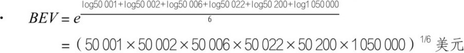

如你所见，几何平均是相乘的。不同于将所有数据点相加的算术平均，在几何平均中，我们将它们全部相乘。然后，我们需要缩小尺寸。在算术平均中，这一步是通过将加法总和除以数据点的数量（假设有n个数据点）来实现的。在几何平均的情况下，这一步是通过取其乘积的根来实现的（具体地说，是n次方根，或者乘积的1/n次方）。几何平均无疑是算术平均的配角，因为人们通常只会关注算术平均，它是我们在使用“平均”这个术语时所想到的。然而，就投资而言，几何平均不应该再充当次要角色。

别担心这里的数学问题。重要的思想是，一场赌博的伯努利期望值只是所有可能的期末财富结果的几何平均数的数学等价物，是以对数形式包装的巧妙的目标函数。

伯努利没有明确说明这一切是如何运作的，但他依赖于这一方法。这是他的全部观点。正如伯努利所说，他的平均效用“暗示”了一条规则，即取期末财富的几何平均数，不必直呼其名，也不必为其提出更多的经济案例。关于使用几何平均数来评估风险性赌注的问题，他甚至这样写道：“该方法既实用又有独创性，如果不是因为之前的职责限制了我，我会像传统分析一样，将其阐述为一个完整的理论。”

最终，伯努利冒险将财富结果的几何平均（而不是期望值或算术平均数）作为“衡量风险价值的基本原则”。他是该理论的创始人，后来的事尽人皆知，这里就不赘述了。在接下来的章节中，我们将看到，它真正改变了一切，尤其改变了我们对风险缓释的理解。

但现在，让我们回到之前提出的问题。在圣彼得堡赌博中，你愿意付出的最大赌注是多少？假设初始财富仍是10万美元，我们可以再举几个例子。

我们已经确定你有赌博成瘾问题，这次你破釜沉舟，把10万美元都拿来下注。图2-3是可能的期末财富结果及其几何平均数：

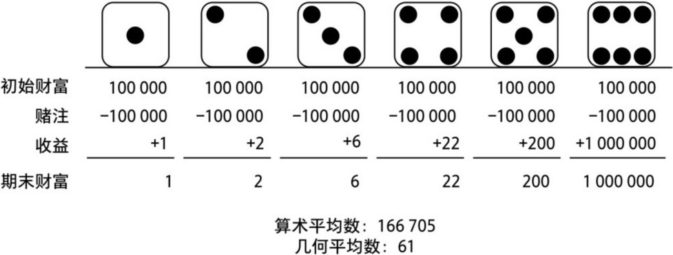

图2-3　可能的期末财富结果及其几何平均数（单位：美元）

糟糕，仅仅61美元。如果只下注财富的10%，即1万美元会怎样？如图2-4所示：

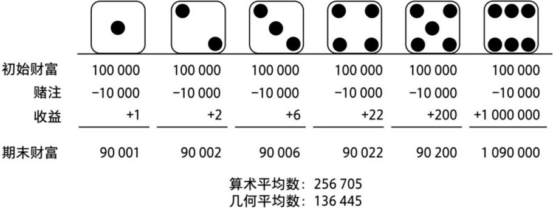

图2-4　只下注财富的10%（单位：美元）

现在你的几何期望值是136 445美元，终于比你的初始财富10万美元高了，这很好。我们可以继续尝试更多不同的赌注（以初始财富10万美元的分数值表示），将结果绘制在图2-5中，然后查看每次下注后期末财富的几何平均数。期末财富期望值超过10万美元的点是赌注的公允价值，以10万美元的分数值表示。

在初始财富为10万美元的情况下，基于所有结果几何平均数的盈亏平衡，在圣彼得堡赌博中，赌注的公允价值为初始财富的37.7%，即37 708美元。以这个金额下注，你才有利可图。

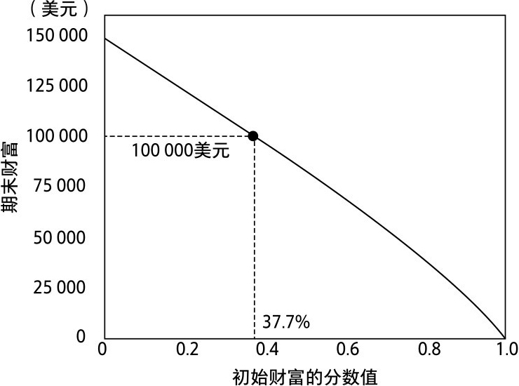

图2-5　在初始财富为10万美元的情况下，圣彼得堡赌博的赌注公允价值研究

## 另一个圣彼得堡悖论

伯努利将圣彼得堡悖论的解决方案放在论文结尾，只占很小的一部分。他的主要关注点是方法论。在论文中，伯努利简要提到了另一个鲜为人知的悖论，这是一个更实用的案例研究，也更惊险刺激、妙趣横生。

该问题涉及一位圣彼得堡商人，他在阿姆斯特丹购入货物，想将其运回圣彼得堡，以获得可观的利润。但将这些货物经波罗的海运往约1 100海里之外的圣彼得堡，面临着巨大的财务风险。这听上去是一段不错的旅行，但那时毕竟是海盗的黄金时代，可怕的丹麦人，“波罗的海的杰克”经常驾驶“猝死号”海盗船，抢劫进出圣彼得堡的货船。（他是一个罕见的、真正毒辣的海盗，在弄沉被截获的船只之前，他会将所有受害者赶到甲板上，让他们与船同归于尽。）考虑到这种状况，商人该如何具有成本效益地降低风险？

假设这位圣彼得堡商人打算出售的货物净值（扣除运费等）为1万卢布，此外，他还有3 000卢布的积蓄。（这是一笔杠杆交易。）货物在圣彼得堡售出后，他的总财富为1.3万卢布。通常情况下，每100艘从阿姆斯特丹开往圣彼得堡的船只中，就有5艘被海盗劫持或被海上风暴摧毁，即这个商人损失1万卢布的概率为5%。或许某些风险缓释措施会派上用场，比如保险。打个比方，商人能找到的为其1万卢布货物投保的最佳保费是800卢布（他认为“高得离谱！”），一点儿都不划算。他的判断似乎是对的：根据历史数据，这份合同的精算期望值是（-800×95/100）+（9 200×5/100）=-300。这的确会消耗他1万卢布货物的期望收益。如果不降低风险，这次海运的风险可能会超出他的承受范围。但保险业似乎是输家的游戏，只是在利用客户的恐惧。正如计算所示，收取的保费高于精算的“公允”金额。圣彼得堡商人面临着风险的两难困境。

于是，他考虑了其他风险缓释策略，比如分散风险。事实上，伯努利强调这是其方法论的逻辑推导。（因此，有人认为伯努利是“分散化”概念的首创者，该说法是正确的。巴塞尔大学比芝加哥大学早200年提出了这一概念——抱歉，孤陋寡闻的人。）伯努利提出了一个聪明的建议：“明智的做法是，将有风险的货物分成若干份，而不是将其全部置于风险中。这是一条规则。”

对圣彼得堡商人来说，分散风险说起来容易做起来难。他与合作多年的托运人达成了合理的运费交易。如果终止合作，转而委托其他托运人运送数量较少的货物，他就要支付更高的运输成本。更重要的是，波罗的海不是大西洋，来往的船只较少，可选航线也不多。幻想老杰克会让几艘船安然无恙地驶过，那可太天真了。即使幻想他们隔几天选一艘船来抢劫也几乎是天方夜谭，任何分散价值都可能被夸大。（这与今天金融市场分散化的缺点惊人地相似，我们将在后面讨论。）海盗和天气的风险分散就别去想了。

我们的这位商人只能租一艘船，只能面对杰克船长和波罗的海的威胁。当这艘船离开港口时，随后可能发生的所有事情只会有一个结果。换句话说，他只能从庞大的可能性样本空间中抽取一个结果。（他的N等于1。）当然，他希望自己在商贸生涯中有不断押注的机会，从而随着时间的推移实现分散化，但一次1万卢布的损失真的会让他一败涂地。降低风险的其他方法是，用一艘较小的船装载较少、较廉价的货物，或者将其部分利益让给合作伙伴。有时候，这可能是一个好策略。他甚至可以决定不起航，让船停在港湾。但他相信，一定有更好的办法。他不想打退堂鼓。让自己暴露在公海及潜伏其中的海盗的风险之下，是他保持成功商人身份的唯一方法。他将自己的座右铭挂在圣彼得堡办公室的墙上：“停在港湾里的船是安全的……”

（约翰·奥古斯都·谢德后来写下了它的下半句：“……但那并非造船的目的。”）

商人需要对自己的财务命运下注。他日夜不休，根据“猝死号”的行踪和航行模式报告，以及大量的天气报告和天气预报，策划着波罗的海的航线。他将此视为自己的寻宝图，用来为贵重的货物导航，以避开险恶的海盗和风暴带来的财务灾难，到达大洋彼岸的避风港。但是，所有的努力最终不过是螳臂当车。

如果这位商人研究的是丹尼尔·伯努利的理论，而不是那些不实的海盗情况报告和天气预报就好了。

伯努利的框架本可以为他提供直觉，解决反直觉的问题：我们从总财富开始，商人有3 000卢布的积蓄，加上他在圣彼得堡出售货物后能得到的1万卢布，总和是图2-6中的A点。接下来，我们减去800卢布的保险费，从A点移动到B点，从B到C的垂直线是对数成本。（你可以在右侧看到放大图）这是保险成本。从A点到D点是潜在损失，即货物的海运总损失1万卢布，其对数成本由D到E的垂直线表示（被截获的商船沉入深海）。

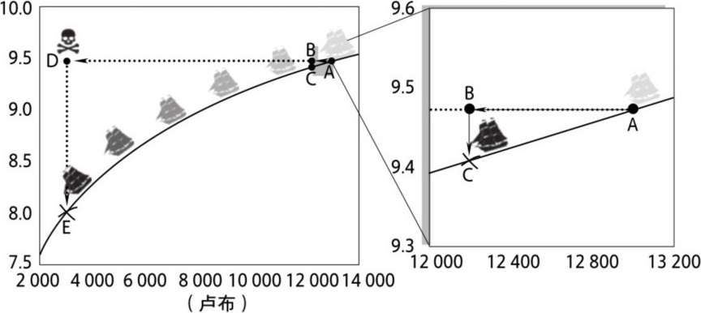

图2-6　沉入深海：圣彼得堡商人贸易图

水平线上从A到B的100次损失（100次海运的保险成本）之和超过了从A到D的5次损失之和（预计100次保险有5次索赔）。均差为-300，这是商人购买保险的期望损失（以及给保险公司的期望精算利润）。然而，垂直线上从B到C的100次损失之和没超过从D到E的5次损失之和，二者甚至相差很大。这表明，以800卢布的价格购买保险消除了1万卢布的损失，这将对商人所有可能结果的几何平均数产生影响。

这就是我所说的“圣彼得堡商人贸易”（尽管对可怜的商人来说，它仍是一个谜）：它是一种风险缓释策略，可以降低投资组合中的正当风险，从而防止其跌入对数曲线。在合适的价格下，它本身可能会赔钱（在本例中，平均每次海运的损失是300卢布），却会提高投资组合的复利率和期末财富。

这就是圣彼得堡商人贸易的决定性因素：其风险缓释的算术成本被几何效应大幅冲抵，因此其投资组合净效应为正。让它再发酵一会儿吧。

如果没有几何平均数的对数捷径，这种投资组合净效应真的难以想象，更不用说相信它了。事实上，它太难理解，以至我们的圣彼得堡商人忙着策划他的航线，根本没有注意到这一点。

请注意，在对数图上，如果你曾经遭受过一次100%的单周期损失，在x轴上一路向0跌落，跌至曲线之下，那么游戏就结束了。你失去了所有财富，未来的利润也无法弥补。当一连串的总收益不断以复利相乘，只要有一个“0”，整个结果就都归零了——这就是为什么当x趋于0时，x的对数趋于负无穷大。简言之：赌上全部，输掉全部——再也无法起死回生。

相比之下，如果我们计算的是算术平均数，那么加上总收益0并不是灾难性的，它只是把平均数拉低了。

算术损失（由水平线表示）只是一种幻觉，只存在于永恒的世界。因为这些水平线上的增量损失在以复利算计的情况下并不相同，它们在商人的会计账本上不是简单的相加——这就是他对正确的会计核算视而不见的原因。

而垂直线上的损失才被真正加到了商人的期末财富上。商人只关注水平线的利润和损失，将其相加（或平均），得出结论：这种风险缓释是一种净成本。他相信，自己要付出比保险“精算价值”更高的费用。

他没搞明白的是，通过将垂直线上的利润和损失相加（或平均），他得到的是财富的真实情况。他也不明白，为什么购买（看似）“定价过高”的保险是值得的。

像伯努利那样，以可能结果的几何平均数来分析该案例，我们可以对商人不投保与投保的情况进行对比。投保情况下的几何平均数是3 000卢布加上1万卢布的收益（该收益要么通过出售货物获得，要么来自保险公司）减去800卢布保险费，即3 000+9 200=12 200卢布。另一方面，如果没有保险，其几何平均财富是3 000卢布加上95次海运的1万卢布，而在5次海运中，他只能得到原来的3 000卢布（1万卢布的货物被杰克船长抢走了）。因此，就像在圣彼得堡赌博中一样，我们得到伯努利几何期望值：

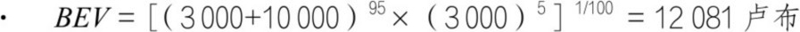

奇怪的是，保险合同并非零和博弈。商人有几何期望值收益（从12 081卢布到12 200卢布，或每次海运多得119卢布），保险公司有精算算术期望值收益（每次海运300卢布）。因此，接受保险合同，商人和保险公司都能获益（在双方各自的框架下衡量）——这是一种双赢，一种互惠互利的协议。

商人并不知道，保险费既高得离谱，又低得离谱——两者同时存在。这就是第二个圣彼得堡悖论。

现在，从经济学的角度思考几何平均数在该案例中的含义。算一下商人在每次海运中获得的利润，即从这次海运所需的资本投资中获得的总收益。总收益率是期末财富除以初始财富，期末财富等于初始财富加收益。

比如，他需要为获得1万卢布的货物销售收益投资8 000卢布。这意味着他的初始财富为3 000+8 000=11 000卢布。如果成功，他最终会得到3 000+10 000=13 000卢布，总收益率为13 000/11 000=1.18（或18%的利润）。但如果失去了货物，他最终只能得到3 000卢布，总收益率为3 000/11 000=0.27（或73%的损失！）。

当然，我们的商人在圣彼得堡卸货后并不会收手。这是他的生意，他打算做到不能做为止，他要在一次次海运上不断下注。其目标是以复合方式来增加资本，即在下一次海运所需资本的基础上加上（或减去）之前的每一笔盈利（或亏损），从而实现资本的几何级增长。复合和几何级指的是某物的数量与该物成比例地变化或增长，比如商人的财富。复合增长或几何级增长就是乘法增长，由收益的几何级数表示，其中每个后续结果都由前一结果乘以下一总收益来确定。（这是与总收益率打交道的美妙之处。）每次输出都成为新的乘法输入，它是一个递归映射。

如果商人的总收益率为0.27，或损失73%，他需要270%的利润才能实现盈亏平衡。这是一种隐性财富税。（因此，他的海盗情况报告和天气预报最好是准确的！）情况越来越糟糕，损失越来越惨重，如图2-7所示：

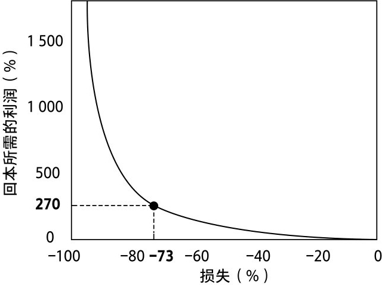

图2-7　隐性财富税：损失越大，回本所需的利润越大

这只是思考对数图意义的另一种方式。（水平翻转这条曲线，它会变成对数曲线。）

假设商人在接下来的100次海运中，有5次全部损失（与预期完全一致）。在这种情况下，每批货物的几何平均总收益率——或者大家更熟悉的复合增长率为：

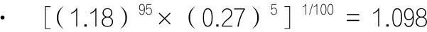

果然，他的初始资本11 000卢布乘1.098等于12 081卢布，这是他在一次海运后的几何期望财富。（这些总收益率的计算假设是，商人在每批商品上的再投资占总财富的比例相同，我们不必担心这一点。）

每批货物在不投保的情况下，他可以期望财富以9.8%的速度增长，这么做风险很大。在投保的情况下，他的财富会以12 200/11 000=1.11（即11%）的速度增长——他将在无风险的情况下实现更高的收益率。

这是一个奇怪的概念，很多保险从业者可能都无法完全理解。（现代金融投资从业者肯定不能理解。）这应该会让你大吃一惊。在这个例子中，我们已经看到，投资一份可能会产生期望损失的资产（保单），可以在消除投资组合中所有风险的同时，提高投资组合的期望收益率。我们的例子与金融学者奉行的一般规则之间的差异一目了然。

这正是几何平均数真正具有经济意义的地方：提升价值的不仅仅是对一批货物的押注，而是这一结果对后续持续押注产生的迭代、倍增影响！巨额亏损不成比例地降低了商人的几何平均收益率，因为这导致他只能在更低的赌注或资本基础上进行再投资和复合增长。而当他用保险来抵御风险时，对数损失显示了真实（更高）的增值。

可悲的是，这位圣彼得堡商人永远不会知道，因为他从不以这种方式思考。

其中的奥妙是，如果要赌一把，你最好在同一场赌博中反复下注，多次以复利计算——永不放弃——不管你是否真的愿意。无论赌一次还是100万次，几何平均收益率都是最重要的。

## 曲线的凹性

显然，伯努利本可以只谈论“几何平均数”，然后就此打住（这会让几代经济学家免于陷入效用理论的兔子洞）。他的对数目标函数只不过是学究的小把戏。那又怎么样？我们不需要数学捷径和计算尺，只需要输入数字，然后继续前进。

在使用对数函数的过程中，伯努利为我们提供了一种思考问题的方法，该方法可能无法自然而然地获得。正如我们在“圣彼得堡商人贸易图”中看到的——算术收益率转变为几何收益率，对数函数使我们能够更好地思考几何收益率的持续、递归累积。它让以复利计算的数学变得直观，让我们能够正确地看待和思考初始收益——随着时间的推移，它会影响我们的财富。如果没有这张图，我不确定我们是否会以这种方式思考。

这正是伯努利使用对数函数的意图。我们不再像以前那样，简单地以原始的、线性的、算术的形式，一次一结地将收益或损益视为“只关乎自身”的独立事件。我们需要通过对数函数的透镜来看清收益的真相。换句话说，通过几何平均数来看待收益。

但问题是，算术平均的数学是直观的，复利的数学却不太直观。我们的损益和所有会计账本的核算方式都是算术的，我们也以算术的方式体验生活——一件事接着一件事。线性思维和几何思维差异巨大，这种差异对我们理解风险，以及理解损失对财富的灾难性影响至关重要。但这是非常反直觉的。你面对的是一个不易理解、令人不悦但极其重要的事实：

你的原始线性收益是一个谎言，你的真实收益是扭曲的。

伯努利所提倡的通过对数函数计算收益的方法是规范的，而非实证的。以期望财富或收益的几何平均数而不是算术平均数作为决策的基础，伯努利向我们展示了我们应该如何看待风险，而非我们必须如何看待风险。这正是经济学家误解他的地方。

事实上，1979年，行为经济学家丹尼尔·卡尼曼和阿莫斯·特沃斯基提出了一种不确定性下的决策理论，即前景理论。该理论认为，人们的边际效用像对数函数一样，随着收益的增加而递减，也随着损失的增加而递减（这一点与对数函数的边际效用随着损失的增加而增加完全矛盾）。如果前景理论是正确的，它就可以解释人们不按伯努利的建议行事的原因（至少在投资中）——因为他们没有伯努利所推荐的目标函数，也可以解释人们经常忽视重大风险的原因。（解释不需要宏大的阴谋论，只需要一点儿人性。）

作为投资者，我们所做的是对这一对数目标函数进行数学优化，从而最大化我们的几何收益率。这种数学最优化是一种损失或成本函数，它将原始收益映射到投资组合的复利和成本上。因此，目标是最大化损失函数，或最小化成本。

以复利计算的数学被转化为目标函数。它以数学形式描述风险和损失的后果，成为衡量风险的一种方法。它向我们展示了复利的最重要因素。它是一个风险执行者，关注哪些风险是致命的，哪些不是。

无论我们是将伯努利的基本思想解释为对数效用最大化准则（正如经济学家，甚至大多数数学金融界的学者所描述的那样）、几何平均数最大化准则，还是简单地解释为随着时间的推移以复利计算损益来保护财富的方法，都无关紧要。如果你从本章的讨论中一无所获，如果数学让你茫然失措，那么请记住：通过将对数函数作为我们的目标函数，作为评估风险赌注最有效的方法，伯努利无意中揭示了评估风险赌注的最佳标准——几何平均数。算术收益率是虚假的希望，真相在于几何收益率。

该准则是伯努利的另一个原理。如果不违反第一个伯努利原理，我们可以防止飞机坠毁；如果不违反这个原理，我们可以防止投资组合失败。（在我活跃的投资试验阶段，这种联系产生的结果令人非常满意。）

## 对数莱茵河瀑布

伯努利对流体的湍流现象有着浓厚的学术兴趣，我们很容易想象这样一幅画面：他用一整天的时间，从巴塞尔沿莱茵河上游漫步到沙夫豪森的莱茵河瀑布——欧洲最大的瀑布。我们也很容易想象层叠的悬崖，即伯努利所说的曲线的凹性：当你从悬崖落入深渊时，看似平静的水流越来越湍急，越来越汹涌，你可能永远也回不去了。危险很难被察觉，直到为时已晚。越往下，你坠落得越快，生还的可能越小。（最终你会被负复利的隐性财富税淹没。）希望这可怕的情景能铭刻在你的脑海中，帮助你轻松理解对数函数在投资中的意义。

伯努利将曲线的对数凹性描述为：“大自然告诫我们，绝对不要掷骰子。”我们将持续看到，即使是“绝对公平”的骰子游戏（投资游戏）也可能极为不公。最好避开它们。

因为对数是一个向下弯曲的凹函数，原始收益的负值越大，它的惩罚就越大。损失越惨重，造成的危害就越大——远远超过同等规模的利润所能弥补的程度。损失越惨重，几何平均收益率就越低（正如我们在图2-8中看到的，圣彼得堡商船沿着曲线下落，坠入瀑布）。

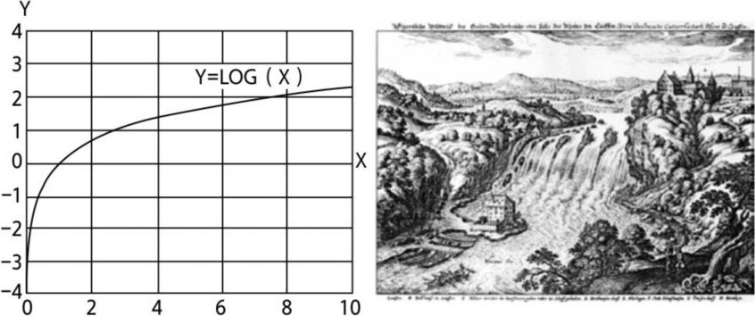

图2-8　对数曲线和对数莱茵河瀑布

我们生来就了解曲线凹性——它深入我们的骨髓，渗透到人类关于投资的集体智慧之中。今天，我们听到的最实用的告诫也许是来自格雷厄姆的“本金的安全性”。还有一句来自他最优秀的学生沃伦·巴菲特，巴菲特强调复利资本需要遵循一个基本原则：“不要赔钱。”现在我们真的“知其所以然”了。

结论显而易见：收益是有限的，风险是无限的。你需要避免坠入对数伯努利瀑布！到目前为止，这是避险投资中最重要的概念——不，是所有投资中最重要的概念。

最后，该解决圣彼得堡悖论了。如果得到下次赌注的平均对数收益率的指数，你就可以得到几何收益率，你可以通过对同一赌博持续下注得到期望的几何收益率。不需要一直运行机器来解决这个问题。你最好关注下次赌注的平均对数收益率的指数。

所以，你看，对数不仅仅是一个智力概念、心理学理论或神秘的量子模型，它不需要对收益率分布做任何假设或预测。相反，它是一个物理事实。确切地说，是关于复利和投资在现实世界中如何运作的物理事实。正如我们所看到的，在圣彼得堡商人贸易中，算术成本可以被几何效应大幅冲抵，这就是原因所在。在后面的章节中，我们会对此有更清晰的了解，现在让它继续发酵吧。
