# 第三章 永恒轮回

## 生存要事

1869年，年仅25岁的弗里德里希·尼采被瑞士巴塞尔大学聘为古典语文学副教授，后被任命为教授。争论不休的伯努利家族成员也曾就职于这所大学。（这是一个具有重大历史意义的地方，是知识产出的中心。）尼采在这里担任教职有10年之久，如此年轻就获得这样的成就，是闻所未闻的。

比起城市生活，尼采更喜欢乡村生活。只要有机会，他就会离开巴塞尔，前往瑞士的乡村。他钟情于莱茵河上游沿岸的森林，比如丹尼尔·伯努利的对数莱茵河瀑布周边的森林。瀑布“飞流直下，奔向无垠”，隆隆的响声激发了他的灵感。据说，他的作品与此地有着特殊的联系。

遗憾的是，他的健康状况越来越差。因此，他突然决定离开巴塞尔，去过退休后全职流浪作家的生活。他放弃了普鲁士公民身份，多次求婚都以失败告终。在短暂生命的最后20年里，尼采成了一个远离尘世、居无定所、没有国籍的哲学家（梅毒所致精神障碍吞噬了他最后的10年）。他在尼斯、热那亚和都灵过冬，在瑞士恩加丁山谷圣莫里茨附近的锡尔斯-玛丽亚避暑。夏天，他在恩加丁森林的山中徒步，与山羊和绵羊为伍（他相信，“只有在徒步中产生的想法才有价值”）。他最著名的徒步旅行路线是席尔瓦普拉纳湖沿岸（我强烈推荐这一路线，最好在冬天乘着雪橇蜿蜒而下）。1881年的某天，尼采正沿着湖边行走，一块小鹅卵石从金字塔状的岩层上飞溅而下，就像巨石从崎岖的悬崖上坠落，他灵感乍现。一个基本原理诞生了，那便是他所谓的“永恒重现”或“永恒轮回”。

尼采最终在1885年将“永恒轮回”写入其巨著《查拉图斯特拉如是说》，这是一本类似《圣经》的寓言书。不过，他先放出了一个引子来介绍它。在1882年《快乐的科学》（与经济学领域真正“沉闷的科学”无关）一书的结尾，他以“最大的权重”为题，提出了一个思想实验：

如果某天或某晚，一个魔鬼潜入你内心最孤独之处，对你说：“你将不得不一次又一次、无数次经历自己过去和现在的生活，永无止境；其中不会有任何新花样，你生命中的每次苦乐、每个想法、每声叹息、每件难以言表的大事小情都将重演，一切都将以不变的顺序出现——甚至是这只蜘蛛和这树间的月光，甚至是这一刻的情景以及我的出现。永恒存在的沙漏一次次翻转，而你如一粒尘埃，与它同在！”

你会站直了不被击倒，咬牙切齿地咒骂说这话的魔鬼吗？或者，你曾经体验过美妙的时光，完全可以这样回答他：“你是神，我从未听过如此神圣的话。”如果你思考下面这个问题，它或许会让你改变，也或许会将你压垮。“你想再次经历乃至无休止地经历你的人生吗？”这个问题无处不在，它将成为你行为最大的权重。你有多大意愿成为你自己，去过这样的生活？

必须承认，第一次读到这段话时，我如醍醐灌顶。我开始用不同的眼光看待事物。每一刻似乎都慢了下来，不知怎的变得完美了，即使事实上并非如此。但它必须如此。尼采称永恒轮回是他“最高级的确认公式”——对生命的确认。在《快乐的科学》中，我还发现了一些特别适用于投资的内容，这些内容是我以前无法明确指出或阐明的。

投资行业充斥着太多混乱、肤浅的叙述。人们动作太多，行动太少。有一些关于冒险和保守时机的宏大预测，但这些预测忽略了结果。智者谈论着通过分散化来避险，称其为“金融界唯一免费的午餐”。他们使用几乎无人愿意去理解的金融工程术语，将风险分散到不同的资产上，以期获得更安全、更平庸的平均业绩。不管付出什么代价，这种意图都是好的，至少这让人们躲过了灾难；尽管变得更穷了，但风险调整后收益率很高。

投资行业传统的风险缓释方法具有欺骗性，且注定会失败。它严重歪曲了真相，几乎没什么实质性的内容和意义。它无视经济意义，偏向数量意义，并以避免不良结果的安全的名义接受不良结果。命运喜欢讽刺。

这是一个虚无主义的金融剧场。

投资不能只是大胆地押注我们聪明的期望值，然后表现得云淡风轻，好像完全不关注行动结果。“我是对的，但很不走运。”我们都知道，不能只根据结果判断决定的好坏——因为好的决定也可能产生坏的结果。但我们只有一个结果。如果尼采的魔鬼说的是事实，我们必须“一次又一次、无数次”接受自己的结果，你真的想一遍又一遍忽视同样的坏结果，直到永远吗？要成为更好的投资者，你需要一个更好的视角。无论我们是否接受尼采的观点，我都确信那就是更好的视角。

尼采的“快乐智慧”由来已久。这是一个古老的概念，关于循环往复的时间的概念。正如坐在金字塔形岩石上的森林矮人对查拉图斯特拉感叹的那样：“一切笔直的都是谎言，一切真理都是弯曲的，时间本身就是一个圆圈。”这个信仰贯穿于整个人类历史，体现在古玛雅人、阿兹特克人、埃及人、犹太人和希腊人的传统中（在古希腊，以毕达哥拉斯学派和斯多葛学派最为典型）。在西方，基督教在很大程度上终结了这种信仰，但在东方，它是印度教和佛教等传统思想的核心。（尼采甚至把永恒轮回称为“欧洲的佛教形式”。）

尼采写道：“你的任务是以你愿意再次经历的方式生活。”他的教导听起来似乎都是关于愿望的，但随后，他又说：“无论如何，你都会这样做（重复这样的生活）！”尼采似乎被“永恒轮回是宇宙事实”的想法吸引了。在未发表的笔记中，他甚至提出了物理证据，将永恒轮回作为物质现实来探讨。8年后，博学多才的法国数学家亨利·庞加莱在他的“复现定理（recurrence theorem）”中指出，某些机械系统将不可避免地永远回到任何给定的状态。庞加莱提出了比尼采更严谨的说法：“在存在这个大的骰子游戏中，（世界）必须穿过可计算的数量组合。在无限的时间里，每种可能的组合都会在某一时刻实现，甚至会无数次实现。”这意味着，我们不是在重复一条路，而是在重复所有的路。尼采的证明在此失去了一些分量，但他的探索值得肯定。

然而，在尼采看来，传统和科学的证据只是一种心理工具，用来说服或哄骗大脑相信永恒轮回，并将其内化——目的是“期盼”它。他在一封信中写道：“如果永恒轮回是真的，或者更确切地说，如果它被认为是真的，那么一切都会发生变化，甚至逆转，所有曾经有价值的东西都会贬值。”相信的行为远比信念的有效性更重要。尼采的“永恒轮回”旨在说明生存要事应该是什么。就像伯努利的平均效用一样，它是规范的，是一种内部评价指标，是我们行动的视角或指南，它并不是一个实证主义的表述。本质上，它甚至是一个心理学假设：“你愿意一次又一次、无数次经历你的人生吗？”你会诅咒魔鬼还是亲吻魔鬼？

这个问题是成功投资的核心，尤其是避险投资的核心。像经历永恒轮回一样，愿意在未来获得相同的投资收益是一种强大的力量，它能让你保持定力。它会通过改变你的内部评价指标来改变你的投资方式：也就是说，走好这条路的价值超过了走好期望之路的价值。

你最终只能走一条路，即那条现实之路。想到这一点可能会让人略感不安，但真正理解这一确定无误的事实正彰显了“永恒轮回”思想实验的强大。无论你是否真的在无数次重复这条路，只要你相信自己愿意走好这条路，它的使命就已经完成了。你需要的只是按自己的意愿行动。认真思考尼采的思想，它会产生巨大的影响。最大的权重将彻底改变你的秉性气质。可以说，作为投资者，最重要的是好性情。

生命只有一次，但命运由一系列结果构成。某个已发生的结果当然不是注定的（尽管我们的老祖先可能不同意这个说法）。与这一现实相反，尼采的魔鬼抛出了一个心理挑战：更关心如何把事情做好，而不是漫不经心地与命运博弈。在尼采的思想实验中，样本量等于1，尼采的N=1。他的魔鬼让我们意识到这一点。

正如我们在圣彼得堡赌博中所了解的，由于复利倍增的存在，我们拥有的不全是累加的时刻。我们无法玩全套游戏，尽管看起来可以。我们只能从无限的样本空间中选择一个结果。因此，在可能的结果范围内，我们无法承受太多的抽样误差，也不能执着于可能的期望值。在现实世界中，事物甚至没有明确、一致的期望值。但这不是重点。当N=1时，概率论的方法失效了。

理解这一点不太容易，更难的是在行动上与现实保持一致。尼采的目的是明确你正在走的这条路的意义，忽略其他一切。承认吧：你将永远走这条路。让所有其他可选之路都见鬼去吧，让你对概率、期望值和风险的推测见鬼去吧。不再说：“哦，我只是运气不好，但我的期望值是对的！”我们可不能奢求只在期望值或理论上正确就够了，我们必须事实正确。我们只有一次机会，这就是问题所在。

这当然并不意味着期望值无关紧要。永恒轮回有利有弊。专注于这条道路意味着，无论多么艰难，都不要屈服于任何有着糟糕期望值的路。同样，它也意味着不要去痴想难以实现的丰厚的期望值。是的，在投资中可以重复尝试。有时，在选择的那条路上，我们需要多次尝试。但那不是必然的。更大的可能是，你的尝试或试验比你想象的要少得多。最可能的情况是，你只需要尝试一次。

贝比·鲁斯能放手一搏是件好事，尽管这一策略让他保持了30年的三振出局纪录（后来，米奇·曼特尔打破了这一纪录）。但如果他在整个职业生涯中只有一次击球机会呢？他该如何做出决策？

在赋予这条路最大的权重之前，我们必须对每条可能的路心知肚明。要做到“万无一失”，我们必须对所选择的路怀有坚定的信心。这意味着，我们通过投资优化风险的方式是，无论发生了什么，我们都可以像尼采告诫我们的那样，宣称“这就是我的意愿”！就投资组合中风险缓释的作用而言，还有什么是比这更好的表态吗？

## 进入多元宇宙

罗伯特·弗罗斯特在《未选择的路》的开头写道（我父亲总是提醒我记住这首诗）：

黄色的树林中分出两条路，

可惜我不能同时涉足。

身为旅人的我，

在那路口久久停伫。

我们真的不能同时走两条路吗？如果我们能做到，那就会与永恒轮回背道而驰。如果我们能做到，那意味着什么？

想想上面的思想实验。我们假设，让你懊恼的是第二天或第二天晚上，另一个魔鬼潜入你最孤独的内心深处。这个魔鬼告诉你，你无须不断重温此生，而是可以经历无数次平行的、别样的人生。他大声说：“别相信昨晚那个魔鬼，你不必无限重复一种人生，你要过的是无限多种不同的、平行存在着的人生。”

你就是你自己的“薛定谔的猫”。这是奥地利物理学家埃尔温·薛定谔在1935年设计的一个思想实验。事件以这样一种方式发生：一只被关在盒子里的猫被随机下毒，猫的生与死同时存在。更准确地说，薛定谔的猫处于量子力学状态，当你试图计算这只可怜的、被虐待的猫（谢天谢地，是假想的）所有可能的生死状态时，计算可能会有点儿棘手，但在数学上是完全有效的。

根据这个新魔鬼的说法（我们称他为薛定谔的魔鬼），你也会同时经历苦与乐、生与死（但愿死亡不会发生）。你将生活在物理学家所说的多元宇宙中。就像永恒轮回一样，它是关于现实和时间的另一个假设概念。在多元宇宙中，无限多个宇宙共存。在这个版本中，从现在开始，发生在你身上的每件事，大事小情无所不包，都会衍生出一个新宇宙——也许是运气的随机变化，也许是你的临时起意，或者是其他任何情况。每条新路的每个新岔口，都会派生出你的一个翻版——另一个你。时间不再是尼采的循环，而是一棵树，无数树枝缠绕在一起。多元宇宙的整个样本空间包括所有的分支和事情可能发生的所有方式。

多元宇宙的概念得到了科学的支持，甚至可以通过实验进行间接检验。具有讽刺意味的是，它与尼采用以证明永恒轮回的“存在的骰子游戏”非常相似。量子力学想象一个被掷出去的骰子同时落在六个面上。这就像北欧的传说，骰子在投掷中奇迹般地分裂成六块，六个面在同一次投掷中全部出现。虽然我们从自己的宇宙的狭隘视角看，只能看到一面，但还有其他五个分支宇宙，每个宇宙都有各自的替代结果。骰子的每次量子投掷都成为一个新的分支点，平行的替代宇宙的分支不断分裂，不断繁衍，成为无限多元的宇宙。薛定谔的魔鬼告诉你，你将经历的就是这个多元宇宙。

听起来是不是很疯狂？思考一下：从这个角度看，你将真正了解作为赌场的感觉，你不断地用自己人生的骰子进行同步试验，一次又一次，永无止境。不会出现更多的好运或厄运，没有更多的样本误差，只有一个已实现的多元宇宙期望。当开始体验每一条可能的路时，你可以根据那个期望值做出正确的决定。

两个唱反调的魔鬼带来了两种观点，它们与概率的对立观点相似——单一的主观试验与多次频率学派试验的对比。你相信哪个魔鬼？你的选择会如何影响你的生活与投资方式？它是你投资方式的决定性因素吗？最重要的是，它对你可能的结果来说是决定性因素吗？与尼采使用“永恒轮回”的意图一样，我们需要理解这两种对立观点，用它们来检验假设，从而塑造我们的生活方式。

## 与薛定谔的魔鬼玩骰子游戏（N=∞）

经历了两次与魔鬼的邂逅，你发现自己坐在一张桌子前，眼前有一大堆现金——那是你一生的积蓄。薛定谔的魔鬼坐在你对面，让你为这笔钱赌一把：他有一个均匀的六面体骰子，你只能掷一次。如果是点数1，你就要将桌上50%的现金付给他；如果是点数6，他会付给你桌上现金的50%。如果点数是2、3、4或5，他付给你桌上现金的5%。图3-1是本次骰子游戏的收益概况和概率分布。

这是上一章圣彼得堡赌博的缩小版，不同的是，现在赌的是我们所有的财富（我们不会因为一次不走运就输掉所有，只会损失50%）。骰子的堆叠表示不同骰子点数所对应的特定收益。通过这种方式堆叠骰子，该收益图清晰地显示了每次投掷的离散概率分布。骰子的每一面是1/6的等概率，所以当我们将其叠加在相应的收益结果之上时，它们的高度就巧妙地表示出离散收益的概率。例如，你5%的赢局发生在6个骰子结果的4个中，所以骰子塔表示该结果的概率为4/6。

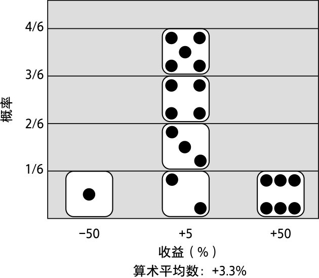

图3-1　薛定谔的魔鬼骰子游戏的收益概况和概率分布

那么，这场赌博的可靠性如何？它很划算而且对称，你有2/3的时间会赢得额外的5%，因此，你有明显的优势。让我们从掷骰子中计算你的确切优势，或你的期望值。

首先，你要确保骰子是均匀的——不管怎么说，对方是魔鬼。从雅各布·伯努利的黄金定理中我们知道，如果骰子是均匀的，那么总的来说，投掷次数越多，每一面出现的次数就越接近投掷次数的1/6。你投掷了10 000次来检验这一点（没关系，魔鬼会等待），然后你会发现，6种点数中任意一个出现的概率都在10 000/6的0.01%的误差范围内。骰子没问题。

接下来，你可以计算由6个等概率收益率结果构成的样本空间的算术平均数，得出这次骰子游戏的数学期望收益率：

·（-0.5+0.05+0.05+0.05+0.05+0.5）/6=0.033

你每次投掷的期望值都是3.3%，这是一个相当不错的期望收益率。这样的数学优势（与市场完全无关）会让你成为对冲基金大师的羡慕对象。更重要的是，你在与薛定谔的魔鬼赌博，用的是他的规则：你将在多元宇宙中同时体验量子骰子的六个面。你可以确保每次投掷都有3.3%的收益率，这是一个简单的算术平均数。

运作过程很关键，所以让我来强调一下：每次投掷，薛定谔的魔鬼骰子游戏都会查看所有6个可能宇宙的结果，然后取它们的算术平均数得出合并结果；你会同时经历所有好的和坏的投掷（就像分裂的骰子在同一次投掷后显示所有六个面，薛定谔的猫同时活着和死去）。我说过，你每次掷骰子可以确保3.3%的收益率，这就是原因所在，因为无数翻版的你在每次掷骰子时都会经历每一种可能的结果，而薛定谔的魔鬼会根据这些结果的简单平均数给你付款。你的N=∞。

在这种设置下，为什么不赌，为什么不与那可怜的笨魔鬼不断重复这赚钱的游戏？幸运的是，薛定谔的魔鬼并不擅长简单的数学，所以他接受了这个赌局。你同意玩300次，每次掷完骰子后都要结账，然后继续下一场。你的目标是通过复利倍增计算你的资本。有人说，复利被爱因斯坦称为“世界第八大奇迹”，甚至是“宇宙中最强大的力量”。（虽然没有证据支持这些说法，但也没有证据对此予以反驳。）

为简单起见，我们假设你的初始财富是某个币种（可以是数百、数千或数百万美元、法郎、达克特或其他任何货币单位）。在第一次投掷后，你得到了稳赚的3.3%的收益率，你的财富是1.033，这是你的总收益率（1+0.033=1.033）。就像在圣彼得堡商人贸易的例子中那样，我们可以通过将每次总收益率按顺序相乘，计算每次投掷后已发生变化的财富的递归几何级数。（从基本概率论中我们知道，随机自变量乘积的期望值就是它们期望值的乘积。）所以，在与薛定谔的魔鬼玩了300次骰子游戏之后，你的财富是：

·1.033×1.033×1.033×...=1.033^300=18 713

你看，以复利计算3.3%的期望算术收益率的结果几乎是你初始财富的1.9万倍。（如果你的初始财富是1 000美元，这意味着玩300次之后，你期末财富的数学期望值是近1 900万美元。）这个天文数字正是你所期望的——在本例中，跨越多元宇宙的广度，穿越量子骰子所有可能的路径，六个分离出来的面将全部出现。看来，爱因斯坦是个天才。

## 与尼采的魔鬼玩骰子游戏（N=1）

尼采喜欢骰子的类比，这并不奇怪，因为他升华了其所谓的“酒神式游戏理想”。他把生活看作一场骰子游戏——“存在的骰子游戏”。他描述查拉图斯特拉如何在“神桌上与众神掷骰子”，骰子一次次起落，不断投掷，永不停息。这些类比是尼采最伟大的洞见。

所以，不足为奇的是，尼采的魔鬼再次出现并想赌一把。他替换了薛定谔的魔鬼，坐在你桌子的对面。他给出的是同样的骰子游戏，赌的还是你那笔现金。但现在，用的是他的规则。不是在多元宇宙中每次投掷都同时出现骰子的六个面，而是在300次投掷中，每次只出现一个面，只有一条路。（而且，为了防止你遗忘，你会不断重走这300次投掷之路，直到永远。）

你得好好想想。在多元宇宙中，游戏要简单得多。然而现在，你又回到了只有一个宇宙的混乱世界，一次骰子投掷并不总能带来3.3%的平均数。事实上，在这种情况下，你永远不会得到这个平均数，因为那是纯理论的。你要么赚50%，要么赚5%，要么亏50%，不存在其他可能。它没有圣彼得堡赌博那么糟糕，但仍有大量抽样误差，这意味着风险。在1/6的时间里，你的净资产会减半，这种风险可能是你无法接受的。但随后，你再次想起老雅各布·伯努利。你忽然想到，反复玩这个游戏会消除随机性，实现你的期望优势。正如他的黄金定理说的那样，在骰子是均匀的情况下，它可以向你保证，只要投掷的次数足够多，你可以期待骰子每一面出现的概率是1/6。哟，你刚才还在担心呢（好像与魔鬼玩骰子还不够让人害怕）。现在，你恢复了信心，相信所有投掷产生的平均收益率将收敛到3.3%。你感觉自己仿佛又回到了多元宇宙的平静生活中。

这是一个令人宽慰的想法，但仔细审视，事情似乎有些不对劲。假设你前六次投掷的结果如图3-2所示：

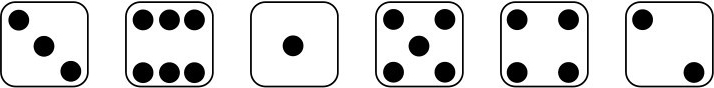

图3-2　尼采的魔鬼骰子游戏前六次投掷结果

在第一次投掷后，你的财富（或总收益率）是1.05；第二次之后是1×1.05×1.5=1.575；第六次之后是：

·1×1.05×1.5×0.5×1.05×1.05×1.05=0.912

在本例中，这是骰子的每一面随机出现一次的结果。看起来应该和平均水平差不多，对吧？但你却资不抵债了？当然，对于全部300次投掷，你会继续这些乘法步骤，直到得出期末财富。（这就是所谓的几何随机游走。）

在这个复利倍增的例子中，你需要注意的是：因为每个后续收益率都乘以其后续收益率，基于乘法的交换性质，50%的损失何时发生并不重要。无论是在第三次还是在最后一次投掷中出现点数1，对你期末财富的影响都是一样的。

显然，尼采的魔鬼改变了一切：这次你只能随机选择一条路，而不是多元宇宙中所有可能的、平行的300次投掷之路。现在，你的样本量从无穷大下降到了1（N=1）——这很可怕。

图3-3是每个游戏分别进行1万次的结果，显示为独立的不同路径的云团。把云团想象成多元宇宙中抽样结果的样本空间。期末财富结果的频率分布显示在右侧，对应各个路径的最终值。

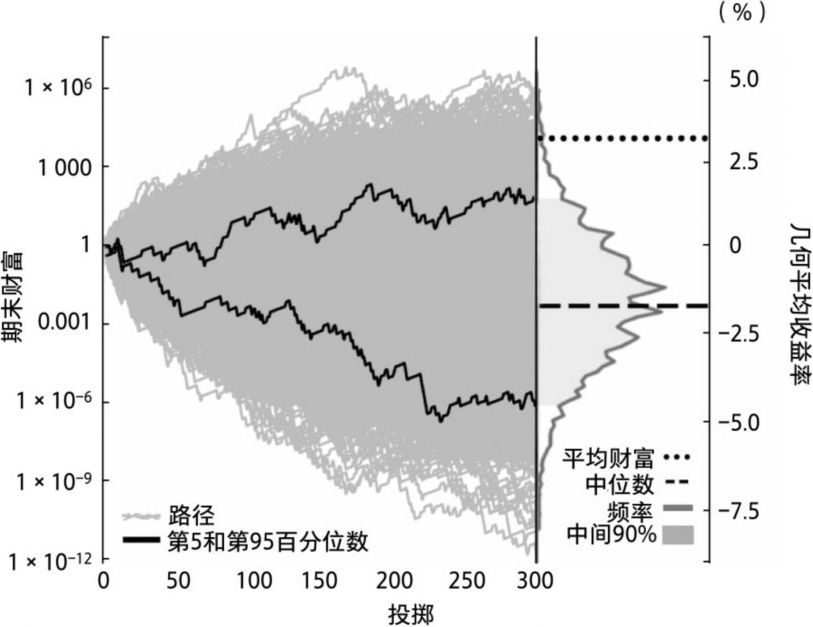

图3-3　得你所得，而非得你所愿

在这些道路中，你只能走其中的一条。你最好选一条正确的路！

请注意，y轴是按对数缩放的，这样我们可以更好地查看压缩数据。正如我们看到的，当你与薛定谔的魔鬼较量时，期末财富的期望值几乎是初始财富的1.9万倍——这是一个确定结果。而当你与尼采的魔鬼较量时，这个结果实际上是极其罕见的。它甚至不在可能结果的中间90%置信区间内，该置信区间跨越第5至第95百分位数。事实上，你的期末财富大于或等于初始财富1.9万倍的概率只有0.5%。

发生了什么？罪魁祸首是时间和以倍数递增的复利。最终，在经过大量不同的“300次骰子游戏”后，你得到一个可能的期末财富结果分布，它是高度正偏态分布——这意味着大量结果具有很低的值，极少数结果具有极高的值。后者如此之高，以至它们确实提高了总体分布的平均水平。（图中的对数缩放使这种正偏态分布更难被观察到，它看起来是对称的钟形。但如果看y轴的值，你就一目了然了。）结论是：当你只能走一条路时，实现期末财富期望值极其罕见。显然，它无法被预期。

## 非遍历性骗局

抛开魔鬼不谈，这是一个现实世界中的问题。你掷300次骰子，期望骰子的每一面出现大约50次，这没错。问题是，这个期望值并没有很明显地转化为你的理论期望值，即期末财富达到初始财富的1.9万倍。以下是骰子每一面出现50次的几何级数：

·0.5^50×1.05^50×1.05^50×1.05^50×1.05^50×1.5^50=0.010

这一逻辑似乎意味着，你的期末财富将基本为零。的确如此。骰子每一面出现的概率相同，你的复利财富——你的那笔现金，你一生的积蓄——99%将归尼采的魔鬼所有。在多元宇宙中，为你赢得初始财富1.9万倍的300次投掷发生了什么变化？与尼采的魔鬼赌博（它反映了现实世界中发生的事情，这令人不快），你不太可能拥有一再出现的好运。复利倍增貌似宇宙中最具破坏性的力量。（爱因斯坦被高估了！黄金定理也没那么美好！）

回想上一章，在这个几何级数中，300次收益的几何平均数只是它们乘积的300次方根，或0.010^(1/300)=0.985，或-1.5%的复合增长率。

我们知道，每次投掷的几何平均收益率0.985与伯努利期望值相同，也等于一次投掷后6种可能收益率的几何平均数：

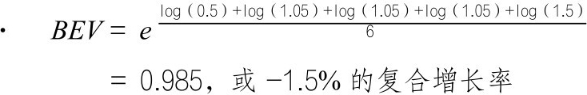

它提供了更多的证据，证明单次赌博的几何平均期望收益率与作为永久复利赌博估计的几何平均期望收益率相同——无论你打算选择哪一种。这是伯努利对数目标函数很酷的、直观的捷径。

然而，计算每次投掷的期望复合增长率（-1.5%），还有第三种等效的方法。它更直接，也更直观。事实证明（在非常稳健的统计收敛下），期末财富等于以-1.5%的复利计算了300次（或0.985^300=0.01），那是期末财富的中位数。这就是你在靶心中得到的，是你跨越所有可能的期末财富结果的多元宇宙后从赌博中获得的中间值（伯努利所说的“中间利润”的字面意思）。如果思考一下落在骰子每个面的50次投掷，你就明白它是有道理的。这就是你投掷结果的中位数（在可能的投掷结果中，一半更多地落在某个特定的面上，另一半则更少地落在某个特定的面上），因此有理由认为，它也应该产生你期末财富结果的中位数（一半的财富结果更高，另一半更低）。

不必纠结于数学上的细微差别，但你确实需要记住这一结论性观点（图3-4做了总结）：在倍增增长（比如我们的骰子游戏）情况下，期末财富结果的几何平均数与期末财富结果的期望中位数相同，这是我们思考几何平均期望收益率最直观的方式。

在我们的骰子游戏中，超过中位数（根据定义，为50%）的概率远远大于超过算术平均数的概率。这样你就明白了为什么在所有可能的最终结果的随机样本中，你应该期待几何平均收益率，而不是算术平均收益率。

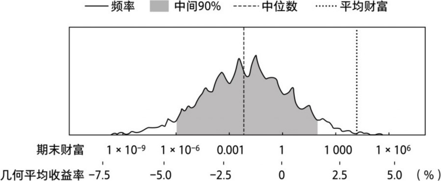

图3-4　期末财富中位数、期末财富期望对数、中位数和期望增长率是同一事物

哪一个更好：最大化你从未期待真正实现的财富期望值，还是最大化财富增长率的期望值，即你实际拥有的期末财富中位数？

当我们在多元宇宙中与薛定谔的魔鬼玩骰子游戏时，N=∞，我们关心的是多元宇宙中的平均数。然而，当我们与尼采的魔鬼掷骰子时，N=1，我们只关心一条路。更确切地说，我们真正关心的是自己可能走的那条路。为了不受命运摆布，我们需要关注较低的百分位数路径，比如中位数。

在与尼采的魔鬼较量时，你可能认为游戏存在某种圈套，或许就像扑克或西洋双陆棋（我很怀念20世纪90年代的梅菲尔俱乐部）中骗人的花招一样，你的优势是一种幻觉——那只是欺骗你玩下去的幌子。不，你的优势还在，只是非常罕见。你可以认为这是一种欺骗性的抽头，或是现实生活中魔鬼对你财富中位数（或几何平均数）征收的税。这是一种由复利倍增动态系统提取出来的税，我称其为波动税，它是一种最隐性的财富税。当你的财富落入对数伯努利瀑布时，它是财富的几何成本。你坠落得越深，就越难以找到出路。但对那些只生活在算术空间的人来说，这是一种完全隐性的税收。

一个随机过程在某个时段内，所有可能结果样本空间的算术平均数（被称为总体平均数）与同一时段的几何平均数（被称为时间平均数）相同，这在概率论中被称为遍历。

但我们不要想得太多，请保持简单：非遍历只意味着你的平均结果远高于你的中位数结果；所以，你的分布是明显的正偏态分布。不同于关注中位数，关注平均数意味着，你在关注实现概率低于一半（有时远远低于一半）的可能结果。仅此而已。

多元宇宙是遍历的，因为你实际经历了算术平均收益率随时间的推移而进行的复利计算（因此平均结果与中位数相同）。但没有人生活在遍历的多元宇宙中。只有与薛定谔的魔鬼赌博，我们才能体验许多个300次掷骰子游戏的平均收益率。然而在现实中，我们不是赌场。相反，我们更像是一张彩票（尽管在本例中，这张彩票具有非常强的正面优势）。我们只存在于一个宇宙中，只能经历一个300次投掷游戏。

永恒轮回显然是高度非遍历的。即使有很多复利计算的步骤，或者有300次掷骰子的机会，由于非遍历性，我们的N仍然等于1。我们应该从中感受到最大的权重。

简单总结一下，这两个魔鬼的观点相互排斥，又穷尽了所有可能，我们必须接受其中一个。从多元宇宙收益中形成的期望不会告诉我们从永恒轮回中能期望什么。当然，后者最能代表我们的现实。多元宇宙的频率论视角是一种幻觉，它会让我们失望，会蒙骗我们做错的事。

鲍勃·迪伦在歌中唱道：“幸好有非遍历性，明天永远不会是你以为的样子。”大概就是这个意思。

## 魔术把戏还是数学技巧？

几何平均收益率计算的最大优点是避免了非遍历性问题，它反映并跟踪了你的资本基础随时间推移的演变情况，这是算术平均遗漏的内容。几何收益实际上就是你的资本基础，它直接从收益转化为财富。使用算术收益率进行转换，你还需要知道路径是怎样的，它是路径依赖的。资本基础是收益的基础。现代金融关注收益，却忽视收益对资本基础的意义，这是荒谬的，也是短视和天真的。这就好像在说时间无关紧要，“一切都同时发生”。

这就像农民追求作物产量，却忽视土壤退化。大多数农民就是这样，现代工业化的农业依赖单一作物、化肥和杀虫剂——当然，践行再生农业（如轮牧）的人除外。

一旦你把注意力转移到资本基础和几何平均收益率上，神奇的事情就会发生。

那么，你能以上述方式玩魔鬼骰子游戏吗？你能以更具再生能力的方式（就像有远见的农民保护土壤一样）玩游戏吗？比如，不是每次押上全部，而是每次只赌剩余现金总额的40%。将另外60%放到一边，不归入赌本，这意味着每次掷骰子时，你都要将之前3.3%的平均期望收益率降低60%。图3-5是一张新的风险缓释收益图。

这张“叉与圈收益概况图”在本书中至关重要。在研究不同的案例时，我们会不断回顾它。理解这张图非常关键。它显示了风险缓释策略中可变因素的基本概况，及其相互作用的方式。最妙的是，它将这些因素正确地、合乎逻辑地组成一个整体，作为风险缓释记分牌，在同一页上显示了投资组合净效应。这张图真正显示了风险缓释的叉和圈。

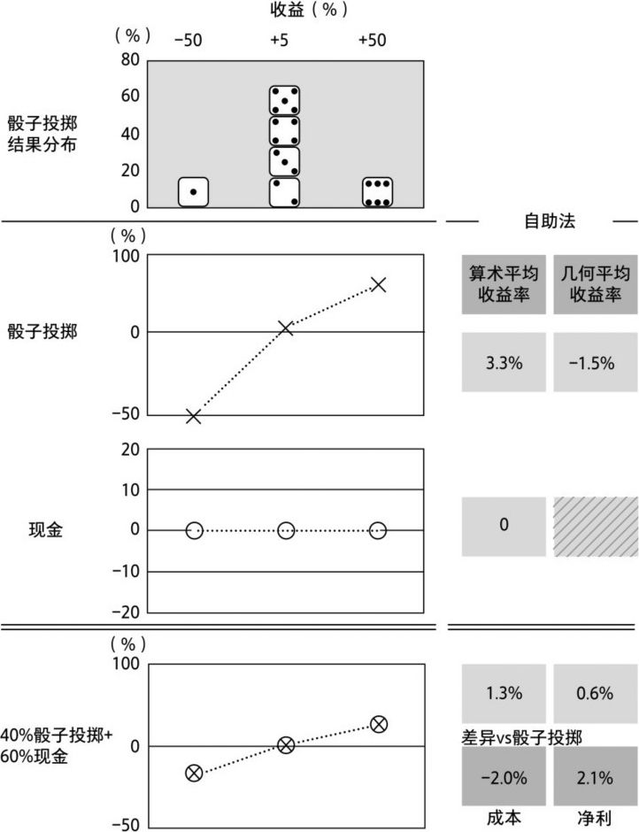

图3-5　叉与圈收益概况图：凯利准则

注意其中发生了什么。我们将主要的骰子游戏收益概况图（×）与现金收益概况图（〇）结合起来，得到一个组合收益概况图（

）。如果将伯努利的BEV（或平均对数收益率的指数）应用于这个组合图，那么在以复利计算300次，并重复该路径1万次的情况下，你得到的几何平均收益率就等于几何增长率的中位数。

只要每次下注的金额少于你的剩余现金，你的算术平均收益率就会从+3.3%降至+1.3%。把它视为你的算术成本。在感到失望之前，请你想一想我们刚才讨论的（非遍历性）。算术平均数不是我们关注的焦点，相反，一切只与反映复利的几何平均收益率有关。

令人惊讶的是，你的几何平均收益率从-1.5%升至+0.6%；这是你从该组合策略中获得的（投资组合）净效应。这可不仅仅是一件有点儿令人费解的小事或数学奇闻。以我们之前的经验，玩这个骰子游戏似乎是个坏主意，至少按照尼采的魔鬼制定的法则你是要吃亏的。但现在看来，我们是在说，只要你每次只拿一部分财富来冒险，它就是一个有利可图的游戏。这到底是怎么回事？

在多元宇宙的幻境中与薛定谔的魔鬼博弈时，使用我们建议的风险缓释策略，在300次掷骰子后，你的期末财富会变为初始财富的53倍，而不是1.9万倍，你所经历的只是算术成本。但当你与尼采的魔鬼较量时，期末财富的期望中位数（或几何平均数）会从初始财富的0倍提高到7倍左右。你只能得到这个（投资组合）净效应。两个魔鬼显然有不同的记分牌，而尼采魔鬼的记分牌才是现实世界中最重要的记分牌。

我们建议的下注策略是凯利准则的一个例子。凯利准则可以追溯到1956年，以贝尔实验室研究员约翰·凯利的名字命名。凯利提出的这个准则是其同事克劳德·香农关于信息熵（一条带有噪声的通信消息中的信息度或“惊喜”度）概念的延伸。凯利的简单公式基于一个标准来确定赌注的大小：最大化期末财富的几何期望平均数（即使以牺牲算术平均数为代价）。1738年，丹尼尔·伯努利首次提出了伯努利原理，你可以把凯利准则视为该原理的形式化。1959年，亨利·拉坦首次正式将其应用于投资领域，尽管遭到了人们的鄙视。（两人中只有拉坦读过伯努利的论文，并深受其影响。当时，那篇论文在几年前刚被翻译成英文。）本章中骰子游戏的例子在很大程度上基于拉坦的重要研究成果，拉坦是一位开拓者，他在投资方面所做的贡献理应得到更多赞誉。

伯努利、凯利和拉坦的思想有了支持者。他们是1936年的约翰·伯尔·威廉斯（或许是自伯努利以来第一个强调几何平均数最大化的人）和1960年的利奥·布雷曼（他证明了几何平均数最大化策略既能以最快的速度实现目标财富，又能在给定时间实现财富最大化——谁不想学习这种策略呢？）具有讽刺意味的是，就连1952年现代投资组合理论的设计者哈里·马科维茨也在1959年成为几何平均准则的支持者（1976年更是大力推崇）。但为时已晚，因为他的现代投资组合理论框架已经深入人心——后来的事尽人皆知。也许最值得注意的是爱德华·索普的权威著作，他从20世纪60年代开始就针对这个问题著书立说，并将其付诸实践。

最近，奥勒·彼得斯就非遍历性对经济理论的影响撰写了内容详尽、富有见解的论文。当然，纳西姆·尼古拉斯·塔勒布在他2018年的著作《非对称风险》中提到了单周期集合概率与多周期时间概率的非遍历性对比。（纳西姆写道：“20多年前，像我和马克·斯皮茨纳格尔这样的从业人员就已经按照这一准则建立了我们的交易策略……集合概率和时间概率的差异效应。”这基本上算是一个总结。）要详细了解这些，请参阅威廉·庞德斯通2005年出版的《赌神数学家》，这是一本专业性不那么强的好书。到2005年，我在这方面已有大量实践，也更清楚这一简单区别的含义。

伯努利、凯利和拉坦各有主张——他们的继承者也是如此。但他们都指向了与圣彼得堡商人贸易一致的标准：几何平均数最大化。

凯利的精确公式在这里并不重要，无论如何，它都不会很好地转化为金融市场更微妙的真实分布。移动上一张图的权重，重新计算每个权重的期末财富的几何平均收益率或中位数，你就可以在概念层面找到该骰子游戏的凯利最佳下注比例：约为40%。（回想一下，我们曾多次探寻圣彼得堡赌博的公允价值，二者的方法非常相似。）期末财富最大中位数的权重是凯利最佳下注比例。让我们保持简单。关系如图3-6所示：

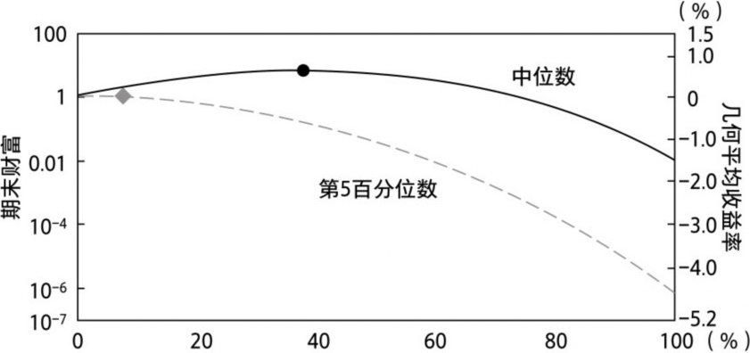

图3-6　寻找（凯利）最佳下注比例

凯利准则似乎可以更形象地被称为金发姑娘原则，它必须恰到好处。留出太多的钱不妥，因为你的赌注太小，太保守了。没有留出足够的钱也不妥，因为你的赌注太大，太激进了。介于两者之间则恰到好处——在本例中，略低于40%。（不要认为这与巨大风险困境中令人不快的中位数相矛盾，你将在后面几章了解到，事实并非如此。）

你不能为免受诱惑而每次投注财富的1/300，从而获得300个小赌注的算术平均数。凯利准则说明了其中的原因。当然，你可以那么做，但那是在浪费时间。只有赌场才能做到这一点，它可以在每个周期分别下注（丹尼尔·伯努利式的风险分散），而不仅仅是在不同时间下注，因为每个周期都有很多独立的、同时被投掷的骰子。但你不可能同时与一屋子尼采的魔鬼进行独立博弈。（你不是赌场。）

有人可能会说，选择第50百分位数来实现最大化有一定的随意性。对其他百分位数来说，这个选择似乎有点儿盲目。图中较低的曲线显示了期末财富结果的第5百分位数（在图3-4中，阴影部分中间90%置信区间的下界），这意味着95%的时间你期望达到或超过的财富水平。这条曲线的峰值略低于10%的下注比例，远低于每次投掷近40%的下注比例（中位数曲线在近40%处达到峰值，然后急剧下降），而期末财富中位数随着下注比例的增加有更大的上升空间。凯利准则的权重最大化了中位数结果，虽然不是真正糟糕的结果。你可以明白为什么职业赌徒经常使用“部分”凯利赌注大小。它以牺牲中位数结果为代价，能有效地最大化任意较低的百分位数结果，如第5百分位数曲线（在约1/4凯利比例处最大化）。

这个第5百分位数的结果在投资行业被称为风险价值，或5%的VaR。在我们的例子中，结果的样本空间很明确，这个5%的VaR是定义赌博风险程度的一个好方法。毕竟，我们将风险定义为负面意外事件，或最糟糕的潜在路径中的损失。因此，将这些最糟糕的路径想象成格雷厄姆的安全边际，第5百分位数的结果越高，安全边际越大，赌注越安全。

当然，在现实世界中，这些糟糕的结果并没有那么明确。投资组合VaR的测量存在虚假性，估计的准确度很低，使用它可能弊大于利，这是下一章的重点。但是对我们的骰子游戏来说，5%的VaR是衡量风险的理想指标。

正如我们所看到的，超出凯利最佳下注比例，风险会增大。好事太多并非好事。你可能会因做得太多而毁掉机会，从而逼近伯努利瀑布的边缘。然而，奇怪的是，现代金融工具坚持认为，当算术期望收益率为正时，杠杆基本上总是合理的。毕竟，杠杆只是提高了算术平均数或期望收益率，而不影响平均收益率与这些收益率标准差的比率。（图3-5中的夏普比率连线只是一条水平线，随着杠杆率的提高，所有人都可以获得更多的自由资金，同时期末财富暴跌。）更低的风险总是意味着更少的收益。那些肤浅的伪科学工具真是一场灾难！杠杆确实可以杀死产金蛋的鹅。（只要问问长期资本管理公司的对冲基金投资者就知道了。）

现在想一想，如果留出财富的60%，经过300次投掷，你的期末财富将从初始财富的0倍提高到7倍。在孤立状态中你会推断，每次投掷后收益率一定会固定在0.8%的复利上，就像固定年金一样。但事实上，在这场赌博中，我们闲置的现金根本没有赚到任何利息。

凯利是如何从一顶算术收益率较低的帽子中拽出一只几何收益率较高的兔子的？这是魔术把戏，还是仅仅是简单的有关复合的数学技巧？答案是，它将游戏变为非线性的、倍增的动态系统——换句话说，以增加中等意外的方式来缓解糟糕意外的痛苦（曲线凹性的痛苦）。在倍增效应下，要想从巨大的损失中恢复过来真的很难。

从更大的下注比例转向凯利最优权重，还有一个很好的改善措施，那就是我们在图3-6中看到的第5百分位数结果。使用新的凯利下注策略，我们可以更清楚地看到一个新的风险缓释分布，如图3-7所示。

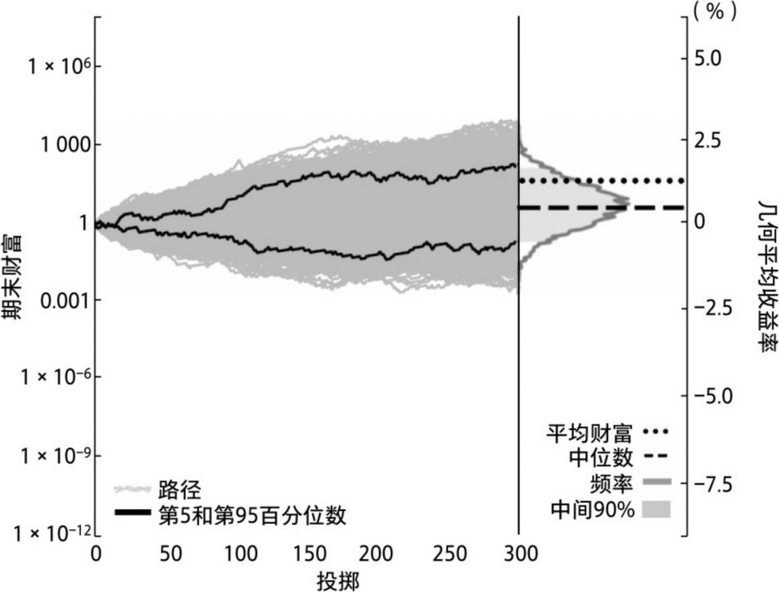

图3-7　凯利准则路径

图3-8是全押与40%凯利下注比例两个频率分布的详细介绍。

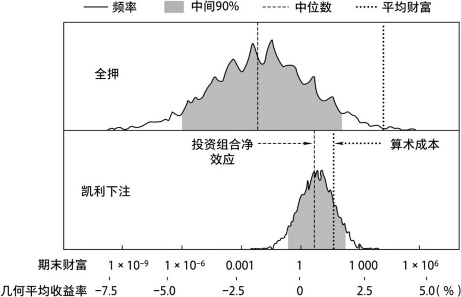

图3-8　算术成本与投资组合净效应：全押与凯利下注

有趣的是，算术平均收益率降低了（向左的箭头）。在其他所有因素都相同的情况下，几何平均收益率也会降低。但几何平均数或中位数收益率实际上提高了，我们称这为投资组合净效应（向右的箭头）。有两种相反的力量作用于结果分布：一种可见的力量（算术成本）降低了它，另一种隐藏的力量（几何效应）提高了它。当后者大于前者时，结果是正投资组合净效应和具有成本效益的风险缓释。这两种力量往往是隐藏的，二者的矛盾关系是避险投资的核心。

凯利下注策略带来的财富中位数上升是显而易见的——毕竟这就是财富最大化的目标。但你可以看到，它提高了整个分布。例如，第5百分位数结果（在中间90%范围的底端）已经从基本为0上升到约0.3。

再次以弓箭手射箭做类比。凯利想让你的中位数之箭更接近靶心，或者更精准地射向靶心（更大的财富）。而且在此过程中，它严格控制了落点散布，这意味着射程范围更窄或更精确。与以前相比，偏离靶心的箭（迷途之箭）更少了——熵更少了，更不容易受运气摆布。但迷途之箭并没有消失，它们并非凯利优化的对象。想象一下，威廉·泰尔——14世纪瑞士民间英雄和神射手，瑞士联邦反抗奥地利压迫者的领袖——被迫将苹果从他儿子的头上射下来。他可能会射偏，但只能射向一个方向，而射偏的箭至少和他射中的箭同等重要。他的目标是尽量减少遭遇厄运的机会。威廉·泰尔的射击需要既精又准——目标越小，偏离越小。（这与最大化夏普比率形成对比，后者通过牺牲准确性来提高精确性。）

那些射偏的箭仍存在大量风险，人们为此指责激进的凯利下注策略。第5百分位数结果为0.3，意味着70%的损失——在新的落点散布中，第5和第50百分位数之间仍可能有厄运发生。因此，一些人甚至将其嘲讽为“神风特工队准则”。经济学家保罗·萨缪尔森对凯利准则尤为不满，他使用单音节词对其进行了批评——他认为被批评者能理解。萨缪尔森的论文中有一段话很典型：“我们不应把财富的平均对数设得过大……当N很大时，如果输了（你当然会输），你会输得很惨。Q.E.D.（证明完毕）。”

重要的是要认识到，在本例中，凯利将你总财富的60%留下，相当于将你总财富的60%分配到一个安全的避风港，这一点可能并不明显。每次投掷，这些现金都无利可赚（假设不会因通胀失去实际价值）。如果愿意，你仍然可以在下次投掷时使用它。它所做的一切是保持其价值，减少在游戏中的损失。这就是我们所说的“价值存储”避风港。

## 附加赌注

让我们暂时回到上一章伯努利的圣彼得堡商人贸易的例子。在魔鬼骰子游戏中，我们可以更好地理解他的处境。现在我们做些替换：将游戏玩家替换为不走运的商人，骰子投掷的结果替换为随机的天气和海盗，收益替换为满载货物穿越波罗的海的船只带来的经济效益，薛定谔的魔鬼替换为保险公司。你可以看到其中的含义。（这次我们的概率和收益率略有不同，但重点完全相同。）举个例子，你为你的房屋投保，目的是让保险公司理赔房屋损毁可能带来的费用，房屋损毁分散在多元宇宙的诸多实例中。从这个意义上说，保险就是让你扮演赌场的角色，参与许多与命运抗争的游戏。惨痛的厄运不再让人不堪重负，因为有其他好运分担了成本。

但是，如果留出一部分资金，放在安全的、零收益率的资产中，可以提高总资产的复合增长率，那一定是因为安全资产为增长率提供了某种价值，而非其自身产生了特定的资本增值。它提供的隐藏价值足以弥补机会成本。

既然在用这笔备用金缓解损失发生时受到的冲击，那么我们应该考虑这个游戏的保险合同。大致来说，保险合同是对主要事件的附加赌注，而非主要事件本身。它是对另一重大事件结果的押注。就像掷骰子或体育运动中的附加赌注一样，它与游戏是分开的。它是一种衍生工具，或未定权益，其价值源于其他事物。（保险公司会全力确保保险赔付并非真正的赌博，比如，你为某人投保人寿保险，但他的死亡并不会影响到你。）

思考一下保险附加赌注的风险缓释收益和概率分布图（见图3-9）。当骰子掷出点数1时，保险合同赔付你500%的保险费。而出现其他任何点数时，你的保险费将损失100%。

请再次注意，我们只需要计算组合收益的几何平均数

，找到赌1万次的几何平均期望收益率，以及几何收益率中位数。

将这张叉与圈收益概况图与我们之前的图进行比较，你可以看到新的保险赔付取代了原来的剩余现金。在此情境中，只有掷出点数1，你才能在保险附加赌注中获得500%的可观利润。否则，你会失去全部附加赌注。具体来说，这个保险赔付的算术平均数正好是0。显然，正如预期的那样，该结果的几何平均收益率为-100%（将任何数字乘以0，或1-100%时，得到的是0），其平均效用也是0。这听起来不是很妙，除非你记住，正如你所看到的，这绝非一场孤注一掷的赌博。这是一个附加赌注，其作用是为你最初的下注投保。

举个例子，让我们看看你与尼采的魔鬼赌博的最后一次下注计划。之前都是按照凯利下注法，每次投掷只下注现金总额的40%，将剩余的60%存入价值存储避风港。只不过这一次，每次投掷你会下注剩余现金的91%，将9%分配给保险附加赌注。薛定谔的魔鬼是保险赌注的承保人，而尼采的魔鬼会在最初的骰子游戏中再次成为你的对手。

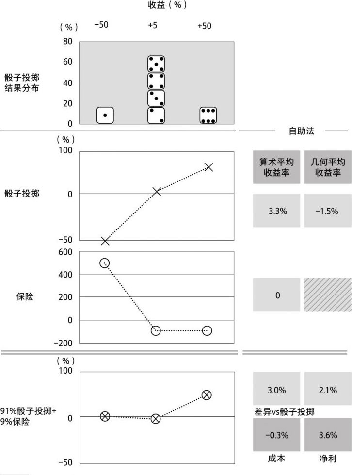

图3-9　叉与圈收益概况图：保险

于是，我们又有了一个避风港的例子。它不仅能够保值，而且能够基于赌博的结果提供一个高条件收益率，以降低赌博的损失。这就是我们所说的保险避风港。

这一次，300次投掷后的复合期望收益率从-1.5%（意味着期末财富约为0）跃升到+2.1%（意味着期末财富约为初始财富的495倍）。然而，你的算术收益率从+3.3%降至+3.0%。与凯利下注策略相比，算术平均数的降幅更小，因为我们在平均收益率为0的附加赌注中分配了更少的钱。但是由于风险缓释效应，几何平均收益率大幅上升。我们现在知道，这才是真正重要的收益率。

请注意，正如在凯利收益中，每次掷骰子都留存现金，结果收益率为0一样，平均而言，每次掷骰子都将现金分配给保险附加赌注，最后收益率也为0。（毕竟，这只是保险。）在300次投掷之后，9%的保险配置将你的期末财富从初始财富的0倍提升到495倍，对此你可能会认为，这笔钱的收益率就像固定年金一样，一定是以2.9%的固定复利率增长。但事实上，它的平均收益率是0。

我们正从一顶算术收益率更低的帽子中拽出一只几何收益率更高的兔子。

上次我们发现了凯利最优权重，现在我们可以移动图3-9的权重，计算一次掷骰子的几何平均收益率，找到分配给保险的最优权重。关系如图3-10所示：

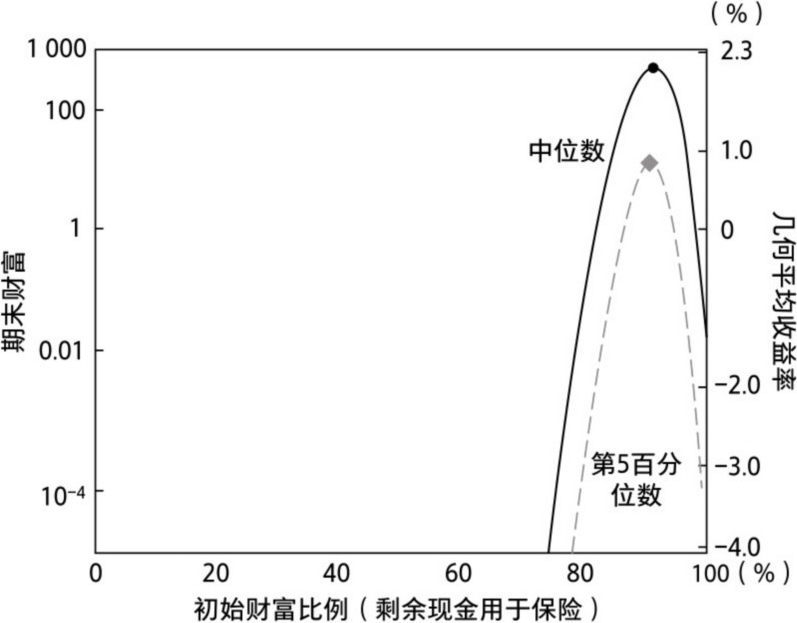

图3-10　寻找最佳下注比例（剩余现金用于保险）

我们再次看到金发姑娘权重，不太热也不太冷。你可能会因为做得太多而毁掉机会，好事过了头就不再是好事。但是，对保险业来说，“过了头”意味着保险投入过少（或者主要赌注过高）。保险费无须预留太多。就像盐一样，“少许”对这道菜来说是点睛之笔，再多就会毁了它。

但在这里我们看到，与凯利最优权重不同，保险权重几乎同时最大化了最终结果的中位数和第5百分位数。此外，通过最大化这个百分位数结果的范围，你也在最大限度地增加超越所有期末财富结果的可能性，并缩短超越这些结果的预期时间（正如我们从1960年布雷曼的证明中了解到的）。萨缪尔森会非常高兴，因为“你不再有真正惨痛的损失”。

这次我们可以看到，与原始游戏和凯利下注策略相比，样本空间路径的云团形成了截然不同的期末财富频率分布（如图3-11所示）。这种定价合理、零收益率的保险反直觉地提高了期末财富中位数，但也许更重要的是，它还将第5百分位数提高到了一个可接受的水平，从最初的基本为0，到保险状态下的20。它提高甚至近乎最大化了百分位数的区间估计，而非任意的点估计。像凯利下注策略一样，你通过严格收紧落点分布提高了精度，同时通过让它们更靠近目标而显著提高准度。目标范围越小，偏离越小。这就是威廉·泰尔的射击——既有精度又有准度，严格控制并提升整个样本空间，避免受到运气的摆布。

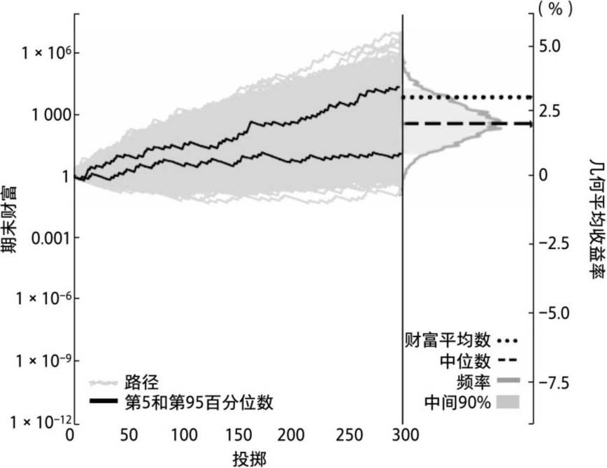

图3-11　保险路径：恰到好处的风险缓释

通过再次并排比较频率分布（如图3-12所示），我们可以看到投保下注的优势，这次对比的是全押、40%凯利下注和投保下注三种情况。

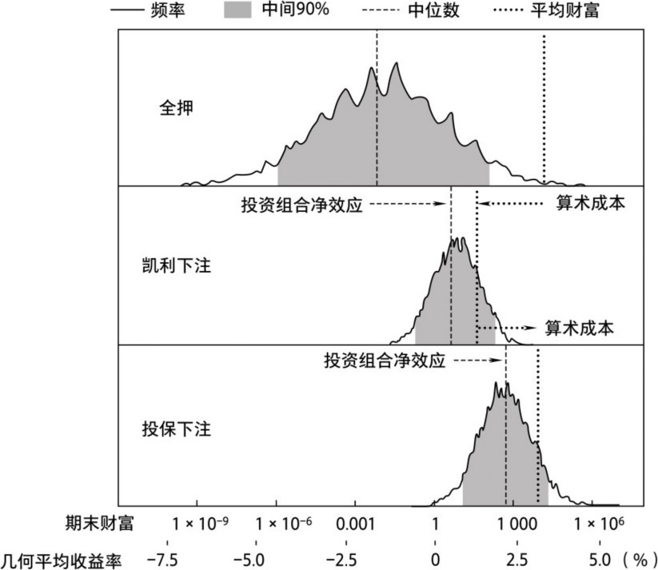

图3-12　全押vs凯利下注vs投保下注

当我们从凯利下注转移到投保下注时，算术成本实际上是下降了（向右的算术成本箭头），而投资组合净效应进一步增加（向右的箭头）。算术成本的降低加上更大的投资组合净效应，这种双重作用被称为经济型优势策略——成本节约有助于产生净效应。

掷出点数1的所有50%损失都被规避了，代价是掷出其他任何点数都需付出9%的成本。而且，平均而言，这种保险赌注是收支平衡的。但是如果我们把保险赔付从掷出点数1赔付500%降到更低的水平呢？这意味着我们将独立的保险附加赌注的算术收益率降至0以下，使保险公司有利可图。我们将同时提高保险权重（9%以上），使总赌注在掷出点数1时受到完整保护（或损失为0）。这种保险值多少钱？你愿意“多付”多少钱给薛定谔的魔鬼，让它为你的赌博习惯买单？

图3-13展示了保险策略的几何收益率期望值或中位数，对应独立保险附加赌注的不同算术收益率（使用重新加权法来缓解最糟糕的投掷结果）。

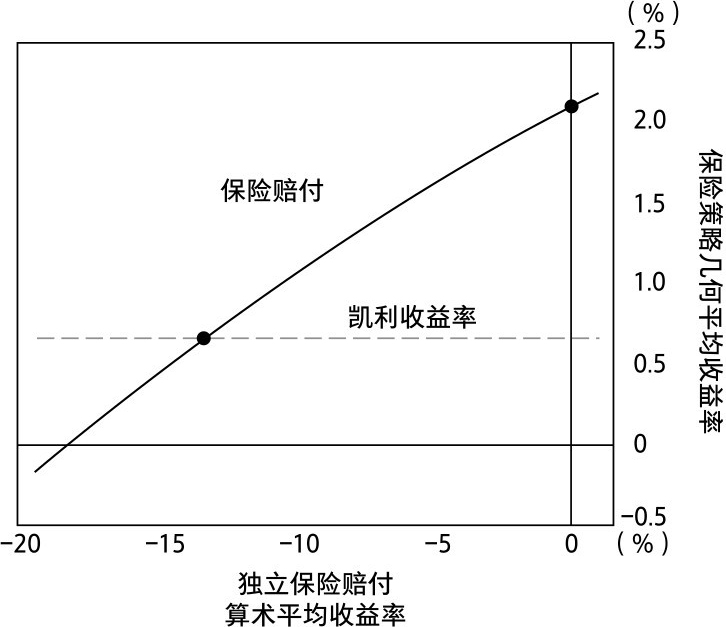

图3-13　非零和：保险策略的增长率中位数（对应不同的独立保险赔付）

在保险策略几何平均收益率下降到凯利策略的水平之前，每次投掷的算术平均收益率可以低至-13%。还有一个-10%的平均保险收益率（顺便说一句，薛定谔的魔鬼这个保险商获得了巨额利润），被保险人每次投掷的几何收益率仍高达1%左右。圣彼得堡商人在考虑是否为自己的海运投保以预防海盗和海上风暴时，从未明白这一点：保险绝非零和博弈。

也许伯努利应该将其目标函数的对数曲线凹性描述为大自然的告诫，以此提醒人们要么不要掷骰子，要么为掷骰子行为购买保险。

## 宝藏一瞥

现在，总结一下我们在骰子游戏中学到的东西。（你如果跳过了数学内容，可以在这里跟上进度，尽管这意味着你只能信任我的结论。你错过了所有激动人心的发现，真是替你遗憾！）

首先，你已经了解复合动态系统对风险缓释的意义。具体而言，你已经了解损益倍增的动态系统（连续的复利）如何随时为你带来财富。你已经知道，通过风险缓释，这些动态变化会如何影响复合增长率期望值。损失越大，增长率越会以增量的、不成比例的方式下降，远大于可见的损失量。并非所有的损失和风险都是均等的，因此并非所有的风险缓释都是等效的。

作为投资者，我们的目标是最大限度地提高财富的复合速度，而财富是随时间推移唯一实现的结果。这是投资的首要原则之一，现在我们称其为丹尼尔·伯努利投资原则。它需要提高或最大化所有潜在期末财富结果的几何平均期望值——或中位数期望值。更理想的状况是，提高或最大化所有其他百分位数期望值。为此，我们需要将凹的对数函数作为目标函数。不要坠入伯努利瀑布！

简言之，为了在血腥的“运气之战”中获胜，我们需要一个收益率更精准的风险缓释策略。

最重要的是，你已经了解了实现这一目标的基本方法——圣彼得堡商人贸易法，以及几乎所有具有成本效益的风险缓释方法。它来自两个基本的避风港策略：价值存储避风港（或凯利最佳下注策略）和保险避风港。这两种避风港代表了两个极端。我们将在第二部分看到，在现实世界，当具有成本效益的避风港真正存在时——如果真的存在，它们会落在此范围内的某处。落点不同，其成本效益可能会有很大的差异。

最重要的是，我们现在有了创建避风港假设的演绎方法。

我们正在寻宝，手里有一个指南针，面向正北——最大化我们的复合增长率。我们仍在寻找通往地下宝藏的路径，但确信离它越来越近了。
