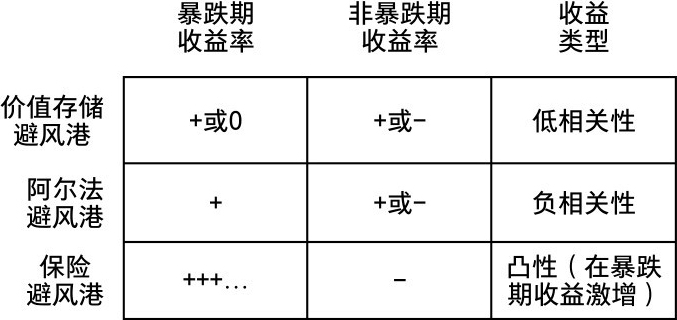
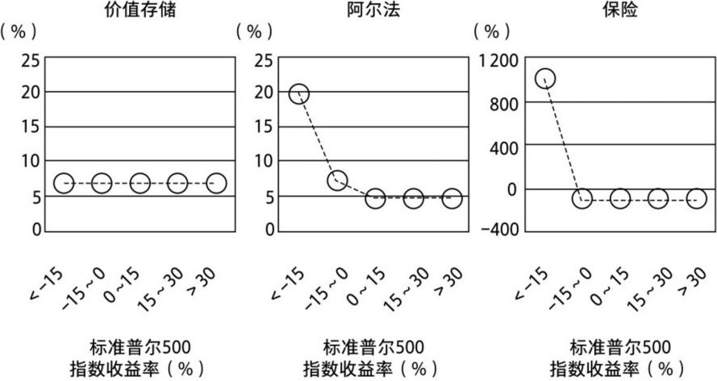
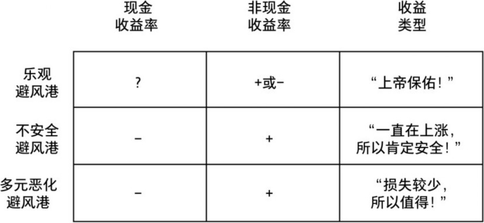
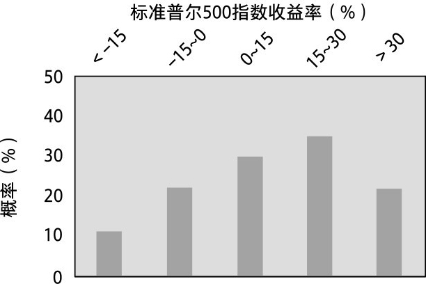
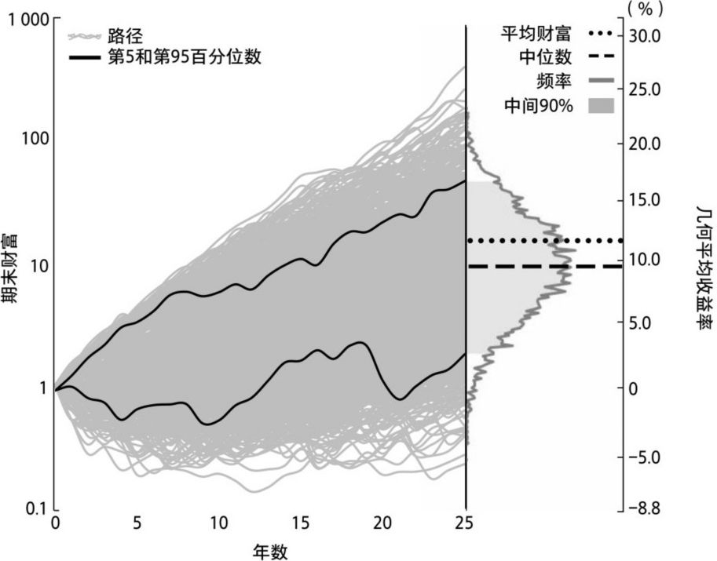

# 第四章 分类法

## 本质主义

避风港的本质是什么？我们如何区分避风港与非避风港，更重要的是，如何区分优质避风港与劣质避风港？

作为投资者，这些问题直接关系到我们的核心目标：通过降低风险来增加财富。目标的自我提醒很重要，因为投资界人士会让我们相信它不可能实现。在他们眼中，风险缓释有不可避免的弊端——是打着谨慎的旗号提出的不合理建议，它以避免负面结果的名义接受负面结果。但我们相信，确实有可能在增加财富的同时降低风险，所以最好确保我们选择的是最佳避风港。我们不能指望现代投资组合理论的追随者给出答案，他们即使能够直面问题，也无法用其掌握的简陋工具来回答它。如果天真地期望有人将避风港齐整地放到盒子里双手奉上，信誓旦旦地说“相信我，它是有效的”，我们还不如放弃魔鬼骰子游戏的科学严谨性，去寻求穷途末路、孤注一掷的游戏。

我们必须埋头苦干（振作起来，这没有那么难），钻研我们的问题，即避风港是“什么”，它“如何”运作，如何比较。我们再次运用亚里士多德的第一性原理，用自然主义者的工具为自己赋能。我们的研究是绝大多数投资者（包括专业人士）从未思考过的。为了完成这项工作，需要用正确的分类法对避风港中的“物种”进行命名、描述和分类，还需要使用具体的语言，理解其重要性。

人们通常会接受有关避风港分类的惯用说法，就像我们之前的定义，将避风港视为一种收益，这种收益可以降低风险，或投资组合中潜在的经济损失。因此，具有成本效益的避风港是随着时间的推移增加财富的避风港。但是，我们如何在避风港奏效之前识别其能力？（后知后觉有什么用？）它们有何特别之处？是否具有某种本质特征，或者可以按照其他标准清晰地界定？

更笼统地说，“避风港”是一种被我们称为“类”的可分类事物，还是具有共同特征的群？如果是后者，它们基本上是同质的吗？如果不是，我们如何进一步组织其变体，以便更好地理解它们，最重要的是，如何更好地使用它们？

在涉及物种或物种问题时，生物学家也面临相似的分类难题：如果划分生物物种（即所谓的物种概念）的方法不一致，且找不到解决方案，我们如何确定甚至假设某个物种？

本质的概念来自本质主义框架，可以追溯到柏拉图和亚里士多德。本质主义根据固定的本质或“本质”属性对物种进行分类。柏拉图的思想或形式理论理想化、卡通化地完美再现了现实世界所有杂乱无章的概念。这种混乱只是“非本质属性”特征的表现，而纯卡通形式才是理解本质不可或缺的媒介。柏拉图将其视为唯一真实的现实；世界只是一种幻觉，充斥着各种形式的有缺陷的复制品。在其关于洞穴的寓言中，柏拉图认为我们都是囚徒，只能看到投射在洞穴墙壁上的影子，而看不到洞穴之外投射这些影子的真实形体。如果他是正确的，那么尝试解读事物的本质就是有意义的。

一个好思路是：去除事物非本质属性的部分，画出一张简洁、抽象的卡通图。一旦理解了卡通的本质，你就理解了该事物，或者理解了它背后的逻辑。

将事物划分为“自然类”的关键是归纳其共性，这些共性对类中的成员来说是“必要且充分的”。对此，柏拉图有一个耸人听闻的说法，“在自然的关节处切割”——用最自然、最本质的方式区分事物，以实现对事物的理解。

首次对生物进行系统分类的人是柏拉图的学生亚里士多德。（作为世界上第一位真正的科学家，他首先是一位生物学家。）自那时起，以这种本质主义的方法对事物进行分类和分组，一直是自然主义者和科学家普遍思考与发现的基础。研究分类的科学被称为分类学，推动其发展的内在动机是，通过将相似的事物或概念进行归类来理解事物，从而建立知识的框架。

亚里士多德的基本分类体系沿用至今。但他从未真正详述其做法，大概是因为他看到了分类的不可靠：“明确地划分出分界线是不可能的，也不能确定中间类别应该归于哪一边。”（除了人类，他甚至从未试图定义过一个“物种”。）

亚里士多德的本质主义思想较少涉及本质“属性”，更多地涉及基本“功能”（这是一切的首要原则，甚至是投资的首要原则）。他关注的重点不是光怪陆离的基本属性，而是这些属性和部分与环境相互作用的方式。本质是指有机体的功能和发育在环境中的成功程度，即功能性本质主义。

从这个意义上说，亚里士多德和19世纪自然主义者兼生物学家查尔斯·达尔文的共同点要比人们通常认为的多（有一点除外，亚里士多德喜欢思考骰子，达尔文则沉迷于每晚的双陆棋游戏）。一开始，达尔文对物种的存在持怀疑态度。特别是生物的多样性和变化如此显著，它们不再被认为是静态的。当然，这促使他创建了自然选择理论，完成了著作《物种起源》。

亚里士多德和达尔文在自然界中的观察可以用来指导避风港研究。避风港物种的多样性和变化非常大，以至有可能形成新物种。其成员有着不同的表型，相比之下，其中一些具有更强的优势，或更高的成本效益（更适用）。我们的避风港物种问题是：我们能识别避风港的“本质”，并据此对它们进行分类吗？还是说，它们都是独立的——每一种都自成一类？

让问题变得更复杂的是，我们的分类对象是变动的。避风港的基本特征可能会在某一刻出现，随后消失，就像生物特征会随时间的推移而改变一样。以固定的视角看待它（类似柏拉图所说的永恒不变的本质），就像达尔文之前的许多人思考物种的方式一样，是一种天真的、事后回顾式的谬误。

但是，如果不能根据避风港的本质进行分类，我们就不可能检验骰子游戏对其运作的“猜测”是否属实。如果做不到这一点，那么一切都不过是金融剧场——更模糊的风险缓释叙事。更糟糕的是，它成了一种学术活动。直言不讳地说，如果我们不能识别具有成本效益的避风港，它就只是一个藏身之处——就像船停泊在港湾。（“停在港湾里的船是安全的……”）

## 差异大于相似

在第一章中，我介绍了我的伯恩山犬娜娜，它或许擅长捕捉土拨鼠，或许不擅长。实际上，我们有三只狗（或者更确切地说，它们拥有我们）：乔乔、吉吉，当然还有娜娜。但我更喜欢将它们称为莫、拉里和卷毛——统称为“活宝”。莫是恃强凌弱、爱打闹的巴哥犬；拉里是毛发蓬乱、被动的西施犬；卷毛是矮胖可爱的伯恩山犬（这似乎并不影响它捕捉土拨鼠）。它们会表演的小把戏极其相似，但这是它们唯一的共同点。如果不了解它们，只是观察其行为，你可能会认为它们是同一犬属的不同品种。

它们有着不同的样貌：捣蛋鬼巴哥犬的脸像青蛙，西施犬的脸像猫，伯恩山犬的脸则像“熊城”伯恩的图腾。这些都是它们的非本质属性，各不相同，独具特色，但这些并不影响它们都是狗。它们的狗性无论是否鲜明，都是其本质属性，是它们作为狗的必要充分条件。就“活宝”而言，本质属性是什么尚不明确。但如果要把它们归类为“活宝”，就必须有人来确定哪些属性是本质的，哪些是非本质的，哪些特征很重要，以及为什么重要。“活宝”的物种界定问题难度很大，因为它们的不同之处多于相似之处。（“生物物种概念”是通过杂交来定义一个物种的。即便如此，伯恩巴哥犬的想法仍会造成认知失调。）

在投资策略中，价值投资是分类问题的最佳例子。价值投资的概念由本杰明·格雷厄姆提出，即购买那些价格低于内在价值的证券——并且认可其内在价值的意义。格雷厄姆所说的内在价值主要是指公司资产的账面价值或有形资产价值。而他说的“价格低于内在价值”即沃伦·巴菲特所说的“雪茄烟蒂”，或者换句话说，购买像还能再吸最后一口的烟蒂那样还有一点儿剩余价值的公司，并据此定价。这些公司的利润率和投资资本收益率通常很低。事实上，大多数基本的价值筛选结果往往与这种低投资资本收益率一致。不过，被认为有史以来最伟大的价值投资者沃伦·巴菲特却明确根据投资资本的高收益率来筛选股票。一家公司的内在价值会因其投资资本较高的期望收益率而获得提升，由此可以创造出相对于其股票价格的价值。在价值型股票中很难找到物种的本质。它们差异很大，而且差异在持续变化，“非本质属性”太多了。价值可能会成为一种误称。

要找到避风港的本质也许更难。然而，无论如何，人们都在不经意间对它们进行了归类。

它们更像是异质的集合，而不是同质的集合。我们将了解到，并非所有的避风港都实力相当。事实上，并非所有的避风港都是避风港，当然也只有极少数（如果有）是具有成本效益的。

但我们有责任找到答案，至少要建立一个标准来衡量其差异。

## 表型

我们需要一个避风港概念或定义，以确定是否应该将某些投资纳入这一类别。我们需要描述最基本的卡通避风港形式。让我们从表型开始——表型是生物体与环境相互作用时可观察到的特征或反应，也是探寻避风港卡通本质的最佳方式。避风港与环境相互作用的方式，或其功能性本质主义，是收益随宏观经济环境变化的另一种说法。我们已经看到之前的骰子游戏所定义的收益，它取决于其他事件，比如掷骰子。对一系列结果来说，骰子的状况区分了收益的多少。避风港的收益也不例外。我们将从两个维度来定义卡通收益：暴跌期收益和非暴跌期收益。

在本书第一部分，我们了解了避风港的两个极端：价值存储避风港和保险避风港。我将在该范围的中间位置添加另一个数据点，我称为“阿尔法”避风港。

图4-1是避风港的三种典型分类：

图4-1　避风港的三种典型分类

以上类别代表了在更混乱的现实世界中避风港的全部收益范围——通常表现为不同种类的混合。我们看到，这三种典型避风港的本质属性是它们在（或面临）暴跌时的收益。因此，非线性或弯曲的收益形态越来越明显。

从本质上说，价值存储避风港的收益在时空层面基本上是固定的，比如年金，甚至非生产性实物资产。关键是，它与系统性风险的相关性较低或没有相关性。（这是其他人的说法，我更愿意说是对系统性风险的敏感性较低或不敏感。）因此，它为暴跌的发生提供了缓冲和“干粉灭火剂”。这基本上相当于稀释风险。

阿尔法避风港类似于价值存储避风港，只是其相关性预计为负相关。这意味着，尤其是在暴跌期，它有望产生某种形式的正收益。可以将其想象为有关避风港的安全投资转移，这一策略让投资在暴跌时升值。

避风港的第三种类型是保险避风港，它是阿尔法避风港更极端的例子。相对于其他时期的期望损失，暴跌期特别需要保险避风港来获得巨额利润，或单位成本的高暴跌期收益。换句话说，它对暴跌而言必须是高度凸性的。描述这种凸性概念的最佳方式是激增的收益。作为支付一定金额（以保险费的形式）的回报，当投保的事件（暴跌）发生时，你会得到一笔保险赔偿金。这两个金额（一大一小）之间的不对称程度直接衡量了收益的凸性。

这类似于对运动表现、日常健康、准备晚餐等事情来说非常重要的爆发力。用帕维尔·塔索林的话说，力量“需要体能和速度的精准结合”。力量训练引发了他所说的“迷之效应”——与我们稍后了解到的保险避风港的收益激增没什么两样。

就像我的三只狗一样，它们在很多方面都是不同之处多于相似之处的。我们将在后面的章节了解到，即使在同一品种的内部，情况也是如此。（我之前有一对儿巴哥犬，帕帕吉诺和帕帕吉纳，它们是乔乔的前辈，这两只狗也截然不同，一只是神经质的纽约巴哥犬，一只是胡作非为的乡下巴哥犬。）

让我们通过三种典型避风港（收益范围）的卡通原型，为分类方法增加一些具体内容。它们是根据标准普尔500指数同步收益率确定的。标准普尔500指数是由美国500家市值最大的上市公司组成的股票市场指数。它无疑是衡量这些公司股票业绩最受认可、最恰当的指标，也是衡量总体宏观经济的指标。

图4-2是三种典型避风港的卡通版收益概况图。就像我简化尼古拉的骰子游戏一样，它是卡通化的，但没有损失任何意义：

图4-2　三种典型避风港的卡通版收益概况图（基于标准普尔500指数同步收益率）

就像我们的骰子游戏有三种收益率一样，在标准普尔500指数年化收益率的五个相应范围内，每种避风港的卡通原型都有简单的动态业绩。（我们将其视为合同或有支出，无噪声或交易对手风险。）

我们选择标准普尔500指数的这些收益率范围来确定避风港收益率的依据是，它们是投资组合中系统性风险敞口的天然代表。也就是说，标准普尔500指数代表的正是我们试图降低的投资组合风险，它很好地体现了广泛的资本敞口及宏观经济扩张和紧缩带来的损益。

无论标准普尔500指数的收益率如何，左边价值存储原型的年化收益率都固定在7%（如同年金）。换句话说，它提供的是不变收益率，在暴跌时与标准普尔500指数的相关性为0。

中间的阿尔法原型在暴跌时（标准普尔500指数全年下跌大于等于15%）获得20%的年化收益率，在第二个时期（标准普尔500指数下跌小于15%时）获得7.5%的年化收益率，在其他三个时期获得5%的年化收益率。它在暴跌时提供了一个很好的负相关性，并且总是正利差。（它显然是阿尔法避风港的高度理想化版本——无论如何，所有投资者都会选择它。）这有点儿像系统性趋势跟踪商品交易顾问（CTA）策略、全球宏观策略和长期波动性策略，甚至黄金的预期表现。也像是标准普尔500指数的“平值期权”——你实际上是为了拥有它而付费。

右边的保险原型在暴跌时获得1 000%的暴利，而在其他时期则每年损失100%（只要标准普尔500指数下跌不超过15%）。正如我们所看到的，对暴跌而言，它是高度非线性的或凸性的——“10:1收益”或“损一赔十”。这是一只十倍股（tenbagger），来自彼得·林奇的文章《那些了不起的十倍股》，“十倍股”这个词是从棒球运动中借鉴而来的（例如twobagger是二垒打）。他用tenbagger来形容“价格增长10倍的股票”（当然，他并没有像我的例子这样，特别提到是在一年的时间里）。

我更愿意把保险卡通原型提供的非对称的、激增的下行保护称为暴跌获利。这种收益多多益善。

## 风险缓释反讽

避风港的一大问题是，它们不一定都具有成本效益。仅仅因为一项资产或策略被归入避风港，并不一定意味着你会甘愿将其纳入投资组合。即使是在每个品种内部，不同之处也多于相似之处。

避风港的成本可能非常高，以至作为一种疗法，它们可能比疾病本身的危害还要大。尼采说得好：“与怪兽搏斗的人应谨防自己变成怪兽。”这就是风险缓释的反讽（命运喜欢反讽）。

这种反讽经常发生。以“伊斯特兰号”为例。为避免1912年泰坦尼克号的悲剧重演，客船被要求按规定实施安全措施，比如必须携带更多的救生艇。强制性的额外装备使得伊斯特兰号头重脚轻，导致它在1915年突然倾覆，沉入芝加哥河，造成844名乘客死亡。更具讽刺意味的是，伊斯特兰号的遇难者人数甚至超过了泰坦尼克号（尽管泰坦尼克号上的船员更多）。政客和官僚们常常表现出这种善意但短视、狭隘的思维方式。（在《资本的秩序》中，我用大量笔墨描述了护林员和央行行长犯下的这类错误。）在投资者中，这也是一个常见的错误。他们采取各种措施来降低风险，即使以损害、牺牲目标为代价。至少你可以说：“我试过了。”

大多数被认为是避风港的投资都有同样的弊病。它们的动作很多，却几乎没有行动。其结果甚至弊大于利——就像与怪兽搏斗却变成了怪兽。在关键时刻，它们根本提供不了多少（如果有）投资组合保护。它们唯一有意义的提供保护的方式是在投资组合中占据很大的配额。问题是，在经济形势好的时候（或者大多数时候），甚至在形势一般的情况下，这种配置也会带来极高的成本或负累。当尘埃落定之后，你会发现，没有避风港可能会更安全。

在此，我们看到了战略性投资与战术性投资之间的根本区别，尤其是在避险投资的背景下。战略性避险投资是指，通过更固定的资产配置来降低投资组合中的系统性风险，让各部分之间的动态作用产生投资组合效应。而战术性避险投资是指，通过定期、频繁进出某些“安全”配置来降低投资组合的系统性风险，目的是在合适的时机节约高避险成本。这种战术性方法是非此即彼的，要么“开”，要么“关”。显然，要经济高效地做到这一点，你需要时机和短期预测能力——你需要一个魔法水晶球。

但这里有一个内在悖论。具有成本效益的风险缓释永远不需要魔法水晶球。我们降低风险的前提是，承认我们没有魔法水晶球；如果你有，那就无须降低风险，当然也无须阅读本书。提醒一下，这个世界根本就没有魔法水晶球！（根据我的经验，越是反对这种说法的人，其“水晶球”越是不堪一击。）如果你的风险缓释策略需要水晶球来助力，你的操作就错了。

在投资的其他方面，你或许可以奢侈地进行预测，但绝对不能预测风险缓释策略，因为错误的代价太大了。不要上当，不要“预测”。

我们即将了解到，为了获得成本效益，避险投资需要持不可知论的观点。

具有讽刺意味的是，卡珊德拉在即将到来的暴跌中丧失的安全感，通常比暴跌本身的伤害还大。（卡珊德拉是非常拙劣的投资者。）市场对我们的威胁远大于对我们的伤害。市场特别擅长让我们在需要警惕时悠然自得，却在应该镇定时惊慌失措。这是它司空见惯的骗局，目的是让投资者失去定力。

具有成本效益的风险缓释不是一次具体行动，它必须是一项长期战略。用亚里士多德的话说：“正如一只燕子或一个明媚的日子无法代表春天，一天或一段短暂的时光也不能使人幸福。”同样，任何凑巧的交易或预测都不能降低风险。风险缓释需要的是一种持续的生活方式或习惯，而非暂时的状态。

## 赝品

遗憾的是，我们只是解释了具有成本效益的风险缓释反讽问题，还没有解决避风港的“物种问题”。事实上，风险缓释反讽恰恰说明该问题多么具有挑战性。亚里士多德所说的“清晰的界限”对避风港分类来说，就像它对动物分类一样模棱两可。我们的思路很宽。有些资产或策略的表现貌似某类避风港，也被认为是某类避风港，但归根结底，它们是完全不同的物种。

我称这种有着微妙差异的中间物种为避风港赝品。图4-3显示了三种典型的避风港赝品。

首先来看赝品中的乐观避风港。它貌似阿尔法或保险避风港，最大的区别是其收益噪声很大，或者非常不可靠。我们将了解到，它常会在不同的环境中“变形”。也许平均而言，它的暴跌期望收益率与阿尔法甚至保险避风港相同（尽管可能性不大），但其经历完全违背了目的。如果某种避风港需要大量运气来控制风险，那就意味着它的风险更大，而非更小。

图4-3　三种典型的避风港赝品

将乐观避风港当作风险缓释的理想避风港，就像背着不一定会不会打开的降落伞从飞机上一跃而下。你最好一开始就不背这个降落伞，对所冒的风险做出更明智的判断。

对乐观避风港的信念来自“了然于胸”的普遍心态。它源自两种常见的谬误——避险投资的回顾性谬误和前瞻性谬误，我们需要加以识别并小心防范。我恳请大家“不要预测”，此类避风港就是预测的必然结果。

这两种谬误是相互关联的非形式谬误，是完全错误的推理。更糟糕的是，这种错误推理不仅是对意外的无知判断，而且是一种蓄意欺骗，目的是销售某种策略或服务（毕竟，投资行业骗术横行，有大量伪劣的投资管理服务可供出售）。

简言之，避险投资的回顾性谬误是周一上午的“扶手椅四分卫”（意思是在比赛结束后，坐在扶手椅上对球员的表现进行评判，而非在周日的NFL职业橄榄球大联盟比赛进行时实际参赛），是在他人做出决定之后进行的事后猜测或重演。更正式的称谓是回溯决定论、后视偏差，或者，最确切的说法是“一直都知道”现象——人们认为，一系列事件（如市场崩盘）是在特定的历史状况下以某种方式发生的，因此所发生的事件是这些状况的必然结果。在某种程度上，风险好像总是显而易见的，可以被预测，上次崩盘在回顾时总是合情合理的——这些判断基于我们现在已知的情况，而非当时未知的情况。是不是很荒唐？

人们从回顾性谬误中得到自视甚高的见解，很容易将其推而广之，变成对未来的宏大预测，并进一步转化为高明的风险缓释策略。人们向来如此。我称其为避险投资的前瞻性谬误，它表现为对宏观经济和市场时机的预测技巧——其假设是，下次崩盘会具有与以往崩盘相似的特征和内部市场关系（或“交叉相关”）。下次崩盘很少具有同样的特征。或者说，它足以让犯下回顾性谬误的人落入陷阱。借用维克多·尼德霍夫的睿智之言，存在“持续变化的周期”。从各方面看，在无知的和“一直都知道”的风险缓释中，不断膨胀的自满情绪是失败的主要原因。

有可靠迹象表明，这种谬误正在发挥作用——从未真正运用风险缓释策略的人发表了实时大胆的前瞻性言论（周一坐在扶手椅上的人冒充上周日的参赛者）。它与数据挖掘或过度拟合非常相似，无疑是数据科学中最常见的陷阱。从过去的数据，或者仅仅从随机数据中总能找到完美、成功的策略。这些策略有着欺骗性的叙事基础，听起来总是那么合理可信。它们充满诱惑，很吸引人，因此极易被贩卖。遗憾的是，启发式叙事在风险缓释中发挥了巨大作用。这是一座金融剧场。

启发式叙事也导致第二类赝品，即不安全避风港。不安全避风港看起来非常有吸引力，因为到目前为止，这类资产或策略一直处于上升趋势，所以很可能存在某种巧妙的说辞以解释这种上升的原因。然后，逻辑被扩展到暴跌时的业绩。但它们在暴跌时的状态就像其保护性一样脆弱（甚至更脆弱）。也许其脆弱性在之前就已显露端倪，但并没有改变人们对它们的乐观态度。自满是最危险的心态，尤其在风险缓释策略的运用上。（打个比方，不安全避风港就像怀着自己会飞的信念跳出机舱。）

不安全避风港是纯粹短视的、推断性的无知选择，是为配合业绩而编造的故事。甚至用合乎逻辑的陈述来反驳它都是不明智的。最好的做法是：看清其真面目，然后嚼着爆米花袖手旁观。

## 多元化的教条

第三种多元恶化避风港无疑是最常见的避风港赝品。它普遍存在于几乎所有投资组合。原因是，作为一种风险缓释策略，多元化是核心投资范式（即现代投资组合理论）的支柱。大多数投资者（几乎是所有投资者）已被引导接受这种多元化的教条。人们认为它是“金融界唯一免费的午餐”。

回想一下第二章，多元化的形式概念可以追溯到18世纪瑞士的巴塞尔。为了让圣彼得堡商人的货船抵御海盗，穿越波罗的海，丹尼尔·伯努利提出了一个解决方案：将货物分成小份，装到不同的船上。当时，这种做法增加了商人的风险，现在对我们来说也一样。

彼得·林奇提出了多元恶化概念，多元恶化避风港由此得名。它是指：在投资组合中添加无法相互作用的资产，结果导致投资组合的活力降低。由于这种多元化，投资组合的暴跌期业绩可能会略好于大盘（顺便说一句，大盘也是相当多元化的）。最重要的是，你的波动性会降低。但你的收益率也会降低，因为多元化的代价是在非暴跌期付出较高的成本（其逻辑与暴跌期业绩优异一致）。随着时间的推移，“多元恶化”的最终成本将大于节省的成本（因此有了这个有趣的名字）。

但只要平均收益率的降幅比波动率的降幅小（意味着令人担忧的夏普比率上升），就有可能将其推定为有意义的。

上述观点在很多层面上都是错的——这一极富洞见的评论并非出自我。巴菲特说：“投资者只有在不知所措时才需要广泛的多元化。”更重要的是，多元化意味着“承认并不真正了解自己的交易”。

我来补一句：多元化就是承认你不关注风险缓释的成本效益。你只想降低风险，无论付出多大的代价。

你看，从根本上说，多元化是对风险的稀释，而非风险的解决方案。它是一种风险逃避。此外，对波动性的估计被混同为风险。（插一句专业表述，正如波动率是收益率平方的均值的平方根一样，几何平均数是对数收益率的均值的指数。我们在第二章中了解到，只有后者才有真正的经济意义。前者是后者的数学替代品，在某些骰子游戏中表现良好，但在市场中不起作用。）而且，多元化从不像看上去那么美好（相关性也没有表面上那么低）。当投资群体在危机来临四散而逃时，大多数策略和资产会像澡盆里的婴儿一样随着洗澡水被一同泼出。（海盗劫持了所有船只。）情况随时都在变化，没有哪个模型能够预测这种影响。当投资者被迫同时清仓时，曾经稳定的、富有流动性的不相关策略忽然表现出相反的特征。投资者面临的系统性风险总是比他们事前以为的更难以分散。

多元化以更高的夏普比率的名义降低了收益，运用这种策略但不满足于低收益的投资者被迫使用杠杆，以期提高收益。为了在降低风险的同时提高复合年均增长率，真正的风险缓释不应诉诸金融设计和杠杆。这样做会提高投资组合对虚假相关性估计错误的敏感性，从而增加另一种风险。其实在实践中，大多数投资者都限制杠杆的使用（或者明智地不使用杠杆），维持着较低的风险缓释收益率。

因此，多元化要么意味着以较低的潜在风险换取较低的收益率，要么意味着从系统性风险或集中性风险转向杠杆型风险。这不是免费的午餐。天下没有免费的午餐（尽管具有成本效益的风险缓释确实像拿着报酬吃午餐）。

## 归纳的骰子

我们创造了玩具避风港。在开始游戏之前，需要做一个新玩具来代替第一部分的骰子。

我们正转向现实世界的残酷。骰子游戏的拳击吊袋已经无法满足我们，现在我们要通过避风港原型来提升认知。（一位智者说过：“每个人都有自己的计划，直到脸上挨了一拳。”虽然打吊袋、练习拳击与真正的格斗大不相同，但只要没有肘击头部或踢腹股沟等意外发生，它们都是必要的训练。）

在第一部分的各种骰子游戏中，通过观察不同的风险缓释策略，或者避险收益改变不同赌注潜在结果的方式，我们发现了避风港机制。每次投掷都涉及玩家财富倍增的几何级数，这个级数的每次递归迭代都由六面骰子的投掷和与之相关的收益决定。让我们来回顾第三章的内容，不同的收益概况和骰子点数如何为每次投掷创造出离散型概率分布，骰子堆叠的高度表示每种相应收益结果的概率。作为提醒，可再次看一下图3-1。

现在，我们需要用更精细、更接近真实世界的东西来取代六面体骰子，即更多面的骰子。一个骰子能有多少面呢？事实证明，一个均匀的骰子（或具有相同侧面的凸多面体）最多可以有120个面。（当然，完美的对称性是确保其概率一致的关键——你可能还记得，聪明的古人从未真正意识到这一点。）这种120面的“d120”骰子被称为四角化菱形三十面体。d120骰子是存在的，你可以在家里投掷神的终极骰子。

接下来，为了给新分布增添真实感，骰子的每一面都要分配更有意义的收益率——它们不是随意的数字，而应该更接近我们的关注点。我们给每一面分配一个标准普尔500指数历史年收益率（每个都是唯一的）。因此要追溯到120年前，从1901年开始。（收益率还包括所有股息的再投资，代表了标准普尔500指数持有人的经历。）现在，每当我们掷出d120骰子，无论出现哪一面，都会对应120年中的某一年及其标准普尔500指数收益率。（为方便起见，我们将点数1的那面定为1901年，点数2定为1902年，以此类推，点数120定为2020年。）

为了产生频率分布，就像堆叠骰子那样，我们可以用5个标准普尔500指数区间来计算这些收益率，这5个区间与之前用来定义卡通避风港收益率的区间相同。图4-4是概率分布情况：

图4-4　1901年至2020年标准普尔500指数年收益率的概率分布

之所以根据标准普尔500指数收益率确定避险收益，是因为我们希望调查它们在降低系统性风险时对投资组合的影响，即当它们与投资组合中类似标准普尔500指数的敞口一起出现时产生的影响。用d120骰子和标准普尔500指数收益率分布替换之前的六面体骰子和收益率分布，可以直接观察其投资组合效应。换句话说，之前简单的骰子游戏是有趣的思想实验，现在我们要复制真实的投资组合及其所代表的一切——辛苦挣来的美元、未来的储备金、退休储蓄，以及留给下一代的遗产。其中饱含着深情！

我们的检验只关注年收益率，原因很简单：它们是最直接的，大多数投资组合的再平衡往往是一年一次。但我们的任何结果都不取决于计算年收益率的具体起始日期。

请注意，在过去的120年里，有11年的标准普尔500指数年收益率低于或等于-15%。结果证明，独立地看那段时期，十倍股的保险卡通收益实现了收支平衡，或者说算术平均收益率为0。在同一时期内，阿尔法卡通收益率获得每年+7%的算术平均收益率（当然，固定的价值存储卡通收益率也如此）。

如果感兴趣，你可以进一步分析：尽管相比过去25年的样本，11/120这个标准普尔500指数收益率最低的年份占比较大，但如果在过去25年中使用每月重叠的年度数据（而不是日历年的年度数据），我们就会发现标准普尔500指数收益率最低的年份占比更大。从这个意义上说，我们的自然年d120骰子并未充分反映损失的近期历史概率。总之，我们太保守了。

现在，就像计算骰子游戏的收益一样，我们将投掷25次d120骰子，对每次标准普尔500指数收益率进行复利计算，从而创建一个样本路径。我们用25年创造一个典型的长期投资范围——就像我们选择的日历年收益率一样，所有结果对假设都不敏感。这一样本路径与魔鬼骰子游戏中300次掷骰子得出的路径没什么不同。与魔鬼骰子游戏一样，我们可以继续投掷，获得1万条25年路径。（如果快些，时间不会超过一周。）

图4-5显示了25年的每条路径，再次以熟悉的形式展现出由1万条不同路径组成的云团（多元宇宙中结果的样本空间）。每条路径的末端是25个随机选择的标准普尔500指数年收益率，每条值都用右侧的频率分布表示。

图4-5　投掷d120骰子获得的1万条标准普尔500指数25年复合收益率路径

当然，在过去的120年中，标准普尔500指数只有一条特定路径，实现了特定的年收益率分布（如前所述），以及9.5%的复合年均增长率。现在，在d120骰子的帮助下，我们可以想象它能产生更多的路径。此外，所有这些可选择的潜在路径都与特定的、已实现的标准普尔500指数年收益率的经验分布一致，因为它们是从该分布中提取和创建的。

此处有一个有趣的转折点。通过投掷d120骰子，对所有经验市场的观察结果进行抽样，并加以概括，我们现在基本上是在投掷归纳的骰子。

请注意，在所有可能的路径中，复合年均增长率中位数为9.5%，第5百分位数为2.7%。这两个复合年均增长率值是未来检验的关键。当我们将标准普尔500指数路径分布与各种避风港的收益率结合起来，观察接下来的业绩时，它们可以被视为对照组或基线案例。

接下来是研究的有趣之处。
