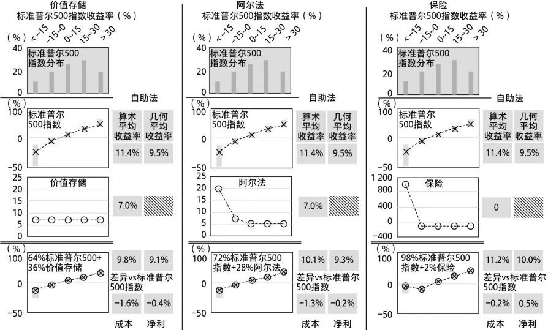
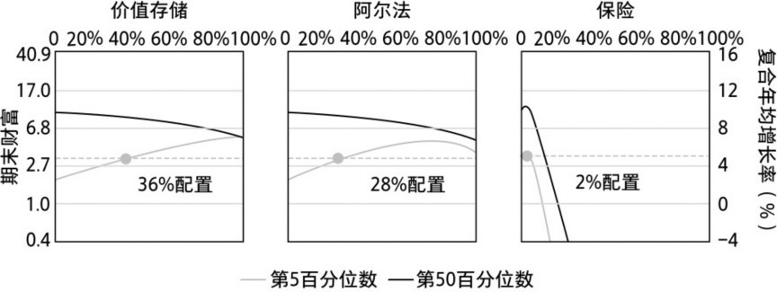
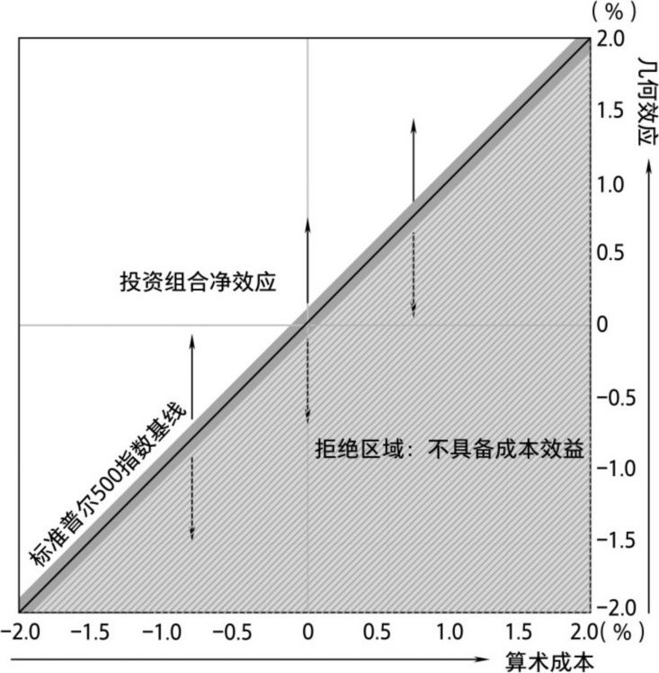
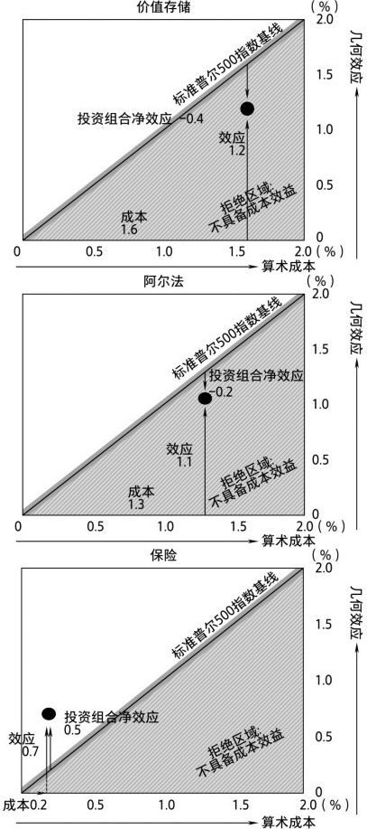
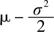
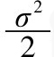
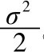
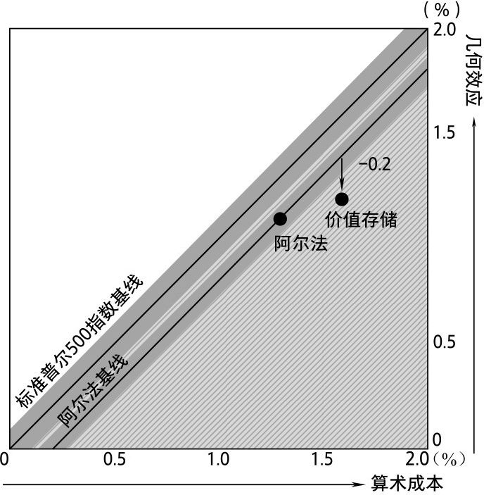
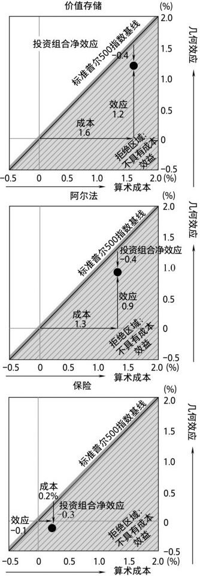
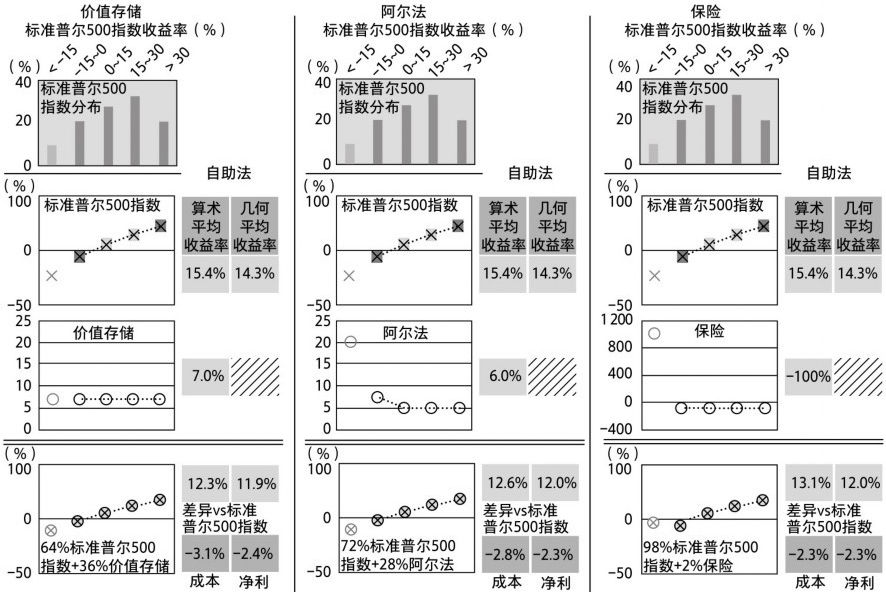

# 第五章 整体论

## 时钟里的布谷鸟

我一直记得幼年时美好的一幕：祖父在他狭小的地下室里，手持放大镜埋头工作。祖父是瑞士裔德国人，他的家位于纽约州北部。那时，作为一名退休医生，他正满怀热情地追随前辈的脚步——制造钟表（尽管那也可能是他钻进工作室，躲避祖母的借口）。记得有一天，他在研究一台战前的老式布谷鸟钟。这座钟看起来像一个盒子，更像一座山墙上刻着山羊头的小木屋。他仔细拆开它，小心翼翼地取出里面所有的零件。我花了数小时观察桌上的小零件。小齿轮、杠杆、破烂的风箱，以及毫无生气的木质杜鹃鸟，零零散散，像是一堆准备扔进垃圾桶的碎片。看着这些拆分的零件，我无法想象它们之前作为一个相互作用的整体时所呈现的奇妙表现。

没有哪个独立的零件可以记录时间，即使是大致记录也做不到！还原论者可能会说，将所有零件都放在雕刻着山羊头的旧木盒里，把它挂在墙上，也不会改变这一事实。那么，为什么不能通过观察组成部分的属性来解释一个物体的属性呢？

就布谷鸟钟而言，还原论的观点不能说服我。原因何在？各个组成部分的功能价值只是它们相互关系的结果。涌现属性不存在于单个组成部分中。只有从整体看，这些属性才显而易见。

许多众所周知的系统都有涌现行为，比如鸟群、鱼群、群居的陆生动物、语言、思维、经济、市场等。在这些系统中，相互作用的各部分会产生不可预测、不可还原的复杂行为。（我曾通过研究真实的和模拟的鸟群活动来提高场内交易技能。你知道了一个商业秘密。）避险投资也是复杂系统。

亚里士多德说：“整体大于部分之和。”他可能是这么说的，但在《形而上学》中他却不是这么写的。亚里士多德写道：“整体并不是部分的累积，而是部分之外的东西。”此外，“整体不等于各部分之和”。就我们的风险缓释而言，亚里士多德的话是高于一切的信条。

就像他的功能性本质主义关注动物相互关联的部分一样，亚里士多德也关注到事物。“功能性本质主义”是更精准的希腊语翻译，更适合我们的语境。我们在圣彼得堡悖论中看到了这一点，整体（游戏中实际实现的财富）远低于预期的各部分之和（所有可能财富结果的平均数）。我们在圣彼得堡商人贸易中也看到这一点，购买一份独立的、带来金钱损失的保险会提高商人的整体几何财富，尽管它会降低平均财富。它也体现在两个魔鬼的骰子游戏——价值存储避风港和保险避风港中。通过将部分现金转移到期望收益率为0的赌注中，并远离高期望收益率的赌注，你实际上增加了自己的整体财富，尽管（在多元宇宙中）减少了平均财富。（我希望我已经让你相信，这一切都出于简单的有关复利计算的数学原理，而不是什么魔术。）整体确实可以远大于各部分之和，尽管不一定总是如此。

“整体的”（holistic）是一个新词，可以追溯到20世纪20年代。其含义反映了它的希腊语词根holos，意为“全部的”。整体是各部分表现出连贯性的唯一参照，而不是散落在祖父桌子上的零件的集合，或扔进协方差矩阵的数字。

就像我小时候思考布谷鸟钟一样，投资管理经常会出现还原论错误。人们单独分析每个部分，也单独分析更大整体（投资组合）中的部分。现代金融学认为，取投资组合中的各部分，了解各部分的算术期望收益率、波动率和协方差，对其进行估值，然后将它们组合在一起，之后汇总算术收益率（尤其是夏普比率或类似的指标），就可以很好地理解整体。然而，最重要的投资组合效应是由各独立部分的递归性、倍增性的交互作用所驱动的，还有时间因素在起作用，这些却被简化为一种更易处理的形式，我直言为幼稚的形式。

就布谷鸟钟而言，它的许多相互作用的部分是独立的、分离的。这种现象被称为弱涌现：各部分的相互作用不会让彼此发生改变，却创造了只有在整体中才能观察到的特性（在部分中无法观察到）。当然，布谷鸟钟的动态是自上而下由钟表匠预先确定的——这种机制可以追溯到18世纪。汝拉溪谷的瑞士钟表制造商瞥一眼祖父凌乱的工作台，就能立即想象出整个钟表系统。涌现是相对于观察者而言的。（那些否认战前布谷鸟钟有不可预测和不可还原表现的人，很可能从未拥有过它。）

有人可能会说，弱涌现在前面提到的许多赌注中也发挥着作用。所有下注在整体上具备的属性（尤其是几何平均数或财富中位数）是累加单次下注所不具备的。单次下注的再平衡和复利效应被不断迭代，整体属性来自这种交互作用。如果更细致地观察我们的骰子游戏，你会发现避风港大幅增加期末财富的原因是游戏的迭代性质。每次掷骰子结束，赌注的规模被重置或再平衡，为下一次掷骰子提供资金。因此，避风港可以在主游戏中补充，或增加赌注。特别是，就算上次投掷造成了巨大损失，你也不会屡屡付出惨痛的代价。具有成本效益的避风港让你远离了伯努利瀑布的边缘。它们实际上改变了骰子游戏——防止后续下注规模的骤降。现在，这些赌注不再彼此孤立、单独行动，而是相互作用。因此，形成了一个全新的整体，一个与各部分之和截然不同的整体。这就是所谓的强涌现。

在圣彼得堡商人贸易中，这种强涌现意味着，部分赌注的价值只能相对于整体赌注而言。其自身价值（就商人的保险合同而言，每批货物的平均损失为300卢布）在与其他部分结合时表现出截然不同的状态（结果是每批货物总收益为119卢布）。

这就是投资的相对论：我们无法确定一项投资，特别是风险缓释投资的单一价值。相反，它的价值是独一无二的，是相对于观察者而言的，或者说，是相对于观察者的整个投资组合的更大视角而言的——特别是，它与该投资组合的倍增动态相互作用的方式是独一无二的。因此，风险缓释投资具有很高的情境依赖。确定现代金融分析框架的传统还原论回避的正是整体因素。

## 睁开双眼

有句古老的俄罗斯谚语是这样说的：

沉湎于过去，失去一只眼。

忘记过去，失去双眼。

如果只看到事情发生的一种方式，并将其视为唯一可能的结果，换句话说，如果过度推断过去，就会陷入所谓的朴素经验主义。为了避免这种情况发生，我们需要在许多可能发生但从未发生的路径背景下审视过去，思考这些结果。我们将使用一种被称为自助法的技术，这是对抗朴素经验主义的公开尝试——它让我们睁开双眼。

最重要的是，有了自助法，我们不需要特定的模型来描述标准普尔500指数收益率在未来的分布情况。当然，我们总能想出一些模型。如果这样做，我们很可能想要从过去的数据中拟合出一个分布，就像用新的四角化菱形三十面体d120骰子掷出过去120年的数据。现在，除非使用复杂的、带有多个参数的自然分布来拟合数据，否则我们兜了一圈又回到起点。人们会因此给予我公正的指责，说我为了证明自己的观点故意捏造了这些参数。这就是我们使用自助法的原因。用专业术语来说，自助法被称为非参估计，因为它避免了分布假设。所以，与第一部分中骰子游戏的目的一样，我们使用自助法的目的是保持审慎、简单、直观，最重要的是保持透明。我们只需要d120骰子，一切都是摆在明面的。

现在，回想一下，我们想观察上一章三种避风港的卡通收益对标准普尔500指数投资组合的影响。具体来说，我们希望在降低系统性风险时观察它们的投资组合效应。

在上一章中，我们创建了1万个标准普尔500指数25年的复合收益率路径（通过投掷10 000×25=250 000次d120骰子），实际上已经开始使用自助法。这些路径是我们的“替代历史”，或者说，我们不仅知道标准普尔500指数收益率的实际路径，而且知道它可能发生的更多路径。

按照本书一贯的形式，我们在每条路径中，将25个标准普尔500指数年收益率与25个避风港收益率进行匹配，对应三种避风港的卡通收益率。我们为价值存储、阿尔法和保险避风港三种投资组合分配的权重分别是36%、28%和2%（稍后会解释权重分配背后的原理）。一旦形成三种新的标准普尔500指数风险缓释型投资组合（每次骰子投掷后，都会再平衡避风港配置），我们就可以将它们的复合业绩与标准普尔500指数进行比较。

这就是自助法（它是“有放回的”，因为无论何时掷出某个点数，我们都可以再次掷出该点数）。这个概念的灵感源于循环“自助”（就像虚构人物蒙赫豪森男爵所称，他是靠拽着自己的头发从沼泽中出来的一样）——我们是从另外的样本（标准普尔500指数过去120年的收益率）中循环采样（投掷d120骰子）。

我们可以同时为标准普尔500指数投资组合以及标准普尔500指数+避风港卡通投资组合掷骰子。然后，分别计算二者的几何平均收益率（或复合年均增长率），从而在同一基准上，为相互竞争的投资组合提供风险缓释记分牌。请注意，自助法允许我们使用不同的风险缓释策略去运行和观察多条路径，就像与魔鬼玩多次游戏一样，尽管现在使用的不是大家非常熟悉的标准六面体骰子，而是有些陌生的多面体骰子。

如果此刻你略感困惑，那么我简单概括一下：我们基于过去120年的标准普尔500指数收益率，精心设计了一个试验，可以同时检验标准普尔500指数投资组合以及标准普尔500指数+避风港卡通投资组合的结果。理解了吧？好，让我们现在开始吧！

## 临床试验

上一章我们以三种虚构的卡通收益形式创建了三种典型的避风港。现在，是时候检验它们在临床试验或实验中的功效了。制作这些卡通避风港原型的目的是，将第一部分关于具有成本效益避风港的“猜测”形式化。根据费曼的建议，下一步是“计算猜测的结果，看看如果猜测是正确的，意味着什么”。

到目前为止，本书所有内容都指向这一点：检验风险缓释是否能够以及如何通过降低风险来增加财富。这是激动人心的时刻，因为它有悖于我们的所学、所想。

就像在生物医学试验中一样，我们正在构建并检验关于避风港干预或疗效的假设。也就是说，这种避风港疗法是否具有成本效益？其副作用（或代价）是什么？它是否在统计学意义上增加了净值？

将自助法之下每种风险缓释投资组合的相对表现，视为对每个卡通避风港原型假设的检验结果。如第一章所述，我们的零假设是：“某种策略可以具有成本效益地降低投资组合的风险。”我们的目标是，基于否定后件的演绎推理来证伪这一零假设，可以通过否定条件前提来做到这一点：“添加该策略会随着时间的推移提高投资组合的复合年均增长率。”如果否定了该前提，就否定了零假设。将标准普尔500指数作为对照组或基线案例，检验我们的三种风险缓释投资组合，判断其复合年均增长率是否相同，形成简单明了的显著性检验。

概括地说：避险投资既有可测量的算术成本，也有可测量的几何效应。当避风港的效应超过其成本（投资组合的净效应为正）时，它就具有成本效益。

图5-1显示了各类卡通避风港的风险缓释记分牌，展示了我们的试验结果。你可能发现它们似曾相识。其框架与魔鬼骰子游戏中叉与圈收益概况图的框架完全相同，目的是确定每种风险缓释策略的影响。

图5-1的上数第一行描绘了标准普尔500指数120年的年收益率频率分布（分为＜-15%、-15%～0、0～15%、15%～30%和＞30%五个区间）。第二行是标准普尔500指数收益率概况（请注意，由于这只关乎标准普尔500指数，所以整行都相同）。第三行是各类避风港的收益率概况。第四行是混合型投资组合的收益率概况。右边的两列（标有“自助法”）显示各类别及整体的算术收益率，与标准普尔500指数之差在底部显示为“成本”。此外，你可以看到几何平均收益率或复合年均增长率中位数。这就是我们每个风险缓释投资组合的相对得分。复合年均增长率的影响，或者与标准普尔500指数的差异（显示为“净利”）决定了哪种风险缓释策略在我们的记分牌上处于领先地位。

添加卡通避风港后，标准普尔500指数投资组合的算术平均收益率（11.4%）在三种投资组合中都会降低：添加价值存储避风港，算术平均收益率降至9.8%（-1.6%）；添加阿尔法避风港，降至10.1%（-1.3%）；添加保险避风港，降至11.2%（-0.2%）。原因显而易见：每类避风港自身的算术平均收益率都低于标准普尔500指数，混合型投资组合的算术平均收益率是其组成部分的加权平均数。或者，简单地说，用较大数字（标准普尔500指数平均数）平均较小数字（避风港卡通平均数），其结果总会低于较大数字。如图5-1所示（以及前面提到的），价值存储避风港和阿尔法避风港的独立算术平均收益率都是7%（是的，设置目的就是让它们在算术基础上相等）。保险避风港的独立算术平均收益率为0。

图5-1　叉与圈收益概况图：风险缓释记分牌

然而，每种投资组合的几何平均收益率（或复合年均增长率中位数）更为微妙：在价值存储和阿尔法风险缓释投资组合中，复合年均增长率中位数分别从标准普尔500指数投资组合的9.5%降至9.1%（-0.4%）和9.3%（-0.2%），但在保险风险缓释投资组合中，复合年均增长率中位数提高至10.0%（+0.5%）。

根据自助法的经验估计，我们以95%的显著性水平知道，标准普尔500指数的复合年均增长率中位数落入9.4%至9.6%区间。这是复合年均增长率中位数的95%置信区间。因此，复合年均增长率中位数9.4%设定了零假设95%的拒绝边界。

价值存储投资组合的复合年均增长率中位数是9.1%，低于9.4%的拒绝边界。因此，我们必须（以95%的显著性水平）拒绝这一零假设，即价值存储卡通收益是具有成本效益的风险缓释策略。它不符合要求。同样，阿尔法投资组合的复合年均增长率中位数9.3%也低于9.4%的拒绝边界，因此，也必须（以95%的显著性水平）拒绝它是具有成本效益的风险缓释这一零假设。它被淘汰出局。

但保险投资组合复合年均增长率中位数是10.0%，不低于9.4%的拒绝边界。显然，不能（以95%的显著性水平）拒绝保险卡通收益是具有成本效益的风险缓释的零假设。（请记住，我们无法证明什么是有效的，只有当它无效时才能否定它。）因此，保险投资组合胜出——在风险缓释投资组合领域处于领先地位。（这也是一件好事，否则本书的结局会很惨。）

从这个角度来看，如果将2%的收益分配给固定的年金（或另一种价值存储固定收益），以使投资组合的几何平均收益率提高0.5%（达到保险收益的效果），那么年金的收益率必须超过30%，这显然是一个很高的要求。将其与保险收益率做一个比较——保险收益率提高0.5%，年均收益率为0。

这个例子一目了然，证明了整体确实远远大于部分之和。它也是从算术收益率较低的帽子中拽出几何收益率较高的兔子的另一个例子。（我向你保证过，保险卡通收益激增的暴跌期获利会产生“迷之效应”，情况就是这样。）

我们的记分牌是根据几何平均收益率（或复合年均增长率中位数）来计算的。几何平均路径是中位数路径，或第50百分位数路径，当将其最大化时，我们就是在提高射击的精度（杂乱对象的中心）。但正如我们从凯利准则中了解到的，在某种程度上，这是随意选择了要最大化的百分位数，甚至是对其他百分位数的歧视。

我们调整了每种投资组合中每类避风港的配置规模。图5-2是三种卡通避风港风险缓释投资组合第50和第5百分位数结果（期末财富和复合年均增长率）的动态图：

图5-2　寻找最优卡通避风港配置规模

与投保的骰子游戏一样，大致相同的保险配置规模最大化了第50和第5百分位数的财富结果（以及所有的百分位数结果）。而其他避风港则不具备这种最大化的一致性（就像凯利准则），你必须选择任意的点估计来最大化。（要是萨缪尔森仍能发表意见，他会说“证明完毕”。）

我们还看到，“金发姑娘”权重适用于保险配置：不冷不热。你只需要为保险加一撮盐，它就成了这道菜最重要的配料。

为了正确地构建风险缓释投资组合，在同一基准上对其风险缓释的成本效益进行比较，我们需要将每种投资组合的风险程度标准化。最好的方法是使其不良路径（最差的情况，如第5百分位数路径）的结果相同，见图5-2的虚线。我们为价值存储、阿尔法和保险避风港配置的权重分别是36%、28%和2%，对应这些风险缓释投资组合复合年均增长率第5百分位数的4.8%。你可以看到，在这三种投资组合中，选择4.8%作为理想的、一致的复合年均增长率第5百分位数，原因是它同时最大化了三者的第5百分位数。这就是我们在分析过程中为各类卡通避风港选择配置规模的方式。

与第三章讨论的部分凯利下注非常相似，它有效地最大化了低于第50百分位数（凯利最大化的那个百分位数）的结果。通常情况下，它们并非同时最大化。（显然，价值存储或阿尔法投资组合的结果对我们选择的第5百分位数4.8%并不敏感，因为其结果中位数随配置规模的增大而降低。）

请注意，相较于其他两种投资组合，保险投资组合98%的标准普尔500指数配置要大得多（其他投资组合的标准普尔500指数配置分别是64%和72%），而这三种组合都处于同样的不良路径（第5百分位数路径）。我们看到，具有成本效益的风险缓释不仅可以降低隐患或系统性风险，也可以让你承担更多风险（更大比例的标准普尔500指数配置）。

请注意，对三种避风港投资组合来说，从标准普尔500指数复合年均增长率第5百分位数的2.7%到风险缓释投资组合复合年均增长率第5百分位数的4.8%，这是一个很大的增幅。我们已经设定了各类避风港的配置规模，使每种风险缓释投资组合在可能结果的范围内都有相同的调整后精度——能够在同一基准上进行比较。然后，我们可以看到它们的复合年均增长率第50百分位数的差异，或其准确性，以确定哪一个是威廉·泰尔的精准一击。

我们正在跟踪每种投资组合的复合增长率——它们具有相同的风险规模。因此，不同风险缓释投资组合的复合年均增长率差异表现为可见的显性成本，而不是隐蔽的隐性成本。如果不在同一基准上比较，那么相对于多数情况下保险避风港的明显显性成本，价值存储和阿尔法避风港较高配置产生的隐性成本（标准普尔500指数配置比例）很难被察觉到，这两种成本在经济上同等重要。

只有一个记分牌，那就是在我们脚下这条路径上资本的复合比率。所以，无论是第50百分位数还是第5百分位数，我们都要走好脚下的路（尼采的生存要事），而不是走好期望之路。我们正在追求战略优势，完善每条百分位数路径，构建每条百分位数路径的稳健性，目的是确保我们所走的唯一的路顺畅通达。为防止遗忘，再次强调：N总是等于1。

## 成本与效益的关系

成本效益分析（CEA）是评估不同疗法或干预选择的相对成本和结果（或效果）的方法。其关键是提供一个决策过程，权衡不同干预选择的成本和效果。（它最常用于医疗保健领域。）效益的重要性是否证明了成本的重要性？成本效益分析权衡在简单的二维图中最为明显，该图通常被称为成本效益平面图（见图5-3）。通过平面图上成本和效益两个轴，我们可以轻松查看和比较。基线案例（如关照标准）是图的起点（0，0），y=x线表示增量成本等于增量效益，因此，不同情况表示为成本效益比。但我们将颠倒轴的位置（成本变成x轴）。我们可以将任何给定的风险缓释投资组合表示为成本效益平面图上的一个点，该点与y=x处标准普尔500指数基线的偏差代表该投资组合复合年均增长率中位数的超常业绩。

图5-3　成本效益平面图

在我们的分析中，x轴的算术成本只是将每个卡通避风港收益添加到标准普尔500指数上的算术平均收益率的变化，或在叉与圈收益概况图底部标记“成本”的单元格（尽管正负符号反过来了，因为叉与圈收益概况图中的负数在这里是正成本）。在叉与圈收益概况图底部标记为“净利”的单元格——或将卡通避风港收益添加到标准普尔500指数后的复合年均增长率中位数——表示为高于对角线标准普尔500指数基线的任何点，我们称为投资组合净效应。最后，y轴上的几何效应是x轴上的算术成本与投资组合净效应之和。

当算术成本等于几何效应时，风险缓释投资组合的复合年均增长率中位数与未添加风险缓释的标准普尔500指数投资组合复合年均增长率中位数相同，且该点位于对角线上的某个位置（取决于成本和效益的大小）。点的位置越是高于风险缓释投资组合的对角线，其成本效益越大，反之，其成本效益越小。

标准普尔500指数的对角基线与其复合年均增长率中位数95%的置信区间一致。对角线下方的区域，更具体地说，拒绝边界下方的区域，或低于对角置信带的区域，是我们的零假设检验的拒绝区域。如果风险缓释投资组合图上的某点低于拒绝边界，那么该点不达标，因为将避风港收益添加到标准普尔500指数中，并不会随着时间的推移提高该投资组合的几何平均收益率或复合年均增长率中位数。

大多数投资者为获得净效应而添加风险缓释策略，但并未适当考虑付出的成本，因此相当于没有考虑到投资组合的净效应。图5-3提供了视觉上的便利，让我们深入分析成本以及避风港的成本效益，或复合年均增长率优异业绩（更大的可能是不良业绩）的根源。它源于低算术成本、高几何效应，还是某种组合？避风港真的有效吗？x轴上或低于x轴的数据点意味着负效应，无论位于何处都不能算避风港。如果没有这个图形框架，成本效益分析就不会如此显而易见。

图5-4是每个卡通风险缓释投资组合的成本效益平面特写，放大以显示每个算术成本、几何效应和投资组合净效应（或复合年均增长率中位数业绩）。

图5-4　几何效应-算术成本=投资组合净效应

两种隐藏在避险投资核心的相反力量，影响着我们的收益率分布和实际业绩。现在，它们变得清晰可见，甚至非常直观。这就是成本效益平面图的简单优雅之处。

从上到下，这三张图的模式是，风险缓释的成本随着效益的降低而降低。但重要的是，成本的降幅大于效益的降幅。因此，从上往下，成本效益是上升的。

风险缓释的矛盾或权衡一直存在于两种相反的力量中（成本与效益，或算术成本与几何效应）。现在，我们非常清楚，较低的算术收益率（成本）是为了获得几何收益率（效益）。天下没有免费的午餐。但是，如果你能将这种权衡向有利于你的方向倾斜，效益超过了成本，从而产生正的投资组合净效应，那么风险缓释就会带来复利的净增长，从而增加财富。此时，你的风险缓释措施具有成本效益。这就是添加避风港可以降低总量（或平均数），同时提高整体几何效应（或百分位数范围）的原因。我们找到了风险缓释的信条和地下宝藏。

尽管保险避风港的算术收益率在三类避风港中最低，但其优势是投资组合成本非常低，即算术平均收益率的降幅较小，这一点显而易见。原因是，相对于其他配置规模，保险避风港2%的配置非常低，但几何效应却很高，这要归功于它爆炸性的暴跌期收益，或称十倍股收益。保险避风港非常高效。

回想一下第三章，降低算术成本加上更大的投资组合净效应，这种双重作用力在成本效益分析框架中被称为经济型优势策略，价值存储和阿尔法卡通避风港因此被称为劣势策略。我们现在明白了，保险避风港较低的算术成本（或者更高的效益），才是经济型优势策略的驱动因素。

风险缓释的收益越具有爆炸性、越高效（暴跌期收益越大），我们就越不需要特定的几何效应。对几何效应的需求越少，算术成本的影响就越小（从较低的算术收益率可见）。这实际上就是简单的经济交换。

在现代定量金融几何布朗运动的专业框架中，与复合年均增长率变化成正比的成本和效益在计算几何收益率时表示为

，算术平均收益率μ的变化代表算术成本，

的变化代表几何效应。但它们都假设为对数正态分布——众所周知，在现实中这是一个轻率的假设。我们的成本变化与μ的变化一致，但效益仅近似为

。（我们的分析框架没有做出分布假设。）这里的数学细节并不重要。但现代金融显然明白这一点，影响就体现在其基本模型中。它只是不敢改变其数学方向，以提供不那么显而易见的解决方案（例如，几何平均数或中位数）。

希望你已经注意到，我们以真实的股票市场收益重现了圣彼得堡商人贸易。更重要的是，你知道了它的来龙去脉。

下一章我们会将真实世界避风港的数据点放在成本效益平面图上。我们的目标是基于相对成本效益持续改进现有的风险缓释计划（而非基于绝对成本效益，直接否决计划）。我们发现，成本效益分析在这方面发挥了很大的作用，这甚至可能是它的主要功能。例如，虽然阿尔法避风港的投资组合净效应为-0.2%，但在提供同等程度风险缓释（投资组合复合年均增长率的第5百分位数为4.8%）的情况下，仍然比价值存储避风港-0.4%的投资组合净效应（95%以上的统计显著性）高0.2%。我们为拒绝区域创建了一个新的基线案例（或新的关照标准），我们可以创建阿尔法风险缓释投资组合基线（而非标准普尔500指数基线）来检验复合年均增长率业绩，如图5-5所示。

图5-5　相对成本效益分析：移动基线

价值存储风险缓释投资组合的点位于拒绝区域。为了达到风险缓释的预期效果，从价值存储转移到阿尔法避风港是经济的做法。应该从绝对标准和相对标准两个方面来看待风险缓释的成本效益。如果我们发现，现实世界中具有绝对成本效益的避风港非常罕见，那么记住这一点尤为重要。至善者不必是善之敌。

## 重组

与期望算术收益率相比，避风港收益的形态对投资组合净效应的影响至少同等重要（通常更为重要）。我们以最后一个例子（见图5-6）来证明这一点。

假设我们重新创建一个自助法试验。通过掷d120骰子创建25年的路径，获得25个标准普尔500指数收益率和25个避风港收益率，随机重组这些收益率发生的顺序。需要明确的是，我们仍有最初d120骰子投掷的25个标准普尔500指数收益率和25个避风港收益率，但现在它们是随机组合，而不是根据避风港收益率进行调整。这意味着每个风险缓释投资组合的收益率和频率都保持不变，但每个收益率的具体年份不再与标准普尔500指数收益率相关。

猜猜看，这种自助法下的风险缓释策略，其成本效益会发生怎样的改变？

价值存储风险缓释投资组合的净效应自然是相同的，因为无论是否重组，收益率总是相同的。其他两类避风港的投资组合净效应降低了：阿尔法避风港降低了0.2%，为-0.4%；保险避风港降低了0.8%，为-0.3%。现在，三个点都落在了拒绝区域，都不具有成本效益——三振出局。它们收益的总期望值仍等于其期望值的和。

图5-6　重组后的投资组合净效应

不管这些收益如何产生，各类避风港的总收益（或算术平均数）应该和以前一样。因此，这些避风港的算术成本与它们最初的成本完全相同，在成本坐标中可以看到这三个点。然而，阿尔法避风港的几何效应已经下降，保险避风港的几何效应降幅最大，现在它们的避风港收益与标准普尔500指数脱钩了。

我们已经拆解了避险机制（或降低投资组合重大损失的收益模式）中相互作用的齿轮，因此，对保险避风港来说，整体（或复合年均增长率中位数）的作用就没那么大了。剩下的只是作用微弱的多元化（因为随机重组产生了无关的收益匹配），显然无法提供具有成本效益的风险缓释。

我发现，很少有专业投资者或配置者能猜对这一点。希望这能让你感觉好一点儿。

各部分相互作用的价值只能在整体中看到，这意味着真正重要的是避风港收益的形态。

前面我提到了凯利准则和魔鬼骰子游戏中的保险风险缓释策略，特别提到了它们通过降低风险增加财富的方式。在现实世界中，风险缓释的权衡更不稳定，实现财富增长的目标并不容易。具有成本效益的风险缓释是一个很微妙，甚至很难评估的命题，更别说实施了。这就是现代金融和大多数从业者放弃它的原因——他们宁愿生活在巨大的风险困境中。（在有关养老金不足的会议上，他们屡屡表示，与其独自冒险，不如随大溜，消极等待。）

## 不可知论

到目前为止，我们在自助法试验中已经比较了所有1万条25年路径的财富中位数（几何平均数）或复合年均增长率，并将结果记在记分牌上。我们还对每类卡通避风港进行了配置，使每种投资组合的第5百分位数路径相同（在同一基准上）。正如我们所看到的，每种风险缓释投资组合的第5百分位数路径都远高于标准普尔500指数的第5百分位数路径——复合年均增长率高出78%，25年期末财富高出66%。我们修正了这一较高的第5百分位数路径，然后观察了三种风险缓释投资组合在中位数路径上的差异。

记住，任何赌徒都可以在暴跌时想出一些好点子，提高第5百分位数；但成功的标准是同时提高中位数（最好是提高所有百分位数）。简言之，这才是具有成本效益的风险缓释措施。

尽管我们的工作细致周密，但最好退后一步思考一下，我们的方法中是否存在盲点。我们对1万条路径进行采样，但我们的人生中没有1万条路径。人生只有一条路。提高第5百分位数路径可以提高我们的精确度，使我们不后悔走了脚下那条路——它可能正是第5百分位数路径。另一方面，最大化第50百分位数路径提高了我们的准确性，使我们在多数情况下能够踏上正确路径，同时避免希望渺茫的路径（平均路径，如圣彼得堡悖论）。我们正在与运气抗争，但也许还可以做得更多。

我们不想过多关注未来标准普尔500指数收益率的分布情况，也不想过多关注d120骰子形态对自助法分析的影响，否则就会重新陷入内部矛盾——具有成本效益的风险缓释需要神奇的水晶球。恰恰相反，具有成本效益的风险缓释应该是不可知论的投资。我们不想对市场涨跌下注。市场自行其道，我们不想被动地预测。

假设没有“暴跌”，或者确切地说，在任何给定的年份都不存在标准普尔500指数收益率的最低区间（下跌大于等于15%），那么在有限的路径里，哪种避风港表现最佳？凭直觉，你不会期望任何避风港发挥多大价值，因为我们假设暴跌不存在！但要系统地回答该问题，只需要在实施相同的自助法时，限制与-15%或更低标准普尔500指数收益率相对应的d120骰子的结果。结果见图5-7。

由于标准普尔500指数收益率从未跌至-15%或更低，保险避风港每年都会损失100%，我们可能会认为，与其他两种情况相比，保险避风港会处于明显劣势。毕竟，价值存储和阿尔法避风港总是有正收益率，这就是低成本的风险缓释，对吗？事实证明，即使在这种情况下，保险避风港和阿尔法避风港卡通投资组合也有相同的复合年均增长率中位数——或相同的相对成本效益，而价值存储避风港卡通投资组合的复合年均增长率中位数比它们低0.1%。

这可能令人惊讶，但显而易见的是，保险投资组合-2.3%的算术成本低于阿尔法投资组合-2.8%的算术成本，低于价值存储投资组合-3.1%的算术成本。这是因为，阿尔法避风港和价值存储避风港的配置分别为28%和36%，相比之下，保险避风港2%的配置要小得多。在这种限制下，其投资组合以小成本得到的正效益为0（因为它未从-15%或更低的标准普尔500指数收益率中获得任何正收益率）——由其投资组合净效应与算术成本相同可见，而阿尔法投资组合和价值存储投资组合分别获得+0.5%和+0.7%的效益。保险避风港和阿尔法避风港的投资组合成本效益都达到12.0%的复合年均增长率中位数（或几何平均收益率），比标准普尔500指数低2.3%，而价值存储投资组合的成本效益是11.9%的复合年均增长率中位数。

我们自知没有能力预测非暴跌期的低风险情况。我们希望避免从战术角度思考风险缓释，因为这需要有一个神奇的水晶球。但限制性自助法再次显示了令人震惊的发现：任何对暴跌的预测（认知）技巧都不应该影响在这些收益之间做出的决策。在战术层面等待暴跌时，阿尔法和保险风险缓释投资组合在特定的暴跌保护水平下（一旦到达）具有相同的复合年均增长率中位数。在等待“钟声响起”时，这两种避风港的成本是一样的。因此，如果没有预测暴跌的技能（或者预测水平很差），你应默认最佳选择为在战略层面上最具成本效益的策略。

这一令人震惊的结果表明，战术性风险缓释决策过程是一种良性循环：为了在等待暴跌时降低成本，战术方法是在不同种类（如价值存储、阿尔法和保险）的避风港之间切换。但实际上，非暴跌期成本最低的选择与暴跌期最具成本效益的选择（即保险避风港）是同一个——如此一来，就不必使用战术技巧了，决策过程因此变得容易。

图5-7　无暴跌情况下的自助法：对暴跌而言，最佳避风港是不可知的吗？

我们所走的唯一的路有可能以许多不同的方式展开，这一点需要特别关注。毫无疑问，在非暴跌期，如果不采取任何风险缓释措施（在本例中，只有标准普尔500指数投资组合），你的状况当然会更好。但这不是重点。关键是在非暴跌路径中，一种避风港的收益率不会高于另一种（至少在阿尔法避风港和保险避风港之间是这样）。无论走哪条路，我们对避风港的选择都是不可知的。

然而，如果决定不采取任何风险缓释措施（这意味着仅有标准普尔500指数），我们就不是在同一基准上比较不同的策略。（尽管有央行干预，但我们不能假设暴跌不存在。）对风险性质截然不同的投资组合进行比较，犯了虚假对等的逻辑谬误。如果你只想单独持有标准普尔500指数或类似的资产，获得复合年均增长率第5百分位数的2.7%（当你在良性的路径上，没有配备风险缓释措施却业绩良好时，你会暗自庆幸），那么你应该将其与我们的三种风险缓释策略进行比较，将复合年均增长率第5百分位数的4.8%调整到2.7%。

为了进行上述调整（当然，不只是去掉风险缓释），我们只需要利用投资组合杠杆，在每种风险缓释的投资组合中增加更多的标准普尔500指数风险敞口，直到复合年均增长率第5百分位数从4.8%降至2.7%。我们发现，做到这一点需将179%的标准普尔500指数配置与36%的价值存储配置相匹配，将187%的标准普尔500指数与28%的阿尔法配置相匹配，将225%的标准普尔500指数与2%的保险配置相匹配。我们使用标准普尔500指数的新杠杆配置再次运行前面的自助法（不存在-15%或更低的标准普尔500指数收益率），价值存储、阿尔法和保险避风港投资组合的复合年均增长率中位数分别为26.9%、26.9%和27.6%（相比之下，标准普尔500指数的复合年均增长率中位数为14.3%）。

请注意，我并不建议所有人都这样做。我唯一的观点是，我们应该避免将风险缓释投资组合的高度限制性（比如无暴跌期）业绩与无风险缓释的投资组合做比较。

具有讽刺意味的是，当我们诚实地将投资组合放在同一基准上进行比较时，最佳风险缓释解决方案是稳健的，它与何时发生暴跌，甚至是否再次发生暴跌无关。（肥尾是多余的。）这意味着我们战胜了运气。

## 进攻性防御

我们的避风港与预测要求的差距有多大？它们应在多大程度上具备战略性而非战术性？在思考这些问题前，我们需要提出另一个问题。我们的叉与圈收益概况图显示了避风港在最差区间保护标准普尔500指数收益率的情况。这显然是风险缓释的防御表现，但它是否同时起到了进攻的作用？

请记住，我们在自助法中，将标准普尔500指数的历史年收益率发生顺序进行了随机化。这完全消除了暴跌后风险缓释投资组合再平衡的潜在优势，即通过重新配置避险资产和标准普尔500指数，以更低的价格买入——实质上是买入更多的标准普尔500指数。接下来的问题是：在经历了标准普尔500指数的惨重损失后，其后续收益率是否会更高？让我们来检验一下沃伦·巴菲特的建议，即在股市崩盘期间（最好是在崩盘之后）持续买入股票。

这是一个简单的假设检验。零假设是，标准普尔500指数下跌大于等于15%的后续1年、5年和10年，标准普尔500指数的平均收益率与此1年、5年和10年期间的平均绝对收益率相同。我们将使用d120骰子投掷出120年标准普尔500指数年收益率数据（当然，现在这些收益率需要保持有序）。

遗憾的是，我们不能以95%的显著性水平拒绝这一零假设（令人惊讶的是，显著性水平甚至不足60%）。与它们固有的噪声随机性相比，后续收益率并没有更高。（对日历年的年度数据以及每月叠加的年度数据来说，情况都如此。）

过去10年左右，股市出现了V形复苏，但在股市大跌后买入股票（而不是在任何时候买入）似乎没有显著的统计学意义。换句话说，这些时期，标准普尔500指数收益率没有明显的均值回归。这一观点令人震惊，因为流传的投资理念是在暴跌时买入。沃伦·巴菲特有句格言：“在别人贪婪时恐惧，在别人恐惧时贪婪。”据说在那之前，约翰·D.洛克菲勒说过：“赚钱的秘诀是在街上血流成河时买入。”

简单的逻辑表明，我们应该能够拒绝这一零假设：较低的股票估值会导致较高的后续收益率。股市抛售会降低股票估值，但也有“例外”，因为抛售反过来会降低基本面价值，投资中很少有直接的因果关系。尽管经济学家过分推崇这一观点，但在关于“有效市场”的辩论中，有人认为，一只股票（比如在崩盘后）被低估不会是众所周知的事，否则其价格就不会那么低。这就是经济学家推崇“华尔街随机漫步”假设的原因。该假设是，一旦发生大崩盘，我们就无法获得股票后续业绩的新信息，过去的都烟消云散了。

可悲的是，人们坚持零假设，即在暴跌后购买标准普尔500指数不会对其后续收益率产生任何影响。请注意，它并没有涉及暴跌后很可能出现的特殊价值区域，我们只是考虑一般的系统性风险敞口。但明白这一点仍然很重要。

无论沃伦·巴菲特所谓的“价值”效应是否存在（对我们的自助法而言，它是一种守旧的观点，完全被排除在外），都要记住，风险缓释的进攻性成分仍很强。避风港带来的不仅仅是安全感或稳定性。现在，我们已多次看到，安全的重点是防止赌注在重大损失后暴跌，这将降低随后的复利基数。为防止代价高昂的暴跌，不断调整赌注规模和投资规模（我们称为风险缓释的强涌现性）是一种很好的进攻。

俗话说：“进攻赢得比赛，防守赢得冠军。”（我儿子是曲棍球前锋，我一直因他不明白这个道理而恼火。）格雷厄姆说“投资管理的本质是风险管理，而不是收益管理”，这就是原因所在。但是在投资中，进攻和防守之间的相互作用与在体育比赛中略有不同——二者的协同作用更微妙。拿破仑有句格言，“从防御到进攻的转变是战争最微妙之处”——在对抗运气的战争中尤为如此。

在投资的复利倍增过程中避免落入伯努利瀑布是避险投资的一种攻击性表现。在我们的成本效益分析中，它表现为风险缓释的几何效应超过算术成本。几何效应其实就是进攻。

在投资中，坚实的防守能成就有力的进攻。

## 狭隘的破窗框架

现在应该很清楚了：我们不能在真空中仅根据某一特定风险缓释策略的属性来判断其成本效益。投资相对论规定，一项投资的价值只能通过其产生的投资组合净效应来确定，因此它是唯一的，并且是相对于该（以及其他）特定投资组合而言的。整体往往（但并不总是）远大于部分之和。

对大多数观察者来说，这是一个巨大的挑战。在投资中尤其如此，因为求和或算术平均在数学上是如此直观，而整体或复利的数学则有违直觉。投资组合的成分就像行项目那样显眼。它们在投资组合中不像（少许）盐那样是可溶的，而是像油一样不可溶。

一般来说，在行为经济学领域，该挑战甚至有一个正式的名称——狭隘框架。意思是只见树木不见森林——将投资视为行项目而不是整体投资组合时，产生的习惯性思维或盲点。这是好奇的小男孩第一次看到爷爷的布谷鸟钟运行时犯下的小错误，但对投资者来说，狭隘框架会带来混乱且代价高昂的决策。

就像许多事情一样，条理分明地正确阐述问题的能力是解决问题的前提。靠解决方案去赚钱就更需要这种能力了。

我们使用叉与圈收益概况图和记分牌的目的就是要正确地阐述问题。非常反直觉的现象是，平均收益率为0的保险避风港最具成本效益，而平均收益率为7%的避风港则不具有成本效益（在投资组合路径的第5百分位数上可以看到两者具有同等保护力度）。此外，它完全违背了人们的普遍看法，即保险是昂贵的，是一种净成本；也违背了传统观点，即要实现风险缓释策略的增值，必须有足够大的正期望收益率，或者至少在大多数情况下有正收益率。一开始，它似乎无故降低了投资组合的算术收益率（并在大多数年份中将投资组合拖累成负的行项目），结果却证明，它提高了复合年均增长率。这就是圣彼得堡商人贸易。

所有风险缓释策略最终都需要在损失保护和机会成本之间进行权衡。前者指几何效应，或所避免的投资组合负复利损失。后者则涉及为提供保护而非为投资组合其他部分配置的资本，即算术成本，或降低投资组合算术平均收益率的数额。

就资本配置而言，狭隘框架意味着，投资组合的每个组成部分都是根据其自身的独立优点来判断的，最佳选择通常是价值存储或阿尔法策略，而不是保险策略。投资者几乎总是以降低风险为名采用并解释某种策略。在大多数情况下，这种策略都有正收益率，或者没有显性成本，即使它降低了投资组合的总收益率，甚至在任何情况下都是一种隐性成本。它被称为机会成本忽视，这可能是我们对风险缓释最致命的隐藏偏见。基本上说，整个对冲基金行业正是利用了显性成本和隐性成本之间简单的感知差异（是的，我是在嘲讽）。多元化仍被错误地视为“金融业唯一免费的午餐”，这就是原因所在。

避免这种混乱无序的风险缓释决策需要有整体观，要将整个投资组合收益的隐性成本与替代方案的隐性成本进行比较。说起来容易，做起来却很难。我们做不到时刻警惕。有些领域困难重重却更容易克服，也许我们可以从中吸取经验。

1850年，在《看得见与看不见的》这篇文章中，伟大的自由主义者、法国经济学家弗雷德里克·巴斯夏提供了一个有关框架问题的最佳案例。他可能是第一个引入机会成本概念的人。在其思想实验中，一个淘气的男孩打破了店主的窗户，有人称这实际上是件好事，因为玻璃工有活儿干了。巴斯夏指出，如果认为我们应该通过砸窗户来增加经济活动和增长，其谬误显而易见。这种狭隘框架忽略了店主的隐性成本，店主现在必须花钱修窗户，而不是用于其他可能的消费，比如给妻子买一件新外套，那本可以为裁缝带来生意。店主的财富减少了（相较于男孩没有砸碎窗户的情况），而社区的收入形式只是被重新安排了（从裁缝到玻璃工）。因此，破坏必然带来净成本。思想实验的教训是，我们不仅要考虑部分，而且要考虑整体。我们意识到，机会成本是真正的成本，尽管它看不见。我们需要在同一基准上对备选方案进行真正的比较，以创建一个框架，揭示机会成本。

不作为的错误是看不见的，容易被忽视，我们注意到的通常是作为的错误。然而为后者而忽视前者也是一种错误。政客们经常犯这种错误，比如，他们经常进行具有反讽意味的风险缓释。从根本上说，这种错误与工作密不可分，发现这类错误就是工作本身（每个政府项目都涉及隐藏的机会成本，对立双方有利益冲突）。

我们在第三章提到一个戳心的例子，那就是现代化工农业中的狭隘框架问题。艾伦·萨沃里在其名为“轮牧的整体管理”的演讲中提到了该问题。整体管理大大提高了地表土壤的质量、数量以及固碳能力，这是其他方法无法做到的。（美国中西部成为世界上最肥沃的土地之一，同时也是一个巨大的碳汇，那里放牧着数千万野牛。）陷入狭隘框架的人不具备整体观，他们认为，食草动物（部分中的一个要素）是生态问题，因此生态解决方案是素食。将食草动物从牧场（部分中的另一要素）转移到绵延数英里的耕地上，通过工业化种植的一年生单一作物喂养它们，这确实是一个巨大的生态问题。但以这种方式供养人类而不是食草动物，这个巨大的生态问题依然存在。食草动物的栖息地本就是牧场，所以，在多年生牧草的牧场上管理食草动物是一个有效的解决方案——当相互作用的部分重新结合在一起时，整体会变得更好。（不考虑这一点会付出巨大的机会成本，换来的是另一种巨大的显性成本，即更多耕种、工业化种植的一年生单一作物。）割裂这两部分，带来的生态灾难超出了我们的想象和预测。（羊群在田园牧场土壤中封存的碳含量出乎你的意料。）

除了局部与整体的差异，狭隘框架看起来甚至像短期与长期的差异。纠正其中的一个错误，通常可以避免落入另一个陷阱。

## 遥望前路

我能想到的最有可能出现狭隘框架的案例是赛车的进站。奇怪的是，在该案例中，问题根本不存在。思考一下简化的赛车决策，包括进站更换轮胎。轮胎接触地面，其磨损程度和性能对比赛策略来说至关重要。发动机的动力转化为速度要依靠轮胎，同样重要的是，轮胎能防止赛车驶出赛道。伟大的F1赛车手米卡·哈基宁（人称“芬兰飞人”）曾说，轮胎是他的人寿保险单。

在绕行赛道时，我们有两个基本选择：

1．在整场比赛中坚持使用一套轮胎。为保护轮胎，避免驶出赛道，像戴着眼罩的爷爷一样驾驶赛车。随意加速也许会面对被淘汰甚至撞车和退赛的风险。我们可以选择更硬、更持久但抓地力较差的轮胎，将风险降至最低，但要更谨慎地驾驶，以留在赛道上。

2．中途驶入维修站——虽然等待的感觉很漫长，但更换新轮胎只需要10秒左右。现在，我们可以在比赛过程中使用更软、寿命更短、抓地力更强的轮胎（不需要使用很长时间），安全地跑完全程。我们放弃了宝贵的几秒，目的是在剩下的比赛中（安全地）全力以赴地弥补时间。

正如哈基宁所说，这是一种保险（也是一种最迂回的策略）。但这并非一定会获胜的策略，如果我们在维修站停留的时间太长，如果轮胎没有足够的抓地力来弥补失去的时间，它就是无效策略。那些使用磨损的硬轮胎的赛车手会击败我们。

我们可以通过放慢车速来确保安全，也可以通过另一种方式来确保安全，比如开得更快。

这个决策最终归结为在两种方案的隐性成本之间进行成本效益权衡，但永远不会根据进站时看着其他赛车飞驰而过，而自己10秒原地不动所带来的显性成本进行判断。长期不会屈从于短期，我们也不会因为忽视机会成本而只见树木不见森林。

赛车战略家都是超逻辑的、拥有大局观的超人吗？未必。

拥有条理清晰的框架，是因为我们遥望前路。事实上，我们总览全局，看着整个比赛，看着终点线。终点线一直是我们眼中唯一的记分牌。显然，它也是唯一的目标或意义。

正因如此，我们很难忘记那个目标。尼采说过：“忘记自己的目的是最常见的愚蠢行为。”

## 大海盗

到目前为止，所有的风险缓释检验都让我们坚定地朝着效率最大化和风险缓释成本效益最大化的解决方案迈进。暴跌期收益越高，需求就越少——当无所求时，潜在的阻力或成本就越小。它只是韬光养晦、蓄势待发，几乎没有明显的成本负担。然而，当它开始发挥作用时，就会产生超出其成本许多倍的爆炸性收益。

这就像20世纪60年代的口号“少费多用”，它出自未来主义者巴克敏斯特·富勒（因设计网格穹顶而闻名）。富勒称其为最大限度地“以小博大”，“用更小的成本做更多的事，直到实现零成本”。他的工业设计也遵循了这个理念。（他喜欢四角化菱形三十面体，以此设计了网格穹顶，赋予了房屋优雅别致的外观。）

他甚至在自己的墓碑上提到了“少费多用”思想，墓志铭是“请叫我配平片”。为轻松驾驶飞机，驾驶员可以对操作杆进行配平。飞机在爬升时驾驶员若不想费力地向后拉操作杆，可以设置配平，之后几乎不再需要动操作杆。（多年来，我的飞行教练总是要求我保持飞机的良好配平，以腾出更多的注意力关注其他情况。）配平片实际上是微型飞行表面，就像微型升降舵。微型升降舵并不控制飞机，而是控制升降舵，是升降舵的分形（就像微型副翼是副翼的分形，微型升降翼是升降翼的分形）。所以，你最终可以用很小的飞行控制装置控制一架大飞机（或一艘轮船）。它是狗摇动的尾巴——微小部分影响并间接控制着整体。

整体思维是富勒工作的核心。他创造了自己的协同系统，完善了现在的常用词“协同”的含义。1969年，他的《设计革命：地球号太空船操作手册》出版，书中的一张小插图对协同系统进行了说明，插图名为“大海盗”。

富勒的思想是，我们应该把地球看作一艘宇宙飞船，我们都是拥有有限资源的宇航员。在理想的情况下，作为有限的部分，我们应该协同工作，提高整体效能。问题是，我们注定会为自己的局部所困，无法想象整体。

在富勒看来，邪恶的根源是整体协同论的对立面，即日益专业化的狭隘框架。他认为过度专业化是人类的现代困境。他偏执地认为，这种日益狭隘的框架的设计者是具有整体观的人，这种框架旨在保护他们自身巨大的竞争优势。他将那些享有特权的少数人称为“大海盗”——他们在公海上游荡，在整个人类文明史中控制着国际贸易。这些海盗暗中操作，掌控着全世界的贵族和政客，迫使他们及其臣民进入越来越狭小的生态位，而自己却拥有广阔的世界观。

尤为重要的是，大海盗与海军同时存在，后者在专业领域的培训使他们缺乏竞争力。对无法越过海岸安全线的无经验的水手来说，局部思维是很自然的现象。大海盗不屑于将船停在港口，更喜欢沿着不断扩张的航线，穿越无限的境外海域，在大海和风暴中迎接未知的风险。大海盗拥有更全面的世界视角，至少在富勒不同寻常的历史理论中是这样的。

大海盗顾大局，识大体，努力保持他们的竞争优势。他们可以看到世界的“叉与圈”。富勒称这一优势为“整体思维”，而其他人持有的是“局部思维”。

可悲的是，即使是这些大海盗，也注定要像不幸的、过度专业化的从众者一样平庸。席卷全球的现代化让这些航海叛逆者失去了整体世界观的优势。他们几乎不复存在。

相较于字面意义，富勒的“大海盗”显然更具象征意义。他之所以起这个名号，或构建这个隐喻，也许是为了让人们想到像达·芬奇和米开朗琪罗这种跨学科、有全局观的科学家和艺术家。名号的起源并不重要。

我们寻找的是超级大海盗埋藏的宝藏，不管它是否存在。如果存在，他们的整体思维是找到宝藏的关键。

大海盗代表我们的风险缓释信条。专家的思考和生活仅限于局部，因此只能成为更大游戏中的棋子。大海盗从整体视角思考和生活，他们掌握着整个游戏，甚至整个世界。

“弄潮儿的成功来自其综合能力。”在一个由狭隘框架、盲目的专家组成的世界里，视野开阔、双目炯炯、具有整体观的大海盗才是王者。
