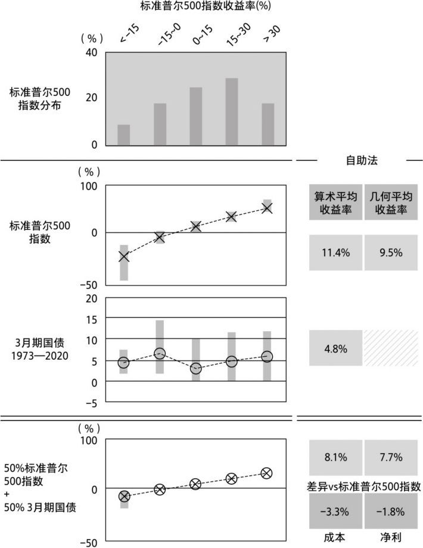
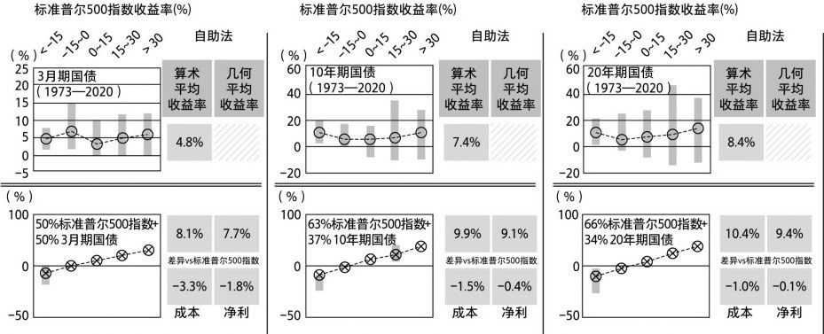
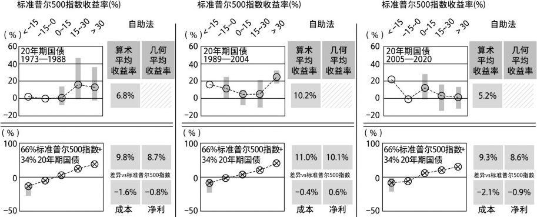
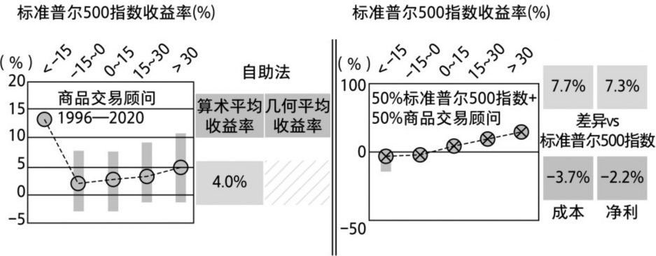
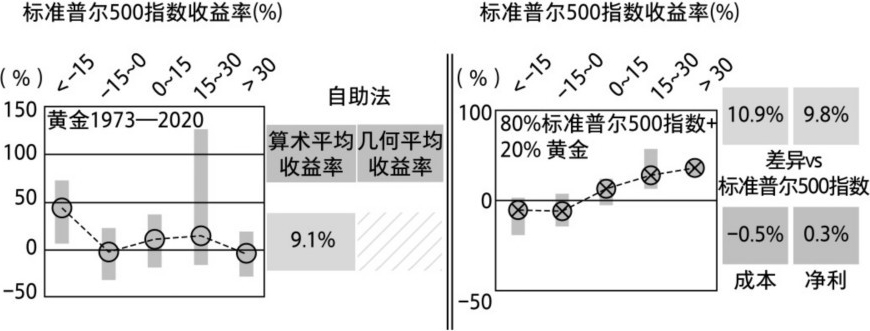
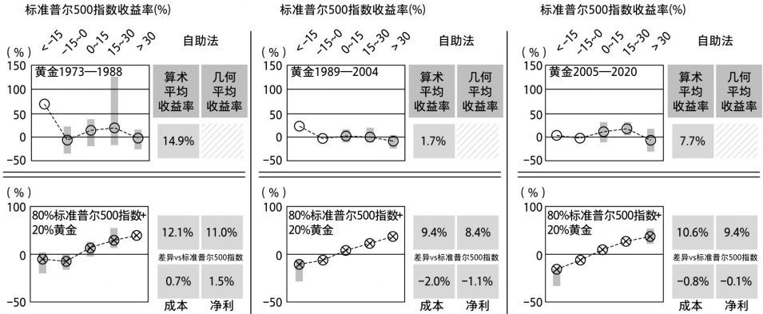
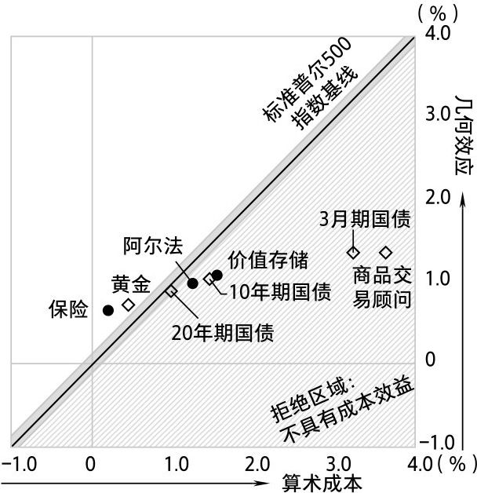
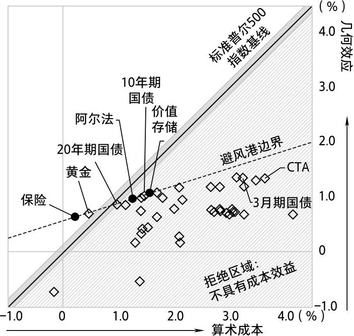

# 第六章 大胆猜测

## 认识论

起初，我们只是对各种骰子游戏进行学术性反思，现在情况发生了转变。我们的争论已演变成一场全力以赴的巷战。游戏正在进行，胆小者勿入。

我们可以将投资看作投资策略之间的竞争，其中少有明确的赢家，也并非赢家通吃。事实上，以良好的投资策略进入投资领域大有裨益。科学方法可以被视为区分相互竞争的假设的过程，但这个过程要严肃得多。在我们的例子中，检验和投资的标准一致，即期末财富，或财富的复合增长率。倘若不是这样，我们就得问：科学严谨性的意义何在？

现在，避风港策略之间激烈而无情的竞争拉开了帷幕。在这个竞技场上，部分竞争对手是有价值的，但很多对手价值较低。可以说，我们的避风港正在为其生存而战。失败的策略将丑态毕露，颜面尽失。它们作为避风港的骗局将被彻底粉碎（至少在我们的书中是这样）。

伊特鲁里亚人将角斗士的血腥运动传给了古罗马人，我们的战斗与之无异。角斗士为生死的终极赌注而战。（幸运的是，现代社会没有类似的运动，即使最耗体力、伤害性最大的运动也有防护措施。）他们在战斗中受伤致残，最后经观众同意殒命于刀剑或三叉戟（观众偶尔会放过失败者，让他改天再战）。这就是寻欢作乐的罗马人。但角斗士赌的是什么？他们通常是奴隶、罪犯或战俘，胜利对他们来说有时意味着自由和生命。但人群的赞美、皇帝的认可通常只是昙花一现，获胜的角斗士要回到自己的住处疗伤，然后投入下一场战斗……如此循环往复。

我们竞争中的获胜者经历了严峻的考验，也在历史上证明了自身。但这场比赛没有胜利庆典，没有桂冠。它必须持续进行。凡是过往，皆为序章。没有终点，排行榜永远是暂时的。

卡尔·波普尔描述和规定的科学方法是通过创建假设提出问题，然后通过拒绝假设或无法拒绝假设来严谨地回答问题。我们只能用否定的方式，而非肯定的方式作答。波普尔告诉我们，我们可以确定某个科学理论是错误的，但永远无法确定它是正确的。

像上一章的卡通避风港一样，我们的零假设是，以真实的避风港降低投资组合的风险，从而获得更多的财富。回想一下，在自助法的背景下，更多的财富意味着期末财富具有更大的几何平均数，即较高的期末财富中位数或复合年均增长率（25年后）。降低风险指的是提高投资组合第5百分位数的期末财富或复合年均增长率。（当然，这一直是我们的风险指标。）所以，我们要么拒绝，要么无法拒绝该假设。我们无法证实它——无论是投资还是人生，都没有确定的事情。比赛持续进行，竞争对手之间总是你追我赶。

回想一下，我们的零假设选择具有认识论价值。丹尼尔·伯努利的演绎理论（与海盗抗争的圣彼得堡商人）和本书第一部分的骰子游戏引发了我们的实验，预见了（甚至是预测了）实验结果。它们肯定是我们首先要考虑的。因此，我们可以自问：我们的理论对事实的描述有多准确？你看，我不仅要用约100万次的骰子投掷来说服你，还需要证明我们的实验方法是正确的。

打个比方，在所讨论的某段时间内，如果某项资产，或者更糟糕的是，某个令人厌恶的对冲基金经理的业绩恰好优于标准普尔500指数，我们能断定这是更好的避风港吗？就算有精心设计的自助法检验，仅凭这些业绩也不能下定论！想一下肯定后件谬误——我没遭受土拨鼠的骚扰，却仍将这归功于我的狗娜娜，即使它整天都在睡觉。如果没有一个演绎框架来理解何为具有成本效益的避风港，及其原因所在，我们的假设检验就会失去所有的严肃性，变成华而不实的数据挖掘活动。（数据挖掘充斥着投资行业。很多时髦的对冲基金、策略和代理公司你方唱罢我登场，犹如风中飘摇的树叶。）如果放弃科学的严谨性，我们就很容易将投机资产或策略误认为是避风港。

正如波普尔所说，科学无法验证某个理论，只能通过观察比较的方式对其进行系统检验来证伪。当然，无法拒绝假设并不意味着我们已经找到了埋藏的宝藏，只意味着我们不能说它不存在。也许我们获得了接近宝藏的线索。

这就是科学和伪科学的区别。科学知识是非常短暂的。与投资一样，科学方法是试探性地下注，使知识暴露在可证伪的情况下，一旦有正当的理由就证伪它，以便从错误中吸取教训，同时相应地予以纠正。科学和投资都是由尚未被拒绝的理论或论文组成的，其历史是被拒绝的理论和论文的坟墓。

我在书中告诫大家不要给出明确的答案，现在你应该明白原因何在了。最权威的答案来自伪科学的贩卖者。

尽管如此，请记住，成本效益分析不一定都是关于绝对成本效益的，也可以是相对成本效益。我们可以调整标准普尔500指数基线，使拒绝门槛不那么高。

任何在证伪过程中幸存下来的避风港都只是暂时的。（获胜的角斗士必须改天再战。）毕竟，它们都不是永久性的。这些检验是回顾性的，而非前瞻性的。例如，它们的收益率可能会随着时间的推移而变化，在未来无法通过检验。当我们有确切的把握拒绝它们时，它们就会失去具有成本效益的避风港地位。（这正是我们在某些情况下看到的事实。）我们应该做好心理准备，明白这种情况可能发生在所有幸存的避风港中——不是将其视为必然，而是作为一种预防措施，保持怀疑的态度。在幸存的避风港被拒绝之前，正如波普尔所写，“我们可以说它已经‘久经考验’，或者过去的经验已经‘证明’了它的效用”。我们知道，证伪也是暂时的。换句话说，我们有可能误认为一个正确的理论被证伪了，原因要么是检验错误，要么是检验设计出现了漏洞。

20多年前，我与纳西姆·尼古拉斯·塔勒布因志同道合成为同事，波普尔是将我们联结起来的因素之一（另外两个因素是我们都有芝加哥场内交易的经验，以及对正偏的、激增性收益的痴迷。他也很欣赏马勒，这又是一个共同爱好。）我们都通过对交易的探索，尤其通过阅读乔治·索罗斯的著作邂逅了波普尔。（年少时，我会在去芝加哥交易所的早班火车上听索罗斯和路德维希·冯·米塞斯的书，当时这一举动并不像今天这般矛盾。）

波普尔的科学哲学是理想的妄语过滤器。从第一章费曼的说明开始，我们的每一步都在使用波普尔的认识论和分析框架。费曼说过一句玩笑话，“科学哲学对科学家的作用就如同鸟类学对鸟类的作用”，这似乎颇具讽刺意味。但他的科学言论远比玩笑话更有分量。

按照费曼的方法，我们在第一部分进行了“猜测”。在第二部分计算了“猜测的结果”。现在是最后阶段，我们要“将计算结果与实验或经验进行比较，将其直接与观测结果进行比较，看它是否有效”。也就是说，三种卡通避风港原型的业绩会转化为现实的避风港吗？通过将现实的避风港运用到自助法中，用真实收益取代卡通收益，我们会识别其投资组合效应吗？我们会像在卡通中那样发现具有成本效益的风险缓释策略吗？

费曼的结论是：“如果与实验不一致，它就是错误的。科学的关键就蕴含在这个简单的陈述中。”

就像在第四章为了可视化而合并标准普尔500指数收益率一样，我们将通过简单计算每种风险缓释策略的历史收益率来构建它们。我们将特定避风港的年收益率放入相同的5个区间中的一个，按同一时期不同范围的标准普尔500指数年收益率进行分类。这为真实的避风港创建了历史收益率概况，类似于我们一直使用的卡通收益率概况。不同的是，这些历史收益率包含每个标准普尔500指数收益率区间中的一系列收益率数据，而非一个单点收益率。因此，我们将随机抽取其中一个区间（与当前d120骰子投掷的标准普尔500指数结果一致），以确定与本次投掷相对应的避风港收益率。这意味着我们必须通过投掷d120骰子来计算几何平均收益率。

重要的是，像上一章的卡通避风港一样，在自助法中，每种避风港的配置规模都使风险缓释投资组合第5百分位数的复合年均增长率相同，仍然是4.8%。（回想一下，在自助法中，无风险缓释标准普尔500指数的复合年均增长率第5百分位数是2.7%，相比之下，这是一个进步。）这意味着，为了进行同一基准的比较，每种避风港在每种假设的投资组合中所占的比例将会不同，该比例因避风港而异。对于给定的避风港，如果没有某一配置可以提供复合年均增长率第5百分位数的4.8%，我们将该配置限制在总投资组合的50%。

构建每类避风港收益率所使用的历史数据量，或者追溯的时长，取决于避风港的性质。对某些积极管理策略，数据可以追溯到20世纪90年代（我们不想追溯到太久以前，因为这些策略的属性及其交易动态历经多年已发生了巨大的变化）。对于黄金等其他资产，数据可以追溯到更早的年代。以黄金为例，数据将始于1973年，即黄金开始自由浮动的时期。对债券等其他资产，我们也使用相同的起始期。

在接下来的几节中，我们将细致地研究现实世界中最典型的避风港，每一个都是小型案例研究。尽管每个案例都值得用整本书来阐述，但在本书中，我们只关注战略性的、不可知论的、具有成本效益的风险缓释。我必须克制自己，不去发表战术性意见（因为我不想分散你的注意力）。我所做的一切是为了将已认可的避风港（共约40个）放入成本效益平面图——角斗士的竞技场。

## 海王星还是火神星？

在进入竞技场观战台（我们的避风港将在那里一决胜负）之前，我们需要如实告知有关证伪的一个小问题。我们可能因目光短浅、过度热情而过犹不及。这被称为朴素证伪主义，波普尔对此非常警惕。

举个例子，1781年天王星被发现后，天体物理学家注意到它的轨道与牛顿物理学的预测不同。但是，人们并没有像波普尔说的那样，证伪牛顿万有引力定律，而是猜测某个未知的行星与天王星发生了相互作用。这是除拒绝牛顿定律外，处理天王星的轨道与牛顿定律不符的唯一方法。事实证明，根据法国天体物理学家勒威耶1846年的预测和发现，这一猜测完全正确——它就是海王星！但新的猜测并不总是正确的，勒威耶试图用另一个猜测来重复这一行为，即有一颗火神星扭曲了水星的轨道。（他的两个猜测一对一错。幸运的是，爱因斯坦为我们解决了水星之谜——这一次，牛顿力学被证伪了，暂时被广义相对论取代。）虽然过去所接受的理论总会被证伪，但它们的证伪也可以提供有关参数变化和未知自由度的线索，甚至可以强化理论。证伪主义通常是调整理论，而不是放弃理论。虽然我们知道目前未被证伪的理论是暂时的，但被证伪的理论也是暂时的。实验条件可以改变。实践证伪主义不那么容易。

我们有自己的海王星和火神星问题。我们将在不同的组织方法或环境下，观察各种避风港收益率随时间推移发生的变化。也许还有其他因素影响收益率，又或许，一开始我们就搞错了收益的形态。是海王星还是火神星？看不见的经济或市场力量可能正在扭曲避风港，也可能没有，这比未知的行星更难预测。但它们对避风港的成本效益，甚至仅仅对效益的影响是巨大的。我们需要意识到，避风港的风险缓释性能存在受高阶变化影响的脆弱性。

我们所能做的首先是在历史数据中识别这些影响。此外，我们需要理解避风港收益在多大程度上是机械性的，在多大程度上是统计性的。机械性收益是直接的、固有的结果，如果不是这样，它会带来套利机会（或获得免费资金的机会）。这就像是看涨期权：它必须升值。（想想圣彼得堡商人为其横跨波罗的海的货物考虑的保险合同。）

与机械性收益相比，统计性收益通常是一种倾向，它基于观察到的历史，但并非必然如此。其非本质性更强，因此噪声更大。比如，我们在国债和避风港中看到的安全投资转移效应。机械性收益与统计性收益实际上与基差风险有关（或收益跟踪所缓释的标准普尔500指数等系统性风险敞口的程度）。但我们也可以考虑其他可能的收益扭曲，如交易对手风险（或者在风险缓释确实需要获益时却无法获益的风险，比如暴跌期）。

我们的卡通收益完全是机械性的，在现实世界中，这种机械性收益要少得多。关于机械性避风港收益与统计性避风港收益，经常被问到的问题是：让避风港有效运作的程序是否烦琐？避风港的历史可以指引未来，还是说一切都会随时间的推移而发生变化？

波普尔也有类似的“概率的倾向解释”。在第一章中，我们首次了解到，需要将事件看作“基于其条件的单一试验结果，而不是一系列试验结果的频率”。（也就是说，尼采的魔鬼告诉我们，我们的N=1。）尼采的魔鬼使用的骰子基于不同的引力环境，或“试验安排的倾向”。

就像所有事情一样，避风港的收益往往会落在某个范围或某条线的一个点上——在我们的例子中，落点由机械性收益与统计性收益的极值确定。我们永远无法确定对范围内任意点的估计有多准确。

我们将了解到，避风港对收益扭曲的敏感性往往比收益本身的形态更重要。敏感性是避风港和避风港赝品（比如乐观避风港，甚至不安全避风港）之间的主要分界线。

问题是：避风港收益的可变性或扭曲会让你自认为看到了海王星或火神星。你无法确定是哪一个。扭曲会让我们放弃不该放弃的风险缓释策略——因为我们不了解海王星：这是I型错误（也称假阳性）。扭曲也可以让我们执着于应该放弃的——因为我们认为火神星是存在的：这是II型错误（也称假阴性）。

在我们的语境中，第一种错误是不作为的错误，我们甚至没有注意到自己的疏漏。第二种错误是作为的错误，就像背着不可靠的降落伞从飞机上跳下来一样，当错误发生时，我们能觉察到。二者的代价都非常高。

如果有选择，最好是选择机械性避风港收益（尽管有时这意味着要灵活机动）。我从未说过证伪是不假思索或轻而易举的。有时，证伪需要一些判断力。

## 现金为王

首先，我们来看价值存储避风港。它们在时间和空间上是固定的。我们知道，有策略地、经济高效地运作卡通价值存储避风港，使其保持7%的固定收益率很难。因此，我们一开始对现实世界价值存储避风港的期望也很低。

价值存储避风港最典型的例子是现金。回想一下，这正是我们在第二章和第三章首次得出的结论（比如在凯利准则中，我们将一部分赌注以现金形式保留下来）。在现实世界中，以价值存储避风港为起点展开研究是有意义的。

现金的最好例子当然是3月期美国国债。其短期期限意味着，除了再投资风险没有任何利率风险。我们可以简单地为每个年度数据点进行三次再投资。

我们使用1973年的3月期美国国债收益率数据来构建收益概况图。在自助法中，复合年均增长率第5百分位数4.8%所需的配置规模为最高比例50%（遗憾的是，其效力从未达到这个程度）。

图6-1是我们熟悉的3月期美国国债的叉与圈收益概况图。

图6-1　叉与圈收益概况图：3月期美国国债

所有内容都与上一章的卡通叉与圈收益概况图完全相同（区别是，避风港的收益率归入不同区间，而不是使用单次收益率），因此这里不多做解释了。

需要注意的一点是：在这些小型案例研究中，前两行信息永远不会因案例而改变——所有案例都使用相同的1万条标准普尔500指数25年路径，它们是由那枚包含120年标准普尔500指数年收益率的d120骰子投掷得到的。这是我第一次也是唯一一次费心展示它。此后，我将省去最上面的两行，只显示底部的两行信息。

显然，3月期国债与我们对价值存储避风港的预期一致，收益状况非常稳定。其独立算术平均收益率为4.8%——低于卡通价值存储避风港收益率的7%，这确实需要付出很大的努力。与预期的一样，其投资组合净效应为负。自助法中的几何平均收益率，或复合年均增长率中位数为7.7%，低于标准普尔500指数复合年均增长率的9.5%，导致投资组合净效应为-1.8%。依照我们的方法，该投资组合净效应位于95%的拒绝区域——或低于标准普尔500指数的9.4%拒绝边界，即几何平均收益率95%置信区间的下界。

因此，我们必须拒绝3月期国债是具有成本效益的避风港的零假设，因为我们否定了它的后件：将3月期国债添加到我们的标准普尔500指数投资组合中，随着时间的推移提高该投资组合的复合年均增长率（我们刚刚看到，情况并非如此）。

下一步，我们可以沿着收益率曲线走得更远，从3个月到10年、20年。这就更能代表“股票/债券”投资组合中的债券，即投资中的“平衡型投资组合”。我们甚至将其视为多元化投资组合的标准。

当沿着收益率曲线向外移动时，我们也沿着由三种卡通原型确定的避风港范围向外移动。从3月期国债转向10年期和20年期国债，我们从价值存储避风港转向了负相关性更强的避风港——二者的混合。

当然，期限较短的3月期国债对利率变动的敏感性较低，其利率更依赖于货币干预。长期国债的估值对利率的变动更加敏感，而利率通常是经济增长或经济紧缩、通货膨胀或通货紧缩的期望函数。此外，如前所述，美国长期国债是一种典型的避险资产。也就是说，当股市和经济形势恶化时，投资者往往会为了避险而购买国债。我们可以在图6-2（高度统计性的，而非机械性的收益概况图）中看到这种影响的证据（10年期国债和20年期债券的配置比例分别为37%和34%）。

它们的业绩看起来比3月期国债要好一点儿，尽管将10年期和20年期国债作为避风港仍然没有成本效益或成本效益甚微。3月期国债（-1.8%）的投资组合净效应为负。除此之外，10年期国债（-0.4%）和20年期债券（-0.1%）也拉低了投资组合的业绩。

请注意，这还不是全部可怕之处，我甚至无须提及近年来的明显变化，这些变化使它们的避险地位更加不可靠——特别是极低的美国国债收益率几乎没有下跌的余地（尽管还有很大的上升空间）。有些人预计美国利率将走向负值，这听起来既真实又新奇，是对投资国债令人难以信服的警告。尽管如此，只要看一下图6-2，我们就会发现10年期国债没有通过成本效益检验。而20年期国债尽管很接近，但也没有通过（处于标准普尔500指数的拒绝边界）。

图6-2　叉与圈收益概况图：美国国债

然而，仔细观察20年期国债的收益概况，我们会发现需要质疑这些收益的成本效益的可靠性。国债收益有统计性因素（安全投资转移效应），也有机械性因素（实际经济增长率、通货膨胀和通货紧缩）。这些因素是如何变化的？

我们研究该问题的方法是，将20年期国债收益的时间分为三个16年：1973—1988年、1989—2004年、2005—2020年。（这三个时段的选择是任意的。）然后，重建每个时段债券的收益概况。在这之后，我们用标准普尔500指数d120骰子以完全相同的方式分别进行3次自助法试验。这意味着，我们不是将标准普尔500指数收益率分成这三个独立的时间段，而是将用于构建避风港收益概况的数据分为三个独立的时间段。由此，我们将重点放在风险缓释属性的高阶变化上，使作为标准普尔500指数函数的避风港收益变化与标准普尔500指数自身的分布变化相分离。

图6-3是我们的发现。

图6-3　扭曲的收益：20年期美国国债

我们从一个时间段移动到下一个时间段，发现20年期国债的投资组合净效应有很大的变化，从-0.8%到+0.6%，再到-0.9%。这里使用的是相同标准普尔500指数收益率的d120分布。造成这种现象的是收益率的类似巨变。其原因要么是债券收益率的干扰性很大，每时每刻、每个10年都不稳定，要么是受到其他事物的影响而发生扭曲。它是未被发现的海王星（可被发现和利用），还是火神星（导致我们得出错误结论的假设）？如果是火神星，那么20年期国债就是分类法中的乐观避风港——其噪声如此之大，以至收益失去了意义和经济效益，甚至比不使用策略还要糟糕。

海王星或火神星——国债看起来很像乐观避风港或多元恶化避风港。

## 顺势而为

沿着避风港收益和机制的范围继续下移，我们到达阿尔法避风港。回想一下，这个名字与商品交易顾问策略的理想案例非常相似。商品交易顾问是一种趋势跟踪策略：一旦证券沿某个方向（上升或下降）移动了一段时间，趋势就已经建立，只要趋势保持不变，商品交易顾问就会做多或做空该证券。因此，它通常依赖于价格波动的持续性，属于动量策略或顺势而为策略——一种期权复制策略。时间窗口和其他投入可能因商品交易顾问公司而异，头寸通常由测量波动性的各种指标来确定。

商品交易顾问在积极管理策略（例如对冲基金）中很重要，因为它是一种公开尝试，是通过假设的优势或阿尔法避风港，以追求收益策略来降低风险——这种假设甚至被理想化地称为危机阿尔法。因此，趋势跟踪策略在很多方面都是风险缓释的宠儿，也是实现终极目标的巨大希望。

图6-4是商品交易顾问策略收益率的叉与圈收益概况图，在标准普尔500指数投资组合中占50%的最大比例。

与真实的3月期国债（类似价值存储避风港）一样，这个真实商品交易顾问的收益形态与阿尔法避风港类似。其独立算术平均收益率较低，为4%（而非阿尔法避风港卡通收益率的7%），给投资组合带来了更高的算术成本（-3.7%）。

图6-4　叉与圈收益概况图：商品交易顾问策略

像卡通阿尔法避风港一样，商品交易顾问的下行保护程度不足以提供具有成本效益的风险缓释。（此外，也不足以将投资组合复合年均增长率的第5百分位数提高到4.8%。）它不是什么宠儿。（该策略的爱好者拥有的是理论记分牌，而非实际记分牌。）

请注意，对冲基金策略在暴跌区间通常不具有这种负相关性或敏感性，这也是使用商品交易顾问策略而不是更传统的对冲基金策略作为标准阿尔法避风港的另一个原因。（对冲基金中的“对冲”成了不当用词。）但也有其他基于衍生品的策略旨在做类似的事情，比如做多波动率和尾部对冲策略。这两种策略的指标与商品交易顾问有着非常相似的收益概况。与商品交易顾问一样，这些指标也必须被拒绝，因为它们不具有成本效益。（学术研究批判一般尾部对冲，该结果与学术研究一致。）我们从卡通阿尔法避风港了解到，依照这种负相关性水平，即使算术平均收益率为7%，也会使投资组合的净效应为负。

## 所有闪光的东西

越向保险避风港的极端移动，拒绝的次数越多。你应该还记得，卡通保险避风港的收益特点是，相对于剩余时间内的预期损失，产生激增的暴跌期收益。

关于避风港，流传的说法是，黄金是一种类似保险的对冲工具，可以抵御各种市场损失。它是恐惧的护身符，甚至被认为是防范银行体系崩溃的保护措施，因为它是从实施部分准备金制度的银行系统中提取储蓄的一种手段。提到对冲通货膨胀的工具，人们首先想到的就是黄金。

然而，黄金作为对冲通货膨胀的工具其实很不稳定。这主要（甚至几乎完全）与实际利率的变动有关。（当通货膨胀率高于年化收益率时，实际利率就会下降，从而推高金价。但它是通货膨胀还是实际利率？这是鸡与蛋的问题。）你可以认为低实际利率减轻了黄金零收益率带来的机会成本负担。

图6-5是黄金的叉与圈收益概况图（配置比例为20%）。

图6-5　叉与圈收益概况图：黄金

与商品交易顾问和国债相比，黄金的暴跌期收益率令人印象深刻。请注意，这不是十倍股，但我们已经取得了很大的进步。黄金的投资组合净效应为正（+0.3%）。就黄金而言，我们不能拒绝它是物有所值的避风港这一零假设。

目前来看，黄金似乎名不虚传。然而，请注意，从1973年我们建立黄金收益率曲线开始，每当股票在特定年份下跌15%或以上时，黄金收益率就在+5%到+70%之间，平均略高于+40%。其他年份的收益率在-30%到+125%之间，平均不到7%。虽然这都是相当不错的保险避风港收益率，而且它是通过分区得到的平均收益率，但问题是，平均值的范围很广——特别是考虑到黄金需要20%的配置。

我们知道，黄金的价格完全取决于投资者对其价值的期望。它没有产出，作为一种金融资产，它完全没有效益。它没有内在的经济价值，因此根本不可能估价。经济学家路德维希·冯·米塞斯提出了一个著名理论，他将今天的黄金价格与其作为商品的早期历史联系起来，解释了黄金价格的起源。米塞斯并没有提供一个公式，让我们可以预测下周的黄金价格。尽管持有黄金的机会成本受到机械性低实际利率的影响，但我们应该得出这样的结论：黄金的收益在很大程度上是统计性的——我们的判断是正确的。因此，我们需要更深入地研究，就像分析20年期国债那样，看看黄金的收益情况在这些年里是如何变化的。

图6-6的黄金叉与圈收益概况图也分为相同的3个16年时段：1973—1988年、1989—2004年和2005—2020年。与上例一样，避风港的收益形态似乎被某种力量扭曲了。

请记住，这些都是高阶效应。它并不是由三个时期标准普尔500指数的变动引起的，标准普尔500指数自助法在每个时期都是相同的。高阶效应源自避风港的收益变动。

显然，从20世纪80年代末开始，黄金的收益就发生了扭曲，或许在那之前已经扭曲了。现在，黄金的收益率曲线已经恢复到自然形态。在这两种情况下，黄金收益率随着时间的推移变得越来越平缓，更像是阿尔法，甚至价值存储避风港。这导致黄金的独立算术平均收益率降低，进而导致投资组合净效应降低：从第一期的+1.5%到第二期的-1.1%，再到第三期的-0.1%。

图6-6　另一种被扭曲的收益：黄金

虽然黄金的几何效应在一定程度上一直比较稳定，但其投资组合的算术成本却有所上升。

将黄金作为避风港抵御投资组合系统性风险的人需要明白，可能有一个尚未发现的海王星正在扭曲黄金的收益率。或者，也可能是一个根本不存在的火神星——他们对黄金的避风港假设和分类一开始就错了，黄金实际上只是一个乐观避风港。

我们知道，20世纪70年代，通货膨胀率较高，黄金的收益情况使其成为预防暴跌的避风港，具有极高的成本效益。除那段时间外，黄金的成本效益都很低。为了成为具有成本效益的避风港，黄金在战术层面需要通货膨胀或实际利率机制的协助。

这意味着，我们需要借助外力才能让黄金有效降低系统性风险（暴跌）。如此一来，它的成本效益就更低了。这是一个固有矛盾，也是黄金作为战略性避风港的问题所在。

作为一种类似货币的保险避风港，黄金在抵御暴跌方面是否独树一帜？有人说，比特币等加密货币正在取代黄金的位置。但这些现代发明真的是避风港吗？

加密货币的避风港收益数据太少，噪声太大，甚至无法进行智能评估（尽管早期迹象表明，它们看起来更像不安全避风港）。仅凭这一点，它们最多是乐观避风港。（如同假扮成土拨鼠猎手的懒惰的娜娜！）时间会证明一切。

但加密货币爱好者的想法是正确的。加密货币被认为是抵御央行破产的保险单。广义上，它被赋予了抵御经济危机的保险单作用——这将导致当前货币政策的失败。

加密货币是最重要的技术平台（区块链）。它就像安全的虚拟保险箱，只有你才能进入。这个保险箱如此炫酷，令人印象深刻，值得我们以敬畏之心对待。它将改变世界。如今，人们认为保险箱里的东西是有价值的（仅仅因保险箱的安全、方便和炫酷）——这种价值是法令或法规赋予的。（经济学家罗伯特·墨菲甚至认为，在米塞斯的框架下，我们别无选择，只能称其为加密法定货币。）

此外，比特币其实是非匿名的，用专业术语来说，它是化名的，这意味着在任何时候，比特币的持有者都为公众所知，尽管我们不知道地址那边的人是谁，但它是可追踪的。最糟糕的是，作为一种高度投机性工具，它是流动性驱动的环境创造出的一种现象（我认为，它与环境是一体的）。闪光的不都是金子。

## 避风港边界

在仔细观察美国国债、商品交易顾问（或对冲基金）和黄金这三大避风港之后，我们结合最初的三幅收益概况图绘制了成本效益平面图（如图6-7所示）。

图6-7　成本效益平面图

我们看到，避风港的物种问题尚未解决。我们将继续分析避风港和避风港赝品之间模糊的界限。我们的卡通避风港之称是有原因的。

这些卡通避风港仍然是理想的原型，可以将其视为探索和开发其他现实避风港的初级模型。事实上，提高保险避风港卡通收益正是Universa公司过去所做的工作，我们将继续做下去。与十倍股相比，Universa公司实现的独立避风港收益的爆炸式增长更强，形成了风险缓释策略的成本效益（迄今为止，我们经审计的10年以上年均资本收益率超过100%，而不是保险避风港卡通收益率的0）。人们认为风险缓释是财富创造的一种权宜之计，因为通常情况下确实如此。但风险缓释不应该如此。

下面，我们将大约40个典型避风港放到成本效益平面图上（如图6-8所示）。这些数据点包罗万象，包括我们已经涵盖的少数几项策略，也包括其他对冲基金策略。有瑞士法郎、日元和美元等货币，私人股本，价值策略，动量策略，风险平价，低波动率策略和波动率管理策略，做多波动率，VXX，高收益率债券，艺术，农田，商品，山羊（好吧，或许不包括山羊）。

这幅风险效益平面图似乎是名副其实的避风港墓地，除了已经提到的几个例外，这些避风港都被证明不具有成本效益。尽管它们的动作很多，行动却很少。

更重要的是，该图是一个连续统一体——一个避风港范围，与三个卡通避风港原型确定的范围别无二致。我们可以在图上画一条与三个卡通避风港原型相交的线，将这条线向两个方向延伸。显然，这条线意义重大。

图6-8　避风港边界

事实上，这条线追踪了避风港收益率，其配置将风险缓释投资组合复合年均增长率第5百分位数从无风险缓释的2.7%提高到我们预先设定的4.8%。这条线以下的点对第5百分位数的提升幅度较小，越低于这条线，提升的幅度越小。

这条线是我们的避风港边界。

我们可以画出的每一条类似的、较低的线都会与风险缓释程度较低的避风港相交。在公平竞争的环境下，避风港之间正是依据这条线进行同基准对比的。

避风港边界是本书所指的业绩范围。它描绘了避风港世界的收益和成本特征。

思考一下，为了在自助法中提高每个投资组合的复合年均增长率第5百分位数，我们应如何调整配置规模。总体而言，暴跌期收益的爆炸性增长越大，防止落入伯努利瀑布所需的避风港配置就越小。避险资产配置越少，独立算术平均收益率越低，投资组合的算术成本越低。

因此，避风港的投资组合净效应（或成本效益）取决于在给定的风险缓释水平下所需的配置有多低。在几乎无需配置避风港时，其相对于几何效应的算术平均成本就会降低。缓解伯努利瀑布暴跌的成本越低，沿着避风港边界走得越低，成本效益就越高。

以这种方式沿着避风港边界线向下走，会遇到双重作用力——降低算术成本、获得更大的投资组合净效应，这是一种经济型优势策略。我们在保险避风港的骰子游戏中看到了同样的双重作用力，在保险避风港卡通原型中也看到了。

骰子游戏的演绎和计算结果与所有避风港的观察结果一致。也就是说，我们的卡通避风港确定的范围具有实证价值。我们必须证伪大部分避风港。令人欣慰的是，更宽泛的避风港假设——我们的“猜测”——仍然成立：可以在获得成本效益的同时降低风险。

我们的几个案例研究的重点并不是找出图表上那些点的每一个混乱的细节。细节是次要的。重点是，什么决定了这些点的位置，以及其他所有点的位置，还有它们为什么处于这一位置。成本效益平面图是我们竞争的记分牌。关键问题是：是什么移动了记分牌？

避风港边界有一条美妙的规则：缓解最糟糕的路径可以让避风港抵达最高线——边界线；以较低的成本缓解最糟糕的路径，会让避风港沿着边界线向左移动，能以较低的成本提高第5百分位数路径（威廉·泰尔射击的精确性），继而提高中位数路径——我们射击的准确性。

从中得到的信息是，你不用通过冒更大的风险来提高财富的几何平均数或中位数，而是可以通过降低风险来实现这一目标——降低真正的风险，最坏的结果。二者实际上是相互联系的。卡通避风港预见了这一点，伯努利的曲线凹性也预见了这一点——包含所有现实世界避风港的避风港边界证实了这一点。

因此，在最糟糕的路径上以具有成本效益的方式减少损失，可以完成现代金融所说的不可能完成之事：通过降低风险来增加财富。

## 吹着口哨穿过墓地

从以上假设检验中，我们得出三个主要结论。

第一，正如预期的那样，实现具有成本效益的风险缓释是困难的。典型避风港的成本效益较低——在许多情况下，它们并不具有成本效益。其风险缓释策略主要是战术的，而非战略的。

第二，尽管战术性与战略性混合的避风港具有成本效益，但它们通常不稳定，甚至稍纵即逝。其收益率曲线被海王星或火神星扭曲了。长期以来，黄金的收益率曲线显示，它是罕见的具有成本效益的避风港，尽管前提是达到20世纪70年代那种前所未有的通货膨胀水平。暴跌期间，黄金作为一种系统性风险缓释策略被证明成本过高，此后不再具有成本效益。（20世纪70年代的优异业绩使它有着不错的总体表现。）因此，黄金在通货膨胀加剧期是一种战术性对冲，而非战略性避风港。

第三，好消息是：我们可以利用真正有意义的避风港边界，它定义并解释了可移动的包络线边缘。我们可以（而且确实能）沿着真实的避风港收益边界向下移动，从而提高成本效益。更重要的是，我们的卡通保险避风港（算术平均收益率为0）实现了目标，即通过降低风险来增加财富。该目标是任何强大、复杂的研究和投资工具都无法实现的。这不足为奇，毕竟，这就是圣彼得堡商人贸易。

除了批评和否定所有的奇思妙想和宏图大志，我们好像没做什么。我们似乎是投资的失败主义者和虚无主义者。

这是完全错误的想法。被驳斥的理论推动了知识的进步。我们必须面对可怕的幽灵却乐在其中，我们必须吹着口哨穿过大胆猜测的墓地。

正如波普尔所说，猜测越大胆越好——越大胆的猜测越容易被驳斥。猜测越大胆，反驳的力度就越大。简单的反驳让思想趋向科学。僵尸思想是伪科学思想。

从风险缓释的角度看，我们试图反驳的许多关于避风港的猜测都是无法检验的。原因是，现代金融的框架甚至不能思考我们的猜测，它朝完全不同的目标射击，无法考虑我们关于期末财富和复利率的记分牌。现代金融使用的是不同的记分牌，这让其方法无懈可击，甚至无法证伪。它显然是一门伪科学。

在本章中，通过否定可观察到的投资组合效应，我们驳斥了关于这些避风港成本效益的基本假设。我们的基本目标是，为获得更好的业绩而刻意降低风险，并随着时间的推移获得更高的复利率。这正是“投资管理的本质”。

这是一种激进的想法，是波普尔所推崇的易于被反驳的大胆猜测。也许，这是我们作为投资者所能做出的最大胆的猜测。在被驳斥之前，我们只是暂时接受它。

我们不应该因快速做出判断而感到不安。当因低成本效益放弃避风港时，我们其实毫发未损。我们所做的是设定新的基线，以此来衡量它们的相互关系。

谁先冲过终点线并非唯一重要的事情，这不是赢家通吃的游戏，暂时的排行榜同样重要。这场竞赛永远不会结束，投资关乎持续调整和改进。通过不断学习，我们越来越接近靶心。随着成本效益基线的推进，我们的投资收益也在增加。至善者不必是善之敌。

正如费曼所说：“犯错不是坏事，而是一次机会。”

证伪的准备工作让我们以建设性的严谨态度思考巨大的两难困境，这是投资中最重要的问题，也是我写作本书的初衷。它让我们找到避风港的范围和边界，获得解决方案，逐步完善风险缓释。

投资在纠错过程中不断进步，书中涉及的都是现代金融的错误，也是现实世界应用避风港假设的错误。该方法以退为进，通过反驳远离真相，从而更接近真相，它将帮助你找到具有成本效益的避风港，以及属于你的地下宝藏，解决投资的两难困境。
