# Chapter 2“Safe” Havens and the Second Leg Down

Modern portfolio theory has its formal origins in the work of Markowitz (1952). Here, risk is synonymous with volatility. The wilder the path that your portfolio takes, the greater the uncertainty in the final outcome. There are only two ways a static portfolio can become riskier. Either the individual assets in your portfolio become more volatile or the correlation between them goes up. Volatility and correlation are both encapsulated in the covariance matrix of asset returns. Assume that the entries in your covariance matrix move fairly smoothly through time. It should then be possible to react to changes in portfolio risk. You can dynamically reduce your allocation to the assets that have the largest instantaneous impact on portfolio risk. These assets are said to have the greatest marginal risk relative to the portfolio. Many asset managers, particularly quantitative equity hedge funds, argue that they can “target” volatility by seamlessly changing their portfolio weights over time. But how can these funds react to situations where a systematic risk factor moves with practically no warning? The law of large numbers doesn't help you much when all of the assets in your portfolio are exposed to a small number of risk factors. As we will show in this chapter, the nature of risk can change dramatically over time, leaving dynamic rebalancing strategies exposed. Safe looking assets can become risky in both absolute and relative terms. This implies that the classical variance–covariance matrix approach can fail to capture risk at the worst possible time. Our strategy is to focus on a series of examples where risk is not immediately apparent in the historical return series of an asset or strategy. The monster appears out of nowhere. This chapter serves as a teaser for the rest of the book, where we explore practical ways to manage risk in disorderly markets.

During speculative bubbles, volatility perversely tends to decline. The formation of a bubble should serve as a warning sign, but tends to be obscured by investor complacency. As the options markets discount future risk, implied volatility may also drift lower. This all seems very logical to a market newcomer, someone who wasn't there for the last crisis. Over short horizons, volatility seems persistent, yet it is cyclical over the long term. How does this all relate to extreme event hedging? If you can identify the assets that overleveraged investors are holding, you can buy options on them. These options will generally be cheap until the bubble eventually bursts. Realised volatility will not necessarily be a harbinger of potential risk. We provide some anecdotal evidence for contrarian options buying in Chapter 2. We also use the portfolio insurance crisis of 1987 as evidence that crowded rebalancing strategies can be as dangerous as crowded positions in stocks or corporate bonds.

## THE MATTERHORN

After the Euro crisis in 2011, the Swiss National Bank (SNB) enforced a one-sided peg on the Swiss Franc (CHF) against the Euro (EUR). Without the peg, the Franc probably would have surged toward parity with the Euro. Investors have long considered Switzerland to be a safe and stable economy relative to some of the “peripheral” nations in the European Union, such as Greece and Portugal. Accordingly, the SNB had no imperative to create easy credit conditions in an attempt to attract investors. By contrast, the European Central Bank, or ECB, was forced to accept low quality collateral from vulnerable banks and sovereign states, in exchange for revolving credit. A lower bound on the EUR/CHF exchange rate was set somewhat arbitrarily at 1.20. Whenever CHF threatened to cross the barrier, the SNB would flood the market with more Francs or create incentives for investors to move money out of Switzerland. This caused a sharp decline in downside volatility whenever EUR/CHF approached 1.20, as in Figure 2.1.
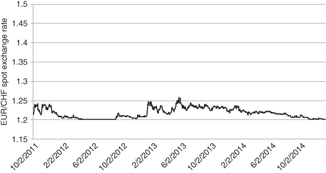
Figure 2.1 EUR/CHF exchange rate before the peg was removed

Assuming that the floor was solid, speculators could step in and buy the cross close to 1.20. This would amount to buying the Euro and selling CHF. Since Swiss short-term deposit rates were now negative, buying forwards on EUR might also have positive carry. Assuming that the spot EUR/CHF rate stayed fixed, you would be paid to hold a forward on EUR. Other investors reasoned that the Swiss Franc was an ideal financing instrument, as it cost nothing to borrow and was tied to a weak currency. They could essentially borrow CHF for free and deploy the proceeds elsewhere. So long as the peg held, the risks were minimal. But was that a safe assumption? On January 15, 2015, the Swiss National Bank issued a short press release that sent reverberations throughout the global currency markets. They announced that they would be “discontinuing the minimum exchange rate of 1.20”, while reducing the interest rate for deposits held at the bank to –0.75%, from –0.25%. The implication was that they no longer wanted CHF to be tied to a currency that was backed by a fragile and structurally imbalanced economy. Conversely, the rate reduction was intended to soften the impact of the announcement by penalising investors who wanted to hold CHF deposits. It did not, however, have the desired effect. Investors smashed the Euro from 1.20 to 0.98 in a matter of minutes.

Through the wider lens of Figure 2.2, we can see how the EUR/CHF cross was trading in a severely constricted range in advance of January 15. It has been suggested1 that the FX options markets anticipated the possibility of a 1.20 breach before the floor was removed. However, realised volatility gave no indication of increased risk. On the contrary, it seemed as though volatility was converging to 0.
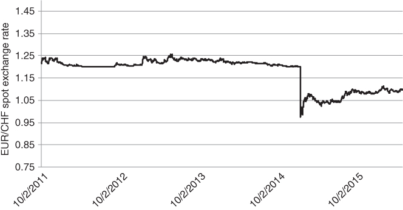
Figure 2.2 There she goes

We can also think of risk in terms of the daily range for the currency. In Figure 2.3, we track the difference between the daily high and low price over time.
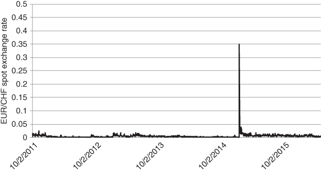
Figure 2.3 Daily range of EUR/CHF

For many speculators, the impact was devastating. Everest Capital, a long-established emerging markets hedge fund, was forced to liquidate its flagship strategy after losing a large percentage of its assets on the CHF move. Astonishingly, an order of magnitude $1 billion fund was obliterated in the time it takes to go for a snack break at the office! Leading macro funds and proprietary trading desks also suffered major losses. It is likely that the nearly instantaneous move from 1.20 to 0.98 was amplified by massive deleveraging from the managers who had suffered the most.

Parkinson (1980) has derived a formula that transforms high and low prices over a series of days into a volatility estimate. While the formula makes assumptions about the underlying distribution of returns and does not admit gaps in trading, it is a reasonably simple and clean way to estimate short-term volatility. The lookback window can be shortened as we get one extra data point per day. In Figure 2.4, we track range-based volatility over time. The lookback window is 21 trading days.
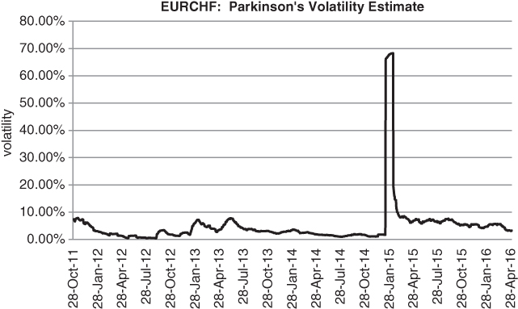
Figure 2.4 Parkinson's volatility estimate

The combined activity of speculators and the SNB initially caused CHF/EUR volatility to decline and then languish around 1%. Here was a market that could put you to sleep, or so it seemed. Once the peg was removed, range-based volatility jumped toward 70% before settling in the 5% to 10% range.

Given the fiftyfold increase in realised volatility at the extremes, conventional asset allocation models would have been completely caught off guard by the move. We can illustrate this point using a simple and intuitive scheme. The Treynor-Black model is an offshoot of the hugely influential Capital Asset Pricing Model, or CAPM. Treynor-Black (1973) suggests how to allocate to a collection of assets that have “alpha”, namely ones that are expected to generate a positive benchmark-independent return. Let's suppose we have an asset whose correlation to some relevant benchmark is 0. According to Treynor-Black, its weight should be inversely proportional to the square of its volatility. As asset volatility increases, the optimal portfolio weight rapidly decreases. Once you strip out benchmark exposure, the allocation process is robust from an optimisation standpoint.

If you had a reasonably high level of confidence that CHF was going to weaken relative to EUR, you would need to assign a massive Treynor-Black weight to the trade. (0.01)2 is a tiny divisor to apply. This would have had terrible consequences in January 2015, as you would have been severely overexposed to a losing trade. Is there any way around the problem, while adhering to modern portfolio theory? One solution would be to eliminate pegged currencies from your system. This is reasonable but not comprehensive. It ignores the fact that other assets can also experience abrupt and unexpected spikes in volatility. You can't close every channel of extreme uncertainty.

Ex post, the decision to remove pegged currencies from a conventional asset allocation model is an easy one. However, there may be other assets in your portfolio that experience unexpected jumps of extreme magnitude. At the risk of repeating ourselves, you can't keep taking stuff out of your portfolio that hasn't worked or else you will run out of things to invest in.

During the 2007–8 financial crisis, LIBOR rates took on a life of their own as shown in Figure 2.5. Volatility jumped to previously unimaginable levels. Observe that LIBOR is an interbank rate for dollar-based loans transacted in London. Qualified banks borrow from each other roughly at LIBOR. The quoted rate varies based on a daily survey. Usually, 1 or 3 month LIBOR varies as a function of the 1 or 3 month US T-Bill rate. There is a spread to account for counterparty credit risk, but it tends to be small and sticky. That is, the spread typically has very low volatility. As the prospect of bank failures began to mount, however, the spread became severely unhinged.
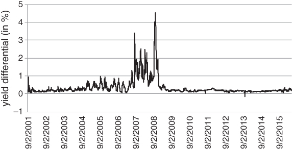
Figure 2.5 1 month TED spread

## MRS. WATANABE'S NO. 1 INVESTMENT CLUB

Non-pegged currencies can also deliver nasty surprises. The FX carry, or “Mrs. Watanabe” trade described in the introduction is a case in point. FX carry is attractive to many investors because it generates a passive return when nothing much is going on. “Time is on your side”, as the saying goes. A canonical example is the Australian Dollar (AUD)/Japanese Yen (JPY) cross. These countries are linked by strong bilateral trade agreements, but have starkly different FX risk profiles. While Australian yields have historically been high, Japanese rates have been hovering close to 0 since the late 1990s as shown in Figure 2.6. Many investors have engaged in the FX carry trade, buying AUD forwards while borrowing in JPY. This trade has two sources of return: changes in the AUD/JPY spot rate and income generated from the differential between Australian and Japanese interest rates with the appropriate maturity. In theory, the expected return of the AUD/JPY spot rate should be negative, namely it should exactly offset the carry based return from the forward. Practice suggests that this is not the case. Higher yielding currencies tend to perform considerably better than equilibrium theory would suggest. In risk-seeking environments, the trade chugs along, generating consistent profits. Leverage is easily applied to currencies and the strategy eventually becomes overcrowded.
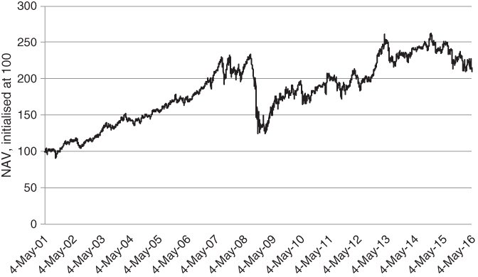
Figure 2.6 Up the stairs and down the lift

The series usually drifts up, punctuated by sharp and sudden drops every now and again. Over the 15-year sample set shown in Figure 2.6, the distribution of returns has a negative skew of –0.5. This implies that negative surprises are far more likely than positive ones. As can be seen in Figure 2.7, 30-day trailing volatility is very jumpy.
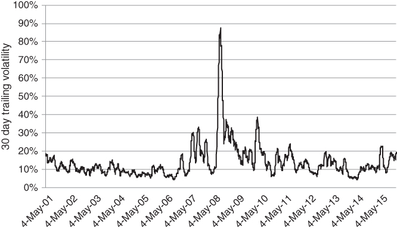
Figure 2.7 30 day trailing volatility for the AUD/JPY cross

The move from 10% to nearly 90% volatility in 2008 came with practically no warning. Only a very nimble risk system would have been able to adjust the position size enough to avoid damaging losses.

## THE RISK OF WHAT OTHERS ARE HOLDING

In this section, we provide a concrete example of the second leg down concept. We analyse the two stage drop in September and October 2008 and describe the unexpected cross-sectional behaviour of stocks in the S&P 500 in October. We need to make a few introductory comments before analysing the data. We start with a contentious statement, partly for effect. The risk of what others are holding tends to increase when academics get involved. The trouble is that institutions are prone to using academic papers as “validation” of a given strategy. The notion that market conditions can change, partly as a function of money flowing into a particular strategy, is not always addressed. Ironically, the academic ideas tend to be good ones, validated over rich historical data sets. However, ideological group think increases systemic risk. Too many large investors are positioned in the same way. Suppose an investor has to liquidate positions after a margin call. If the investor has a large inventory to sell, prices can move to the extent that other investors have to liquidate the same position. This can lead to a cascade of losses, especially if the amount of leverage in the system is high. When things get really bad, there is no such thing as a “safe” stock. In the following example, we illustrate how blue chip stocks can become extremely risky in the teeth of the storm. Value investors might argue that, if you extend your investment horizon enough, the blue chip stocks are still safe. At the extreme, you might be buying a stock whose market capitalisation is lower than its liquidation value. This implies that the share price should eventually come back. Over monthly horizons, however, your conservative-looking investments can have a surprisingly large impact on portfolio risk.

Here is a teaser, a short case study from the financial crisis of 2008. Figure 2.8 depicts changes in implied volatility for stocks currently in the S&P 500, in September 2008. On the x-axis, we track the ATM implied volatility for each optionable stock in the index at the end of August. On the y-axis, we show the absolute change in implied volatility for each stock in the index in September.
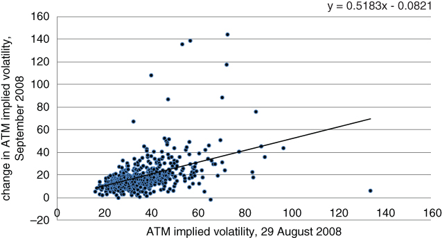
Figure 2.8 The first leg down

The slope of the regression is roughly 0.5. This means that implied volatility for the risky stocks increased roughly 50% more than for the conservative-looking ones. This is as we would expect. When volatility picks up, many investors dial down portfolio risk by reducing exposure to high beta names. In such a scenario, high beta stocks can drop even further than their historical beta would suggest.

Now if September 2008 was a bad month, with the S&P 500 declining by –9.08%, October 2008 was the dramatic crescendo (see Figure 2.9). The VIX peaked at 89.53 when Lehman Brothers defaulted. A number of hedge funds liquidated or locked up client money and several investment banks were on the verge of default. The interbank lending market seized up, as no one seemed to be sure how solvent anyone else was. Eventually, the Fed and other central banks stepped in and offered loans in exchange for questionable credit. Strict mark-to-market accounting was abandoned. As John Hussman has remarked (e.g. Hussman, 2013), this may have been a crucial turning point in the 2007–9 financial crisis. Eventually, banks were able to repair their balance sheets and resume their usual activities. Given this historical backdrop, we repeated the September regression in October. Our expectation was that the regression line would remain upward sloping. If anything, we might have to account for an explosion in implied volatility for high beta stocks. This might require a quadratic regression. As it turned out, the results were quite the opposite. While all stocks became toxic, safe-looking ones jumped the furthest in implied volatility terms.
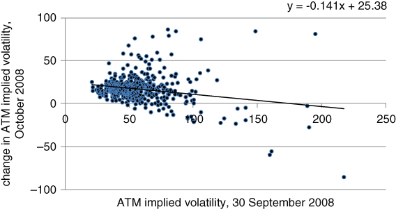
Figure 2.9 The second leg down – liquidation time

The regression slope is mildly negative, at –0.15. But even if the slope had been 0, you would have been well served to buy options on safe-looking stocks – the Johnson & Johnsons of this world. Your premium outlay would have been much less for the same level of protection. This is not to say that the idea of sector rotation is unreasonable. Short duration assets, such as bonds and high dividend-paying stocks with strong balance sheets, do tend to outperform in orderly bear markets. Aside from the most extreme cases, the beta of a stock is predictive. High beta stocks perform the worst, while low beta names provide an anchor to the portfolio. It is important to understand that standard models, such as CAPM, are reasonable approximations of reality most of the time. They might not account for anomalies such as the low volatility premium described in Falkenstein (2012), but they do approximate to how your portfolio is likely to perform during a sell-off. The trouble isn't the duration of extreme events. It is their severity. During mass liquidations, though, investors have a tendency to sell indiscriminately. There is even a temptation to sell the stocks that have gone down the least, in an attempt to avoid crystallising losses. In the meantime, the big losers might come back. For taxable investors, Wilcox (2006) argues that monetising short-term gains and allowing profits to run is a particularly bad strategy. Even in the unconstrained scenario, waiting for your losing positions to come back is a form of mental arithmetic. It doesn't do you any practical good. Alternatively, the riskier looking companies may have gone down so much that there isn't much point in selling them. Can we draw any conclusions from the strange-looking dynamics in September and October? To some extent, low beta stocks played catch up during this wave of selling. More intriguingly, sector rotation in September may have been responsible for the strange moves in October. When risk assets first took a tumble, many investors sold high beta stocks and re-invested the proceeds in safe-looking names, on the assumption that they were reducing portfolio risk. In October, it was no longer a question of selective selling but rather panic liquidation. Investors sold whatever they had.

How can we use the surprising conclusions in this study? We have not yet developed the machinery to analyse specific options structures in detail. However, we can say that buying options on stocks whose implied volatility has not gone up very much after an initial sell-off is a promising idea. We want to buy insurance on the companies that the market still deems “safe”. These options will be relatively cheap, yet are likely to offer significant protection during a major liquidation.

More generally, we can conclude that extreme markets are not straightforward extrapolations of normal markets. Following on from Taleb (2007), traditional statistical methods have a restricted range of applicability. They are unable to characterise the outsized moves that have a disproportionate impact on long-term returns. As market conditions deteriorate badly, a more holistic approach is necessary. We need to combine experience, academic research and our own validation methods in a sensible way. A renegade spirit is useful for idea generation, but needs to be combined with a disciplined approach to testing. We want to understand things as accurately as possible and build on what we know. However, we don't want to be overly constrained. Our main goal is to develop survival tactics for scenarios where formal academic theory does not apply.

## THE RISK OF WHAT OTHERS ARE LIKELY TO DO

Systemic risk can also increase if a large number of investors use the same algorithm for exiting positions. Risk is not purely a function of what people hold, but what they are likely to do given a large random fluctuation in the market. Black Monday, October 19 1987, demonstrated how the market's excessive reliance on a single strategy could trigger a short-term crisis. In the midst of a very strong year, the S&P 500 dropped –2.95%, –2.34% and –5.16% on October 14, 15 and 16 as shown in Figure 2.10. Trailing 1 month historical volatility was roughly 19% going into October 14, unremarkable by long-term historical standards. Yet after the moderate 3-day drop, the S&P fell by –20.47% on October 19 alone. This corresponds to an 11 standard deviation 1 day move in the index!
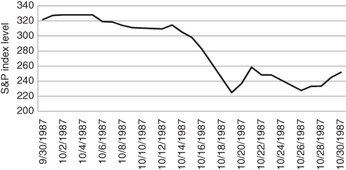
Figure 2.10 “Black Monday” in focus

The magnitude of the move is even visible in a long-term chart, spanning five years to either side of Black Monday. Figure 2.11 shows the damaging long-term impact of the move.
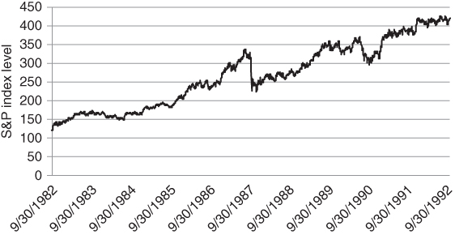
Figure 2.11 Black Monday, bird's-eye view

In Burr (1997), Bruce Jacobs argues that a portfolio insurance strategy, originally developed by Leland, O'Brien, Rubinstein and Associates (LOR), was a major cause of Black Monday. Portfolio insurance was inspired by Merton's approach to options pricing in the 1970s. Black and Scholes relied upon the Capital Asset Pricing Model as a source of inspiration when pricing European calls and puts. Merton re-derived the Black–Scholes formula using a more intuitive replication approach. At any point in time, an option could be viewed as a mixture of the underlying stock and a short-term government bond. If a market maker sold a call option and the price of the stock went up, he could buy more shares to neutralise exposure of the call to small moves. If the stock became more volatile, hedging costs would rise, hence the call option would become more expensive.

The intriguing thing was that in the Merton framework, an option was redundant. In a world where returns were normally distributed and costs were low, you could create an option by dynamically rebalancing between a stock and a risk-free bond. In theory, an investor could participate in market rallies while capping losses, without explicitly having to buy insurance. Later, we will illustrate how the implied volatility of an ATM option tends to trade above its realised volatility. This implies that, if Merton's assumptions were correct, options would be overpriced from a statistical standpoint. On average, it would be cheaper to replicate an option than to buy the option directly. There might be times where rebalancing would be expensive, e.g. if realised volatility turned out to be high during the life of the option and there were frequent reversals. In zigzagging markets, dynamic replication would require that you repeatedly sell at the low and buy at the high. In the long run, however, hedging would be relatively cheap as you would avoid paying up for the (implied/realised) volatility spread. The benefits after a risk event would be pronounced, as you would not be forced to buy options at the moment where demand was the highest.

This gave rise to the idea of portfolio insurance. LOR argued that if an index put option could be replicated with a dynamic short position in the index, large institutional portfolios could be protected using a strategy that sold futures whenever the index dropped by a certain amount. The delta of a put increases as the market sells off. In the same way, the LOR strategy would sell enough units of the futures to match the delta of the theoretical put. We suspect that the risk of what others are holding tends to increase when academics get involved. Ironically, the academic ideas tend to be good ones, validated over long historical data sets. The trouble is that ideas originating from the ivory tower tend to be accepted as dogma more readily than those borne out of experience. In turn, it might be said that investment dogma creates systemic risk. Theory became practice when, in 1982, the Chicago Mercantile Exchange (CME) launched a futures contract on the S&P 500. The contract allowed investors to speculate long or short on the index, with low initial cash outlay. As trading volumes increased, large institutions began to use futures as a hedging mechanism against their long equity portfolios. LOR could now implement their portfolio insurance strategy on a large scale.

We can hardly improve upon the Carlson (2006) report about Black Monday2 and quote it directly below. The report describes the activity of various market agents in a surprisingly lively style. The finger is directly pointed at portfolio insurance providers who kept selling large blocks of futures as the market fell.

There was substantial selling pressure on the NYSE at the open on Monday with a large imbalance in the number of sell orders relative to buy orders (SEC Report 1988, pp. 2–13). In this situation, many specialists did not open for trading during the first hour. The SEC noted “by 10:00, 95 S&P stocks, representing 30% of the index value, were still not open” (1988, pp. 2–13); the Wall Street Journal indicated that 11 of the 30 stocks in the Dow Jones Industrial Average opened late (1987e). The values of stock market indicies (sic) are calculated using the most recent price quotes for the underlying stocks. With stocks not trading, some of the quotes used to construct market indexes were stale, so the values of these indexes did not decline as much as they might have otherwise (SEC Report 1988, pp. 2–13). By contrast, the futures market opened on time with heavy selling. With stale quotes in the cash market and declining prices in the futures market, a gap was created between the value of stock indexes in the cash market and in the futures market (Chicago Mercantile Exchange, Committee of Inquiry 1987, pp. 18–29). Index arbitrage traders reportedly sought to take advantage of this gap by entering sell-at-market orders on the NYSE. When stocks finally opened, prices gapped down and the index arbitragers discovered they had sold stocks considerably below what they had been expecting and tried to cover themselves by buying in the futures market. This activity precipitated a temporary rebound in prices, but added to the confusion (Brady Report 1988, p. 30) … with equity prices declining steeply during the last hour and a half of trading. The Dow Jones Industrial Average, S&P 500, and Wilshire 5000 declined between 18 and 23 percent on the day amid deteriorating trading conditions (Brady Report 1988, Study III, p. 21). The S&P 500 futures contract declined 29 percent (SEC Report 1988, pp. 2–12).

In comments following a speech, the SEC Chairman reportedly said that “there is some point, and I don't know what point that is, that I would be interested in talking to the New York Stock Exchange about a temporary, very temporary, halt in trading” (Wall Street Journal 1987f).

This news broke shortly after 1:00 and started rumors in futures exchanges that the NYSE would be closed, prompting further sales as traders reportedly worried that a market close would lock them into their existing positions (Wall Street Journal 1987f).

The record trading volume on Oct. 19 overwhelmed many systems. On the NYSE, for example, trade executions were reported more than an hour late, which reportedly caused confusion among traders. Investors did not know whether limit orders had been executed or whether new limits needed to be set (Brady Report 1988, Study III, p. 21).

Selling on Monday was reportedly highly concentrated. The top ten sellers accounted for 50 percent of non-market-maker volume in the futures market (Brady Report 1988, p. 36); many of these institutions were providers of portfolio insurance. One large institution started selling large blocks of stock around 10:00 in the morning and sold thirteen instalments of just under $100 million each for a total of $1.1 billion during the day.

The deliberate vagueness of the SEC chairman is fascinating to behold. You can almost feel the beads of sweat trickling down his forehead as he discusses possible courses of action. More to the point, risk escalated because nearly all of the “top 10 sellers” were doing more or less the same thing. They were bailing out of the S&P in an attempt to protect client portfolios. As in the second leg down example, our conclusion is that risk is highly path-dependent. If large investors are all wired to react to price moves in the same way, volatility can appear out of almost nowhere. As the financial ecosystem becomes less diverse, the risk of spontaneous crises increases. Many risk systems use similar inputs, such as volatility or the level of cross-correlation in the market. This can produce common exit points and severe congestion as a large number of systems are trying to reduce positions en masse. No amount of fundamental analysis can tell you how to avoid these so-called “flash crashes”. Flash crashes are dependent on price action and positioning. The adage that the goal of markets is to produce the most pain to the largest number of investors is appropriate here. The only defences for a lower-frequency trader are to avoid leverage or to use options as insurance. The only solution is to maintain some form of cheap insurance in your portfolio all the time, acknowledging that the nature of the next collapse is essentially unpredictable. It seems strange that investors don't pay the same level of attention to their short-biased strategies as they do to their long ones. The institutions that had outsourced all of their hedging to an LOR provider probably had numerous managers running their long portfolios, using a variety of methodologies. Even if you can't predict where the next crisis will come from, it is inadvisable to rely too much on a single algorithm when managing your risk.

## HERE WE GO AGAIN

Have we learned much from the portfolio insurance crisis of 1987? In some ways, it would seem not. The same ideas get regurgitated through the financial markets every now and again. The new generation arrives, full of confidence and blissfully unaware of the hard lessons of history. The latest flavour of the month seems to be risk parity, which bears an eerie resemblance to the portfolio insurance strategy described in the previous section. A number of leading asset managers have been offering risk parity funds over the past few years. While risk parity strategies have a different objective from portfolio insurance, they generate similar trades to the LOR model. The simplest version of risk parity allocates between two asset classes, stocks and bonds. Commodities and currencies have been added to more recent versions of the strategy. The argument goes as follows. Traditional strategic mandates allocate 60% to stocks and 40% to bonds for very flimsy reasons. The weights were originally chosen because they are round numbers that marginally favour stocks over bonds, in dollar terms. Over time, the 60/40 composite has become market convention. Countless pie charts have been constructed in this way, to the point where investors have become convinced that the underlying methodology must be sound. There are some practices in finance that defy rational understanding. We just get used to them over time and assume they must be correct. The risk parity approach challenges the 60/40 mix, on the assumption that capital is not being used very efficiently and the allocation to bonds in risk terms is far too small. US government bonds tend to have less than half the realised volatility of US equities, implying that the performance of a 60/40 portfolio will be dominated by equities. A risk parity portfolio circumvents the problem by gearing the bond portfolio by a factor of 2 or 3 so that bond volatility matches equity volatility.

Figure 2.12 implements the risk parity idea in the simplest possible manner. We assume that S&P 500 futures are a reasonable proxy for equities and that 10-year Treasury note futures are representative of bonds. Next, we consider two cases, using weekly data from 1996 to 2015. The first relies upon a static 60% allocation to equities, with the remaining 40% in bonds. Rebalancing back to a 60/40 mix is performed on a weekly basis. The second case matches the trailing one-month historical volatility of stocks and bonds when setting the weights. The realised volatility of both strategies is roughly 10.5%, yet the risk parity line in black outperforms dramatically. Note that we have set the overall leverage of the risk parity portfolio so that the volatility of the grey and black lines match.
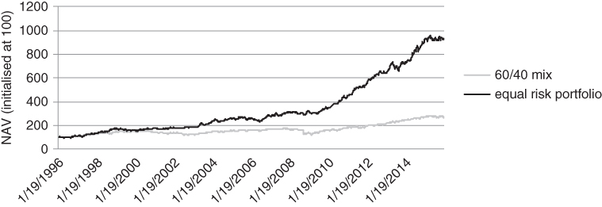
Figure 2.12 Historical performance of a bare bones risk parity portfolio

What performance! If we could extrapolate the black line into the future, asset allocation would be a breeze. The trouble is that risk parity might be contaminated by selection bias. We have effectively used a scientific-looking approach to goose up our allocation to bonds. This is not a bad idea from a risk control standpoint. However, with rates at current levels, it seems unlikely that bonds will perform as well in the next 35 years as they have in the past 25.

It remains to describe how a mechanical risk balancing approach such as risk parity can increase the odds of a major sell-off. While a static risk parity portfolio might look quite different from a portfolio insurance overlay, what happens at the extremes can be almost indistinguishable. Let's take the singular limit. In particular, assume a scenario where everyone used the same risk parity strategy. In this case, equity indices would probably go to 0. This is sometimes called a death spiral in the credit markets. Assuming equity volatility picked up, the equity component of the portfolio would have to be sold down to maintain risk parity. Since everyone would be selling together, volatility would spike again, forcing even more selling. As long as volatility grew fast enough to offset the shrinking equity weight, there would be no end to the selling. In some sense, this is more toxic than the portfolio insurance strategy, as volatility can rise more rapidly than prices can fall. We are not claiming that dedicated risk parity strategies have been responsible for any crises that we can point to. We simply observe that the risk parity approach to diversification is a potential source of systemic risk.

In the interests of presenting a balanced argument, we have to admit that there are some statistical factors working in favour of a risk parity solution. Historically, equity index and bond volatility have moved in tandem as depicted in Figure 2.13. We demonstrate this by plotting relative moves in historical S&P 500 and US 10 futures volatility over time.
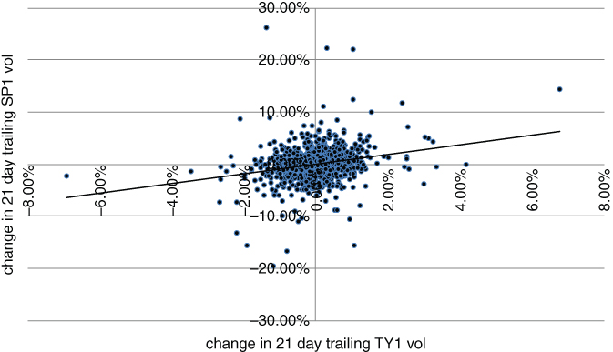
Figure 2.13 Historically, US equity and bond volatility have had a mild positive correlation

This implies that the risk parity allocation to stocks and bonds should also be relatively stable. The danger in this analysis is that we are relying upon the idea that the historical relationship between two very different asset classes is likely to persist in the future. However, it is validated by past price action. Risk parity strategies are also likely to benefit if the low growth market regime as of this writing persists into the future. Illmanen (2003) has identified regimes where the correlation between stocks and bonds has been relatively low. Cross-sectionally, across the major economies, stock-bond correlations have increased in tandem with inflation. Focusing on the US, the correlation between stocks and bonds has been particularly low in times of low GDP growth and inflation, and has been decreasing as a function of market volatility. This characterises the developed market economies as of this writing. Since the fall of the Berlin Wall in the late 1980s, the flood of workers to the West has created deflationary pressures on Europe and the US. This is a direct function of the increased supply of goods and services in the post-Communist era. If conditions remain deflationary, with intermittent bouts of market volatility, bonds may continue to provide valuable diversification benefits in a multi-asset class portfolio. However, our original point still stands. If allocations to risk parity strategies become too large, the danger of synchronised mass deleveraging will increase.

The examples above show that overcrowded strategies and asset classes can be a source of risk. You don't want to jump on every bandwagon and can benefit from being a bit out of synch with the market. Randomness can even be a virtue in certain instances. This has been demonstrated for market indices and also applies to managing risk. Most major stock indices (such as the S&P 500) are constructed using market capitalisation weights. The companies whose (share price) * (shares outstanding) is largest have a disproportionate impact on the index. Clare (2013) has demonstrated that if you had allocated to US stocks using a number of different weighting schemes, you would have outperformed the cap-weighted index over time. Equal weighting does relatively well, as well as more fundamentally oriented weighting schemes, such as setting weights proportional to a company's total sales or book value. On average, even random weighting schemes outperform.

Clare (2013) is partly based on an amusing study comparing the performance of 10 million randomly weighted portfolios of US stocks to a cap-weighted index. This required periodic rebalancing to ensure that the random indices would not favour momentum stocks over time. The study showed that the random portfolios outperformed in nearly every simulation. There is an added advantage to random weighting. By construction, you will generally avoid crowded trades. There are legions of analysts who conduct back-tests on nearly every deterministic weighting scheme. The good back-tests often turn into ETFs and the best performing ETFs attract inflows. So even if there has been a persistent anomaly in the past, expected returns can be compressed by excessive inflows. The outperforming strategy also has increased extreme event risk, as the ETF is subject to liquidations.

There are numerous other cases where excessive crowding in an asset class or strategy has triggered a risk event. Khandani (2007) observed that the degree of overlap in quantitative equity fund positions was astonishing when analysing the August 2007 “quant crisis”. More examples are to be found in the small province of convertible bonds, which is dominated by geared hedge funds that spread the bond against the underlying stock and other parts of the capital structure. Every few years, a large fund runs into trouble and has to liquidate its portfolio. This can cause collateral damage in an asset class that is surprisingly small and dominated by arbitrageurs. As of March 2016, the total outstanding value of US convertible bonds was roughly $200 billion, equivalent to the market cap of the 15th largest stock in the S&P 500 alone!

How does this all relate to hedging during a crisis? When you see too many people holding the same asset or engaging in the same strategy, you might want to think about the potential consequences of crowded trades, a mob mentality. Whenever money starts flowing into an asset or strategy at an accelerating rate, the risk of a severe unwinding is not far away. It may even be worth chasing the move, if you have a strategy for protecting against downside risk. Simply setting a stop loss level below the current price might not be enough, as there is no guarantee you will be filled anywhere near the stop. A safer alternative is to use options as a mechanism for protecting against blood-curdling reversals. Dynamic rebalancing strategies react to price action over some minimal frequency. No matter how sophisticated, they can't protect against “air pocket” declines such as the one in EUR/CHF above. Options have no such limitations. They gear into moves that are practically instantaneous as well as ones that take a longer time to develop.

On a more speculative note, we wonder if the regulator's insistence on using Value-at-Risk in UCITS funds and other fund vehicles may increase systemic risk in the future. UCITS funds have become the vogue as they can be marketed freely to European investors. While there is some flexibility in the way funds calculate VaR, a situation could arise where everyone hits their risk limits at the same time. This could cause a devastating liquidation of assets.

We hope that the reader is now aware of some of the limitations of traditional risk management. Rebalancing tends to fail in precisely those moments where it is needed the most and perversely can be a cause of crises. Ideally, investors should have something in their portfolio that provides significant protection against unforeseen risks. That “something” is usually a low-cost options structure. In any case, they should not place excessive reliance on realised volatility when sizing positions. Sometimes, realised volatility can become compressed for structural reasons and it is not possible to identify every case where this might be so. While options-buying during quiet times is the ideal, we acknowledge that there is generally resistance to doing so. At some primal level, we sometimes become too focused on short-term gratification to develop a clear understanding of potential future outcomes. This implies that we need to develop hedges that won't be too expensive even after things have taken a turn for the worse.

In the next chapter, we present some background material on options strategies. The idea is to reach the point where we can make informed decisions about how to choose an appropriate hedging structure from a variety of alternatives. We particularly focus on strategies that are not too expensive even when the demand for insurance is high.

## SUMMARY

Risk can appear unexpectedly, based on an exogenous event or synchronised de-leveraging. In extreme scenarios, where investors sell indiscriminately, “safe” stocks or asset classes may perform as badly or worse than the market itself. Options can re-price as quickly as any move in the underlying market and provide the only hard backstop against portfolio disaster. We visit these in Chapter 3.

## ENDNOTES

1Iain Clark, personal communication2Carlson, Mark.*A Brief History of the 1987 Stock Market Crash with a Discussion of the Federal Reserve Response.*Federal Reserve Board, 2006.[http://www.federalreserve.gov/pubs/feds/2007/200713/200713pap.pdf](http://www.federalreserve.gov/pubs/feds/2007/200713/200713pap.pdf)
