# Chapter 7Strategies for Taking Advantage of a Market Drop

For investors who still have some dry powder, market drops can create opportunity. While overextended investors are scrambling to constrain losses or meet margin calls, others can selectively buy assets that have become oversold. Although mechanical value-buying can be susceptible to long periods of underperformance, other strategies can add value when markets appear “oversold”. In particular, we examine short-term contrarian strategies for equity indices and volatility-selling strategies with bounded risk. One theme of the chapter is that, when volatility gets sufficiently high, it may be profitable to swap long equity exposure with short volatility exposure.

## THE ELASTIC BAND

It has been said that the most powerful force in financial markets is mean reversion. Mean reversion is the poor cousin of Maxwell's equations connecting electricity and magnetism or Newton's laws of motion, as there are no “laws” to speak of in finance. The rough idea is that an asset can't move far away from “fair value” or “equilibrium” indefinitely. Fundamental reality has to set in at some point. As the theory goes, the price of a stock can only overshoot for so long before value investors start to sell, based on unsustainable valuations. We can put this more precisely by looking at multiples, rather than raw prices.

Campbell and Shiller (1988) have created a financial ratio that continues to be followed closely. It is suitable for our current purposes. In Figure 7.1, we track the cyclicality of their CAPE index over long horizons. CAPE stands for the “cyclically adjusted price to earnings ratio”. Earnings are first adjusted for inflation over a trailing 10-year period. This ensures that older earnings have a similar impact as recent ones. Short-term fluctuations are then averaged out, to ensure that the “E” in CAPE is relatively stable. We can think of CAPE as a relatively stable and noise-free price to earnings ratio.
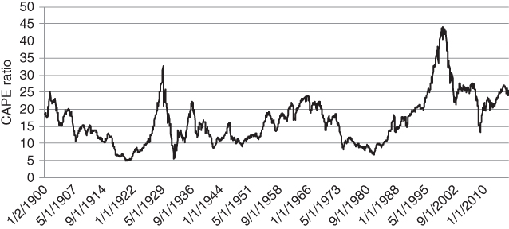
Figure 7.1 Shiller's CAPE ratio as a precursor to equity market crises

Whenever the CAPE ratio exceeds 25, the market may be in a state of “irrational exuberance”. In other words, prices are probably higher than justified by fundamentals. Drops in excess of 10 points (corresponding to severe corrections in price) have only occurred in this zone of frivolity and folly.

However cleverly “E” might be defined, “P” is the real driver of short-term changes in CAPE. Earnings are updated roughly 150 days per year and are not very volatile in the absence of a 2008-type recession. So if prices move more rapidly than fundamentals, ratios such as CAPE will typically become depressed after a major sell-off. It stands to reason that buying into large-scale equity drawdowns should work over the long term.

More formally, we can say that long-term prospective returns are inversely proportional to the CAPE ratio. As prices rise, forward expected returns decline. However, it may take a while to realise any gain. While equity bull markets are relatively durable, bear markets can also persist for longer than one might expect.

Are there other asset classes where mean reversion kicks in a bit more quickly? On the surface, currencies seem to be good candidates for a mean reversion strategy. They should be constrained by purchasing power parity (PPP). However, PPP tends to be a very weak attractor. An orange in Brazil can get cheaper and cheaper than an orange in the USA, without investors selling their dollars to buy oranges in Reals. Currency rates can drift for many years without interruption, based on carry differentials, relative growth rates and other factors.

Bond term premia, which measure excess demand for safe long duration assets, can also take years to converge to long-term average levels. You may have to wait quite some time before making money on a valuation-based model.

One thing to be wary of when measuring the degree of mean reversion in a series is the widely used Z score. Recall that a Z score measures the distance between a quantity and its moving average, in units of standard deviations. We cheekily relied upon it ourselves when constructing our risk indicator in Chapter 4, but accept that it needs to be applied with caution. Z scores can create cycles in an index that has a dominant trend, especially as the lookback window shrinks.

Figure 7.2 tracks US M2 money supply over time. This quantity includes cash, current, savings and money market accounts. It unambiguously trends from the lower left to the upper right of the graph. In nominal terms, this is not a quantity that cycles around an average level.
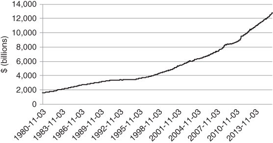
Figure 7.2 M2 money stock has a powerful trend

However, if we select a lookback window of 1 year, say, we can calculate the rolling 1 year return μ and standard deviation σ. Once we transform the series X into Z = (X – μ)/ σ, our series looks strongly oscillatory, as in Figure 7.3.
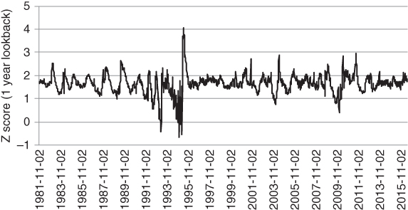
Figure 7.3 1 year deviations from trend for M2 money stock

The Z score transformation calculates normalised fluctuations around a trend. It will find cycles in any series that does not increase at a super-linear rate. Selling when the Z score is above average is unlikely to be a winning strategy for any series with a strong upward drift, as the trend dominates small deviations around it.

We must proceed with caution when searching for mean reversion and cyclicality in a financial data series. However, we observe that credit spreads and volatility do seem to mean revert quite quickly after a spike. There is no need to normalise the data by calculating a Z score. The choppy and ultimately directionless VSTOXX index appears in Figure 7.4. After a spike, it tends to decay rapidly back to the 20 to 30 range. We do not have to keep readjusting the mean to force cyclicality in the series. Note that the VSTOXX is the analogue of the VIX for the European Stoxx 50 index.
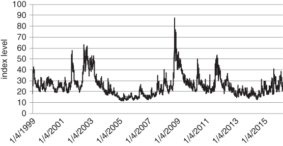
Figure 7.4 The V2X as a barometer of risk aversion for European large cap stocks

When something oscillates as much as the VSTOXX, with no discernible trend, we can at least take a stab at measuring its long-term average level. (We hesitate to use the phrase “equilibrium level”, as the oscillations around any fixed level are so severe.)

Having accepted that volatility mean reverts more strongly than equity prices, we can still try and identify situations where equity reversals are likely. In the next section, we examine one such scenario. While there are many other potential configurations leading to predictable price moves, these remain in the “secret sauce” category for a fund manager. This is not to say that the fancy strategies work all the time, only that they are outside the scope of this book.

## TRADING REVERSALS

It has often been said that volatile markets create opportunity. What exactly does that mean? If the volatility of an asset in your portfolio jumps from 10% to 20% then yes, your profit potential goes up per contract held. For a given level of gearing, there is more total movement to take advantage of. The trouble is that your potential for losses goes up proportionately. We need to investigate a bit deeper than that. The increased opportunity set is in fact created by rising dispersion and widening of spreads. Dispersion measures the degree to which a collection of securities moves apart over time. During liquidations, similar stocks might diverge, based on the holdings of large institutions who might be selling. This can create spread trading opportunities. As volatility rises, credit spreads tend to widen, creating bond buying opportunities. While you can't “eat volatility”, as some old-fashioned investors say, there are strategies that offer the prospect of converting volatility into return. During severe “risk off” regimes, individual securities can move far away from fair value. At the extreme, a company's market capitalisation may even drop below its liquidation value, as investors furiously sell the stock. These are the sorts of buying opportunities sought out by Graham (1949). Such obvious buying opportunities are probably less common today, as investors have access to better and more timely information. However, it is worth repeating that the market was pricing pair-wise correlations above 100% in 2008, so extreme mispricings still occur episodically. This is a theoretical absurdity caused by multiple investors having multiple panic attacks at the same time. Crises can breed opportunity in a variety of ways.

Before rushing in to buy every mispriced security, you need to keep a few things in mind. How much firepower do you have left? If you have already absorbed heavy losses, it might be too late to add more risk onto your book. Indeed, you might be going in the other direction, slashing positions in an effort to stay afloat. Even if you are still in the game, you need to allocate with appropriate caution. Suppose you displayed admirable patience early in a crisis. If you pile in thereafter and conditions worsen, your patience might not be rewarded. Another leg down could make you one of the casualties in the end. Piling into opportunistic trades might seem reasonable if you hedge your portfolio aggressively at the macro level. However, this almost defeats the purpose, as hedging costs will erode the premium you were trying to collect in the first place. Our humble advice is to stay small and nimble after a sell-off. Markets are unlikely to stabilise instantaneously and you will have numerous opportunities to extract alpha in the future.

We start with a simple mechanism that can force markets to be overstretched over short-term horizons. In bear markets, equity indices frequently sell off hard into the close. A trader who can't bear too much overnight or weekend risk (e.g. a day trader or market maker) may be a forced seller at the end of the day. This may trigger a sequence of events. When the market drops, leveraged ETFs have to reduce exposure mechanically, to ensure that their total exposure is a fixed multiple of equity. The following example, for a leveraged long ETF, might clarify things.

- Suppose that there is a 2× leveraged ETF on an index and ETF has $100 of equity.
- In order to generate 2× leverage, the provider needs to borrow $100 and invest a total of $200 in the index. In this way, the ETF will generate 2× the index return from today to tomorrow, gross of fees.
- If the index drops –10% the next day, the ETF has lost –$20. Equity has gone down to $80.
- The ETF then has to sell $20 of index exposure to reset leverage at 2, i.e. to match the amount of borrow with the amount of equity.

In the meantime, leveraged short ETFs need to scale into the move, increasing their short exposure. Trend following CTAs might be forced into the move if the move is extended enough. Things can get ugly in the last hour of trading, with cascading sell orders pushing the market down.

You might try and take advantage of the move, on the assumption that a given equity index is oversold, at least in the short term. Historically, buying bad closes and holding for one day has been a reasonable strategy. In the charts below, we examine the S&P 500 and Nikkei indices, using a trading strategy from 1995 to the present. The strategy makes a bold assumption, namely that you can execute at the close on each day. Here, we introduce a simple strategy that takes advantage of exaggerated sell-offs into the close for major equity indices. While the strategy has historically worked in a variety of volatility regimes, the opportunity set tends to increase when volatility is high. You get more trading signals when investors are seized by panic. We emphasise that the contrarian strategy below has open-ended risk, hence should not be traded too aggressively. The strategy also assumes that you are able to transact at the market close and that there are no transaction costs. Transacting at a level close to the cash market close should not be too difficult, as you can always trade the futures immediately thereafter. Our digression into levered ETFs was intended to show that market forces can drive prices well beyond fair value going into the close. Leverage, risk limits and restrictions on holding large overnight positions can all contribute to ugly end of day sell-offs. So how can you take advantage of the overreaction? One strategy is to buy into the sell-offs. Figure 7.5 focuses on Nikkei 225 futures. We classify hard sell-offs into the close as days with a larger than average range, where the distance between the close and the low is more than 0.5 standard deviations below average (using a 2-year lookback window). Assuming that we can transact at market close, with negligible costs, historical performance is surprisingly strong over a trailing 20-year period.
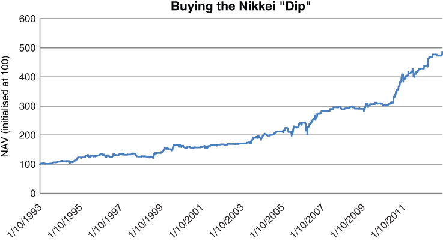
Figure 7.5 Buying the nasty 1-day dip, NIKKEI 225

Buying dips, or short-term sell-offs, is related to another concept called “trading the coastline” as shown in Figure 7.6. While Richard Olsen popularised the concept (Dupuis and Olsen, 2012) we need to refer back to the work of Mandelbrot for the original inspiration. The “rough” idea is that, when an asset goes from A to B, the total distance travelled will generally be much greater than (B – A). As the time partition gets finer, the total distance travelled must increase, and it is the rate of increase that is important.
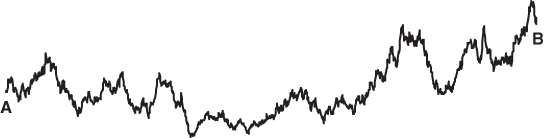
Figure 7.6 Trading the coastline, when the signal to noise ratio is low

For fractal-type paths, the total distance travelled will diverge to infinity as the partition size shrinks to 0. Even when we deal with movements in discrete time, the length of the path can be surprisingly long. We want to take advantage of small meanderings away from the trend, so long as our transaction costs are not too high. While Old Turkey from Chapter 6 would vigorously disagree with this idea, modern market making algorithms try to convert “noise” into return by taking contrarian positions in small movements away from trend.

Whenever you decide to “fade” a major sell-off or spike in volatility, you are assuming that there is less information content in the move than the market thinks. In other words, the market doesn't know something that you are unaware of. This is the basis of contrarian trading.

## MORE TEXAS-STYLE HEDGING

A Texas hedge is a trade that actually adds to the risk of your overall portfolio. It's not really a hedge at all, but a correlated alpha trade that appears particularly attractive after a sell-off. We would only recommend such a trade if you had been underinvested going into the initial down move.

The system in the previous section was short-term in nature. You waited for an ugly sell-off into the close, bought the index and then dumped the position at the close of the following day. The holding period of the trade was 24 hours. But consider another alternative. What if you want to buy into a sell-off and hold the position for a while? In this context, risk reversals can be useful. As we discussed in Chapter 3, a risk reversal involves selling a put and buying a call on the same asset. The call and put have the same maturity. Otherwise, we would classify the structure as some sort of diagonal spread. If you sell an OTM put and buy an OTM call, the put strike will be lower than the call strike. OTM risk reversals attempt to take advantage of distortions in the implied volatility skew for an asset.

They can be traded opportunistically. After a sell-off, the slope of the skew (for an equity index or other risky asset) becomes increasingly negative. Put implied volatility typically rises more than call implied volatility. Figure 7.7 shows how the differential between 25 delta put and 25 call implied volatility increases as a function of ATM volatility for the S&P 500 index. We assume that both options have 1 month to maturity.
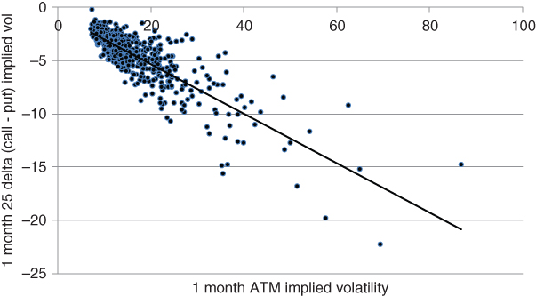
Figure 7.7 Selling the skew after a risk event can be attractive

Carry currencies, such as the Australian dollar, typically have the same property. The demand for downside hedges escalates after a drop. We can see this in Figure 7.8. Again, we have focused on 1-month implied volatility collected at weekly intervals. The data ranges from 2003 to early 2016.
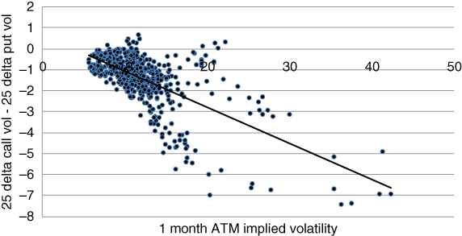
Figure 7.8 The AUD put skew also has positive sensitivity to changes in ATM volatility

The amount of premium collected from a fixed delta risk reversal increases when investors become fearful. OTM puts are in demand, increasing the steepness of the implied volatility skew. We can harvest premium from a “risky” without taking on too much directional risk by shorting futures against it. This allows us to isolate distortions in the skew, at least at the moment of trade entry. While shorting does not eliminate extreme event risk (and may in fact disguise it), it cushions against moderate declines in the spot.

In Figure 7.9, we have constructed a hedged risk reversal using reasonably long-dated (roughly 7 months to maturity) options on the S&P 500. The resulting structure was initially short 100 25 delta puts, long 100 25 delta calls and hedged with futures. We have sketched the payout curve for a range of spot prices, with 2 months to go and at maturity. Note that the short futures hedge is not rebalanced along the way.
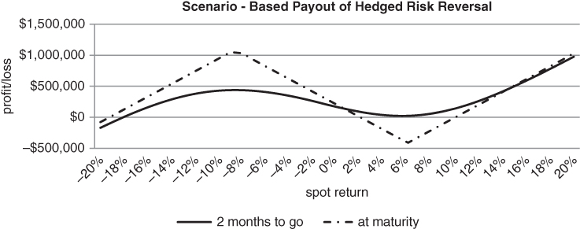
Figure 7.9 Elevated put skews can create intriguing risk reversal trading opportunities

The combined structure is a beauty if the index either drops moderately or rises sharply. Structurally, we are short downside gamma and long gamma to the upside. The implication is that a hedged risk reversal requires some maintenance if there is a shallow recovery or a severe fall. For large downside moves, the structure has unbounded risk, implying that it should be sized conservatively.

It is tempting to flatten the middle section of the payout curve by selling fewer futures against the risk reversal. This creates a more constant profit for a wide range of moderate scenarios. The problem is that you have “Batman-style” risk for large drops in the index. If you cut back on the hedge, the extreme downside risk of the structure is larger than for a long position in the futures. You should be careful not to do too much of an open-ended structure such as this, lest you violate the time-honoured principle of “being able to sleep at night”.

## SELLING INDEX PUT SPREADS

Selling put spreads on the S&P 500 after a drop in the index is another fine second leg down idea, assuming you are still in the game. The index doesn't need to recover for you to turn a profit. All that is required is stabilisation. Things need to stop going down so quickly. We test the put spread selling strategy below, using a simple rule. Whenever the weekly return for the S&P 500 is negative, we sell 2 put spreads at the close on Friday. Our returns are calculated as a fraction of the cash S&P index level. The short strike has a 40 delta and the long strike has a 25 delta at the point of entry. The maturity of the spread is always 4 weeks, i.e. we price it from the interpolated implied volatility surface using the Black–Scholes equation. This is similar in spirit to selling a put spread whenever the market goes “risk off”. However, it is less restrictive as we wind up selling the spread roughly 50% of the time. We can gauge the benefit of the timing signal from Figure 7.10. The grey line tracks the performance of a strategy where you continuously roll the put spread. Conversely, the black line only enters the market following a negative week for the S&P.
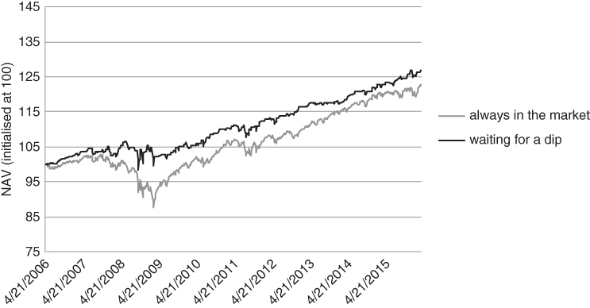
Figure 7.10 Selective selling of put spreads can generate interesting risk-adjusted returns

It is clear that the conditional strategy outperforms strongly, even though it spends a large chunk of time out of the market. Note that we have made the conservative assumptions that the return on cash is 0% when there is no trade signal. As a result, the black line has some flat sections. The volatility of the conditional strategy is roughly 25% lower than the volatility of the strategy that's always in. This implies that waiting for a weekly drop before selling put spreads adds considerable value, especially on a risk-adjusted basis.

## BREATHING SOME LIFE INTO THE EQUITY RISK PREMIUM

For many years, the equity risk premium was thought to be a relatively static thing. The long-term expected return of stock indices over bonds was assumed to be nearly constant. However, intuition suggests that the expected returns on a risky asset should go up quite strongly after a sell-off, assuming nothing has fundamentally changed. The lower the price of a stock index, the higher its future expected return should be. Legions of value investors in equity and corporate bond markets have operated on this premise. Over time, academics have loosened their assumptions and allowed the equity risk premium to move around a bit. In Campbell (2008), estimates of the global premium range from roughly 1% to 4% per year from the mid-1980s to 2007. These estimates are based on static return on equity and dividend payout ratio assumptions. Martin (2013) has developed a more flexible framework for estimating risk premia over shorter well-defined time horizons. He concludes that the equity risk premium might move considerably more radically than convention would dictate. The idea is that it is possible to establish a lower bound on the premium, using market prices for S&P 500 variance swaps. The premium is mathematically derived, using Black–Scholes–Merton type assumptions. Variance swaps go up even faster than implied volatility during risk off phases, suggesting that expected S&P returns can go from 2% annualised, say, to over 50% (!) annualised during a very nasty sell-off.

While the results are bound to be controversial in some circles, the idea that risk premia vary widely across time should resonate with anyone who has sold options over a market cycle. You want to buy risky assets after very severe sell-offs, assuming you can endure periodic bouts of short-term volatility. The amount of premium collected from selling fixed-maturity puts is highly variable. A liberal application of Martin's research involves selling OTM put spreads whenever implied volatility is high. In Figure 7.11, we demonstrate how the premium collected for selling a 5% OTM put on the S&P 500 varies as a function of implied volatility. In this case, we have assumed that the option has 3 months to maturity.
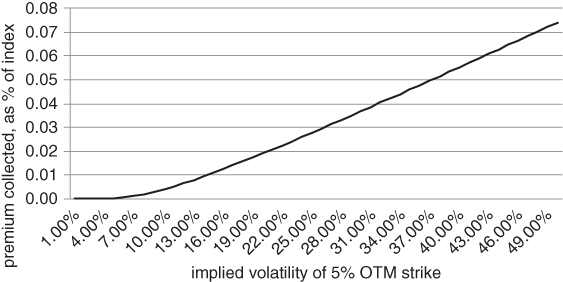
Figure 7.11 The premium from selling an OTM put varies roughly linearly as implied volatility increases

For implied volatility above 10%, the premium collected from a short put increases roughly linearly with volatility. We accept that the equity risk premium and the premium harvested from an options selling strategy are materially different quantities. However, the example above shows how dramatically prospective returns can vary as a function of risk.

Selling volatility is based upon the same premise as buying credit. When you buy a high yield bond, you collect an excess return relative to the risk-free rate, so long as the bond doesn't default. Time is also on your side when you sell an OTM put. You would like nothing more than for the market to wander around aimlessly for a while. After a risk event, bond yields and cross-asset class implied volatility tend to be very high. If the future is not as bleak as the present, you can generate a return simply by sitting on your hands. Note that we are selling a put spread, rather than an outright put. We don't want to be exposed to a spiral down to 0. This is in keeping with our “second leg down” premise. There is always the possibility of a third leg down and there are no prizes for surviving the longest before getting wiped out.

## BUYING VIX PUTS

Any number of premium capture strategies should work after a sell-off, assuming that you have deep enough pockets. What if you have nearly exhausted your risk budget, but want to participate in a recovery? Here is an alternative idea, with bounded risk. Buying VIX puts or put spreads seems to be a fairly consistently winning strategy, on a historical basis. This might seem surprising at first, as long options strategies are rarely associated with consistent profits. When you buy and roll an OTM option, the expectation is that you will burn premium most of the time, in exchange for the occasional large positive return.

But let's think about this problem in a bit more depth, with reference to futures options. Suppose you have options on two different futures contracts. The futures prices are the same and the market assigns the same volatility to both of them. The strikes and expiration dates are the same. Then, the Black 1976 pricing model assigns the same price to both options. The precise formula appears in the appendix. Black 76 is surprising for a piece of information that it doesn't include. The shape of the futures term structure never appears in Black 76. This is significant. It might be that the term structure of the first futures contract is in backwardation while the second is in severe contango. Still, Black 76 implies that their options prices should be identical. This is of no matter: their theoretical options prices must be identical. The absence of forward curve dependence is analogous to the dog who didn't bark in the night in Conan Doyle's The Silver Blade. The Black–Scholes–Merton approach relies upon instantaneous replication of an option, so roll down never appears. Recall that replication involves buying or selling an appropriate number of futures to match the option delta. If we continuously rebalance, we might not realise that the specific futures contract we use to hedge is changing form over time. The time to maturity is shrinking and the futures is rolling down the term structure.

If we choose not to hedge dynamically, Black 76 ignores a very important piece of information. The term structure is telling us where the market expects the futures to trade at a forward point in time. If the term structure is in contango and nothing much happens, the futures price will drift down over time. The steeper the curve, the greater the roll down. Hence, if we buy a put on a futures contract that has an upward sloping term structure, we're in business. Every day that goes by quietly, we lose a bit on time decay. However, this is offset by futures drift toward the strike. Roll down is an important source of return that is well known to experienced options traders. It might be argued that shorting the futures is a more direct way to play contango in the term structure. However, such a strategy does not play into a hedging mandate as it has unbounded risk. Buying VIX puts or put spreads is the safer way to go.

Figure 7.12 tracks the performance of a no frills put buying strategy on the VXX (short-term VIX futures ETF). We have bought a 4-week 50 delta call, held for a week and rolled. Each call has been priced from the VXX implied volatility surface.
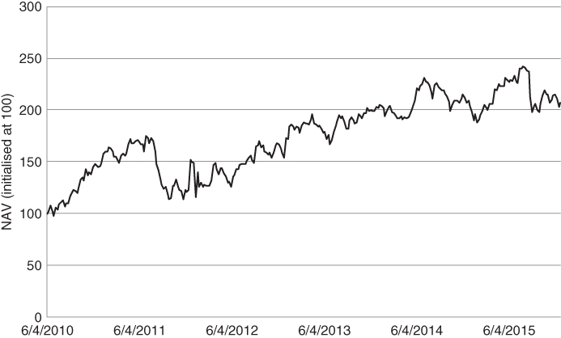
Figure 7.12 Historical performance of rolling long put strategy on the VXX

Here is a rare bird, a long options strategy with positive drift! The strategy benefits from roll down whenever the VIX is in contango and mean reversion in the spot VIX after a volatility spike. These factors have been enough to overcome options time decay, at least historically. Based on the evidence, VXX puts are an intriguing addition to a hedging overlay. The offer positive gamma and expected return, with bounded risk. Your loss is restricted to the initial premium outlay. If you manage to call the bottom of an equity sell-off, you can also collect a windfall from mean reversion in volatility.

There is an extended form of the VXX put buying strategy. After a moderate sell-off, you can combine nearby puts with far out of the money call spreads to profit from either a severe continuation of the sell-off or a reversal. You might reason that volatility is unlikely to stay put at the current level. As of this writing, we have to admit that the “edge” in buying VIX puts after a volatility spike seems to have diminished. The market has cottoned on to the idea and appears to be pricing in a steeper VIX skew than before. However, the trade still offers the possibility of offsetting option theta with roll down and mean reversion.

## SELLING VIX UPSIDE

Selling VIX call spreads can be an effective strategy after a sell-off. For example, if front month VIX futures have jumped from 15 to 25 in the past week, it might be reasonable to sell a 1-month VIX 25/30 call spread. Once markets stabilise, you have the potential for a solid return. We emphasise that you don't need the S&P to recover. The index just has to stop accelerating to the downside. There is another advantage to selling VIX calls after a spike in volatility, as we will see in the graph below. In particular, we observe that the level and implied volatility of the VIX are closely related. When the VIX spikes, it also becomes more volatile. The relationship is sub-linear, in the sense that the market starts to account for mean reversion if volatility becomes really high. Nonetheless, if you believe that the current crisis will not get appreciably worse, selling a call spread gives you two sources of return. Since you are short delta, you benefit from a decline in the level of the VIX. Additionally, your call spread will benefit from declining VIX implied volatility, as vega in the near strike will dominate vega in the far one.

We graph the porcupine-type relationship between VIX level and VIX implied volatility in Figure 7.13.
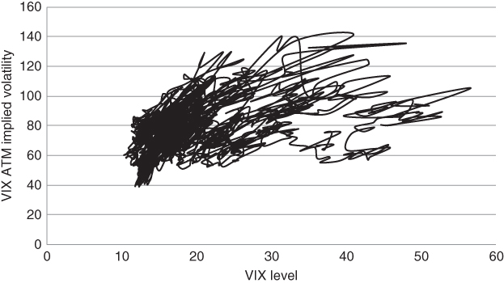
Figure 7.13 Porcupine exposure of VIX implied volatility relative to VIX level

The reader might wonder why we haven't recommended selling an outright call, rather than a call spread. We don't recommend selling naked calls on the assumption that it is inadvisable to take unbounded risk in a quantity that can jump as much as the VIX. Trades that can fly in your face in an instant are to be avoided. History is a powerful guide. The VIX approached 90 in October 2008 and probably would have exceeded 100 in October 1987 if it had been quoted then. A 1-day –20% move would annualise at nearly 300% volatility if it occurred every day (assuming that we do not subtract the mean return in our volatility calculation).

Notice that this trade is a variation on the put spread buying strategy we discussed earlier. In both cases, we are taking the view that forward volatility will decline. However, the put spread is a more subtle trade, as it is focused on roll down in the VIX futures term structure. If we buy a put spread after the curve has gone into backwardation, we potentially gain on delta but lose on vega. Declining implied volatility works against the put spread. In the meantime, selling a call spread is probably a cruder trade, as it is not overly concerned about term structure dynamics. However, it can be very effective after a sell-off. You needn't get too fancy once things are out of whack.

## THE REMARKABLE SECOND MOMENT

We have observed that selling put spreads after a spike in implied volatility can be a very attractive strategy. The idea is to “fade” a large move, while betting that volatility will revert to more normal levels. This is a variation on the short VIX call spread idea above, as it also relies upon compression in implied volatility. Why is it that we want to trade volatility after a crisis? There are two reasons. First, as we will see, volatility is the easiest parameter of the forward return distribution to estimate. More specifically, volatility is strongly mean-reverting.

Let's examine why volatility can be estimated with at least some level of accuracy. Our argument is heuristic, but hopefully illustrative. The simplest realistic assumption is that asset returns can be modelled by a time-invariant, or “stationary” process. While stationarity is violated in practice, this assumption allows us to build our intuition. Also suppose that returns are normally distributed and each return is independent of all others. If we simulate a reasonable number of returns according to these assumptions, which moment is most reliably estimated? It turns out that the standard deviation (square root of the second moment) has the least variation across alternative realities. This implies that, if the “true” distribution is not too different for a normal one, we have some hope of estimating volatility. We can make this concept concrete by running the following set of simulations.

- Each simulation, we draw 100 daily returns from a normal distribution with mean 0 and volatility 10%.
- We calculate the mean, volatility, skewness and kurtosis of the returns in each simulation.
- We then run 10,000 simulations, so that we can build the sampling distribution for each moment.

Table 7.1 summarises our results.

Table 7.1 Standard deviation has the tightest sampling distribution

| Empirical Standard Deviation of Sampling Distribution || --- || Mean |  || Standard deviation |  || Skewness |  || Kurtosis |  |

We can see that the standard deviation (square root of the second moment) varies the least across simulations. To be fair, the sampling distribution of the mean is nearly as tight as that of the standard deviation. However, the standard deviation in a typical simulation is over 10 times larger in magnitude than the mean. This suggests that, in relative terms, standard deviation stays in a very tight range across simulations. It's somewhat surprising that the second moment is more well-behaved than the first, third or any higher central moment. As it turns out, volatility is not only the easiest moment to measure, but also the easiest to predict. This is true in relative terms, at least. Volatility has a tendency to mean-revert whenever it becomes particularly stretched. We can express this idea in rough but intuitive terms. Barring a collapse, it's unlikely that the S&P 500 will trade at its average level over the last 20 years (roughly 1270 as of February 2016) in the near future. However, most of us would expect the VIX to intersect its long-term average value on a fairly regular basis. In 2015 alone, the VIX crossed its 20-year trailing average 6 times (using daily data).

It's possible to be a bit more rigorous in our discussion. Our VIX call spread trade is dependent upon mean-reversion, so it is worth having an accurate picture of the underlying dynamics. An obvious point of reference is the GARCH model, as in Bollerslev (1986). GARCH is one of the most widely-quoted econometric models and serves two basic purposes. It is suitable for generating point estimates of volatility and can also forecast volatility forward in time. More precisely, GARCH models the evolution of an asset's variance, i.e. the square of its volatility.

We now give a very rough but intuitively correct description of the model. A point estimate of GARCH variance is dependent on yesterday's estimate, the long-term average variance and the square of the most recent return. Critically, the loading to the long-term average term is negative. This “pulls” volatility toward a long-term equilibrium and suggests that, at the extremes, changes in volatility are somewhat predictable. A direct consequence of the model is that volatility is persistent over short horizons and mean reverting over long ones.

A direct way to convince yourself that volatility is mean-reverting is simply to look at the data. Rather than using the spot volatility estimate from a calibrated GARCH model, we can focus on mean reversion in implied volatility. After all, implied volatility is a key driver of the performance of a short put or put spread strategy. In Figure 7.14, we have mapped the current level of the CVIX onto its 6-month forward change. The graph relies upon 20 years of weekly data. We can directly see that level and change have a significant negative correlation. When volatility is high, odds are that it will decline over the next 6 months. This suggests mean reversion in implied volatility.
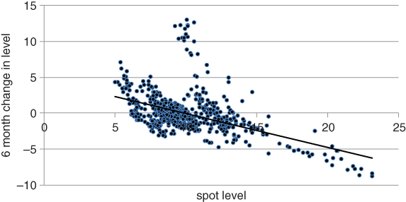
Figure 7.14 Currency implied volatility tends to be mean reverting over 6-month horizons

Unsurprisingly, the VIX also exhibits strong mean reversion, as we observe in Figure 7.15.
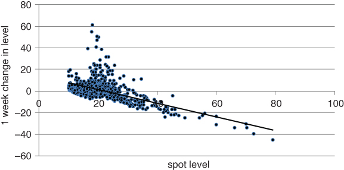
Figure 7.15 The VIX tends to revert over 6-month horizons, too

The level of dispersion around the regression line for implied volatility above 30 is very low. In practical terms, this means that the VIX has a high probability of reverting whenever it crosses 30. The reversion may take a few months, but based on the evidence it is very likely. This point is worth investigating further. If we can control for extreme left-tail risk and carry costs, selling the VIX above 30 seems a very good trade. Assuming we have hedged or adequately accounted for the extreme left tail, the last thing we want to do is to buy outright VIX calls after a volatility spike. Volatility (and likely the volatility of volatility) is likely to decline if nothing dramatic happens in the near term. GARCH-like forces are pushing volatility down. It's also interesting to observe that a short volatility position seems to have the greatest relative risk when the VIX is around 20. The “fear index” hasn't tended to jump directly from 15 or so all that often in the past. A plausible explanation is that the VIX needs to get a bit hot before large scale sell-offs become imminent.

We can take advantage of high volatility levels by selling VIX futures calendar spreads. In particular, we might sell front month futures and buy the deferred month when the term structure becomes inverted. In this case, we are playing mean reversion in the spot rather than roll down. Our roll yield is in fact negative, though we do not think it will stay that way for long. Rather, we are betting that spot volatility will decay. Buying the second month partially hedges against a further spike in volatility. Observe, however, that your potential loss is theoretically unlimited. You can lose your shirt on calendar spreads, as the saying goes. The second month futures will move far less than the front month if spot volatility continues to rise.

## SUMMARY

Misery sometimes creates opportunity in financial markets. You do not need to be a “vulture” or “wolf” to turn a nice little profit during turbulent regimes. During liquidations, certain types of investors are forced out of the market, while others scramble for protection. Anyone who still has capital to deploy can take advantage of price dislocations in a volatile market. Buying dips in risky assets, selling volatility and selling the skew are all effective strategies when traded selectively and opportunistically. However, careful sizing and structuring of trades is vital, as there is no way to know when the worst is over.
