# Chapter 3: An Overview of Options Strategies

Most of the hedges described in this book are options structures. They rely upon buying and selling combinations of calls and puts with different strikes and maturity dates. We are mainly concerned with uncovering strategies that provide protection at low cost. In this chapter, we provide a non-technical overview of options, in preparation for the hedges we will dissect in Chapters 4 and 5. We make no effort to derive Black–Scholes or any other pricing formula. Rather, we will use the Black–Scholes formula as a way to adjust for different strikes and times to maturity. Value will be expressed in the currency of implied volatility. Normalising across strikes and maturity dates can help us decide which options are rich and which are cheap. We start with a bare-bones description of puts and calls, then transition into more complicated structures, such as spreads, butterflies and ratios. Our ultimate goal is to identify horses for courses, i.e. hedging structures that are well suited to a particular market environment. It will take some time before we can delve into regime-specific analysis. This chapter serves as necessary background material. Note that we will primarily focus on exchange-traded futures and options, as they are easier to analyse and trade at an accurate and timely price.

Options contracts have a long and varied history, possibly extending back to ancient Greece and carrying on through to England in the 1600s and the US thereafter. It may be that the options market took off when corporations started to add sweeteners to stock and bond issues. For example, in the 1840s, the New York and Erie Railroad Company issued one of the first recorded convertible bonds. The bonds could be exchanged for, or “converted” to shares if the stock price went up enough. In other words, there was a call option embedded in the bond. This was attractive to the company as the bonds could be floated at relatively low yield. At the same time, investors were keen to own bonds that offered participation in a rising market. New instruments have the greatest chance of success if they generate an active two-way market. There are natural buyers and sellers of the contract. Today, calls and puts represent a tug-of-war: between hedgers who need to insure existing portfolios, and speculators who want to take a directional punt or trade volatility.

## THE BUILDING BLOCKS: CALLS AND PUTS

We need to use a bit of math in this section, to make the concepts clearer. Derman (1996) has remarked that Fischer Black wanted an introductory article about the Black–Derman–Toy model to be written without any formulas, with a focus on developing the necessary intuition. While we have fallen short of Black's ideal in this chapter, we will try to minimise our use of complicated formulas and equations. There is an entire industry devoted to exactly that and we have no intention of re-inventing the wheel. The reader might want to consult Wilmott (2013) for a more mathematically minded, yet pragmatic, treatment of options theory. For now, let's start with calls and puts, as these are the most basic exchange-traded options.

Readers with a strong background in options strategies can comfortably jump to the section “Skew Dynamics for Risky Assets” later in this chapter.

Calls and puts are financial contracts with standardised features. The owner of a call has the right to buy an asset at a predetermined price X at maturity. X is called the option strike. The owner of a put has the right to sell an asset at the predetermined price X. However, in either case, there is no obligation to do so. In practice, you would only buy an asset at price X if the market price S(t) > X. Otherwise, you could just buy the asset at a lower price in the market. In effect, you are hoping for a rally above the strike. Similarly, you would only sell at X if S(t) < X. Viewed in isolation, calls represent bullish bets and puts represent bearish ones. Outright call owners would like nothing more than for the price of the underlying asset to skyrocket from now to time T. This would allow them to buy at X and then dump the asset into the market at a much higher price. The payout of a call at maturity is given in Figure 3.1.
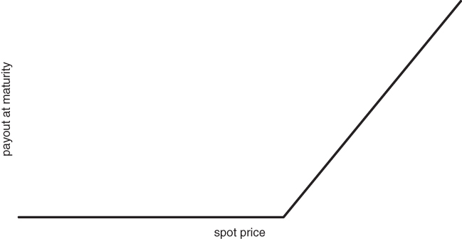
Figure 3.1 Payout shape for a call option at maturity

Puts generate a positive payout for whenever the spot drops below the downside strike as shown in Figure 3.2.
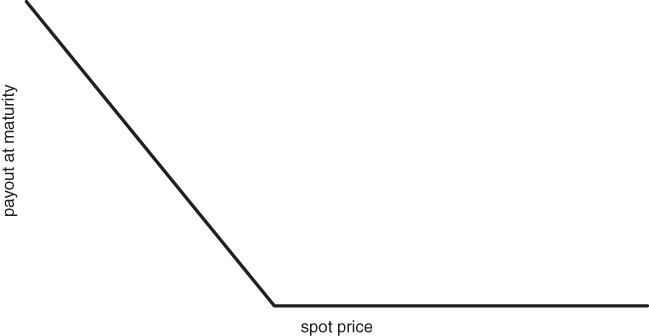
Figure 3.2 Payout shape for a long put at maturity

It's worth reflecting on the hockey stick payouts for a while, as the bendy part of the curve is what makes options interesting and important. In both cases, the discontinuity in the slope of the curve occurs at the strike X. While options traders generally do not hold to maturity, the terminal payout has a large bearing on the way a call or put evolves over time. We use calls as our base case for now. The value of a call at maturity is . You receive the higher of the asset price minus the strike and 0. This quantity is also called the terminal payout of the call. This implies that, once you have bought the call, your maximum loss is 0, while your potential gain is theoretically unlimited. This does not mean we are suggesting that you will always make a profit from the trade. You need to overcome the initial cost of the call to bank the profit.

Similarly, the value of a put at maturity is . The kink in the payout at  introduces a non-linearity into the payout curve. Why is this important? It allows the owner of a call or put to benefit from large and unexpected market moves. The wider the range of outcomes for , the greater the payout potential of a call or put. Since losses are strictly bounded, put and call prices should increase in tandem with uncertainty. In the unorthodox and evocative language of Taleb (2012), puts and calls are “anti-fragile”. They profit from disorder. The wilder and more unpredictable  becomes, the better. We can illustrate this idea using a simple example. The example relies upon a single “binomial” outcome, generated by the flip of a coin.

- Suppose we buy a call option on a stock currently trading at 100 and make some assumptions about where the stock can go.
- There are two scenarios. In the first, there is a 50% chance that the stock will land at 90 and a 50% chance the stock will land at 110 at time . In the second, the spread is wider. There is a 50% chance that  and a 50% chance that . In Figure 3.3, we sketch the two scenarios in tandem.

Figure 3.3 One-step binomial model with variable volatility
- The expected value of  in both cases, e.g. . However, the call is worth  in scenario 1 and worth 10 in scenario 2. Scenario 2 has a higher scenario-averaged payout for the owner of the call and hence should be worth more.

This strongly suggests that call and put prices go up as the perceived range of outcomes increases. If we replace the discrete price tree with a continuous return distribution, the situation is identical. Let's take the simplest continuous case, where returns are normally distributed. Recall that a normal distribution is completely specified by two parameters, its mean and standard deviation. Returns fall under the classical “bell curve” after repeated experiments. In this case, uncertainty is completely encoded in the parameter σ. If we normalise the standard deviation appropriately, to adjust for variation over different time horizons, we wind up with something denoted by σ. σ is familiarly called the volatility of returns. It is an extremely important quantity, as it measures risk at the most basic level. The price of both a call and put is increasing in volatility. Without demonstrating anything, we have graphed the payout curve of a call option for different volatility levels in Figure 3.4.
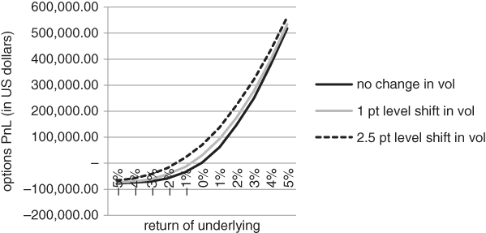
Figure 3.4 Sensitivity of Bund calls to changes in volatility

For the sake of concreteness, we have focused on German Bund futures options in Figure 3.4. A call option on any underlying would have the same qualitative payout profile.

Since the payout profile of a call or put is going to converge to a piecewise linear function at maturity, it needs to become increasingly curved at the strike  along the way. Note that a piecewise linear function is just a collection of straight lines glued together.

The non-linear payout creates some complexity. An option can respond in a variety of ways to small changes in , depending on where  is relative to . If  is far below , a call will display almost no sensitivity to the spot. The payout curve is simply too flat there. On the other hand, if  is far above , the call will move nearly in tandem with the underlying price. Later, we will discover that the variable exposure in an option can cause the dynamics of a hedging structure to change quite dramatically over time. We need to understand the chameleon-like characteristics of basic or “plain vanilla” options before we can come to grips with more complicated hedging structures.

The way that a fixed option responds to changes in price and time to maturity can be highly variable. How can we quantify the amount an option will move if we perturb ,  or other factors that might determine the price of an option? Perturbing  means that we are only moving it by a small amount. It's a mathematical term with far ranging implications. If you slightly change the parameters in a system, does it matter? The direct approach to perturbation analysis involves calculating the so-called “Greeks”. The Greeks locally measure the sensitivity of an option to various factors. For larger moves in the spot or another quantity, option prices can move far more than the commonly used Greeks would predict. Assume that we have a formula for pricing calls and puts. Later in this chapter, we will introduce the Black–Scholes pricing model, but any formula will do for now. If we use a different convention from the market, our Greeks might be different from the market's, but they will still be well-defined. If we want to estimate sensitivity to , we just perturb  then re-price the option to calculate the slope of the payout curve at . This tells us how much our call is likely to move for a small change in the price of the underlying. This slope is called the option delta, in particular, .  is the size of the perturbation. Mathematicians like to supply emotional content to seemingly dry functions and equations and we take their lead here. The reason that Δ is unambiguously defined is that C is “well-behaved” as a function of S, at least until maturity. The slope of C as a function of S never blows up, no matter how small  might be. Analogously, we can estimate C's sensitivity to σ. We have already seen that puts and calls benefit from confusion, disorder and uncertainty and quantify this notion below. σ, the volatility of S that is agreed upon by the market, compresses these diverse notions of risk into a single number. If we rewrite C(S) as C(S, σ), we can define vega by perturbing σ for fixed S, then calculating the slope. Theta, θ, refers to the time decay of an option. It is formally defined as  for a call and  for a put. The convention is to set dt equal to 1 day, so that θ measures how much you will lose in a day if nothing happens. For most options, delta, vega and theta play a significant role. At the extremes, other Greeks can come into play. Close to maturity, gamma can play a large role. Gamma, γ, is sometimes called the “delta of delta”, as it measures the degree to which delta changes for a small change in the spot. In particular, .

If γ is small, the payout function is locally quite straight. Risk varies almost linearly as a function of the spot price. Conversely, the profit/loss in a high gamma option can change quite dramatically as the spot moves. Short-dated options that are close to ATM have relatively high gamma, as we can see in Figure 3.5.
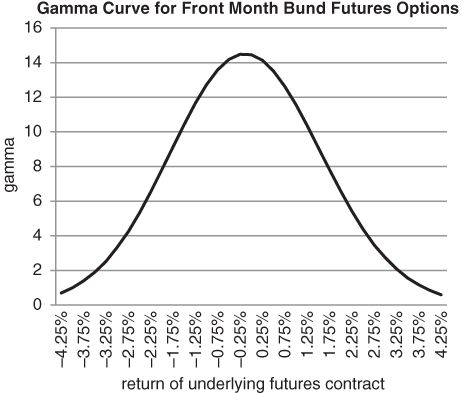
Figure 3.5 Bell-shaped gamma curve as a function of underlying return

As time to maturity increases, the importance of gamma diminishes. Long-dated options have fairly flat payout profiles across all spot values. Rho, ρ, takes the place of γ as a significant Greek. Specifically, ρ measures the sensitivity of an option to changes in the discount rate.

The reader may wonder why we have made no mention of other higher order Greeks, such as volga (the sensitivity of vega to small changes in implied volatility). Since we are only dealing with combinations of calls and puts in this book, most of the higher order Greeks are tiny. We are avoiding bank creations such as barrier and knock options, where there can be a discrete jump in the payout at maturity. From a hedging perspective, we don't need to have a very precise handle on the Greeks. We only require that our hedging structures have enough kick for a large move in the underlying.

An option is European style if you are only allowed to exercise at maturity. It's American style if you can exercise at any time up to and including maturity. This has nothing to do with where the option or underlying asset is based, e.g. options on German Bund futures have American style delivery. Stock indices and the VIX generally have European style exercise, while options on futures or individual stocks tend to be American. This is not entirely arbitrary. The cash settled options are the European ones. Otherwise, exchanges would have to issue official settlement prices for every index on a daily basis. The settlement prices would determine how much would be credited or taken away from a client's brokerage account. This would be cumbersome and subject to manipulation. There is also the question of valuation. At first sight, it seems reasonable that an American call or put should be worth more than a European one with the same strike and time to maturity. You have the freedom to exercise whenever you want. This “optionality” should be worth something. In other financial contexts, it generally is. For example, Silber (1991) has estimated that a restricted stock should trade at a roughly 50 basis point per annum discount to an equivalent stock that can be traded freely.

Here, it turns out that (in the absence of dividends or other technical factors) the American exercise feature is generally worthless. Imagine that you own an American style call that is in the money, i.e. . You could exercise the call if you wanted to, receiving  after selling the stock back into the market. The trouble with this strategy is that the call should be worth more than  at the time of exercise. The position is equivalent to a long position in the spot, with a purchase price of X, combined with a long put struck at X. Since the embedded put has positive value, you would be well served to sell the call back into the market rather than exercising the option.

## WHY BUY A CALL OR PUT?

“Why” can be a dangerous question to ask in many contexts, but is an important one here. There are numerous reasons to buy a call or put, with varying degrees of sophistication. The most basic reason to buy an option is that you have to. You either need to block out unpalatable scenarios in your core portfolio or you want to add a new position, but are unable take on too much additional risk. Buying puts on the S&P 500 to protect against further losses in a traditional equity portfolio is a forced move. You want to maintain your existing portfolio but need to hedge against disaster. Buying puts on the target stock in a potential merger, on the assumption that the deal won't go through, is something entirely different. Here, you want concentrated exposure to a low-probability event. If the deal goes through, you only lose the premium you have paid. On the other hand, if the deal breaks, the stock will probably crater. You might then make many multiples of the original premium paid. In these cases, you might not worry or even know whether the puts are overpriced at the time of purchase. All you care about are the payouts under various scenarios.

This can create opportunities for volatility arbitrage traders, who are always sniffing around for mispriced options. Volatility is their currency, not price. If they find something, they will try to extract a profit from the discrepancy between an option and some combination of other options and the underlying asset. Another reason to buy an outright call or put is to express a hybrid view on direction and volatility. You might be able to harvest a bit more alpha by trading an option rather than the underlying. Let's say you want to generate long exposure to emerging market equities. The most liquid instrument available is an emerging markets ETF. You could buy the ETF, buy a call or sell a put. When you buy a call, your potential profit is unbounded but a move needs to occur reasonably quickly. As time passes, the call gradually loses value. Selling a put requires less conviction but an equal dose of courage. If markets stabilise, the short put strategy is likely to perform well. You are betting that any sell-off is going to be more than compensated by the premium you have collected. However, if the price of the ETF crashes through your put strike, you are left with a fully exposed long position. Buying a call is a punchier play, predicated on the idea that the market has underpriced the probability of a large upside move. However, if nothing happens, you lose the premium paid. Buying a put can be a defensive or speculative bear market play. A speculative downside put can be statistical in nature, even if it's not a relative value play. You are simply arguing that the market has underpriced the probability of a move toward the downside strike. If you are really bullish, you can buy a call and sell a put. This structure is usually called a risk reversal. Since a long call and short put both have positive delta, the risk in each leg compounds the risk in the other. Figure 3.6 shows a payout for a risk reversal. Since we have sold an OTM put and bought an OTM call, the strikes are spaced apart. As we push the put and call strikes closer together, the structure converges to a forward contract.
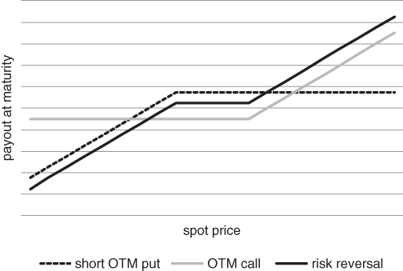
Figure 3.6 Construction of a split-strike risk reversal

Figure 3.7 refers to a split-strike risk reversal on the iShares MSCI Brazil ETF. We sold 1,000 puts and bought 1,000 calls on March 8, 2016 and wanted to get a handle on the payout curve roughly 3 months thereafter. The curve evolves from a nearly linear shape (with delta close to 0.5 ) to one that is fairly flat in the middle.
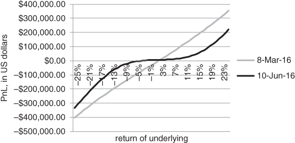
Figure 3.7 Evolving payout of a risk reversal on the iShares MSCI Brazil ETF

Suppose there is a persistent put skew in the market you are trading. Put skews are characteristic of risky assets, such as equity indices, based on asymmetry in the underlying return distribution and excess demand for hedging downside risk. “Risky assets” have a positive expected return over the long term (at least according to theory), but may be exposed to large negative downside surprises. When there are more large negative surprises than positive ones, the underlying distribution is said to be skewed to the downside. You then collect premium if the put and call strikes are the same distance from the ATM strike. In other words, you get paid up front to hold the structure. Alternatively, you can construct costless risk reversals where the put strike is considerably further away from the money than the call strike. By “costless”, we mean that you collect the same amount of premium from the put as you pay for the call. In the limiting case where the call and put have the same strike, you have effectively bought a forward contract. Your position will move contiguously with the underlying price and is insensitive to changes in volatility. It turns out that vega in the put cancels out the vega in the call. The put–call parity formula shows that buying a call and selling a put with the same strike and maturity generates a structure that is linear in . Namely, if  and  are calls and puts with the same strike and time to maturity, then
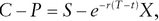<math xmlns="http://www.w3.org/1998/Math/MathML" display="block" overflow="scroll"><mrow><mi>C</mi><mo>&#x02212;</mo><mi>P</mi><mo>=</mo><mi>S</mi><mo>&#x02212;</mo><msup><mrow><mi>e</mi></mrow><mrow><mrow><mo>&#x02212;</mo><mi>r</mi><mo>(</mo><mi>T</mi><mo>&#x02212;</mo><mi>t</mi><mo>)</mo></mrow></mrow></msup><mi>X</mi><mtext>,</mtext></mrow></math>
where  and  are the spot price of the underlying asset, the discount rate and the strike, respectively. We can rewrite the formula as
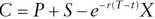<math xmlns="http://www.w3.org/1998/Math/MathML" display="block" overflow="scroll"><mrow><mi>C</mi><mo>=</mo><mi>P</mi><mo>+</mo><mi>S</mi><mo>&#x02212;</mo><msup><mrow><mi>e</mi></mrow><mrow><mrow><mo>&#x02212;</mo><mi>r</mi><mo>(</mo><mi>T</mi><mo>&#x02212;</mo><mi>t</mi><mo>)</mo></mrow></mrow></msup><mi>X</mi></mrow></math>
Since the current price  and  don't depend on the volatility of , we can essentially create a forward with a long call and short put (i.e. risk reversal) structure. Whenever there is a liquid futures contract, there is probably no point in buying a call and selling a put with the same strike. Given the proliferation of options on ETFs that have no equivalent futures, however, there are many cases where building a synthetic forward is a reasonable idea. The forward allows you to apply leverage as well as minimise interest and dividend income.

Forwards, as we know, are “delta one” instruments. There is no kink in the payout curve, hence vega is always 0. Whenever there is a liquid futures contract, there is probably no point in buying a call and selling a put with the same strike. Given the proliferation of options on ETFs that have no equivalent futures, however, there are many cases where building a synthetic forward is a reasonable idea. The forward allows you to apply leverage as well as minimise interest and dividend income.

Once we move beyond these basic structures, we can create a diverse range of hedging structures by mixing options with different strikes and times to maturity. However, we need to have some notion of relative value before we can decide which structures look promising. We need some way to place all of the available options on a single underlying on an equal footing. This motivates our discussion of the Black–Scholes equation in the next section.

For now, it is probably worth reviewing the concept of “money-ness” for an option. We will repeatedly use the acronyms ATM, ITM and OTM in what follows and need to specify what these mean. A call or put is at-the-money, or ATM, if the spot price roughly matches the strike. Why do we use the word “roughly” in a definition? There is some ambiguity when defining money-ness. One approach is to say that the ATM option strike exactly matches the spot price. But what if we are dealing with an option on a futures contract? The Black 76 formula prices calls and puts using the current futures price. This suggests the alternative that an ATM option's strike should match the equivalent maturity forward. A third definition, which closely matches the forward price one, specifies that the strike whose delta is closest in magnitude to 0.50 is at-the-money. Once we have decided what we mean by an ATM option, out-of-the-money OTM and in-the-money options follow naturally. OTM calls have a strike higher than the ATM strike and OTM puts have a lower strike. Generally speaking, OTM options have no intrinsic value. They would expire worthless if the maturity date were today.

## THE BLACK–SCHOLES EQUATION AND IMPLIED VOLATILITY

In 1973, Fischer Black and Myron Scholes published a landmark paper called “The Pricing of Options and Corporate Liabilities”. The paper appeared in the Journal of Political Economy (1973) , of all places. They derived a partial differential equation for the value of a “warrant”, or call option, using two different approaches. One approach relied upon replicating the option using a dynamic hedging strategy. The other applied the Capital Asset Pricing Model (CAPM) to map risk onto expected return. As it turned out, this equation was solvable, leading to the Black–Scholes formula. Black was able to draw upon his technical background and identify the equation as one that models the diffusion of heat through a metal rod.

Countless books and articles have analysed the Black–Scholes equation from a mathematical and historical perspective and we will make no effort to reinvent the wheel. We simply point the reader to the original paper and Mehrling's fascinating biography of Fischer Black (2005) for further details. Haug (2009) is also worth consulting, for an alternative history of option pricing. Specifically, the price of a European call option is given by
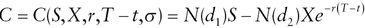<math xmlns="http://www.w3.org/1998/Math/MathML" display="inline" overflow="scroll"><mrow><mi>C</mi><mo>=</mo><mi>C</mi><mo>(</mo><mi>S</mi><mo>,</mo><mtext>&#x0200A;</mtext><mi>X</mi><mo>,</mo><mtext>&#x0200A;</mtext><mi>r</mi><mo>,</mo><mtext>&#x0200A;</mtext><mi>T</mi><mo>&#x02212;</mo><mi>t</mi><mo>,</mo><mtext>&#x0200A;</mtext><mi>&#x30c3;</mi><mo>)</mo><mtext>&#x02002;</mtext><mo>=</mo><mi>N</mi><mo>(</mo><msub><mrow><mi>d</mi></mrow><mrow><mn>1</mn></mrow></msub><mo>)</mo><mi>S</mi><mo>&#x02212;</mo><mi>N</mi><mo>(</mo><msub><mrow><mi>d</mi></mrow><mrow><mn>2</mn></mrow></msub><mo>)</mo><mi>X</mi><msup><mrow><mi>e</mi></mrow><mrow><mrow><mo>&#x02212;</mo><mi>r</mi><mfenced open="(" close=")"><mrow><mrow><mi>T</mi><mo>&#x02212;</mo><mi>t</mi></mrow></mrow></mfenced></mrow></mrow></msup></mrow></math>, where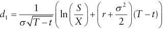<math xmlns="http://www.w3.org/1998/Math/MathML" display="block" overflow="scroll"><mrow><msub><mrow><mi>d</mi></mrow><mrow><mn>1</mn></mrow></msub><mo>=</mo><mfrac><mn>1</mn><mrow><mi>&#x30c3;</mi><msqrt><mrow><mi>T</mi><mo>&#x02212;</mo><mi>t</mi></mrow></msqrt></mrow></mfrac><mfenced open="(" close=")"><mrow><mrow><mo>ln</mo><mfenced open="(" close=")"><mrow><mrow><mfrac><mi>S</mi><mi>X</mi></mfrac></mrow></mrow></mfenced><mo>+</mo><mfenced open="(" close=")"><mrow><mrow><mi>r</mi><mo>+</mo><mfrac><mrow><msup><mrow><mi>&#x30c3;</mi></mrow><mrow><mn>2</mn></mrow></msup></mrow><mn>2</mn></mfrac></mrow></mrow></mfenced><mo>(</mo><mi>T</mi><mo>&#x02212;</mo><mi>t</mi><mo>)</mo></mrow></mrow></mfenced></mrow></math>
and .

Here,  gives the probability that a normally distributed random variable is less than  and takes values between 0 and 1. Recall that a European option can only be exercised at maturity. Options with more complicated features usually can't be priced using a simple analytic formula.

We call the reader's attention to a comment about the formula in the original paper. (Note that the expected return on the stock does not appear in (the) equation. The option value as a function of the stock price is independent of the expected return on the stock.)

The comment almost looks like a throwaway, but it would be hard to overemphasise its importance. If  depended on the expected return  of , the Black–Scholes formula would contain two unobservable quantities, namely  and . Note that  and  have unambiguous market prices and X and  are explicitly defined by the option contract. They are all known precisely. Since  has no impact on , we can uniquely solve for  given a market price for . This allows us to view Black–Scholes as a powerful translation device, converting option prices into implied volatilities. Options with different strikes and maturities can be placed on an equal footing. German Bund futures, for example, have hundreds of listed options at any given point in time. The same is true for major equity indices, short rates, commodities and individual stocks. For each underlying asset, there is a multitude of different strikes and maturity dates. If we try to compare their prices, we will get hopelessly lost. So how do we specify which options might be relatively cheap and expensive? This is where the Black–Scholes formula comes to the rescue.

We observe that  and  are increasing in . All things being equal, the higher the volatility of an asset, the higher its option price. The reason for this is straightforward and has been touched upon previously. When we buy a call, our payout at maturity is . While there is lower bound on the payout, potential gains are unlimited. Our loss is capped at the premium we have paid. As volatility increases, the range of outcomes also increases. This raises the odds that  will be large and positive, implying that the expected value of  should go up. This means we can solve for σ uniquely given the market price of a call or put. In particular,  or  for a call and put, respectively. Volatility is a deterministic function of the option price, spot price, strike, risk-free rate and time to maturity. This allows us to compare options with different strikes and maturities in a sensible way. It is hard to develop a visceral feeling about the price of an option, i.e. what does it mean for a 1-month 2050 put on the S&P 500 to have a price of 25? How much of the price is intrinsic value, how much is premium and how does the premium scale as time increases? (Note that the intrinsic value of an option is the amount it would be worth if it expired today.)

However, if someone told you that the implied volatility of that put were 14 (really 14%, though volatility is usually quoted in percentage points), you would have something solid to go by. Is the implied volatility higher than 30 day trailing realised volatility? Is it much higher than ATM implied volatility? Where is it trading relative to 3-month implied volatility? These sorts of questions allow us to say something about the fair value of the 2050 put, in relative terms.

## THE IMPLIED VOLATILITY SKEW

When we use the Black–Scholes equation to convert the price of an option into an implied volatility, there is some model misspecification involved. Black–Scholes assumes that the volatility of the underlying asset is constant, i.e. independent of time and level. It prices options based on some kind of average volatility of the asset over the life of the option, with no regard as to where volatility is likely to be if the asset drops –20%. Yet, when we derive different implied volatilities for options with different strikes, we are contradicting the model by saying that volatility is level-dependent after all. Does this obviate the possibility of using the model at all? Most practitioners would argue not. As we discussed above, the model provides a powerful method for converting option prices into a quantity that we can understand and trade. Suppose that the S&P 500 is trading at 2100 and the implied volatility of the 3-month 1750 put is 10 points higher than for the 3-month ATM put. The market is warning us that volatility will go up quite dramatically if the index gets anywhere near 1750. We can think about this in another way. Investors are coming up with realistic OTM option prices by fudging the only unobservable quantity in the formula. It is only natural that financial engineers wanted to put this on a firmer foundation over time. What started as a back-of-the-envelope calculation has progressively become more sophisticated. The idea of converting option prices into forward risk estimates is encapsulated in the concept of local volatility. We will not cover local volatility in this book and point the reader in the direction of Gatheral(2006).

For our purposes, level-dependent volatility is important as a mechanism for generating fat tails in the return distribution. If volatility jumps whenever an index drops below a threshold, the probability of even larger moves from that point will be greater than a normal distribution might predict. This may be related to contagion effects in the market, which we explore in Chapter 8. Here, we make no effort to solve the so-called “inverse problem”, where we infer market expectations about volatility from the price of various options on the underlying. As crisis hedgers, we are not operating in the domain of accurate calibration and prediction, but in the world of survival. Precise relationships can break down when the market suddenly shifts into a risk-off phase.

## HEDGING SMALL MOVES

Suppose you have sold a call. The position is exposed to a sharp rise in the spot. You can hedge this risk in various ways. The same ideas apply if you've sold a put and the spot craters. There are two basic ways to manage risk if you have sold a put or a call. You can delta-hedge with the underlying asset or you can hedge the option with other options. In this section, we focus on delta hedging. Let's say you have sold an equity index put. For simplicity, the index doesn't pay any dividends and interest rates are 0. Then the put price P depends on the index price , the strike , the time to maturity  and the implied volatility . In other words, we can write  as . There's no reason to worry about how to price P for now. We can simply assume that the Black–Scholes formula is valid. It's then possible to calculate the delta of the put. The put delta tells you how much P is likely to move if the index S moves a bit. You can approximate the delta by repricing the put for a slightly different index value delta_S then calculating . In mathematical terms, you're calculating the partial derivative of P with respect to S. So if the put has a delta of –0.50 (traders would say this is a 50 delta put), you expect to lose 50 basis points if the index goes up by 1%. The delta of a put ranges from –1 to 0 and the delta of a call falls in the range from 0 to 1. Practitioners usually multiply by 100 when they tell you what the delta of an option might be. For example, a put with a delta of –0.50 would be called a “50 delta” put. It's clear that the delta must be negative, since we're dealing with a put. This implies that, for every 10 options you are short, you should be short 5 futures to immunise your position. On average, the profit from regular delta hedging should be dependent on the difference between the option's implied volatility at time of entry and the realised volatility of the asset. In theory, if you can consistently sell options at a higher volatility than the realised volatility of the underlying asset over the life of the option, you have the basis for a profitable strategy.

## DELTA HEDGING: THE IDEALISED CASE

Suppose that you lived in an alternative reality where asset returns had normal distributions and volatility stayed constant. This might be a rough approximation of the way markets operate, but can be wildly off at the worst possible times. Suppose asset prices were driven by a random number generator whose properties could be easily inferred. In other words, the return-generating “machine” operated according to strict rules. You could trade at no cost or market impact and prices vibrated continuously through time. Some academics might equate this to a situation where everything was efficiently priced, as any inefficiency would be instantly stamped out by investors. However, this is not a necessary assumption. Here, we assume that statistical mispricings might still crop up in the options markets from time to time. Suppose we found an option whose implied volatility was higher than the constant realised volatility of the underlying. This might occur if the historical volatility of an asset over some interval were higher than the “true” volatility of the asset, by random chance. In this case, implied volatility might be linked to the abnormally high volatility in the past and hence overpriced. We could then turn an almost certain profit by selling the option and delta hedging with the underlying. The underlying asset would typically move less than the option predicted. This implies that the net asset value (NAV) of the delta-hedging strategy would decay more slowly than the premium in the option. It all sounds a bit fancy, so let's take a concrete example. The example is quite extreme, to illustrate the delta hedging concept. Suppose we have a 1-year call option on a stock. The call trades at a fixed 20% volatility, but the stock's realised volatility is a constant 10%. This is a mouth-watering opportunity, so long as the stock doesn't start going crazy. The stock is trading at 100, the call has strike 100 and interest rates are 0.

In Figure 3.8, we track the value of the call against the value of the replicating portfolio over time. Our strategy relies upon selling the call and delta hedging with the stock. In our example, we receive about 8 for selling the call and have to pay roughly 0.55*100 for the shares. Note that 0.55 is the call delta at the moment of sale. This implies we have to borrow roughly 47 from the bank to get the trade going. Over time, the borrow increases if we have to buy more shares and decreases if we sell them down. We can see that, for a representative path, the replicating portfolio decays much more slowly than the premium embedded in the call.
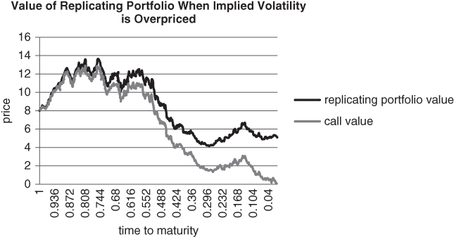
Figure 3.8 Extracting alpha from a call that is overpriced in implied volatility terms

When you sell and delta hedge a call, the largest net profits are realised when the call quickly burns off. This was illustrated in the example above. In this happy case, you quickly gain on the call and subsequently don't have to hedge very much, as the call delta is now low. The delta burns off to the extent that hedging is unnecessary after a while. For a short put that is delta hedged, a rally in the spot is ideal. The less aggressively you need to hedge, the better.

When an option is as mispriced as this one, the odds of locking in a profit are very high. You have a huge margin of error. In Figure 3.9, we simulate the performance of the replicating portfolio, short call strategy over a deliberately small number of paths. The terms are the same as in the example above. The graph tracks average profit as a percentage of the initial option price. After only 10 (!) simulations, our average profit evolves according to a very smooth line. If implied volatility is overpriced and the basic assumptions of replication remain intact, selling then delta hedging options should be an overwhelmingly successful strategy (see Figure 3.10). As we will find out, however, those can be giant “ifs”.
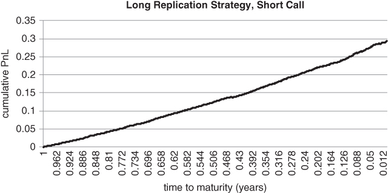
Figure 3.9 Arbitrage at its finest when implied volatility is severely mispriced
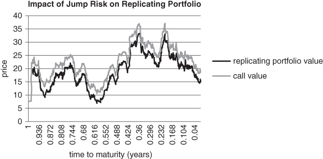
Figure 3.10 Impact of jumps on P&L

## PRACTICAL LIMITS OF DELTA HEDGING

Once we loosen our assumptions a bit, it becomes harder to delta hedge with accuracy. We can't just sell options that appear to be overpriced and expect to hedge away all of the price risk in the underlying. Changes in volatility, discrete jumps and variations in price dynamics according to timescale will eventually lay siege to our plans. Physical time may appear to move continuously forward, at a constant rate. However, financial data appears discretely and prices can jump discontinuously (i.e. more than one tick) from one time stamp to the next. Some people equate high volatility to a “fast market” and this description feels about right. Fast markets truly give one a feeling of vertigo, like a roller coaster at the local theme park. When lots of transactions are occurring per unit interval, the perception is that time is actually whizzing along faster than normal. Ané and Geman (2000) have introduced the notion of a stochastic transaction clock to account for this phenomenon. When lots of transactions are hitting the wires, a fixed unit of time can contain an unusual amount of activity. By rescaling time, they are able to transform fat-tailed distributions into more normal looking ones.

Let's revert from a paradigm that vaguely resembles Einstein's theory of special relativity back to standard clock time. Even if we haven't observed a six standard deviation drop in the recent past, the risk of such a move is always lurking beneath the surface. These moves are of great significance, even if they sometimes reverse themselves over time. To an options trader, intraday mega-moves can threaten survival. We can't quietly edit out moments where there is “blood on the streets”. Price jumps are a vital part of the signal and, over the long term, can be definitive. They are not products of measurement error, analogous to noisy patches on a digital image that need to be smoothed out. A small number of very large moves can have a surprisingly large impact on returns over a long horizon. If, for example, we remove the largest 10 down days for the cash S&P 500 index since 1980 as shown in Figure 3.11, the annualised return of the index goes from 8.26% to 11.17%.
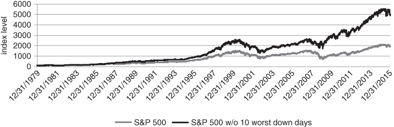
Figure 3.11 Impact of removing 10 largest down days from cumulative S&P performance

This is quite a remarkable statistic, as these down days only account for 0.11% of all trading days over the entire period! The index might eventually retrace to where it was before the devastating down move, but the damage has been done. Our delta hedging strategy would have been forced into the market, selling the underlying near the low then covering at the original level. In the following example, we show how a single price spike can ruin a delta hedging strategy. We return to the 100 strike call example, with a few modifications. Implied volatility (20%) is only slightly mispriced relative to realised volatility in the observable past. Realised volatility is set at 19%, so there is little margin for error. On average, we can extract alpha from the discrepancy in the idealised Gaussian world with no price impact or costs. However, a single price jump can ruin our plans. What is a “reasonable” price jump to consider? The black swan purists might argue that this is a silly question, with some justification. Once we depart from the world of normal distributions, spectacularly large moves are possible. Unreasonable looking moves can occur surprisingly often. In this section, however, we just want to show that it wouldn't take much of a jump to push the delta hedging strategy offside.

We start with an example that looks unremarkable from a long-range perspective. Financial historians are not likely to look upon October 2, 2015 as an extraordinary day and we have selected it for precisely that reason. The S&P returned +1.43%, which is less than a 1.5 standard deviation 1-day move. Returns of this magnitude should occur about 13% of the time for a normal distribution. These sorts of moves are quite common across equity indices, interest rates, currencies and commodities. Markets had been very turbulent in August and bearish in September. There was a great deal of anticipation for the US payrolls number released at 1:30 GMT. According to market convention, if not reality, this would be an important barometer of the health of the US economy and might also have a bearing on central bank policy. However, there have been many such moments of tension and anticipation in the past. The trouble is that, on an intra-day basis, they cannot be accurately hedged. If you were short a 1-month straddle and kept hitting the bid or offer in an attempt to hedge, there would be large gaps in your fills. If you delta-hedged once a minute, you would miss the move. If you hedged whenever the underlying moved by 0.5 standard deviations, you might only get filled at the tail end of the spike. In either case, your delta hedging profits would be dwarfed by continuous repricing of the short straddle.

Figures 3.12 and 3.13 rely upon two days of historical data, 1 October and 2 October, 2015. On 1 October, we calculate the standard deviation sigma of 1-minute returns from 7 am to 4:15 pm Eastern Standard Time. On 2 October, we take the same time window and divide each 1-minute return by yesterday's sigma. We have quantified each 1-minute return relative to a 1 standard deviation move on the previous day. The first graph shows 1-minute moves in sigma units for S&P 500 Emini futures.
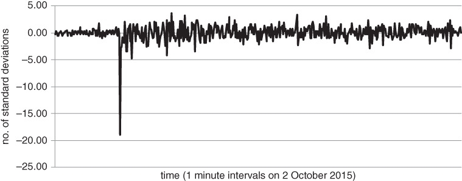
Figure 3.12 Normalised S&P 500 1-minute moves, 2 October 2015
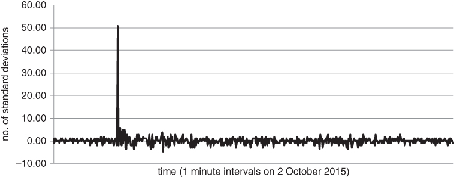
Figure 3.13 Normalised 1-minute moves for US 10 year note futures, 2 October 2015

The second shows normalised 1-minute moves for US 10 year Treasury note futures, over the same period. The scaling mechanism is the same as above.

## HEDGING OPTIONS WITH OTHER OPTIONS

It should be evident that delta hedging is not reliable when volatility changes or there are exaggerated jumps in the underlying asset. The problem compounds when we examine options that have outsized gamma or vega. Such options are highly sensitive to unexpected events. As the saying goes, very short-dated ATM options are “gammatastic”. They have lots of gamma. Near the strike, delta changes rapidly as a function of the spot price. This forces radical rebalancing of the delta hedge, especially if the spot jumps or oscillates wildly around the strike. At the other end of the spectrum, long-dated options are rich in vega. Changes in risk aversion levels can sometimes propagate far along the volatility term structure. If implied volatility increases, long-dated option prices can jump even if there is no material move in the spot. There is no direct way to hedge changes in implied volatility using the underlying alone. This is especially true when implied and realised volatility do not move in tandem. Does this mean that we should never short options that are very close to or very far from maturity? Not necessarily. We can protect against damaging losses without resorting to dynamic hedging. Haug and Taleb (2007) stridently argue that the most direct way to hedge options is with other options. This approach helps you to control all of your Greeks simultaneously. In some sense, it transcends the Greeks, as you can completely eliminate extreme event risk by hedging with options.

Once you sell a vanilla option, you are short gamma and vega. If you buy another option to hedge, some of your gamma and vega might cancel out. Suppose the S&P 500 is trading at 2000 and you want to sell a 1-week 1950 put. While delta might initially be low, it will increase at an accelerating rate if the spot comes anywhere close to 1950. This might force you to bail out of the trade. Alternatively, you could delta hedge the position aggressively, but this would leave you vulnerable to a sudden reversal in the spot. As we will see in Chapter 7, vicious reversals are common in declining markets. A prudent strategy, then, is to buy a lower strike put against the short 1950 put. You might, for example, buy the 1-week 1900 put to cover extreme downside risk. This caps your loss at 50*(contract multiplier), while obviating the need for dynamic hedging.

Once you cover the extreme risk in a structure, you can hold the structure indefinitely without worrying that you will be wiped out. Experienced options traders will affirm that it is easier to extract alpha from a trade you can hold on to. The example above allows you to collect premium with bounded risk. Trading spreads allows you to move away from continuous monitoring of delta, gamma, vega and other Greeks. You don't have to worry quite so much about the path taken by the underlying asset. What is more important is the payout achieved over a given horizon for a range of moves in S and sigma. The tail of the underlying return distribution is now irrelevant, as you have truncated it with the 1900 put. You simply need to decide whether the spread offers good value as a unit.

## PUT AND CALL SPREADS

Let's examine option spreads in more detail. They reduce the need for active delta hedging and represent an efficient way to express a targeted view. As above, suppose you think a particular asset is about to go up. This time, however, your conviction level is not quite so high. Rather than buying an outright call or selling an outright put, you can trade a spread. The spread gives you some directional exposure, but does not benefit fully from a large-scale move. To initiate a call spread, you buy a call with a given strike and sell another call with a higher strike. Selling the high strike reduces costs, but also caps your potential gain, as Figure 3.14 suggests. Selling a put spread has the opposite effect. When you buy a low strike put to cover another put that you have sold, you eat into the premium collected while putting a floor on your loss. In the US, put and call spreads are sometimes called “vertical spreads”. The name implies that you buy and sell options at different levels (i.e. strikes), while keeping time, the horizontal dimension, fixed. Call and put spreads can also arise as part of an active trading strategy. You could for example buy a put on a stock index and then sell a lower strike put if the index drops sharply. This allows you to lock in a profit by selling a rich put, while maintaining some level of protection. Conversely, if US 10 year note futures spike and you are short a call, you can buy a further out of the money call to cover your extreme risk. In this way, you can hang on to your original position, with the expectation of a reversal.
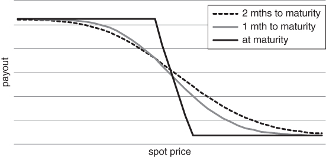
Figure 3.14 Evolution of payout curve for a put spread

In the diagrams below, we can see how the payout of a put spread varies as a function of the spot. The payout curve is initially quite shallow, but steepens dramatically between the strikes as we approach maturity.

## STRADDLES AND STRANGLES

In the previous pages, we have analysed structures that combine a view on volatility with a directional view. But what if we want to make a directionless volatility bet? Option straddles and strangles serve as an entry point into this space. To construct a straddle, you buy an ATM call and put with the same time to maturity. This structure has a symmetric “V” shaped payout profile, as in Figure 3.15.
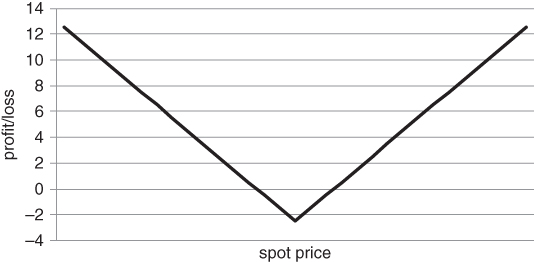
Figure 3.15 Profit/loss of a straddle at maturity

Whether you buy or sell a straddle, the position is initially delta neutral, i.e. the call and put deltas offset. For a moment, let's assume that you decide not to delta hedge the structure. Once the spot moves, the delta will move away from 0, as a function of gamma. If you buy an ATM straddle, you are initially delta neutral, with a long gamma profile. In Figure 3.16, we can see how gamma varies as a function of spot for a long straddle. We have based our calculations on an S&P 500 straddle with 30 days to maturity. As we converge on the maturity date, gamma blows up at the strike and approaches 0 elsewhere, with delta jumping to –1 or 1 for the tiniest of moves.
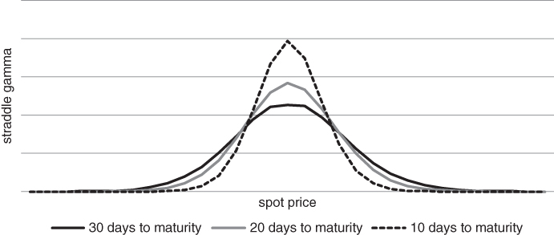
Figure 3.16 Evolution of gamma curve for a straddle, as time elapses

Gamma peaks at the ATM strike. If the spot initially rises, your delta becomes positive. This can generate material long exposure to the underlying asset. If it falls, you pick up negative deltas. As time passes, you start accumulating delta risk at an ever-increasing rate. Short-dated ATM straddles are packed with gamma, hence should not be shorted in a cavalier fashion. The curve looks a bit pointy at the ATM strike, but this is an artefact of our approximation scheme. Gamma should have roughly the same shape as the probability density function for the underlying asset. In a Black–Scholes world, the gamma profile has a Gaussian, “bell curve” profile.

We can think of things in another way, from the perspective of a straddle buyer. What you really want is a large move one way or another, as your delta-adjusted position size will accelerate in the direction of the move. As time passes, you need a progressively larger move in the spot to break even. This implies that, if you don't delta hedge a long straddle, you need to time your entry and exit points with precision. You can't wait forever for a move to take place. The problem is magnified for straddles that are relatively close to maturity, where theta is largest. Recall that theta is the time decay of an option. If you do decide to delta hedge, straddles transform into a play on the spread between implied and realised volatility. If implied volatility is lower than your forecast of realised volatility, you might buy and hedge a straddle. If it is higher, you might sell and hedge. Since implied volatility usually trades at a premium to realised volatility, selling straddles generally seems to be the more appealing strategy. There are hedge funds and proprietary trading firms that do exactly that. However, if they do not size their positions very conservatively or trade with great skill, they are always in danger of imminent ruin. As we have previously mentioned, large and unexpected jumps in the spot can overwhelm the theoretical edge in a short option position.

Strangles are the close cousins of straddles. You also buy one call and put per strangle. However, for a strangle, the strikes are spaced apart. In particular, you buy a low strike put and a high strike call to construct a long strangle, as in Figure 3.17.
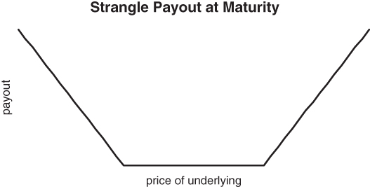
Figure 3.17 The “strangler” at maturity

There are a number of reasons to split the strikes and it turns out that some reasons are better than others. Relative to a long straddle, long strangles require relatively low premium outlay. As you push the strikes away from the spot, the cost of each leg in the strangle decreases. Conversely, short strangles can offer value when the implied volatility skew is strongly convex (i.e. when OTM options trade at a significant premium to ATM ones in volatility terms). You then have the opportunity to extract alpha from the relative mispricing of OTM options as well as from high levels of ATM implied volatility. There is another rationale for shorting strangles, although we would recommend against it. Some investors choose to sell strangles rather than straddles in order to “give themselves space”. The strangle delta isn't very sensitive to small moves in the underlying, at least initially. This can give the illusion of safety in a potentially dangerous structure. While your break-even levels might be further away, you need to sell more strangles than straddles to collect the same amount of premium. You either have to settle for lower returns if nothing much happens or apply leverage to the structure, which increases extreme event risk. The concept of giving yourself space would only be appropriate if you knew that there would never be a large move to one side or another during the life of the option. The market does not offer such guarantees. During extreme conditions, the spot can easily crash through one of your strangle strikes, creating more open-ended risk than if you had sold a smaller number of straddles. The payout curve is nice and flat, suggesting that you should make a nearly constant positive return over a wide range of scenarios. However, danger is always around the corner if the structure is not properly attended to.

As we will see in Chapter 4, a wide range of more complex structures also have unbounded risk. By unbounded risk, we mean that there is no nearby limit as to how much you can lose. These include ladders and ratio spreads and may require active delta hedging beyond a threshold. Assuming that you have cut off the extreme downside, however, you can load a position without much active intervention. Sometimes the safe, lazy sod approach is best.

## THE DEFORMABLE SHEET

Experienced options traders are able to conceptualise how a given change in short-term ATM volatility will propagate across different strikes and maturities. In our opinion, this is neither voodoo nor special talent, but a learnable skill. The volatility surface moves according to somewhat predictable patterns. Different parts of the surface usually move for logical reasons. For the purposes of hedging, we need to pay particular attention to the “wings”, i.e. low delta calls and puts. In this section, we will briefly describe how the option chain for an asset can be converted into a volatility surface. Note that an option chain is the set of all listed options on a given asset at some point in time. The chain spans different strikes and maturities. We then analyse likely moves at the extremes of the surface conditional on changes in ATM volatility. Whenever an option has a reasonable bid and ask price, we can apply the Black–Scholes transformation to the mid price, converting prices into implied volatilities. The mid price of an asset is simply the average of its bid and ask prices. We wind up with an implied volatility grid, with a value for each strike and time to maturity. After interpolating between points on the grid, we can create an implied volatility surface as in Figure 3.18.
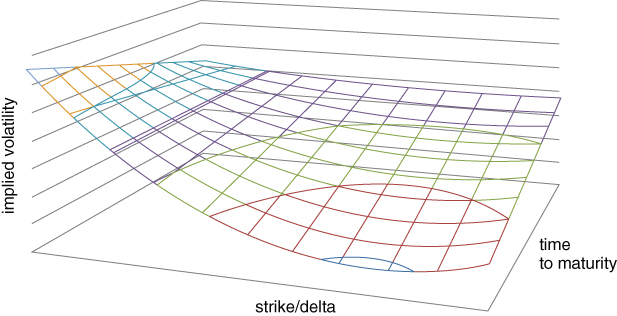
Figure 3.18 Qualitative depiction of an implied volatility surface

It is not necessary to define moneyness by strike. In the analysis that follows, we will usually focus on how implied volatility varies as a function of delta. This allows us to adjust for movements in the spot price and volatility over time. There is an ongoing debate over how to model the volatility surface as a function of changes in the spot. We refer the reader to Zou (1999) for further details. In this section, we take a more coarse-grained approach to understanding how the skew might respond to large-scale market moves. The implied volatility surface is difficult to grasp, as it contains so much information. When we start to think about dynamics, the situation gets even worse. There are lots of option prices buzzing around. However, we can sometimes reduce the dimensionality of the problem. If we move one point on the surface a bit, how much should the rest of the surface be expected to move? This is not a purely theoretical question in the context of hedging. In particular, we want to focus on flash points, regions on the surface where volatility is likely to go up the most.

Before looking at dynamics, we can simplify things by looking at static cross sections of the surface. If we focus only on ATM options, we can slice the surface along the y axis. This gives us a curve called the “term structure” of volatility. The term structure reflects market expectations of future volatility over different time horizons. If there is a risk event, short-dated volatility tends to explode, while the rest of the curve moves more modestly. The market is assuming that the event will have diminishing importance over time and prices mean reversion along the curve. Exaggerated moves at the short end can cause the term structure to invert. In Figure 3.19, we focus on S&P 500 options and calculate the beta of changes in ATM option implied volatility for different maturities to changes in 3-month ATM implied volatility. By construction, the beta of changes in 3-month ATM volatility to itself is 1.
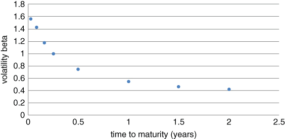
Figure 3.19 Variable response of term structure to changes in 3-month implied volatility

If nothing happens after a spike in volatility, short-dated volatility will decline more rapidly than volatility over longer maturities. This is the reverse scenario of what we discussed above. The volatility beta at the short end is relatively high, causing exaggerated movements relative to 3-month volatility. Eventually, the term structure will revert to a more typical, upward sloping shape. Inverted term structures are relatively rare, as bursts in volatility tend to occur infrequently. Bull markets tend to have longer duration than bear markets. However, during prolonged sell-offs, such as in 2008, the curve can remain inverted for quite some time. In summary, short-dated volatility is the dog that wags the long-dated volatility tail. Skew dynamics are more complicated than term structure dynamics, as they are asset dependent. Risky assets, such as equity indices and carry currencies, tend to develop an exaggerated put skew after a market sell-off. Investors are clamouring for downside protection. Other assets can exhibit more complicated dynamics, depending on how the market is positioned and where the need for protection is highest. We examine some of these issues in the next section.

In practice, however, out of the money (OTM) puts and calls are used to construct the matrix. OTM options are generally more liquid, with tighter bid ask spreads. This leads to a more precise implied volatility calculation. OTM option implied volatilities are also easier to calculate in a whippy market, given that their delta is relatively low. As the price of the underlying fluctuates, bid ask spreads for ITM options may not adjust synchronously, causing distortions in implied volatility.

The implied volatility matrix, calculated from OTM options, can be visualised as a surface in three dimensions. The graph below offers a stylised example of an implied volatility surface. The skew is more pronounced for short-dated options and gradually levels out as the time to maturity increases. This is particularly true when we calculate implied volatility as a function of strike, rather than delta. Whereas a 10% OTM put with 1 year to maturity covers moderate downside scenarios, a 10% OTM option with 1 week to go only protects the far left tail. We are effectively looking much further out along the skew when calculating implied volatility for the short-dated OTM put.

From the perspective of long-dated options, strikes that are a fixed distance apart become more similar (in a probabilistic sense) as time to maturity grows. Therefore, the far end of the surface should have a relatively flat skew. In the next section, we give the surface free rein to move, and examine how the put skew for risky assets expands when fear enters the market.

## SKEW DYNAMICS FOR RISKY ASSETS

Risky assets, such as equity indices and high yielding currencies, tend to have a put skew. Implied volatility is higher for OTM puts than at-the-money ones. After a drop in the underlying, the put skew tends to steepen, as there is excess demand for disaster insurance. All of this implies that we need to take skew dynamics into account if we want to hedge efficiently.

Figure 3.20 gives a snapshot of the implied volatility skew for Australian Dollar futures in late May, 2016. It is representative of the skew for a risky asset under “normal” market conditions. We constructed the skew using OTM calls and puts with roughly 45 days to maturity. In particular, the implied volatility at each strike was derived from an average of the bid and ask price, using the Black 76 formula. The at-the-money strike was 72. To the left of the ATM strike, volatility rises quite rapidly. This suggests that the market was assigning a fairly high probability to a sharp drop in the currency.
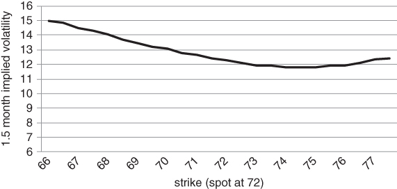
Figure 3.20 Implied volatility skew for a risky currency

There are a couple of reasons why low delta puts have relatively high implied volatility. On the one hand, risky assets tend to be negatively skewed. The underlying return distribution is more likely to surprise to the downside than to the upside. On the other, there tends to be more structural demand for downside protection. Most investors have a long bias toward risky assets and use options to truncate the distribution of losses in their core portfolios.

Risky assets have more straightforward skew dynamics than squirrely things like Treasury bonds. They typically have a put skew that becomes steeper as volatility increases. The AUD/USD cross certainly qualifies as a risky asset. The Aussie has historically offered high yield, in exchange for commodity and China risk. In Figure 3.21, we track the 25 delta risk reversal (RR) for the Aussie, relative to the US dollar. Here, the 25 delta RR is defined as the difference between implied volatility for the 25 delta call and put. This quantity is related to the eponymous options structure we described in Chapter 3. For the S&P 500, you might sell a 25 delta put and buy a 25 delta call if the put skew is particularly steep.
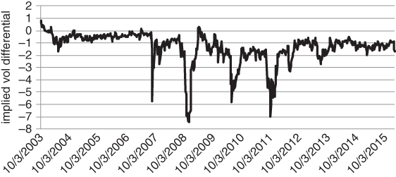
Figure 3.21 Negative skewness in the Aussie 25 delta risk reversal

The dynamics above are quite intuitive. Whenever there is a risk event, the risk reversal drops sharply. Volatility soars across all strikes, with OTM put volatility rising by a disproportionate amount. In other words, the put skew has become elevated. The Aussie tends to plummet during a risk event, with investors nervously paying up for downside protection. Accordingly, we see sharp moves during October 2008, March 2010 and the 2011 European crisis. We also observe that the Aussie RR is nearly always negative. Buying the Aussie is a “yield hog” play. Many investors want a steady source of income. If nothing much happens, they collect. This implies that speculators are biased toward buying the currency and periodically need to buy puts to guard against disaster.

Conversely, if we fix the time to maturity and slice across different option deltas, we get something called the implied volatility skew. The skew is more difficult to characterise than the term structure, as its shape can vary quite dramatically across markets. Equity indices generally have a put skew, as sell-offs tend to be faster than rallies and there is more institutional demand for hedging long portfolios. It has been observed that the put skew became more prominent for equities after Black Monday in 1987. For sovereign bond markets, such as US treasuries, the situation is more complex. In Figure 3.22, we track the difference between 25 delta call and 25 delta put implied volatility over time, using 1-month US 10-year note futures options.
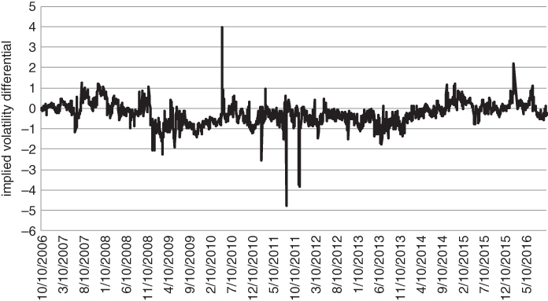
Figure 3.22 Unpredictable skew dynamics for US 10-year futures

Ex ante, you might expect there to be a persistent call skew, as treasuries tend to rally during a crisis. As it turns out, the US 10-year skew is a bit of a chameleon, flipping from a call skew to a put skew as risk aversion levels and inflation expectations change over time. When the major risks are inflationary, a put skew might develop. Rising inflation generally leads to rising yields. You can roughly decompose the yield on a bond into one component that measures inflation expectations and another that compensates an investor for bearing duration risk. Conversely, if the market is pricing tough times ahead, a call skew might develop.

## THE 1×2 RATIO SPREAD AND ITS RELATIVES

The first skew trade we will examine is the 1×2 ratio spread. This has two varieties, one for calls and one for puts. To construct a call ratio, you buy 1 call that is close to ATM and sell 2 higher strike calls against it. For a put ratio, you buy 1 close to ATM put and sell 2 lower strike calls against it. For example, you might buy 1 US 10-year call at 130 and sell 2 132 calls to build a call ratio. The maturities would generally be the same for both strikes. We will focus on put ratios for now, as they tend to be particularly interesting when analysing the equity index skew. Many traders love to buy 1×2 put ratios when the put skew becomes steep. Market convention dictates that you are long on the 1×2 when you buy the 1 to sell the 2. Suppose the S&P 500 drops sharply. Then, OTM put prices will become elevated, as hedgers enter the market. In all likelihood, the spread between OTM and ATM put implied volatility will increase. In Figure 3.23, we regress levels of the (OTM–ATM) implied volatility spread against the trailing 6-month return for the S&P 500.
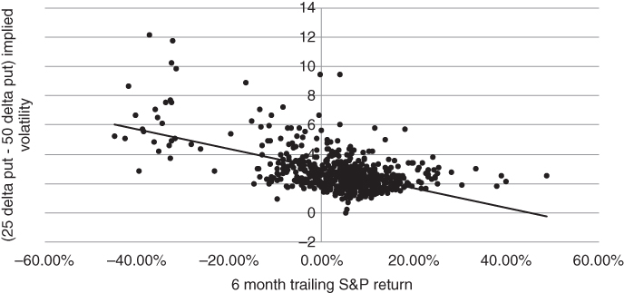
Figure 3.23 Dependence of S&P skew on 6-month trailing move

A direct way to mine the skew after a sell-off is to buy 1 ATM put and sell 2 OTM puts, while maintaining delta neutrality. For example, you might buy a 50 delta put and sell 2 25 delta ones when you initiate the ratio. The delta of the “combo” is 0, i.e. . This trade has some interesting properties that are not immediately obvious. In general, you are likely to be a net payer of premium when you enter the trade, yet the structure has positive time decay until you get close to maturity. How can this be possible? When you buy an outright put or call, paying premium implies that you are short theta. Every day that passes without incident, some of the premium erodes from your option. Here, the situation is more complex. If nothing much happens, the 2 25 delta puts will initially burn off faster than the single 50 delta one. You are also likely to benefit from a flattening of the skew if the spot hovers around its current level. This suggests that the passage of time will work in your favour until you get close to expiration. While it is true that you will abruptly become short theta close to expiration, the standard strategy is to roll out of the trade before that point. In the graph below, we show how the payout profile for a long  ratio spread evolves as a function of time. Our example is based on Euro Stoxx 50 puts. In particular, we have bought 100 of the 50/25 delta  put ratio with about 2 months to maturity. The payout curve is graphed as a function of spot on 3 different dates. The dotted line shows the payout at initiation. The grey “sweet spot” line reflects the time we plan to roll the structure, namely 2 weeks before maturity. Here, the range of positive outcomes is relatively large. For reference, the black line gives the payout at maturity. We have not included the extreme downside in Figure 3.24. However, the structure seems well positioned for a wide range of scenarios.
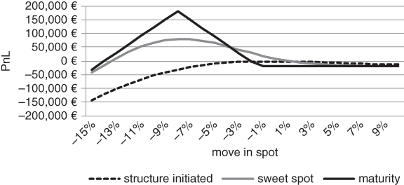
Figure 3.24 “Safe” zone for a long 1×2 put ratio

This is a nice-looking trade at some level, but can be fraught with danger. As we will see more acutely in the “Batman” trade section, the trouble is that 1×2 ratio spreads have large vega and extreme event risk. Your loss is essentially open-ended. The 1×2 above is initially delta neutral, as the individual legs cancel each other out for small moves. At first sight, it appears to make money for a wide range of moves in the underlying. However, if there is a severe sell-off, your position converges to a long position in the spot. You are potentially facing a large mark-to-market loss and your delta-adjusted position will have grown dramatically. We can see the embedded volatility risk in Figure 3.25. The graph compares the payout curve with 1 month to go in two scenarios. In the first, volatility remains constant. In the second, there is a parallel shift of 10 points in Euro Stoxx implied volatility. This is not an unusually large shock to the skew. If anything, it understates risk, as the skew is likely to steepen if volatility increases across the board. The window of profitability practically disappears and you are left waiting for a sharp drop in volatility before the next potential sell-off.
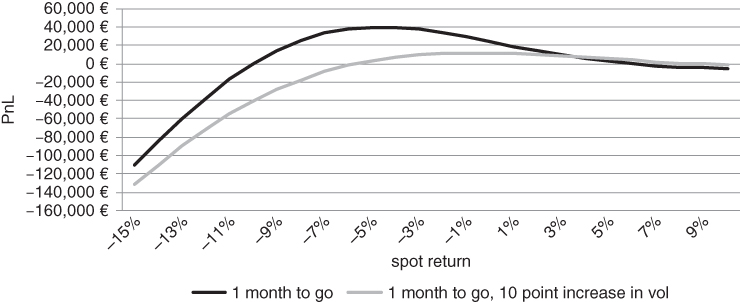
Figure 3.25 Sensitivity of 1×2 put ratio to a spike in volatility

It might be argued that you can defend against large moves in the S&P 500 because a circuit breaker will be triggered if the futures drop by a large amount. In theory, you could then hedge or exit the structure. This turns out to be a feeble argument. The reality is that options market makers might pull their quotes during a crash, leaving you with no idea as to where the  should be trading. Volatility may have increased to the point where your structure is severely off side. This brings us to an idea that we will explore later in the book. Since s seem innocuous but are fraught with danger, it might be worth thinking about shorting them. The fact that virtually no one else wants to should serve as encouragement. No one wants to be a plumber when they are young, yet it can be quite a stable and lucrative career. Given the lack of demand, the short  might be reasonably priced after all. Indeed, in Chapter 4, we will track the performance of a specific short  ratio spread and demonstrate its effectiveness as an extreme event hedge.

Put and call ladders are similar to ratios, except that you spread the short strikes apart. Rather than buying a 3-month 1×2 2000/1900 put ratio on the S&P 500, you might buy the 3-month 2000/1925/1850 put ladder. More precisely, you would buy 1 2000 put, sell 1 1925 put and sell 1 1850 put. This structure has three distinct legs instead of two, as you buy 1 2000 put and sell 1 1925 put and 1 1850 put against it. You might buy a ladder if you want to spread your short exposure across the skew, rather than focusing on a single strike. In Figure 3.26, we sketch the payout curve of the 2000/1925/1850 put ladder at various points in time.
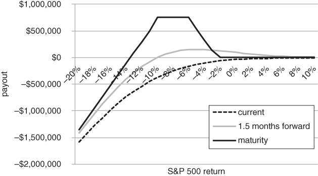
Figure 3.26 Put ladder payouts, expanded view

Conceptually, ratios and ladders are nearly identical and exposed to similar risks. They should be bought with appropriate caution.

## THE BATMAN TRADE

Some trades look pristine from one vantage point, yet very unsightly from another. The 2-sided ratio spread is an excellent example of such a trade. Some traders refer to it as a “Batman” structure, based on the shape of the payout at maturity.

While the Batman logo has changed over the years, Figure 3.27 resembles the original from 1940. The graph below involves buying a 100 strike straddle, while selling 2 95/105 strangles on an asset trading a 100. The structure requires an initial premium outlay and generates a positive payout for moderate up- and down moves.
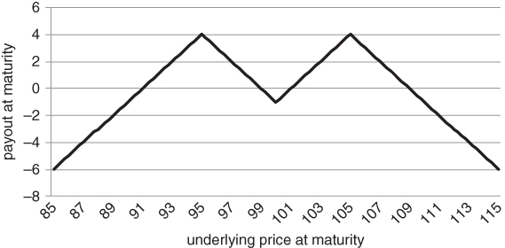
Figure 3.27 Payout of 2-sided ratio spread (Batman structure) at maturity

Let's analyse a concrete example. Suppose we initiated the Batman on November 2 2015, focusing on December 2015 futures options. We might buy a 2095 straddle and sell 2 2015/2145 strangles as a relative value play. The straddle/strangle combination can also be thought of as a pair of  ratio spreads. We are buying 1 2095 put, selling 2 2015 puts against it, buying 1 call and selling 2 2145 calls against the ATM call. We have chosen the OTM strikes to have roughly 25 delta at the point of trade entry. This ensures that the structure is initially delta neutral. As we will soon realise, the trade is sized aggressively. We have bought 100 straddles and sold 200 strangles on the S&P 500 E-mini futures contract per $1 million of equity. For moderate-sized moves, the payout on 10 December looks nice and flat. If anything, the trade seems bearish, as you make more if the index trickles down over a 5-week period.

Viewed through this lens, the trade appears to be a winner. Given intermediate returns in the [–6.50%, 4%] range, the expected return of the strategy is strongly positive as shown in Figure 3.28.
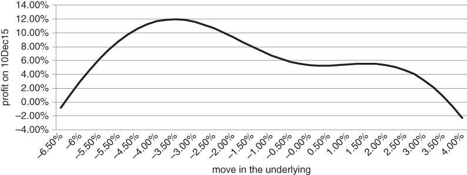
Figure 3.28 Profit/loss profile over a range of benign scenarios

Once we widen our perspective, however, the Batman trade looks far less attractive. Judging from Figure 3.29, potential gains are meagre relative to extreme event losses. The structure is “safer” than a naked straddle, as you have a bit of space to work with when hedging. However, it still has severe open-ended risk.
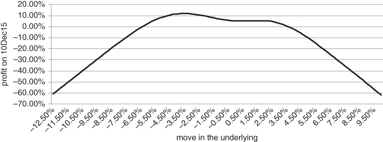
Figure 3.29 Batman payout: expanded view – the dark underbelly of ratio spreads

We observe that the Batman trade falls neatly into one of the categories outlined in Taleb's “Anti-Fragile”. The structure likes a bit of disorder, i.e. a certain amount of movement away from the middle strike. However, too much disorder is evidently destructive.

Now we can see the dangers lurking outside of our quiet little settlement. If we have a large balance sheet to support this sort of trade, we should be able to harvest a moderate amount of alpha over the long term. However, we can't push things too hard. The situation is analogous to covered call writing, which might be more familiar to the reader. Covered call writing is sometimes referred to as a “buy-write” strategy. This is a succinct description, as you buy an equity index and write a call against it. Writing is synonymous with selling in this context. Buy-write strategies have been served up as alpha generators for many years (Feldman, 2004). However, there is a limit as to how aggressively the call can be sold. Overwriting strategies make for fine back-tests but are not entirely safe. Suppose we own the S&P 500 (see Figure 3.30). We could, for instance, write 2% OTM calls against our long index position. This would allow us to collect some income each month, with limited participation in S&P rallies. In particular, we would capture premium from the short call and up to 2% from gains in the index. In a bear market, our open-ended risk would be the same as the index. However, we would expect to collect a relatively large amount of premium from the call, as implied volatility would be high. This would reduce a string of monthly losses by a small, but ever-increasing amount. The BXM index, which tracks the performance of this strategy, is widely quoted and has outperformed the S&P 500 on a risk-adjusted basis since inception.
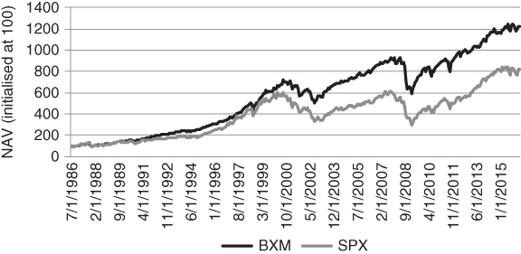
Figure 3.30 Performance of buy-write strategy relative to static long position in index

What is generating alpha in the buy-write? It must be the short call component, as our position is otherwise identical to the benchmark. The short call has negative correlation to the index, as its delta is always less than 0. It also benefits from the tendency of implied volatility to be an overpriced relative to realised volatility, in the absence of an extreme event. This leads to a thought. If the short call is responsible for all of the alpha, why don't we trade it on a stand-alone basis? While tempting, this idea is not a particularly good one. If we start a hedge fund that sells calls willy-nilly, we no longer get the diversification effect from owning the index. We also have to sell a large number of calls to achieve a decent return. In an environment where interest rates are close to 0, there is nowhere to hide. We don't receive any return for excess cash held at our prime broker. As a consequence, we will probably have to use substantial leverage if we want to produce a decent-looking nominal return. The trouble with this idea is that, if equities ramp up, our risks will escalate. We might be forced to buy back the calls at a significant loss. By contrast, if we were simply selling calls against a well-capitalised long position, our delta-adjusted risk would actually drop after a sharp index rally. We might underperform that month, but would have the firepower to reload the strategy indefinitely.

Let's move back to the Batman. Suppose that we only bought 10 Batman structures per $1 million of equity (scaling the trade down by a factor of 10). Then, we might be able to absorb the occasional large drawdown without having to react aggressively. However, this would only allow us to target a return of 50 to 60 basis points every time we loaded the structure. As soon as we force things, adding leverage in an attempt to boost returns, we are vulnerable to short-term price moves in the underlying.

## IMPLIED CORRELATION AND THE EQUITY INDEX SKEW

This book unashamedly has a macro bias, based on the author's background and investment philosophy. However, we try to redress the balance slightly here. We have spoken at length about equity index volatility while saying nothing about the volatility of the components of the index. This might seem strange at some fundamental level. Indices would not exist without the assets that underpin them. However, the evidence suggests that stocks move together at moments that matter the most.

A similar question arises in the analysis of fluid flows. Is a wave a collection of water molecules or an entity unto itself? Both modalities are correct and it depends on what you are trying to do. Since our goal is to hedge large-scale market moves, we can usually ignore the fact that equity indices are actually composed of individual stocks. As far as we are concerned, indices move in and of themselves. This idea also features Capital Asset Pricing Model (CAPM) and its various offshoots, where stock betas are calculated with reference to the “market”. The market proxy is usually a broad-based stock index, such as the MSCI World. In CAPM, the market is thought of as an exogenous variable, even though in practice it is nothing more than a weighted collection of stocks. So when we measure a stock's beta to the market, it's not obvious that the index is the independent variable.

In severe down markets, this ambiguity should not bother us too much. Systematic risk tends to dominate a stock's overall risk during a sell-off, as nearly everything moves down together. During liquidations, index futures tend to lead individual share moves, as large institutions need to rapidly adjust their aggregate exposures. As hedgers, we are trying to take advantage of those moments of panic when investors are indiscriminate and willing to buying insurance at virtually any price. So, from the standpoint of extreme event hedging, a macro perspective is appropriate. Individual stocks are the cart and indices the horse.

There are times, however, where an analysis of the index components is useful. In this section, we introduce the idea of conditional correlation and suggest how it impacts the shape of the index implied volatility skew. While indices typically have a skew, the components usually have a smile. Implied volatility picks up more quickly to the right of the ATM strike. Large positive moves are assigned a nearly equal probability to large negative ones if a stock is trending sharply up or in advance of a corporate event, such as an earnings report.

It might seem puzzling that the index skew has a radically different shape to an average of the component skews. How can we reconcile component smiles with an index skew? The answer lies in a somewhat nebulous quantity called conditional correlation. Let's consider the implied volatility of a 25 delta index put. Roughly speaking, its volatility should depend on the implied volatility of each 25 delta component put, the component weights and the expected average correlation of the components should the index go down to the 25 delta strike. The market assigns a progressively higher correlation to large down moves in the index. This amplifies the implied volatility of OTM index puts, while muting OTM call volatility.

The CBOE has created indices that track the “average” implied correlation of 50 representative stocks in the S&P 500 over two distinct horizons. Each trading day, two vintages are listed. Each corresponds to options that expire in January of the following year. The CBOE indices make the simplifying assumption that all pairwise correlations for the 50 stocks are equal. This allows them to solve for the index implied correlation exactly. Figure 3.31 explores the relationship between weekly S&P returns and percentage changes in implied correlation. We have focused on the January 2017 vintage, using weekly data from January 2015 to March 2016. Whenever the index takes a dive, the market ratchets up its estimate of pairwise stock correlations.
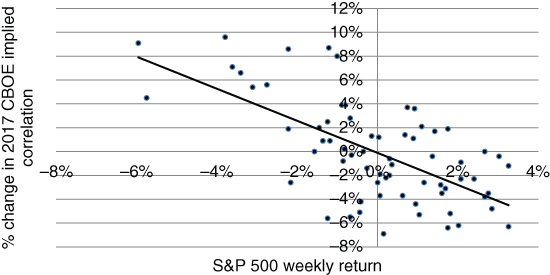
Figure 3.31 Implied correlation increases as the S&P declines

Advance/decline ratios can give us a rough idea of the underlying dynamics. These measure the number of components that have gone up in a given time period, relative to the number that went down. On severe down days, the advance/decline ratio tends to be very low. Nearly all stocks go down together. More generally, in bear markets, stock specific risk pales in comparison to the broader macro picture. Cross-correlations are high among the components in an index. Conversely, strong market rallies can be driven by a fairly slim majority of stocks. In 1999, the NASDAQ composite index returned an eye popping +85.6%. Astonishingly, half of the stocks in the index had an average return of –32%, with the remainder doubling! By this rough measure, the average pairwise correlation between components was low.

We can create a skew out of a set of component smiles directly, as in Figure 3.32. The example is a bit contrived, but illustrates our point. Suppose we have an index that only contains 2 stocks. The stocks have an equal index weight and an identical implied volatility smile. We use the word “smile” rather than skew, as volatility rises in both directions away from the ATM strike.
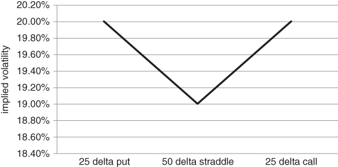
Figure 3.32 Symmetric “smile” for each stock in index

There is a correlation skew for the two assets, as in Figure 3.33. In practice, we would have to solve for the implied correlation at each index delta, based on the implied volatility of the index and each of the components. Here, however, we assume the correlation skew is known. This simplifies the exposition.
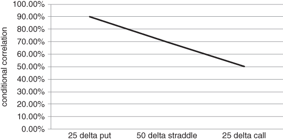
Figure 3.33 Hypothetical implied correlation skew

In Figure 3.34, the market is assigning progressively higher correlations to large downside moves. We can then apply the portfolio equation at each index delta, in an effort to approximate the index skew. In particular, assume that asset 1 has implied volatility σ_1 and asset 2 has implied volatility  are the index weights and ρ is the conditional correlation. Then the index implied volatility σ for a given delta satisfies .
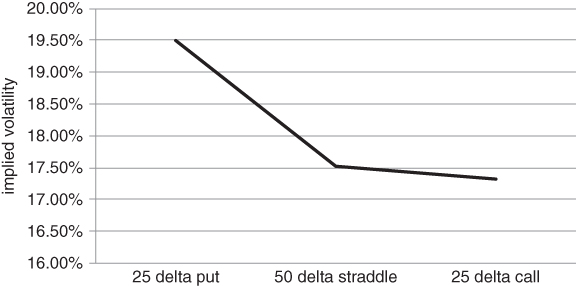
Figure 3.34 Component smiles mapped to index skew via implied correlation

Each of the stocks has a mild volatility smile, with a symmetric “V” shape around the ATM volatility. Yet the index skew is mildly downward sloping. If rho is large enough, the ATM cross product term  in the portfolio equation above can turn a collection of component call smiles into an index skew. Note that we have used the portfolio equation in a somewhat unorthodox way. In the example, we have assumed that there are actually three different portfolio equations, applying to different segments of the skew. This is theoretically “incorrect” in the same sort of way that the implied volatility skew violates the constant volatility assumption in Black–Scholes.

If there is a skew, the market is implying that the average correlation between the components in an index should be dependent on what the index has done recently. After a severe drop, instantaneous correlations should be higher than under normal circumstances. A similar line of reasoning applies to the implied volatility skew, namely, the skew predicts that instantaneous volatility will increase if the index drops. We can test our hypothesis by using the implied correlation indices published by the CBOE (see Figure 3.35). The series goes back to January 2007. We have spliced the CBOE data together to generate a single time series, moving from the front January to the next in mid-November of the previous year. It should be clear that the market assigns high cross-correlations during index sell-offs.
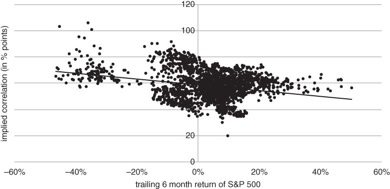
Figure 3.35 CBOE implied correlation skew conditioned on trailing return

Another important point relates to the madness of crowds during severe bear markets. In the upper left quadrant of the graph, there are several instances where the average implied correlation was above 100%! By definition, realised correlations can never exceed 100%, so this is a theoretical absurdity. Assuming that the CBOE's model is at least a reasonably close approximation of reality, this suggests that index options were severely and irrationally overpriced relative to component options during the dark days of 2008. Investors were insensitive to relationships between individual pairs of stocks. These were trivial concerns, as the struggle for survival was foremost in their minds.

## FROM RATIOS TO BUTTERFLIES

Hopefully, we have discouraged the reader from buying ratio spreads en masse and just hoping for the best. The airplane ticket trade mentality we described in Chapter 1 has a nasty tendency to end in tears. You can certainly buy a few, relative to the size of your balance sheet. However, if you want to “back up the truck” with skew trades, non-centred butterflies are preferable. A put fly is nothing more than a 1×2 put ratio with a further OTM put appended to it. This reduces some of the theta in the straight 1×2, but eliminates exposure to an extreme event. Your carry is reduced, but you have added a margin of safety to the structure. We sketch the payout at maturity for a symmetric put butterfly in Figure 3.36. The strikes of the hypothetical fly are equidistant.
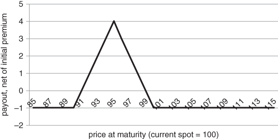
Figure 3.36 Hypothetical put fly, payout at maturity

In Figures 3.37 and 3.38, we examine how the cost of a fixed width put fly varies as a function of changes to the implied volatility skew. We start with the simplifying assumption that the skew is flat, i.e. implied volatility is independent of strike. The spot price is assumed to be 100. The fly is constructed with puts that have 30 days to maturity and strikes that are 0%, 5% and 10% out of the money, respectively. We can then price the fly over a range of implied volatilities. In the singular limit where volatility is 0%, the fly should be free, as each of the legs is worthless. This, however, is an uninteresting case, as frozen markets require no hedging. It's more interesting to examine how the cost of a put fly varies for a volatility range that you might actually encounter in practice.
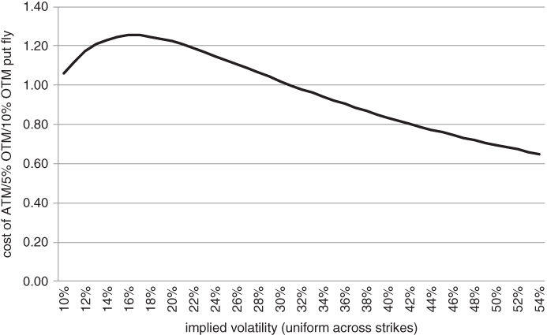
Figure 3.37 A defensive structure that actually cheapens when volatility increases
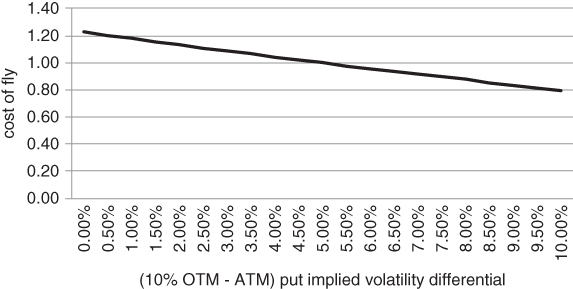
Figure 3.38 Impact of steepening skew on the cost of a put fly

In our example, after volatility crosses 16% or so, the cost of the fly gets cheaper as volatility increases. This implies that you can create mildly bearish structures that actually prefer high volatility at the point of initiation! While a put spread unequivocally becomes more expensive, a reasonably narrow-width fly actually cheapens as volatility rises. This may not seem obvious at first sight. After all, you are buying a very far OTM put to cover your risk and this put must be sensitive to the steepness of the skew. However, the far OTM put has relatively little vega. Moreover, the rate of decline in vega is quite rapid at the far OTM strike. If the middle strike is “close” enough, in volatility-adjusted terms, the fly will be net short volatility. Short vega in the middle strike more than offsets long vega at the near and far strikes. Over time, if the spot price doesn't move, vega picks up for the fixed-width fly and eventually becomes positive. Put flies are slow burning hedges. The middle strike starts to lose value and the fly transforms into a proper hedge. The nearby strike put dominates the structure. Near expiration, vega declines somewhat, as the nearby strike loses value. However, you still have a significant amount of protection. In the absence of an extreme down move, you are essentially long an ATM put. You can always unwind the bottom 2 strikes to ensure protection all the way down.

Flies also benefit (in terms of cost) from a steepening of the skew. We show this in the Figure 3.38, where the skew is assumed to depend linearly on strike. We have assumed that 5% OTM put implied volatility is always 20%. Next, we have perturbed ATM and 10% OTM put implied volatility by the same amount, though in opposite directions. For example, if the difference between 10% OTM and ATM volatility is 5%, 10% OTM, 5% OTM and ATM volatility would be 22.5%, 20% and 17.5%, respectively.

Next, we show the impact of a steepening put skew on the cost of the fixed-width fly described above. Our perturbation oversimplifies things a bit, but illustrates the main idea. Put flies cheapen as the slope of the skew becomes increasingly negative. In particular, we assume that the skew is a straight line and show the impact of varying slope on the cost of the fly. The average implied volatility across the 10%, 5% and 0% OTM put strikes remains constant as we vary the slope. In this way, we isolate the impact of steepening on the cost of the fly. We can see that the cost of the fly decreases as the skew steepens, even though the average implied volatility across all strikes has remained constant.

We demonstrate how the vega in a fixed-width put fly varies over time in Figure 3.39. The vega path is appealing in certain scenarios. Suppose you enter the fly after a sell-off. If the down move stalls for a bit, your put fly becomes progressively more defensive until 2 or 3 weeks to go. You have effectively got in on the sly and now have a fairly potent hedge in place.
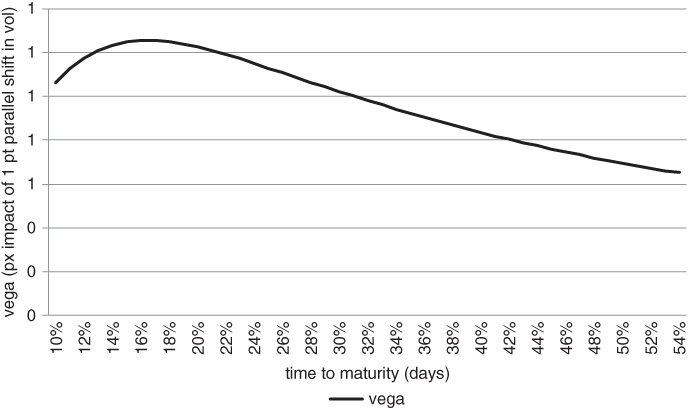
Figure 3.39 Vega trajectory for fixed-width put fly

At first sight, it seems as though we have stumbled upon the perfect “aftershock” hedge. The fixed-width put fly has negative deltas, bounded risk and is trading at a discount to its price in a calm market. The stars seem aligned. However, we should not jump to a hasty conclusion. It's worth mulling over the structure a bit more. Why should the fly cheapen as risk conditions worsen? The answer lies in the vega profile for a fly where the OTM strikes are not too far away from the spot. The 10%/5%/ATM fly is short vega at the point of entry and only switches to a long volatility profile as we get closer to expiration. This implies that we are not really hedging at all, at least initially. Another way to think about a fixed-width fly is in terms of scaling. High volatility shrinks the distance between adjacent strikes and hence reduces your zone of protection. The market can blow through a bearish-looking fly, compounding your losses. Traders generally think of the fly as a slow grinder. For put flies, you have a moderate bearish bias; for call flies, you are hoping for a modest rise. Even if your put fly starts with a mildly negative delta, you don't want a quick move down. Ideally, the underlying will hang around for a while, allowing the fly to develop into a more defensive structure. Initially, a put or call fly with equally spaced strikes is not much of a hedge. It only turns into one over time. Following this line of reasoning, you might be better served by doing nothing now and buying a put or call spread at some point in the future. However, we should not discard the fly idea too quickly, as it provides a gateway into more secure hedges. We can easily morph a fly into a something that is guaranteed to make money for all downside scenarios. If we move the 10% OTM strike a bit closer, the cost of the fly increases but the structure becomes more resilient. We have converted our put fly into something called a broken fly. The strikes are no longer symmetrically placed. The broken fly ensures that we will at least make something if there is a sharp drop in the underlying. For example, if we construct a 100/95/92 broken put fly on an asset trading at 100, we are guaranteed to make at least 2 points no matter how far the underlying drops. This allows us to roll the strikes down, thereby monetising a profit, if the sell-off continues.

In Figure 3.40, we sketch the payout of a broken put fly on the USO with 1 day to maturity. The USO is an exchange-traded fund, or “ETF”, that tracks the performance of a rolling long position in WTI crude oil futures. We have chosen the USO as its skew is relatively steep as of this writing. In particular, the fly was loaded on 14 March 2016, with a maturity date of 17 June 2016. The put strikes were 10.5, 9 and 8, respectively. Vega was initialised close to 0, by choosing the strikes appropriately. We can see that the broken fly generates a profit near maturity for all down moves of sufficient size. Hence, this is a truly defensive structure, with peak payout for a drop in the –10% range. We acknowledge that, close to maturity, the structure only makes a tiny bit for a drop in excess of –20%. However, the broken fly will be worth considerably more if the drop occurs earlier on. There is still a good chance of reversion back to the –10% range.
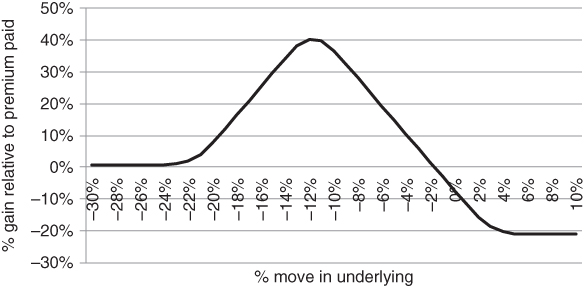
Figure 3.40 Payout of a broken fly on the USO close to maturity

Since the cost of a fixed width put fly decreases as a function of ATM implied volatility and skew, it should be possible to construct broken put flies whose price stays relatively constant as a function of implied volatility.

The reader may have noticed that we have examined dollar payouts for open-ended structures such as the  ratio spread and percentage payouts for the fly. This is not inconsistent. We would prefer to calculate percentage payouts for all structures but realise this is meaningless for structures where your receive to enter a trade or your premium outlay is very low.

A call butterfly, or “fly”, can be created in the same way. You simply cover the risk of a 1×2 call ratio with a higher strike call. While call and put flies are far more common than centred ones, most text books seem to gloss over them. This is a glaring omission, given typical flows generated by the largest hedge funds. There are several reasons why you might want to trade a non-centred fly. Suppose you have a directional view but fear that you might be early, with no clear idea as to when the move might take place. Things might take some time to develop. For example, if you are fundamentally bearish on the Australian dollar, you might buy a put fly on the currency. Given the AUD put skew, the initial cost of the trade would be low. However, as time passes, the delta of the structure becomes progressively more negative, hence your potential payout increases. We caution against looking at the maximum payout of a fly. This occurs at maturity, if the spot lands exactly at the middle strike. Some sell side researchers advertise flies with 10:1 or higher payouts, relative to initial premium paid. This is a pet peeve of ours, as the payout is effectively unreachable. In most markets, the odds of hitting the middle strike are similar to the odds of a tossed coin landing on its side. The 10:1 payout can only be realised if you hold to maturity. Most traders don't want to take so much short gamma risk, hence roll out of their flies short of maturity. 10:1 is a phantom ratio, belonging to an alternative reality rather than the markets as we know them.

Flies also offer a tactical advantage if you think you can correctly target the value of the underlying at maturity. Targeting equity indices, commodity futures and unpegged currencies within a tight range is nearly impossible. Roughly speaking, these markets evolve according to a random walk, where the range of outcomes fans out quite rapidly over time. The price at maturity can occupy quite a wide range of values with reasonable probability. However, short-term interest rate futures contracts can sometimes be targeted with precision, and flies come into their own in this context. For example, the Fed Funds rate usually moves in increments of 25 or 50 basis points when it moves at all. For reference, Fed Funds futures are based on the rate at which banks can borrow from the Federal Reserve Bank over a 30-day horizon. With short-term rates close to 0, even 25 basis points is a large discrete move in relative terms. Suppose you take the view that the Fed will hike at the next meeting and this is a non-consensus view. You can then construct an inexpensive narrow fly that pays out if the rate does go up by exactly 25 basis points. You can trade the fly as a package, reducing the bid/ask spread on each leg. Close to maturity, it's possible to make a large multiple of premium paid.

The final reason for trading call and put flies is possibly the most important. You want to take advantage of a steep implied volatility skew, with bounded risk. The put skew for equity indices (and other “risky” assets) tends to steepen after a sell-off, as investors bid up the price of OTM insurance. At some point, you might decide that the skew has become overpriced, but are not sure whether the market will continue to drop. You can then buy a put fly, on the assumption that the fly will cheapen if the skew flattens. In the diagram below, we show how the cost of a 1-month put fly varies as a function of the steepness of the put skew. In each case, we buy 1 ATM put, sell 2 puts that are 5% OTM and cover with 1 10% OTM put. By construction, the width of the fly is not dependent on volatility. You can see that, as the skew steepens, the fly becomes cheaper at a fairly rapid rate.

Our conclusion is that off-centred flies can serve a variety of purposes, combining views on direction, landing points and skew. For the sake of completeness, we briefly review the centred, or “iron”, butterfly. This trade typically has no directional or skew component. It simply tries to capitalise on the view that the market has overpriced the probability of a large move up or down. Structurally, iron flies are a combination of a short straddle and a long strangle. The idea is to short a straddle, on the assumption that volatility is overpriced and then buy a strangle to bound the risk in the trade. Although the cost of the strangle is related to the steepness of the skew, most investors are relatively insensitive to this incremental cost. The main focus is on extracting a return from ATM implied volatility. We sketch the payout at maturity for an iron fly in Figure 3.41. It is simply a shifted version of the put fly graph earlier in the chapter.
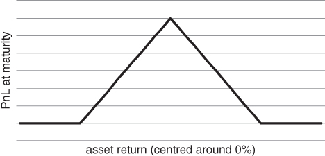
Figure 3.41 Iron butterfly payout at maturity

Assuming that the strangle strikes are not too far away and you are not too close to maturity, the payout profile will be relatively flat. This implies that you won't have to delta hedge very actively, if at all. You can always roll into a new centred fly if the underlying price shoots off in one direction or the other. In practice, however, non-centred flies are much more common than iron flies. While they look nearly identical, non-centred flies have very different characteristics from centred flies. The non-centred variety is a skew trade. It's a play on the relative price of at-the-money and out-of-the-money options. Note that OTM options become more expensive as the skew steepens. Non-centred flies allow you to sell the skew, with bounded risk. Conversely, when you buy an iron fly, you are effectively a buyer of the skew in an attempt to limit your downside. Risky assets such as equity indices and carry currencies typically have a put skew, while bonds vacillate between a put and call skew. Figure 3.42 tracks the difference between 1 month 25 and 50 delta put implied volatility for the S&P 500.
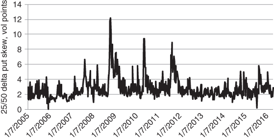
Figure 3.42 Historical put skew for the S&P 500

For US 10-year note futures, the skew tends to track the latest big move, as shown in Figure 3.43. If there is a sustained upward move in the 10 year, a call skew develops, whereas a put skew is formed during sell-offs. We will examine the chameleon 10-year skew at a later point. For now, we simply graph the differential between 25 and 50 delta put implied volatility.
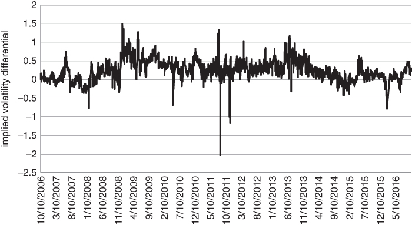
Figure 3.43 Historical put skew for US 10-year note futures

## CALENDAR SPREADS

Can you construct a trade that is long gamma but short vega? That's a common brain teaser for junior traders. The answer is yes, and it's quite easy to do. You just need to buy a short-dated ATM option and sell a longer-dated ATM option. Conversely, if you sell a short-dated ATM put and buy a long-dated one, you will be short gamma and long vega. It doesn't matter whether you trade a call or put on either side, as gamma and vega are identical for calls and puts with the same strike. You can verify this using the put/call parity formula, which relates the price of a put and call with the same strike to the price of a forward.

### Put/Call Parity Argument

Suppose a call and put with strike K and maturity T have price C(t) and P(t) at time . Further assume that the discount (interest) rate r is a constant. S(t) is the spot price at t. Then . Equivalently, . Since S and K*exp( –r(T – t)) don't have any gamma or vega exposure, C and P must have the same gamma and vega. Note that the delta of S is equal to 1, a constant, hence its gamma is 0.

Let's think of this in the context of hedging. When do you want gamma and when do you want vega? Both provide downside protection, though in slightly different ways. This is a crucial question that we will investigate in Chapter 4. The basic intuition is that you want to buy vega before a crisis and gamma thereafter. Once volatility has spiked, it's probably too late to focus on vega. The market may have already priced extreme event risk into the option premium.

We can understand the interaction between gamma and vega more deeply by looking at a specific calendar spread structure (see Figure 3.44). Suppose the term structure of volatility is upward-sloping. You take the view that 5-month options are overpriced relative to 1-month ones, so you sell 100 5-month 25 delta put and buy a 1-month 25 delta one. The trade has “Batman”-type characteristics. It looks sublime if volatility remains constant. You harvest a considerable premium, with an apparent margin of safety as you are selling a far-away strike.
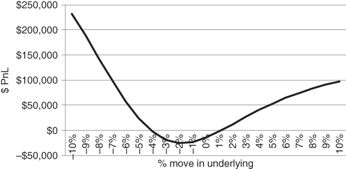
Figure 3.44 Payout of a calendar spread, fixed volatility assumption

Suppose you decide to play this by selling 6-month 25 delta puts and buying 1-month 25 delta puts. The trade looks safe as the front-month strike is much closer to the spot than the 6-month one. But this is a horribly messy structure, as you are simultaneously exposed to skew and term structure effects. There are too many moving parts. But what happens if the S&P rallies in the first 3 weeks and then plummets? While the index might not reach the 1-month 25 delta strike, volatility could rise sharply over a range of maturities. This is bad, as you would make nothing on the front month while taking a massive hit on the longer-dated put. Plotting the scenario payout under a constant volatility assumption gives no indication of the danger in this trade.

Recall that the Batman trade goes from safe to scary when we expand the view, including very large moves in the underlying in either direction. Similarly, the calendar (or “horizontal”) spread shows its true colours when we increase volatility (see Figure 3.45). Near maturity, we can't expect to take the trade off at a profit simply because the 1-month strike is closer than the 6-month one. Any increase in volatility will have a large impact on the longer-dated put. The worst scenario corresponds to a repricing of volatility with no material move in the spot. This might result in a large mark-to-market loss as the 1-month put gets close to maturity.
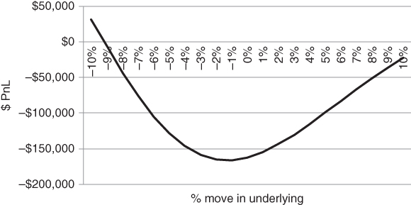
Figure 3.45 Profit/loss diagram for a calendar spread, assuming parallel shift in volatility

## SUMMARY

Your brokers will subscribe to Napoleon's slogan from Animal Farm, “four legs good, two legs bad”. The larger the number of legs, the higher the commissions. In any case, there is a fairly unambiguous mapping between your view and the appropriate options structure.

- If you are bullish, buy an outright call. If you are bearish, buy a put.
- If you are really bullish, you can use a risk reversal as a kind of “Texas hedge”. You buy a call and sell a put, doubling your exposure to the underlying, while mining the put skew.
- Conversely, if you are on the cautious side or do not want to pay up when volatility is elevated, you can buy a call spread or a put spread.
- If the put skew steepens beyond where you think it should be, buy a 1×2 put ratio or a put ladder. For equities and risky currencies, the skew will typically steepen after a sell-off, so you are banking on a return to normalcy.
- If one side of the skew seems very steep but you don't want to take open-ended risk, buy a put or call butterfly.
- Don't trade the Batman in size unless you are skilled at managing gamma risk in your portfolio. Even then, tread carefully.
