# 第4章：对冲两翼

在此，我们探讨以相对较低成本对冲毁灭性风险的实用方法。我们聚焦于股票指数和债券的做空1×2比率价差，以及做空VIX期货、做多VIX看涨期权的策略。两者都旨在提供强有力的极端事件保护，同时收取权利金或从展期收益中获益。当然，每笔交易都有其微妙之处，只能通过经验来学习。然而，本章应当能为对冲股票和利率风险提供一份粗略的路线图。本章中的结构应当广泛适用于任何在危机期间隐含波动率偏斜以可预测方式移动的市场。

## 做1×2的另一方

对冲两翼（hedging the wings）让人联想到市场收益分布像某种鸟类的奇异画面——也许是一只从灰烬中升起的凤凰。尽管如此，这个短语被广泛使用。两翼指的是分布的极端区域。如果1×2如此危险，为什么不把它颠倒过来？做空1×2是一种在危机来临前以低成本隔离看跌偏斜的方法。这并不是说我们要以与第3章蝙蝠侠交易相同的行权价做空比率价差。对于极端事件对冲，我们通常瞄准比蝙蝠侠交易更低的delta值，因为我们希望从极端事件风险的重大重新定价中获利。这种对冲并不真正关心中等幅度的现货变动。图4.1将我们的delta值沿着看跌偏斜进一步向外推移。

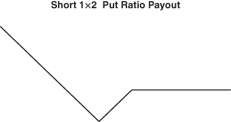
图4.1 做空看跌比率策略到期时的收益

我们跟踪了一个卖出25 delta看跌期权并买入10 delta看跌期权、比例为1:2的策略的表现。标的指数为标普500。头寸每周滚动一次，以重新建立delta中性头寸。

## 比较25和10 DELTA看跌期权

如果我们要构建对冲结构，就需要从识别偏斜上的高估和低估点位开始。然后我们可以买入相对便宜的行权价，同时避开甚至卖出昂贵的行权价。解决这个问题的一种方法是寻找持续存在的异常。是否存在对特定保护水平的过度需求？以下分析表明，投资者历史上对标普500中等幅度下跌的保险支付了过高的价格，无论是绝对还是相对意义上。正如我们在导言中讨论的那样，在第一次-10%下跌之前，-20%的跌幅似乎难以置信。投资者似乎也不接受这样一种观念：即使现货从未触及行权价，你也可以在期权上赚取可观的利润。对于不持有到期的策略来说，真正需要的是风险在不同行权价之间的重新定价。

以下例子相当简单，但说明了我们的观点。结果总结在表4.1中。使用大约10年的历史数据（从2005年年中到2015年年中），我们比较了不同delta值下4周期标普500看跌期权滚动策略的表现。我们选择了10、25和40 delta的看跌期权，并每周滚动一次。这覆盖了相当广泛且具有代表性的行权价范围，我们可以合理确信每个期权的隐含波动率是准确的。我们做了一个简化假设，即始终存在一个具有正确delta值的“灵活”4周看跌期权。灵活特性允许您指定希望交易的期权的行权价和到期日。我们使用插值隐含波动率计算了看跌期权的Black-Scholes价格，一周后重新定价，然后重新加载到一个新的4周看跌期权中。“插值”数值是具有相近到期日和行权价的已交易期权隐含波动率的加权平均值。我们还将每种看跌期权策略的收益进行了标准化，使其波动率相匹配。如果某一周是看涨或平淡无奇的，每个看跌期权的价格都会下降。10 delta策略将从波动率飙升中获益最多，因为偏斜很可能已经陡峭化。周收益基于期权价格的变化除以周初的指数值。

表4.1 不同delta标普看跌期权的历史表现（波动率调整后）

|  | 10 delta看跌 | 25 delta看跌 | 40 delta看跌 |
|--- | --- | --- | --- |
| 平均周收益 | –0.053% | –0.083% | –0.087% |

值得对25和10 delta看跌期权给予更多关注（图4.2）。这些正是我们想要进行对冲的区域。在匹配了它们的已实现波动率之后，很明显它们在指数最严重的单周下跌中表现相似。

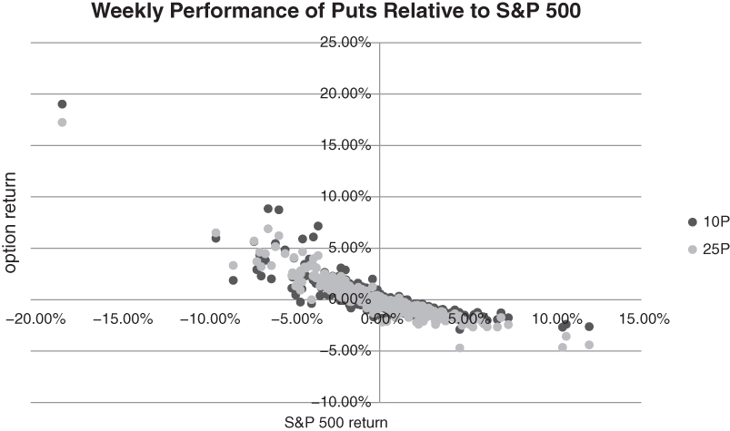
图4.2 10 delta标普看跌期权提供更高的“性价比”

10 delta看跌期权很少到期处于实值状态，但如果指数充分下跌，它们会受益于波动率上升和偏斜陡峭化。我们再次强调，深度虚值看跌期权不需要到期处于实值状态才能对你有利地“爆发”。现货价格不需要跌破行权价。它们的价值只需要被市场重新评估即可。请注意，我们买入的10 delta看跌期权数量大约是25 delta看跌期权的1.5倍，这样策略具有相同的历史波动率。如果我们跟踪每种delta值随时间推移的表现，可以清楚地看到，经波动率调整后的10 delta看跌期权在平静市场中表现更优，同时在极端市场条件下提供相似的保护水平（图4.3）。

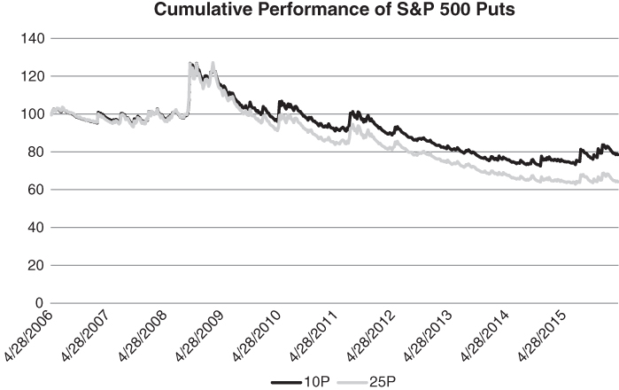
图4.3 4周10和25 delta看跌期权的相对表现，恒定风险预算

25 delta看跌期权策略需要更大的权利金支出，却并不能为你做更多事。表面上看，它可能看起来好一些，因为当标普500小幅下跌时，你可以告诉客户你赚到了钱。仅此而已。一旦你得出10 delta看跌期权是更优越的对冲工具的结论，你就可以探索这样的结构：卖出少量25 delta看涨期权并买入大量10 delta看涨期权。当你以1:1的比例卖出25 delta、买入10 delta看跌价差时，你试图从市场中提取alpha。超配买入10 delta看跌期权将你的alpha交易转变为一种对冲，同时保留了做空看跌价差的某些吸引人的特性。特别是，它以低成本提供了显著的保护。在许多情况下，正如我们下面所见，你甚至可以在建立交易时收取权利金。以两种不同行权价买入和卖出不等数量的看跌期权产生了一种称为比率价差的东西。当你超配买入两翼的期权时，按惯例你是在做空1×2。这一惯例表明投资者更倾向于买入1×2而非卖出它们。做空1×2到期时的收益看起来有点像平方根运算符，因此“平方根对冲”是这一策略的便捷记忆法。以下分析假设我们在欧洲斯托克50指数上卖出了1,000份1×2看跌比率价差，到期日约为40天。具体来说，我们在入场时卖出了1,000份25 delta看跌期权并买入了2,000份10 delta看跌期权。请注意，欧洲斯托克50期权有一个10欧元的乘数。

在我们更详细地分析做空1×2之前，我们提供进一步证据表明25和40 delta看跌期权应当避免。在这个例子中，我们采用特定状态的方法。分割数据的最简单方法是将2008年视为“高风险”场景，其他一切视为正常。我们将保持政治正确并强调高风险场景无论如何不是“异常”的。它不能从数据中被抹去。然后我们可以将10、25、40和50 delta看跌期权的历史表现制成表格，以支付权利金的百分比表示。

在历史基础上，上述所有期权似乎都很昂贵。就成本而言，没有灵丹妙药。然而，有些可能比其他更昂贵。相对而言，10 delta看跌期权提供了不错的价值。柱状图使我们能够直观地看到市场隐含分布可能被错误定价的位置。特别是，市场似乎高估了指数中等幅度下跌的概率。非常小和非常大的下跌定价更为合理。图4.4有助于澄清问题。

隐含分布是相对高斯的，尽管不完全如此。在某种程度上，期权市场确实考虑到了大幅下行跳跃。对于股票指数，隐含波动率偏斜预测左尾事件会比正态分布所表明的更频繁地发生。然而，我们的分析表明，左尾事件相对于“典型”下跌走势仍然被低估。卖出深度虚值期权对那些没有经历过上一次惨烈抛售或对其没有记忆的投资者来说具有吸引力，这压缩了看跌偏斜。如果我们想要准确表示数据，就需要进一步偏离经典钟形曲线。

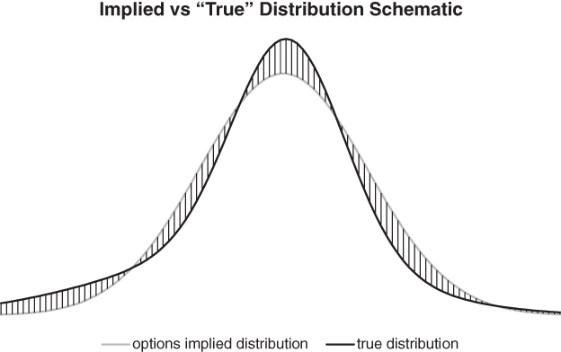
图4.4 我们对“真实”收益与偏斜所隐含收益之间差异的看法

我们希望避免在阴影区域位于黑线之上的位置买入看跌期权或看跌价差，而专注于对冲需求过度相对较低的区域。

在2008年高风险场景中，相当清楚的是，较低delta的看跌期权产生了更大的收益，以初始支付权利金的百分比计算。高delta看跌期权相对于其成本并不提供太多极端事件保护。显然，在固定预算下，你可以买入比50 delta更多数量的10 delta看跌期权。这可能在严重危机中带来回报。

在某种程度上，图4.5确认了我们一直在说的观点。如图所示，股票指数上的25 delta看跌期权是昂贵的。同样的分析大致适用于其他风险资产，如套利货币。有足够多的实例表明25 delta看跌期权最终到期处于实值状态，我们有信心这样说。这些是大型机构喜欢持有的用于防范“现实”下行场景的那种看跌期权。我们可以从图4.5中得出另一个结论。买入1份50 delta看跌期权并卖出2份25 delta看跌期权（蝙蝠侠的左半部分）作为alpha交易似乎是合理的，如果你能防范极端事件风险的话。然而，卖出25 delta看跌期权并买入2份10 delta看跌期权在投资组合环境中具有更大的效用。你最终获得了一个做多极端事件风险的头寸，同时沿着偏斜卖出了一个昂贵的看跌期权。

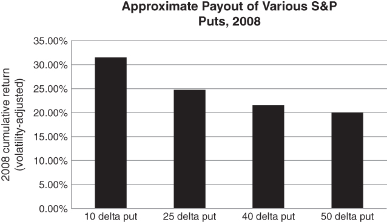
图4.5 不同delta波动率调整后收益的冲击力，2008年

一些管理人认为，滚动虚值看跌期权策略是股票对冲覆盖层的一个不错的基准。在构建基准时，25 delta看跌期权是一个自然的选择，因为它在概率意义上处于平价和0行权价看跌期权的“半途”。这也是一个任何心智正常的人都不愿长期持有的基准。滚动25 delta看跌期权持续亏损，即使是2008年危机这样的大型事件也不足以克服严重的负持有成本。如果击败基准是唯一目标，对冲覆盖层管理人将被激励几乎不做任何对冲。不要管病人。几乎所有不太具侵入性的策略长期来看都将击败25 delta看跌期权基准。

我们只能得出结论，股票保护策略的基准设定仍然是一个开放的问题。我们的观点是，如果对冲能够在一个完整的市场周期中大致盈亏平衡，同时在系统性危机期间提供可观的保护，那么它就增加了实质性价值。这一想法与“危机alpha”的概念相关，我们将在第6章中探讨。危机alpha策略承诺的比我们上面描述的稍微更多一些。特别是，它们试图在平静市场中盈亏平衡，在高波动率时期实现超额表现。这是一个困难的目标，因为这样表现在市场周期中将呈现实质性正收益。

在讨论特定结构的优点时，我们发现自己不断在历史表现图表和基于场景的收益曲线之间来回移动。对于想要日常管理风险的人来说，把握潜在结果的范围至关重要。在图4.6中，我们绘制了做空1×2到期时的“平方根”收益。

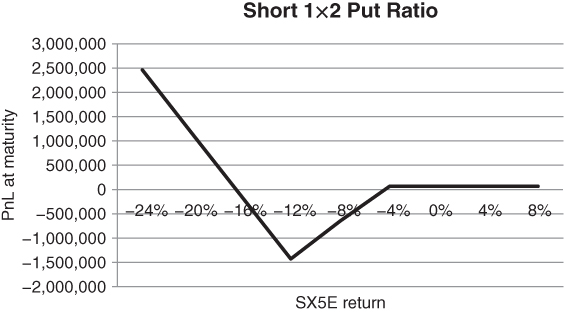
图4.6 SX5E指数上做空1×2看跌比率价差到期时的盈亏

收益曲线源自欧洲斯托克50指数上4%和12%虚值行权价。如上所述，我们假设卖出了1,000份1×2看跌比率价差。是否值得持有结构到到期？毕竟，平方根收益确实具有一些吸引人的特性。由于你在这个例子中是权利金收取方，如果指数在到期时下跌幅度小于-4%，你实际上赚到了钱。如果指数下跌超过-16%，你的利润也会越过零点并线性增加。问题在于，如果指数在-10%左右受到打击但没有崩盘，该对冲实际上会遭受重大损失。中等幅度的下跌是你为做空1×2必须付出的代价。当然，如果头寸迅速进入实值状态，你可以选择滚动结构。这样你就不必过于担心到期收益曲线中的深谷，如图4.7所示。我们涵盖了从-24%到+8%的一系列瞬时变动，试图展示做空1×2中嵌入了多少gamma。值得一提的是，在2008年和2009年确实出现了一些沿着这些思路的有趣交易。随着股票指数崩盘，几笔做空标普500看跌比率价差的交易以今天看起来难以置信的行权价通过了市场。一个结构围绕卖出约700行权价的看跌期权，并用500范围内的看跌期权进行超配对冲！在那种情况下，标普500将真正名副其实。虽然这种结构在当时看起来很怪异，但它允许买方在收取权利金的同时对冲大萧条式场景的风险。

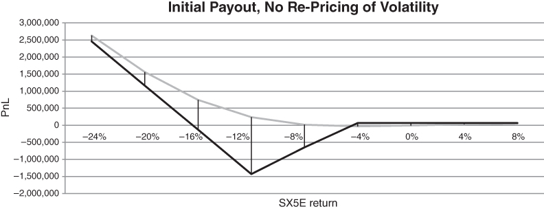
图4.7 做空1×2的收益，恒定波动率假设

乍看之下，该策略似乎只对冲非常极端的事件，达到几乎无法触及的水平。收益曲线不会对你有火箭般的影响，直到指数盘中下跌约-10%。在-10%时，广泛指数的交易很可能会被暂停。如果曲线规格正确，这意味着几乎不存在你能在第1天实现利润的场景。随着时间的推移，除非指数恢复或完全崩盘，否则你将面临严重的时间衰减。

然而，我们到此为止的分析是不完整的。我们遗漏了一些至关重要的东西。特别是，我们在重新定价结构时没有适当地纳入vega的角色。对于这样的结构，vega是我们的朋友。如果SX5E在1周的时间范围内自由落体，隐含波动率很可能剧烈飙升。这应该对原始的10 delta看跌期权产生不成比例的影响。以波动率单位衡量，10和25 delta行权价已经移动得更近了，因此头寸的行为更像是在原始10 delta行权价上的做多看跌期权。在图4.8中，我们假设一周已经过去。我们假设隐含波动率出现20个点的水平位移，不依赖于指数收益。

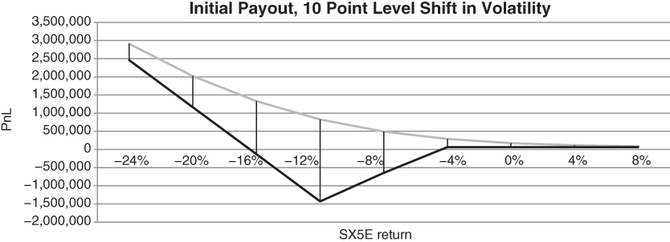
图4.8 做空1×2收益，波动率“抬高”20个点

对冲在大约-4%时真正开始发挥作用。如果SX5E在一周内下跌-8%，对冲在指数层面赚取约+2%。沿曲线外推，如果SX5E出现真正严重的-16%崩盘，对冲在指数层面赚取近+5%。我们使用了一种在初始阶段收取权利金的策略，切掉了大量的下行风险。还值得一提的是，这些估计是保守的，因为在风险事件期间还有另一个因素可能对我们有利。随着波动率上升，看跌偏斜可能会陡峭化，而我们的结构明显是做多偏斜的。10 delta行权价处的隐含波动率将相对于25 delta行权价不成比例地增加，给我们带来额外的表现加成。

看看我们的做空1×2看跌比率价差在过去的表现是有启发性的，作为概念验证。我们的心态正在从想要理解特定结构结果范围的自主期权交易员转变为系统化投资者的心态。在这里，我们想检验一遍又一遍重复同样策略在过去是否会有效。我们的运行假设是，中等虚值看跌期权相对于深度虚值看跌期权被高估了。这是基于对覆盖“合理”场景的看跌期权的过度需求。深度虚值的期权是贵还是便宜并不立即明显。然而，当与统计上被高估的期权相结合时，有可能构建出不太昂贵的极端事件对冲。我们分析这些结构的历史表现和收益曲线。以下研究是我们之前研究的直接结果。我们跟踪了标普500上做空1×2看跌比率价差在10年窗口内的表现。具体来说，我们卖出1份25 delta看跌期权并买入2份10 delta看跌期权，每周重置结构。两种行权价在启动时都有4周到期。我们的结果总结在图4.9中。

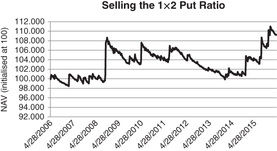
图4.9 标普500上做空1×2的历史表现（不含成本）

“NAV”指的是该策略的假设净资产价值。如果以低廉价格正确执行，做空1×2是一种令人惊讶的好的对冲。它在10年历史窗口中不仅盈亏平衡，而且在雷曼危机和2010年5月“闪电崩盘”等波动率飙升期间提供了显著保护。做空1×2的平均权利金支出为每周6个基点，或每年约3.1%。相比之下，滚动持有10 delta看跌期权每年成本约为26.3%。

成本削减是巨大的，考虑到你已经完全封锁了指数的极端下行风险。然而，对许多资金管理人来说，用做空1×2对冲是难以下咽的。他们就是不喜欢当指数逐步下跌时对冲亏损、加剧其做多投资组合损失的想法。这可能就是低delta行权价的做空1×2长期倾向于定价具有吸引力的原因。唯一通常喜欢持有做空看跌和看涨比率价差的参与者是做市商，因为他们希望持有低delta期权以降低破产风险。

我们承认实际收益会比上图中的略低，因为我们没有计入交易成本。乍一看，每周滚动1×2必定昂贵，可能会抵消交易的好处。经验表明，如果我们拥有有竞争力的经纪条款并将自己限制在最大和最具流动性的市场，滚动成本可以保持在合理水平。我们这里的目的不是“全盘托出”，而是展示有趣且非传统的对冲结构如何从长期回测中推导出来。有人可能会争辩说我们的回测并非压倒性地有利于10 delta看跌期权。做空1×2策略的收益仅为微弱正值，并且需要间歇性的波动率飙升才能保持正值。如果遇到长期的平静期，该策略将无法克服负漂移。然而，一旦我们拓宽视角，10 delta看跌期权就变得更有说服力。我们在下面列出了1个月到期的10、25、40和50 delta看跌期权的平均成本。我们的参考指数如前所述为标普500。请注意，我们超配买入10、25和40 delta看跌期权，以使它们的样本内波动率与50 delta看跌期权相匹配。

波动率调整后的10 delta看跌期权是最便宜的。但考虑到其成本，它们是否提供可比的保护？以2008年为参考，根据以下图表，答案是肯定的。

在低波动率状态下，做空1×2看跌比率价差充当一种特别强有力的对冲。它对“闪电崩盘”（如2010年5月所见）提供了极好的保护。它受益于现货向10 delta行权价加速以及看跌偏斜的剧烈陡峭化。做空1×2也是防范在原本温和的市场中可能发生的地缘政治事件的有效方式。这是图表右侧大部分极端凸性可观察到的地方。图4.10仅考虑启动结构前VIX低于20的情况。

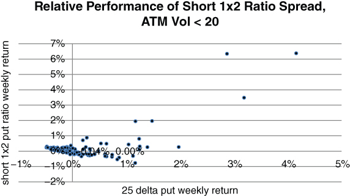
图4.10 低波动率状态下启动做空1×2的凸性收益

有理由问为什么波动率调整后的做空1×2在相对平静的市场状态下提供更强的冲击力。这在很大程度上是25和10 delta行权价之间距离的函数。当波动率低时，两个行权价紧密聚集在一起。指数的任何骤跌都会使10 delta看跌期权发挥作用，立即在指数上产生加杠杆的下行收益。我们在图4.11中衡量了行权价距离对平价波动率的敏感度。

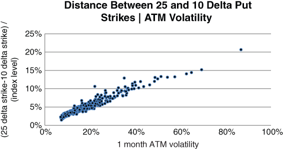
图4.11 1×2中行权价之间的距离随平值波动率同步增加

行权价距离几乎线性依赖于平值波动率。然而，偏斜效应在最佳拟合线周围产生了一些离散。如果偏斜对给定平值隐含波动率水平来说比预期更陡峭一些，25/10距离将比平时稍大一些。

值得检验做空1×2看跌比率价差是否也适用于其他股票指数，如图4.12所示。这里，我们跟踪了富时100指数的历史表现。

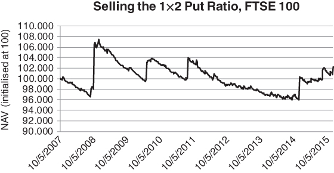
图4.12 富时100做空看跌比率收益（不含成本）

收益模式与标普500大致相同。在此杠杆水平下，该策略赚取微量收益。这在投资组合环境中是一个好结果，因为策略NAV在风险事件期间飙升。回想一下，一个策略可以具有负的预期收益，却在均值-方差框架中获得大量配置。然而，该交易的美妙之处在于，几个下跌的星期可能会引起偏斜的大幅移动。交易员经常将偏斜的变化比作油轮的运动。市场可能需要一段时间才能对风险偏好的变化做出反应，但一旦油轮调转方向，就无法阻止它。我们在本章后面会看到，风险状态倾向于在短期内持续，并在较长时间范围内强烈均值回归。做空1×2看跌比率价差在我们的武器库中已有相当长时间。它在2010年5月闪电崩盘期间表现尤为出色，当时股票指数和风险货币的看跌偏斜急剧陡峭化。

我们的做空1×2看跌比率价差在指数上提供了一个漂亮的凸性收益。它具有跨式期权的属性。在图4.13中，我们对做空1×2的周收益与标普指数周收益进行了非线性回归。收益是“非线性”的，因为它从任一方向的大幅指数变动中获得不成比例的利润。我们可以看到二次函数合理地拟合了历史收益的散点图。这使我们能够直观地看到做空1×2如何从急剧下跌中受益，同时如果指数上涨则没有不利影响。

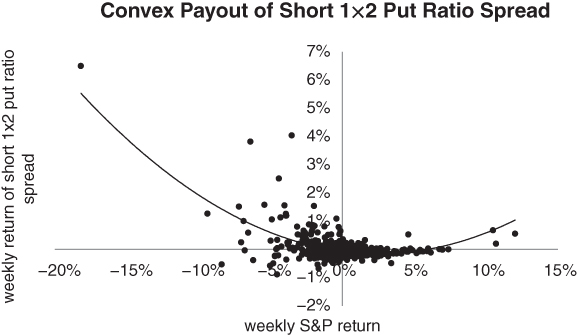
图4.13 做空1×2看跌比率价差的凸性收益

在某个时点，你可以对做空比率价差采取更积极的姿态。例如，假设标普500经历了一轮持续的抛售。你相信复苏是可能的，但也意识到完全崩盘的可能性不能被完全消除。指数不会永远停留在原地。你可以通过卖出1×1.5比率价差或直接的看跌价差来减轻1×2的仓位。1×1.5应该在指数突破底部行权价时盈亏平衡，同时在市场反弹时产生适度收入。如果我们不得不选择一种策略来覆盖大多数需要股票对冲的情况，那可能就是做空1×2比率价差。该价差不要求完美的时机，可以大规模交易。如果波动率出现平行位移，结构的成本不会上升太多，这给了我们更多时间来放置交易。然而，25和10 delta行权价之间的距离确实与波动率同步增加。这意味着，如果指数逐步下跌，你将开始在25行权价附近坠入深井，并可能被迫积极管理头寸。在高波动率环境中管理与做多跨式期权相似的头寸可能需要高超的技巧。对冲的另一个困难涉及再投资风险。一旦标普看跌偏斜扩张到一定程度，做空1×2就会变得极其昂贵。这意味着2份10 delta看跌期权的价格开始以比1份25 delta看跌期权快得多的速度增长。如果你在偏斜陡峭化之前成功做空1×2，你可以从10 delta看跌期权的相对重新定价中获利。一切都好，你可以对比率价差获利了结，并根据需要滚动到不同类型的对冲。但此时启动新的1×2可能为时已晚，不得不为此支付溢价。一旦偏斜移动得足够远，该结构就过于昂贵而不值得考虑购买。

一些专注于对冲极端事件的从业者可能会说，10 delta看跌期权并没有那么远。它远远在黑天鹅事件之前就能产生收益。假设我们应用经验法则，即期权的delta约等于其到期处于实值状态的概率。那么，10 delta期权有10%的概率产生收益。平均而言，你每年会有超过一次机会让静态做多头寸行权。这相对于极端事件的感知频率来说是相当频繁的。我们可以从不同角度分析问题。10 delta行权价仅在指数下方1.6或1.7个标准差。从前高盛首席财务官David Viniar的角度来看，这不过是微不足道的跌幅，他声称在2007年8月见证了几次25个标准差的变动。这里指的是高盛Alpha基金在2007年1月至8月遭受的约-27%的回撤。这个评论的荒谬性被几位统计学家充分注意到，包括Dowd（2008）。即使是一次5个标准差的变动，从最后一只长毛猛犸象行走在地球上以来（即大约1万年前），也才预期发生1天。猛犸象已经很久没有在地球上踩踏了。

如果10 delta看跌期权基于它们在波动率飙升期间重新定价的方式提供了价值，那么1 delta看跌期权应具有更大的潜力。这些是对冲世界的强力球彩票。投资者在极端情况下可以获得支付权利金的巨大倍数。我们在概念上同意买入极低delta期权的想法，但在我们的分析中不会重点讨论它们。使用传统统计方法评估它们的有效性几乎是不可能的。在分布的极端尾部建模偏斜动态充满危险。1 delta看跌和看涨期权价格需要从通常相当宽的买卖价差中推导出来（以中间价的百分比计算）。隐含波动率偏斜将根据你想买入还是卖出一个“微小”期权而有实质性差异。当我们移到1 delta以下时，情况变得更加混乱。delta越低，期权买入价为零的概率越大。可能有好几个期权以0买入价和1个tick卖出价交易，但这些期权不可能都值相同金额。对于买方投资者如对冲基金来说，1 delta策略需要一点信念。做市商不愿意吸收微小delta期权的大规模做空头寸，因为这会显著增加他们的业务风险。这意味着，在大多数情况下，你将被迫为“微小期权”支付溢价。回测必须以极大的谨慎进行。我们并不是说在实践中买入大量低delta期权是一个糟糕的策略，恰恰相反。如果你能截断每5到10年发生一次的极端抛售，你的投资组合应当以显著更高的速率复利增长。然而，验证这样的策略极其困难，可能需要针对极罕见事件的横截面研究。

## 对冲主权债券风险

在第3章中，我们描述了如何利用隐含波动率和已实现波动率之间的巨大差异。如果隐含波动率被高估，我们可以卖出一个期权，对其进行delta对冲，并试图锁定（隐含-已实现）差价。由此可知，（隐含-历史）波动率差价可以用作估值指标，一个“公允价值”的晴雨表。我们可以将其作为一种机制，用于判断特定资产的期权是贵还是便宜。一些多空策略根据这一指标对个别公司进行排名。特别是，它们在差价高的公司卖出期权，在相反情况的公司买入期权。请注意，我们不知道期权生命周期内的已实现波动率将是多少，需要一个粗略的代理变量。最简单的选择是使用某种历史波动率度量作为指南。只要后续已实现波动率与我们向后看的度量不太不同，我们的买卖信号就应该具有一些信息含量。另一种方法是预测波动率，使用GARCH或者可能是自研模型。然而，用任何模型进行准确预测都不容易，所以我们暂时坚持使用历史度量。让我们通过聚焦平值期权来简化问题。那么我们可以说，如果平值隐含波动率与历史波动率之间的差价持续很小，则平值期权定价是合理公平的。相反，如果差价“乱七八糟”，可能意味着平值期权受到超出现货变动所反映的恐惧与贪婪周期的影响。在图4.14中，我们可以看到平值德国国债期货期权的定价比DAX（德国股票指数）期权更具竞争力。我们比较了30天滚动波动率与还有20天到期的近月平值看跌期权的隐含波动率。

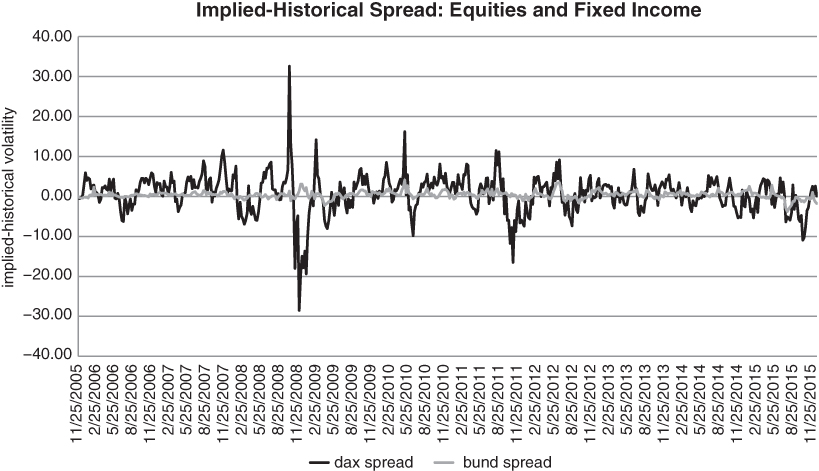
图4.14 德国国债期货和DAX隐含与历史波动率差价

我们承认，平均而言，DAX平值隐含波动率是德国国债隐含波动率的3到4倍。这解释了（隐含-历史）差价中增加的部分波动性。然而，DAX（隐含-历史）的最大差异大约是德国国债最大差异的10倍。这意味着DAX波动率相对不稳定，DAX期权更有可能时常被大幅错误定价。同样的基本关系适用于标普500相对于美国10年期国债。波动率交易机会在美国股票指数中相对丰富。

这引出了下一个问题。做空1×2如何应用于债券期货？我们面临一个奇怪的偏斜。当波动率上升时，虚值看跌期权并非总是有需求。在持续上涨之后，看涨偏斜倾向于出现。足够严重的抛售似乎会触发看跌偏斜，尽管我们可供研究的实例相对较少。图4.15探讨了德国国债期货趋势程度与德国国债偏斜形状之间的联系。x轴跟踪期货价格相对于其100日移动均线的位置。这是一个简单的趋势指标。y轴取1个月25 delta看涨和看跌期权隐含波动率之差。我们可以看到，自2010年以来，近期趋势与看跌偏斜形状之间存在强劲的正相关关系。回归的R2约为0.10。每当德国国债上涨，看涨偏斜就出现。每当它们抛售，看跌期权就有人出价。这具有重要性，因为它表明投资者不确定极端风险是在上行还是下行。

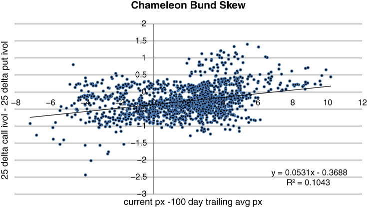
图4.15 德国国债期货可以有看涨或看跌偏斜，取决于状态

测试债券期权结构的表现相对棘手，因为债券几十年来一直处于持续的牛市中。这意味着无论看跌期权买入策略多么聪明，都不会有效。那么我们在哪里可以找到足够的震荡来检验我们的理论？我们至少需要一个重大抛售的实例。否则，我们将倾向于选择时间衰减相对较低的对冲，不论它在收益率飙升期间可能表现如何。“尾部风险”管理人被反常地激励大多数时候什么都不做。只要没有太糟糕的事情发生，他们看起来具有最小的时间衰减。德国国债期货虽然持续上涨，但偶尔提供对我们的目的有用的抛售（尽管绝不是决定性的）。在图4.16中，我们绘制了德国国债期货近月滚动策略从2005年12月到2015年12月的表现。我们基于准确隐含波动率数据的可用性选择了回溯窗口。

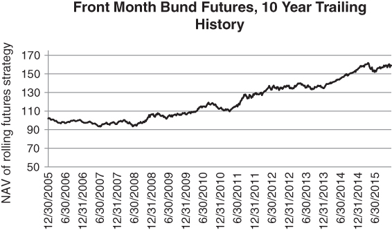
图4.16 具有少量抛售实例的相对长期数据集

数据中存在一次急剧抛售，发生在2015年4月到6月。读者可能会注意到2010年下半年德国国债期货也有下降。然而，这次变动太浅，短期看跌期权买入策略无法利用。这唯一一次严重回撤可能看起来不多，但这几乎是我们所能使用的全部。我们在图4.17中放大了2015年的图表，以强调抛售的幅度和严重性。

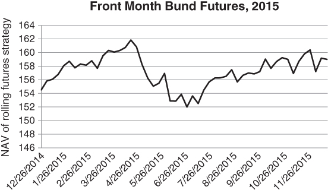
图4.17 2015年价格动态特写

我们希望找到一个在2015年抛售中能赚取显著收益的高效结构。所谓“高效”，我们指的是一个没有太多时间衰减或期货展期暴露的结构。按照这个标准，裸德国国债期货看跌期权不会非常高效。如果在某一天没什么大事发生，你的看跌期权将基于theta和远期漂移的组合而亏损。正如我们稍后将看到的，只要收益率曲线向上倾斜，债券期货就以贴水交易。如果现货（即最便宜可交割债券）不移动，这将把期货推离下行看跌行权价。

这里的结果是，在买入看跌期权或做空期货时，你需要克服期限结构效应以及时间衰减。我们的解决方案是重新启用做空1×2比率价差作为一种低成本极端事件对冲。如果我们卖出1份25 delta看跌期权并买入2份10 delta看跌期权，我们对期货漂移的暴露将减少。我们仍然必须接受10 delta看跌期权在初期会迅速衰减，但不再与德国国债期货正面对抗。在图4.18中，我们比较了约2份做空1×2看跌比率价差与1份做多25 delta看跌期权的表现。我们做了一些自由调整，通过调整做空1×2的杠杆来匹配2015年抛售期间做多看跌期权的表现。在实践中，将做空看跌比率加倍就足够了。我们只是在抛售期间匹配了表现，以突出两种结构中相对的时间衰减。

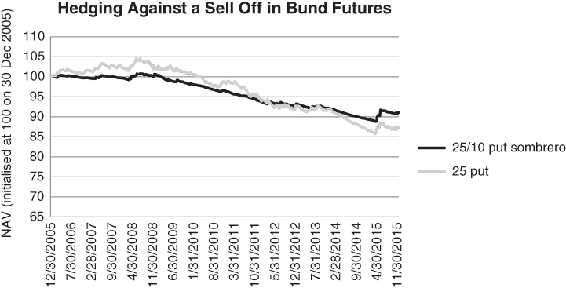
图4.18 裸看跌期权与“草帽”策略对德国国债期货的相对表现

两种策略在整个期间都没有表现得那么好。它们怎么可能呢？期货几乎整个时间都从下行看跌行权价处跑远了。我们可以相当肯定地说的是，每当德国国债期货大幅抛售时，两种策略都会表现良好。如果2015年式变动的频率增加，每条NAV线的稳步下降可能会被间歇性的飙升所抵消。对于我们的目的来说，重要的一点是做空1×2比直接看跌期权衰减得更慢，即使调整了杠杆的变化。诚然，25 delta看跌期权对小幅抛售相对敏感。换句话说，灰线更震荡。然而，如果你专注于极端事件保护，这不应成为关注点。

到此为止，我们只关注了对冲债券期货的急剧下跌。对于股票指数，通常考虑下行对冲就足够了。风险是非对称的，基于投资者总体的头寸状况。大多数机构具有做多股票的偏向，持有大量个别股票、ETF和指数的静态投资组合。由主权财富基金、捐赠基金和保险公司持有的实钱账户倾向于特别静态。鉴于其头寸状况，他们更担心股票下跌而不是“融涨”。然而，有利率敞口的机构有更广泛的担忧。债券风险可能是双向的。债券管理人经常担心利率上升，这会导致债券价格下跌。相反，养老基金担心利率急剧下降。这增加了其负债的现值，可能从精算角度使其技术上破产。因此，分析上行看涨以及下行看跌结构都很重要。债券通常在通缩恐慌或“避险”事件期间上涨。在避险场景中，投资者抛售股票同时寻求安全的短久期资产。现金为王，但投资者也有囤积长久期国债的趋势，为持续的经济下行做准备。银行的偿付能力要求激励购买债券等多元化资产。

在比较各种上行德国国债结构的历史表现时，我们可能很容易遇到困难。测试防御性看跌价差时存在的问题仍然存在，尽管方向相反。在一个债券持续上涨、期货期限结构处于贴水的环境中，几乎每个上行交易似乎都有效。我们以德国国债的50/25看涨价差为例（图4.19）。这是使用近月期货期权实现的。

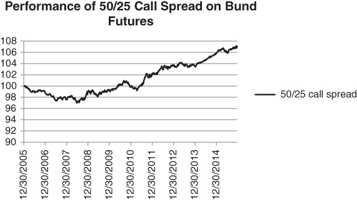
图4.19 德国国债期货看涨价差买入策略的历史表现

从2012年起，图4.19中的图表直线上升。这是回测者的梦想和市场的诱饵。这不就是人们去量化投资会议的原因吗？为了看到假设利润不可阻挡地向上移动？这种稳定表现在做多期权策略中是不常见的，因为它在构造上具有负的时间衰减。在这里，看涨价差中的theta被展期收益和持续下降的收益率组合所抵消。如果收益率确实开始上升且曲线倒挂，我们不应自动假设看涨价差会在风险事件期间提供保护。然而，只要期限结构处于贴水状态，50 delta看涨期权的“失血”将相对较低。如果没什么大事发生，你日复一日亏损不多。

在陡峭收益率曲线环境中，债券期货上的看涨价差确实变成了优雅的对冲，因为时间衰减被展期收益部分抵消。我们推荐它们作为防范中等避险事件的“灰天鹅”对冲。

## 在标普上卖出看跌比率价差

很难说极低delta的看跌期权是贵还是便宜，因为我们不知道、事实上也不可能知道极端事件的真实概率。然而，我们的研究表明，1个月25 delta看跌期权是昂贵的，具有高置信度。因此，我们的核心平方根对冲依赖于卖出25 delta看跌期权并超配买入10 delta看跌期权，即我们卖出一个看跌比率价差。这种结构卖出几乎肯定昂贵的东西来融资具有巨大潜在收益的东西。许多对冲基金倾向于从买入比率价差的角度思考，但大概聚焦在更接近平值的期权上。具体来说，我们的分析围绕卖出25和10 delta看跌期权的1×2.5比率价差，使我们的初始头寸delta中性。

## 假设的隐含分布

你可以对隐含波动率曲面做精细处理，尝试基于期权价格矩阵来指定资产的隐含分布。如果正确，这个分布将生成在任何时间范围内任何规模变动的市场隐含概率。它将完全刻画市场对该资产的集体观点。这个想法已由几位作者提出，尤其是Derman（1999）。思考这个问题的另一种方式是在二元期权的背景下。二元期权如果期权到期时处于实值状态则支付固定金额，否则不支付任何东西。假设我们有一个二元期权，如果S(T)落在[S* – delta, S* + delta]区间内则支付1，否则支付0。假设漂移率为0，二元期权的市场价格应等于到期时落在(S* – delta)和(S* + delta)之间的概率。在轮盘赌中，我们面对同样的支付方式。如果球落在我们选择的槽里，我们收集预定义数量的筹码，否则损失最初的下注。这意味着，如果你有一个非常精细的行权价划分，就可以用行权价非常接近的看涨或看跌价差来近似二元期权。我们可以将相邻行权价之间的距离记为delta_K。

现在我们知道，如果利率为0，行权价无限接近的看涨价差的价格可以用0.5*delta_K * P（S在到期时介于K和K+delta_K之间）来近似。解出P，我们可以为资产构建隐含概率的直方图。然后，我们可以通过瞄准期权隐含直方图与历史数据构建的直方图之间存在巨大差异的区域来构建相对价值交易。可以使用平滑技术构建一个连续的隐含分布，使其与期权链上的所有价格保持一致。这规避了上市行权价通常离散间隔的事实。

准确的隐含分布可以给卖方一个小优势。理论上，“流量”交易员可以利用隐含波动率曲面上出现的微小不规则性，无论它们发生在哪里。思路是将资产的隐含分布与其历史分布进行比较。二者在某些区域的巨大差距可能暗示交易机会。请注意，流量交易员是代表客户执行订单的人。流量交易员可以看到订单不平衡的积累，导致偏斜扭曲，并可以以几乎零成本进行交易。对于买方参与者，如资产管理者，隐含分布方法的用处较小。市场冲击和佣金倾向于抵消从跨期权微小统计错误定价中可以提取的任何利润。作为对冲者，我们更关心偏斜的动态而非公允价值的概念。我们希望买入在风险事件发生时价值会跳升的东西，而不在今天为它们支付太多。当我们回测不同delta的期权时，我们可以检验哪些在抛售期间最活跃。这些就是我们在抛售来临前想要持有的期权。

你可以看到，用做空比率价差对冲的标普500的10年滚动表现大致与指数本身相匹配。直接买入25或50 delta看跌期权是显著的收益拖累。然而，对冲后指数的波动率为15.41%，而对冲前指数为18.25%。在风险调整基础上，比率价差显著改善了一个纯做多头寸。

图表中2008年下半年的相对表现可能不清晰。我们在下面放大了2008年7月到12月的表现。

## 我们迄今为止的发现

以下是我们所发现内容的简要摘要。我们聚焦于约1个月到期的期权。我们了解到：

- 风险资产如股票指数和高收益货币具有持续的看跌偏斜
- 看跌偏斜倾向于在波动率上升后陡峭化
- 25 delta看跌期权似乎在历史上相对于深度虚值期权被高估了。

这意味着我们希望沿着偏斜买入更远处的看跌期权以获得低成本保护。我们获利的基本机制是在市场朝我们的做多期权行权价方向移动时向下滚动行权价。

## 回测：一个警示性说明

在上一节中，我们认为每当你买入一个期权，你就是在买入一个交易策略。你的敞口会随着标的资产的移动而动态放大和缩小。既然期权等价于一种交易策略，我们回测了不同delta的4周期看跌期权，以看哪些随时间表现最好。结果表明，虽然25 delta标普看跌期权看起来特别糟糕，但没有哪个看跌期权随时间表现得特别好。

那么或许正确的思路就是直接做空看跌期权？从概念上讲，这不是一个坏主意，因为在没有极端事件的情况下期权往往被高估。在历史基础上，卖出看跌期权看起来也很有前景。在图4.20中，我们做空25和50 delta 1个月看跌期权，每周重置一次。之前的对冲结构被颠倒了。做空25和50 delta策略都产生了比静态做多指数更强的风险调整后收益。标普500直到2013年才收复其2007年的高点，而做空看跌策略在2011年就回到了水上。

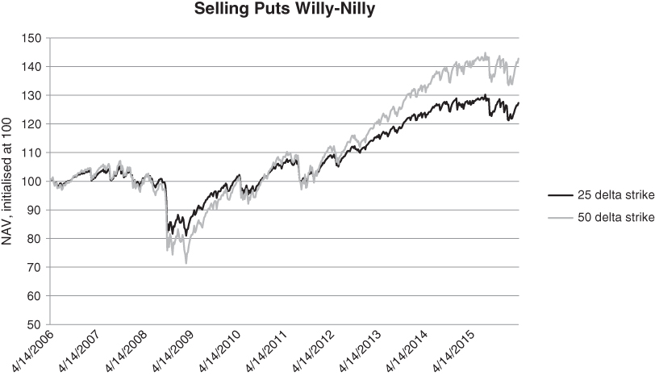
图4.20 表面上看，卖出看跌期权看起来是个好主意

看起来似乎你可以通过加杠杆做空25看跌期权策略来实现比卖出单份50 delta看跌期权更好的收益流。我们可以外推并考虑卖出5份10 delta看跌期权而不是1份50 delta看跌期权。然而，这种推理存在严重缺陷。它招致追加保证金和极端事件风险。赌徒破产嵌入在这种方法中，因为你在下跌过程中隐性地加仓了一个亏损头寸。

当你找到一个亏损策略时，做空它并不会自动转换为盈利策略。至少，你需要正确调整做空策略的规模。让我们暂时忽略成本。数学上正确的是，如果你反转一个平均收益为负的策略，反转策略将有正的平均收益。然而，如果回撤足够大，其复利收益可能是负的。一个简单的例子说明这一点。想象一个策略每隔一个月亏损-50%并盈利+40%。收益遵循序列{-50%, +40%, -50%, +40%, …}，你的投资组合以平均月收益-5%的速度迅速下降到0。如果你做空这个策略，你的收益序列应该是一个交替序列+50%和-40%。虽然平均收益现在是正的，这个序列也会趋向于0，如图4.21所示。

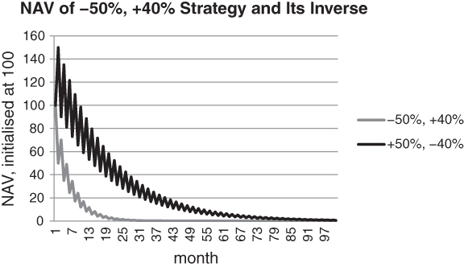
图4.21 如果杠杆过高，策略和其反向策略都可能收敛于0

假设{+50%, -40%}无休止序列是保证的，我们承认通过降低杠杆可以将其转变为盈利策略。特别是，如果你持有50%现金并将剩余部分投资于{+50%, -40%}策略，你的NAV将不再衰减到0。对于任何超过50%的现金余额，该策略将是盈利的。在图4.22中，我们假设75%的权益以现金持有。

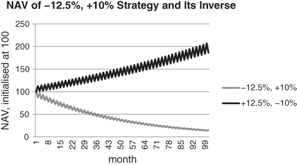
图4.22 降低杠杆后做空亏损策略确实有效（不含成本）

为简单起见，我们假设现金收益为0%。表现强劲，但关键点是我们的操作存在限度。读者可以使用凯利准则的推广形式更深入地研究最优杠杆比率，如Brown（2011）所述。

让我们回到1×2回测。有些读者可能对我们的做空看跌比率价差分析持怀疑态度。我们无法确定我们的回测是否代表了对冲策略的真实收益。按照do Prado（2013），可能有人认为我们的结论存在选择偏差。do Prado的论文引入了“压缩”夏普比率的概念，以考虑过度拟合和选择偏差。也许我们应该称其为宣言，因为它试图彻底改革系统化策略的营销方式。在很大程度上，这是一个健康的发展。在得到一个模型之前你检验的配置越多，你就越需要惩罚模型回测的表现。一种配置可能是检验做空1×2比率价差。另一种可能是检验做空1×3比率价差，等等。在选择行权价和给定结构的到期时间方面你也有一些灵活性。

请注意，策略的夏普比率等于（策略平均收益 - 无风险利率）/（策略标准差）。毕竟，从所有可能的看跌期权组合中，我们选择了一个恰好作为对冲在过去表现相当不错的结构。这里的问题不是过度拟合模型。相反，我们没有引入任何自由参数到策略中。但我们是否犯了挑选樱桃的罪？我们认为我们对1×2的分析是假设检验的练习而非模型开发。我们最初的想法是，许多机构偏向于那些如果发生抛售很可能到期处于实值状态的对冲。他们倾向于为接近平值的期权过度支付，同时忽略两翼的期权。这些虚值期权可以在从未具有内在价值的情况下戏剧性地重新定价。换句话说，它们不需要到期处于实值状态就能盈利。做空1×2对冲试图利用这种持续的偏向。我们不声称我们的对冲在任何意义上是优化的，而是对其进行回测仅仅是为了展示概念验证。Do Prado和其他人认为，值得用模拟数据检验模型，试图增加样本集的大小。然而，模拟替代历史存在严重困难。如果你从过去重采样个别收益，你会丢失可以导致数据趋势或其他结构性倾向的精确相关结构。即使你重采样数据块，试图保留连续收益之间的关系，你也可能错过驱动真正巨大变动的正反馈循环。Do Prado无疑在声称大多数回测基于有限数量的时变数据方面是正确的。然而，替代历史的构建充满危险。

我们注意到，在投资社群中存在明显的选择偏差例子。导论中提到的“长期持股”群体声称，股票在10年或更长时间范围内几乎总能跑赢通胀。这些研究基于美国股市收益，因为美国有丰富的历史数据。这是一个合理的论点，除了一件事。美国是过去100年表现最强的主要市场。成功故事总是有充分的文字和数字记录。“历史由胜利者书写”，正如俗话所说。追溯到1900年，五大资本市场是美国、英国、德国/奥地利、法国和俄罗斯。如果你应用现代思维并配置到每个经济体，你会在其中两个被彻底消灭。在计算风险溢价时你不能将自己限制在幸存者的数据中，因为你事前不知道谁会是幸存者。

在我们被这个论点冲昏头之前，值得指出的是，列表化数据并不一定是坏事。只要你谨慎地确定头寸规模，就没有理由丢弃你观察到的信息。假设你被邀请参加两个晚宴派对。其中一个派对的东道主你见过几次并且相处得很好。相反，你只与另一个东道主简短交谈过，并带着苦涩的味道离开。你没有太多依据，但如果你必须做出选择，第一个派对显然是可取的。虽然均值回归效应需要考虑财务数据，基本原则是相同的。完全有理由使用可用数据，只要你不对所发现的东西过于自信。

## 一个简短题外话：DELTA中性还是舒适平衡？

你可以构建delta中性但高度不平衡的头寸。如果你做空大量明天到期的跨式期权，你起初是delta中性的，但你的头寸悬挂在刀刃上。交易的利润将高度依赖于你在正确时刻进行delta对冲的能力。任何引发严重身体症状的交易从定义上讲就是不平衡的。对于盈利交易，人们很容易想，如果头寸再大一些就好了。但如果你做得更多，你就需要收紧风险控制，以至于你可能根本赚不到更多的钱。这是一个合理（虽然是启发式）的论点，支持保守地确定开放式策略的规模。我们这是为了你的健康。

## 665看跌期权

我们在本节中进行一个小型且希望有趣的思维实验。然而，该实验确实有重要的后果。即，它展示了保证金约束需要如何被纳入任何包含杠杆的策略。时间是2005年，你有一个愿景。你预见到，无论市场变得多么动荡，标普永远都不会收于665以下。665是一个坚如磐石的底部。请注意我们没有选择666作为底部，因为标普指数期权行权价以5的倍数出现。诺查丹玛斯不会介入我们的实验。未来的其余部分不向你揭示。在你沉思时，你意识到你有一个不会输的策略。你需要做的就是卖出一份1个月的665看跌期权，等待到期，然后重复。如果你的愿景正确，该看跌期权将永远到期毫无价值。最坏的情况是，当标普远高于行权价时，你不会收取太多权利金。在某种程度上，你可以通过随时间维持相对恒定的保证金与权益比率来调整。在宇宙主宰模式下，你根据以下规则在你的经纪账户中积极交易。

- 每季度一次，你通过将保证金与权益比率设定为50%来决定你要卖出多少3个月665看跌期权。换句话说，你有50%现金来支持你的头寸。
- 在季度末，你兑现该季度的任何收益。这些不再可用作保证金，因为它们已被部署到别处。
- 然后你卖出适当数量的665看跌期权，到期日与季度末对齐。这确保过程中不会发生再平衡。

现在，让我们将时钟拨快到2015年。思维实验即将发生戏剧性转折。你舒适地坐在一张用你期望现在实现的收益购买的豪华椅子上。毕竟，预期是财富的一种形式。然而，你的副手却无处可寻。尽管如此，是时候审查你的对账单并祝贺自己累积的成果了。你的愿景是正确的，标普500的盘中低点是2009年3月6日的666。一切必定安好。结果，从2010年到2014年没有任何对账单。你违约了，意思是你的账户在2009年3月被经纪人平仓了。怎么会这样？你有一个万无一失的交易策略。你给自己留了一些缓冲空间，在账户中留出50%的现金，以覆盖按市值计价的亏损。不行。如图4.23所表明的，问题是你确定头寸规模的方式。你的经纪人和交易所都不能为你的完美先见之明给予信用。

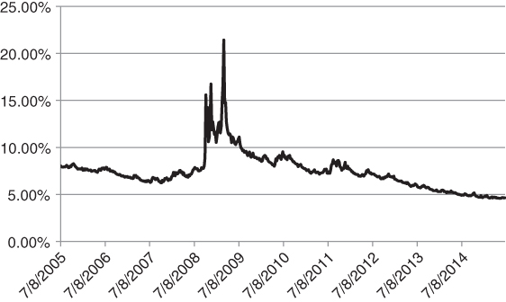
图4.23 做空标普665看跌期权的估算保证金要求

图4.23估算了1份做空标普665看跌期权的交易所保证金要求。虽然你的经纪人可能要求更多保证金，但这是你需要存入的下限。如果你做空一份在CBOE上市的看跌期权，初始保证金等于（看跌期权价格）+ 0.15 *（看跌行权价）。在图表中，我们简单地将所需保证金转换为指数水平的百分比。回想我们确定策略规模的方式。规模确定有些人为，但有启发性。我们同意从上个季度收获收益，使得新季度开始时拥有50%的现金缓冲。如果在季度内保证金要求从季度初的初始水平翻倍，该策略就会被淘汰出局。我们能否再次提醒读者回测没有情绪？上面例子中不仅仅是杠杆约束的问题。一旦你陷入困境，你的模型所规定的复苏高概率是不足以依赖的。

## 平方根策略的含义

我们已对做空1×2看跌比率价差作为严重回撤的低成本对冲进行了详细分析。做空1×2看涨比率价差也有其作用，例如作为极端通胀对冲。如果泡沫似乎在形成，即如果变动似乎过度，但可能在反转前走向“抛物线”，我们可能在商品指数上卖出看涨比率价差。如果我们希望对冲两个极端同时收获一些权利金，我们可能最终得到一个双向比率价差，如下所示。

图4.24可以视为投资和风险承担的一般蓝图。该策略在我们内部曾用代号“sombrero”（草帽），基于到期时的收益轮廓。（“Stockton帽”会是更准确的描述，但我们不是帽子专家。）当我们下订单时，这会让经纪人忙乱地上网搜索，毫无结果。他们通常不知道我们在说什么，也不敢问。实际上，sombrero只是一个双向做空比率价差。这个代号是简洁而有趣地描述它的方式。

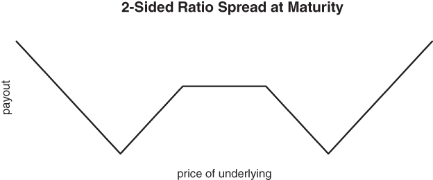
图4.24 双向比率价差，到期收益

许多（如果不是大多数）投资策略依赖于捕获某种风险溢价。这些包括深度价值/困境投资、外汇套利、在潜在并购中买入目标股、卖出波动率等。在每种情况下，你都在通过承担投资社群中某些群体无法承受的风险来收取回报。这一切都不错，但如果你的策略涉及任何杠杆，它可能在极端事件中被消灭。因此，将低成本、低delta期权作为风险溢价收获策略的一部分绝对至关重要。一旦你加入虚值对冲，你的复合头寸类似于一只秃鹰。如果你更积极地买入两翼，精神上你将得到一个做空双向比率价差。这些深度虚值期权是贵还是便宜？在某种程度上，真的不重要。只要你对冲调整后的持有收益足够大，“微小”期权对冲只是做生意的成本。在极端处超配买入期权使你有机会在风险交易变得更具吸引力时加仓，或在两翼获利了结同时维持对冲账簿。

## 期货 vs 现货

假设我们认为原油即将上涨。我们想从价格上涨中获利，但没有接收、储存和交付实物油的基础设施。一个自然的替代方案是买入原油期货。近月期货应大致与现货油价同步移动。“近月”指的是到期时间最短但持仓量显著的活跃合约。为了随时间维持我们的做多头寸，我们需要在合约到期前“滚动”它。滚动涉及卖出近月并买入次月期货以重新建立头寸。次月是期限结构上的下一个活跃期货合约。

现在假设期限结构在曲线短端“处于升水”状态。这意味着近月期货以低于次月的价格交易。如果我们想滚动我们的做多头寸，我们需要低卖高买。更精确地说，我们必须支付（近月价格–次月价格）/（近月价格）的百分比以维持我们的做多头寸。这是我们的展期收益率，在这种情况下为负。其含义是，如果我们希望长期持有头寸，展期将对我们的收益产生实质性影响。正如我们将看到的，累积展期收益可能比现货价格变化对你的总收益产生更大的影响！当期限结构短端处于严重升水时，人们很容易考虑买入长期限期货。这提供了两个优势。长端倾向于相对平坦，减少了逐月展期成本。此外，你不需要那么频繁地展期。这种策略的问题是长期限期货可能相对缺乏流动性，更重要的是，它们可能对现货价格的跳跃不够敏感。当像石油这样的市场出现供应冲击时，近月期货倾向于跳跃。市场在曲线更远处定价了一些均值回归，那里的效应可能被减弱。

## 一个戏剧性的例子

我们从一个极端案例开始，以突出展期成本的潜在影响。我们的开场棋涉及交易收益率曲线，这在结构上类似于期货期限结构。想象我们偶然发现了一条阶梯函数形状的收益率曲线，如图4.25所示。

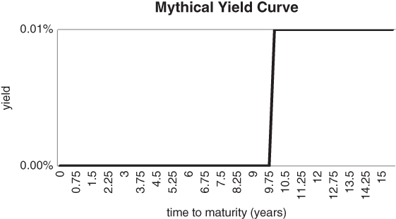
图4.25 神话般的收益率曲线：展期收益而非绝对收益率可以产生有吸引力的回报

收益率在绝对意义上普遍很低。从长期资产配置角度看，债券看起来是糟糕的买入。如果你持有曲线上任何债券至到期，你的年化收益将低于1个基点，即0.01%。除非底层经济滑入严重的通缩螺旋，否则这不太可能令任何人兴奋。然而，从交易角度看，曲线中嵌入了一个绝佳的买入机会。绝对收益率水平低并不重要。你只需要买入一只10年期零息债券。收益率曲线在10年期点无限陡峭。假设曲线隔夜不变，面值100，该债券在一天内从100*exp(–0.0001*10) = 99.90重新定价到100。假设每年252个交易日，这对应年化收益29%！陡峭收益率曲线的炼金术让你能将低收益率转化为高回报。

同样的逻辑适用于远期曲线，尽管符号相反。请注意债券价格与收益率反向移动，因此陡峭的收益率曲线有利于买入债券策略。如果你买入像取暖油这样的商品期货，倒挂的远期曲线创造正持有收益。当期限结构向下倾斜时，称为处于贴水状态。近月期货以高于远期合约的溢价交易。在期货期限结构处于贴水时维持做多头寸的机制如图4.26所示。

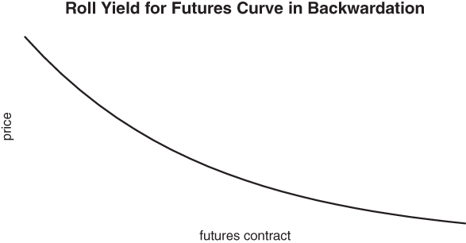
图4.26 在期限结构处于贴水的市场中维持连续做多头寸

虽然我们“神话般的”收益率曲线策略依赖于每天平仓一只10年期零息债券，但期货通常每个到期周期滚动一次。滚动做多头寸需要卖出近月同时在次月（即第二个活跃交易的月份）重新建立做多头寸。只要曲线保持贴水，你就可以持续以比买入次月更高的价格卖出近月。这每次合约滚动时产生等于（近月价格–次月价格）/（近月价格）的收益。主权收益率曲线倾向于比不更经常地向上倾斜，因为投资者通常要求补偿承担久期风险。这表明债券期货合约的展期收益率通常应为正。

量化展期收益对投资者回报的长期影响是有启发性的。在下一节中，我们将展示展期收益在长期时间范围内主导大多数实物商品的现货价格运动。

## 横截面研究

Till（2006）提供了具体证据，表明商品滚动期货合约的收益与现货商品本身的收益明显不同。这可能对我们决定在期货市场做方向性押注产生影响。如果固有的展期收益率为负，你需要有高确信度或短目标持有期来证明买入期货是合理的。

假设你基于央行将进行竞争性货币贬值的假设，对黄金持看涨的长期观点。你不能购买实物黄金，因为你既没有地方储存它，也没有接收和交付它的机制。所以你最终买入黄金期货并每隔一段时间滚动一次。还假设期货期限结构处于升水，这意味着长期限期货以高于短期期货的溢价交易。

为了维持黄金头寸，你必须滚动期货，通常在持仓量从一个合约转移到下一个时。如果曲线保持升水，滚动持续有成本。你反复地必须以比买入次月更低的价格卖出近月期货。换句话说，你一遍又一遍地低卖高买，所以你的持有收益是负的。因此，当你交易黄金期货时，你并不是真的在交易实物黄金，而是现货商品与其持有成本的组合。这统一适用于所有期限结构不完全平坦的期货合约。

多位作者研究了实物商品回报与商品滚动期货策略回报之间的关系。在长期范围内，事实证明期限结构的形状是决定性因素。标的资产的变动被展期收益所淹没。图4.27以微小修改更新了Till（2006）的分析。我们覆盖了10种交易最活跃的实物商品，使用1995年到2015年的数据。x轴给出每种商品的平均贴水水平。更具体地说，如果近月和次月远期价格分别为F1和F2，我们对每种商品计算(F1 – F2)/F1。然后我们对整个期间的(F1 – F2)/F1取平均。

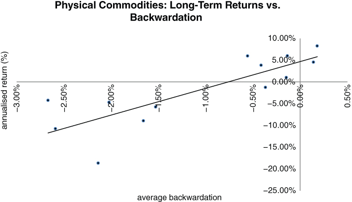
图4.27 期货期限结构对各种实物商品长期收益的影响

我们可以从图4.27中得出几个有意义的结论。大多数点位于y轴左侧。这意味着商品期限结构倾向于处于升水。大致来说，升水比贴水更常见。其次，回归线强烈向上倾斜，R2约为0.65。持续贴水的商品，即大豆和取暖油，具有最好的长期滚动期货收益。在没有供应冲击时以升水交易的商品，如天然气，具有非常负的年化收益。有人可能会说散点图中只有10个点，意味着回归基于单薄的数据集。然而，我们会争辩说，通过在20年的周度数据上平均(F1 – F2)/F1这个量，每个点都是扎实的。图中的点并不非常嘈杂。

现在应该很清楚，特定市场的期限结构平均形状与已实现期货收益之间存在强烈关系。因此，在通常处于贴水的市场滚动做多头寸、在处于升水的市场滚动做空头寸似乎是有利的。两种策略长期都产生正持有收益。债券期货、低利率高股息环境中的股票指数期货以及个别商品（如取暖油）是滚动做多策略的良好候选。

需要提出一个警示性说明。由于可定义的结构性原因而持续处于贴水的合约，持续买入是一回事。这个直接策略似乎有效，至少在足够长的时间范围内。不起作用的是，试图在一条通常处于升水的曲线突然变为贴水时跳进去捕获展期收益。例如，天然气期货可能在供应冲击后转为贴水。短期价格上涨超过长期，因为投资者假设当前短缺最终会得到补救。然而，此时期货曲线可能非常不稳定。当你基于未来能以更低价格滚动的假设买入近月期货时，你是在假设期限结构的形状不会随时间改变太多。在供应冲击之后，这个假设可能是灾难性的。天然气现货价格可能非常迅速地下降，迫使期限结构回到升水。在这种情况下，你的隐式曲线交易（做多近月、做空次月期货）将严重对你不利。

在下一张图中，我们探讨了天然气期货贴水水平与其4周远期收益之间的关系。该图基于1995年至2015年的历史期货数据，每周频率。让我们将近月期货价格记为F1，次月价格记为F2。相对于近月合约的贴水程度由(F1 – F2)/F1给出。当F2 > F1时，期限结构向上倾斜，即处于“升水”。当F2 < F1时，处于贴水。我们现在可以比较某个时间范围内的远期收益与期限结构贴水程度。结果总结在图4.28中，假设我们按照滚动4周区间计算远期收益。

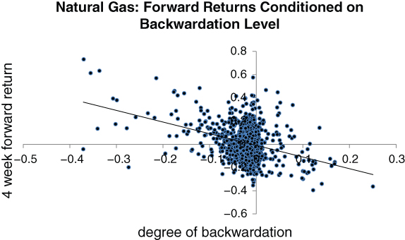
图4.28 天然气期货远期收益在曲线转入贴水时实际上下降

在曲线倒挂后买入天然气是一个亏损策略。确实，长期表现主要由曲线温和升水时的负收益累积驱动。这是最频繁发生的场景。然而，最佳的个别收益发生在天然气曲线陡峭时，最差的收益发生在曲线倒挂时。可能严重升水的收益基于隐性的价值交易。分母F1在(F1 – F2)/F1中相对较低。相反，曲线倒挂后的回弹可能是剧烈的。

在横截面基础上情况如何？结果是相似的，并在图4.29中给出。我们为更大的实物商品集合重复了天然气回归。历史回溯窗口为20年。

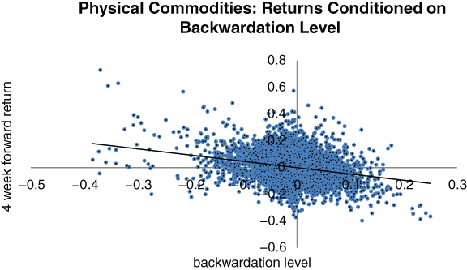
图4.29 收益对贴水水平的横截面依赖

结果大致相似。大多数点位于y轴左侧，表明储存成本和其他考虑通常迫使期限结构进入升水。偶尔转入贴水的移动应该卖出，因为概率倾向于曲线正常化。如果展期收益要在长期被利用，它需要是可靠的。在供应冲击后买入近月期货看起来就是不对。专门的商品交易员总是在寻找已经转入贴水的期限结构。他们通常会尝试通过卖出近月期货并在曲线更远处对冲来压缩价差。据说这些交易员大多数时候能赚钱。他们在曲线平坦化时是否承担极端事件风险来收取收益尚有争议，但这不相关。在风险事件后没有出色的时机把握，你不太可能通过做多近月期货获得持续利润。

你真正需要的是一个持续处于贴水的市场。只要收益率曲线向上倾斜，国债期货就是一个优秀的选择。从1982年到2015年，美国10年期收益率大约在90%的时间里高于3个月国债利率。给定向上倾斜的收益率曲线，10年期国债期货必须以低于现货债券的价格交易。注意我们在这里略过了几个技术细节。例如，有一篮子债券可以交割到期货合约中，它们的久期可能远短于10年。然而，粗略的论证如下。如果期货以与最便宜可交割现货债券相同的价格交易，你可以通过卖出期货并借钱买入可交割债券来获得保证利润。然后，你在到期时是平仓的，已经收取了（可交割债券收益率–国债收益率）的年化收益，该收益大于0。随着你沿着曲线走得更远，期货通常会降价。同样的套利论证适用，使用更便宜的现货债券和更大的债券收益率与借款成本之间的利差。在没有转换因子的情况下，我们对更便宜的债券应用更大的折扣。因此，给定向上倾斜的收益率曲线，债券期货应以贴水交易。

## “新”VIX：模型独立，尽管不是特别直观

在这一点上，我们转入对VIX实际衡量内容的讨论。从1990年到2002年，VIX的计算方式相对简单。计算依赖于取前两个月中三个最接近平值的期权，然后应用Black-Scholes并进行一些平均。特别地，三个最接近的行权价将根据它们与平值行权价的距离进行平均。然后前两个月将根据它们与恒定30天到期窗口的距离进行平均。请注意，原始VIX计算源自标普100期权，而新VIX聚焦于标普500。

在某个时候，依赖于模型的量变成了禁忌，根据监管机构，不再可交易。我们觉得这很有趣，因为监管机构毫不犹豫地接受基于风险价值（VaR）或其他方法论的依赖模型的风险计算。当前VIX基于方差互换的定价公式，如Carr（1998）。方差互换是一种合约，基于已实现方差与互换“行权价”之间的差异进行支付。行权价基于市场对未来已实现方差的预期。事实证明，方差互换行权价可以直接从市场看涨和看跌期权价格的加权平均定价，无需参考Black-Scholes或任何其他定价公式。行权价为K的虚值看涨或看跌期权的贡献与1/K^2成正比。这意味着深度虚值看跌期权（即K较小）如果其价格不太小，可能对方差互换的价格产生重大影响。随着看涨和看跌期权价格上涨，预期方差也上升。新VIX只是方差互换行权价的平方根。

更新的VIX公式确实比原始公式有一些优势。特别是，它纳入了所有可用的行权价，这给出了对市场风险厌恶水平稍微更依赖偏斜的看法。方差互换也有一个相当纯粹的设计，因为定价不需要对标的资产分布做任何假设。已经证明，如Hiatt（2007），新公式相当准确地跟踪了旧公式。缺点是普通人并不理解新计算的复杂性。如果普通人担心更复杂的公式随着看跌偏斜极端区域变得扭曲而可能在未来开始大幅偏离，这不是普通人的错。

## 现货VIX：绿洲还是海市蜃楼？

理论上，VIX由于多种原因可以是一种有吸引力的对冲。VIX与标的标普500指数（SPX）之间的相关性历史上非常高且为负，使用日度观察值超过-80%。虽然是均值回归的，但VIX倾向于具有超过SPX的5倍波动率。VIX翻倍的可能性远大于SPX在短期内暴跌-50%的可能性。这表明相对较小的头寸可以走很长的路。与期权不同，现货VIX没有显性的时间衰减。

在导论中，我们提到如果你能完美预测危机，对冲要么是微不足道的，要么是不必要的。同样的思路适用于现货VIX。如果你能买入现货VIX，对冲一个风险资产组合通常会相当容易。不幸的是，这是一个巨大的“如果”。你可以在你的股票或信用组合中持有静态做多的现货VIX头寸。可能还有进一步优化的方法，但这将是一个极好的起点。请注意，现货VIX是媒体引用的数字。它有两个构成理想对冲的特征，即对标普500持续负相关，且没有时间衰减或负持有成本。在图4.30中，我们跟踪了一个无杠杆组合的表现，该组合包含90%标普500和10%现货VIX。一点点VIX对你的整体投资组合产生奇迹般的效果。

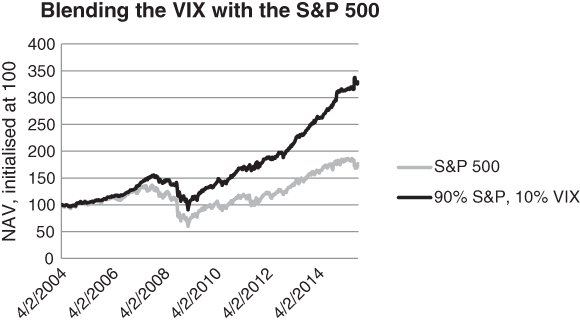
图4.30 10%现货VIX配置对标普指数收益的影响

结果是令人震惊的。混合投资组合的复利收益大约是纯指数的两倍。NAV（净资产价值）从2009年到现在几乎以直线移动。这看起来好得令人难以置信。我们似乎偶然发现了一个拥有巨大alpha的非常基本的策略。市场真的如此轻易地给出回报吗？在VIX的情况下，答案结果是一个响亮的“不”。当我们尝试实施买入VIX策略时，立刻变得清楚的是，上图中的收益无法被复制。不可能直接买入VIX。在实际意义上，VIX并不存在；引用的数字对买方投资者来说几乎无用。确实，VIX计算基于上市标普期权的加权平均价格。然而，你必须随着指数移动不断再平衡你的复制组合，以确保你的所有期权都是虚值的。你还必须为能对指数产生有意义影响的深度虚值看跌期权支付买卖价差。复制组合将包含数百个虚值看涨和看跌期权，造成可怕的混乱。从买方角度看，再平衡将是禁止性昂贵的。

期货提供了一种表达短期标普波动率看法的直接方式。它们自2004年起在芝加哥期权交易所（CBOE）上市。到期时，VIX期货必须收敛于现货VIX，因此二者之间存在密切的函数关系。人们很容易得出结论，你可以把精确复制留给银行，直接买入期货即可。当我们在上述混合90%、10%组合中用滚动VIX期货头寸替换现货VIX时，这种方法的不可行性变得明显，如图4.31所示。

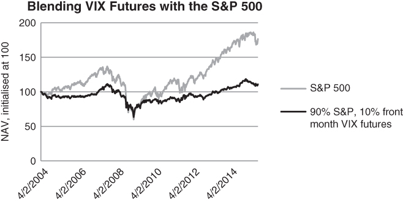
图4.31 添加VIX期货到静态做多标普500头寸的影响

虽然现货VIX实质性改善了风险调整收益，但VIX期货显著降低了表现。买入并滚动VIX期货是一种极其昂贵的防范灾难的方式。表现的差异令人震惊，乍一看令人惊讶。为什么会这样？我们只是简单地将计算中的现货VIX替换为远期VIX。问题在于，VIX期货期限结构大多数时候倾向于处于严重升水。VIX不是一种可交割商品，VIX期货的期限结构反映了机构对过度对冲的需求。驱动VIX期货曲线的结构性失衡创造了吸引收益率曲线交易员和其他“套利者”注意的交易机会。

我们到达了一个关键节点。为什么不应用VIX公式并简单地尝试复制它呢？如果在存在跳跃的情况下用标的复制标普指数看跌期权是危险的，那么对于大多数买方投资者来说，VIX复制实际上是不可能的。正如俗话所说，你无法买入现货VIX，就像你无法买到一个晴天一样。用波动率对冲最终是有挑战的。从VIX公式推理，你将不得不拥有每一个有持仓量的虚值看跌和看涨期权，并在平值行权价移动时进行再平衡。平均而言，你将不得不每天再平衡几次，如下面的数量级论证所表明的。假设标普500在2000点交易。标普期权行权价通常相隔5个点，或指数的0.25%。在平静的市场条件下，1个标准差的1日变动约为1%，这意味着你将不得不每天多次买入和卖出大量期权。成本会累积起来，因为你还需要每天再平衡以维持恒定的30天到期特征。

为了理解负展期收益的影响，我们只需要看数据。在图4.32中，我们跟踪了近月VIX期货相对于现货VIX的溢价，作为时间的函数。虽然期货与现货之间的价差一直相当波动，但我们可以看到平均期货溢价非常高，约为6%。近月期货价格与现货之间的差异通常被称为基差。

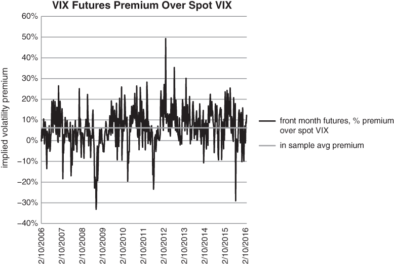
图4.32 历史VIX期货相对于现货VIX的溢价

传统基差是我们持有到期时关心的问题。对于永久滚动策略，我们更担心近月和次月VIX期货之间的价差。这将决定维持做多头寸的成本。在图4.33中，我们跟踪了VIX期限结构短端的平均升水水平。这与Till和Eagleeye（2003）使用的惯例不同。我们现在在考虑维持做多期货头寸的成本，而不是为处于贴水的合约收取的风险溢价。具体来说，我们追踪了2006年到2016年初（次月期货价格–近月期货价格）/（近月期货价格）这一量的演变。

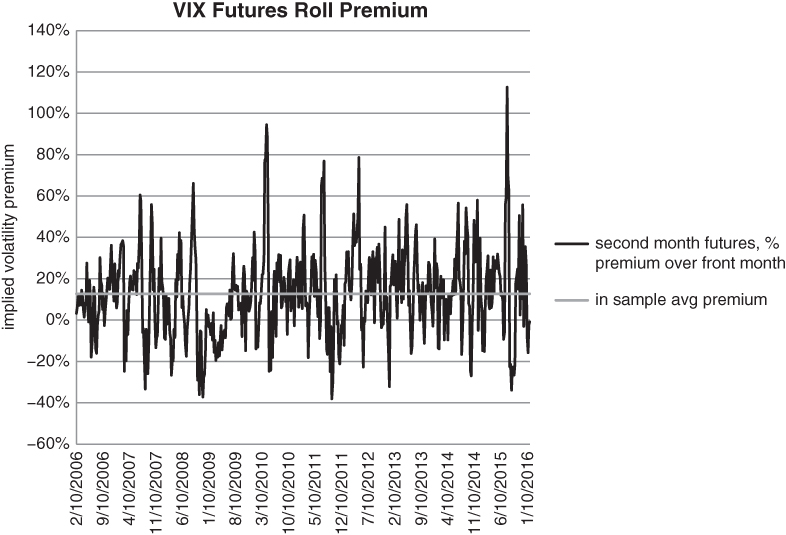
图4.33 近月VIX期货对次月溢价的历史视角

灰色直线是整个期间的样本内平均值，具有可怕的意涵。我们每次滚动时大约需要少买10%的次月合约，假设我们没有向头寸添加现金。这表明我们的波动率对冲会同时亏损并随时间萎缩。含义是，我们不想正面迎击VIX。通过机械地滚动VIX期货来维持做多波动率头寸实在太昂贵了。一个想法是买入现货VIX的虚值看涨期权，基于展期暴露相对间接的假设。这个想法的问题是，虽然看涨期权到期时基于现货VIX结算，但它们的交易参考VIX期货。你的瞬时展期成本等于（看涨delta）*（等效力久期期货的展期收益）。所以你仍然有对展期成本的部分暴露，这被看涨期权的时间衰减所复利放大。

无论是在期货还是期权形式中，VIX都不是一种买入并持有的工具。你必须以某种方式精细化操作或择时。但如果你能为VIX期货或期权择时，你为什么一开始还需要它们呢？你可以简单地通过每当你有VIX买入信号时卖出适当数量的标普期货来利用VIX与标普500之间的高结构性相关性。这将给你相似（虽然可能不那么爆发性）的暴露，同时消除展期成本。

结构性挑战是使投资变得有趣的事情之一，也许我们应当以不同方式看待。一个潜在的解决方案是重新审视做空标普比率价差的想法，稍加变化。不交易比率价差，你可以卖出VIX期货同时超配买入虚值VIX看涨期权。卖出看涨比率价差结果证明是次优的，因为10 delta VIX看涨期权不像10 delta标普看跌期权那样提供价值。在考察做空期货、做多看涨期权策略之前，我们需要分析VIX期权的特殊属性。这是下一节的主题。

## 迁移到VIX期权

本节最终提出一种以相对较低成本提供VIX凸性收益的策略。该策略在风险规避状态期间被证明特别有用，此时标准对冲总是被过度定价。在构建我们的对冲之前，我们首先需要讨论VIX期权的一些复杂性。

我们观察到，虽然VIX期权参考现货VIX结算，但其价格取决于具有适当到期日的VIX期货合约。例如，如果你买入一份9月VIX看涨期权，你会将9月期货价格（而非现货VIX）代入Black-Scholes来为看涨期权估值。这是合理的。9月VIX期货给出了市场对9月到期时现货VIX位置的最佳估计。使事情复杂化的是，VIX期货并不以纯粹确定性的方式依赖于现货。它们不是根据标准的持有成本公式定价的。事实上，没有简单的公式让你能够将VIX远期曲线定价为当前利率和现货的函数。相反，它们反映了不同时间范围内标普期权和期货本身的供需动态。在这方面，它们与实物商品期货有质的不同。

这表明在风险事件期间，长期限看涨期权可能不会像人们预期的那样升值。如果现货VIX从20跳到50，我们不应期望3个月50行权价的看涨期权会处于平值。期货期限结构定价了一定程度的均值回归，很可能3个月期货更接近20而非50。因此，我们不能依赖长期限VIX看涨期权来对冲间歇性的短期风险事件。它们很可能不够敏感。

一个明显的替代方案是聚焦近月期权。原则上，短期VIX看涨期权可以是强有力的极端事件对冲。然而，在买入接近到期的VIX看涨期权时，你面临多重逆风。展期成本倾向于在期限结构短端最高。因此，你面临高时间衰减和严重展期成本的双重打击。然而，存在补偿性因素。至少，短期虚值VIX看涨期权是活跃的。假设你买入1个月标普500看跌期权。如果指数在几周内上涨+10%然后突然下跌-10%，看跌期权通常会亏损。时间将过去而没有现货的净变化。接近到期时，看跌delta将逐渐消失。然而，1个月VIX看涨期权可能会产生可观的收益，因为VIX很可能比期初高得多。虚值行权价在到期周期晚期仍然活跃。在适度的时间范围内，VIX翻倍的可能性远大于标普暴跌-50%的可能性。因此，VIX看涨期权比标普看跌期权更有可能跳入实值，尤其是在接近到期时。

结构性问题也在起作用。VIX期权市场在某种意义上是不正常的，它几乎鼓励VIX期货超调公允价值。特别是，VIX期权的持仓量超过VIX期货持仓量。如果大多数投机者做空了虚值VIX看涨期权，在风险事件期间将没有足够的库存来delta对冲它们。当我们还考虑到VIX固有的跳跃性时，复制做空看涨期权似乎极其危险。如果有足够大量的投资者尝试用期货对冲做空看涨期权，可能会有足够的买入压力将极高行权价的短期看涨期权推入实值。

VIX看涨期权的一个好特点是它们在接近到期时变得更强有力。在这方面，它们类似我们之前讨论的看涨和看跌蝶式期权。我们知道任何期货合约必须在到期时收敛于现货，VIX期货也不例外。有趣的是，长期限VIX期货几乎不像现货VIX那样波动。市场在期货中定价了一定程度的均值回归。这表明随着到期时间缩短，期货应当变得越来越波动。我们在稀疏的图4.34中显示这一点。我们在图中考虑VIX的前四个期货合约。这些合约的到期日相差一个月。接下来我们计算每个合约以及VIX的滚动30天标准差。然后我们绘制每个标准差与VIX标准差的比率图。期货展期在到期前一周进行。

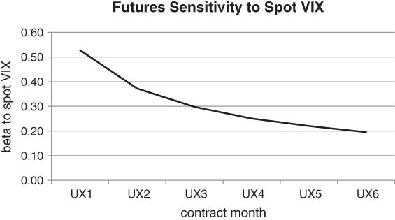
图4.34 近月VIX期货对现货VIX变动相对敏感

近月期货是高度敏感的，对现货VIX的beta超过0.5。它们比其他的更活跃地跳跃。这意味着虚值VIX看涨期权在接近到期时应当相当活跃。高行权价在周期晚期更容易达到。只要VIX隐含波动率在接近到期时不被过度定价，周期权可以再次提供巨大的潜在收益。

在我们被买入大量低delta VIX看涨期权的想法冲昏头之前，我们需要记住一件事。我们不像从标普看跌偏斜那样从VIX看涨偏斜中获得同样的好处。我们已经看到标普看跌偏斜在危机期间如何陡峭化。这给了标普虚值看跌期权一个额外的价格加成。虽然在那些时刻平值波动率确实倾向于飙升，但看涨偏斜可能在两翼变平甚至下降。市场可能在VIX看涨偏斜的远端定价了一些均值回归。这种策略创造了VIX上的凸性收益。众所周知，VIX期货通常在严重升水状态下交易，这意味着滚动做多头寸具有压倒性的负持有成本。近月VIX期货相对次月的平均折扣约为6%。这随时间激进地复利放大。VXX（一只实施近月VIX期货滚动头寸的美国ETF）自2009年1月推出以来已亏损-99.72%，并需要多次4:1反向拆股才能以合理水平交易！

让我们组合这些信息：近月VIX期货通常以不可接受的溢价交易于现货，且随着期货向现货滚动，展期成本以递减的速率影响VIX看涨期权。我们能从这些观察中构建一个策略吗？一个解决方案是卖出VIX期货同时超配买入VIX看涨期权。这让你能够以1:1的比例从期货中捕获展期成本。同时，如果现货不移动，看涨期权对展期成本的暴露随时间减少。相反，如果VIX大幅上涨，你迅速从delta调整后的做空头寸变为做多头寸。这表明该策略应当在VIX上产生凸性收益。数据证实了这一点。

让我们举一个具体例子。在下面的图表中，我们比较了做多VXX与做空VXX同时搭配1.5份做多25 delta看涨期权的周收益。如果波动率要么下降要么大幅上升，做空VXX、做多1.5份VXX看涨期权策略显著受益。收益明显是“跨式期权样”的，而你不需要在两侧支付权利金。虽然二次回归的截距为负，但该策略相对于做多头寸实际上产生了正alpha。散点图中的大多数点位于y轴左侧，一些远在左侧，这确保了VXX以可怕的方式复利下跌。

我们的对冲相对做多VXX头寸的表现如下所示。请注意两种策略在孤立状态下都亏损，但我们的对冲表现显著领先。另请注意y轴使用对数单位，这减弱了我们对冲中观察到的变动，但允许我们比较两种方法中相对的展期衰减。

对于我们做空的每份VIX期货合约，我们需要买入15份50 delta看涨期权来构建一个初始delta中性的头寸。比例为15:1。请注意我们买入15份而不是1.5份VIX看涨期权，因为期货合约乘数是1,000，而期权乘数是100。做空期货/做多看涨期权策略在概念上类似于我们之前讨论的标普500上的做空1×2看跌比率价差。如果波动率飙升，delta变得强烈为正，结构提供显著保护。相反，随着波动率下降，看涨delta减少。结构然后具有净负delta，即局部做空波动率。这意味着你delta调整后的展期收益暴露是正的。你以不断增加的速度从升水期限结构中受益。相对于滚动做多VIX期货，结构的可变delta产生alpha。图4.35依赖2006年至2015年的周度数据，表明做空期货/做多看涨期权策略通常优于滚动期货基准。

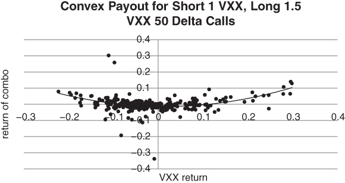
图4.35 超配买入VXX看涨期权策略的凸性收益

交易中的周alpha是35个基点，对应大约+20%的年化超额表现！虽然在没有市场时机把握的情况下该策略仍然亏损，但它不受负展期收益的持续拖累。

散点图表明收益函数相对于滚动VIX期货策略是温和凸性的。如果VIX近期飙升，这可能是具有吸引力的。你推断风险厌恶水平不会原地不动。市场处于不稳定均衡，类似于从旋转中心倒挂的钟摆。标普可能要么崩盘，迫使波动率再次飙升，要么恢复，导致波动率急剧下降。在两种情况下，做空VIX期货/做多VIX看涨期权方法应当表现相对良好。还有其他方式可以在提供极端事件保护的同时捕获展期收益，例如使用VIX看跌价差而非期货。然而，这些在概念上类似于做空期货、做多看涨期权交易，因此我们在这里不包括它们。

读者可能想知道为什么我们聚焦于买入平值VIX看涨期权而不是沿偏斜走得更远。中等虚值VIX看涨期权的一个困难是看涨偏斜倾向于非常陡峭，可能过于陡峭。历史上，25/50 delta隐含波动率价差相对较大，尽管波动。我们可以在图4.36中看到，1个月25 delta看涨期权的隐含波动率通常比50 delta看涨期权高10%到40%。如果平值波动率为100，25 delta波动率通常将在110到140之间。我们怀疑存在对虚值VIX保护的大量机构需求，导致这些看涨期权持续昂贵。

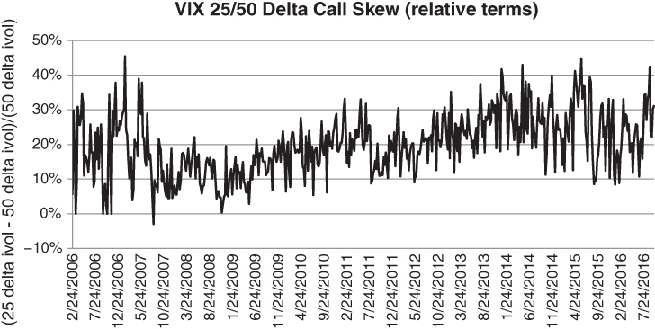
图4.36 VIX 25 delta看涨期权历史上以大幅溢价于平值看涨期权交易

做空期货/做多看涨期权策略的一个缺点与保证金有关。由于VIX期货在不同的交易所交易于VIX期权，对冲腿需要分别存入保证金。这增加了为对冲提供资金所需的权益数量。一个合理的替代方案是做空VXX ETF份额，同时买入VXX看涨期权。然而，我们必须接受ETF将具有可变借入成本，且看涨期权可能不如其VIX对应物流动性好。

## 对图4.36的反思

图4.36表明我们的策略基于VIX的变动具有强凸性收益。它特别受益于期货的大幅变动。二次回归显示了策略的凸性属性。回归形式为 ，R2约为0.25。这里，a、b和c均大于0。不要被误导认为既然截距为负，我们的策略具有负alpha。策略的“真实”alpha可能接近于0，且在其对投资组合的影响方面具有实质性正值。标准的alpha解释仅适用于线性回归。单因子线性回归形式为 。我们可以将x视为基准的收益，y视为跟踪基准的主动管理人的收益。 是回归的y截距，即回归线与y轴相交的位置。在因子模型的语言中，它也衡量管理人的技能。如果 大于0，意味着管理人可以在没有市场暴露的情况下产生正收益。对于二次或更高阶回归，这种解释是不充分的。我们的策略显然对VIX的变动具有非线性依赖。该策略在VIX大幅变动时表现特别好，无论方向如何。相反，如果标的没有变动，它会表现不佳。这是你为对冲支付的隐性统计费用。

想象我们构建了一个期权头寸，其收益为(S(T) – S(t))^2 – C，其中C >= 0。截距在构造上为负，收益函数类似于做多跨式期权。如果S(T)落在S(t)，你在交易上亏损–C。然而，假设C足够小且S(T)具有非零波动率，该头寸的预期收益必须为正。这对应于这样一种观念：只要现货波动率大于0，必定存在某个价格使得期权被低估。基于标准线性回归，我们生成正截距，即 ，其中 。

还需要论证为什么我们可以如此确信这种结构将在标普500严重回撤期间提供保护。回想一下，我们曾警示在构建对冲时不要过度依赖跨资产类别的相关性。在某些情况下，间接对冲相对安全，即使不是万无一失。而在其他情况下，依赖的相关性可能在你最需要它时消失。用一个风险资产的看跌期权对冲另一个风险资产的暴露大多数时候有效。例如，假设美国隐含波动率相对便宜，买入标普500看跌期权来对冲欧洲股票和信用风险似乎是合理的。通过这种方式，你可以最小化对冲系统性风险事件的成本。然而，在一个历史上与你的核心组合负相关的随机资产上买入看涨期权是潜在危险的。国债是典型的例子。在过去30年中，国债在股票抛售期间上涨，意味着持续负相关。然而，在高通胀环境中，并不能保证它们应当如此。我们参考Ilmanen（2003）对这一微妙之处的详细讨论。鉴于我们的保留意见，VIX看涨期权是否提供对股票风险的坚如磐石的对冲？毕竟，它们在扮演负相关资产的角色。我们认为它们确实如此，因为VIX和标普500在结构上是相连的（见图4.37）。VIX看涨期权不直接防范标普的不利变动。然而，VIX直接衡量该指数保险的价格。这意味着VIX看涨期权将防范标普500看跌期权价格的上升，如果你决定以后购买保护的话。VIX看涨期权的表现与标普抛售幅度之间的联系是牢固的。VIX和标普之间的机械联系意味着VIX与标普之间长期很可能存在大幅负相关，就像过去一样。

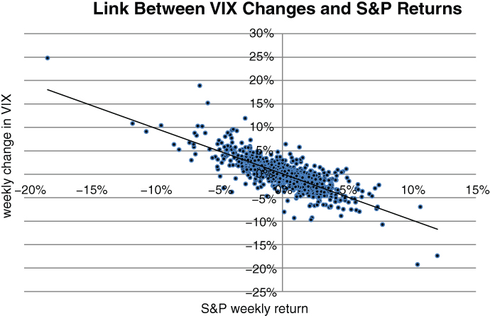
图4.37 VIX变动与标普收益之间的强结构性联系

## 迁移到不同市场：V2X

我们已经展示了如何构建VIX期权结构，在最小化负持有成本的同时提供对风险事件的显著保护。我们能否将相同的技术应用于其他波动率指数，如V2X？理论上，我们可以通过涉足其他市场来多元化我们的对冲覆盖层。请注意，V2X是欧洲斯托克50指数的VIX类比物。截至本文撰写时，V2X的交易效率远不及VIX。这使对冲变得困难。近月V2X期货对欧洲斯托克50指数的严重下跌提供了合理准确的保护。然而，期权和期货市场都不够发达或流动性好。这限制了可能对冲的范围。例如，过去几年中V2X期货期限结构中一直存在12月凹陷或扭折，如图4.38所示。

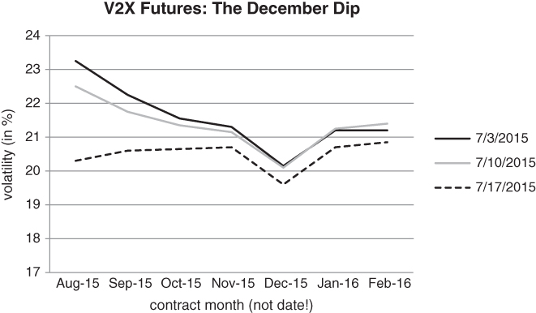
图4.38 圣诞老人卖出V2X期货同时试图买入全球股票

期限结构中的12月凹陷非常令人讨厌。感觉像是一个你挠不到的痒。诱惑是试图交易掉圣诞凹陷。一个明显的想法是买入11月/12月/1月蝶式期权，买入2份12月期货同时卖出各1份11月和1月。这笔交易在凹陷消失时会盈利。你会不成比例地从圣诞V2X合约中获利。收益率曲线通常没有季节性凹陷。你只能在12月预期已实现波动率显著低于周边月份的情况下主张凹陷的存在。VIX期限结构没有这种不规则性，如图4.39所示。

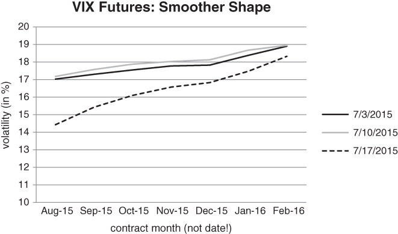
图4.39 相比之下，VIX期货中的12月凹陷是温和的

这意味着如果你需要对冲做多欧洲股票的组合，使用VIX期权可能更好。虽然VIX对冲明显不够特化，但在重大风险事件期间它应当表现出更可预测的行为。不同行权价和到期日很可能以协调一致的方式行为。在任何对冲委托中，你需要在特化性、可预测性和成本之间找到平衡。截至本文撰写时，V2X过于不可预测，无法正确达成这种平衡。

## 风险状态分析

我们在本书中多次强调“每条狗都有它的一天”这一主题。每个期权结构都有它闪耀的时刻。即使是一个看起来愚蠢的期权组合也会在正确的场景中令人钦佩地产生收益。有些对冲在平静市场中表现优异，而其他的在波动率上升后提供相对良好的价值。我们如何量化各种期权策略的条件表现呢？我们首先需要一个状态指标，用以在任何给定时间指定市场的状态。我们可能对去向一无所知，但至少我们知道现在在地图上的位置。然后，我们可以根据当前状态将每个对冲结构的表现制成表格。这种方法使我们能够在市场中无论发生什么都能选择合理的对冲。从我们的角度看，在“风险规避”阶段提供良好价值的对冲尤为宝贵。这些可能是市场已经开始抛售之后的最佳防御策略。简而言之，它们满足了我们“第二只靴子落地”的要求。

在本节中，我们构建一个简单的状态指标，并用它来条件化我们上面描述的对冲的表现。我们使用VIX作为全球资产类别风险的代理变量。每当VIX充分高于其3年历史均值时，我们说市场处于“风险规避”（risk off）状态。否则，市场被称为“风险偏好”（risk on）。风险规避阶段的特征是股票指数下跌、信用利差扩大和外汇波动率增加。相反，“风险偏好”指的是一个温和的市场，要么在上涨，要么没有太多移动。如Malek（2009），我们已校准状态指标，使其在风险偏好阶段花费更多时间。这在直觉上是正确的。你希望在市场中投资的时间多于持有现金的时间。市场大多数时候确实倾向于上涨。你希望收获可用的风险溢价，同时避免潜在的灾难。有句俗话说“在市场中的时间比择时市场更重要”。虽然这可能看起来像是自我陶醉的文字游戏，但它在这里适用。想象你是一个纯做多美国股票基金管理人，但75%的时间必须持有现金。假设指数有正漂移，你需要异常精准的时机才能在合理的时间范围内接近指数。相反，根据这种方法，当情况看起来很糟糕时，你不想待在那里。如果你设法避开了那些不频繁发生但毁灭性的回撤，但大多数其他时间在市场里，你可能掌握了跑赢市场的秘诀。这颠覆了产生alpha的问题。市场beta现在是你的被动收益来源，而风险管理产生alpha。思路是在市场顺利时赚钱，在市场恶化时退出。

这是一个合理的方法，前提是风险资产大多数时候上涨。然而，每隔一段时间，它们的进展会被急剧抛售或长时间熊市所阻碍。Malek（2009）使用比VIX更广泛的风险指标来将各种对冲基金策略的状态基础表现制成表格。这个指标更全面，试图处理波动率在利率、货币和股票指数之间异步移动的情况。但这种复杂性是必要的吗？值得检验VIX是否足以作为风险指标，有两个原因。当我们根据状态分类各种对冲策略的表现时，我们希望验证我们的结论不会对指标的选择过于敏感。我们最不想要的是一个在大量指数上优化的高度复杂的风险指数，因为它不太可能是可靠的。但还有另一个更重要的原因主张简单。我们想说服自己，在严重危机期间，你在哪里对冲其实并不重要。我们已经论证过，顾问倾向于过度关注精确的对冲，而在危机中能完成工作的便宜东西可能更可取。然而，我们尚未为这一论断提供太多证据。我们的论点是，你可以在风险货币、股票或高收益债券上买入看跌期权。所有这些都是公平的猎物。在极端市场条件下，跨风险资产类别的隐含波动率将是交织在一起的。如果为真，你可以专注于在跨资产类别中寻找廉价的对冲，而不过度关注最精确的对冲。图4.40表明，基准股票和货币隐含波动率的周度变化具有强劲的统计相关性。

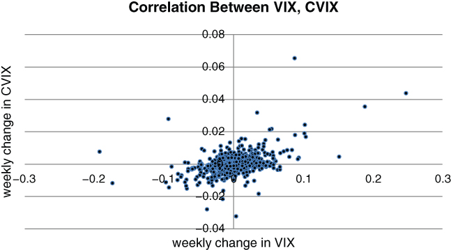
图4.40 货币和股票指数隐含波动率的周度变化是相互关联的

在图4.41中，我们验证VIX确实是一个充分的风险指标。它可能无法捕捉市场抛售的所有微妙之处，但它能充分标记最严重的抛售。我们从三个隐含波动率指数开始：VIX、CVIX和MOVE指数，一个用于股票、一个用于货币、一个用于债券。VIX衡量美国股票指数风险。CVIX是VIX的货币类比物。它衡量9个主要货币对聚合的3个月隐含波动率，对EUR/USD、USD/JPY和GBP/USD交叉盘有相对较大的配置。MOVE指数是恒定到期2年、5年、10年和30年期美国国债1个月隐含波动率的加权平均值。回想一下，恒定到期“债券”不对应具体债券，而是从到期目标附近的债券收益率加权平均构建。我们然后计算每个指数的3年滚动Z分数。Z分数简单地衡量指数距离其均值多少个标准差。如果指数的Z分数为2，则它比正常水平高2个标准差。这是一个显著差异，表明该指数严重升高。

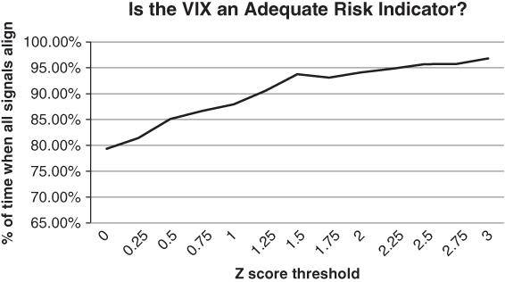
图4.41 CVIX、MOVE和VIX指数随着VIX上升变得日益相关

在计算了VIX、CVIX和MOVE的Z分数之后，我们可以检验每个指数是否同时触发“风险规避”信号。特别地，我们选择一个阈值，然后提出以下问题。如果VIX的Z分数高于阈值，CVIX和MOVE的Z分数是否也高于阈值？如果是，CVIX和MOVE只是在确认VIX已经表明的事情。结果表明，随着阈值上升，3个波动率指数几乎总是一致的。例如，每当VIX高于正常水平超过2个标准差时，CVIX和MOVE也将在约95%的时间里高于正常水平超过2个标准差。

同样重要的是验证CVIX不会在没有VIX确认的情况下飙升。我们不希望一个风险指标飙升的实例集合远大于另一个指标飙升的实例集合。这意味着VIX（比如说）可能错过货币市场中的重大“风险规避”事件。在图4.42中，我们将CVIX换为VIX并重新应用阈值检验。

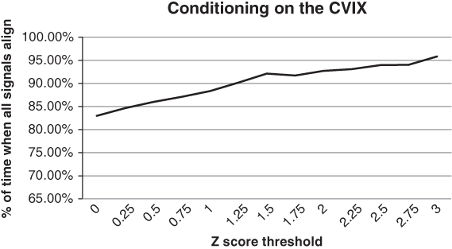
图4.42 当CVIX高时，MOVE和VIX指数也倾向于被激活

## 对冲策略的条件表现

在没有特大事件的情况下，买入和卖出固定delta期权是长期亏损策略。考虑到这一点，我们希望识别最适合特定市场状态的行权价。在图4.44中，我们绘制了我们的二元VIX衍生风险指数。“风险偏好”和“风险规避”阶段分别用+1和-1表示。当市场风险偏好时，投资者更多受贪婪而非恐惧驱动。他们想要买入股票和信用，同时卖出波动率。相反，风险规避阶段涵盖了从谨慎到极度恐惧的情绪范围。

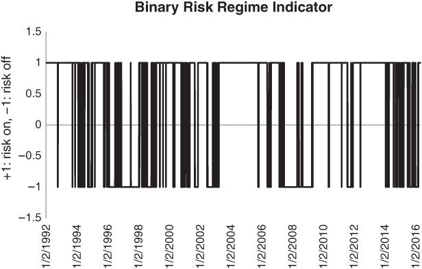
图4.43 我们的国际条形码风险指标

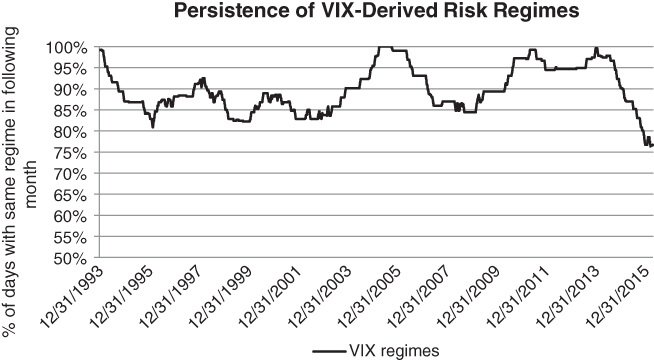
图4.44 自2013年以来风险状态持续性下降

请注意，我们计算了VIX的2年滚动Z分数，并在Z分数低于0.5时将其映射为+1，否则为-1。这创建了偏向“风险偏好”阶段的二元信号。基于安静（牛市）市场通常比动荡（熊市）市场持续时间更长的观察，我们希望风险偏好阶段比风险规避阶段更频繁。假设Z分数序列合理地正态分布且均值为0，0.5的阈值意味着市场将在大约70%的时间里处于风险“偏好”状态。

基于状态进行策略选择的方法在直觉上应当在+1到-1之间没有太多切换时效果最好。更简洁地说，我们希望指数具有持续性。这使我们能够以合理的信心超配在当前状态下通常表现良好的策略，相信状态不会随时改变。图4.44使用移动2年窗口来计算当前状态从一周到下一周保持不变的频率。

该指数通常相当粘性，意味着配置到在当前状态下表现良好的策略是一个合理的长期思路。然而，自2013年底以来，持续性出现了明显的下降。这表明投资者在承担风险的欲望上相对精神分裂，高频地从贪婪摇摆到恐惧。

我们的风险指数使我们能够得出关于在给定市场状态下适当对冲的一些结论。它形式化了期权策略的“每条狗都有它的一天”方法。图4.45总结了不同delta的1个月标普看跌期权的平均周表现，以状态为条件。我们将10、25和40 delta看跌期权买入策略的收益进行了标准化，使它们的样本内波动率与50 delta看跌期权波动率匹配。例如，如果我们希望它们的已实现波动率匹配，我们需要买入比25 delta看跌期权更多的10 delta看跌期权。黑色柱子显示前一周为风险规避时的平均表现。灰色柱子基于前一周为风险偏好时的情形。黑色柱子低于灰色柱子并不令人惊讶，因为在波动率跳升后对冲成本增加。

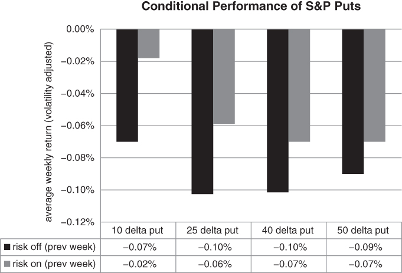
图4.45 不同delta看跌期权的相对表现，以来自前一周的风险状态为条件

我们想知道当前状态是否给我们关于接下来做什么的线索。

10 delta标普看跌期权在过去10年中在两种状态下都表现更优。即使在波动率调整的基础上，它的衰减速度也比具有更高delta看跌期权的滚动策略更慢。在风险偏好期间的差异尤其大。另一个观察是10 delta看跌期权（波动率调整后）在两种状态下都优于25 delta看跌期权。这表明具有25和10 delta行权价的做空1×2看跌比率价差是一种合理的“全天候”策略，正如我们之前讨论的。平方根收益在无条件统计角度具有优点。然而，1×2在市场风险偏好时尤为引人注目。这可能是一个成本问题。10 delta看跌期权似乎在平静市场中提供良好的相对价值，因为当投资者心情愉快时看跌偏斜倾向于相对平坦。

我们可以对VXX看涨期权进行同样的分析，如图4.46所示。VXX是一只交易所交易基金（ETF），试图复制短期VIX期货滚动策略的表现。VXX的期权数据只能追溯到2010年，因此我们不得不满足于相当短的研究。或者，我们可以尝试分析不同delta的VIX期权，使我们能够回溯得更远一些。然而，检验VIX期权策略可能是危险的。我们需要计算与给定看涨期权到期时间精确匹配的VIX远期价格，否则我们的Black-Scholes隐含波动率将被错误指定。

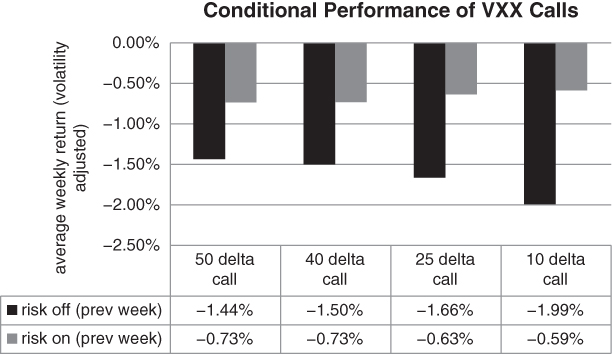
图4.46 不同delta VXX看涨期权的条件表现

与图4.45一样，我们匹配了每种看涨期权买入策略的波动率。这里，结果没有压倒性地倾向于单一的delta。50 delta看跌期权似乎在风险规避环境中表现最佳，而10 delta看涨期权最适合风险偏好环境。当VIX隐含波动率飙升时，投资者倾向于高估虚值看涨偏斜。

## 小结

从本章中可以得出几个重要结论。

- 股票指数上的深度虚值看跌期权通常比机构青睐的温和虚值看跌期权提供更优越的价值。
- 你可以通过卖出看跌比率价差来利用机构偏见，即卖出少量被高估的虚值看跌期权来为买入大量深度虚值看跌期权提供资金。
- 做空比率价差可以让你在危机来临前以低成本获得对隐含波动率偏斜的加杠杆做多暴露。
- 虽然VIX在理论上作为投资组合对冲具有吸引力，但实施是一个主要障碍。你在买入VIX期货时要么面临严重的展期成本，要么面临均值回归。VIX看涨期权面临时间衰减的额外障碍。在实践中重新创建现货VIX极其困难。
- 一个合理的替代方案涉及同时卖出VIX期货并超配买入平值VIX看涨期权。这显著减少了对展期成本的暴露，同时提供了隐含波动率上的凸性收益。换句话说，该结构从波动率在任一方向的大幅变动中受益。
- VIX期货/看涨期权策略在风险规避状态下可能有用，即在波动率上升之后。如果你相信波动率可能从其当前水平大幅脱离，它是一个有用的第二只靴子落地策略。
