# 第5章：多空之道

我们在第4章的分析表明，隐含波动率偏斜往往被错误定价——市场对中度虚值期权存在过度需求。但期限结构呢？我们希望探讨近期期权与远期期权相比所蕴含的价值。在这个问题上，要精确判断更为困难。从经纪商的资金流向来看，机构投资者似乎偏好到期期限为几个月以内的对冲工具。依赖滚动周度期权的策略并不常见，而包含多年期期权的策略（除利率市场外）同样罕见。我们可以从这样一个假设出发：如果期限结构上存在价值，那它很可能集中在到期时间极长或极短的期权上。我们要避免中期期权——如果每个人都想买入某样东西，那它必然昂贵。

## 短期期权

一些交易员认为你不应该持有利到期日较近的期权。标准论点是，短期期权的时间衰减最大。图5.1计算了标普500平值期权的时间衰减随到期时间的变化情况。如果你买入固定金额、不同到期日的期权，而某一天标的资产没有任何波动，短期期权损失最多。这对任何Delta值都成立，例如，固定金额的短期25Delta认沽期权的时间衰减速度快于同等金额的长期25Delta认沽期权。然而，当你在波动率飙升后买入短期保护时，有若干因素对你有利。我们将在下一节探讨这些因素。

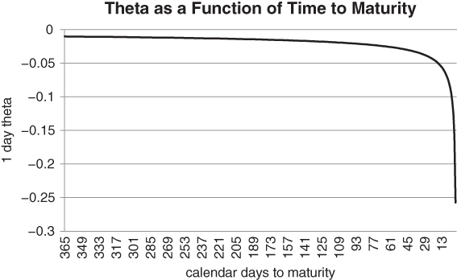
图5.1 固定Delta期权的时间衰减随到期日临近而加速

研究期权的一种方法是分析时间（到期日）和空间（行权价）上的极端情况。例如，通过对比极短期与极长期期权，你可以获得深刻的洞见。极短期期权的特征是Gamma与Theta之间的激烈角力。每一个平静度过的交易日都会侵蚀掉大量权利金，这对期权持有者不利。然而，大幅波动则可以带来惊人的收益回报比。周度期权带来10倍甚至更高回报的情况并不罕见。风险投资界引以为傲的"四倍股"——即获得原始投资四倍回报——与此相比简直相形见绌。你有可能获得IPO级别的回报，而无需承担相应的风险。

我们先来看Theta。对于极短期期权，Theta可能被误读。图5.1展示了平值期权Theta与到期时间之间的关系。

我们在x轴上以到期时间递减的方式呈现数据，这使得Theta的剧烈衰减更易于可视化，因为它发生在远离y轴的地方。由于当T-t趋近于0时，Theta趋近于−∞，人们很容易得出结论：短期期权衰减太快，不具备实际用途。如果标的资产不迅速波动，短期认沽期权将很快被"烧尽"。在这种背景下，你似乎需要对进入时机的把握达到完美。但这个问题可以从另一个角度来考虑。虽然短期期权确实具有严重的衰减，但我们可以认为它们"已经衰减过了"——这是许多个中等负Theta天数累积影响的结果。它们的绝对价格相对于所能提供的保护量来说是很低的。在固定预算下，你可以买入数量相对较大的短期期权。你的保护可能不会持续太久，但在市场剧烈波动期间，这可能决定生死存亡。如果你对市场的判断立即得到验证的话，大量买入期权的能力会大幅提升你的盈利潜力。在图5.2中，我们追踪了一张平值认沽期权随时间流逝的价格下跌情况，假设标的资产价格和波动率均未发生变动。为你的投资组合设置一周的价格下限，成本大约是一年期下限的1/8。

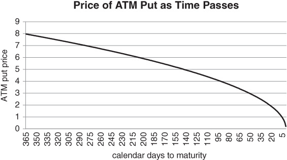
图5.2 平值保护在临近到期时迅速变得便宜

对于行权价比标的资产低固定百分比的虚值认沽期权，其权利金百分比衰减速度更快。图3.27中的"蝙蝠侠"交易正是依赖于这一现象。当你买入平值跨式期权并卖出2个虚值宽跨式期权时，你是权利金净支付方。然而，你的Theta在临近到期前仍然是正的，因为时间衰减对两侧的冲击比中心位置更为剧烈。

当标的价格接近行权价时，短期认沽期权具有大量的Gamma。相比之下，长期期权的收益曲线要平直得多，这意味着无需频繁进行Delta对冲来应对价格变动。长期期权更敏感于投资者的风险厌恶水平，而非标的资产价格的实际变动。对于到期时间较长的低Delta期权来说，这一点尤其适用。在这里，"风险厌恶"就是隐含波动率的代名词。你无法对冲Vega风险，除非你已经知道未来投资者的情绪会如何变化。有人可能会说，仅剩一天到期的中度虚值认沽期权Gamma也不大。从严格意义上讲，这没有错。微妙之处在于，1天虚值认沽期权具有极大的"潜在Gamma"——Delta的大幅跃升近在咫尺。标的资产价格的温和下跌可能使认沽期权的Delta迅速滑向-1，沿着盈亏曲线迅速攀升。这正是我们将周度期权视为紧急对冲工具的原因之一。实践中的关键问题是：标的价格是否能波动到足够远以捕获这种"弹弓效应"？我们需要从统计上把握这个问题，以证明周度期权买入策略的合理性。理想情况下，我们希望看到在短期窗口内存在大量意外的大幅波动。

至少对于股票指数而言，情况似乎对我们有利。在数天的时间跨度内，相当数量的温和初步下跌会转变为恶性抛售。重要的是，这些事件的频率超过正态分布所能预测的水平。价格按照正反馈循环演变——初步波动之后，投资者被迫进入市场。日内交易者和其他资金薄弱的投资者如果严重站错方向，就只能按下逃生按钮。无论市场上是否已被置入明确止损指令，一张大额卖单都可能按顺序触发另一张。标准计量经济学技术未必是分析这些波动的正确方法，尤其是当反馈函数是非线性的时候。如果恐慌程度足够高，市场几乎可以不连续地从一个水平跳到另一个水平。

在下一节中，我们将讨论一些统计证据，表明市场在短期窗口内具有特别厚的肥尾分布。现在暂且假设这一经验性论断是正确的。那么，你就可以以相对便宜的价格通过周度期权买入Gamma，在对你的投资组合可能造成最大损害的期限内进行对冲。如果你买入并持有中期到期期权，你将实质上在市场回报相对温和的时间段内支付了权利金。这会降低虚值对冲的预期收益。

## 物理学家登场

多年来，许多物理学家和应用数学家尝试分析金融数据。他们是早期的"大数据"科学家，因为金融市场拥有丰富的数据，但缺乏坚实的理论基础。50多年前，Mandelbrot（1963）提出理论，认为金融市场价格的波动可能具有无限方差。在这个方面，他是一位远远领先于时代的人。一只股票的真实波动率可能是无限的。

让我们仔细消化一下这个观点。具有无限波动率（或方差）的分布与正态分布相去甚远——正态分布的每一个矩都是有限的。对于正态分布来说，超过5或6个标准差的波动几乎从不发生。正态分布的尾部衰减足够快，使得收益的期望值、收益平方的期望值、收益立方的期望值等等，全部都有良好定义。Mandelbrot在分析历史棉花价格时观察到二阶矩的"爆炸"现象。如果他的结论正确，随机游走假说的主要推论将被推翻。资产价格收益将远非正态。随着时间的推移，资产收益是非正态的这一较弱命题已被广泛接受。问题在于，随机游走假说在多大程度上低估了极端事件。传统学术界倾向于"拉伸"标准模型以试图解释异常数据。他们可能在正态分布中添加间歇性跳跃，但不愿意开发全新模型来刻画异常波动。

正态分布是金融现实准确的一阶近似，还是在危机时期会严重失准？无限方差指向严重失准，但在某些情况下收益确实看起来至少相对正态。我们很快就会看到，这个问题的一个答案取决于投资期限。许多年后，Taleb（2007）成功将Mandelbrot的思想融入资产配置的杠铃策略中。基于极端事件在统计上被低估（无论是频率还是影响）的假设，他主张将投资组合配置为安全的短期政府债券，再加上少量你最多只损失初始投资的高风险投机性押注。这是对传统投资组合理论的彻底背离，其假设是长期收益可能更依赖于分布的尾部而非中心。

我们向Taleb致敬，但我们的目标更为温和。我们的目的是总结一些研究表明股票指数在短期窗口内具有肥尾分布。这项研究对周度期权有实际应用价值。据我们所知，经济物理学的研究成果与周度期权之间的关联从未受到过太多关注，我们相信以下讨论具有新颖性。将统计物理学和动力系统的技术应用于大量金融数据的研究领域，有时被称为"经济物理学"。这种学科融合大约在20年前开始获得关注。在此之前，金融经济学家在持续寻找风险溢价——这些溢价只能在长期限内提取——的过程中，从未特别关注过高频数据。然而，海量的日内数据已经存在了很多年，到20世纪90年代，计算机已经强大到足以处理这些数据。在这里，我们仅限于总结波士顿大学Stanley团队在20世纪90年代末撰写的一篇论文，即Gopikrishnan（1999）。顺带一提，似乎正是Stanley本人创造了"经济物理学"一词（据Gangopadhyay，2013），所以我们无疑是追溯到了源头。我们的首要目标是证明低Delta周度期权在统计上可能很便宜。该论文追踪了当X变大时，P(ξ > X)和P(ξ < −X)的量值。这些定义了分布的"渐近行为"或极值。注意，P(ξ > X)是从底层分布中随机抽取ξ大于阈值X的概率。P(ξ > X)描述分布的右尾，P(ξ < −X)描述左尾。我们在此关注左尾，因为它指向股票指数和其他风险资产的下行风险——这些是我们通常需要对冲的对象。如果收益服从正态分布，P(ξ < −X)对任意α，其衰减速度都将快于1/X(α)，当X趋于无穷时。但事实证明，在短期窗口内情况并非如此。在1分钟间隔内，作者发现左尾α约等于3。换言之，尾部以正比于1/X³的速度衰减。这表明分布不是正态的，但在极值处可能满足幂律。大幅波动的方差可能是有限的，但偏度和更高阶矩很可能是无限的。我们不能确定1分钟收益的方差是否有限，因为存在"墨西哥比索问题"：那个超大规模的标准差事件可能尚未被观测到。

当分区窗口扩展到超过一天时，我们回到35年期间的日度数据。α随窗口大小缓慢增长，表明向正态分布逐渐收敛。根据数据外推，1天10个标准差的收益预计大约每10,000个交易日发生一次。相比之下，在分区宽度为16天的情况下，1/10,000的下行波动预计约为4个标准差幅度。这在我们实际数据中看到的幅度相比简直微不足道。

Gopikrishnan（1999）认为，短期窗口内肥尾的机制是序列相关性。大幅波动倾向于在同一方向上堆积。对于标普500，我们观察到收益的自相关性随着分区宽度收缩趋近于0而增加。持续性是在短期窗口内创建肥尾分布的机制。卖出可能引发更多卖出——短线交易者追逐波动，而其他投资者则被迫进入市场以管理自身风险。这意味着我们可以"事后"使用周度期权。如果出现显著下行的波动，我们可以押注其延续，凭借统计证据站在有利一方，买入短期认沽期权。我们不需要机械地每周滚动周度期权，因为那样成本会高得难以承受。我们更可以等待市场下跌，假设在未来几天内发生极端左尾事件的概率已经增加。如果历史可以作为参考，你通常会在市场崩溃之前收到一些预警。使用事后方法，周度期权策略可以以更低成本和更稀疏的方式实施。最后，我们以几句警告收尾。虽然许多期货合约可隔夜交易，但周度期权合约通常不能。这意味着你无法使用周度期权策略来防范周末或隔夜事件。你需要等待现货开盘才能激活对冲。这表明周度期权需要辅以对时机依赖更少的对冲策略。另一个障碍是流动性。虽然标普500、欧洲斯托克50以及部分个股和ETF的周度期权相对具有流动性，但可交易周度期权的范围仍然相当小。如果你需要对此范围之外的特质或冷门风险进行对冲，可能会运气不佳。

以下是该论文摘要中特别重要的一段：

我们发现，对于t ≤ 4天（1560分钟）的情况，分布与幂律渐近行为一致（原文如此），特征指数α ≈ 3……对于超过4天的时间尺度，我们的结果与向高斯行为的缓慢收敛一致（原文如此）。

我们可以看到，在4天标记处存在一个从厚尾到近似高斯行为的相当急剧的转变。这意味着我们最好专注于剩余4天或更短的期权，即周末过后的周度期权。周内期权让我们暴露于底层分布尾部最厚的期限窗口内。这是一个令人欣喜的巧合：尾部最肥厚的期限窗口，恰恰是Vega最低的期限窗口。如果市场试图通过对隐含波动率出价上调来调整增加的前瞻性风险，我们可以简单地将行权价进一步移到虚值，以降低Vega敞口。

虽然周度期权是应对短期下跌的有力方式，但它们并非万无一失。当然，这适用于每一种期权策略。如果市场在周五收盘时崩盘，我们就很难有所作为。如果我们买入下周五到期的认沽期权，由于该期权尚有7天到期，我们就会失去理论优势——在这一期限窗口内，底层分布很可能相对接近高斯分布。如果我们严格遵循论文的结论，通过滚动周度期权策略维持持续保护将变得代价高昂。

可以这样说，特定Delta的周度认沽期权滚动策略所需的权利金支出通常大于使用月度认沽期权的策略。如果我们将Delta固定为25，周度认沽期权的行权价起点将比月度期权更接近标的价格。这是一个很好的特性，但每周刷新行权价是有代价的。在图5.3中，我们粗略假设一个月恰好为4周。然后我们比较了欧洲斯托克50指数4张1周25Delta认沽期权与1张1个月25Delta认沽期权的价格。我们在此例中离开标普500使用欧洲斯托克50，纯粹是为了增加多样性。

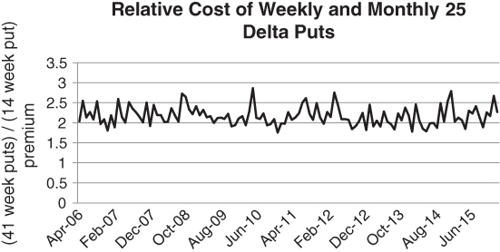
图5.3 机械式刷新周度认沽期权可能代价高昂

买入并重新加载周度期权通常需要相当于月度认沽策略2到2.5倍的权利金。从滚动成本的角度来看，周度期权贵得惊人。这警告你：只应在需要的时候买入周度期权。你只有有限的次数可以"去井边打水"，超过之后对冲成本将变得难以承受。市场在宣告，周度认沽期权的"刷新"选项具有显著价值。周度期权到期实值的频率远高于月度期权。

读者可能已经注意到，我们的分析严重依赖于约20年前的研究。如果自那以后情况发生了变化呢？在不完全重复该研究的情况下，我们在此提供间接证据，表明价格波动的标度律随时间并未发生实质性变化。我们从标普500指数期货开始分析。首先，我们使用1995年至2015年的数据，计算21天收益的标准差σ(21)。这一时期大致接续了Stanley团队研究结束的时间点。注意，一个日历月大约有21个交易日，因此这是一个合理的惯例。然后，我们将σ转换为各n天收益率序列的标准差。如果价格按照随机游走演化，√(n/21) × σ(21) 将是所有n的正确转换。在我们的例子中，n的范围为1到25天。这个转换的含义是什么？在布朗运动的世界里，收益的标准差以√(n/21)的速率扩张，我们预期大于 √(n/21) × σ(21) 的收益比例与n无关。具体而言，"2 sigma"事件的频率对于任何分区n都应约为4.55%。回顾一下，当你从正态分布中抽样时，预期95.45%的样本落在均值的2个标准差以内。等价地说，预期4.55%的样本是2+标准差事件。但随机游走构造并不正确，如图5.4所示。

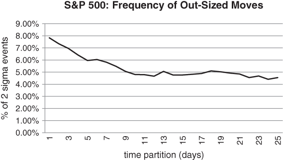
图5.4 标普500中2+标准差收益的频率，基于分区宽度

对于1天期收益，2+标准差收益的发生率几乎是σ(21)预测值的两倍。在不到一周的期限内存在大量异常值。随着分区宽度增加，我们分布的极值看起来越来越像正态分布。当我们向图5.4右侧移动时，曲线趋于平稳，接近4.5%的目标水平。这表明，在经历大幅短期下跌之后，指数倾向于均值回归。至少，它不太会延续趋势。请注意，我们没有考虑较大的分区宽度（即n较大），因为那时我们将需要考虑序列的平均收益——我们将要计算相对于历史平均收益的偏离，而该平均收益在未来可能会大不相同。

现在我们拓展到其他股票指数，与Stanley团队的论文一致。在图5.5中，我们可以看到英国富时100指数和德国DAX指数大致遵循相同的下行路径。图5.5对每个分区宽度取了富时指数和DAX指数曲线的简单平均值。从技术角度来说，我们计算了Hurst指数的粗略版本，如Beran（1994）所述。这衡量了一个随机过程具有"记忆性"的范围。

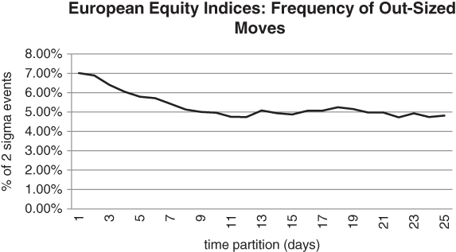
图5.5 2+标准差收益的频率，DAX/富时指数混合

我们还可以进一步扩展范围，并不困难。图5.6列出了全球集中型债券期货组合中2+标准差波动的频率。具体而言，我们取了美国10年期国债期货、德国国债期货（Bund）和日本国债期货（JGB）的等权重组合。如上，我们对三份合约的频率取了平均值，使用1995年至2015年的数据。

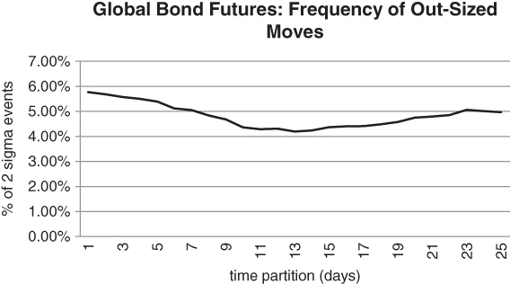
图5.6 全球债券期货市场2+标准差收益的频率

现在，我们面临一个更复杂的局面。我们观察到从1天到大约10天分区频率的常规衰减。然而，对于更宽的分区宽度，曲线现在掉头向上。这给我们一种印象：债券这一资产类别存在较大的周内收益，暂时停滞之后会接着延续。这可能是一种动量效应。债券在中长期内倾向于形成趋势，从而放大最初剧烈短期的波动。在第6章中，我们将描述自1980年代以来债券期货如何具有很强的"趋势可追"特性。现在，我们观察另一个典型事实：债券期货曲线似乎从未偏离4.55%的理论水平太远。从这个意义上说，债券在短期窗口内比股票指数更"乖巧"。但话虽如此，那些并不频繁的2个标准差波动可能远大于正态分布所能预测的幅度。

我们以一个理念性的观点结束本节。如果你使用期权来对冲或表达观点，你可能是在摘取相对"低垂的果实"。大多数实证研究试图刻画"原始"证券的价格动态——如股票和债券——而非衍生品如期权。相比之下，期权研究通常侧重于相对于标的资产的定价。Derman（2016）将其简洁地比喻为：根据成分水果的价格计算水果沙拉的公允价值。但还有另一种选择。作为期权投资者，你可以研究关于标的资产收益的文献，看看它是否适用于你交易的期权结构。我们在此尝试遵循了这一思路。

## 买时间

当市场动荡、利润不断流失的时候，许多自营交易员会目不转睛地盯着屏幕。他们开始观察所交易市场中每一个微小的波动、每一个tick。这是一种毫无逻辑基础的"病态"。盯着tick能获得什么呢？如果你在某个市场波动发生之前不知道会如何应对它，那么追踪市场并无优势。在一篇引人深思的文章中，Gray（2014）认为，在许多人们心照不宣地假定专家应当具有卓越洞察力的领域，算法能够超越人类判断。如果事先没有做好计划，你可能在激战正酣时做出糟糕决策。系统化基金可能会说，基于模型的交易消除了紧盯屏幕的需要。系统本身并非会独立思考的机器人。相反，它们依赖于人类在远离市场狂热的冷静环境下开发和测试的规则。当一位国际象棋特级大师被计算机击败时，由此推论出计算机比棋手更"聪明"的说法是错误的。计算机不过是计算器、数据库以及其他大师和开发者在研究环境中的协作努力的集合体。这些使得计算机能够以相对宽阔的视角来评估给定局面。

同样，自营交易员需要时间才能恰当地应对市场动态。然而，市场不会给予这样的奢侈。它不会顾及你的头寸，持续地运动。那么，你如何在一个不等待任何人的市场中为自己争取时间？即使你是模型驱动型交易者，市场条件也可能超出你系统开发所基于的数据范围。周度期权可以提供帮助。它们让你能够以低成本制定退出策略。目前，周度期权在美国的主要股票指数、个股和ETF上均有提供。一些交易所甚至支持"灵活"期权（"flex" options），你可以设定希望交易的行权价和到期时间。因此，在许多情况下，你应当能够构建一个能帮你度过几天的对冲。

以下例子突显了周度期权的潜在用途。假设一位交易员在最糟糕的时间点上，在标普500上做了一个1×2认沽比率价差。具体说，买入了100张1年期平值认沽期权，同时卖出200张1年期25Delta认沽期权。就在这个组合成交的那一刻，市场出现了瞬间的-5%的暴跌。所有行权价上的1年期波动率飙升了5个点（注意，这一简化假设低估了交易中的偏斜效应）。该结构立即陷入困境。一系列灾难性的情景随之浮现，如图5.7所示。

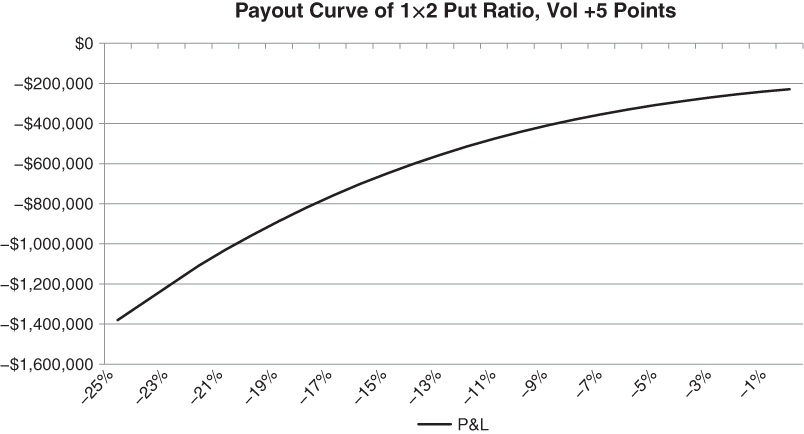
图5.7 波动率扩大对长期1×2认沽比率价差的影响

极大概率上，事情最终会平静下来。然而在当前时刻，继续持有就像玩俄罗斯轮盘赌。此刻，正确的行动方针是什么？你可以直接认输，在经历了灾难性的一天后于收盘时平仓。但考虑到长到期期限期权的成交量不会很大，你很可能会以糟糕的价格脱手。其他投资者也会争相回补他们的空波动率头寸。这将导致所有行权价和所有期限的隐含波动率齐涨。可形变的波动率曲面会上升并变得愈发扭曲。鉴于你的绝望处境，做市商将会狠狠地宰你一刀。

另一种选择是干脆祈祷市场能在夜间恢复。这听起来可能荒谬，但出奇地常见。你所需要的只是市场快速回归"理性"。当价格对一些交易员不利时，他们什么都不做，期望市场会回来。没有任何应急计划。通常，他们的头寸确实会恢复，这在长期内会产生有害的心理影响——它强化了鲁莽行为。任何曾经在深渊边缘摇摆、未采取任何行动并因此获得回报的人，都很可能会再次这样做。最终，市场不再恢复，他们的账户被清零。在波动率飙升之后，图5.7中的1×2比率价差对于交易波动率均值回归和偏斜回归的人来说看起来更具吸引力——结构中的静态"优势"增加了。问题在于你需要价差现在就收敛，否则你可能在更差的水平上被平仓。没有经验的交易员经常选择持有开放式风险的激进空波动率头寸。正如Ed Seykota在Schwager（2012）中的名言所说："有年长的交易员，也有胆大的交易员，但没有年长且胆大的交易员。"

1×2认沽比率价差的Vega轮廓展示了你会多么迅速地陷入困境。从图5.8中我们可以看到，Vega的绝对值急剧增大，只有在指数暴跌超过-15%时才会趋于平稳。

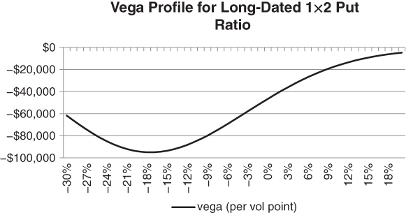
图5.8 1×2认沽比率价差的空Vega敞口，作为价内外程度的函数

随着标普500的下跌，你面临Delta和Vega同时扩大的双重打击。如果你认为波动率被高估，但需要屏蔽极端下行价格的风险，短期Gamma对冲是合适的。周度期权能够比任何算法更快地"挂入"波动——它们的价格持续响应标的价格的变化。它们是你对抗失控算法的终极防御，让你能够专注于自己的核心专业领域。最重要的结论是：特定的期权策略可以使"老派"基金经理继续以他们一贯的方式进行投资，同时防范失控的市场。

在图5.9中，我们绘制了剩余1天与剩余1年到期的认沽期权的盈亏曲线。我们假设两种期权的隐含波动率均为常量，且与标的价格独立。

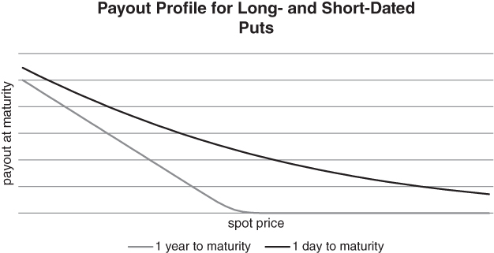
图5.9 长期认沽期权具有相对较高的权利金和Vega，但在行权价附近的Gamma相对较低

我们可以看到，到期时间不多的虚值认沽期权的绝对价格很低。这意味着我们可以针对我们的1×2比率价差买入100张短期认沽期权，以封顶极端事件风险，同时为自己争取一些时间。要么交易会恢复，要么我们可以平掉部分1×2价差，同时变现一些短期对冲的利润。

对于100手规模的1×2认沽比率价差，你的最大敞口约为2000万美元。如果指数下跌足够多，你实质上做空了100张Delta为100的认沽期权。假设这一情景下指数值为2000，乘数为100，你的敞口为100 × 100 × 2000 = 2000万。假设你想使用10Delta认沽期权在2天期限内消除Gamma风险。如果隐含波动率为15%，这些认沽期权的行权价低于标的价格不到2%，每张成本略高于1美元。这意味着你100手的对冲将花费大约100 × 100 × 1 = 10,000美元，或者名义敞口的0.05%。对你来说，这可以是换取几天安心的合理一次性成本！

在2015年和2016年，发生了几起备受关注的基金清盘事件，管理人都声称算法交易干扰了他们的核心投资策略。市场周期性出现高频的大幅波动，这些波动似乎与管理者所认为的市场基本面毫无关系。就我们所知，高频系统在决定买入或卖出时通常依赖于价格和成交量数据。它们观察订单簿中随时间演变的信息。大多数系统属于以下两种类别之一：动量和均值回归。资金雄厚的均值回归策略的影响通常无需担忧，因为这些策略倾向于将价格推回区间内。我们需要担心的是动量策略——它会导致一个方向或另一个方向的闪电般快速波动。再次强调这一点：这是周度期权可以发挥作用的地方。周度期权能够比任何算法更快地"挂入"波动——它们的价格持续响应标的价格的变化。鉴于到期时间短，你无需过于担心权利金膨胀。它们是你对抗失控算法的终极防御，让你能够专注于自己的核心专业领域。

## 长期期权

到期时间长的期权——即T-t很大——与短期期权具有截然不同的特征。Gamma相对不重要，因为盈亏曲线不是非常凸。在光谱的另一端，到期时间超过一年的期权（即长期期权）可以提供有趣且另类的对冲机会。与往常一样，我们试图避免那些许多机构似乎青睐的2%虚值、3个月到期的认沽期权。短期期权往往是Gamma博弈，而当你买入标普500的5年期到期认沽期权时，Vega扮演着相对重要的角色。理解这一点的一个方法是比较不同到期日、固定Delta期权的Vega/Theta比率。

图5.10展示了Vega/Theta与到期时间之间的近似线性依赖关系。准确来说，我们计算了在20%隐含波动率下，一系列到期期限的平值认沽期权的Vega和Theta。假设折现率为0。在现实中，对于多头看涨或认沽期权，Theta为负。为便于说明，我们在计算Vega/Theta——实际上是Vega/abs(Theta)——之前取Theta的绝对值。

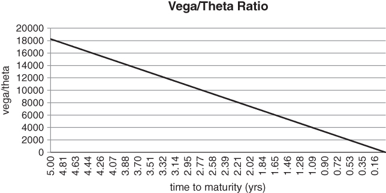
图5.10 Vega/Theta作为期权选择的度量

在隐含波动率较低的时候，买入长期期权以最大化这一比率是合乎逻辑的。然后你可以坐下来，静待波动率上升，而无需过多担心时间衰减。长期隐含波动率的一个好处是，它对标的资产的小幅波动并不是特别敏感。标普500的上涨，在没有波动率下降的情况下，不会影响你2年期认沽期权的价值。有时，标的资产的波动需要一段时间才能传导至波动率期限结构的远期端。这种情况有点像一只巨大的恐龙被咬到了尾巴：恐龙可能需要一段时间才能意识到发生了什么。在一轮抛售的早期阶段，你有时可以在隐含波动率水平几乎未动的价位上买入长期期权。如果你想对冲，而又不想为隐含波动率支付过高的溢价，这会非常有益。

长期期权有时也能提供非凡的价值。银行的结构化产品部门偶尔会创造供需失衡——做市商或专注于流动性交易所交易市场的基金未能吸收这些失衡。例如，当利率持续处于低位时，一些银行提供收益增强型产品，这些产品依赖于在曲线远端卖出期权。自20世纪90年代以来，日本陷入了通缩螺旋，利率徘徊在0附近。我们提到过外汇套息交易如何被日本投资者用作收益替代工具。期权卖出也被日本用作一种创收技术。有时，这对长期认沽和看涨期权造成了极大的卖出压力。波动率期限结构的远端偶尔会变得非常便宜，为波动率价值买家创造了买入机会。

学术文献也提供了一些证据，表明长期期权可能被低估。Pastor和Stambaugh（2012）反驳了一个根深蒂固的信念——即年化股票波动率在较长时间跨度上更低。如果一项资产的预期收益无法通过历史数据进行充分估计，年化波动率实际上可能随持有期的增加而上升。这可以为长期期权的买方创造丰富的投资机会。

## 远离尘嚣

有时，某个资产类别会出现独立的抛售，对其他资产类别不产生即时影响。例如，能源板块可能进入熊市，而股票和债券持续上涨。这些阶段可以为长期对冲提供良好机会。归根结底，各市场是相互关联的，尤其是当多资产类别投资者被迫清算其投资组合时。如果你看到市场某个角落出现不好的事情，一个聪明的策略可能是在其他地方买入期权，等待波动率全面上升。

Pring（2006）提出了投资时钟的概念，其假设是资产类别按一个相当有序的顺序轮动。一个资产类别中的价格趋势不可阻挡地导致其他资产类别中的趋势。我们从12点钟位置的避险模式开始。投资者涌入政府债券这一避险天堂，同时降低股票和实物资产的敞口。当时钟接近3点钟时，波动率开始趋于稳定，投资者开始认为，债券相对于股票的前瞻性回报较低。虽然债券继续上涨，但股票最终进入上升趋势。现在是6点钟。企业终于有足够信心参与长期项目。投资资本从债券，以及较小程度上从股票，迁移到实体经济中，刺激对实物资产的需求。铜和石油等工业大宗商品上涨，新兴市场开始跑赢大市。到9点钟时，通货膨胀上升，达到央行想要踩刹车的程度。利率开始上升，更重要的是，央行开始从系统中撤回信贷。债券遭抛售，然后是股票，最后是大宗商品。循环现在准备重新开始。

我们可以以一种不那么结构化的方式来思考跨资产类别的序贯运动。债券投资者有时对选股者不屑一顾，因为公司专家可能是最后意识到经济已经发生根本性变化的人。当他们偏狭地仔细审视一小撮公司的资产负债表时，整个经济可能正滑入衰退。债券市场发出的重要信号，却被股票分析师群体直接忽视。债券价格不像股票价格那样受到特质风险的影响。这意味着，在许多情况下，债券市场波动率的上升可以是股票指数波动率的先行指标。假设投资时钟的概念是正确的，它对长期期权策略有直接的应用价值。正如广泛的市场趋势可以是不同步的，长期波动率在不同资产类别之间也不一定同步运动。在某些时候，股票波动但大宗商品仍在上行——例如2007年和2008年初。那时，你买入大宗商品波动率作为系统性风险事件的对冲，将受益匪浅。在2007年底，长期大宗商品隐含波动率仍然很低，而其他资产类别已经发生了风险重新定价。

投资管理公司36 South构建了一系列全球隐含波动率指数，即"GIVIX"指数，追踪股票、外汇、利率和大宗商品领域的长期隐含波动率。这些指数可用于识别各期权市场中的价值买入机会。在图5.11中，我们可以看到，2007年大宗商品隐含波动率对股票波动率上升的反应是滞后的。该图基于股票和大宗商品GIVIX指数的5年滚动Z值，以尝试对两个数据集进行标准化处理。

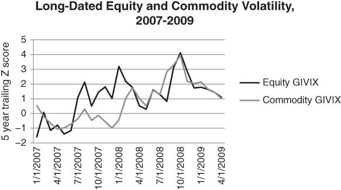
图5.11 全球金融危机期间大宗商品隐含波动率滞后

我们的结论是：即使总体资产类别波动率很高，你有时仍然可以在长期期权中找到价值。

## R减D

假设我们有一只股票指数，其价格为S。无风险利率为r，指数的股息收益率为d。那么到期时间为T-t的远期合约价格为F = Se^{(r-d)(T-t)}。F对r的敏感性为(T-t) × Se^{(r-d)(T-t)}。这是F对r的偏导数，但我们无需以如此技术化的术语来思考。关键在于，随着(T-t)的增长，F对r的敏感度呈指数级增长。这将对不同到期日的期权产生重大影响，我们现在来看看。

我们回顾一下，rho（ρ）是期权对利率小幅变动的敏感度。对于短期期权，rho通常不太重要。无论利率如何，远期价格都将非常接近现货价格。然而，当我们延长期权的到期时间时，rho扮演着越来越大的角色。利率的微小变动可能对远期价格产生相对较大的影响，进而影响期权价格。对于股票指数，我们需要度量对(r-d)的敏感度，其中r是无风险利率，d是指数的股息收益率。如果r > d，远期曲线将是向上倾斜的，即"期货升水"（contango）。这意味着，例如一张1年期50Delta看涨期权的行权价将高于现货价格S。在这种情景下，标的价格实际上可能需要上涨才能使平值看涨期权在到期时处于实值。现在假设我们固定r，单独分离出对股息收益率d的依赖。

F = Se^{(r-d)(T-t)}的远期曲线具有一些有趣的特性。让我们使用欧洲斯托克50股息期货期限结构作为参考，因为基于股息的合约在法国和德国已经相当流行了一段时间。我们看到，期货合约无非是在交易所交易的远期合约。股息期货按年度"年份"交易，12月到期。例如，在2016年2月1日，挂牌上市的合约从2016年12月到2025年12月，按年递增。对于给定的年份，到期价值是该年度已实现的现金股息支付总额。依赖基本面分析的投资者觉得这一特性很有吸引力，因为到期结算基于公司的真实现金流，而非市场对一组公司价值高低的看法。期货正朝向某种有形的东西收敛。前端年度的期货通常不会特别有趣，尤其是在下半年，因为大部分股息已经支付。这意味着到期支付的不确定性很小。前端合约通常以波动率随时间趋向于0的方式缓慢运行。然而，比较后续年份的合约是很有启发性的。在图5.12中，我们计算了前7个年份合约对第2个合约的滚动贝塔。我们的历史数据集从2009年5月到2016年1月。

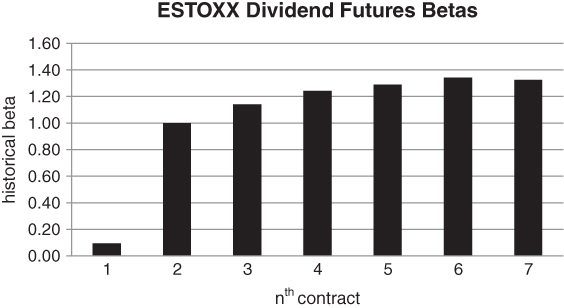
图5.12 欧洲斯托克50股息期货对各合约的历史贝塔

第1个合约的贝塔显著低于更远期年份的合约。这是预期之中的，因为大约平均6个月的股息已经支付。到期支付的不确定性相对较低。更令人惊讶的是，第2个合约的贝塔小于第3至第7个合约。在这里，较小的贝塔意味着远期合约的波动率实质性高于第2个合约。这与我们在利率、波动率或大宗商品价格期限结构中观察到的现象显著不同。在那些市场中，大部分活动集中在现货和前端合约上。变动以递减的速率在期限结构中传播。然而，对于股息期货，恰恰相反，企业前景的下降对曲线远端有着不成比例的影响。这是怎么回事呢？虽然股息政策在短期内往往相对固定，但经济冲击可能对未来较远期的股息政策产生巨大影响。一家成熟的公司通常只有在被迫的情况下——即严重缺乏现金时——才会削减其股息。公司的最佳利益是通过逐步向市场引入削减股息的想法，"摊销"灾难性财报季的影响。坏消息增加了在某个较远期未来削减股息的概率——在公司为市场做好准备之后。

看涨和认沽期权都是基于远期价格F定价的。如果股息被削减，F因d的下降而上升。这增加了远期的价值，使其向行权价靠拢。一张虚值看涨期权变得更接近平值。因此，如果你持有高股息支付指数的看涨期权，你现有的头寸在风险事件发生时实际上可能获益。这乍看起来可能令人惊讶，因为看涨期权本质上是看多的。然而，Delta相关的损失完全可以被上升的波动率和预期股息的削减所弥补。当股息远期曲线下降时，你获得的益处比你想象的要多——因为长期期权具有相对较大的rho（ρ）。在图5.13中，我们计算了一系列平值认沽期权的rho，覆盖了递减的到期期限范围。我们假设对于所有T-t值，(r-d)等于2%。我们观察到rho的绝对值随着T-t趋近于0而以大致线性的速率衰减到0。换个角度看，对于长期期权，rho相对较大。

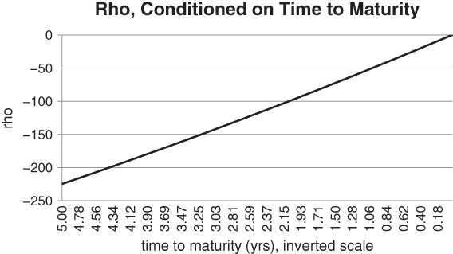
图5.13 长期期权的rho具有相对较大的绝对值

然而，在0利率环境下利用前向漂移确实有一些微妙之处。F = Se^{(r-d)(T-t)}中的"r"令人头疼。虽然银行存款利率可能是0甚至为负，但借入期货合约底层证券的成本可能远高于0。这减少了上述长期看涨期权的有效漂移。

存在重要的补偿因素。你无需过多担心期货对冲上的漂移，因为股息期限结构在短端相对静态。然而，你是Delta中性的、做多波动率，并且能从企业开始削减股息的看跌情景中获益。长期期权的另一个优势可以是结构性的。机会时不时会出现，当追逐收益的投资者寻找能产生收入的"饲料槽"时。在低利率环境中，年金或结构化票据提供商可能试图卖出长期认沽或看涨期权作为收益增强器。这可能人为压低波动率期限结构远端的水平。此时，就有可能基于供需失衡，以折价买入隐含波动率。

信贷市场更直接，因为收益率和对冲成本同步移动。信用对冲的成本随着收益率的增加而机械性地上升。如果你买入一只高收益债券，然后用信用违约互换对冲它，你从收益率中获得的收益会被违约保护成本的增加所抵消。然而，对于套息货币，情况不一定如此。假设一个新兴市场国家处于快速增长阶段。央行可能提高利率以防止经济过热，即防止通胀泡沫。如果你买入该国货币的远期合约，这将增加套息收益。与此同时，外国投资者可能被该国的经济前景所吸引，蜂拥而至、大量涌入资金。于是，你可能会遇到这样一种局面：即期货币稳定或上升，而远期套息收益增加。此时，你的风险调整后预期收益将随更高收益率和更低波动率的共同作用而增加。

如果波动率随套息收益上升而下降，一个有趣的想法是"花掉"一部分超额远期收益，买入虚值认沽期权作为对货币的直接对冲。毕竟，在即期汇率上涨之后，认沽期权的权利金应当相对较低。然而，这个想法存在一个困难。虽然前向滚动（roll down）推动远期朝向有利于你的方向发展，但它降低了你的对冲有效性。除非即期货币急剧下跌，远期都会从你的认沽行权价处漂离。这种情形类似于我们在第4章分析的做空VIX期货、做多VIX看涨期权对冲的策略。前向滚动有助于我们的远期，但有损于我们的对冲。但是，正如我们之前提到的，我们的对冲受前向滚动影响的速率是越来越低的。Delta作为远期漂移的函数而下降。读者可以看到，我们的许多策略都遵循空认沽价差或平方根（即空1×2认沽比率价差）的概念。我们很乐意卖出近端的保险，只要两侧被覆盖甚至被过度对冲就行。这个想法在押韵，如果不是重复的话。我们可以参与任意数量的基于统计的交易，只要极端事件风险得到充分考量。

从纯粹的对冲角度来看，如果能找到一种相对于"安全"价值储存（如美元）具备以下属性的货币，那就太理想了：

- 该货币具有风险，收益呈现负偏。
- 在系统性风险事件期间，它可能表现糟糕。
- 它的认沽偏斜在风险事件之后会变陡。
- 隐含波动率目前处于低位。
- 最后，它的短期利率低于同等期限的美国国债利率（T-bill rate）。

所有条件都将完美对齐。我们可以在平静时期大量买入该货币的认沽期权，然后等待。我们的Theta衰减将被底层远期利率的下行漂移部分抵消。这表明维持该头寸的成本不会很高。在全球市场波动率飙升的事件中，我们将从隐含波动率和偏斜的上升以及货币的下跌中获益。多么美妙的一个组合！从历史上看，风险货币通常具有相对较高的利率，违反上述最后一个条件。它们通常来自新兴市场国家或大宗商品生产国，这些国家也存在通货膨胀的担忧。直到相对近期，像欧元这样的货币才在参与竞争性贬值的同时变得更具风险。截至本文写作时，期限不到5年的德国国债收益率均为负值，为投资者通过欧元认沽期权提供了廉价的对冲机会。虽然确实欧元认沽偏斜已经很陡（在某种程度上违反上述条件之一），但在利率突破0下限的时代，新的外汇对冲机会已经出现。

## 伐木工图

还有另一种可视化超过2个标准差收益的方法。这需要对累积分布函数的坐标轴进行重新缩放。"双对数"（log-log）图在科学领域中被广泛用于刻画分布的极值。其动机如下。当你为某项资产绘制收益的直方图时，很难判断尾部有多厚。极端事件的概率看起来总是非常接近0。我们需要的是一种放大尾部的方法。"双对数"图让我们得以对低概率事件进行放大观察。我们可以按以下方式分别检视分布的左尾和右尾。首先，从标准正态分布（即均值为0、方差为1的正态分布）的左尾开始。收益小于−1 = −10⁰，小于−10 = −10¹，以此类推的概率是多少？我们可以提出一系列的这样的问题并绘制结果。显然，对于几乎所有分布而言，概率序列衰减都很快，因此我们需要使用一个同时能考虑极低概率的标度。具体而言，我们将波动幅度绘制为序列{−10¹, −10², −10³, …}，将概率绘制为序列{−10⁻¹, −10⁻², −10⁻³, …}。对于正态分布，曲线衰减得如此之快，以至于即使在概率呈指数衰减的标度下，你也基本上永远不会看到低于−10⁶的波动。当以这种方式绘制时，其他分布向−∞的走向更为缓慢。具有肥尾的分布可能遵循"幂律"，其中衰减速率是一条直线。当你抽取10倍数量的随机数时，发现一个作为10的巨大次方的负数的概率呈比例增加。

我们应该提到，在幂律之外甚至还有一个区域。观察到的是，双对数图最终仍然依赖曲线拟合。你收集大量数据，在拉伸后的坐标轴上绘制极端波动的概率，然后穿过它们拟合一条直线。有可能回归线是如此平坦，以至于该分布似乎具有无限方差。这已是一个相当重大的结论。但如果有新的数据点到来，且比幂律预测的还要极端呢？毕竟，上述分析在某个层面上仍然依赖外推。Sornette（2003）将这些异常值称为"龙王"（dragon kings）。它们甚至比拟合的幂律分布所能预测的还要大得多。假设我们做多尾部，且龙王没有导致市场失灵，这一区分就不应令我们担忧。当我们买入足够多的虚值期权来覆盖我们现有头寸时，我们的潜在损失在期权有效期被严格限定。等价地说，我们已经截断了底层分布的尾部。我们的组合头寸中不再存在尾部，因此我们盈亏分布中的所有矩都是严格有界的。

### Vega随T-t而增长

短期期权的Vega相对较小。其价格对波动率的变化不太敏感。这意味着你不需要在风险事件之后按波动率角度为虚值期权支付过高溢价。在图5.14中，我们假设持有100张标普500平值认沽期权的多头头寸，到期期限从1个月到15个月不等。假设波动率期限结构在所有期限上都是恒定的17%。然后，我们对所有期限的期限结构施加+5波动率点的"冲击"，并计算对我们认沽期权价值的影响。靠近y轴的长期期权的Vega显著高于右侧更短期的期权。

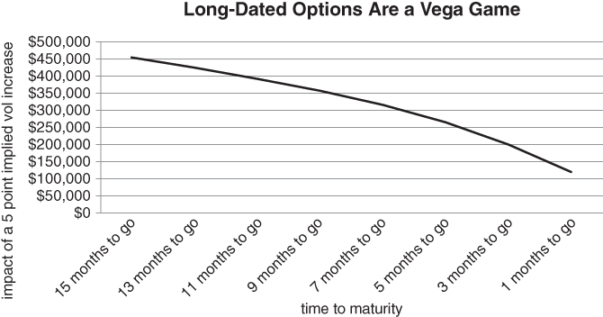
图5.14 长期期权对波动率变化具有相对较高的敏感度

我们承认，长期期权的高Vega部分被这样一个事实所抵消：长期波动率对短期波动率的贝塔相对较低。在抛售的早期阶段，它不会移动太多。但是，如果出现持续的下行波动，长期隐含波动率应当移动足够多，为你带来相对较大的回报。

当波动率飙升时，许多期权变得高不可攀。投资组合经理可能需要对冲几天的灾难风险，同时重新平衡其投资组合。在这种背景下，极短期期权可能很有用，因为它们对波动率的变化不太敏感。在本章中，我们回顾了关于短期窗口内肥尾分布的文献。我们还描述了周度期权如何以低成本提供极高的收益回报比。我们关注隐含波动率如何在不到一周的窗口期内具有持续性。我们还讨论了在无法进行Delta对冲时的获利了结策略。

## 选择性应用周度期权策略

在危机对冲的背景下，周度期权值得重新考量。我们已经知道，极端波动的频率在周内窗口内相对较高，但永续性地买入并滚动周度期权成本极高。然而，我们可以基于以下观察，选择性地应用周度期权策略。当股票市场进入下跌趋势时，高风险可能正在酝酿之中。杠杆多头投资者面临削减风险的压力。事实证明，我们可以使用一个简单的趋势指标作为周度策略的买入信号。以下分析基于标普500的10年滚动数据集。我们计算了在指数的上行趋势和下行趋势期间，25Delta周度认沽期权买入策略的平均收益。我们的趋势指标简单地将上周收盘指数值与其滚动52周均值进行比较。如果指数高于滚动均值，则称市场处于上行趋势。否则，处于下行趋势。具体而言，当标普500处于上行趋势时，认沽期权的平均总收益为每周-0.02%。在下行趋势中——这在样本期内出现的时间不到1/3——策略的平均收益更高，为每周+0.01%。

我们的分析表明，你通常可以等到市场正式进入下行趋势后，再发起你的周度认沽期权买入策略。即便如此，你可能仍然只想在真正需要的时候买入那些认沽期权，以尽量做到审慎。我们承认，我们的周度研究（即使用周五收盘到收盘数据）不能精确地适用于周内认沽期权买入策略。根据我们引用的经济物理学结果，这可能不是最优的。然而，固定的1周持有期使我们能够直接且轻松地测试择时策略的相对表现。

我们的趋势指标使我们能够通过减少买入周度期权的次数来降低对冲成本。具体而言，我们只在市场给出一定确认后才买入。这意味着我们通常会在抛售之后——即波动率相对较高时——加载该策略。值得确认的是，周度认沽策略的相对成本对波动率水平不太敏感。否则，我们的择时优势将被买入周度认沽期权的增加成本所抵消。令人安心的是，周度认沽策略的相对成本与1个月25Delta认沽期权的隐含波动率几乎完全不相关。我们再次使用欧洲斯托克50作为试验对象。

在隐含波动率极高的水平上，期限结构很可能出现倒挂。换言之，短期隐含波动率通常将以溢价于长期波动率的方式交易。然而，根据图5.15，即使在极端情况下，周度25Delta认沽期权相对于月度对应品种似乎也并不异常昂贵。这强化了将周度认沽期权视为最后防线对冲的想法。

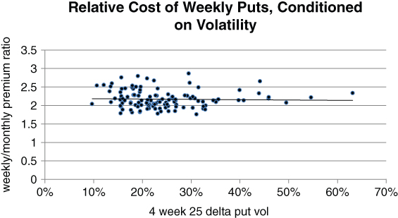
图5.15 周度认沽期权的相对成本对波动率水平缺乏弹性

## 本章小结

这是一件奇妙的事情：同一资产的短期和长期期权具有截然不同的特征。短期虚值期权全是关于Gamma的。它们相对便宜、对波动率不敏感，但在出现大幅实际波动时提供巨大的回报潜力。周度期权受益于传染效应——这些效应往往在短期窗口内具有最大影响。相反，长期虚值期权根据市场情绪重新定价，且不直接依赖价格波动。

因此，策略方案是：在投资者过度自信时买入长期保护，在波动率初步飙升后需要紧急对冲时买入短期期权。从对冲角度来看，中期期权兼具两者的最差特性，一般应当避免。
