# 第6章：趋势跟踪作为投资组合保护策略

> "如果你想赚一百万，你不需要懂钱，你需要懂的是人们对钱的恐惧。"

——威廉·加迪斯，《JR》

在本章中，我们讨论趋势跟踪如何可以作为市场下跌后的风险缓释工具。它为做多期权策略提供了一种潜在的替代方案，尤其是当保险成本（即隐含波动率）已经很高时。我们描述了"趋势跟踪"这个笼统的短语在实践和哲学层面上的含义。我们从多个角度研究动量，计算与波动率指数的相关性，并尽可能地将与保险的类比推向极致。我们的结论不会是确定性的，但将为动量与投资组合保护之间的复杂关系提供一些洞见。最终，我们认为趋势跟踪是一种适度可靠的统计保险形式。并不能保证你的趋势跟踪系统在快速抛售期间一定会上涨。然而，趋势跟踪在结构上具有分散化特性，在持续的熊市中表现出强劲回报的概率很高。

当信噪比较高时，趋势跟踪会从价格波动中受益。一个朝着某个方向快速运动、且途中没有太多震荡的市场是理想的。相反，波动性的区间震荡市场几乎是趋势跟踪者最糟糕的环境。系统很可能会被"反复打脸"，在市场不断改变方向时被迫反复以亏损退出头寸。由于高波动率通常对应市场清算，在风险规避（risk off）环境中更可能出现大规模方向性运动。想要使用趋势跟踪作为保险的投资者，正是依赖于这一典型事实。

## 什么是趋势跟踪？

想象一下，有人给了你一些钱去投资，但你完全不知道该怎么做。价值投资——即试图随着时间的推移买入被低估的证券——不在你的能力范围之内。格雷厄姆（1999）的书从未出现在你的桌上。总的来说，你对某项资产可能值多少钱毫无概念。除了凭空猜测，你还能合理地做些什么呢？跟随价格趋势可能是一个开始。你总是可以跟随大众，并在趋势逆转时有一个退出策略。如果一项资产上涨足够多，你就买入它。如果它下跌足够多，你就卖出它。你只需朝着市场确认的方向进行投资。

许多经验丰富的投资者都是从这种方法开始的，随着他们对市场运作方式"了解"得更多而转向其他领域，最终当他们发现跟随趋势几乎就是他们能做的最有效的事时又回到了原点。趋势跟踪的一个优势在于，它纯粹依赖市场价格，在较小程度上依赖成交量。这个系统是自洽的，因为你做了一个限制性假设，即所有相关信息都已包含在特定市场的价格行为中。一旦你开始纳入经济数据发布、新闻等等，投资问题就变得无边无际。你永远不知道自己是否遗漏了某些至关重要的东西。公平地说，趋势跟踪并不是唯一将自己局限于价格输入的策略。其他技术交易策略属于一个有些模糊的类别，称为"统计套利"。它们可能交易价差的均值回归，或者识别价格数据中更复杂的可利用模式。

然而，趋势跟踪确实比其他模式识别技术提供了一个优势。趋势跟踪信号间接地有助于管理风险。具体而言，该信号迫使你在趋势破裂时减少（甚至消除）暴露。在没有出现超大规模的日内价格跳跃的情况下，亏损头寸的累计损失不太可能变得太大。虽然纯粹的趋势跟踪可能不会提供非常高的风险调整后收益，但它能让你在等待所交易市场中某个出现大规模方向性运动的同时留在游戏中。众所周知，长期趋势跟踪者通常每年在4到5个市场中赚取他们大部分的回报。趋势跟踪的另一个优势是容量。本书前面介绍的一些策略对于大型机构投资者来说不具备足够的可扩展性。周期权在最大交易量方面尤其受限。长期趋势跟踪则没有这样的限制。最大的趋势跟踪者轻松管理着超过1000亿美元的总名义暴露。请注意，基金的名义暴露可以远超基金中的权益资本。只需在保证金账户中存入少量现金，就可以为相对较大的头寸提供资金。对于这种规模的基金，在执行时可能会有一些价格影响。然而，在"正常"市场条件下，通过巧妙的执行交易，这种影响可以被最小化。

一个纯粹的趋势跟踪者承诺一路跟随抛售到底。不存在在空头头寸上（比如说）先获利一部分、然后在稍后找到更高的重新入场点这样的问题。这种心态被埃德温·勒费弗在《股票作手回忆录》（1923）中生动地刻画了出来。这本书写于近一个世纪前，但至今仍然具有现实意义。书中，帕特里奇先生——因他在办公室里踱步时昂首挺胸的样子而被称为"老火鸡"——是一位成功的交易员，也是根深蒂固的趋势跟踪者。故事中，他从不逆主流趋势而行。相反，他会无限期地持有盈利交易，只要它们大致朝着正确的方向运动。有一天，一位同事提出了一个谦逊的建议：也许老火鸡应该考虑围绕一个趋势性的多头仓位进行波段交易，时不时在上涨时卖出，期望稍后以更低的价格买回仓位。如果趋势走出一条崎岖的路径，频繁逆转，交易的总利润就会增加。

"把你手里的那只股票卖掉，等回调时再买回来。你也能降低自己的成本。"

"我亲爱的孩子，"老帕特里奇非常痛苦地说，"我亲爱的孩子，如果我现在卖出那只股票，我就会失去我的头寸；然后我该怎么办？"

今天，几家知名的宏观对冲基金仍然遵循这一原则。他们精心制定投资想法，但特别强调在进入交易前等待市场确认。一旦进入，他们愿意将头寸维持在远超可能被认为是"公允价值"的水平，依赖市场中的缓慢再配置。在2014年年中，谁会想到石油会交易在每桶40美元以下？人们几乎普遍相信生产商会在60美元左右或以下停止开采石油。如果油价进一步暴跌，石油生产和运输将变成一门亏损生意。然而，以下是WTI（西德克萨斯中质原油）的现货价格图。参见下图6.1。
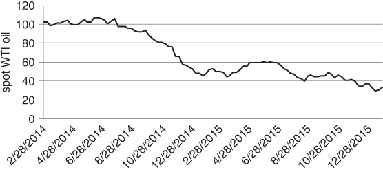
图6.1 趋势的持续可能超出人们的预期

在施瓦格（1992）中，斯坦利·德鲁肯米勒被问及乔治·索罗斯的交易风格。他声称索罗斯具有坚持甚至增加盈利头寸的心理能力，并以"要有勇气当一头猪"作为结语。趋势跟踪系统会自动以这种方式行事。它们不是快速获利了结并让亏损持续（这武断地将亏损交易转变为长期头寸），而是追逐盈利的方向性运动。趋势跟踪系统中编码的"固执"对于需要投资组合保护的客户来说可能非常令人安心。只要风险资产以足够稳定的方式下跌，客户就知道趋势跟踪者会保持做空。下行对冲将始终存在。通过这种方式，趋势跟踪补充了我们在第4章和第5章中介绍的一些期权策略。回想一下，随着隐含波动率上升和看跌偏斜变陡，我们从看跌期权轮换到看跌价差，再到蝶式价差。虽然这些对冲很好地适应了当时的市场环境，但随着风险条件恶化，它们的效力逐渐减弱。看跌价差和蝶式价差不会一路保护你到底。在很大程度上，我们通过将VIX和周期权纳入我们的整体对冲策略来解决这个问题。趋势跟踪提供了另一种机制，用于在波动率已经很高时防范恶性抛售。

## 趋势跟踪的教条

严格的趋势跟踪者有时可能是一群好斗的人。在1990年代末，一家知名趋势跟踪网站的技术支持人员如果你问他们关于数据的问题，就会变得愤怒。

你可能会发送一个看似无害的问题，比如"你们如何调整商品期货合约的展期？"他们会回复这样的回答，"这不重要，市场会趋势。别再问我们无关的问题。"如果给出一个马克·吐温（1883）风格的答案会更好。"我很高兴能立刻回答。我说，'我不知道'。"

事情就是这样。对于某些强硬派来说，没有辩论的余地。然而，如果我们要采取务实的态度进行投资，就需要进一步探讨。在上面的例子中，选择正确的合约间插值方案至关重要。你需要插值方案与你实际计划使用的交易策略相匹配。所谓"插值"，我们指的是从一系列不同到期日的期货合约中构建连续的价格序列。假设你天真地采用近月合约的原始价格，不做任何展期调整。那么，你的趋势跟踪者将不会考虑滚动期货策略的总回报，你的长期系统可能指向错误的方向。对于天然气（历史上一直交易在严重的期货升水中），你会失去由于期货期限结构产生的持续负展期收益所带来的天然做空偏向。

胜率/败率相对较低但回报高的策略往往与教条式的管理人相关联。他们有成为小册子作者的倾向，在策略表现不佳时发表长篇文章来宣扬其策略的优点。这是可以理解的，因为趋势跟踪策略时不时可能陷入长时间的回撤。一个以15%波动率运行的长期趋势跟踪者，如果存活10年，出现30%的回撤是可以预期的。趋势跟踪者用他们的文章来为这项任务锤炼自己。这可能确实是心理上的需要，因为对冲基金的平均投资者往往渴望稳定的回报。

一个经常被传播的想法是，趋势跟踪提供了一种投资组合保险的形式。一些研究，特别是Fung和Hsieh（2001），表明动量策略的回报具有"类期权"的特征。这是一个引人入胜的概念，暗示趋势跟踪可能为客户核心投资组合的损失提供一个底线。然而，正如我们很快将看到的，趋势跟踪与做多期权头寸之间的类比是非常松散的。

## 危机Alpha之争

许多机构基于趋势跟踪策略在不利市场条件下表现良好的假设而配置它们。趋势跟踪者在2008年迎来了辉煌的一年，在风暴中心表现出色。巴克莱CTA指数——在趋势跟踪策略上有相当大的权重——在2008年10月录得+3.45%的回报。纯趋势跟踪者当月的回报通常接近+10%。更一般地说，在股票和其他对冲基金表现最差的时候，趋势跟踪者的表现相对较好。在图6.2中，我们列出了从1980年1月到2016年4月标普500最差的10个月中CTA的表现。
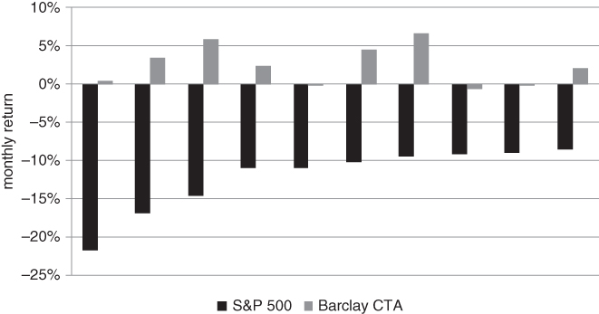
图6.2 历史上，CTA在标普500回撤期间表现优异

在这10个月中，有7个月CTA指数录得了正回报。此外，正回报通常远大于负回报的规模。这表明，每当股票严重抛售时，CTA的回报历史上通常呈正偏态。

最近，一些学者和从业者引入了"危机alpha"这个术语来描述趋势跟踪策略。金融界充斥着花哨的短语（别让作者开始谈市场营销行业），在深入研究之前最好对它们保持警惕。即使是老火鸡也敏锐地意识到趋势跟踪与风险管理之间的联系。在某种程度上，这只是对一种已经存在了很长时间的策略的重新包装。然而，危机alpha确实成为了一个简洁的描述，指代一种在极端市场条件下具有高于正常水平预期回报的策略。

基于历史证据，趋势跟踪者过去一直是优秀的分散化工具。下图展示了将趋势跟踪加入做多股票投资组合的影响。我们分别使用标普500和巴克莱CTA指数作为股票和趋势跟踪期货策略的代理。我们的数据集追溯到1999年。虽然CTA指数包含趋势跟踪以外的策略，但那些存在了一段时间（因此有资格出现在指数中的）管理人往往专注于趋势。因此，宽基CTA指数是趋势跟踪的合理代理。每个指数的波动率以及它们之间的相关性是用历史回报以月度间隔计算的。由于另类投资指数存在各种偏差，我们对股票的回报潜力做了一个乐观假设，对趋势跟踪的预期回报做了一个惩罚性假设。这旨在稍微平衡竞争环境。具体而言，假设股票的预期回报比无风险利率高5%，而趋势跟踪者提供0超额回报。在这些假设下，对CTA的配置约为22%可以最大化股票/CTA投资组合的夏普比率。我们在图6.3中勾画了一系列CTA权重下的夏普比率。
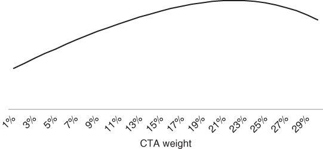
图6.3 朴素的投资组合优化器支持对CTA进行显著配置

原则上，危机alpha策略在平静市场中提供适度正回报，在市场低迷期间提供强劲的正回报。Greyserman（2014）用"CTA微笑"来描述趋势跟踪回报模式。其思路是将一个通用趋势跟踪系统和一个基准股票指数在不同时间段的月度回报整理在一起。股票回报被分为五分位数，取每个五分位数中趋势跟踪的平均回报。我们使用巴克莱CTA指数在图6.4中创建了我们自制的CTA微笑。
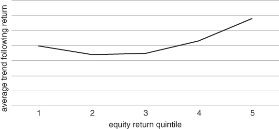
图6.4 趋势跟踪者往往在股票指数回报显著高于或低于正常水平时跑赢

我们可以看到，最低和最高的两个五分位数带来了特别强劲的历史表现。逻辑结论是，趋势跟踪者往往在股票强劲上涨或下跌时表现出色。CTA的"收益"历史上是凸性的（即类似微笑形状），在股票回报平坦时相对表现不佳。他们的方法可能受到Fung和Hsieh（2001）的启发，他们提出趋势跟踪回报在性质上与回望跨式期权产生的回报相似。请注意，回望跨式期权支付的是现货在期权有效期内达到的最高值和最低值之间的差额。它是我们在第3章中描述的普通香草跨式期权的一种路径依赖变体。Fung和Hsieh的论文被管理期货社区广泛引用。虽然这个类比在直觉上很有吸引力，但我们将在本章稍后看到，它不应该被过于字面地理解。

在资产配置的语境中，一个真正的危机alpha策略可以对业绩产生巨大影响。如果它名副其实，危机alpha可以在几乎不拖累投资组合回报的情况下降低边际风险。Cole（2013）在将危机alpha概念扩展到做多波动率策略方面发挥了重要作用。他那些复杂而有趣的论文和演讲非常值得一读。然而，在本节中，我们将自己限制在趋势跟踪作为危机alpha策略的问题上。

趋势跟踪显然是一种市场择时策略，与传统的价值策略（如困境债券投资）形成对比。你不需要"低买"（即低于某种基本面价值概念）和"高卖"。等待趋势、高买并在更高处卖出就足够了。趋势跟踪策略的成功直接取决于入场和退出时点。这使得将alpha测量为一个静态量变得困难。趋势跟踪不是通过投资正确的证券来赚钱，而是通过在正确的时间进出市场来赚钱。

衡量市场择时策略的alpha已在文献中由Henriksson（1984）和其他人进行了探索。Henriksson-Merton模型专注于衡量一个纯多头管理人相对于基准的市场择时技能，因此应用略有不同。然而，其思路是对基金的回报相对于其基准的回报和基准上一个零权利金看跌期权的回报进行双因子回归。如果对看跌期权有正载荷（即回归系数为正），管理人可能通过市场择时增加了价值，因为他或她知道何时减少暴露。然而，危机alpha方法更进一步。它不对所有回报进行回归，而是专注于在最需要时的回报质量。在这个意义上，它奖励那些采用基于状态方法进行资产配置的投资者。我们在寻找能够在市场"风险规避"阶段表现良好的策略。当你的投资组合其余部分正在崩溃时，任何正回报来源都令人感激。

我们还可以从状态特定表现的角度来思考危机alpha。Malek（2009）创建了一个风险指数，使他们能够看到各种对冲基金策略在不同市场状态下的表现。这与我们在图4.43中的"国际条形码"指数密切相关。与普遍宣称的相反，对冲基金并没有真正对冲那么多，至少在对系统性风险的暴露方面是如此。许多对冲基金，尤其是套利或相对价值类别中的基金，将自己宣传为"市场中性"。它们同时做多和做空相关资产，试图减少方向性风险。许多人声称它们可以在所有市场状态下产生正回报，因为它们在初始时是delta中性的。

从过去的回报来看，这种说法是乐观的。Malek观察到，大多数策略在风险规避状态下表现明显更差。"风险规避"表现不佳者包括相对价值对冲基金和可转换套利，这些曾被宣传为做多波动率策略。专注于买入"价值"股的市场中性股票也对波动率有负载荷。问题在于，价值股在经济放缓期间可能经历非常长的表现不佳时期。当投资者争相寻找某种形式价格稳定的股票时，它们变得"不受待见"。除了占总对冲基金资产极小比例的专项做空之外，趋势跟踪CTA是在市场"风险规避"时唯一表现优异的类别。

让我们加大赌注。如果趋势跟踪能够保证在市场抛售后提供显著保护，本书中的大多数章节都将无关紧要。你将能够在波动率飙升后不必支付期权权利金就能对冲。现实是，趋势跟踪是一种真正的分散化工具，但并不能对冲对个别市场或系统性风险的暴露。各资产类别之间的相关性随时间变化，下一次危机中股票和债券很可能一起下跌。在这种情况下，趋势跟踪者不会固执地持有主权债券多头头寸，应当相对于风险预算策略处于有利位置。最终，他们将在股票、债券或货币的持续运动中站在正确的一边。这些结果也指向了上述的"危机alpha"效应。然而，当你配置到趋势跟踪基金时，你并不是在做多极端事件风险。将趋势跟踪比作做多期权策略的经典参考文献不应被过于字面地理解。即使波动率上升，表现也是非常依赖路径的。如果一个市场出现了大幅运动但途中非常震荡，并不能保证趋势跟踪者一定能赚钱。信噪比可能太低，管理人无法留在趋势中。在某种程度上，趋势跟踪者在最近的避险环境中表现如此之好甚至可能是偶然的。我们回顾了最近的文献并使用一个简化的趋势跟踪策略进行了实验。我们的结果不是结论性的，但暗示短期趋势跟踪系统可能在未来提供更多针对波动率飙升的保护。在风险厌恶时期，它们是期权对冲策略的宝贵补充。

## 插曲：跨时间分散化

趋势跟踪者对资产配置实践做出了一个重要贡献，但这很少出现在文献中。他们专注于跨时间分散化的理念，这是马科维茨理论甚至不会考虑的东西。虽然这不是我们试图判断趋势跟踪是否充当保险的核心问题，但它值得讨论。本书的目标之一是向读者介绍另类但重要的风险思考方式。

标准风险模型专注于跨资产分散化。在任何给定时间，你为你的投资组合拍一个快照。所有风险计算都基于这个快照。资产是如何以及何时进入你的投资组合的并不重要。你的投资组合未来可能看起来如何是一个微不足道的细节，因为你可以随时间动态重新计算投资组合风险。风险被编码在该时刻你投资组合中资产的协方差结构中。然而，当你考虑配置到策略而非资产时，这种方法就失效了。许多策略会随着市场条件变化进行可预测的再配置。饱受困扰的对冲基金母基金行业多年来一直在处理这个问题。时间分散化是一个困难的问题，传统上超出了普通母基金的能力范围。然而，它至关重要。如果你不能经常重新平衡你的配置，瞬时风险度量对你没有太大帮助。了解你所投资的每种策略的定性属性会更好。

管理期货和多策略对冲基金在处理这个问题上远远走在前面。当你配置到自己设计的各种子策略时，这个问题更清晰。例如，你可能有几种不同的模型来交易美国国债期货。每个系统可以做多和做空，并随时间产生一系列回报。各个序列会不同，即使每个系统只交易美国国债。对于外部观察者来说——他们不知道每种策略在做什么——可能看起来每个回报序列对应着不同资产中的静态头寸。各种系统将有一个协方差结构，我们可以像对待单个资产一样将马科维茨理论应用于它们。在图6.5中，我们展示了不同移动平均线交叉（MAC）系统之间的两两相关性随着回顾窗口长度的远离而下降。这创造了一种分散化效应。
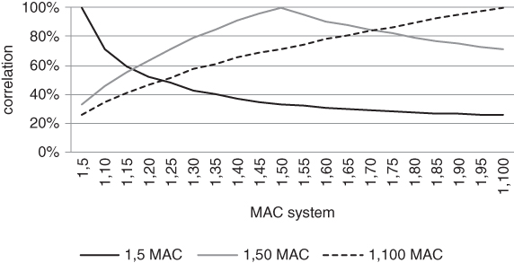
图6.5 具有不同回顾窗口和预期持有期的系统是分散化的

上面的每个MAC系统具有如下形式：MAC(1, n)。如果今天的价格（即1天移动平均价格）高于过去n天的平均价格，系统将在下一个交易日做多。否则，系统做空。通过构建，每个系统始终持有市场头寸。其中n的范围从5到100个交易日。

我们将MAC信号应用于3个市场：美国10年期期货、标普500期货和即期美元指数，使用1996年至2016年初的每日数据。在每个市场中，我们测量了一个短期（1,5）、中期（1,50）和长期（1,100）系统与所有其他系统的相关性。然后我们在这3个合约上对相关性图表取平均。从图中可以看出，每个系统与自身的相关性为100%。这显然应当是成立的。更有趣的是，随着回顾窗口的远离，任意两个系统之间的相关性下降。最后，我们观察到（1,50）MAC系统与（1,100）系统之间的关系比与（1,5）系统更紧密。这意味着通过将附近的短期系统组合在一起，比将附近的长期系统组合在一起，可以实现更多的分散化。

值得注意的是，平均持有期随回顾窗口长度的增加而增加。从多头翻转到空头或反之的概率，从MAC（1,5）的大约25%到（1,100）的大约5%不等，衰减率与1/sqrt(n)成正比。这表明快照风险估计对于长期趋势跟踪系统是合理的，但对于较短期的MAC可能极不准确。结论是，在估计一个交易策略对投资组合风险的边际贡献之前，我们需要理解这个策略的动态特性。

## 利用回调

机构资金管理人大多数时候被迫将资金投入运作。当短期国债收益率为0时，对冲基金不能无所事事，因为什么都不做的每个月，成本都会显著侵蚀业绩。如果你保持不投资，投资者会质疑你的承诺。然而，手握现金在减价抛售期间可能极为有利。你可以在垃圾中找到便宜货。这是一个不太成熟的投资者可能相对于其机构同行具有优势的重要领域。在第7章中，我们给出了几个可以利用高波动率的交易策略的例子。虽然这些并非没有风险，但拥有充足弹药的投资者可以利用这些可用的机会。我们还调研了一些有趣且可能有争议的学术研究，这些研究将方差互换的价格与股票风险溢价联系起来。我们更朴素的例子聚焦于这样一个理念：市场估值比率（如市盈率）对价格的敏感度远高于其他任何因素。这在抛售之后自动创造了价值买入的机会。

## 尼德霍夫的论证

最近，Niederhoffer（2014）论证说，趋势跟踪可能无法在未来危机中提供足够的保护。这篇论文从一个历史观察开始。自1980年代以来，利率一直处于长期熊市中。债券价格——与利率反向变动——持续趋势性上涨。在风险调整的基础上，债券的表现远超股票，差距极为悬殊。这是一场一边倒的比赛，如图6.6所示。我们追踪了滚动持有标普500和美国10年期国债期货头寸的表现。10年期国债的回报经过杠杆调整，使其1年滚动波动率与标普500相匹配。表现差距如此之大，以至于我们需要用对数刻度来表示。即使我们使用现金标普500指数而非标普期货，差距也是巨大的。
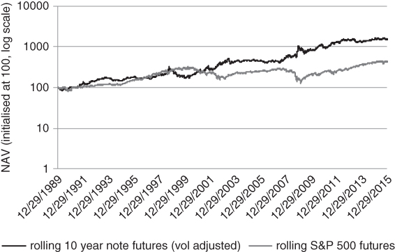
图6.6 债券期货既提供了相对较高的绝对回报，又在危机期间提供了保护

请注意，我们的债券代理是一个滚动持有的10年期国债期货多头头寸。我们通过滚动期货策略获得债券暴露这一事实很重要，我们很快就会看到。债券的长期牛市为趋势跟踪者创造了肥沃的环境。他们通常在美国10年期、德国国债、日本政府债券和其他利率期货市场上持有做多头寸，以试图捕捉一个超越了市场周期的运动。我们认为，很大比例的回报来自债券和其他利率期货。由于这些市场往往非常流动，大型CTA能够将大量资本部署到利率上。他们对利率的配置比例一直很高。反过来，相对于其他类别对债券期货的偏向提高了回报。趋势跟踪者不仅从下行的即期利率中受益，也从嵌入在利率期货中的展期收益中受益。正如我们之前提到的，自1980年代以来，美国收益率曲线通常是向上倾斜的。当收益率在美联储试图通过紧缩政策控制通胀后开始下降时，短期利率比长期利率下降得更快。这产生了向上倾斜的收益率曲线，或者说等价地，向下倾斜的期货期限结构。

图6.7和6.8强调了期货展期下滑的重要性。这些图包含了蒙特卡罗模拟的结果。首先，我们计算了过去20年美国10年期期货的平均现货升水（backwardation）水平。结果发现，远月合约历史上以75个基点的折价相对于近月合约交易。然后，我们在1000天的时间范围内模拟了多条利率路径，做了一个粗略假设：恒定到期日国债收益率的变化遵循随机游走。我们的随机数生成器的波动率被校准为匹配相关恒定到期日利率的历史波动率。零息收益率曲线在所有到期日被初始化为2%。这是对本文撰写时长端收益率交易水平的合理概括。接下来，我们根据这条曲线对10年期国债期货进行定价，假设最便宜可交割债券总是久期最短的那只。Burghardt（2005）和Choudhry（2006）对希望熟悉主权债券期货定价和对冲复杂性的读者来说是有用的参考文献。最后，我们逐次模拟计算了期货的累计回报。这包含了我们上面计算的展期收益。
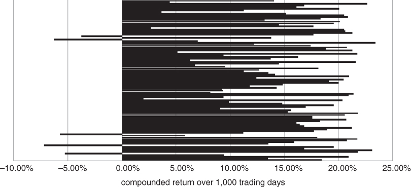
图6.7 当期限结构处于显著现货升水时，展期下滑克服了利率路径中的随机性
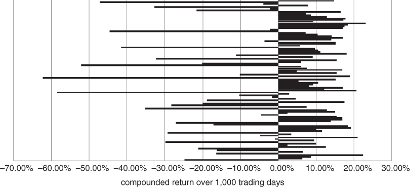
图6.8 即使利率在逐步攀升，债券期货也可以具有正的预期回报

上一段话信息量很大。简单说，我们使用历史期货期限结构模拟了一些债券价格，假设利率没有趋势。考虑到当前的市场环境，该模拟是相当现实的。图6.7总结了我们的结果。

几乎所有的期货价格路径都复合成正的1000天回报。在现货升水处于这个水平的情况下，期限结构的形状主导了利率的随机波动。只有当我们激进地重置模拟中的漂移项时，我们才开始达到盈亏平衡水平。更准确地说，我们需要假设利率具有大约+20%的年化漂移率，期货下跌的可能性才会大于上涨的可能性！（参见图6.8）

我们注意到，平均下跌幅度似乎大于平均上涨幅度，因为我们的模拟实际上约束了长期利率高于0。利率的分布被有效地假设为对数正态分布。当给定模拟中的利率接近0时，后续利率变动的幅度会变小。

现在我们来讨论尼德霍夫论证的核心。自1980年代以来，债券产生了极为强劲的回报，近期的表现由资本增值而非收益率主导。这一趋势几乎完全是单向正面的。与此同时，它们充当了事实上的避险证券，在全球市场波动率飙升期间提供了统计保险。在此期间，你持有债券形式的保险还能获得收益。这该有多好？当卖方经济学家忙着喋喋不休地谈论债券如何被高估时，专注的趋势跟踪者正在快乐地滚动他们的多头头寸。正如我们在本章前面观察到的，纯趋势跟踪者不会试图评估债券或任何其他资产的公允价值。他们在"大稳健"时期的决策一如既往地基于价格。考虑到典型CTA对债券的配置相对较高，且债券在风险事件期间一直表现良好，CTA提供保险可能只是偶然的。

尼德霍夫强调这一点，试图在配置趋势跟踪作为投资组合锚的投资者心中埋下疑虑。他认为，如果利率期限结构发生变化——即短期利率比长期利率上升得更快——趋势跟踪者可能无法提供保护。大多数美国投资者没有经历过股票和债券一起下跌的环境，趋势跟踪者是否会在这种环境中表现良好并不明显。

广义上，有两种重要的场景，趋势跟踪者可能无法提供任何针对波动率上升的保护。如果收益率开始持续上升，趋势跟踪者可能会发现自己持有空头头寸，站在政府债券价格避险飙升的错误一边。相反，如果出现通胀冲击导致收益率飙升，他们可能会陷入多头头寸。截至2016年年中，短期收益率需要相当快速地上升才能将期货曲线推入期货升水（contango）。否则，债券期货和收益率可能同时上升，迫使趋势跟踪者维持债券期货的多头头寸。他们将无法妥善应对收益率的浅层上升之后发生的剧烈通胀飙升。这是另一种情况（例如回想第4章中VIX的讨论），投资组合管理人因无法高效获取现货市场运动而受到限制。

我们通过概述趋势跟踪未来可能无法作为投资组合对冲的一系列原因开始了这个讨论。然而，还有其他因素在起作用，可能增加配置者对该策略的舒适度。为了说明这一点，我们重新审视一项关于不同市场、不同时间尺度上动量模型特性的研究。我们首先检查当波动率上升时，短期动量是否倾向于在给定市场中表现良好。

## 追逐1日波动

如果我们不使用日内数据，交易突破的最短回顾窗口是一天。所以让我们从那里开始。我们想检验这样一个假设：短期突破系统回报与波动率变化相关。这在Kremer（2007）的几个具体案例中得到了展示。在图6.9中，我们将标普500上一天突破模型的表现与VIX的变化进行比较。我们的交易规则非常简单，仅用于说明一个观点。我们绝不推荐它作为绝对回报策略。跨市场的1日反转交易实际上可能是更好的策略。目前，假设我们有一个交易规则：只要过去1天的回报为正就买入标普500，只要回报为负就卖出标普500。我们只是在追逐1日的过去表现。在下面的散点图中，我们可以看到，该策略的回报与VIX的变化存在温和的正相关性。
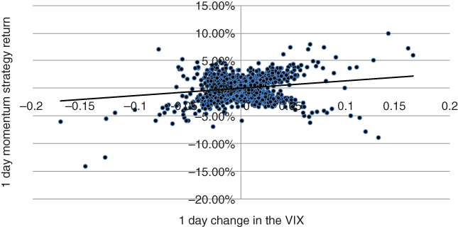
图6.9 1日动量回报与VIX变化存在适度正相关

这至少是一个暗示。如果你追逐每一次1日波动，在你的交易市场中，你看起来有点像一个做多波动率的策略。

这个交易的一个有趣变体涉及交易美国10年期国债的1日波动。我们可以将10年期追逐者的表现对10年期隐含波动率进行回归。然而，考虑到TYVIX和VIX之间的高条件相关性，将表现对VIX的变化进行回归可能更有启发意义。所谓"条件相关性"，我们指的是在其中一个指数或另一个大幅飙升的条件下（即以此为条件）的相关性。这与我们之前在书中提出的一个理念一致。通常，"闪崩"之前是一连串的下跌日。这些下跌日给杠杆投资者带来压力。在某个时点，这些投资者达到他们的痛苦阈值，清算其投资组合中的大块头寸。这有可能导致戏剧性的抛售。然而，并不能保证下一次闪崩会以如此可预测的方式发展。如果出现完全意外的信用或地缘政治事件，一日"追逐者"可能不会站在波动的正确一边。

随着突破时间范围的延长，信号回报与给定市场波动率之间的相关性通常会降低。这意味着我们必须满足于以下相当保守的结论。具有明确定义止损的趋势跟踪策略，在出现持续的超大规模市场运动时通常提供分散化（尽管不是纯粹的保险）。同时，短期系统在波动率飙升时更有可能站在市场的正确一边。与许多其他对冲基金风格不同，它们不依赖于卖出明确的风险溢价。通常，在沿着主流趋势方向交易时，你在提供流动性。

## 把类比推得太远

趋势跟踪与做多期权策略之间的类比，起源于许多管理人使用硬止损的时代。如果原油期货在趋势中，你的系统产生了在80买入的信号，你可能会在70设置退出。如果价格继续上涨，你会逐步将止损位提高以锁定利润。在入场时，你的收益曲线看起来有点像到期时的做多看涨期权。

这个简单的观察可能推动了Fung（2001）将趋势跟踪比作静态做多期权头寸（即回望跨式期权）。由于跨式期权从波动率上升中获益，很容易得出结论说趋势跟踪在结构上也是做多波动率的。然而，我们提醒不要过于字面地理解这个类比。趋势跟踪与做多期权策略有些相似，但并不等同。你不会直接从波动率的增加中获利。我们用一个简单的例子来说明这一点。即使是硬止损的假设也是一个牵强的假设。大多数趋势跟踪者会根据信号的变化逐步增加和减少头寸。当趋势破裂时，短期指标首先退出头寸。随着时间的推移，长期指标跟进，使得整个头寸不会在一次操作中被清仓或翻转。对于大型趋势跟踪者来说，对头寸进行"乒乓"控制会导致不必要的滑点。你不想在一次操作中进入或退出一个大额头寸。更好的做法是随时间相当连续地变化你的头寸规模。这样，你的回报就不会对瞬时择时过于敏感。在市场中有更多流动性时你也可以交易更多。不过，为了具体起见，假设你的趋势跟踪策略确实使用明确的止损。如果我们要试图反驳趋势跟踪等同于静态期权头寸的假设，这是一个保守假设。然而，为简单起见，假设你的策略确实有特定的交易退出点位。假设你能够在止损水平执行，在任何时间点你的收益曲线看起来像一个看涨或看跌期权。对于多头头寸，你的潜在收益理论上是无限的，而你的损失被止损限制。

这一切听起来好得令人难以置信。你现在有了一个相当于买入期权、却没有权利金支出的策略。或者看起来是这样。下行止损作为保险的论证存在一个问题。首先，如果标的出现非常剧烈的波动，并不能保证你会在止损位成交。更重要的是，在我们的例子中，你只是瞬间持有一个看涨期权。无法预知明天你的头寸会是什么。

假设你今天做多石油，在当前价格下方有一个卖出止损。如果趋势强劲逆转，你可能在你意识到之前就已经在做空石油并在上方设置止损了。即使瞬时收益类似期权，你最终会在做多看涨期权和做多看跌期权之间反复翻转。值得补充的是，许多趋势跟踪者在调整头寸规模时使用风险预算方法。大致上，这意味着分配给每个合约的名义金额与合约的波动率成反比。此外，如果一项资产的波动率上升而交易信号没有变化，头寸将随时间自动缩小。波动率高的合约（如天然气）获得的配置小于那些随时间波动不大的合约。这如何影响趋势跟踪策略的定性属性？

让我们回到我们的老朋友，标普期货合约。我们可以构建一个简单的例子，证明风险预算可以抵消趋势跟踪系统中隐含的"gamma"。假设一个客户想使用标普上专门的做空趋势跟踪者来对冲多头暴露。对冲被外包给一个覆盖层管理人。趋势跟踪算法通过从现金转换为不断增加的做空期货头寸来逐步建立下行头寸。这当然具有指数上做多看跌期权的特征。然而，标普有意义的抛售通常伴随着已实现波动率的上升。熊市以凶猛的下跌和同样猛烈的救济性反弹为特征。如果覆盖层管理人有一个风险阈值且波动率飙升，可能需要削减满载的头寸以保持在阈值之下。信号强度的增加被风险约束所抵消。如果还有另一轮下跌，这会降低对冲的回报潜力。看跌期权的持有者没有这样的担忧，因为看跌期权将自动加大对抛售的暴露，并且隐含波动率的任何上升都会带来额外加成。

一个在看涨和看跌之间翻转的策略是做多波动率的吗？我们可以直接测试这一点。假设我们交替买入标普500上1个月平值看涨和看跌期权，基于抛硬币的结果。我们在每周结束时重复抛硬币，平仓旧头寸并建立新头寸。我们通过基于标的价格变化重新定价期权来计算周回报。请注意，我们保持期权的到期时间和波动率不变，因为趋势跟踪策略没有任何theta或vega。最后，我们计算策略回报与VIX变化之间的相关性。图6.10基于2005年至2015年1000次周回报模拟。
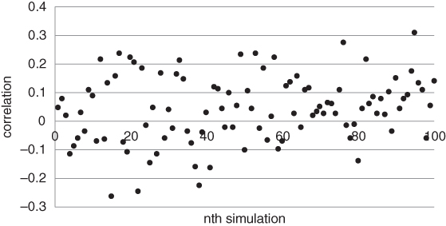
图6.10 在看跌和看涨之间随机切换并不类似于做多波动率头寸

结果表明，策略回报与VIX变化之间的平均相关性接近0。这表明，即使策略在入场时使用止损，单一市场上的趋势跟踪与该市场波动率之间也没有明显的关系。我们强调这不是一个结论性研究。它仅仅表明，使用止损的策略与期权买入策略有很大不同。

当我们反思趋势跟踪者不再使用明确止损这一事实时，这个类比变得更加薄弱。最大和最成熟的基金倾向于几乎连续地根据信号强度和波动率变化来增减头寸。头寸规模往往与给定市场的波动率成反比。这意味着如果管理人完全做空标普且波动率上升，头寸将被减少，以确保标普的风险贡献不会太大。因此，在盈利头寸上逐步加仓的"做多gamma"效应被基于波动率的头寸规模上限风险约束所部分抵消。

Malek和Dobrovolsky（2009）令人信服地论证了做多gamma策略并不自动是做多波动率的。在统计基础上，趋势策略在适度的时间范围内看起来可能是做空波动率的。对于依赖长期趋势的管理人来说，当趋势剧烈破裂时尤其如此。反过来也成立：做空gamma策略可以在高波动率环境中表现优异。正如我们将在第7章中看到的，在股票指数中逢低买入的反转策略可能与市场波动率水平有很高的相关性。类似地，重新平衡到一组战略权重的资产配置方案也可能在高波动率时表现出色。

大多数基金管理人倾向于区分相对于其交易风格的"好的"和"坏的"波动率。当市场像喝醉的水手一样漫无目的地游荡时，这对反转交易者是好的，对趋势跟踪者是坏的。相反，当某一资产突破其历史区间并持续运行时，趋势跟踪者欢欣鼓舞。结论很简单。由于你在跟随趋势时没有支付期权权利金，你不应期望从每一次已实现波动率的扩张中获益。

## 直接分析数据

读者可能注意到本章中一个奇怪的模式。我们最初问趋势跟踪是否是一种做多波动率的策略。此后，我们反复摇摆，没有给出一个明确的答案。这种模式将在这里继续。希望我们不会开始像那些习惯呈现两种对立观点以便有东西可卖的银行。事实是，趋势跟踪是一种高度分散化的策略，具有一些类期权的特征。在我们看来，它是分散化多资产类别投资组合的重要组成部分。然而，期权类比并不精确。我们无法说出一个普通的趋势跟踪者在下一次危机中将如何表现。图6.10中的随机切换策略是暗示性的但不是决定性的。当在一个方向或另一个方向出现强劲运动时，趋势跟踪可能在相当长的时间内类似持有看涨或看跌期权而无需切换。相比之下，在看涨和看跌之间随机翻转则没有任何持续性。所以让我们尝试另一种方法。最直接地观察趋势跟踪作为波动率变化函数的表现的方式，是显式地构建一个动量策略。只要我们的版本具有代表性，我们就可以将策略的回报对VIX变化进行回归，看看我们得到什么。我们使用VIX作为风险指标，因为它被广泛引用，有相当长的历史，并且对跨市场的风险厌恶大幅变化很敏感。

我们的趋势跟踪信号非常基础，但具有代表性。我们专注于六个不同时间范围内的突破，1、5、10、20、50和100天。请注意，"突破"发生在合约价格移出其历史区间时。例如，考虑5天突破信号。如果今天的收盘价高于过去5天的最大值，我们做多。如果低于过去5天的最小值，我们做空。否则，我们维持头寸。在初始突破之后，信号始终持有市场头寸。

我们的综合回报只是各个突破系统回报的平均值。我们使用多个突破时间范围，试图捕捉各种时间尺度上的趋势。请注意，我们没有说任何关于如何在市场之间组合我们的多频率信号的内容。我们只是检查在特定市场内，趋势跟踪回报与波动率变化之间是否可能存在某种关联。

接下来，让我们将综合信号应用于一个有代表性的市场。在图6.11中，我们将我们自制的趋势跟踪者应用于标普500。
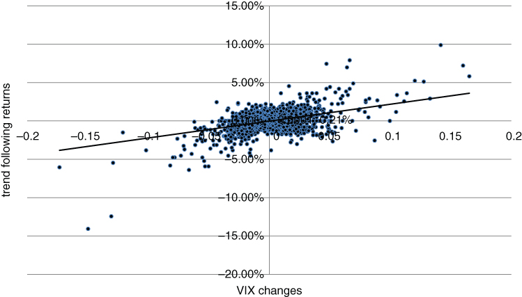
图6.11 标普500趋势跟踪回报与VIX变化之间存在适度的历史相关性

结果实际上相当有希望。在使用每日回报的20年时间范围内，回归的R平方接近0.2。似乎在同一标的股票指数上，波动率与动量策略表现之间确实存在某种关联。为什么会这样？我们只能推测。VIX最剧烈的飙升通常发生在股票熊市趋势已经形成之后。它们似乎不是完全凭空出现的，而是代表了来自长期偏向多头、面临越来越大退出交易压力的管理人的清算。这意味着我们的趋势跟踪者倾向于在VIX最大跳跃之前就已经做空，并将在市场进入危机模式时频繁提供保护。广义上，同样的结果适用于美国10年期期货，即我们的基本趋势跟踪系统的回报与债券隐含波动率变化正相关。

如果股票和信用进入长期熊市，趋势跟踪很可能会来救援。几乎任何合理的系统最终都会承认风险资产处于下跌趋势，并随后做空市场。然而，伴随间歇性闪崩的震荡市场并不利于动量策略。在更大范围的牛市中覆盖快速大规模清算的唯一方式是用期权。理想情况下，我们应该能够识别快速抛售或长期熊市可能发生的条件。这是第8章的主题。

## 乐高式趋势跟踪

我们可以通过定制化来提高趋势跟踪系统提供针对不利波动保护的概率。这涉及以"乐高"风格重新组装完整趋势跟踪系统的构建模块。假设我们希望对冲养老基金未来负债流对收益率下降的风险。如果折现率下降，除非资产池等额上涨，否则基金的偿付能力将减弱。负债的现值（即在当前利率下履行未来义务所需的金额）将增加。虽然一个在主要市场中做多和做空的系统与市场波动率上升会有一定的相关性，但我们可以比这更精确。我们可以通过超配全球主权债券的做多信号来增加我们系统的预期久期。特别是，如果利率下降，我们不希望持有债券空头头寸。诚然，如果利率进入持续下跌趋势，趋势跟踪者最终会在债券期货中建立多头头寸。然而，在此期间，做空期货头寸可能已加剧了精算损失。

一个合理的解决方案是通过专注于可用交易的子集来定制趋势跟踪系统。这可能降低交易系统的独立alpha，但很可能增加其相对于现有投资组合的边际效用。特别是，你可以通过以下方式约束一个完整系统，以延长现有投资组合的久期：

- 仅交易债券和利率期货（请注意，股票指数和大宗商品从统计角度看久期不可靠）
- 避免做空这些期货，以确保覆盖层的总久期永不为负
- 超配短期趋势信号，以增加覆盖层与波动率的预期相关性。

使用相同的推理思路，可以对各种静态投资组合进行对冲。例如，我们可以通过将我们自己限制在股票指数期货的做空信号中来对冲股票投资组合。如果我们完整的趋势跟踪系统在标普E-mini期货上产生了做多信号，我们将简单地忽略它并保持持有现金。从对冲的角度来看，我们绝不想在波动发生前站在错误的方向上。

无法直接交易期货的机构可以将定制的趋势跟踪策略外包给外部管理人。这可能采取管理账户的形式，这种形式易于定制且需要相对较低的现金支出。

## 摘要

一旦波动率上升，直接购买期权变得昂贵。我们已经探索了区间型对冲作为在保持低成本的同时维持一定保护水平的方法。另一种选择是在主要市场中跟随趋势。这种方法在历史上的风险事件中提供了统计保护，并且不会强迫你在波动率变贵之后为此支付高额权利金。我们提醒，趋势跟踪提供历史保护可能出于结构性原因，这些原因在未来可能不会持续。一个合理的混合方法是将期权与趋势跟踪算法结合起来，重点放在历史上对波动率飙升特别敏感的短期系统上。趋势跟踪增强了覆盖层对冲的预期回报，同时提供了针对给定资产大规模方向性运动的统计保护。它还防御了当前未被市场验证的高确信度基本面观点。

## 注释

1. Lefèvre, Edwin.《股票作手回忆录》. 新泽西：Wiley，1923。
2. Cole, Christopher. "波动率范式与悖论。" CBOE风险管理会议，2013年3月3日。[http://www.cboe.com/rmc/2013/Day1-Session3-Cole.pdf](http://www.cboe.com/rmc/2013/Day1-Session3-Cole.pdf)
3. Niederhoffer, Roy, and Coen Weddepohl. "CTA与上升利率：派对结束了吗？" 白皮书，2014年4月。[http://www.dailyspeculations.com/CTAsAndRisingInterestRates_040714.pdf](http://www.dailyspeculations.com/CTAsAndRisingInterestRates_040714.pdf)
