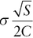
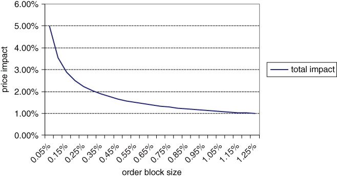
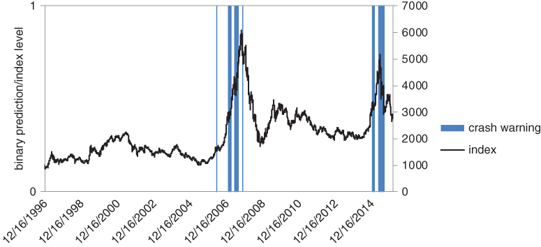
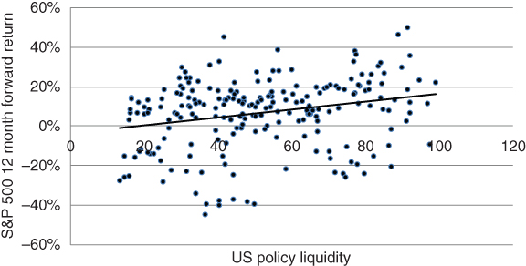
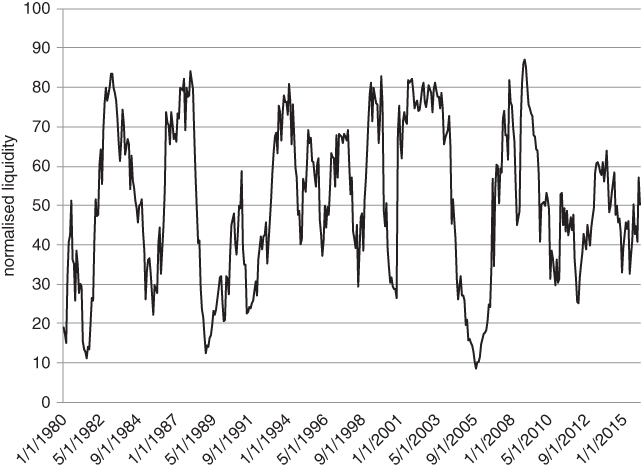

# 第8章："闪崩"、危机与预测的局限

我们已详细讨论了下跌后的对冲，甚至涉足高波动率市场中的进攻性策略。但是否有可能提前预判急剧抛售或长期危机呢？"预测"和"预报"这两个词有些沉重。它们让人联想到那句告诫——经济预测的目标不过是为占星术增添可信度（1984）。尽管如此，我们仍将涉足这片泥沼，看看是否有可能对快速回调或长期熊市的概率做出任何判断。我们借用数学生物学中的一个类比，非正式地描述闪崩如何形成。近期文献中有一些预测危机的尝试。我们将讨论其中的部分方法，并以对金融市场预测局限性的警示作为结尾。

## 萤火虫之王

许多投资者（尤其是受塔勒布（Taleb，2007）影响的投资者）强烈主张市场危机本质上不可预测。投资组合经理有时感觉自己在一片随机性的海洋中操作，即使他们最好的想法和系统，信噪比也很低。大规模清仓尤其令人困惑。如果条件稍有不同，它们可能根本不会发生。在这种背景下，索内特（Sornette，2009）声称极端波动可以预测甚至可能加以控制，这似乎非同寻常。这就像在一个科学领域中试图解决最困难的问题，却对该领域最简单的情形都没有合理的理解。

这里我们需要更精确一些。索内特并未声称所有市场波动都能被预测。在大多数市场状态下，可预测性程度很低。然而，他会辩称，金融灾难存在一个短暂而可靠的"可预测性窗口"。索内特关注的不是高频清仓，而是莱因哈特和罗格夫（Reinhart and Rogoff，2009）所记录的那种长期市场灾难。在他的范式下，就在真正可怕的事情即将发生之前，不确定性的迷雾会消散。

信号以不可持续的价格走势形式出现。市场呈抛物线上升，以不断加快的速度上涨，然后不可避免地回调。"弱手"在上涨接近尾声时进入市场，拼命试图参与其中。这些投资者在市场初现疲态时很容易被清洗出局，并且可能形成强烈的负反馈循环。越来越多投资者的下行止损位被触发，被迫卖出。索内特已识别出中国和美国科技股中的各种繁荣/萧条周期，在他看来，这些周期中的重大抛售是不可避免的。

索内特关于相变与市场崩溃之间的类比颇具启发性，尽管并非完全准确。市场在清仓过程中从有序走向无序，这并不一定是必然的。在长期视野下——以不可预测的买卖浪潮为特征——这种情况可能存在。然而，在恐慌性抛售开始的临界点，投资者往往以同样的方式达成一致。虽然每笔卖出必须对应一笔买入，但当市场崩跌时，买方可以大幅压低报价并仍然成交。那些大笔建仓的投资者几乎无一例外都是卖方。

清仓实际上代表某种有序行为（无论多么令人毛骨悚然）这一概念需要一种不同的类比。投资者整体可以被视为一系列代理人的集合，他们的活动在厚尾事件发生前变得同步。一旦同步程度越过某个阈值，危机就变得不可避免。史蒂文·斯特罗加茨（Steven Strogatz）关于萤火虫同步发光的模型尤为贴切，我们在此简要回顾。我们强烈推荐斯特罗加茨（2004）的精妙阐述和有趣见解。故事是这样的：在16世纪，欧洲探险家开始将亚洲萤火虫的故事传回欧洲大陆。正如本书封面谦逊地暗示的那样，大群萤火虫能够协调它们的活动，以至于在夜幕降临时照亮河岸。这是令人惊叹和敬畏的景象，毕竟电灯泡还要几个世纪才会被发明出来。

鉴于萤火虫并不以战略规划能力著称，它们能够自发组织成光的漩涡、同步闪烁，似乎令人震惊。科学家花了相当长的时间才理解这样一个有组织的网络如何能够自发形成。最终人们发现，闪烁的运动和时间可以通过可变强度的光来控制。这意味着萤火虫可以通过以特定方式闪烁来互相传递简单的信息。回到索内特的论点，关键点在于：如果有足够多的萤火虫开始以协调一致的方式行动，其他萤火虫就会跟随。超过某个阈值后，每只萤火虫的短期行为将遵循一个相当确定的过程。这就是我们之前提到的可预测性窗口。你几乎可以预判萤火虫何时即将集体行动。虽然危机的酝酿通常以月而非分钟为单位，但萤火虫的例子表明，协调一致的行为可以从一群在正常情况下独立行动的代理人中涌现出来。

## 级联抛售

日内抛售并不完全符合索内特的框架。它们未必由推动估值达到极端水平的加速上涨所先导。在短期视野下，估值相对不重要。价格往往由技术因素驱动。尽管如此，在严重下跌期间，投资者似乎表现出同样类型的集体行为，无论时间周期如何。负反馈循环出现在所有频率的抛售中。基于斯特罗加茨的类比，我们可以将每一笔订单视为一只萤火虫。随着它们的行为变得更加有组织和有方向，出现超大规模波动的概率就越来越大。

每当有人问你今天市场为什么暴跌，总有一个简单的答案：持仓结构。在这种情况下，简单的答案虽然帮助不大，但在短期视野下总是正确的。你不需要扫描新闻推送或处理大量情绪数据。外部世界发生的任何事情，无论是什么，都只是为更大波动提供了初始推动力。在某个时刻，较大规模的投资者被迫进入市场，试图降低保证金要求、满足赎回需求或管理亏损。但大量卖盘如何引发日内崩盘呢？在本节中，我们尝试用一个简单的价格冲击模型来回答这个问题。

我们从另一个类比开始。假设你在一个公共礼堂里，看到很多人正在朝出口走去。如果他们全都属于同一个团体，你不会太担心。他们可能是一起去别的地方；整体上，他们有统一的想法。然而，如果人们从礼堂各处离开，而演出还没结束，你可能也会倾向于离开。一定出了什么事（当然，前提是不是演出本身的问题）。当毫无关联的代理人都在做同样的事情时，信息含量似乎要高得多。

同样的论证适用于金融市场的价格波动。同方向的大量小额交易通常会比一笔同等总规模的单笔交易更能推动市场。下图大致基于布绍（Bouchaud，2009），该文综述了各种价格冲击模型。此处我们假设价格冲击与成交量的平方根成反比，如BARRA模型所假定。假设标普500期货出现一系列买入订单，占日均成交量的5%。估计的价格冲击是多少？

在以下假设下，我们可以勾画出价格冲击函数。其中第三条假设基于与执行经纪人的对话，不应过于僵化地理解。

- 标普500 E-mini期货合约每天约成交200万张。
- 期货合约的波动率为15%。
- 如果一笔10,000张的订单通过市场，其价格冲击约为指数水平的0.3%，即如果期货在2000点，约为6个点。
- 合约的波动率为15%。

第三条假设使我们可以求解价格冲击函数中的参数。
<math xmlns="http://www.w3.org/1998/Math/MathML" display="block" overflow="scroll"><mrow><mi>&#x30c3;</mi><mfrac><mrow><msqrt><mi>S</mi></msqrt></mrow><mrow><mn>2</mn><mi>C</mi></mrow></mfrac></mrow></math>
其中 为指数的波动率，交易规模 设定为日均成交量的百分比。

我们可以将日均成交量的5%以多种方式拆分：100笔每笔1,000张的交易、50笔每笔2,000张的交易，以此类推。如果这些交易全部是买入或全部是卖出，我们得到如图8.1所示的冲击曲线。

图8.1 同方向小额交易的总冲击大于单笔大宗交易

这条曲线引人注目，因为它表明100笔同方向的交易将产生4笔同等总成交量交易5倍的冲击。这是富有洞见的，而考虑到当前自动化订单路由系统的趋势，也最终令人担忧。这些系统倾向于将大订单切分为小块，导致平均交易规模降低。如果价格冲击曲线在新环境下保持不变，个别证券出现厚尾波动的概率可能会增加。

## 一个具体示例

冒着过于简化的风险，我们可以尝试将索内特的崩溃点理论编码为一小组规则。粗略地说，索内特寻找的是两个可能引发危机的条件。首先，价格需要在近期上涨得非常快。更重要的是，潜在新投资者的池子已经耗尽。这反映在已实现波动率的上升上。买方和卖方之间的激烈拉锯战已经加剧。那么，让我们用真实数据来检验这些条件。我们考察一个在过去10年中经历两次泡沫和崩盘的指数，即图8.2所示的上证综合指数。我们的数据集范围从1990年到2015年。我们首先计算指数的同比变化。接下来，计算同比收益率过去5年滚动Z值。我们还使用每日收益率计算指数1个月历史波动率的5年滚动Z值。如果两个Z值均高于2，我们的危机预警指标就会闪烁。换句话说，近期的价格上涨和当前的波动率需要至少高于正常水平2个标准差。

图8.2 索内特危机指标的简易实现，上证综合指数

可以看到，这一基本实现在样本量有效的情况下是相当有效的。2006年年中出现了一个虚假信号，但该信号很快就被洗掉。其余的信号都出现在相当接近崩溃点的位置。高波动率预示危险这一观点并不新鲜，它也是许多资产配置方案的基础。然而，索内特值得赞扬的是，他将预测危机的方法从主要基于估值的方法转向了依赖价格走势本身的方法。

## 一段旁白

索内特的第二个论断更进一步。有些令人惊讶的是，他主张在阈值附近施加微小的政策控制就应当能够阻止泡沫或崩盘。在萤火虫的例子中，这可能对应于在萤火虫开始在某些区域协调其活动时，将一些萤火虫从群体中引开。

我们许多人甚至尚未达到能够决定是否可能预测危机的地步，更不用说提出一个声称能做到这一点的模型了。索内特的两个论断可能有些超出想象。从技术角度来看，在物理学中建模奇点（即动力系统的极端解）已经很困难，更不用说金融学了。物理学中的一些方程有在有限时间内"爆炸"的解。但这些奇点是否真的存在，还是建模过程的产物？可能在某种意义上存在一个与原始方程非常接近，但没有任何奇点的方程。我们必须非常谨慎。然而，索内特似乎在识别那些过快而不可持续的价格波动方面确实取得了某些进展。这自然引导我们讨论更具体的模型，可以用来对快速抛售和长期危机做出某种判断。

## 路径与足迹

我们上文中已描述了同一方向的大量连续交易如何能够产生惊人的巨大价格冲击。一些短线交易者挠着头，以为自己错过了什么。他们最终涌入市场，放大了最初或许不过是无信息交易的波动。最终，杠杆投资者触及其痛苦阈值，被迫进入市场。如果周围有大量卖盘，他们就必须卖出以削减风险。有没有什么方法可以对市场中的随机波动、杠杆提供方和杠杆基金之间的相互作用进行建模，从而生成超大规模波动呢？

特纳（Thurner，2012）开发的模型或许不能预测厚尾市场波动，但能生成正确的定性动态。这与混沌理论的精髓相似——混沌理论在1980年代曾承载了巨大的希望。你可以通过扰动一个相对简单的方程，生成一套"看起来合理"的丰富动态。然而，虽然你可以模拟广泛的结果，但却无法以高精度预测真实世界的结果。法默（Farmer）在牛津的研究小组随后构建了更现实的经济表征。这是一个有前景的领域，可能使央行行长能够模拟政策决策对金融市场和实体经济的影响。那些可能导致经济不稳定的干预可以被排除。该论文开发了一个包含三类代理人的"玩具"模型：一家银行、一个噪声交易者和一个杠杆投资者。市场被初始化为随时间随机运动。为简化起见，可以将"市场"想象为一个宽基股票指数。噪声交易者对随机波动做出反应，买入短期回调，卖出反弹。他们的操作基于这样的假设：这些小的不规则波动背后没有信息含量。价格很可能会迅速回归。噪声交易者在"正常"状态下倾向于产生价格均值回归。杠杆投资者在论文中被称为"价值投资者"，但通常可以基于价值或动量标准持有多头头寸。关键在于，随着杠杆增加，这些价值投资者的容错空间相对较小。如果出现实质性的下行波动，他们将被迫相当迅速和激进地卖出头寸。否则，为投资者提供杠杆的银行将威胁平仓其头寸。在这种情况下，噪声交易者（即自诩的流动性提供者）被迫退出市场，因为他们没有足够的资金长期持有亏损头寸。

随着杠杆接近关键阈值，我们可以展示市场收益率分布变形为厚尾分布。大幅下跌的概率增加。只需要指数跌得足够猛，多头投资者就不得不被迫进入市场。当投资者面临信用额度被切断的危险时，抛售可能变得绝望和 indiscriminate（不加区别）。在这种背景下，杠杆是驱动整体市场大规模波动的关键变量。如果我们将这一论点推导至其自然结论，央行一定对泡沫和崩盘的形成有影响。当投资者试图用杠杆放大收益、而央行同时试图从系统中收回信贷时，危机的条件就已具备。商业银行一旦失去廉价循环信贷的便捷获取渠道，最终将不得不缩减其贷款活动。紧缩最终传导到企业和投资者，他们现在更难维持借款。在这种情况下，标普指数下跌10%将产生不成比例的巨大影响。银行将更快地执行大额追缴保证金，而此时的投资者杠杆正处于周期性高点。如果我们要理解尾部风险与信贷之间的关系，就需要更详细地了解央行的运作方式。这是接下来几节的主题。

## 央行的角色

罗斯巴德（Rothbard，2008）是一本有趣但充满议程驱动的银行业历史漫游。它论证了政府一直有动力膨胀货币供应。国王可能会回收现有硬币，将其熔化，稀释金银含量，然后铸造更多数量的新硬币。国王随后可以为自己保留额外的供应。通过这种方式，货币扩张（即增加硬币数量）是对人民的一种隐性税收。他们的硬币在公开市场上的价值理论上会降低。在现代，信贷规模远超实物货币供应。因此，政府拥有更复杂的工具来鼓励系统中的增长和消费。这些工具通常由央行部署。

罗斯巴德鼓励我们以批判的眼光审视央行的内部运作和动机，尤其是美国联邦储备银行。他的主要观点之一是，一旦美国脱离金本位，泡沫就变得更加可能。政府可以迅速增加国内货币供应，而不必用黄金支撑。主要经济体现在可以参与竞争性贬值，因为不再需要在向另一家央行或在市场上出售黄金后从系统中收回货币。对资产所有者而言，通胀带有一种"感觉良好"的因素。人们的房子更值钱了，股票投资组合上涨了，并且在下次涨价前有购买的紧迫感。通胀游戏中的赢家是那些在价格上涨之前率先买入的人。相反，偏好安全和收益的投资者在通胀环境中支付隐性税收。这可以在短期内刺激真实增长，但这种增长是不可持续的。恶性通胀可能引发政治不稳定，正如第一次世界大战后的德国。如果央行过于激进或在错误的时间关掉流动性水龙头，泡沫可能迅速转变为崩盘。

索内特和伍达德（Sornette and Woodard，2009）将2007-2008年金融危机的根源追溯到2000年至2004年的货币政策。这就是之前的同一位索内特，现在从历史角度审视危机前的信贷扩张。尽管股票在2000年至2002年大幅下跌，经济增长仍保持相对强劲。然而，联邦基金利率从6.5%稳步下调至1%。美联储大概是在对市场价格走势做出反应，而非对其宣示的就业和通胀双重使命做出反应。回想一下，联邦基金利率是商业银行从联邦储备银行借款的利率。低联邦基金利率鼓励银行使用循环短期信贷为长期企业项目融资。如果私营部门有足够的需求，这可以刺激经济。否则，过度信贷可能被错误引导到已经高估的资产上。

低利率在2003年至2007年间鼓励了房地产、股票和高收益债券的杠杆投机。信用衍生品市场形成了巨大的泡沫。一旦系统中出现根本性裂缝，精灵就无法再被塞回瓶子里了。反常的是，为了阻止全球银行体系的崩溃，美联储不得不更多地做那些曾导致过度投机的事情。过度宽松的政策和银行放贷几乎总是最终崩溃的投机泡沫背后的原因。

## 零利率环境下的信贷周期

有人曾评论说，所有资产在某种意义上都是联邦基金利率的衍生品。虽然显然还有其他因素在起作用，但目标利率的变化会对从债券到房地产的各类资产产生巨大影响。利率下降通常导致收益率曲线陡峭化，并可能增加对风险资产（如房地产、股票和高收益债券）的需求。这些策略中隐含的套息交易变得相对有吸引力。短期政策利率上升往往产生相反效果。由于借贷利率之间的利差缩小，银行利润有下降趋势。（注意，长期收益率的暴跌对银行利润的负面影响甚至更为显著。）一旦利率变得非常低，各种扭曲就可能出现。股票、公司债券，尤其是房地产等风险资产可能上涨。投资者和购房者现在可以以极低的利率借款。这增加了追逐固定资产池的资金和信贷数量，可能导致投机泡沫。最终，市场过热，迫使美联储再次开始加息。

但当短期利率卡在零时，我们如何应用这一推理呢？衡量资产对某个不变化量的敏感度没有任何意义。我们无法再从利率的月度变化中提取关于央行政策的信息。考虑当前的情况。即使大多数观察者同意利率应该更高，似乎从来没有一个好的时机来加息。正如索内特和伍达德（2009）所评论的，前瞻指引似乎越来越依赖于市场中正在发生的情况。这是格林斯潘时代的一个不幸遗产。加息的暗示遇到了恐慌性抛售，将实际加息推向了更远的未来。在零利率世界中，是否有一种可行的方法来追踪央行政策？当我们开始思考美联储和欧洲央行在过去几年实际做了什么时，一个想法浮现了。它们下调短期利率的能力已严重受限。相反，它们进行了多轮"量化宽松"（QE）。这包括印钞购买长期债券（"扭曲操作"），以及以可疑抵押品（如抵押贷款支持证券）为担保提供贷款。这些类型的策略增加了主要央行的资产负债表规模。其目标是在商业银行本来不愿放贷的时期增加信贷的数量和流动。

## 货币政策工具箱

央行可以通过多种方式向金融系统注入资金和信贷，而这些方式在很大程度上被主流金融媒体所忽视。在本节中，我们聚焦于美国联邦储备银行，通常被称为"美联储"。自2008年危机以来，关注美联储已成为一项重要的商业产业。美联储无疑是全球受关注度最高的央行。就资产负债表规模而言，中国人民银行（"PBoC"）已经超过了美联储。然而，这是一个相对较近的现象。

关于主要央行如何运作，存在一些误解。我们希望在这里澄清部分误解。金融行业似乎痴迷于联邦基金利率。大量精力被用于猜测利率可能走向何方。人们编写了数学算法，试图从货币政策委员会发布的措辞或美联储理事讲话的微妙变化中挖掘信息。在某种程度上，这一切都相当荒谬。联邦基金利率实际上是一个钝的政策工具。它大致衡量信贷的成本。然而，它对信贷的可获得性毫无意义。银行可能无法（例如由于监管原因）或不愿意以极低利率借款。这意味着可供实体经济使用的信贷供应未必会随利率下降而增加。

然而，假设银行不受约束、贪婪且能够以合理利率获得更多信贷。那么，应该对私营部门产生乘数效应。每进入银行的一美元可以贡献10美元或更多的可用信贷。这可以被视为一件好事，前提是营运资金可以更有效地获取。正如罗斯巴德（2008）所指出的，其缺点是 reckless（鲁莽的）无抵押贷款带有庞氏骗局的某些特征。如果在信心危机中，所有储户从银行提取现金，银行将立即破产。美联储可以通过扩张资产负债表来增加一级交易商可获得的信贷数量。增加信贷供应有多种方式，我们在下文列出最重要的几种。

- 直接贷款。最初，直接贷款是美联储使用的唯一货币政策工具。由于美联储提供的贷款利率低于基准商业票据利率，一些银行滥用该便利并过度借款。美联储将其直接贷款活动分为一级信贷和二级信贷。一级信贷提供给被认为状况良好的银行。一级贷款的期限从隔夜（可能用于覆盖结算问题）到最长28天。相反，二级信贷本质上包括紧急贷款。"二级"是相关银行陷入困境的一种委婉说法。通过"贴现窗口"借款是对严重受伤银行的维生支持，前提是它们在金融条件稳定后能够修复其资产负债表。
阿尔芒捷（Armantier，2015）观察到，随着时间的推移，银行越来越不愿意通过贴现窗口借款。这主要是观感问题。一旦市场发现某家银行正在请求紧急贷款，投机者就会蜂拥而至，做空其股票和信用。然而，在2008年，许多银行早已过了在与股东的下一场选美比赛中担心观感的地步。这纯粹是生存问题。贷款飙升至前所未有的水平，引发美联储资产负债表规模大幅跃升。在2008年危机的顶点，美联储以提供大量紧急贷款作为回应，将美国银行体系置于维生支持之上。
- 在二级市场购买国债。纽约联储负责国债的现金交易。这些被称为公开市场操作。当纽约联储购买国债时，尤其是在拍卖中，由于他们以现金支付，一笔新的货币供应就进入了金融系统。这是一种相当直接的印钞形式。相反，卖出国债代表从系统中收回现金，因为货币被归还给美联储。
- 回购活动。回购贷款，或称"repos"，是短期有抵押贷款。具体而言，你需要抵押一项资产以换取贷款。通常，该资产需要是政府支持的东西。然而，这一要求众所周知地在2008年被放宽，当时美联储接受了多种较低等级的信用产品。一旦贷款被偿还，你就可以取回资产。一级交易商可以向美联储回购国债等证券。他们名义上将债券卖给美联储，并在合同上有义务在结算时以更高价格买回。预先确定的卖出与买入之间的价差决定了回购利率。如果一家银行能够持续将其回购协议向前滚动，它就拥有可以用于其他地方的永续信贷来源。

还需要确立央行活动与不时发生的繁荣与萧条之间的联系。我们的假设是，近期记忆中的大多数重大危机都与信贷相关。我们承认多年来发生过各种不一定属于这一框架的"闪崩"。有些是由地缘政治事件引发的，有些是由快速清仓触发的。2007年夏天发生了一场相对安静的崩盘，当时量化股票基金被迫在同一时间清算具有相同特征的股票。截至2016年初，我们看到大量算法在各个市场中交易日内价格动量。这可能引发了石油和中国等市场的大规模方向性波动，随后出现剧烈反转。算法驱动的波动不易通过流动性分析来预测，因为它们可以在任意短的时间周期内发生。在一个日益由机器主导的市场中，这些波动可能会更频繁地出现。然而，近期记忆中大多数持续下跌都与信贷相关。1991年美国储蓄和贷款危机、2002年的各种破产案以及2008年的银行倒闭，都根源于流动性危机。银行失去了获得循环贷款的能力，而美联储最终不得不增加资产负债表规模来弥补。

CrossBorder Capital开发了一系列流动性指数，追踪央行和私营部门贷款活动随时间的变化。其政策指数涵盖全球央行，覆盖超过75个国家。私营部门指数则沿链条进一步向下，追踪银行和影子银行对企业及个人的贷款金额。然而，为简化起见，我们将仅关注美国及全球政策指数。这些指数经过标准化处理，范围从0到100。当指数接近0时，央行信贷供应的增长远低于趋势水平。当指数接近100时，信贷扩张显著高于趋势水平。这些指数使我们能够将每家央行的贷款、互换、回购和现金国债数据浓缩为单一指数。在图8.3中，我们探索美国政策流动性水平与标普500指数12个月前瞻回报之间的联系。标普500被用作风险资产的大致代理。回归基于2000年至2015年的月度数据。

图8.3 流动性是水涨船高的潮汐

两个时间序列之间的历史相关性约为24%。对于一个单因子非参数化的预测模型而言，这是相当可观的。我们观察到，在激进宽松之后，前瞻回报尤其强劲。这在图表的右上方部分可以看到，该区域的数据几乎全部位于x轴之上。这表明激进的信贷扩张对股票和信用市场极为利好。

独立考察全球流动性指数也很有启发性，如图8.4所示。

图8.4 CrossBorder全球总流动性指数时间序列

该时间序列在1988/89年、2000/01年和2006/07年有明显的低谷。每次低谷都大约提前两年预示了一场重大银行或信贷危机（分别为储蓄和贷款危机、安然/堕落天使危机和雷曼危机）。该序列还显示了1994年、1999年和2008/09年的强力政策响应。随着整体流动性激增，资产价格随之迅速大幅上涨。1994年先于新兴市场股票繁荣，1999年助推了互联网泡沫，2008/09年引发了信用和股票指数的剧烈反弹。流动性增加时的传导机制似乎比信贷从系统中撤回时更快。流动性下降似乎需要更长时间才能渗透整个系统，因为央行通常仅在经济状况相对良好时才收紧政策。企业能够吸收略微收紧的信贷条件。相反，流动性的增加可以被依赖杠杆来产生有吸引力股本回报的银行和其他投资者迅速投入使用。

看上去央行的活动实际上可以为重大危机创造金融断层线。这是不可避免的，也并不会否定央行的角色。虽然有人可能会说无论如何都会存在经济周期，但央行的信贷便利可以放大周期。在泡沫或长期牛市之后，流动性水龙头最终被关掉。央行终于回归其最初的职责，即通胀控制。从央行向一级交易商输送的信贷变得更加具有限制性。与此同时，银行正在持续增加风险敞口。即使央行正在试图踩刹车，这些看涨条件也可能持续相当长一段时间。不过，我们可以说的是，危机通常因流动性而非偿付能力原因而发生。只要一家银行或主权国家可以无限制地获取廉价的循环短期信贷，它就不太可能违约。该实体是否具备信用资质并不重要。

我们基于央行视角的危机分析方法并不完全符合索内特的蓝图。特别是，流动性是一个外生因素。它从外部推动市场。索内特会辩称，危机的出现不需要外部冲击：它们仅仅是一个复杂网络的副产品，该网络可以随时间表现出强烈的正反馈。然而，从我们的角度来看，流动性为泡沫和危机提供了一种近乎普遍的机制。危机可能自发形成，但当大型投资者捉襟见肘、银行不愿或无力放贷时，危机发生的概率要高得多。这一观点被全球流动性指数精妙地概括。

## 解读蛛丝马迹

通过外推的推理过程，有人可能辩称经济学最终会赶上天文学，以至于市场波动将在相当长的周期内变得可预测。我们不同意。在我们看来，对资产价格进行建模与对行星运动进行建模是根本上不同的活动。从预测的角度来看，市场几乎提供了所有能想象到的挑战。在微观层面，代理人数巨大，我们对任何给定代理人可能如何行为都没有准确的理解。高频金融是唯一允许进行某种程度确定性预测的领域，而这仅在某些情况下成立。我们既非高频专家也非高频倡导者。然而，订单簿中（例如某只股票）的不平衡，如果该股票被推到某个水平，确实可能触发可预测的波动。差不多就这些了。随着投资周期延长到超过几秒钟，对资产价格收益的准确预测就遥不可及了。我们大多数人甚至不知道自己效用函数是什么样子，更不用说别人的了。另外，在CAPM的各种变体中刻画市场风险厌恶参数需要一系列无法验证的假设。最初的Black–Litterman模型（1990）将CAPM与一组投资者观点结合起来，做出了一个艰巨的假设，即股票的长期预期收益是已知的。否则，就无法指定投资者如何集体权衡收益和方差。还有一个非平稳性（non-stationarity）的问题。个别资产的分布可以随时间发生相当剧烈的变化，而资产之间的相关结构是动态的。瑞士股票在一种状态下可能与石油高度相关，在另一种状态下则完全不相关。

我们可以从天文学到气象学再到金融学追溯一条线索。自17世纪以来，行星运动就可以在长时间尺度上被高精度预测。天气预报允许对大约一周的周期进行相当准确的预测。虽然预测周期不算很长，但它允许发布准确的预警并采取预防措施。然而，在金融市场中，在任何离散时间周期上事情都没有那么简单。反馈是一个几乎难以处理的问题。即使灾难性抛售可以在周度或更长的周期上被预测，发布预警可能对投资者行为产生不可预测的影响。一些投资者可能立即开始抛售，导致其他决定等到预测日期的投资者遭受严重损失。或者，央行可能会注意到预警并果断行动，要么避免，要么将预测的危机推向更远的未来。

特定的市场模式和非有效性（anomalies）不太可能在流动性市场中无限期持续存在。最终，其他投资者会发现一个可扩展的高夏普比率策略并把交易优势交易殆尽。同样地，如果投资者普遍相信某个特定的危机预测模型，危机的时机和轨迹将随着他们依据模型采取行动而改变。我们只能说，当整体投资者杠杆水平高且央行同时在踩刹车时，抛售的概率相对较高。反过来，众所周知，抛售可能预示衰退。总之，危机预测是外生因素与正反馈循环的复杂混合物。

## 总结与结论

我们已走到了这段旅程的终点。希望这是一段有趣且有教益的旅程。叙述经历了几次转折，在此回顾。我们首先论证了抛售可能毫无预兆地到来，并且不清楚任何一次给定的抛售是否会延续。投资者开始恐慌，追缴保证金被触发，末日经济学家获得大量出镜时间。皮质醇水平正达到不可持续的水平。一切回归正常的概率可能是五分之四，而事情急剧恶化的概率是五分之一。在大多数情况下，风险资产的初步抛售会遇到强劲的买盘。然而，投资者不能确定接下来会发生什么，因此必须对冲或清仓头寸。每个人都认为他们需要对冲，这抬高了保险的价格。此时，哪些对冲可以提供显著的保障，同时又不会定价过高？这是我们试图回答的核心问题。本书的核心章节分析了针对风险事件进行对冲的具体策略。我们深入探讨了空头1×2比率价差，作为以低保费支出覆盖极端事件风险的方式。我们还探索了基于区间的对冲，如价差和非中轴蝶式，展示了如何随着市场风险状态的变化从一种策略转向另一种。然后，我们聚焦于周期权作为最后手段的对冲。我们的想法是，周期权扮演了类似于央行提供紧急贷款的角色，让你能够在市场条件稳定之前留在游戏中。我们还考察了长期限期权作为价值买入的标的——当波动率期限结构远端相对较低时。之后，我们对趋势跟踪作为保护策略提出了各种视角。我们的初步结论是，趋势跟踪提供的保护可靠性低于期权，但相对便宜，并且可能在持续的熊市中盈利。我们还试图颠覆问题，研究在抛售后赚钱的各种反向策略。我们以一个广泛但有些开放式的讨论作为结尾：危机是否可以被预测甚至避免。在我们看来，这对于在处境艰难时进行投资这一困难且不断变化的问题而言，是一个恰如其分的结尾。

一个次要主题是，在哲学上，对冲或风险管理没有通用的解决方案。如果每个人都尝试相同的方法，几乎可以保证随时间推移该方法将不再有效。当使用期权作为保险时，价值存在于更广泛市场认为无趣的领域或被认为不可信的场景中。趋势跟踪作为防御性策略，可以被视为反向或"低冲击"（即低vega）期权策略的补充。至少从历史上看，基于动量的系统在大规模清仓期间似乎表现得特别好，而没有任何直接的波动率敞口。投资者在平仓头寸时往往为趋势跟踪者提供了有利的推动。

对冲策略的需求水平对时间高度敏感。虽然有大量投资者始终"在场"于股票市场，但对冲在周期中时兴时衰。当股票和信用悄然上涨时，许多机构对需要对冲不以为然。当对保险的需求突然变得明显时，知道该做什么是一项至关重要的技能，可以挽救大型机构投资组合免于毁灭。这一切都需要提前规划。必须务实。迈克·泰森曾说过，每个人都有一个计划，直到他们脸上挨了一拳，这在这里似乎很贴切。在艰难条件下需要一套可靠的机械技术组合，或"锦囊妙计"，来做出适当的回应。在研究阶段，想象力、技术技能以及足够多的乐趣和娱乐是必要的。然而，在需要下达紧急对冲的时刻，对于需要做什么应该几乎没有不确定性。

虽然我们以一种非正式的笔调撰写了本书，但读者应当能从回顾所呈现的具体期权结构和交易策略中获益。将对冲外包给叠加管理人的投资者，希望能培养出对可用的交易所交易策略范围的感知。极端事件对冲策略的回测始终是一个挑战。直接预测危机充其量是一门不精确的科学。然而，通过结合统计、直觉和实际交易经验，应当能够为特定情境下选择特定类型对冲提供合理依据。归根结底，本书基于这样一个认识：大多数投资者只有在已经陷入困境时才想要对冲，并据此做出回应。相对审慎的投资者可能面临需要在对冲后才能妥善平仓的非流动性多头头寸。本书聚焦于救护车式的策略，旨在让病人活下去，同时造成最小的伤害。
